# 10. ROS+Deep Learning Lesson

## 10.1 Lesson 1 Machine Learning

### 10.1.1 What “Machine Learning” is

Machine Learning is a field of inquiry devoted to understanding how computer simulates or learns as human to obtain latest knowledge technology. It is seen as the core of artificial intelligence. As artificial intelligence advances, people get more familiar to machine learning.

As the kernel of the artificial intelligence, machine learning helps create self-driving car, realize voice recognition and network searching, as well as greatly improve people’s understanding of human genome.

Adopting “Machine Learning”, **AlphaGo** is the first AI robot to defeat world Go champion. And self--driving car mainly replies on the intelligent driving instrument built by computer system.

### 10.1.2 Types of Machine Learning

Machine learning is divided into two types, including supervised learning and unsupervised learning. And supervised learning is the most common type, which involves data labeling and target training to assign the accurate tag to new data (test data) so that the computer can recognize new sample with the provided data.

However, the unsupervised learning is a type of algorithm that learns patterns from unlabeled data. It solves various recognition problems mainly based on the unknown training sample.

Therefore unsupervised learning is usually adopted in data mining, and the process of discovering information among the large amount of the unlabeled data. The biggest difference between these two is that the classification and law of the data set are known in supervised learning, while unknown in unsupervised learning.

## 10.2 Lesson 2 Machine Learning Library

### 10.2.1 Preface

Machine learning is the core of the artificial intelligence involving Probability Theory, Statistics, Approximation Theory, Convex Analysis, Algorithm Complexity Theory. And machine learning framework is essential to machine learning, functioning as human’s bones.

### 10.2.2 Common Machine Learning Framework

### 10.2.3 ）PyTorch

**Description:**

PyTorch is the Python version of Torch, an open source neural network framework by Facebook. Torch is a classic tensor library that operates on multidimensional matrix data, and is widely used in machine learning.

TensorFlow uses static computational graph, while PyTorch adopts dynamic computational graph that is computational graph can be changed in real time based on the computation needs. And developers are allowed to perform tensor computations, create dynamic computational graphs and automatically compute gradients by accelerating GPUs.

Besides, the open-source machine library of PyTorch is implemented by C language, packaged in Lua and provides ample API which deals with the problem related to the neural network.

**Workflow：**

1. Build data set

Firstly, collect a certain amount of pictures, and name and label them. Then preprocess the data, and convert it into Tensor format. After that, continue processing the data to form custom data set.

2. Create neural network

Firstly, initialize the parent class and define the structure of each layer. Then according to the defined layer, propagate forward.

3. Train neural network

Define a neural network containing a group of unlearned parameters, and then transfer the data into the neural network and execute forward propagation. And calculate the gap between the output result and the target value according to the loss function. Finally, the result is gradient backpropagated to each parameter, and update the network parameters.

### 10.2.4 ）TensorRT

**Introduction:**

TensorRT is a high--performance neural network inference library based on C++ language published by Nvidia. It serves as an optimizer and runtime engine for production deployment. And its high-performance computing power relies on Nvidia's graphics processing unit (GPU). TensorRT is focused on inference tasks, and complementary to commonly used neural network learning frameworks, including TensorFlow, Caffe, PyTorch, MXNet, etc.

Unlike TensorFlow, PyTorch, Caffe and other machine learning framework, TensorRT is aimed at realizing swift and efficient inference with the trained models of other frameworks.

**Workflow:**

The deployment of TensorRT consists of two parts, including “build” and “runtime”.

At the stage of “build”, the model will be converted that is convert caffe or TensorFlow into TensorRT. During the model conversion, the inter-layer fusion in the optimization process will be completed, and the accuracy will be calibrated. In this step, optimized TensorRT model will be output for a specific GPU platform and network model, which can be serialized to disk or memory. A file stored on disk is called a plan file.

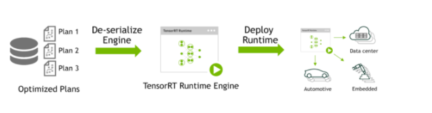

At the stage of “runtime”, inference will be completed. And Kernel Auto-Tuning and Dynamic Tensor Memory will be implemented in this stage. Firstly, deserialize the plan file generated in the previous step, and create a runtime engine. Then, you can input data (such as the test set or pictures outside the data set). Finally output the classification vector results or detection results.

## 10.3 Lesson 3 Image Card Training

When the data set is large, it is not recommended to employ Jetson Nano for training. Due to the limitation of the speed and memory of I/O interface, the training will be slow. And it is recommended to use a computer with a discrete graphics card for training and the training process is the same as that of Jetson Nano. You only need to configure the related program running environment.

JetHexa has trained the required image models before delivery. If you need to train your own model, please refer to the instruction in this lesson.

Before training, please prepare the image cards to be trained. And the instruction of this lesson is based on waste card training.

### 10.3.1 Preparation

1. Prepare a laptop or a desktop computer coming with wireless network card and mouse.

2. Install and open No Machine, remote desktop tool, according to the file in “**6. Jetson Nano and Jetson Nano Expansion Board Lesson-\> Jetson Nano Basic Lesson-\> Lesson 3 Remote Desktop Connection**”.

### 10.3.2 Training Process

### 10.3.3 Create a New Data Set Folder

1. Create a folder under any path, for example **My_Data**, to store the data set. To prevent the training from affecting the normal use of other files, it is recommended to create the folder under “**Files-\>Home**”.

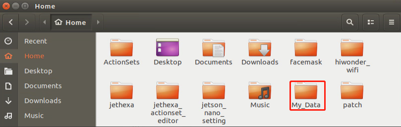

2. Create three folders under **My_Data,** including “**Annotations**” (used to store annotation file), “**ImageSets**” (used to keep path file of data set) and “**JPEGImages**” (use to save the pictures of data set)

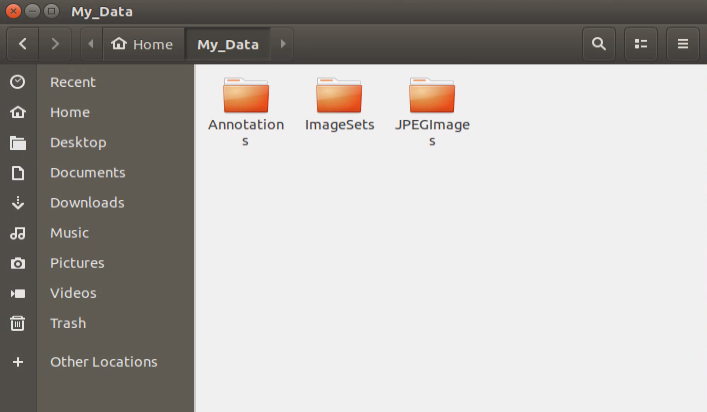

### 10.3.4 Prepare Data Set

The pictures can be found on the Internet. To reduce the performance required by the subsequent annotation and training, you can modify the resolution of the picture as 640\*480. The resolution of the picture taken by “**Capture**” is **640\*480** by default.

Take training the pictures taken by “**Capture**” for example. Please ensure the attributes of the pictures are consistent.

1. Double click 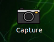 on the desktop to turn on the camera and take some photos.

If “**Capture**” cannot be opened, it probably because the auto-start service is not enabled and you need to turn on the camera manually. Click  to open command line terminal, and input command “**roslaunch jethexa_peripherals camera.launch**” to turn on the camera. After that, click  to open the tool again.

2. Click “**Select**”, and select “**/home/hiwonder/My_Data/JPEGImages**”. Then click “**Open**” to store the pictures under this path.

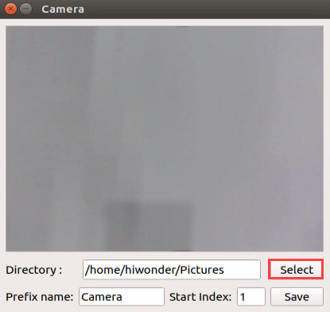

3. Put the card to be trained within the field of view of camera, and then click “**Save**” to capture the current image.

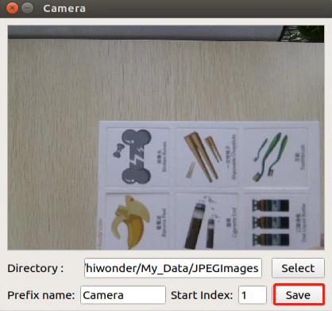

4. Move the card to capture different angle of this card to improve the reliability of the model.

### 10.3.5 Label the Picture

1. Double click “**labelImg**” icon on the desktop to open

2. Click “**Change Save Dir**” to set the directory where the labeled data is saved. Select “**/home/hiwonder/My_Data/Annotations**” and click “**Open**”.

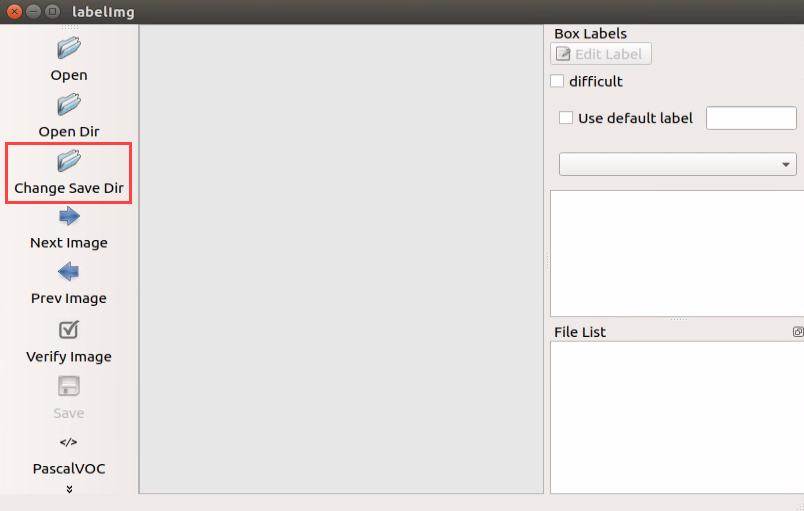

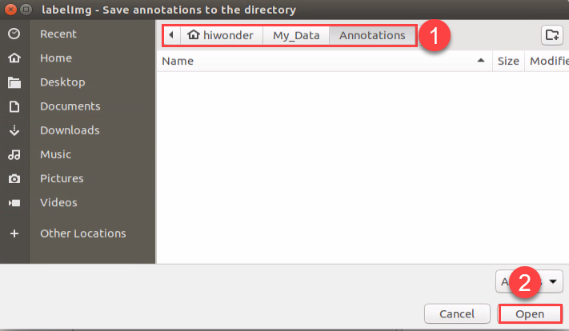

3. Click “**Open Dir**” to open the folder where the pictures are preserved. Select “**/home/hiwonder/My_Data/JPEGImage**” and click “**Open**”.

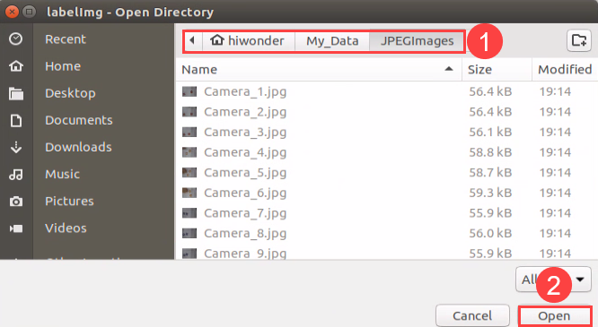

4. Click “**Create RectBox**” at the left tool bar to create a label box.

5. Move the cursor to the appropriate position. Then press the left mouse button and drag the rectangle frame to select the trained target on the picture, for example, banana card.

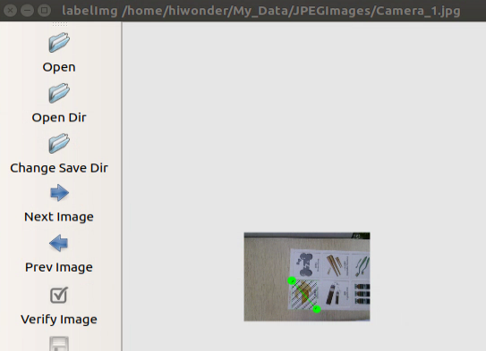

6. Release the mouse, and type the name of this card, for example **banana**, and then click “**OK**”.

7. Having finished labeling a picture, click “**Save**”, and then click “**Next Image**” to continue labeling next picture.

8. After all the pictures are labeled, xml files with the same name as pictures will be generated in “**Annotations**” folder. (Note: only when the pictures reach certain amount, the model is reliable)

### 10.3.6 Generate Related Files

1. Copy “**txt_gen.py**” and “**xml2yolo.py**” in “**10. ROS+Depth Learning Lesson/Lesson 3 Image Card Training**” to the folder “**Home/My_Data**”, and create a file named “**classes.names**”.

2. Click  on the desktop to enter the terminal.

3. Input command “**cd My_Data/**” and press Enter to enter the folder.

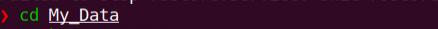

4. Input command “**python3 txt_gen.py**” and press Enter to run the program. Then xml file in “**Annotations”** and jpg file in “**JPEGImages**” with the same name will be scanned, and written into “**all.txt**” file.

5. The program will distribute the content of “**all.txt**” into “**train.txt”, “val.txt” and “test.txt”** files according to the ratio of 80% **:** 15% **:** 5%, and save these three files in “**ImageSets**” file.

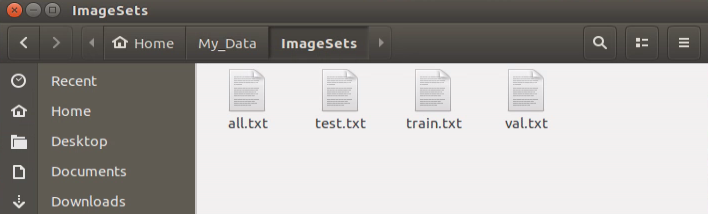

6. Modify the content of “**classes.names**” file with the file editor as the picture shown. (Note: one card can have multiple class names, but ensure there is only one name in one line.)

7. Input command “**python3 xml2yolo.py**” and press Enter. Then the program will convert the xml files corresponding to the pictures listed in “**all.txt**” into txt files required by yolo, and synchronize the files to “**JPEGImages**” folder.

8. After the files are generated, enter “**Files/Home/yolov5/data**” folder and create “**My_Data.yaml**” file with the following content.

**Note:** nc parameter represents the number of the class. And names parameter refers to the class name of the image, and its order is in line with that of “**classes.names**” file. The quantity and class name should be typed based on the pictures labeled before.

**train: /home/hiwonder/My_Data/ImageSets/train.txt**

**val: /home/hiwonder/My_Data/ImageSets/val.txt**

**\# number of classes**

**nc: 1**

**\#classes name**

**names: \['banana'\]**

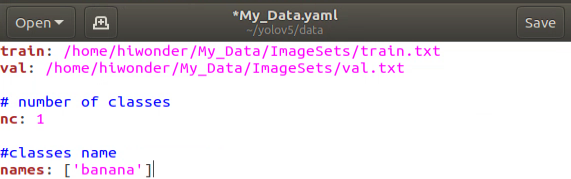

### 10.3.7 Allocate Swap Space

Image card training requires a large swap space. As the initial space of the system is not adequate, the space needs to be reallocated.

1. Input command “**df -h**” to check the memory of the system and ensure the size of the system files is the same as that of SD.

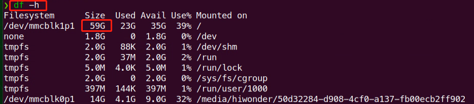

If they are not consistent, enter “**sudo /sbin/expand_fs.sh**” command to expand the system memory to the entire SD card.

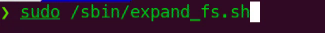

2. Input command “**sudo jtop**” to enter cpu and memory viewing program.

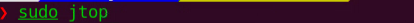

3. Click “MEM” to enter the swap space allocation interface. Then click “**S**” to start allocating, and click “**+**” sign to add memory.

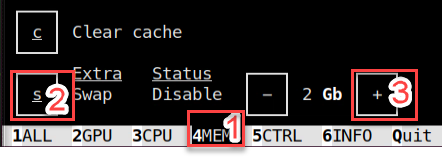

4. It is recommended to add it to 4GB. After that, click “**S**” to end the allocation.

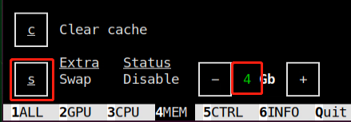

5. Lastly, click “Quit” to exit the program.

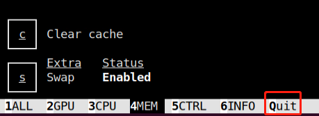

### 10.3.8 Start Training

1. Input command “**cd yolov5/**” to enter yolov5 directory.

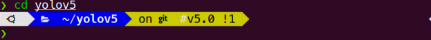

2. Type command “**python3 train.py --img-size 160 --weights yolov5s.pt --data data/My_Data.yaml --batch-size 4 --epochs 10**” and press Enter to start training.

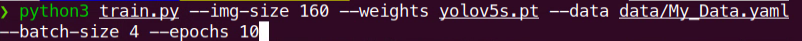

3. Having accomplished training, related files will be generated in “**yolov5/runs/train**”.

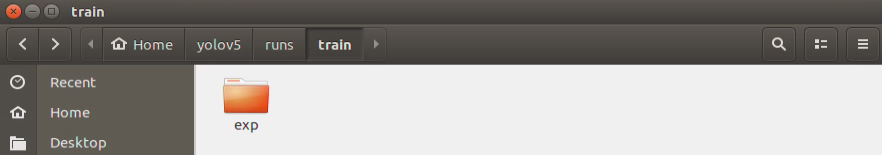

### 10.3.9 Convert Format

In order to enable neural network data to convert on different architectures, we need to convert pytorch weights file to onnx format and then to tensorrt format.

1. Input command “**cd yolov5/**” to enter yolov5 directory.

2. Input command “**python3 models/export.py --weights runs/train/exp/weights/best.pt --img-size 160 --batch-size 1**” and press Enter to convert the pytorch weight file into onnx format. (Note: “**exp**” in the command should be modified based on the actual folder generated in “**yolov5/runs/train/**”.)

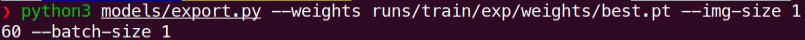

3. After the files are converted into onnx format, “**best.onnx**” file will be generated under “**Home/yolov5/runs/train/exp/weights**”.

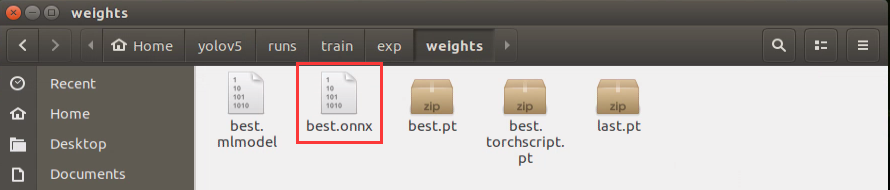

4. Input command “**onnx2trt runs/train/exp/weights/best.onnx -o best.trt**” and press Enter to convert the files from onnx into tensorrt format. ((Note: “**exp**” in the command should be modified based on the actual folder generated in “**yolov5/runs/train/**”.)

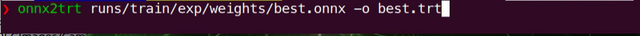

5. After conversion, “**best.trt**” file will be generated under yolov5 directory.

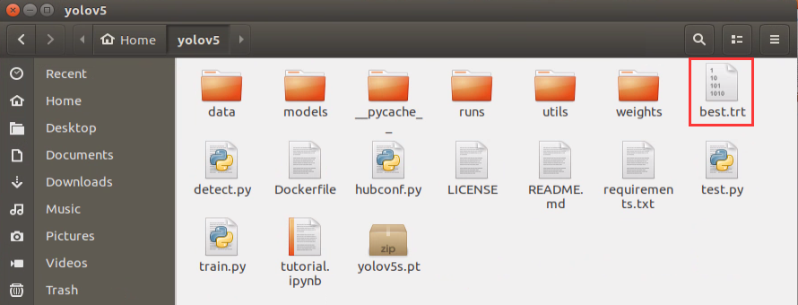

## 10.4 Lesson 4 Waste Sorting

### 10.4.1 Program logic

Firstly, subscribe to the real-time image data released by the camera node and covert this data to numpy form. After that, input the image to yolov5 network for several operations, including scale, transpose, array expand, etc. After serial operations, the processing result will be obtained.

Next, the obtained coordinate of the waste card will be converted to the original image coordinate. And the waste card will be classified according to the set rules to obtain its category name. Next the waste will be framed, then its name and recognition confidence will be displayed.

The source code of the program lies in **/home/hiwonder/jethexa/src/jethexa_tutorial/scripts/ros_dl_04_waste_classification.py**

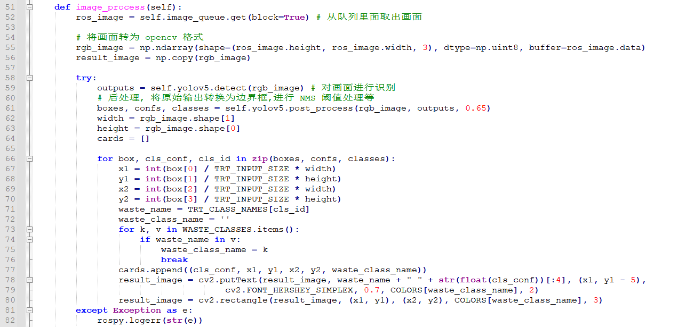

### 10.4.2 Operation Steps

The entered command should be case-sensitive. And the keywords can be complemented by the Tab key.

**1. Start JetHexa, and then connect to ubuntu desktop through NoMachine.**

**2.** **Click  or press “**Ctrl+Alt+T**” to open command line terminal.**

**3.** **Input command “**roslaunch jethexa_tutorial ros_dl_04_waste_classification.launch**” and press Enter to start the game**

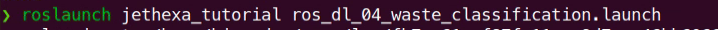

**4.** **If want to close this game, please press “**Ctrl+C**”. If the game cannot be closed, please press the key again.**

### 10.4.3 Program Outcome

After the game starts, face the waste cards to the camera. When the camera recognizes the waste cards, the corresponding names of the waste cards will be displayed on the screen and they will be framed with different color based on their category. Hazardous waste is marked in red, recyclable waste is marked in blue, food waste is marked in green and other wastes are marked in gray.

|   **Category**   |                  **Card**                   |
| --- | --- |
| hazardous_waste  | Storage Battery, Marker, Oral Liquid Bottle |
| recyclable_waste |    Plastic Bottle, Umbrella, Toothbrush     |
|    food_waste    |      Banana Peel, Ketchup, roken Bones      |
|  residual_waste  | Cigarette End, Plate, Disposable Chopsticks |

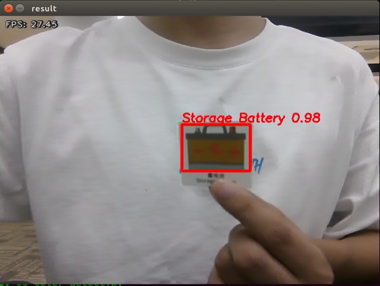

### 10.4.4 Program Analysis

Machine learning is to make comparison between collected information about the waste cards and waste model already learned to obtain the accurate recognition result.

After running the program, call “**rospy.Subscriber()**” function first to turn on the camera, and retrieve the picture taken by the camera.

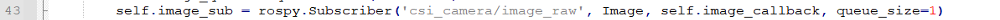

The topic parameter of each camera is different. Monocular camera is “**csi_camera/image_raw**”, and the depth camera is “**/camera/rgb/image_raw**”.

- **Image Detection**

After obtaining the image data collected by the camera, convert the data format and color space. Then pass the preliminary processed image data to **yolov5.detect()** function for target detection in order to extract the digital information in the image. Then output the detected result to the “**outputs**” variable.

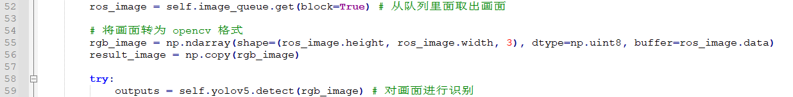

- **Information Obtaining**

It is not convenient to use the detected result of the image directly. Hence, we need to convert and process the result with **post_process()** function later to obtain the visual information, including coordinate, confidence, category name, etc. The program is as follow

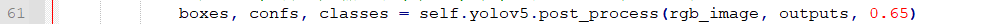

Parameter “**boxes**” represents the coordinate of the card.

Parameters “**confs**” represents the confidence of the card

Parameter “**classes**” represents the category of the card

Parameter “**rgb_image**” represents the image to be detected

Parameter “**outputs**” represents the image information

Parameter “**0.65**” represents only when the confidence is more than 0.65, the direct information can be obtained.

- Obtained Information Feedback

After obtaining the detected information, the following information will be given.

1. Use **cv2.putText()** function to add text on picture. The text is about the waste name and recognition confidence

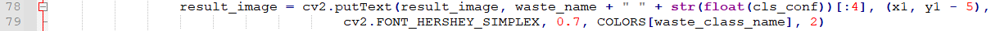

The first parameter “**image**” represents the specific picture to which the text explanation is added.

The second parameter “**waste_name +**” “ **+ str(float(cls_conf))\[:4\]**” represents the added content. “**waste_name**” represents the waste name. “**str(float(cls_conf))\[:4\]**” represents the corresponding confidence of the waste.

The third parameter “**(x1, y1 - 5)**” represents the coordinate of the added text.

The fourth parameter “**cv2.FONT_HERSHEY_SIMPLEX**” represents the font of the added text.

The fifth parameter “**0.7**” represents the font size of the added text.

The sixth parameter “**COLORS\[waste_class_name\]**” represents the color of the added text. Please refer to the below program for the specific settings.

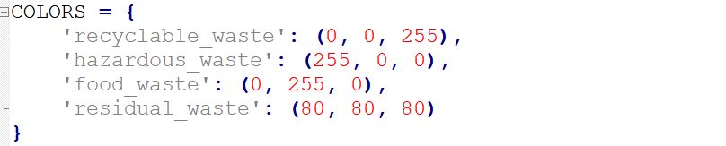

Take “**'hazardous_waste': (255, 0, 0)**” for example. These 3 values all ranges from 0 to 255. It represents that the text consists of three colors, including red, green and blue. The first parameter “**255**” represents red value, the second value “**0**” represents green value, and the third parameter “**0**” represents blue value.

The seventh parameter “**2**” represents the font weight of the added text.

2. Use cv2.rectangle() function to draw the rectangle frame to frame the waste card.

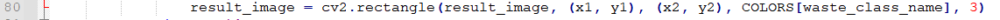

The first parameter “image” represents the specific image on which the frame is drawn.

The second parameter “(x1, y1)” represents the start coordinate of the rectangle

The third parameter “(x2, y2)” represents the end coordinate of the rectangle

The fourth parameter “**COLORS\[waste_class_name\]**” represents the color of the rectangle border to be drawn

The fifth parameter “**3**” represents the width of the rectangle border

## 10.5 Lesson 5 Mask Identification

### 10.5.1 Program logic

The process of mask identification is divided into 3 parts.

**Step 1: obtain and process image**

> Firstly, subscribe to real-time image data released by camera node. Next, convert it to numpy format, then perform color space conversion to obtain the image in BGR format.

**Step 2: recognize and process the mask**

> After the image is obtained and processed, transfer it to **yolov5_tensorrt** library for mask recognition and information processing to obtain the real-time coordinate and recognition confidence of human face wearing a mask.

**Step 3: display recognition result**

> Lastly, use the algorithms to traverse all the obtained object contour to find the contour with largest area. And mark the human face wearing a mask in blue frame.

The source code of this program is in

**/home/hiwonder/jethexa/src/jethexa_tutorial/scripts/ros_dl_11_facemask.py**

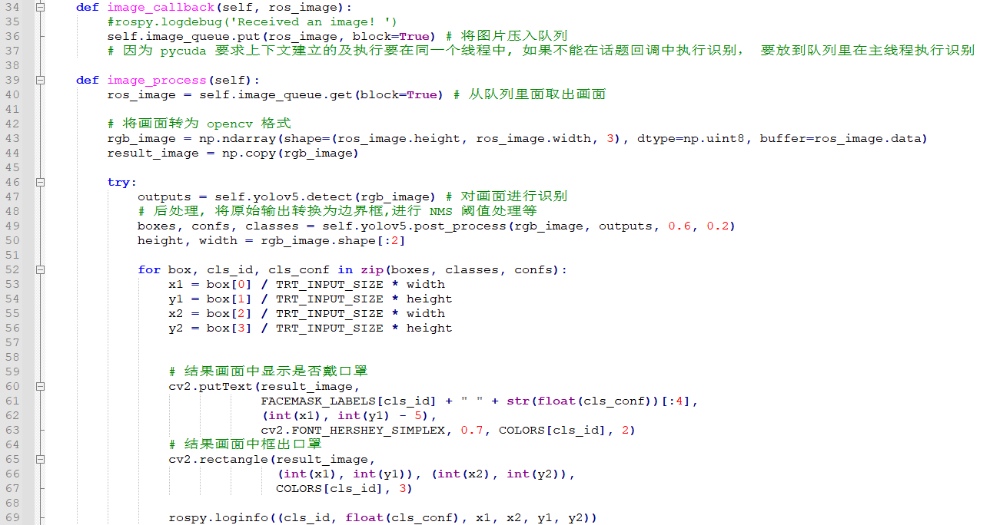

### 10.5.2 Operation Steps

The entered command should be case-sensitive. And the keywords can be complemented by the Tab key.

**1. Start JetHexa, and then connect to ubuntu desktop through NoMachine.**

**2.** **Click  or press “**Ctrl+Alt+T**” to open command line terminal.**

**3.** **Input command “**roslaunch jethexa_tutorial ros_dl_11_facemask.launch**” and press Enter to start the game**

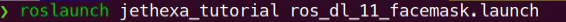

**4.** **If want to close this game, please press “**Ctrl+C**”. If the game cannot be closed, please press the key again.**

### 10.5.3 Program Outcome

After the game starts, the camera will recognize human face wearing a mask, and then human face will be marked with blue frame.

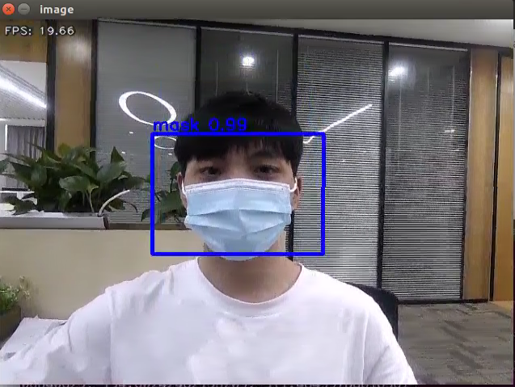

### 10.5.4 Program Analysis

Machine learning is to make comparison between collected image information and mask image model already learned to obtain the accurate recognition result.

After running the program, first call **rospy.Subscriber()** function to turn on the camera first, and then retrieve the picture taken by the camera. The program is as follow.

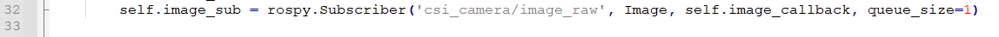

The topic parameter of each camera is different. Monocular camera is “**csi_camera/image_raw**”, and the depth camera is “**/camera/rgb/image_raw**”.

- **Mask Identification**

After obtaining the image data collected by the camera, convert the data format and color space. Then pass the preliminary processed image data to yolov5.detect() for target detection in order to extract the image information. Then output the detected result to the “**outputs**” variable.

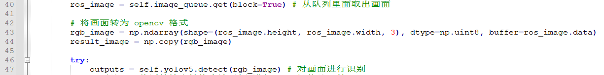

- **Information Obtaining**

It is not convenient to use the detected result of the image directly. Hence, we need to convert and process the result with **post_process()** function later to obtain the visual information, including coordinate, confidence, category name, etc. The program is as follow.

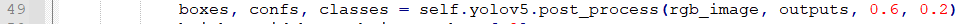

Parameter “**boxes**” represents the obtained coordinate of human face or mask

Parameter “**confs**” represents the recognition confidence of human face or mask

Parameter “**classes**” represents the category of the image

Parameter “**rgb_image**” represents the image to be detected

Parameter “**outputs**” represents the image information

Parameter “**0.6**” represents only when the recognition confidence is more than 0.6, the direct information can be obtained

Parameter “**0.2**” represents non-maximum suppression which is used to suppress the redundant box.

- **Obtained Information Feedback**

After obtaining the detected information, related information will display on VNC software.

1. Use **cv2.putText()** function to add text on picture to display the picture information and confidence.

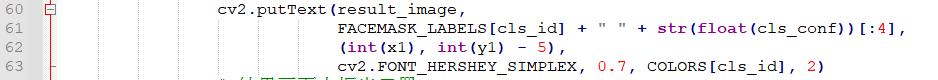

The first parameter “**result_image**” represents the specific picture to which the text is added.

The second parameter “**FACEMASK_LABELS\[cls_id\] + " " + str(float(cls_conf))\[:4\]**” represents the added text content. “**FACEMASK_LABELS\[cls_id\]**” indicates whether the people wear a mask or not. “**str(float(cls_conf))\[:4\]**” represents the confidence of the detected human face or mask.

The third parameter “**(int(x1), int(y1) - 5)**” represents the coordinate of the added text

The fourth parameter “**cv2.FONT_HERSHEY_SIMPLEX**” represents the font of the added text

The fifth parameter “**0.7**” represents the font size of the added text

The sixth parameter “**COLORS\[cls_id\]**” represents the color of the added text

The seventh parameter “**2**” represents the font weight of the added text

2. Use **cv2.rectangle()** function to draw rectangle frame and frame human face or the mask.

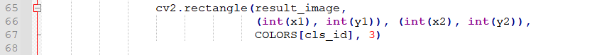

The first parameter “**result_image**” represents the specific image of the drawn frame

The second parameter “**(int(x1), int(y1))**” represents the starting coordinate of the rectangle

The third parameter “**(int(x2), int(y2))**” represents the end coordinate of the rectangle

The fourth parameter “**COLORS\[cls_id\]**” represents the color of rectangle border

The fifth parameter “**3**” represents the width of the rectangle border.
