# 11. AI Creative Lesson

## 11.1 Monocular Camera AI Vision Games

### 11.1.1 Lesson 1 Face Detection and Tracking

#### 11.1.1.1 Program Logic

Firstly, build the model of face detection, and subscribe the topic published by camera node to obtain the RGB image.

Next, detect and process the human face in the image to confirm the target.

Lastly, according to the distance between the human face center and the image center, JetHexa will be controlled to track human face.

The source code of this program is stored in **/home/hiwonder/jethexa/src/jethexa_tutorial/scripts/ros_ai_creative_mankind_02_face_tracking.py**

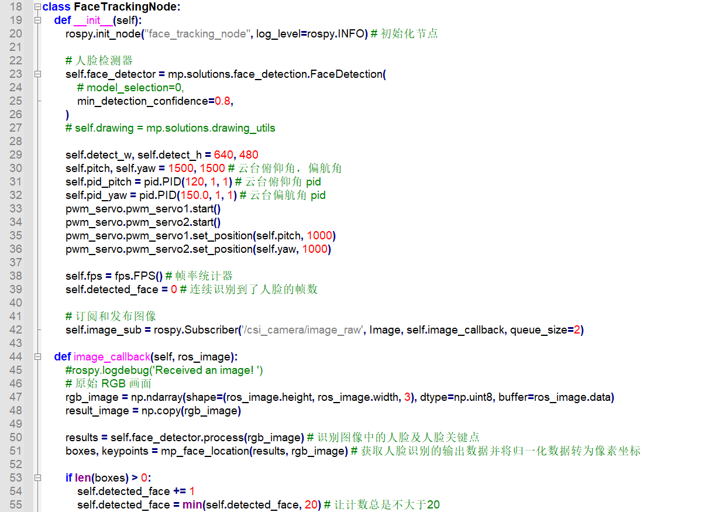

#### 11.1.1.2 Operation Steps

The entered command should be case-sensitive. And the keywords can be complemented by the Tab key.

**1. Start JetHexa, and then connect to ubuntu desktop through NoMachine.**

**2.** **Click  or press “**Ctrl+Alt+T**” to open command line terminal.**

**3.** **Input command “**roslaunch jethexa_tutorial ros_ai_creative_mankind_02_face_tracking.launch**” and press Enter to start the game**

**4.** **If want to close this game, please press “**Ctrl+C**”. If the game cannot be closed, please press the key again.**

#### 11.1.1.3 Program Outcome

After the game starts, put your face within the field of view of the camera. When recognizing human face, JetHexa will adjust the rotation angle of the pan-tilt servo according to the position of human face so as to accomplish human face tracking. In addition, the pitch angle and yaw angle will be printed on the terminal. And human face and key points of the face will be marked on the returned screen.

#### 11.1.1.4 Program Analysis

#### 11.1.1.5 Basic Configuration

- **Import Library**

Import the library required by the program.

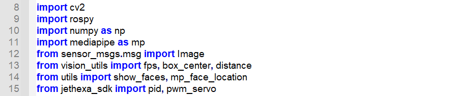

- **Face Detection Model**

Import the face detection sample in **MediaPipe**. Set the minimum detection confidence as 0.8. If the probability of face detection is greater than this value, the detection is successful.

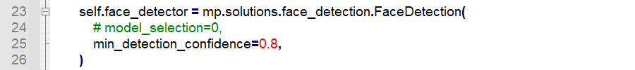

MediaPipe is an open source multi-media framework for machine learning model released by Google Research. Based on graphical cross-platform framework, it is used for building multi-mode (video, audio and sensor) machine learning pipe.

Solutions are open source pre-built examples based on specific pre-trained TensorFlow or TFLite models. Face detection (mediapipe.solutions.face_detection), hand key point detection (mediapipe.solutions.hands), human pose detection ( mediapipe.solutions.pose), etc., are commonly used Solutions.

- **Subscribe Topic**

Subscribe the topic published by the camera node to obtain the camera image in real-time.

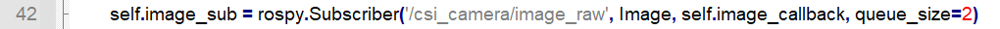

#### 11.1.1.6 Face Detection

- **Search Human Face**

Detect the human face within the camera image, and then normalize the data and convert it to pixel coordinates.

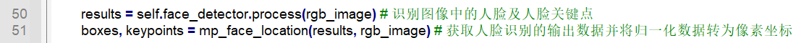

- **Select Target Human Face**

If the human face is detected in continuous 5 frames, control the pan-tilt servo to track, which will avoid misrecognition.

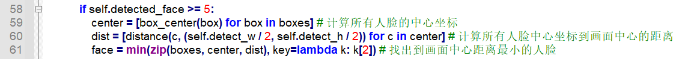

When multiple human faces are detected within the camera image, then the program will calculate the distance between the face center and the image center, and the face whose center is closest to the image center will be targeted.

#### 11.1.1.7 Human Face Tracking

- **Normalization**

Normalize the distance between the face center and the image center, and limit the value range to -1 to +1, which will reduce computation.

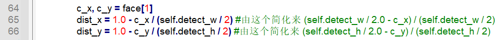

- **Adjust Pitch Angle**

If the difference between Y-axis coordinate of human face and that of image center is greater than the set threshold, adjust the PID controller of the pitch angle.

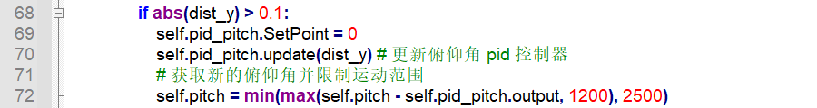

- **Adjust Yaw Angle**

If the difference between X-axis coordinate of human face and that of image center is greater than the set threshold, adjust the PID controller of the pitch angle.

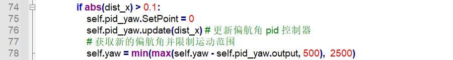

- **Information Printing**

Call print() function to print pitch angle and yaw angle on the terminal.

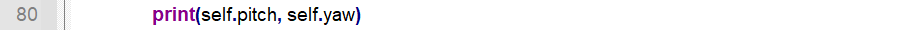

- **Servo Control**

Call **pwm_servo.pwm_servo1.set_position()** function in **jethexa_sdk** library to control the JetHexa’s head to rotate horizontally. And pwm_servo.pwm_servo2.set_position() function is for controlling its head to rotate vertically.

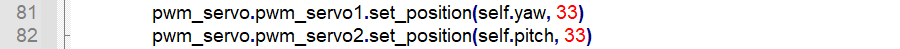

Take “**pwm_servo.pwm_servo1.set_position(self.yaw, 33)**” for example. The meaning of the parameters in the bracket is as follow.

The first parameter “**self.yaw**” is the position where the servo rotates, represented by pulse width. The conversion formula of pulse width and angle is: **pulse width = 11.1 x Angle + 500** (this formula is for reference only)

The second parameter “**33**” is the servo rotation time in millisecond.

- **Marking**

Call **show_faces()** function in utils library and **imshow()** function in cv2 library to mark the the target human face and its key points on the camera returned image.

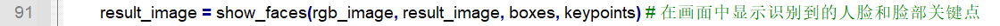

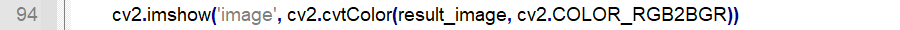

### 11.1.2 Lesson 2 Gesture Recognition

#### 11.1.2.1 Program Logic

Firstly, build the model of hand recognition, and subscribe the topic published by camera node to obtain the RGB image.

Next, flip the RGB image and detect the hand within image.

Lastly, display the recognition result on the terminal and the camera returned image.

The source code of this program is stored in

**/home/hiwonder/jethexa/src/jethexa_tutorial/scripts/ros_dl_07_hand_detect.py**

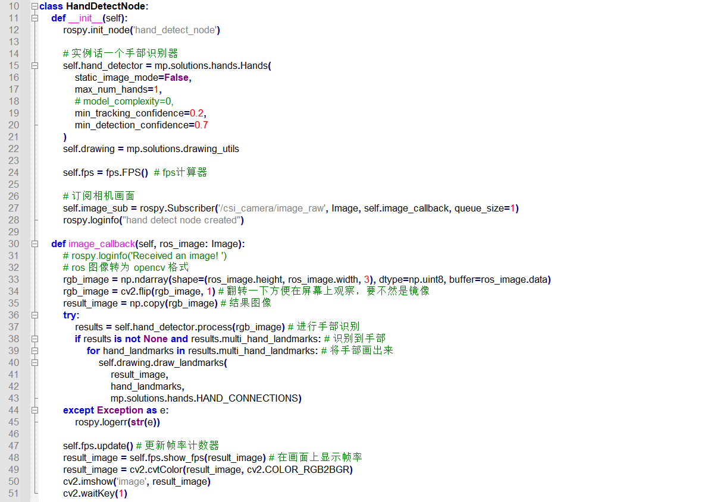

#### 11.1.2.2 Operation Steps

The entered command should be case-sensitive. And the keywords can be complemented by the Tab key.

1. Start JetHexa, and then connect to ubuntu desktop through NoMachine.

2. Click  or press “**Ctrl+Alt+T**” to open command line terminal.

3. Input command “**roslaunch jethexa_tutorial ros_dl_07_hand_detect.launch**” and press Enter to start the game

4. If want to close this game, please press “**Ctrl+C**”. If the game cannot be closed, please press the key again.

#### 11.1.2.3 Program Outcome

After the game starts, make a gesture within the field of view of the camera. When JetHexa recognizes the gesture, the key points of the hand will be marked on the camera returned image.

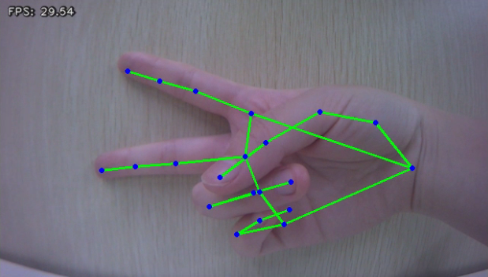

#### 11.1.2.4 Program Analysis

#### 11.1.2.5 Basic Configuration

- **Import Library**

Firstly, import the library required by the program.

- **Hand Key Point Detection Model**

Import the hand recognition sample in MediaPipe

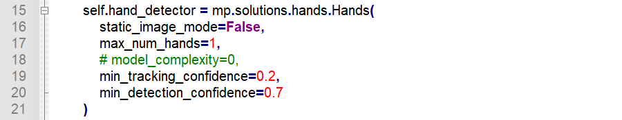

**1.** **The first parameter “**static_image_mode**” is the processing mode of the input image, and it is set as “**False**” by default representing that the input image is video streaming that is landmark tracking will be performed on the subsequent images after the first picture is detected. When the tracking ends in failure, the image will be detected again, which is beneficial to reduce computation and latency.**

When this parameter is set as “**True**”, the program will detect all the input images. This method is suitable to detect a batch of static and unrelated images.

**2.** **The second parameter “**max_num_hands**” refers to the maximum detection quantity of hands at once.**

**3.** **The third parameter “**min_tracking_confidence**” is the minimum tracking confidence of the coordinate tracking model ranging from 0 to 1. When “**static_image_mode**” is set as “**True**”, this parameter is invalid.**

**4.** **The fourth parameter “**min_detection_confidence**” is the minimum detection confidence of the hand detection model ranging from 0 to 1. If the hand detection probability within the error range is greater than this value, the detection is successful.**

#### 11.1.2.6 Hand Key Point Detection

- **Subscribe Topic**

Subscribe the topic published by the camera node to obtain the camera image in real time.

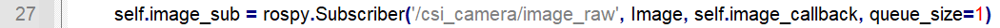

- **Flip**

The obtained image is a mirror image. To better check the recognition result, **flip()** function in cv2 library can be called to flip the image.

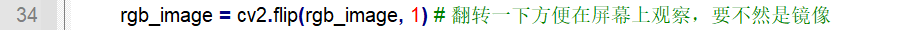

The first parameter “**rgb_image**” in the bracket is the input image, the second parameter “**1**” refers to the way to flip. When this parameter is set as **1**, the image will be flipped horizontally. “**0**” means the image will be flipped vertically. And when it takes “**1**”, the image will be flipped horizontally and vertically.

- **Hand Key Point Detection**

Detect the key points of the hand within the image based on the hand recognition model previously built.

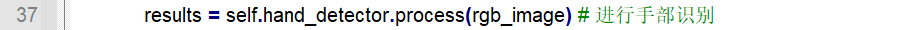

#### 11.1.2.7 Information Feedback

- **Connect Hand Key Points**

Call **solutions.drawing_utils.draw_landmarks()** function in mediapipe library to connect the key points of the hand with line.

The first parameter “**result_image**” is the input image.

The second parameter “**hand_landmarks**” is the coordinate of the detected hand key point

The third parameter represents the line connecting the coordinates.

- **Output Camera Returned Image**

Call imshow() function in cv2 library to generate a window titled “**image**”.

### 11.1.3 Lesson 3 Emotion Recognition

#### 11.1.3.1 Program Logic

Firstly, import the method of human face recognition from MediaPipe to build a emotion classifier.

Then, subscribe the topic published by camera node to obtain the RGB image, and scale and flip the image.

Next, detect the human face and facial key points within the image, and perform emotion recognition and classify the detected human faces.

Lastly, display the recognition result on the terminal and the camera returned image.

The source code of this program is stored in：**/home/hiwonder/jethexa/src/jethexa_tutorial/scripts/ros_dl_09_facial_expression.py**

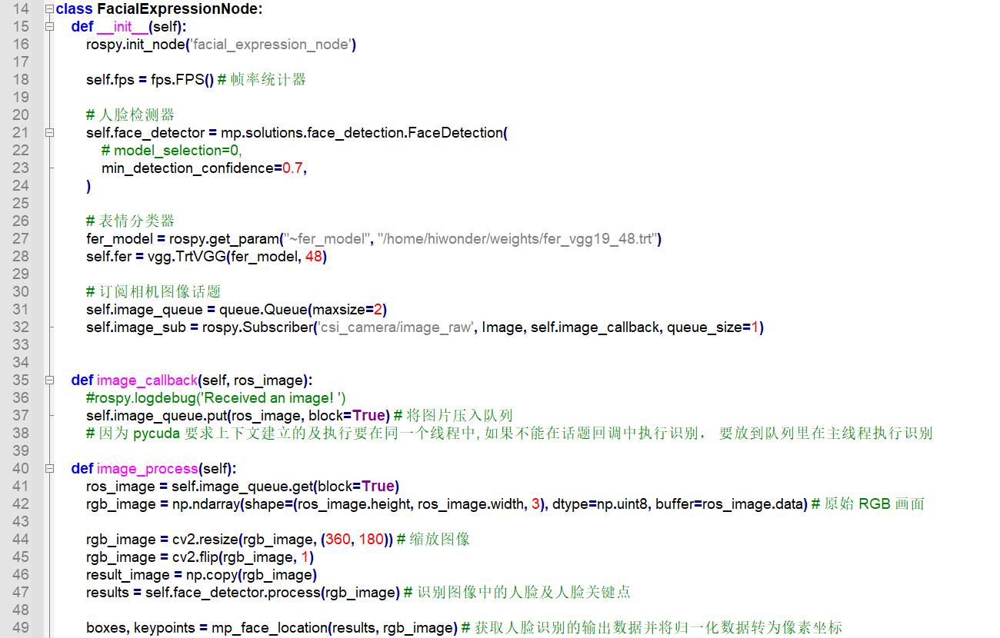

#### 11.1.3.2 Operation Steps

The entered command should be case-sensitive. And the keywords can be complemented by the Tab key.

1. Start JetHexa, and then connect to remote desktop through NoMachine.

2. Click  or press “**Ctrl+Alt+T**” to open command line terminal.

3. Input command “**roslaunch jethexa_tutorial ros_dl_09_facial_expression.launch**” and press Enter to start the game

4. If want to close this game, please press “**Ctrl+C**”. If the game cannot be closed, please press the key again.

#### 11.1.3.3 Program Outcome

After the game starts, put your face within the field of view of the camera. When recognizing the facial expressions, the probability of occurrence of the facial expressions will be printed on the terminal. And the type of facial expression with the maximum probability of occurrence will be printed on the camera returned image, and the target face and facial key points will be marked.

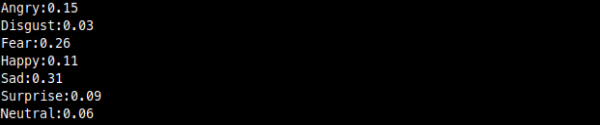

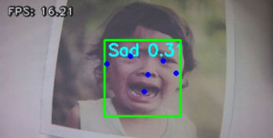

#### 11.1.3.4 Program Analysis

Firstly, import the library required by the program.

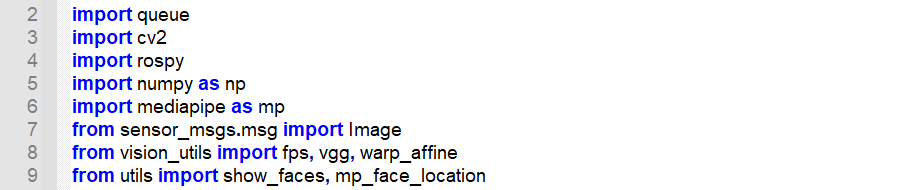

**7. kinds of emotions can be recognized, including Angry, Disgust, Fear, Happy, Sad, Surprise and Neutral (poker face).**

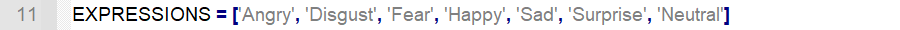

#### 11.1.3.5 Model Building

- **Face Detection Model**

Import the face detection sample of MediaPipe, and set the minimum detection confidence as 0.7. If the probability of face detection is greater than this value, face detection is successful.

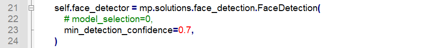

MediaPipe is an open source multi-media framework for machine learning model released by Google Research. Based on graphical cross-platform framework, it is used for building multi-mode (video, audio and sensor) machine learning pipe.

Solutions are open source pre-built examples based on specific pre-trained TensorFlow or TFLite models. Face detection (mediapipe.solutions.face_detection), hand key point detection (mediapipe.solutions.hands), human pose detection ( mediapipe.solutions.pose), etc., are commonly used Solutions.

- **Emotion Classification Model**

Configure model file and build a emotion classification model.

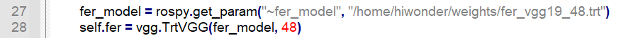

#### 11.1.3.6 Emotion Recognition

- **Subscribe Topic**

Subscribe the topic published by the camera node to obtain the camera image in real-time.

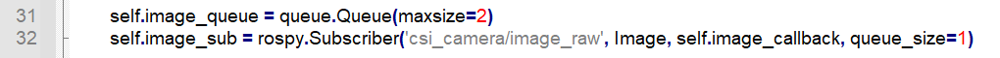

- **Zoom the Image**

Adopt resize() function in cv2 library to scale the image so as to reduce computation.

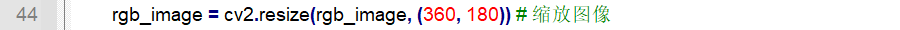

The first parameter “**rgb_image**” refers to the input image, and the second parameter “**(360, 180)**” represents the width and length of the image after zooming.

- **Face Recognition**

Detect the human face within the image, and normalize the data, and then convert it into pixel coordinate.

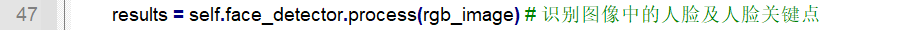

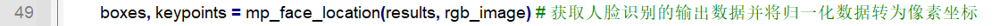

- **Emotion Classification**

Recognize the emotion of the target human face based on the previous emotion classification model.

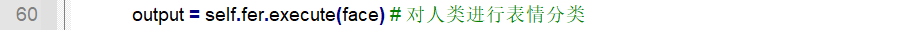

#### 11.1.3.7 Information Feedback

- **Print the result of emotion classification**

Call print() function to print the classification result of the emotion i.e. matching rate on the terminal

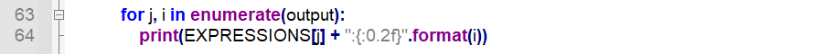

- **Obtain the Most Suitable Emotion**

argmax() function in numpy library is used to return the maximum index of the designated axis. The emotion with largest matching rate among the emotion classification result.

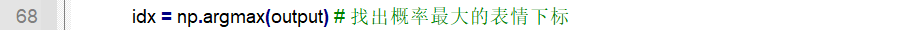

- **Mark**

Call putText() function in cv2 library to mark the target human face and the facial key points on the camera returned image.

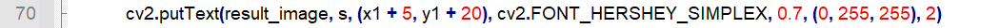

The first parameter “**result_image**” refers to the input image.

The second parameter “**s**” is the added text i.e. the type of the emotion.

The third parameter “**(x1 + 5, y1 + 20)**” is the coordinate of the upper left corner of the added text.

The fourth parameter “**cv2.FONT_HERSHEY_SIMPLEX**” is the font of the added text.

The fifth parameter “**0.7**” is the font size.

The sixth parameter “**(0, 255, 255)**” is the font color, and the values respectively correspond to B, G and R.

The seventh parameter “**2**” refers to font weight.\]

### 11.1.4 Lesson 4 Line Following

#### 11.1.4.1 Program Logic

Firstly, the program will obtain the threshold range of the target color from the parameter server, and subscribe the topic published by camera node to get RGB image.

Then, perform Gaussian filtering, binaryzation, corrosion and dilation on the image to gain the maximum contour of target color in the RGB image.

Next, based on the contour, calculate the offset of JetHexa relative to the line.

Lastly, update the PID controller to control the robot to prowl following the line.

The source code of this program is kept in：**/home/hiwonder/jethexa/src/jethexa_tutorial/scripts/ros_ai_creative_pilot_02_following.py**

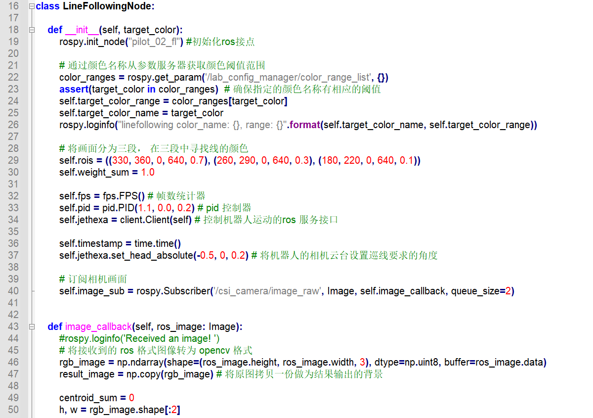

#### 11.1.4.2 Operation Steps

The entered command should be case-sensitive. And the keywords can be complemented by the Tab key.

1. Start JetHexa, and then connect to remote desktop through NoMachine.

2. Click  or press “**Ctrl+Alt+T**” to open command line terminal.

3. Input command “**roslaunch jethexa_tutorial ros_ai_creative_pilot_02_following.launch color:=red**” and press Enter to start the game. If you want to change the color, you can change “red” to the color you want.

4. If want to close this game, please press “**Ctrl+C**”. If the game cannot be closed, please press the key again.

#### 11.1.4.3 Program Outcome

**Note: before the game starts, please use the tape in target color to set the line, and the default recognition color is red.**

Place JetHexa on the line. After the game starts, JetHexa will prowl along the line when recognizing the target color. And the tilt angle and data of PID controller will be printed on the terminal, and the center of line segment will be marked on the camera returned image.

#### 11.1.4.4 Program Analysis

#### 11.1.4.5 Basic Configuration

- **Import Library**

Firstly, import the library required by the program.

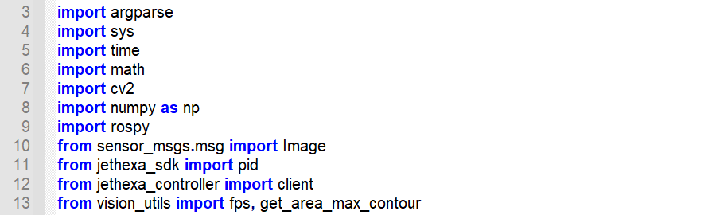

- **Command Line Interface**

Create the command line interface with Argparse module, which contains creating parser, adding parameters, and parsing parameters.

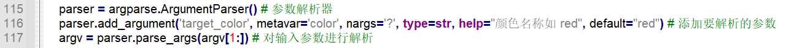

Take “**parser.add_argument('target_color', metavar='color', nargs='?', type=str, help="颜色名称如 red", default="red")**” for example. The meaning of the parameters in bracket is as follow.

The first parameter “**'target_color'**” is color name or a list of option strings.

The second parameter “**metavar='COLOR NAME**” is the parameter name displayed when the user obtain the **help** information.

The third parameter “**nargs='?'**” refers to the quantity of the command line parameters that should be consumed.

The fourth parameter “**type=str**” indicates the type of the parameter.

The fifth parameter “**help="颜色名称"**” is the simple description of the option.

The sixth parameter “**default="red"**’ is the default parameter, which means that the default recognition color is red.

- **Obtain Color Threshold Range**

Obtain the color threshold range of target color from the parameter server.

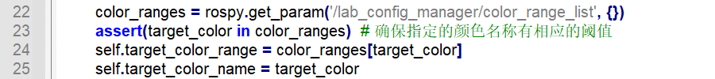

- **Initialize PID Controller**

Initialize PID controller and set the initial value.

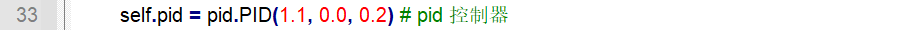

- **Initialize Servo**

Set the rotation angle of the camera pan-tilt.

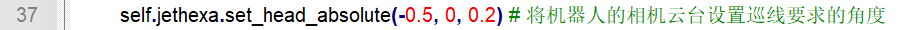

The first parameter “**-0.5**” is the pitch angle

The second parameter “**0**” refers to the yaw angle.

The third parameter “**0.2**” indicates the rotation duration.

- **Subscribe Topic**

Subscribe the topic published by camera node to obtain the real-time camera view.

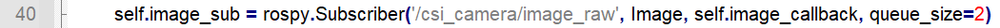

#### 11.1.4.6 Image Processing

- **Color Space Conversion**

Call cvtColor() function in cv2 library to convert color space from RGB into LAB.

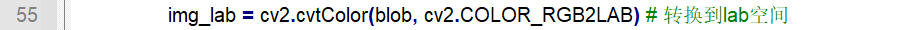

The first parameter “**blob**” is the input image, and the second parameter “**cv2.COLOR_RGB2LAB**” refers to the type to which the image is converted.

- **Gaussian Filtering**

Call GaussianBlur() function in cv2 library to perform Gaussian filtering on the image so as to remove image noise.

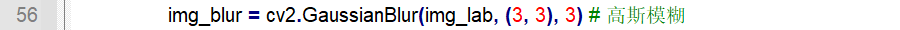

The first parameter “**rgb_image**” is the input image

The second parameter “**(3, 3)**” is the size of Gaussian convolution kernel, and its height and width must be positive number and odd number.

The third parameter "**3**" is the standard deviation of the Gaussian kernel in the horizontal direction.

- **Binaryzation**

Adopt **inRange()** function in cv2 library to perform binaryzation on the image.

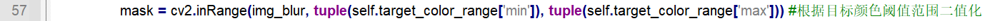

The first parameter “**img_blur**” is the input image.

The second parameter “**tuple(self.target_color_range\['min'\])**” is the minimum value of the color threshold.

The third parameter “**tuple(self.target_color_range\['max'\])**” is the maximum value of the color threshold.

When the RGB value of a pixel is within the color threshold range, this pixel will be assigned as “**1**”, otherwise “**0**”.

- **Corrosion and Dilation**

Perform corrosion and dilation on the image to smooth the contour edge of the image for better searching the target contour.

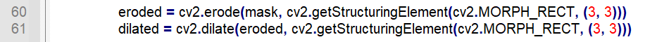

erode() function is used to execute corrosion. Take “**eroded = cv2.erode(mask, cv2.getStructuringElement(cv2.MORPH_RECT, (3, 3)))**” for example. The meaning of the parameters in bracket is as follow.

The first parameter “**mask**” is the input image.

The second parameter “**cv2.getStructuringElement(cv2.MORPH_RECT, (3, 3))**” is the structuring element or kernel deciding the nature of the operation. And the first parameter in the bracket is the kernel shape and the second parameter is the dimension of the kernel.

dilate() function is used for dilation. The meaning of the parameters in the bracket is the same as that of erode() function.

- **Contour Searching**

Call findContours() function in cv2 library to search all contours in target color within the image.

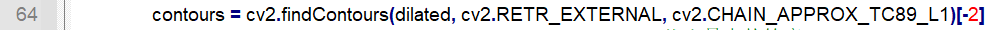

The first parameter “**dilated**” stands for the input image.

The second parameter “**cv2.RETR_EXTERNAL**” is the mode of contour retrieving.

The third parameter “**cv2.CHAIN_APPROX_TC89_L1**” is the method of contour approximation.

- **Acquire the Maximum Contour**

Call **get_area_max_contour()** function to search for the eligible maximum contour.

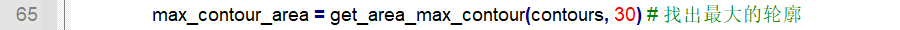

The first parameter “**contours**” is the input image. And the second parameter “**30**” is the area threshold, and the contour whose area is less than this value will be neglected.

- **Smallest Circumscribed Rectangle of the Contour**

Call minAreaRect() function in cv2 library to acquire the smallest circumscribed rectangle of the maximum contour.

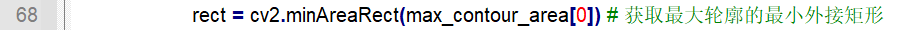

- **Draw Rectangle**

Acquire the angular point coordinate of the circumscribed rectangle, and draw the rectangle on the camera returned image based on the coordinate.

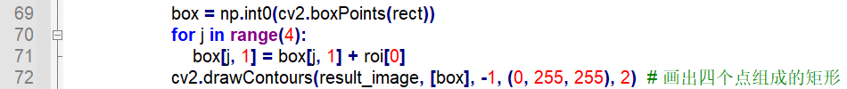

The first parameter “**result_image**” is the input image.

The second parameter “**\[box\]**” represent the contour, and in Python, it stands for **List**.

The third parameter “**-1**” determines which contour to be drawn among the contour list. When it is set as “**-1**”, all the contours in the list will be drawn.

The fourth parameter “**(0, 255, 255)**” stands for the color of the contour, and the values respectively corresponds to B, G and R.

The fifth parameter “**2**” is the width of the contour border. When it is set as “**-1**”, the contour will be filled.

- **Mark the Center of Line Segment**

Call circle() function in cv2 library to draw the dot to mark the center of the line segment.

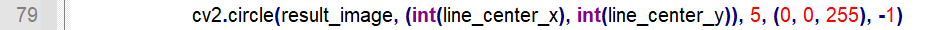

The first parameter “**result_image**” stands for the input image.

The second parameter “**(int(line_center_x), int(line_center_y))**” is the coordinate of the circle center.

The third parameter “**5**” is the radius of the circle.

The fourth parameter “**(0, 0, 255)**” represents the color of line, and the values respectively corresponds to B, G and R.

The fifth parameter “**-1**” is the width of the line. When it is set as “**-1**”, the interior of the circle will be filled.

#### 11.1.4.7 Motion Control

- **Calculate Tilt Angle**

According to the coordinate of the center of the line segment and camera image, calculate the position offset of the JetHexa relative to the line segment i.e. tilt angle.

- **Update PID Controller**

Call pid.update() function in jethexa_sdk library to update the data to PID controller to control JetHexa’s movement.

- **Print on Terminal**

Call logdebug() function in rospy library to print the tilt angle and the data output by PID on the terminal.

- **Control Command**

Send the control command to the corresponding topic and restrict the sending interval between commands to ensure the robot can fully complete one step.

Take “**self.jethexa.traveling(gait=1, stride=40.0, height=15.0, direction=0.0, rotation=-pid_out, time=0.5, steps=1, interrupt=True, relative_height=False)**” for example. The meaning of the parameter is as follow.

The first parameter “**gait**” refers to the gait mode. “**0**” represents static gait, “**1**” stands for wave gait, and “**2**” represents tripod gaits.

The second parameter “**stride**” indicates step stride in mm.

The third parameter “**height**” indicates step height in mm.

The fourth parameter “**direction**” is the moving direction ranging from 0 to 360 degree. When it is set as 0~180 degree, JetHexa will move forward. When it is set as 180~360 degree, JetHexa will move backward.

The fifth parameter “**rotation**” is the turning speed in radians per second. When it is set as positive number, JetHexa will rotate counterclockwise. When it is set as negative number, JetHexa will rotate clockwise.

The sixth parameter “**time**” is the interval between each step, and its unit is second.

The seventh parameter “**steps**” is the number of the step. When it is set as “**0**”, JetHexa will keep moving.

The eighth parameter “**interrupt**” is used to set whether to interrupt JetHexa’s movement.

The ninth parameter “**relative_height**” is used to set whether the step height (third parameter) adopts the height relative to the ground. When the parameter is set as “**False**”, relative height will be adopted.

## 11.2 Depth Camera AI Vision Games

### 11.2.1 Lesson 1 KCF Target Recognition

#### 11.2.1.1 Program Logic

KCF (Kernel Correlation Filter) is proposed by Joao F. Henriques, Rui Caseiro, Pedro Martins and Jorge Batista in 2014.

KCF is a discriminative tracking method whose principle is mainly to use the cyclic matrix of the surrounding area to collect positive and negative samples to train a target detector, and use the target detector to detect whether the predicted position of the next frame is a target, and then according to the new detection result, update the training set so as to update the object detector.

The implementation process of the program is as follow.

Firstly, instantiate the KCF tracker, and subscribe the topic published by the camera node to obtain the camera image in real time.

Next, scale and copy the obtained camera image.

Lastly, employ the detection model to detect the data points within the image and mark them on the camera returned image.

The source code of this program is stored in：**/home/hiwonder/jethexa/src/jethexa_tutorial/scripts/ros_dl_12_kcf_tracking.py**

#### 11.2.1.2 Operation Steps

The entered command should be case-sensitive. And the keywords can be complemented by the Tab key.

1. Start JetHexa, and then connect to remote desktop through NoMachine.

2. Click  or press “**Ctrl+Alt+T**” to open command line terminal.

3. Input command “**roslaunch jethexa_tutorial ros_dl_12_kcf_tracking.launch**” and press Enter to start the game.

4. If want to close this game, please press “**Ctrl+C**”. If the game cannot be closed, please press the key again.

#### 11.2.1.3 Program Outcome

After the game starts, the camera returned image will show up. You can press “**s**” key to start target tracking, and select the target with the mouse, and then press “**sapce**” or “**enter**” key to start tracking.

After the tracking begins, JetHexa will move with the selected yellow object.

#### 11.2.1.4 Program Analysis

- **Press the Key to Start Tracking**

Firstly, the program will detect whether to start tracking through key detection. After pressing the key, set the attribute of **self.enable_select** as True to start target tracking.

- **Select Target Area**

Next, call **selectROI** function to select the target with the mouse.

The meaning of the parameters is as follow.

The first parameter “**image**” is the title of the window.

The second parameter “**cv2.cvtColor(result_image, cv2.COLOR_RGB2BGR)**” stands for the image for ROI selection.

The third parameter “**False**” determines whether to display the crosshair of the rectangle. “**True**” means that the crosshair will be displayed, and “**False**” indicates it won’t be displayed.

- **Create and Initialize the Object of KCF Tracker**

Create an object with **TrackerCSRT_create** method, and initialize it by calling **init** method.

- **Preprocess the Image**

Call the functions in cv2 and numpy libraries to process the obtained camera image for the convenience of future detection.

- **Draw and Update the Rectangle in Target Area**

Obtain and update the target position and draw the rectangle.

rectangle method will be used to draw the rectangle, and the meaning of its parameters are as follow.

The first parameter “**result_image**” is the camera image.

The second parameter “**p1**” is the first point of the diagonal line of the rectangle.

The third parameter “**p2**” is the second point of the diagonal line of the rectangle.

The fourth parameter “**(255, 255, 0)**” represents the color of the rectangle.

The fifth parameter “**2**” is the width of the line of the rectangle. When it is set as negative number, the rectangle will totally filled.

### 11.2.2 Lesson 2 Gesture Control

#### 11.2.2.1 Program Logic

Firstly, build a hand recognition model, and subscribe the topic published by the camera node to obtain the image.

Then flip the image and detect the hand within the image.

Lastly, JetHexa is programmed to execute corresponding action based on the gesture, and the gesture type will be printed and hand key points will be marked and connected on the camera returned image.

The source code of this program is stored in **/home/hiwonder/jethexa/src/jethexa_tutorial/scripts/ros_ai_creative_mankind_06_gesture_control.py**

#### 11.2.2.2 Operation Steps

The entered command should be case-sensitive. And the keywords can be complemented by the Tab key.

1. Start JetHexa, and then connect to remote desktop through NoMachine.

2. Click  or press “**Ctrl+Alt+T**” to open command line terminal.

3. Input command “**roslaunch jethexa_tutorial ros_ai_creative_mankind_06_gesture_control.launch**” and press Enter to start the game.

4. If want to close this game, please press “**Ctrl+C**”. If the game cannot be closed, please press the key again.

#### 11.2.2.3 Program Outcome

After the game starts, make some gesture in front of the camera. When recognizing your gesture, JetHexa will execute the corresponding action. And the gesture type will be printed and hand key points will be marked on the camera returned image.

| **Gesture** | **Example** | **Action** |
| --- | --- | --- |
| gun |  | attack |
| hand_heart |  | twist |
| OK |  | wave |
| fist |  | lunge forward |

#### 11.2.2.4 Program Analysis

#### 11.2.2.5 Basic Configuration

- **Build Hand Recognition Model**

Import hand recognition sample in MediaPipe to build hand recognition model.

The first parameter “**static_image_mode**” is the processing mode of input image, and it is set as “**False**” by default meaning that the input image belongs to video stream. After the first picture is detected, landmark tracking will be only conduct in the subsequent pictures. The image will not be detected until the tracking flops.

When it is set as “**True**”, the program will detect all the input images. This mode is more suitable for detecting a batch of static and unrelated images.

The second parameter “**max_num_hands**” stands for the maximum detection quantity of hands i.e. how many hands can be identified at the same time

The third parameter “**min_tracking_confidence**” denotes the minimum tracking confidence of coordinate tracking model ranging from 0 to 1. When “**static_image_mode**” is “True”, parameter “**min_tracking_confidence**” will not take effect.

The fourth parameter “**min_detection_confidence**” refers to the minimum detection confidence ranging 0 to 1. If hand detection probability is greater than this value, the detection is successful.

- **Subscribe Topic**

Subscribe the topic published by camera node to obtain a live camera view.

**2. Gesture Recognition**

- **Flip**

As the obtained image is a mirror image, flip() function in cv2 library can be called to flip the image.

The first parameter “**rgb_image**” in the bracket stands for the input image. The second parameter indicates the flipping mode. When it is set as “**1**”, the image will be flipped horizontally. And when it is set as “-**1**”, the image will be flipped vertically.

- **Detect Hand Key Points**

Detect the hand key points in the image based on the hand recognition model previously built.

- **Connect Hand Key Points**

solutions.drawing_utils.draw_landmarks() function in mediapipe library can be called to connect the hand key points.

The first parameter “**result_image**” refers to the input image.

The second parameter “**hand_landmarks**” denotes the coordinate of the detected hand key points.

The third parameter “**mp.solutions.hands.HAND_CONNECTIONS**” represents the line connecting the coordinate.

- **Judge Gesture**

According to the line connecting the hand key points, calculate the bending angle of each finger to judge the gesture.

#### 11.2.2.6 Feedback

- **Feedback Information**

Call putText() function in cv2 library to print the gesture type in the camera returned viewing image.

Take “**cv2.putText(result_image, gesture, (10, 50), cv2.FONT_HERSHEY_SIMPLEX, 1, (0, 0, 0), 5)**” for example. The meaning of the parameters in the bracket is as listed below.

The first parameter “**result_image**” refers to the input image.

The second parameter “**gesture**” indicates the added text i.e. gesture type.

The third parameter “**(10, 50)**” stands for the coordinate of the upper left corner of the added text.

The fourth parameter “**cv2.FONT_HERSHEY_SIMPLEX**” represents the text font.

The fifth parameter “**1**” is the font size.

The sixth parameter “**(0, 0, 0)**” denotes font color, and the values respectively correspond to B, G and R.

The seventh parameter “**5**” is the font weight.

- **Feedback Action**

Call self.jethexa.run_action_set() function to control JetHexa execute specific action.

The first parameter in the bracket is the storing path of the action group file and the second parameter refers to the number of times of action group execution.

### 11.2.3 Lesson 3 Fingertip Trajectory Recognition

#### 11.2.3.1 Program Logic

Firstly, instantiate the hand recognizer to obtain the points of the hand, and then connect the key points.

Then normalize the points and calculate the finger angle and judge the gesture.

Lastly, track and record the trajectory points of finger, and return to the recognized trajectory map.

The source code of this program is stored in

**/home/hiwonder/jethexa/src/jethexa_tutorial/scripts/ros_ai_creative_finger_track_02.py**

#### 11.2.3.2 Operation Steps

The entered command should be case-sensitive. And the keywords can be complemented by the Tab key.

1. Start JetHexa, and then connect to remote desktop through NoMachine.

2. Click  or press “**Ctrl+Alt+T**” to open command line terminal.

3. Input command “**roslaunch jethexa_tutorial ros_ai_creative_finger_track_02.launch**” and press Enter to start the game.

4. If want to close this game, please press “**Ctrl+C**”. If the game cannot be closed, please press the key again.

#### 11.2.3.3 Program Outcome

After the game starts, put your hand within the field of view of the camera. When your hand is recognized by JetHexa, hand key points will be connected with line. When JetHexa recognizes single index finger, the buzzer will make sound and fingertip trajectory recognition mode is triggered, and the fingertip trajectory will be drawn.

When you open your palm, JetHexa will stop recognition, and the recognized trajectory image will be returned.

#### 11.2.3.4 Program Analysis

- **Hand Recognition**

Use **mp.solutions.hands.Hands** function to instantiate a hand recognizer which contains a hand detection model and hand landmark model, and the hand recognizer will process the whole image and return a hand bounding box and hand key points.

The meaning of the parameters is as follow:

1. The first parameter “**static_image_mode**” is used to set whether to input image. Its default status is “**False**” which means that the video stream will be input.

2. The second parameter “**max_num_hands**” is employed to set the detection quantity of hand. “**1**” represents only one hand will be detected.

3. The third parameter “**min_tracking_confidence**” is minimum tracking confidence of the coordinate tracking model ranging from 0 to 1. If the hand tracking probability within the error range is greater than this value, the tracking is successful. If the tracking ends in failure, hand detection will be autonomously performed on the next input image.

4. The fourth parameter is the minimum confidence of hand detection model ranging from 0 to 1. If the hand detection probability within the error range is greater than this value, the detection is successful.

- **Connect Key Points**

Drawing the gesture key points is realized by **draw_landmarks** function. Take “**self.drawing.draw_landmarks( result_image,hand_landmarks,mp.solutions.hands.HAND_CONNECTIONS)**” for example.

1. The first parameter “**result_image**” is the recognition image.

2. The second parameter refers to the key points of the gesture.

3. The third parameter “**mp.solutions.hands.HAND_CONNECTIONS**” represents the connection mode, and the key points of hand will be connected in this program.

- **Calculate Finger Angle and Gesture**

After normalized, the obtained hand key points will be passed to **hand_angle** function and **h_gesture** function to calculate the finger angle and judge the gesture.

- **Draw Trajectory**

When fingertip trajectory recognition starts, the coordinate of the fingertip will be recorded and connect two points to from a line segment.

**draw_points** function can realize trajectory drawing

The first parameter “**img**” is the camera image

The second parameter “**points**” is the collection of the points passed by the index finger

The third parameter “**tickness=4**” is the width of the line

The fourth parameter “**color=(255, 0, 0)**” is the color of line, and the vales represents red.

- **Trajectory Recognition**

Determine the shape of the trajectory by the number of lobes in the image.

**putText function is used to display trajectory type.** Take “**cv2.putText(track_img, 'Triangle', (10, 40),cv2.FONT_HERSHEY_SIMPLEX, 1.2, (255, 255, 0), 2)**” for example. The meaning of the parameters in the bracket is as follow.

The first parameter “**track_img**” is the camera image

The second parameter “**Triangle**” represents the trajectory shape

The third parameter “**(10, 40)**” is the coordinate where the text will be displayed

The fourth parameter “**cv2.FONT_HERSHEY_SIMPLEX**” is the font.

The fifth parameter “**1.2**” is the zoom factor for text

The sixth parameter “**(255, 255, 0)**” is the color of the text

The seventh parameter “**2**” is the font weight

### 11.2.4 Lesson 4 Human Poseture Control

#### 11.2.4.1 Lesson 4 Human Posture Control

> **Lesson 4 Human Posture Control**

**1. Program Logic**

> Firstly, instantiate a human pose estimator to obtain the points of human pose and connect the key points.

>

> After processing the point, judge the arm pose through 2D geometric features.

>

> Lastly, when you lift your arms, JetHexa will prepare for mimicking your pose, and when you open your arms horizontally, JetHexa will start mimicking.

>

> The source code of this program is stored in

/home/hiwonder/jethexa/src/jethexa_tutorial/scripts/ros_ai_creative\_ mankind_08_pose_control.py

**2. Operation Steps**

(1) Start JetHexa, and then connect to remote desktop through NoMachine.

(2) Click  or press “**Ctrl+Alt+T**” to open command line terminal.

(3) Input command “**roslaunch jethexa_tutorial ros_ai_creative_mankind_08_pose_control.launch**” and press Enter to start the game.

(4) If want to close this game, please press “**Ctrl+C**”. If the game cannot be closed, please press the key again.

**3. Program Outcome**

> After game starts, JetHexa is ready for mimicking posture. Please stand in front of the camera, and JetHexa will recognize the key points of your body and connect them.

>

> When JetHexa recognizes you lifting your arms, its buzzer will make sound and it will be ready for mimicking posture. When it recognizing you opening your arms horizontally, it will start mimicking your posture.

>

> When recognizing you lifting and crossing your arm, it will stop.

>

> 

**4. Program Analysis**

**5. Body Posture Recognition**

> Instantiate a human pose estimator through **mp.solutions.pose.Pose**

>

> function to obtain the points of human pose.

> The following is the meaning of the parameters.

(1) The first parameter “**static_image_mode**” is used to set whether to input image. Its default status is “**False**” which means that the video stream will be input.

(2) The second parameter “**model_complexity**” is for setting the complexity of the model. “**0**” represents the basic joint points.

(3) The second parameter “**min_tracking_confidence**” is minimum

> tracking confidence of the coordinate tracking model ranging from 0 to

① If the hand tracking probability within the error range is greater than this value, the tracking is successful. If the tracking ends in failure, hand detection will be autonomously performed on the next input image.

② The fourth parameter is the minimum confidence of hand detection model ranging from 0 to 1. If the hand detection probability within the error range is greater than this value, the detection is successful.

**6. Connect Key Points**

> Drawing the gesture key points is realized by **draw_landmarks** function.

Take “self.drawing.draw_landmarks(result_image,results.pose_landmarks,mp. solutions.pose.POSE_CONNECTIONS)” for example.

(1) The first parameter “**result_image**” is the recognition image.

(2) The second parameter “**results.pose_landmarks**” indicates key points of human body.

(3) The third parameter “**mp.solutions.pose.POSE_CONNECTIONS**” refers to the connection mode, and body key points will be connected.

**8. Judge Arms Posture**

> Pass the obtained key points to is_level, is_flat and is_cross function to judge posture.

>

> 

**9. Mimic Action**

> After entering mimicking mode, the current of the joints on arm can be analyzed through key points, and JetHexa’s servo will controlled to rotate to the same angle.

>

> set_position function will be adopted to control servo rotation. Take “**self.controller.set_position(7, right_servo_1, dur)**” for example.

(1) The first parameter “**7**” is the servo ID.

(2) The second parameter “**right_servo_1**” is the servo rotation angle.

(3) The third parameter “**dur**” is the time taken for servo to complete rotation.
