# 12. Lidar Lesson

## 12.1 Lidar Basic Lesson

### 12.1.1 Lesson 1 Introduction to Lidar

#### 12.1.1.1 Lidar Description

Lidar is a remote sensing method that uses laser to detect the position and speed of the target. It features high ranging resolution, strong penetrability, excellent anti-interference ability and eminent anti-stealth ability.

There are three kinds of Lidar in terms of ranging principle, including Triangulation Lidar, Pulse Lidar and Coherent Lidar. And the Lidar comes with JetHexa is Triangulation Lidar.

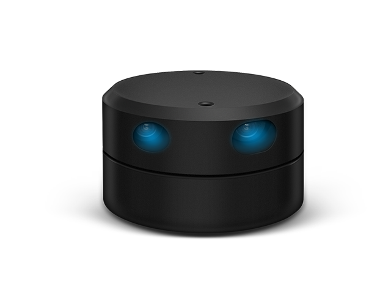

#### 12.1.1.2 Lidar Working Principle

Lidar is composed of laser emitting system, scanning system, laser receiving system and signal processing system.

Firstly, laser emitting system will send the detection signal (laser beam), and the scanning system takes charge of scanning the surrounding to receive the related information.

Next, the laser receiving system will receive the laser reflected by the target object to generate receiving signal.

Lastly, the signal system will process the receiving signal to get the features of the target, such as shape and physical properties (position, height and speed), then build the model.

#### 12.1.1.3 Lidar Parameter

#### 12.1.1.4 Performance Parameter

| Parameter | Minimum value | Classic value | Maximum value | Note |
| --- | --- | --- | --- | --- |
| Ranging frequency (Hz) | / | 9000 | / |  |
| Scanning frequency | 5 | 7 | 12 | Can be adjusted on the app. The default rotation speed is 7Hz. |
| Ranging distance (m) | 0.12 | / | 16 | Ranging frequency=4kHz; The reflectivity of the laser to the object is 80% |
|  | 0.26 | / | 16 | Ranging frequency=8kHz; The reflectivity of the laser to the object is 80% |
|  | 0.28 | / | 16 | Ranging frequency=9kHz; The reflectivity of the laser to the object is 80% |
| Scanning angle (Deg) | / | 0-360 | / |  |
| Absolute error (cm) | / | 2 | / | Ranging distance≤1m |
| Relative error | / | 2.0% | / | 1m \< ranging distance \< 8m |
| Pitch angle (Deg) | 0.25 | 1 | 1.75 |  |
| Angle resolution (Deg) | 0.2@5Hz | 0.28@7Hz | 0.48@12Hz | Scanning frequency is 7Hz, and the ranging frequency is 9kHz. |

#### 12.1.1.5 Electrical Parameter

| Parameter | Minimum value | Classic value | Maximum value | Note |
| --- | --- | --- | --- | --- |
| Absolute error (V) | 4.8 | 5 | 5.2 | Too large value will destroy the device, and too small value will affect the ranging performance |
| Relative error (mA) | 1000 | / | / | The power supplied to Lidar should be with sufficient driving capability |
| Pitch angle (mA) | / | / | 50 | System will enter sleep mode, and the motor will stop working |
| Pitch angle (mA) | / | 350 | 500 | System will start working, and the rotation speed of the motor is 7Hz |

#### 12.1.1.6 Lidar Interface

Lidar is equipped with PH2.0-5P male interface for power supply and data communication

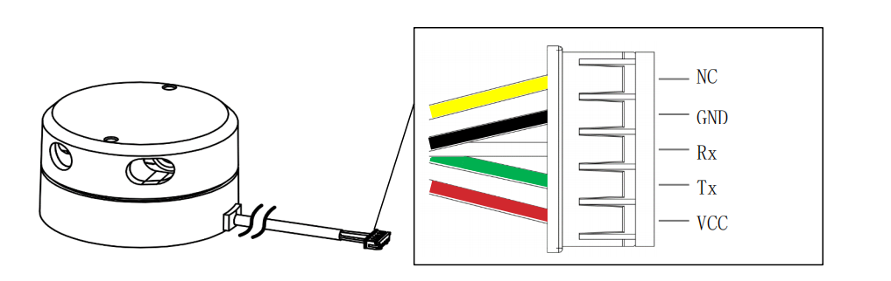

| Pin | Type | Function | Default value | Note |
| --- | --- | --- | --- | --- |
| VCC | Power supply | For positive electrode of the power | 5V |  |
| TX | Output | For system serial port output | / | Data flow: Lidar-\> external device |
| RX | Input | For system serial port input | / | Data flow: external-\>Lidar |
| GND | Power supply | For negative electrode of the power | 0V |  |
| NC | Reserve pin | Reserve pin | / |  |

#### 12.1.1.7 Serial Port Specification

You can connect the external devices to the interfaces on Lidar. Then the point cloud data, device information and device status can be obtained in real time through communication protocol, and the working mode of the device can be set.

| Parameter | Minimum value | Classic value | Maximum value | Note |
| --- | --- | --- | --- | --- |
| Baud rate (bps) | / | 230400 | / | 8 data bits,1 stop bit, no check, |
| High level signal (V) | 2.4 | 3.3 | 3.5 |  |
| Low level signal (V) | 0 | 0.3 | 0.6 |  |

### 12.1.2 Lesson 2 Basic Lidar Knowledge

#### 12.1.2.1 Lidar Ranging

Lidar can range the distance in two ways, including triangulation ranging and TOF.

The working principle of TOF is as pictured. Firstly, Lidar will cast the light on the object, and the object will reflect the light on the Lidar. Then Lidar will calculate the time taken for light to return, and multiply time times the speed of light to get the distance between object and it.

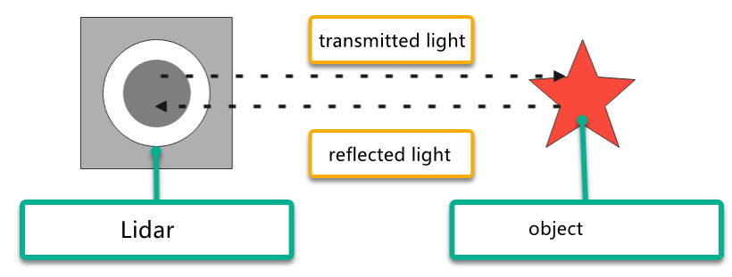

Triangulation ranging is as the picture shown. During Lidar production, its angle of light casting on the object will be adjusted to let the light not directly hit on the object.

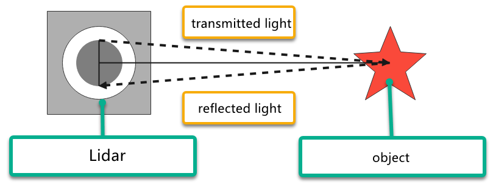

#### 12.1.2.2 Lidar Working Result

Its working result is as follows. Lidar will emit light and shine it on the object surface. When receiving the light reflected by the object, Lidar will mark the contour of the object at the position where the light is reflected.

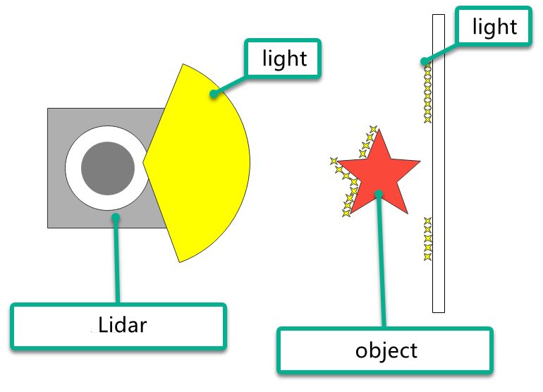

### 12.1.3 Lesson 3 Lidar Following

For how to connect the robot to the APP, please refer to the material in “**1. Basic Lesson-\>2. Quick User Experience-\>Lesson 1 APP Control**”.

#### 12.1.3.1 Operation Steps

**1.** **Open “**WonderAi**” APP, then connect it to JetHexa.**

**2.** **Click “**Lidar**” to enter the game interface.**

**3.** **Start “**Lidar Following**” at the left interface**

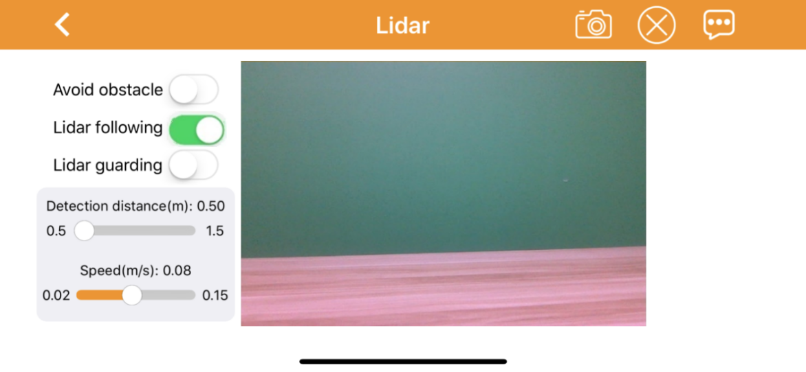

4. When detecting the obstacle, JetHexa will adjust its posture to keep the distance between it and the obstacle at 0.5m.

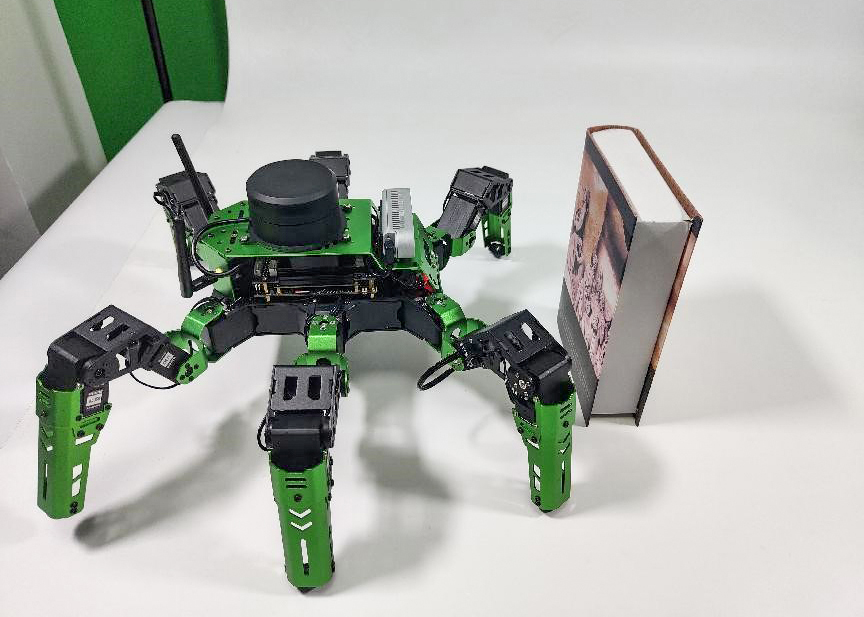

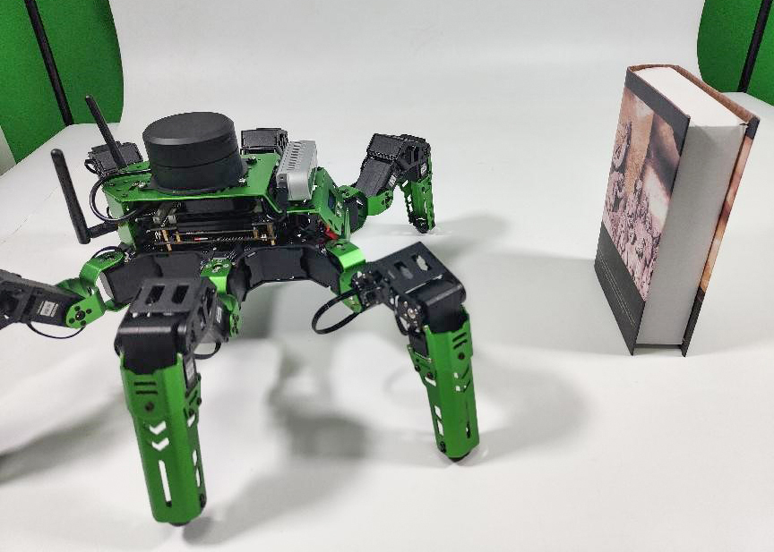

### 12.1.4 Lesson 4 Lidar Guarding

For how to connect the robot to the APP, please refer to the material in “**1. Basic Lesson-\>2. Quick User Experience-\>Lesson 1 APP Control**”.

#### 12.1.4.1 Operation Steps

**1.** **Open “**WonderAi**” APP, then connect it to JetHexa.**

**2.** **Click “**Lidar**” to enter the game interface.**

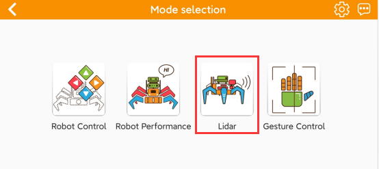

**3.** **Start “**Lidar Guarding**” at the left interface**

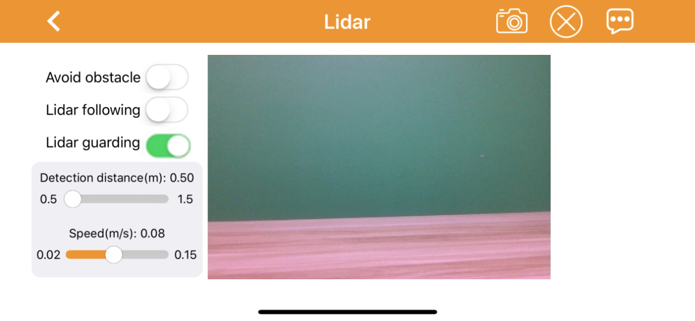

4. When detecting the obstacle, JetHexa will adjust its direction to let the camera right in front of the obstacle.

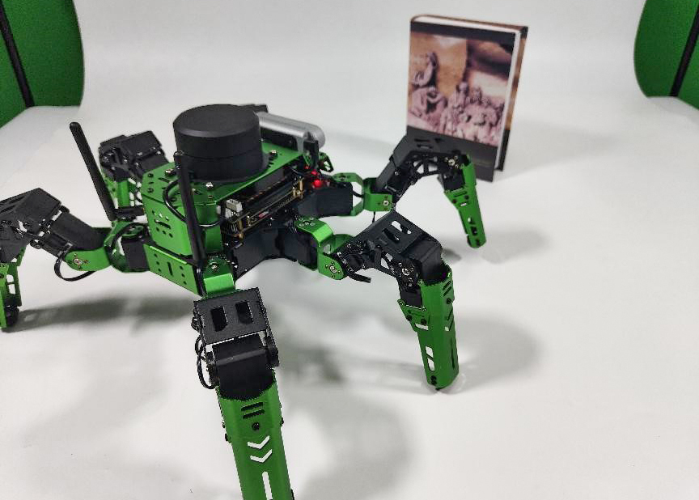

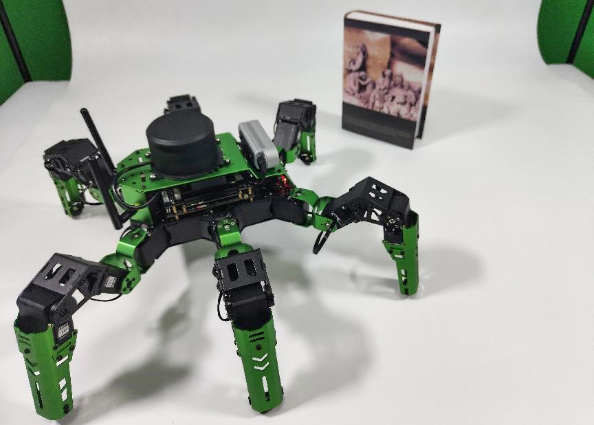

### 12.1.5 Lesson 5 Lidar Obstacle Avoidance

For how to connect the robot to the APP, please refer to the material in “**1. Basic Lesson-\>2. Quick User Experience-\>Lesson 1 APP Control**”.

#### 12.1.5.1 Operation Steps

1. Open “**WonderAi**” APP, then connect it to JetHexa.

2. Click “**Lidar**” to enter the game interface.

3. Start “**Avoid obstacle**” at the left interface

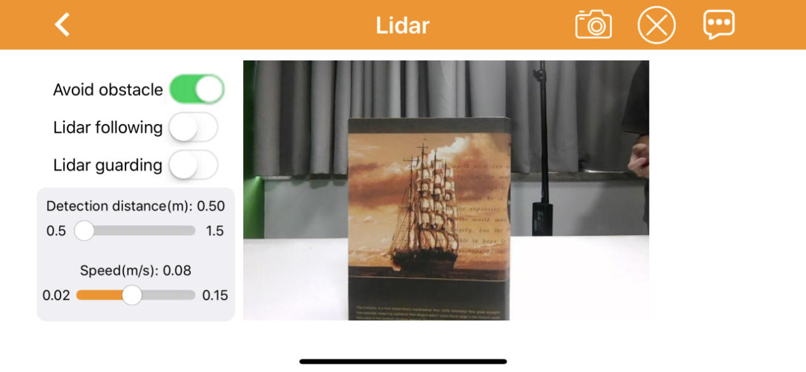

4. JetHexa will move straight forward. When detecting the obstacle, JetHexa will automatically turn to avoid the obstacle.

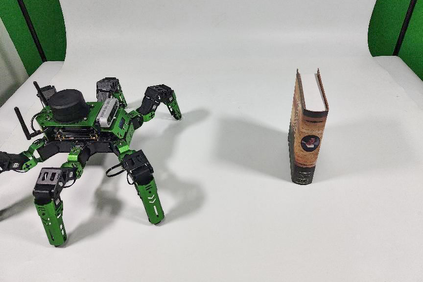

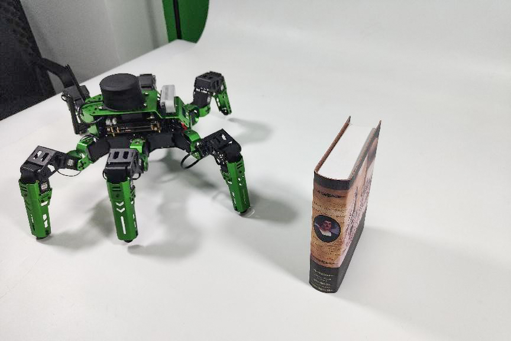

### 12.1.6 Lesson 6 Gmapping Mapping Algorithm

#### 12.1.6.1 Gmapping Description

Gmapping algorithm is based on RBPF particle filter algorithm which separates the process of localization and mapping. It will localize first, then perform mapping. Gmapping algorithm makes effective use of wheel odometer information, hence it is not strict with Lidar frequency.

As the scene enlarges, more particles are required. And each particle carries a map, which leads to overwhelming computation and storage occupation in building a large map. Therefore Gmapping is more applicable to map the small scene.

#### 12.1.6.2 Gmapping Principle

Gmapping algorithm will estimate the Lidar pose firstly based on the previous map and motion model. Then it will compute the weight according to the sensor observation to resample and update the map of particle. It will execute these steps in cycle to complete mapping.

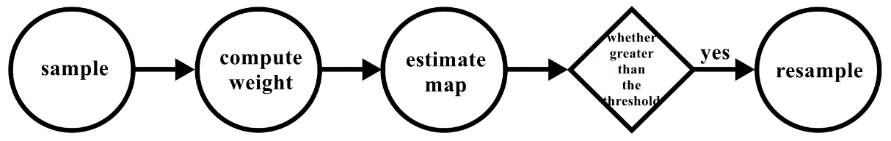

But RBPF particle filter algorithm has defects. It requires ample particles, and resamples frequently. Large amount of particles will result in great computation and storage occupation. And Gmapping has proposed two solutions for these two problems, including improving proposal distribution and selective resampling.

The improved proposal distribution has taken wheel odometer information and the latest observation (laser) into consideration, which makes the proposal distribution more accurate and closer to the target distribution.

Selective resampling means that set a threshold to decide whether to resample. Only when the particle change weight is greater than this threshold, it will resample, which can improve the variety of the particle and decrease the computation and storage occupation.

#### 12.1.6.3 Start Lidar Mapping

1. Start JetHexa, and then connect it to NoMachine.

2. Click  or press “Ctrl+Alt+T” to open command line terminal.

3. Input command “**systemctl stop jethexa_bringup**” and press Enter to stop auto-start program

4. Input the password **“hiwonder”**

5. Input the command “**roslaunch jethexa_slam jethexa_slam.launch slam_methods:=gmapping**” and press Enter to start SLAM service. If no error is reported, SLAM service starts successfully.

If “**Remote I/O error**” is threw, you can ignore this.

6. Open a new command line terminal, and input the command “**roslaunch jethexa_slam jethexa_slam_rviz.launch**”, and press Enter to open model viewing software

7. Open a new command line terminal, and input command “**roslaunch jethexa_slam jethexa_keyboard_control.launch**” and press Enter to start keyboard control service

If the interface as pictured shows up, the keyboard control service starts successfully.

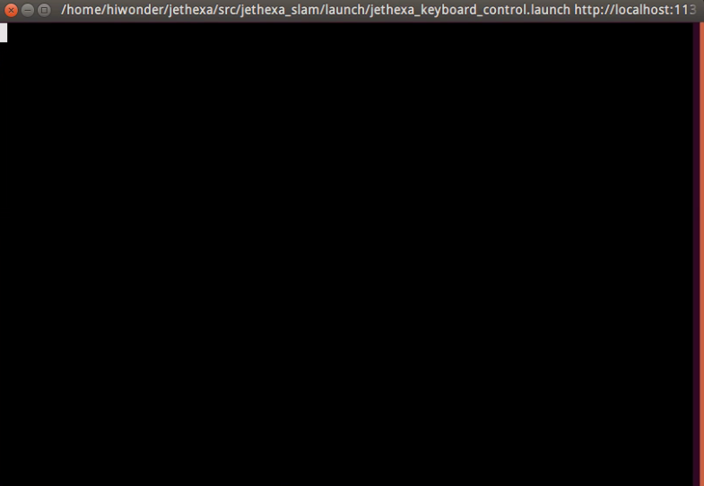

8. Control JetHexa to move in the current space to map the environment. The direction corresponding to the key is listed below.

| **Key** | **Robot Action**  |
| --- | --- |
|  W / ↑  |    Go forward     |
|  S / ↓  |    Go backward    |
|    A    |     Move left     |
|    D    |    Move right     |
|    ←    |     Turn left     |
|    →    |    Turn right     |
|  Space  | March on the spot |

9. Open a new command line terminal, input command “**roscd jethexa_slam/maps**”, and press Enter to enter the folder where the map is stored.

10. Input command “**rosrun map_server map_saver -f map_01 map:=/jethexa/map**” and press Enter to store the map.

“**map_01**” in the command is the name of the map, and you can rename it. If the following prompts occur, the map is kept successfully.

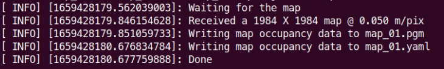

11. If you want to stop running the program, you can press “**Ctrl+C**”.

### 12.1.7 Lesson 7 Hector Mapping Algorithm

#### 12.1.7.1 Hector Description

Hector algorithm adopts Gauss-Newton iteration method which can realize mapping solely based on laser information.

Hector algorithm can map without odometer data, hence it can be applicable to uneven scene. As it estimates the odometer information based on Lidar data, it is strict with the frame rate of the Lidar.

Hector is more accurate than Gmapping in mapping, but it requires greater parameter configuration and Gmapping algorithm is with better usability.

#### 12.1.7.2 Hector Principle

Hector algorithm employs Gauss-Newton iteration method to cope with scan-matching problem. Scan matching is to use the current frame and the existed map data to create error function. And it also use this method to obtain optimal solutions and deviations.

**Procedure:**

**1. Initially, make the coordinates of the Lidar itself coincident with the grid map coordinate system, so that the initial pose and the coordinates of the first frame scan data of the Lidar in the map can be obtained.**

**2. Then, acquire the second frame scan data of the Lidar, and measure its coordinates in the map. At this time, the relative positional relationship between the second frame and the first frame is unknown.**

**3. Next, match the two frames of data. Assuming that these two frames of data are infinitely close, the pose increment is obtained by the method of least squares. Add the pose of the first frame to the pose increment to obtain the pose of the second frame in the map coordinate system.**

**4. Finally, calculate its coordinates in the map according to the pose of the second frame scan data, that is, map it to the map. Repeat the above steps continuously to complete mapping.**

#### 12.1.7.3 Start Lidar Mapping

1. Start JetHexa, and then connect it to NoMachine.

2. Click  or press “Ctrl+Alt+T” to open command line terminal.

3. Input command “**systemctl stop jethexa_bringup**” and press Enter to stop auto-start program

4. Input the password “**hiwonder**”

5. Input the command “**roslaunch jethexa_slam jethexa_slam.launch slam_methods:=hector**” and press Enter to start SLAM service. If no error is reported, SLAM service starts successfully.

If “**Remote I/O error**” is threw, you can ignore this.

6. Open a new command line terminal, and input the command “**roslaunch jethexa_slam jethexa_slam_rviz.launch**”, and press Enter to open model viewing software

7. Open a new command line terminal, and input command “**roslaunch jethexa_slam jethexa_keyboard_control.launch**” and press Enter to start keyboard control service

If the interface as pictured shows up, the keyboard control service starts successfully.

8. Control JetHexa to move in the current space to map the environment. The direction corresponding to the key is listed below.

| **Key** | **Robot Action**  |
| --- | --- |
|  W / ↑  |    Go forward     |
|  S / ↓  |    Go backward    |
|    A    |     Move left     |
|    D    |    Move right     |
|    ←    |     Turn left     |
|    →    |    Turn right     |
|  Space  | March on the spot |

9. Open a new command line terminal, input command “**roscd jethexa_slam/maps**”, and press Enter to enter the folder where the map is stored.

10. Input command “**rosrun map_server map_saver -f map_01 map:=/jethexa/map**” and press Enter to store the map.

“**map_01**” in the command is the name of the map, and you can rename it. If the following prompts occur, the map is kept successfully.

11. You can press “**Ctrl+C**” to exit the current program.

### 12.1.8 Lesson 8 Karto Mapping Algorithm

#### 12.1.8.1 Karto Description

Karto algorithm is based on Graph Optimization Framework which optimizes the error accumulated in mapping with the method of least squares. To some extent, it replaces the laser SlAM plan based on filter.

But Karto algorithm has downsides. Submaps need to be created before each local submap matching, so it takes a long time to map.

#### 12.1.8.2 Karto Principle

The Karto algorithm employs the idea of graph optimization, that is, the map is represented by the image mean. And each node represents a location point of the robot trajectory and a sensor measurement data set. Whenever a new node is added to the map, the constraint calculation will be performed according to the node position, and the map information will be updated.

**Procedure:**

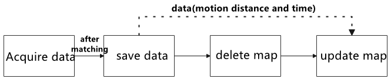

**1. Firstly, obtain the current pose of the robot according to the odometer, and match it with the pose of the robot after translation and rotation in a certain range, and select the pose with the greatest possibility. If a single pose is obtained, this pose is used as the matched pose. If multiple poses are obtained, average them, and make the result pose the matched pose.**

**2.** **Set the threshold for saving Lidar data, and the data that reaches the threshold will be saved during the scanning. **Note:** Lidar moving from one area to another will cause the maps of these two areas to overlap. At this point, the robot will first save the non-overlapping parts in the first map, and then include the overlapping parts in the second map.**

**3. Finally, update the map according to the processed data to complete mapping.**

#### 12.1.8.3 Start Lidar Mapping

1. Start JetHexa, and then connect it to NoMachine.

2. Click  or press “Ctrl+Alt+T” to open command line terminal.

3. Input command “**systemctl stop jethexa_bringup**” and press Enter to stop auto-start program

4. Input the password “**hiwonder**”

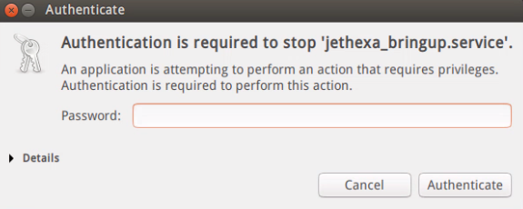

5. Input the command “**oslaunch jethexa_slam jethexa_slam.launch slam_methods:=karto**” and press Enter to start SLAM service. If no error is reported, SLAM service starts successfully.

If “**Remote I/O error**” is threw, you can ignore this.

6. Open a new command line terminal, and input the command “**roslaunch jethexa_slam jethexa_slam_rviz.launch**”, and press Enter to open model viewing software

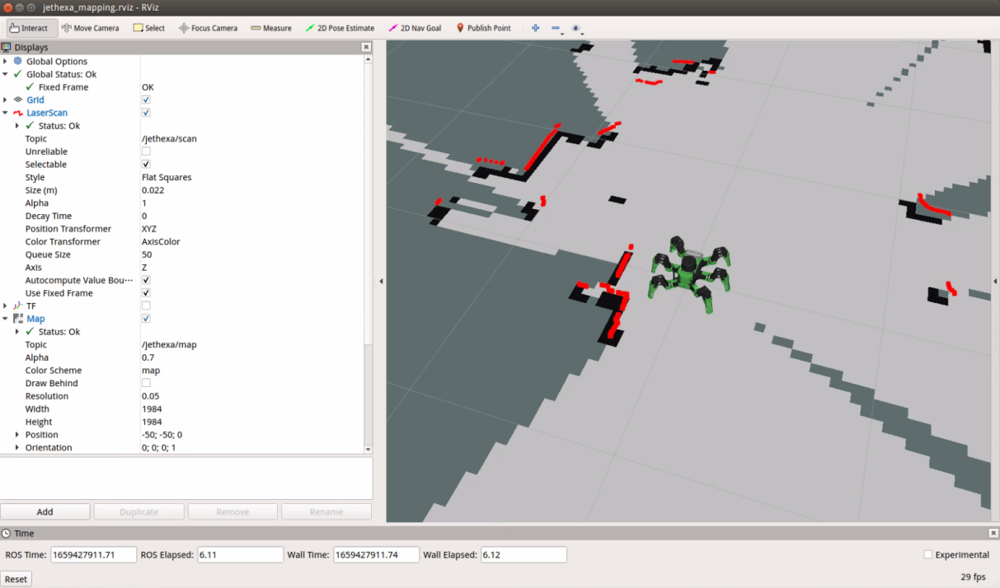

7. Open a new command line terminal, and input command “**roslaunch jethexa_slam jethexa_keyboard_control.launch**” and press Enter to start keyboard control service

If the interface as pictured shows up, the keyboard control service starts successfully.

8. Control JetHexa to move in the current space to map the environment. The direction corresponding to the key is listed below.

| **Key** | **Robot Action**  |
| --- | --- |
|  W / ↑  |    Go forward     |
|  S / ↓  |    Go backward    |
|    A    |     Move left     |
|    D    |    Move right     |
|    ←    |     Turn left     |
|    →    |    Turn right     |
|  Space  | March on the spot |

9. Open a new command line terminal, input command “**roscd jethexa_slam/maps**”, and press Enter to enter the folder where the map is stored.

10. Input command “**rosrun map_server map_saver -f map_01 map:=/jethexa/map**” and press Enter to store the map.

“**map_01**” in the command is the name of the map, and you can rename it. If the following prompts occur, the map is kept successfully.

### 12.1.9 Lesson 9 Cartographer Mapping Algorithm

#### 12.1.9.1 Cartographer Description

Cartographer algorithm is a SLAM algorithm based on graph optimization proposed by Google. It supports multi-sensor data mapping, as well as localization and mapping under 2D or 3D condition.

Cartographer algorithm aims at acquiring highly accurate 2D map with the limited computation resource.

#### 12.1.9.2 Cartographer Principle

The architecture of Cartographer algorithm is composed of Local SLAM and Global SLAM.

**Procedure of Local SLAM:**

1. Use odometer and IMU data for trajectory estimation to obtain the pose estimate of the robot.

2. Set the pose estimate as the initial value, then match the Lidar data and update the value of pose estimator

3. Overlap the Lidar data frame by frame through motion filtering to generate Submap

**Procedure of Global SLAM:**

1. Build loops through loop closure detection to optimize the poses of all submaps and eliminate accumulated errors. Loop closure detection refers to matching the laser data of the current frame with all previous submaps.

2. Perform back-end optimization, and use all sub-maps to form a complete and usable map.

#### 12.1.9.3 Start Lidar Mapping

1. Start JetHexa, and then connect it to NoMachine.

2. Click  or press “Ctrl+Alt+T” to open command line terminal.

3. Input command “**systemctl stop jethexa_bringup**” and press Enter to stop auto-start program

4. Input the password “**hiwonder**”

5. Input the command “**roslaunch jethexa_slam jethexa_slam.launch slam_methods:=cartographer**” and press Enter to start SLAM service. If no error is reported, SLAM service starts successfully.

If “**Remote I/O error**” is threw, you can ignore this.

6. Open a new command line terminal, and input the command “**roslaunch jethexa_slam jethexa_slam_rviz.launch**”, and press Enter to open model viewing software

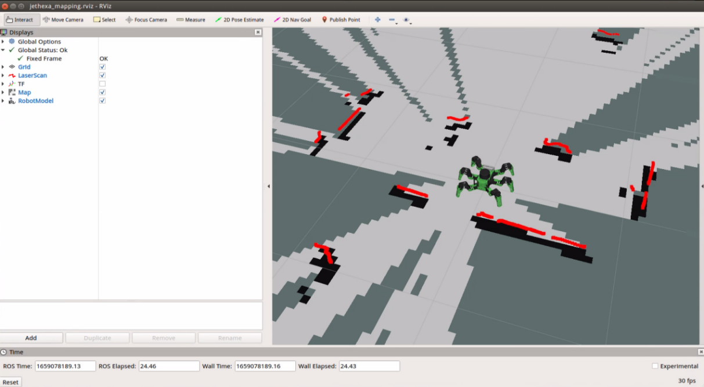

7. Open a new command line terminal, and input command “**roslaunch jethexa_slam jethexa_keyboard_control.launch**” and press Enter to start keyboard control service

If the interface as pictured shows up, the keyboard control service starts successfully.

8. Control JetHexa to move in the current space to map the environment. The direction corresponding to the key is listed below.

| **Key** | **Robot Action**  |
| --- | --- |
|  W / ↑  |    Go forward     |
|  S / ↓  |    Go backward    |
|    A    |     Move left     |
|    D    |    Move right     |
|    ←    |     Turn left     |
|    →    |    Turn right     |
|  Space  | March on the spot |

9. Open a new command line terminal, input command “**roscd jethexa_slam/maps**”, and press Enter to enter the folder where the map is stored.

10. Input command “**rosrun map_server map_saver -f map_01 map:=/jethexa/map**” and press Enter to store the map.

“**map_01**” in the command is the name of the map, and you can rename it. If the following prompts occur, the map is kept successfully.

#### 12.1.9.4 View the Mapping on Virtual Machine

For the complete instruction, please check the material in “**12. Lidar Lesson-\>Lesson 6 Gmapping Mapping Algorithm**”

### 12.1.10 Lesson 10 View the Map on Virtual Machine and the Usage of RVIZ

#### 12.1.10.1 View the Map on Virtual Machine

Besides the remote tools, you can also view the mapping process on the virtual machine.

#### 12.1.10.2 Import Virtual Machine File

For how to install the virtual machine, please refer to the material in “**2. Linux Basic Lesson-\>Lesson 2 Environment Configuration in Windows**”

The configured virtual machine file is kept in “**Appendix-\>7. Virtual Machine**”

**Note: if you are using a computer, you need to insert wireless adapter.**

1. Open VMware Workstation, then click “**File-\>Open**”, or you can press “**Ctrl+O**”.

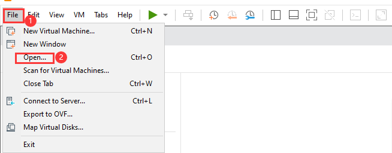

2. Select the virtual machine kept in **Appendix**.

3. Input the name and select the storage path for the new virtual machine. After modification, click “**Import**”.

#### 12.1.10.3 Configure Virtual Machine Network

1. Click “**Edit-\>Virtual Network Editor**”.

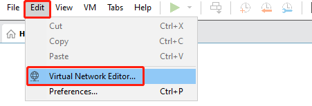

2. Click “**Add Network**”.

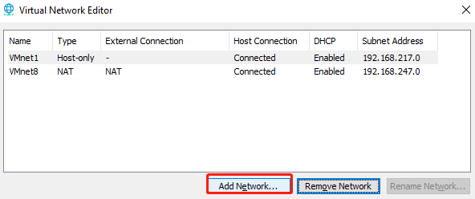

3. Select the network to add, for example, “**VMnet0**”. Then click “**OK**” button.

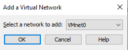

4. Select the newly added network “**VMnet0**”, and set it as bridge mode. Then bridge it to the wireless LAN, and click “**OK**”.

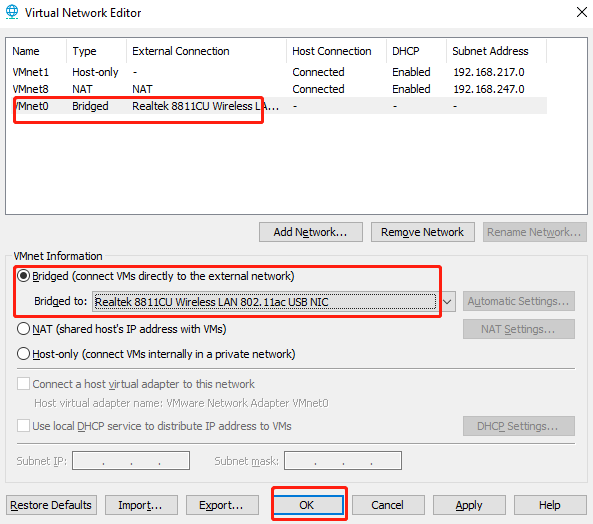

5. Click “**Power on this virtual machine**”

6. If the following window pops up, press “**Enter**”.

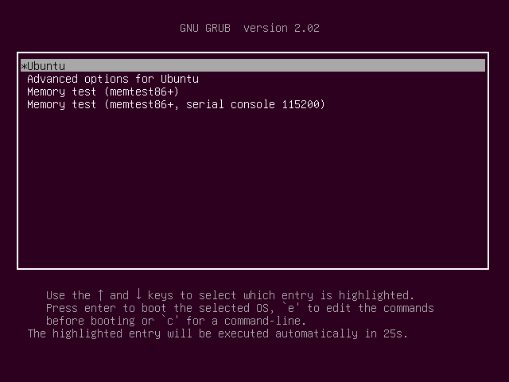

7. Input the password “**hiwonder**” and click “**Sign In**” to enter the system.

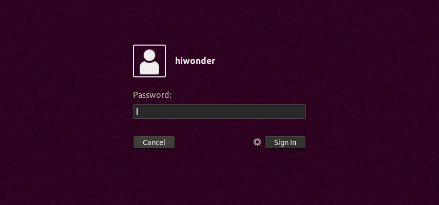

8. Open virtual machine, click , then click  or press “**Ctrl+Alt+T**” to open command line terminal.

9. Input command “**ip addr**” and press Enter to check the ID of Wireless LAN. The ID of Wireless LAN I used is “**ens33**”.

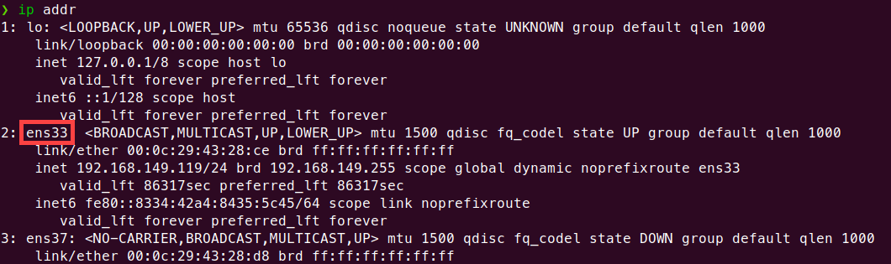

10. Input command “**sudo vim .hiwonderrc**” and press Enter.

11. Locate these codes.

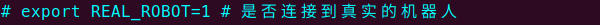

12. Press “**I**” key to enter editing mode. Delete “**\#**” at the beginning of the code to uncomment it.

13. Find the codes shown below.

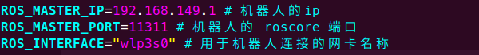

14. Change the name of the wireless LAN adapter to the name you have obtained, and check whether the IP of the robot and roscore port are consistent with the picture.

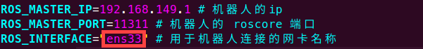

15. Press “**Esc**” key and input “**:wq**”, and press Enter to save the modification and exit the program.

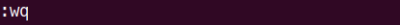

#### 12.1.10.4 Configure JetHexa Network

1. Connect JetHexa to NoMachine. And double click  to open the command line terminal.

2. Input command “**sudo vim .hiwonderrc**” and press Enter.

3. Then locate these two lines of codes.

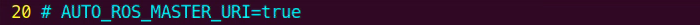

4. Press “**I**” key to enter editing mode. Delete “**\#**” at the beginning of the code to uncomment them to start JetHexa network configuration.

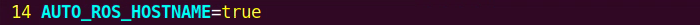

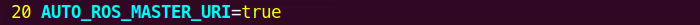

**Note: the Space behind “#” also needs to delete to ensure the consistent indent.**

5. Press “**Esc**” and input “**:wq**”, and press Enter to save the modification and exit the program.

6. Return back to the virtual machine, and open the terminal. If no prompt of network configuration pops up, the network configuration is successful.

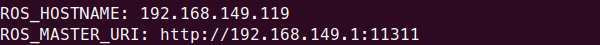

7. If the configuration fails, return back to NoMachine and open the terminal. The input the command “**sudo vim .hiwonderrc**” and press Enter.

8. Locate the following commands.

9. Press “**I**” key to enter the editing mode. Add “**\#**” in front of the code to comment them.

10. Jump to these lines of code.

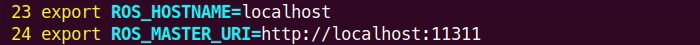

11. Modify “**localhost**” as “**192.168.149.1**”.

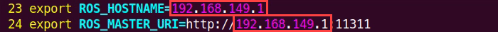

12. Press “**Esc**”, input “**:wq**” and press Enter to save and exit the program.

#### 12.1.10.5 Enable Lidar Mapping Service

1. Open NoMachine. Then double click  to open the terminal.

2. Input command “**systemctl stop jethexa_bringup**” and press Enter to stop the auto-start program.

3. Input the password “**hiwonder**”, and click “**Authenticate**” button.

4. Input command “**roslaunch jethexa_slam jethexa_slam.launch slam_methods:=gmapping**”, and press Enter to enable mapping service. If no error reports, the mapping service is enabled successfully.

“**gmapping**” is the mapping algorithm, and you change it to “**hector**”, “**karto**” and “**cartographer**”.

#### 12.1.10.6 Open RVIZ

1. Open the virtual machine, and click . Then click  or press “**Ctrl+Alt+T**” to open the command line terminal.

2. Input command “**roslaunch jethexa_slam jethexa_slam_rviz.launch**” and press Enter to oprn RVIZ.

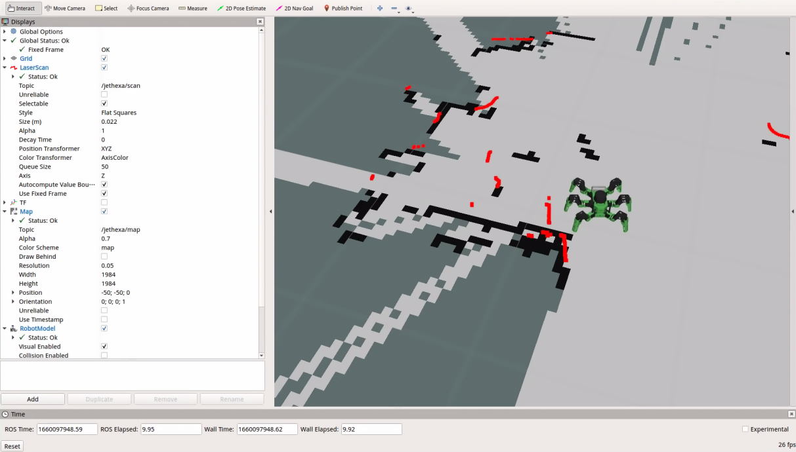

#### 12.1.10.7 RVIZ Interface

RVIZ is a 3D visualizer for the Robot Operating System (ROS) framework. RVIZ allows you to visualize the information, and send message to the object to monitor and control it.

RVIZ interface is divided into three zones, including tool bar, display setting area and 3D model area.

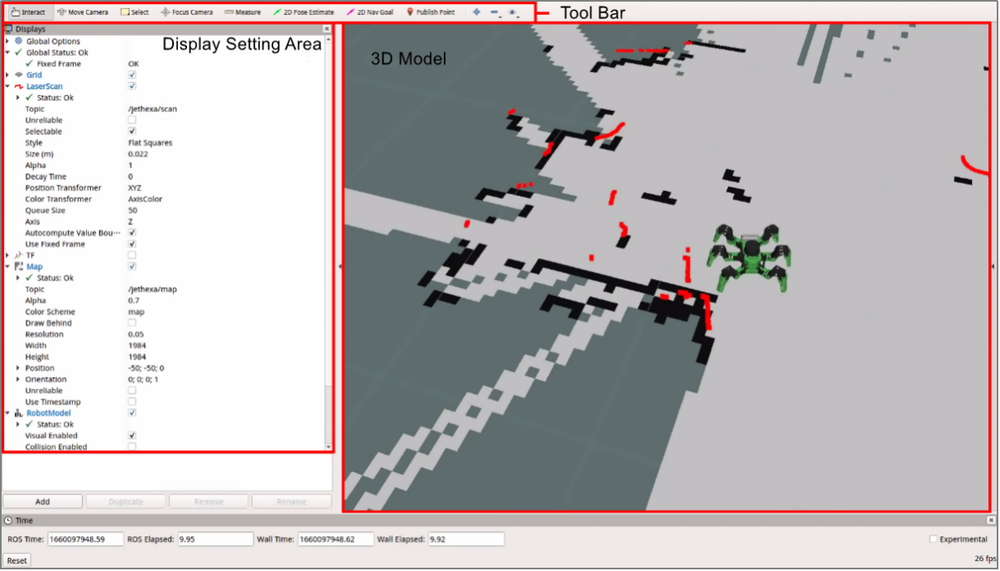

#### 12.1.10.8 Tool Bar

| **Icon** | **Function** |
| --- | --- |
| 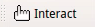 | Select the robot or designate where to adjust the angle. |
| 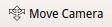 | After clicking this tool, left click the 3D model area, and move your mouse to adjust the camera angle. |
| 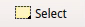 | After clicking this tool, left click the 3D model area to select the model. |
|  | After clicking this tool, left click any point on the 3D model area to set it as the center of the map. |
| 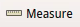 | After clicking this tool, click the starting and end point on 3D model area to range the distance between them. |
| 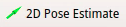 | Set the location of the robot on 3D model area. This tool is only applicable to navigation. When the actual position of the robot is not in line with that on 3D model area, you need to reset the position of the robot on 3D model area. After clicking this tool, left click any point on 3D model area to set it as the initial position of the robot. |
| 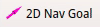 | Publish single target point. This tool is only applicable to navigation. After clicking this tool, left click any point on 3D model area to set it as the target destination. After the point is set, robot will design a path toward the target point automatically. |
|  | Publish multiple target points. This tool is only applicable to navigation. Each time you set a point, you need to click this icon. And you can set three points at most. After the points are set, robot will design a path toward the target point automatically, and move to the target points in sequence. |

#### 12.1.10.9 Display Settings Area

- **Global Options**

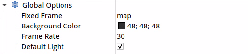

|     **Icon**      |                  **Function**                   |
| --- | --- |
|    Fixed Frame    | The reference frame used to denote other frames |
| Blackground Color |        Background color of the 3D model         |
|    Frame Rate     |           frame rate of the 3D model            |
|   Default Light   |              Light of the 3D model              |

- **Grid**

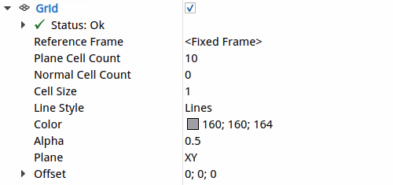

| **Icon** | **Function** |
| --- | --- |
| Reference Frame | Reference frame for the grid frame |
| Plane Cell Count | The number of cells to draw in the grid plane |
| Normal Cell Count | The number of cells to draw along the grid normal |
| Cell Size | The size of each grid cell, in meters |
| Line Style | Dimension of the grid line |
| Color | Color of the grid |
| Alpha | The line width of the grid |
| Plane | Used to draw the grid plane |
| Offset | Offset the grid from the origin of the coordinate system. The three parameters refers to the offsets of the X, Y, and Z axis, in meters. |

- **LaserScan**

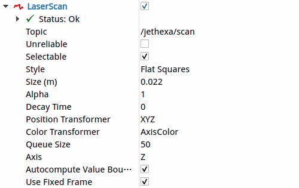

| **Icon** | **Function** |
| --- | --- |
| Topic | Subscribe the sensor_msgs/LaserScan topic |
| Unreliable | Enable or close UDP topic transmission |
| Selectable | Allow or not allow to select the point cloud with tool |
| Style | Rendering mode of the point |
| Size (m) | Size of the point in meters |
| Alpha | Transparency of the point |
| Decay Time | The duration of display the point in second. “**0**” means that only the latest point will be displayed |
| Position Transformer | Set the transformer of the point position |
| Color Transformer | Set the transformer of the point color |
| Queue Size | The size of the incoming laser scan message queue i.e. the amount of the data received |
| Axis | Axes for color interpolation |
| Autocompute Value Bounds | Enable or close autocomputing value bounds which refer to maximum and minimum value |
| Use Flxed Frame | Choose to shade it based on the fixed frame of the cloud, or shade it based on the cloud's local frame. |

- **TF：**

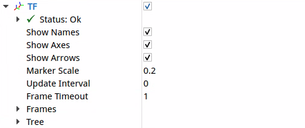

| **Icon** | **Function** |
| --- | --- |
| Show Names | Display or hide the name |
| Show Axes | Display or hide the axes |
| Show Arrows | Display or hide the arrows collecting the frames |
| Marker Scale | The scale of all TF objects |
| Update Interval | Update date of the TF coordinate in seconds |
| Frame Timeout | The duration of the frame before update in second. Divide the time into three periods. In first period, the frame will be displayed normally. In second period, gray will fade in. In the third period, the frame will fade out. |
| Frames | Enable/ ban the frame |
| Tree | Frame tree diagram |

- **Map**

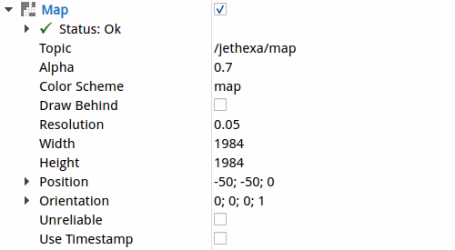

| **Icon** | **Function** |
| --- | --- |
| Topic | Subscribe **nav_msgs::OccupancyGrid** topic |
| Alpha | Transparency of the map |
| Color Scheme | Color of the map |
| Draw Behind | Whether to draw the map behind all other objects |
| Resolution | Resolution of the map (can not be changed) |
| Width | Width of the map (can not be changed) |
| Height | Height of the map (can not be changed) |
| Position | The coordinate of the lower left corner of the map. The three parameters respectively refer to X, Y and Z axes coordinate in meters (can not be changed) |
| Orientation | The orientation of the map (can not be changed) |
| Unreliable | Enable/ close UDP topic transmission |
| Use Timestamp | Whether to use Timestamp |

- **RobotModel**

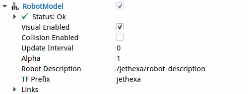

| **Icon** | **Function** |
| --- | --- |
| Visual Enabled | Display/ hide the robot model |
| Collision Enabled | Display/ hide collision size of the robot |
| Update Interval | The update interval of the robot model display in second |
| Alpha | The transparency of the robot |
| Robot Description | The storage path for the robot description file is stored |
| TF Prefix | Prefix of the robot TF coordinate which is generally applied in the multi-robot scene |
| Links | Hide/ display the robot body structure |

## 12.2 SLAM Mapping and Navigation

### 12.2.1 Lesson 1 Adaptive Monte Carlo Localization

#### 12.2.1.1 AMCL Definition

Adaptive Monte Carlo Localization is the official localization module for ROS/ ROS2, and the only designated algorithm in the navigation module. And it is based on various Monte Carlo fusion algorithm.

Adaptive Monte Carlo Localization is a probabilistic localization system of robot’s movement in 2D space, and it adopts the particle filter to track the position and orientation of a robot in the known map.

#### 12.2.1.2 Working Principle

To let the robot move to an accurate position, you can adopt Adaptive Monte Carlo Localization to adjust robot’s position, which works like that put the particles uniformly on the map, and then these particles will gather in an area after algorithm calculation. The more the particles in an area, the greater the probability that the robot is in this area.

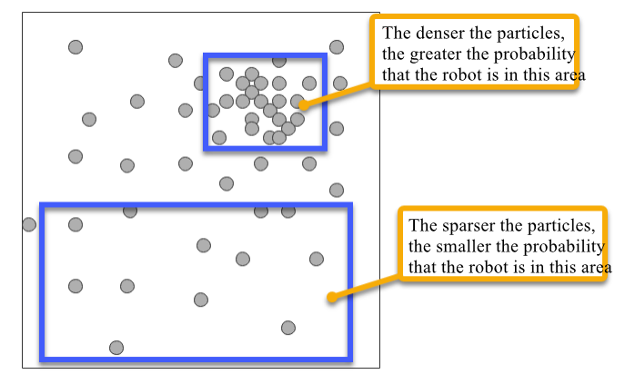

### 12.2.2 Lesson 2 Single-point Navigation and Obstacle Avoidance

If you want to know how the robot map, you can refer to the material in “**12. Lidar Lesson-\>1. Lidar Basic Lesson-\>Lesson 6 Gmapping Mapping Algorithm**”.

#### 12.2.2.1 Configuration

1. Start JetHexa, and then connect it to NoMachine.

2. Click  or press “**Ctrl+Alt+T**” to open command line terminal.

3. Input command “**systemctl stop jethexa_bringup**” and press Enter to stop auto-start program

4. Input the password **“hiwonder”**

1.

2.

3.

4.

5. Input the command “**roslaunch jethexa_navigation jethexa_load_map.launch map:=map_01**” and press Enter to load the map. If no error is reported, the map is loaded successfully.

“**map_01**” is the name of the map, and you can rename it. The map is saved in “**/home/hiwonder/jethexa/src/jethexa_slam/maps**”.

6. Open a new terminal, and input the command “**roslaunch jethexa_navigation jethexa_navigation.launch**” and press Enter to enable the navigation service. If no error is reported, the navigation service is enabled successfully.

7. Open a new command line terminal and input the command “**roslaunch jethexa_navigation jethexa_navigation_rviz.launch**” and press Enter to open the model viewing software

#### 12.2.2.2 Navigation Obstacle Avoidance

There are three tools in the menu bar, including 2D Pose Estimate, 2D Nav Goal and Publish Point.

“**2D Pose Estimate**” is used to set the initial position of the hexapod robot, “**2D Nav Goal**” is used to set a target point and “**Publish Point**” is used to set multiple target points.

Click “**2D Nav Goal**” in the menu bar, and select one point by clicking the mouse as the target destination. After the point is set, JetHexa will automatically generate the route and move toward the point.

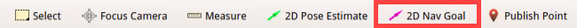

Two routes are displayed on the map. Red line is the straight path between the hexapod robot and the target point, and the green line is the hexapod robot’s planned path.

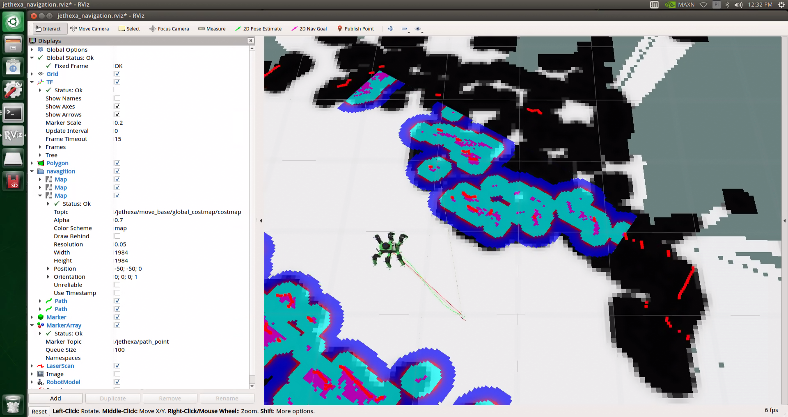

**Note: if you want to stop the navigation, set the current position of the robot as the target point with “2D Pose Estimate”. If the hexapod robot doesn’t touch the ground or is moved due to the external force, you need to reset the target point.**

### 12.2.3 Lesson 3 Multi-point Navigation and Obstacle Avoidance

If you want to know how the robot map, you can refer to the material in “**12. Lidar Lesson-\>1. Lidar Basic Lesson-\>Lesson 6 Gmapping Mapping Algorithm**”.

#### 12.2.3.1 Configuration

1. Start JetHexa, and then connect it to NoMachine.

2. Click  or press “**Ctrl+Alt+T**” to open command line terminal.

3. Input command “**systemctl stop jethexa_bringup**” and press Enter to stop auto-start program

4. Input the password **“hiwonder”**

5. Input the command “**roslaunch jethexa_navigation jethexa_load_map.launch map:=map_01**” and press Enter to load the map. If no error is reported, the map is loaded successfully.

“**map_01**” is the name of the map, and you can rename it. The map is saved in “**/home/hiwonder/jethexa/src/jethexa_slam/maps**”.

6. Open a new terminal, and input the command “**roslaunch jethexa_navigation jethexa_navigation.launch**” and press Enter to enable the navigation service. If no error is reported, the navigation service is enabled successfully.

7. Open a new command line terminal and input the command “**roslaunch jethexa_navigation jethexa_navigation_rviz.launch**” and press Enter to open the model viewing software

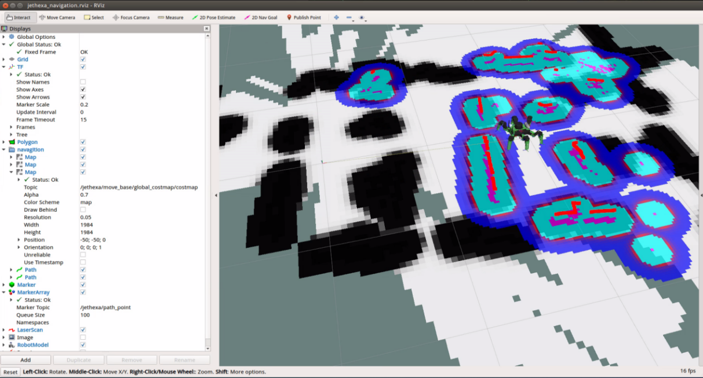

#### 12.2.3.2 Start Navigation

There are three tools in the menu bar, including 2D Pose Estimate, 2D Nav Goal and Publish Point.

“**2D Pose Estimate**” is used to set the initial position of the hexapod robot, “**2D Nav Goal**” is used to set a target point and “**Publish Point**” is used to set multiple target points.

**1.** **Click “**Publish Point**” in the menu bar, then select multiple points as the target destinations.**

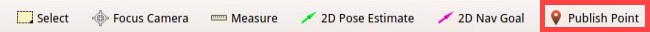

When selecting the point, the first point is marked as “**0**”, the second point is marked as “**1**”, and the third point is marked as “**2**”. And the following points will be marked in this rule.

**2. After the point is set, JetHexa will automatically generate the route and move toward the point.**

Two routes are displayed on the map. Red line is the straight path between the hexapod robot and the target point, and the green line is the hexapod robot’s planned path.

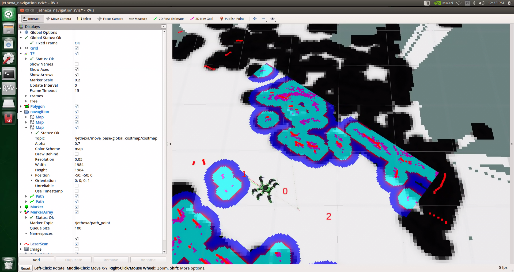

**Note: if you want to stop the navigation, set the current position of the robot as the target point with “2D Nav Goal”. If the hexapod robot doesn’t touch the ground or is moved due to the external force, you need to reset the target point.**

### 12.2.4 Lesson 4 APP Mapping and Navigation

#### 12.2.4.1 APP Installation

In this lesson, “**Make A APP**” is used for mapping, and “**Map Nav**” is used for navigation.

1. **Android:** import the installation package in “**Appendix-\>8. Lidar Mapping APP**” to your phone and install it.

**Note**: “**Make A APP**” and “**Map Nav**” are only applicable to Android system. There is no a corresponding iOS version.

#### 12.2.4.2 Set the robot IP

1. Start JetHexa, and then connect it to NoMachine.

2. Click  or press “**Ctrl+Alt+T**” to open command line terminal.

3）Input command “**export ROS_HOSTNAME=192.168.149.1**” to modify the robot IP

4）Input command “**export ROS_MASTER_URI=http://192.168.149.1:11311**” to change the address where the robot node is published.

#### 12.2.4.3 Enable the APP Service

1. Input the command “**systemctl stop jethexa_bringup**” and press Enter to stop the auto-start program.

2. Input the password **“hiwonder”**

3）Input the command “**roslaunch jethexa_slam jethexa_slam_app.launch**” and press Enter to enable APP service. If no error is thrown, the APP service is enabled successfully.

**Note: if the APP service cannot be enabled, reconnect the depth camera and lidar, and enable the service again.**

#### 12.2.4.4 APP Mapping

Take the operation on Android device for example, and the instruction is also applicable to iOS system.

1. Start JetHexa, and connect it to NoMachine

2. Enable APP service according to the instructions in “**2. Enable the APP Service**”

3. Connect to the WiFi generated by JetHexa in settings, and the WiFi password is “**hiwonder**”

4. Open “**Make A Map**” APP, and select “**http://192.168.149.1:11311**” in “**Master URI**” bar, then click “**CONNECT**”.

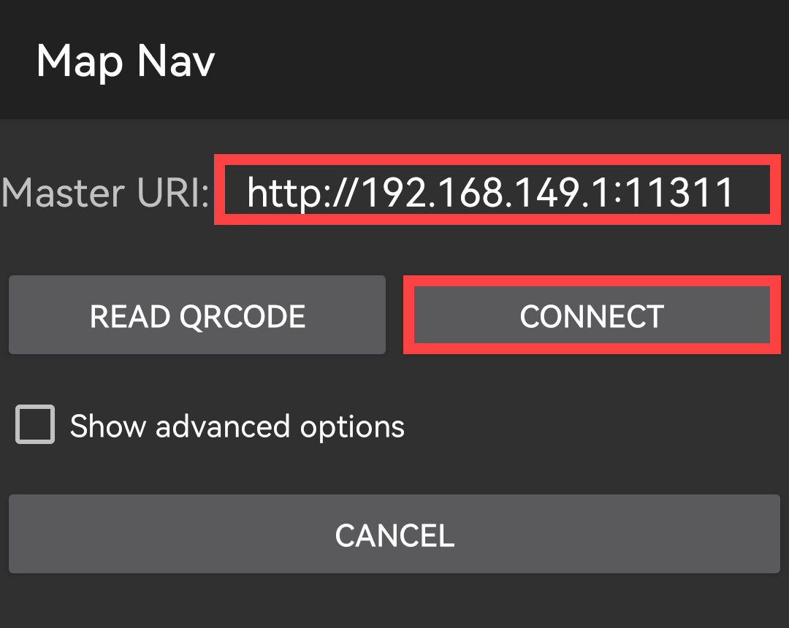

The APP interface is divided into three zones. The image in the photo album is displayed in the green frame, the map is display on the yellow frame, and the blue frame is for controlling the robot.

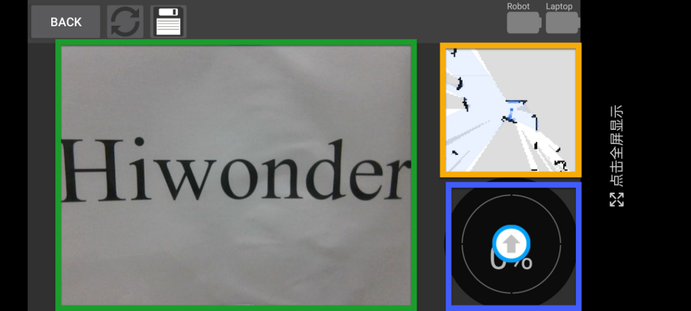

#### 12.2.4.5 APP Navigation

Take the operation on Android device for example, and the instruction is also applicable to iOS system.

1. Start JetHexa, and connect it to NoMachine

2. Enable APP service according to the instruction in “**2. Enable the APP Service**”

3. Connect to the WiFi generated by JetHexa in settings, and the WiFi password is “**hiwonder**”

4. Open “**Map Nav**” APP, and select “**http://192.168.149.1:11311**” in “**Master URI**” bar, then click “**CONNECT**”.

The interface is divided into three areas. The image in the photo album is displayed in the yellow frame, and the map is display in the green frame. Combine the buttons in red frame and blue frame to set the target point.

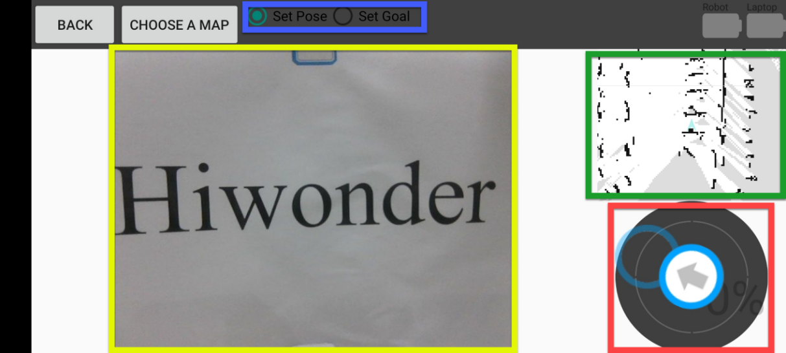

### 12.2.5 Lesson 5 RTAB-VSLAM 3D Mapping and Navigation

#### 12.2.5.1 Mapping

1. Start JetHexa and connect it to NoMachine

2. Double click  to open command line terminal.

3. Input command “**systemctl stop jethexa_bringup**” and press Enter to stop auto-start program

4. Input password “**hiwonder**”.

5. Input command “**roslaunch jethexa_slam jethexa_slam_rtabmap.launch**” and press Enter to enable rtabmap mapping service. If no error is reported, mapping service is enabled.

6. Open a new command line terminal, and input command “**roslaunch jethexa_slam jethexa_slam_rtabmap_rviz.launch**” and press Enter to open the model viewing software.

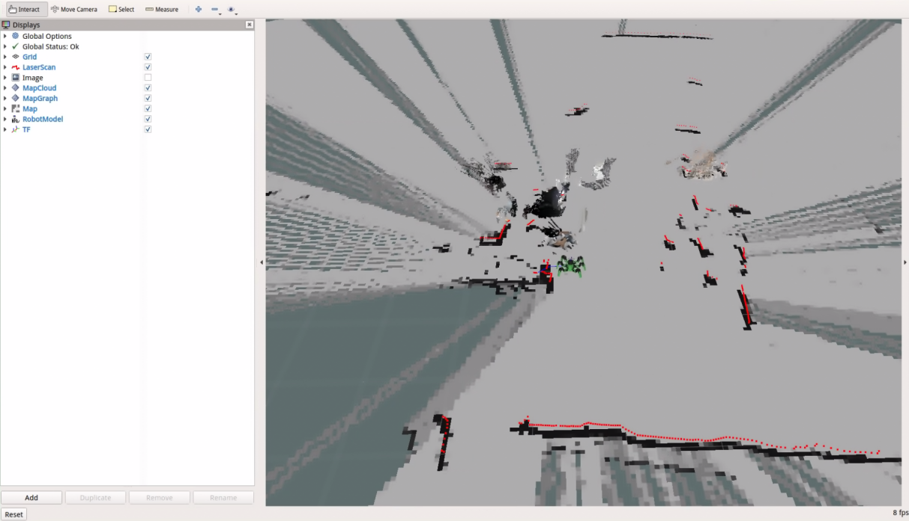

7. Open a new command line terminal, and input command “**roslaunch jethexa_slam jethexa_keyboard_control.launch**” and press Enter to enable the keyboard control service.

If the following interface appears, the keyboard control service is enabled.

8. Control the robot to move to build a more complete cloud point map.

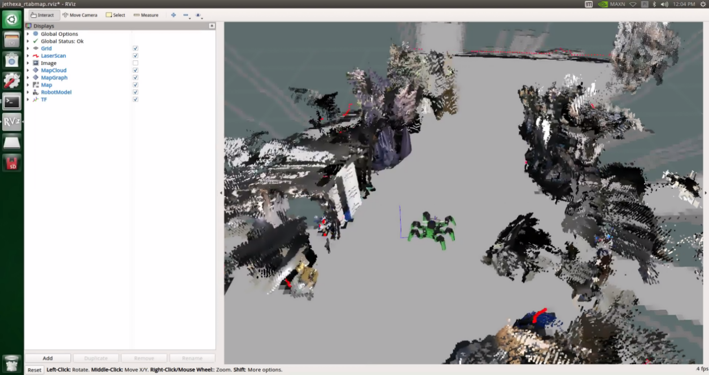

The direction corresponding to the key is listed below.

| **Key** | **Robot Action**  |
| --- | --- |
|  W / ↑  |    Go forward     |
|  S / ↓  |    Go backward    |
|    A    |     Move left     |
|    D    |    Move right     |
|    ←    |     Turn left     |
|    →    |    Turn right     |
|  Space  | March on the spot |

9. If you want to stop running the program, you can press “**Ctrl+C**”.

10. Click 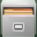 to open file manager, and move to the directory “**/home/hiwonder/.ros**”. The file “**rtabmap.db**” is the map file generated autonomously.

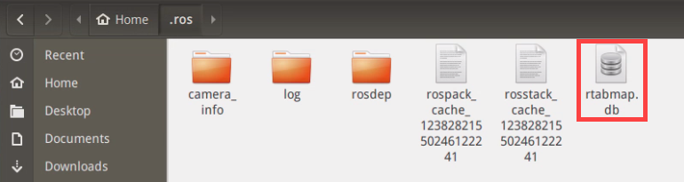

**Note: whenever the rtabmap mapping service is enabled, file “rtabmap.db” will be regenerated. Hence please backup the file “rtabmap.db” after each mapping.**

#### 12.2.5.2 Navigation

1. Start JetHexa and connect it to NoMachine

2. Double click  to open command line terminal.

3. Input command “**systemctl stop jethexa_bringup**” and press Enter to stop auto-start program

4. Input password “**hiwonder**”

5. Input command “**roslaunch jethexa_navigation jethexa_navigation_rtabmap.launch**” and press Enter to enable rtabmap navigation service. If no error is reported, mapping service is enabled.

6. Open a new command line terminal, and input command “**roslaunch jethexa_navigation jethexa_navigation_rtabmap_rviz.launch**” and press Enter to open the model viewing software.

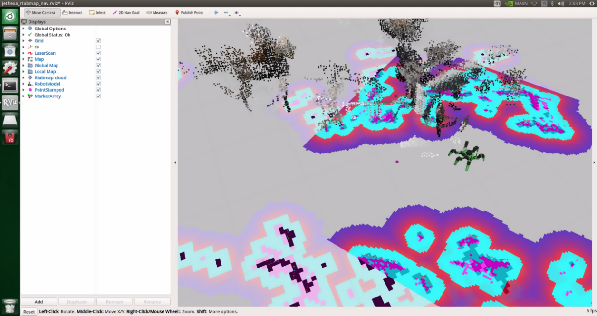

7. Click “**2D Nav Goal**” in menu bar, and select a point as the destination by clicking the mouse. Then JetHexa will generate the route and move toward the target point.

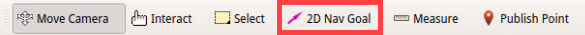

Two routes will be displayed on the map. The red route is the direct path between hexapod robot and the target point. And the blue path is the actual path JetHexa moves along.

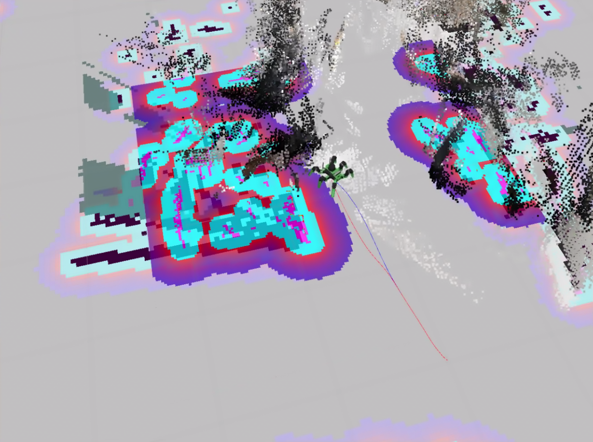

**Note: if you need to stop the navigation, set the current position of the robot as the target point.**

8. rRviz will not display 3D point cloud by default. And you can click “**Add**”, then select “**MapCloud**” and click “**OK**”.

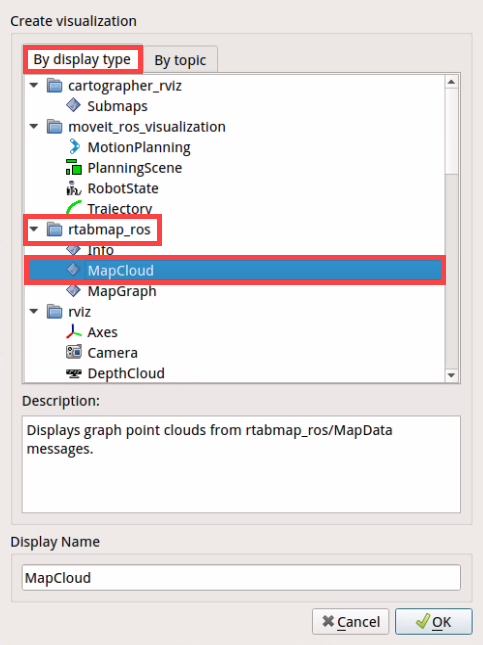
