# 13. Expanded Lesson

## 13.1 Lesson 1 OLED Display

### 13.1.1 Wiring

Connect OLED display module to any IIC interface on Jetson Nano expansion board through 4PIN wire. Its screen size is 128\*32 mm.

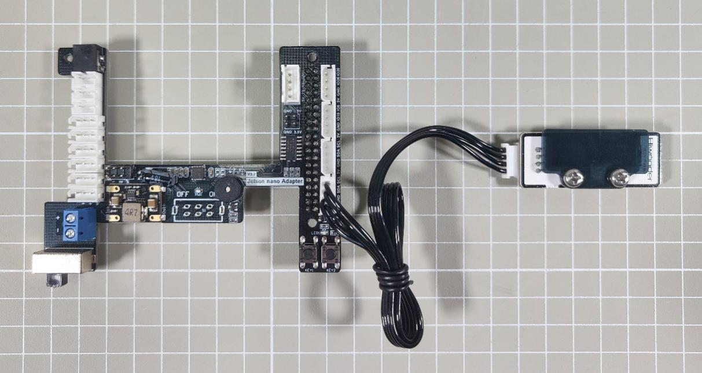

### 13.1.2 Program Logic

Firstly, the program will initialize the settings of OLED display, including startup screen, loading specific font and building canvas object.

> The source code of this program is stored in

>

> **/home/hiwonder/jethexa/src/jethexa_tutorial/scripts/electronic_module_03_oled.py**

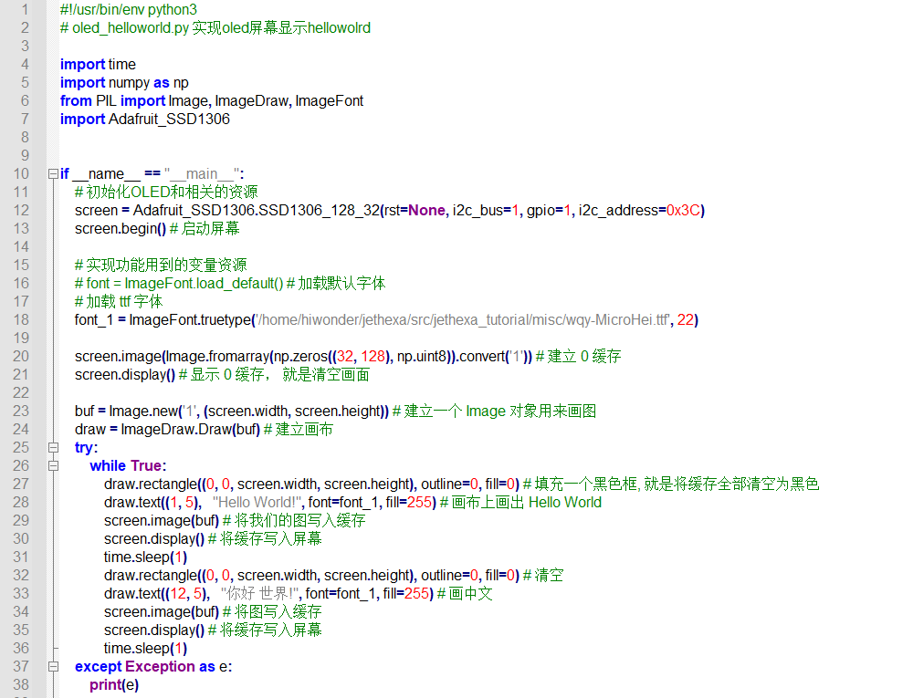

text() function can be called to set OLED display to display specific text. Take the code “**draw.text((1, 5), "Hello World!", font=font_1, fill=255)**” for example. The meaning of the parameters in the bracket is as follows.

The first parameter “**(1, 5)**” is the coordinate of the position where the text begins to display. The coordinate center lies at the upper left corner of the canvas.

The second parameter “**"Hello World!"**” is the text content.

The third parameter “**font=font_1**” stands for the font.

The fourth parameter “**fill=255**” represents the font color, and value “**255**” means red.

### 13.1.3 Operation Steps

The input command should be case sensitive, and the keywords can be complemented by “**Tab**” key.

1. Start JetHexa, and then connect it to NoMachine.

2. Double click  or press “**Ctrl+Alt+T**” to open command line terminal.

3. Input command “**sudo systemctl stop jethexa_bringup.service**” and press Enter to close initial display service.

4. Input command “**cd jethexa/src/jethexa_tutorial/scripts**” and press Enter to enter the directory where the program is stored.

5. Input command “**python3 electronic_module_03_oled.py**” and press Enter to run the program.

6. If want to close this game, please press “Ctrl+C”. If the game cannot be closed, please press the key again.

### 13.1.4 Program Outcome

> After the program runs, OLED display will display “**Hello World!**” for 1s, then display “**你好 世界!**” (Chinese) for 1s. And it word display these texts in cycle.

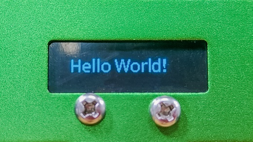

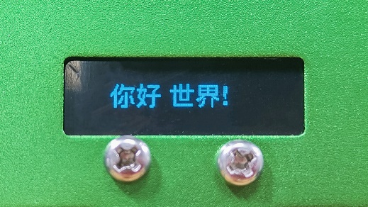

### 13.1.5 Function Extension

OLED display module is default to display “**Hello World!**”, but you can modify the displayed text in the program, for example “**Hiwonder**”.

1. Double click  to open command line terminal.

2. Input command “**cd jethexa/src/jethexa_tutorial/scripts**” and press Enter to enter the directory where the program is stored.

3. Type command “**vim electronic_module_03_oled.py**” and press Enter to open the program file.

4. Locate the following code.

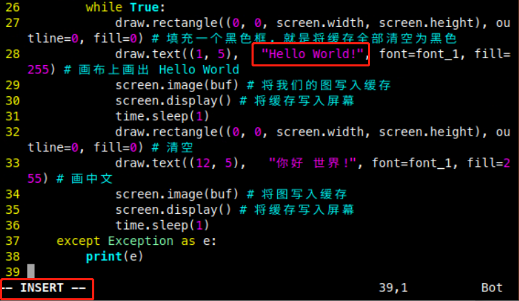

5. Press “**i**” key to enter editing mode, then modify the code as “**draw.text((1, 5), "Hiwonder", font=font_1, fill=255)**”

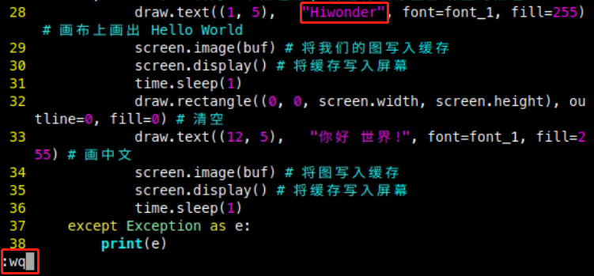

6. Having finished modification, press “**Esc**” and input “**:wq**” and press Enter to save and exit editing.

7. Input command “**python3 electronic_module_03_oled.py**” to run the program and check the displayed content.

## 13.2 Lesson 2 Voltage Display

### 13.2.1 Wiring

Connect OLED display module to any IIC interface on Jetson Nano expansion board through 4PIN wire. Its screen size is 128\*32 mm.

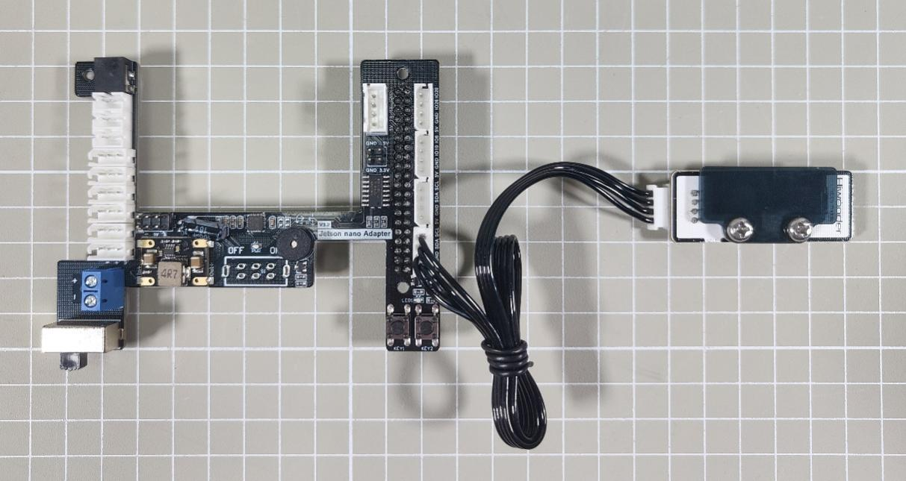

### 13.2.2 Program Logic

Firstly, the program will initialize the settings of OLED display, including startup screen, loading specific font and building canvas object.

Next, shut down the power of the servo to keep reading its supply voltage and position.

Lastly, let OLED display module display the obtained data.

The source code of this program is stored in

**/home/hiwonder/jethexa/src/jethexa_tutorial/scripts/electronic_module_04_volt_disp.py**

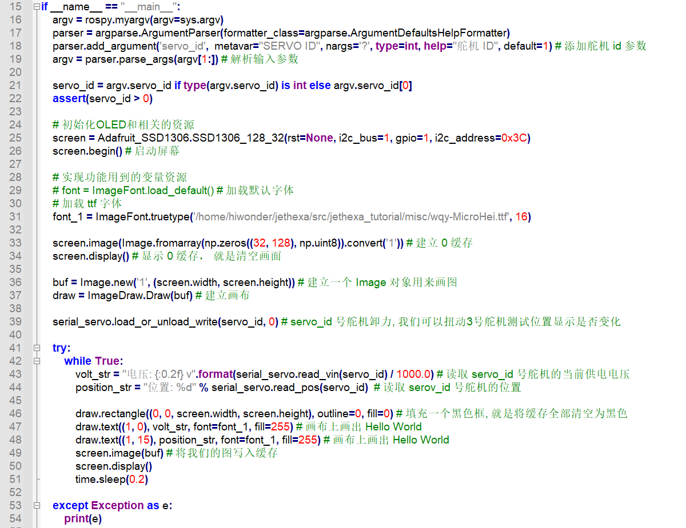

Take the code “**draw.text((1, 0), volt_str, font=font_1, fill=255)**” for example. The meaning of the parameters in the bracket is as follows.

The first parameter “**(1, 0)**” is the coordinate of the position where the text begins to display. The coordinate center (0, 0) lies at the upper left corner of the canvas.

The second parameter “**volt_str**” is the text content i.e. the obtained voltage data of the servo.

The third parameter “**font=font_1**” stands for the font.

The fourth parameter “**fill=255**” represents the font color, and value “**255**” means red.

### 13.2.3 Operation Steps

The input command should be case sensitive, and the keywords can be complemented by “**Tab**” key.

1. Start JetHexa, and then connect it to NoMachine.

2. Double click  or press “**Ctrl+Alt+T**” to open command line terminal.

3. Input command “**sudo systemctl stop jethexa_bringup.service**” and press Enter to stop initial display service.

4. Input command “**cd jethexa/src/jethexa_tutorial/scripts**” and press Enter to enter the directory where the program is stored.

5. Input command “**python3 electronic_module_04_volt_disp.py**” and press Enter to run the program.

The program is default to read the voltage and position of NO.1 servo. If you need to change the servo, add the corresponding servo ID at the end of the command.

For example, change the servo as NO.2 servo, and the command should be typed as “**python3 electronic_module_04_volt_disp.py 2**”.

6. If want to close this game, please press “**Ctrl+C**”. If the game cannot be closed, please press the key again.

### 13.2.4 Program Outcome

After the program runs, OLED display module will display the voltage and position of the target servo. When you twist the servo, the data displayed on the module will be updated in real time.

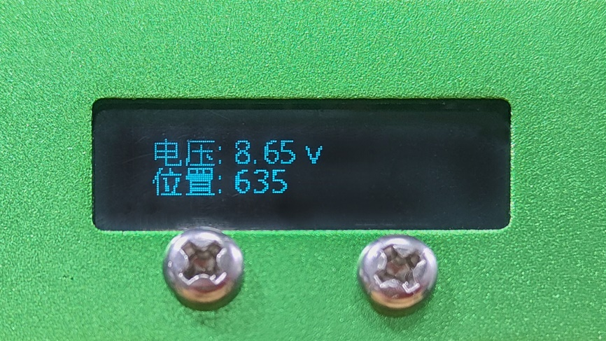

## 13.3 Lesson 3 Posture Detection

### 13.3.1 Wiring

Connect OLED display module to any IIC interface on Jetson Nano expansion board through 4PIN wire. Its screen size is 128\*32 mm.

### 13.3.2 Program Logic

Firstly, the program will initialize the settings of OLED display, including startup screen, loading specific font and building canvas object.

Next, obtain the current Pitch angle, Roll angle and Yaw angle of JetHexa, and display the data on OLED screen.

Lastly, get the coordinate of the horizontal line and vertical line according to the roll angle and pitch angle, and draw them on the OLED display module

The source code of this program is stored in

**/home/hiwonder/jethexa/src/jethexa_tutorial/scripts/electronic_module_05_posture.py**

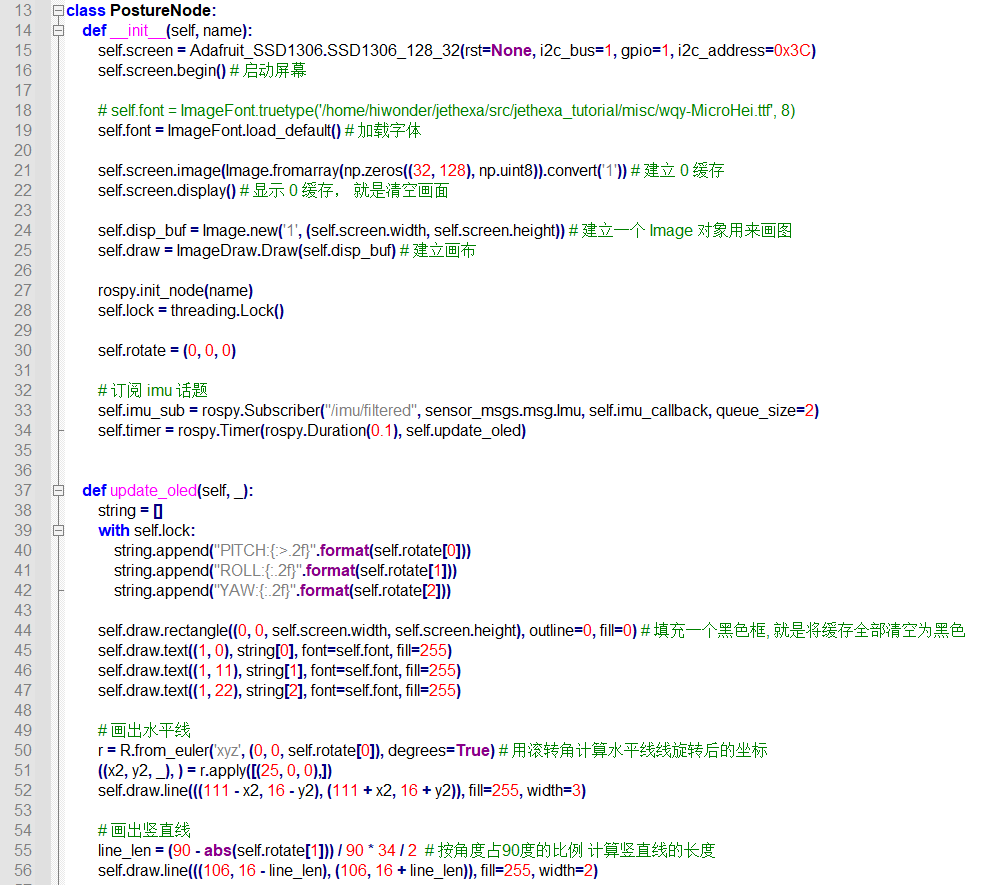

The function “**self.draw.line(((111 - x2, 16 - y2), (111 + x2, 16 + y2)), fill=255, width=3)**” is used to draw the line, and the meaning of the parameters in the bracket is as follow.

The first parameter “**((111 - x2, 16 - y2), (111 + x2, 16 + y2))**” is 2-tuple coordinates of the beginning and end of the line.

The second parameter “**fill=255**” represents the line color.

The third parameter “**width=3**” stands for the width of the line.

### 13.3.3 Operation Steps

The input command should be case sensitive, and the keywords can be complemented by “**Tab**” key.

1. Start JetHexa, and then connect it to NoMachine.

2. Double click  or press “**Ctrl+Alt+T**” to open command line terminal.

3. Input command “**sudo systemctl stop jethexa_bringup.service**” and press Enter to stop initial display service.

4. Input command “**roslaunch jethexa_tutorial electronic_model_05_posture.launch**” to run the program.

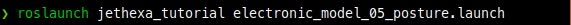

5. If want to close this game, please press “**Ctrl+C**”. If the game cannot be closed, please press the key again.

### 13.3.4 Program Outcome

After the program runs, OLED display module will display the current Pitch angle, Roll angle and Yaw angle of JetHexa, as well as the horizontal line and vertical line of the target posture.

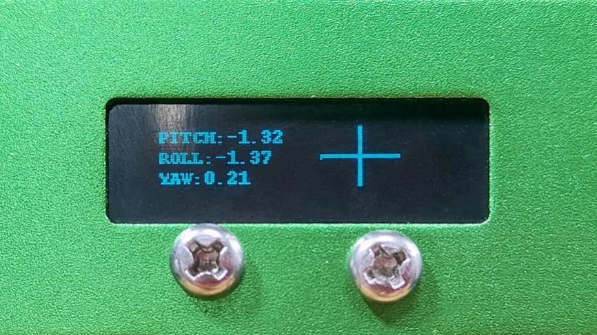

## 13.4 Lesson 4 Emotion Recognition and Display

### 13.4.1 Wiring

Connect OLED display module to any IIC interface on Jetson Nano expansion board through 4PIN wire. Its screen size is 128\*32 mm.

### 13.4.2 Program Logic

Firstly, the program will initialize the settings of OLED display, including startup screen, loading specific font and building canvas object.

Then, import the detection method of face recognition from MediaPipe to build a emotion classifier.

Next, subscribe the topic published by camera node to obtain the camera returned image and detect the human face and recognize and classify the emotion.

Lastly, display the recognition result i.e. emotion type on the OLED display module, and mark the key points of human face on the camera returned image.

The source code of this program is stored in

**/home/hiwonder/jethexa/src/jethexa_tutorial/scripts/electronic_module_06_facial_expression.py**

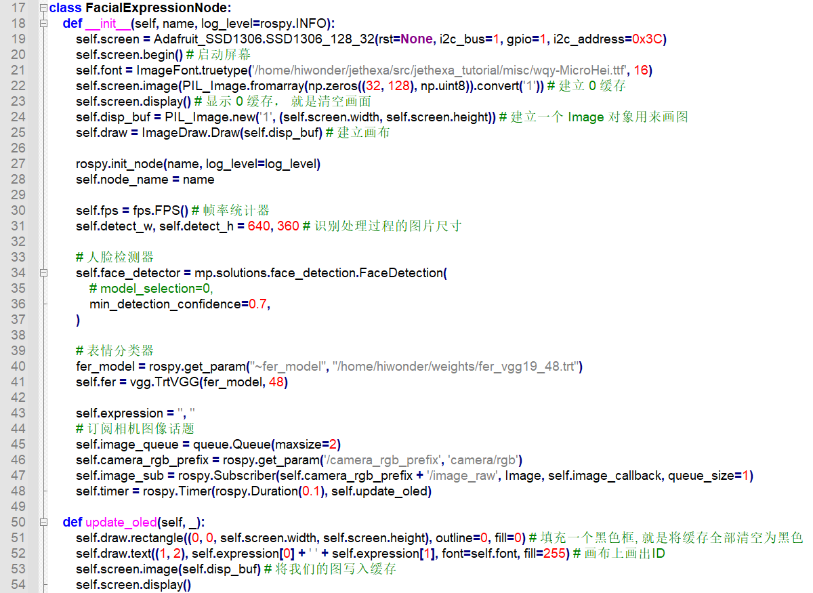

### 13.4.3 Operation Steps

The input command should be case sensitive, and the keywords can be complemented by “**Tab**” key.

1. Start JetHexa, and then connect it to NoMachine.

2. Double click  or press “**Ctrl+Alt+T**” to open command line terminal.

3. Input command “**sudo systemctl stop jethexa_bringup.service**” and press Enter to stop initial display service.

4. Input command “**roslaunch jethexa_tutorial electronic_model_06_facial_expression.launch**” to run the program.

5. If want to close this game, please press “**Ctrl+C**”. If the game cannot be closed, please press the key again.

### 13.4.4 Program Outcome

After the program runs, you can make a face within the field of view of the camera. When JetHexa recognizes human face, OLED display module can display the emotion type and its probability.

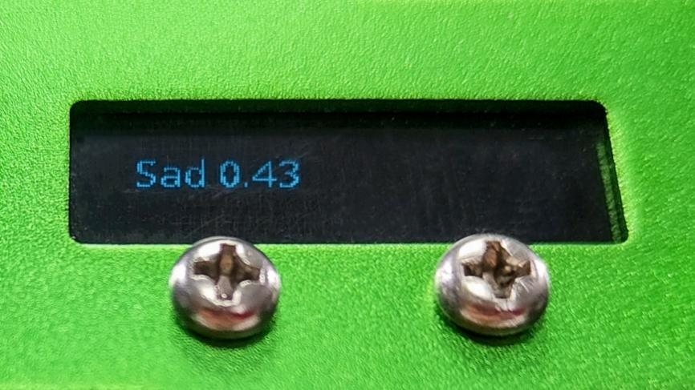

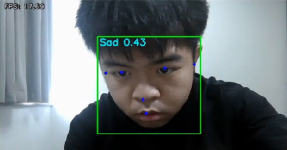

### 13.4.5 Program Analysis

JetHexa can recognize 7 emotions, including Angry, Disgust, Fear, Happy, Sad, Surprise and Neutral (poker face).

### 13.4.6 Basic Configuration

- **OLED Display Configuration**

Initialize the configuration of OLED display

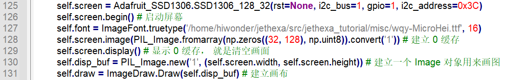

- **Face Detection Model**

Import the face detection sample in **MediaPipe**. Set the minimum detection confidence as 0.7. If the probability of face detection is greater than this value, the detection is successful.

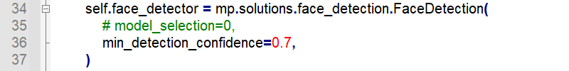

MediaPipe is an open source multi-media framework for machine learning model released by Google Research. Based on graphical cross-platform framework, it is used for building multi-mode (video, audio and sensor) machine learning pipe.

Solutions are open source pre-built examples based on specific pre-trained TensorFlow or TFLite models. Face detection (mediapipe.solutions.face_detection), hand key point detection (mediapipe.solutions.hands), human pose detection ( mediapipe.solutions.pose), etc., are commonly used Solutions.

- **Emotion Classification Model**

Configure model file to build emotion classification model.

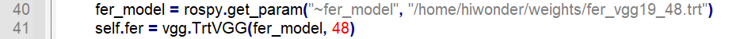

### 13.4.7 Emotion Recognition

- **Face Recognition**

After obtaining and processing the camera returned image, detect human face within the image, then normalize the data and convert it into pixel coordinate.

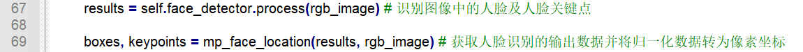

- **Emotion Classification**

Based on the emotion classification model, recognize the emotion of the target human face.

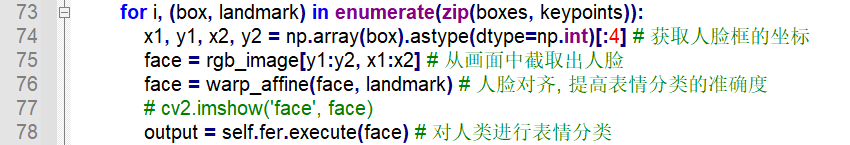

### 13.4.8 OLED Display

Call **self.draw.text()** function to display the emotion type on OLED screen.

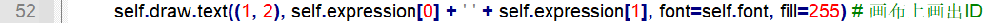

The first parameter “**(1, 2)**” s the coordinate of the position where the text begins to display.

The second parameter “**self.expression\[0\] + ' ' + self.expression\[1\]**” is the text content i.e. emotion type.

The third parameter “**font=self.font**” stands for the font.

The fourth parameter “**fill=255**” represents the font color, and value “**255**” means red.

## 13.5 Lesson 5 Tag Recognition and Display

### 13.5.1 Wiring

Connect OLED display module to any IIC interface on Jetson Nano expansion board through 4PIN wire. Its screen size is 128\*32 mm.

### 13.5.2 Program Logic

Firstly, the program will initialize the settings of OLED display, including startup screen, loading specific font and building canvas object.

Then, subscribe the topic published by camera node to obtained the RGB image, then convert it into gray image and zoom it.

Next, recognize the tag and acquire the coordinate of tag center, coordinate of its four corners and its ID.

Lastly, display the tag ID and the coordinate of tag center on the OLED screen, and mark the four corners of the tag and 3D coordinate axis on the camera returned image.

The source code of this program is located in:

**/home/hiwonder/jethexa/src/jethexa_tutorial/scripts/electronic_module_07_tag_disp.py**

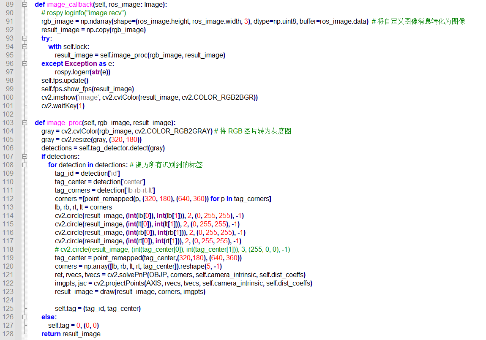

circle() function can be called to mark the corners of the tag. Take “**cv2.circle(result_image, (int(lb\[0\]), int(lb\[1\])), 2, (0, 255, 255), -1)**” for example. The meaning of the parameter in the bracket is as follows.

The first parameter “**result_image**” is the input image.

The second parameter “**(int(lb\[0\]), int(lb\[1\]))**” is the coordinate of the center of a circle.

The third parameter “**2**” is the radius of circle.

The fourth parameter “**(0, 255, 255)**” is the line color

The fifth parameter “**-1**” is the line width. And “**-1**” represents solid circle.

### 13.5.3 Operation Steps

The input command should be case sensitive, and the keywords can be complemented by “**Tab**” key.

1. Start JetHexa, and then connect it to NoMachine.

2. Double click  or press “**Ctrl+Alt+T**” to open command line terminal.

3. Input command “**sudo systemctl stop jethexa_bringup.service**” and press Enter to stop initial display service.

4. Input command “**roslaunch jethexa_tutorial electronic_model_07_tag_disp.launch**” to run the program.

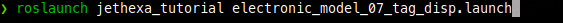

5. If want to close this game, please press “Ctrl+C”. If the game cannot be closed, please press the key again.

### 13.5.4 Program Outcome

After the program runs, place the tag within the field of view of the camera. When JetHexa recognizes the tag, the tag ID and coordinate of the tag center will be displayed on OLED screen, and the four corners of the tag and 3D coordinate axis will be marked on the camera returned image.

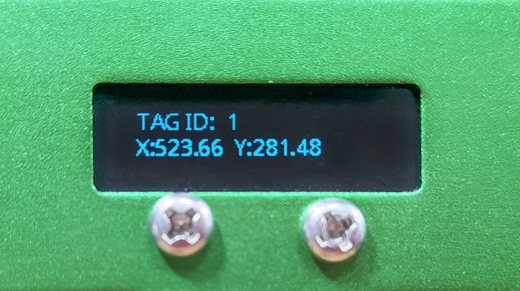

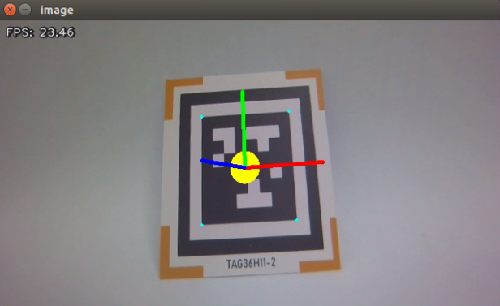

## 13.6 Lesson 6 Gesture Recognition and Display

### 13.6.1 Wiring

Connect OLED display module to any IIC interface on Jetson Nano expansion board through 4PIN wire. Its screen size is 128\*32 mm.

### 13.6.2 Program Logic

Firstly, the program will initialize the settings of OLED display, including startup screen, loading specific font and building canvas object.

Then, build a hand recognition model, and subscribe the topic published by camera node to obtain the RGB image.

Next, flip the image, then detect the hand within the image for gesture recognition.

Lastly, display the gesture type on the OLED screen, and mark the hand key points on the camera returned image.

The source code of this program is stored in

**/home/hiwonder/jethexa/src/jethexa_tutorial/scripts/electronic_module_08_hand_gesture.py**

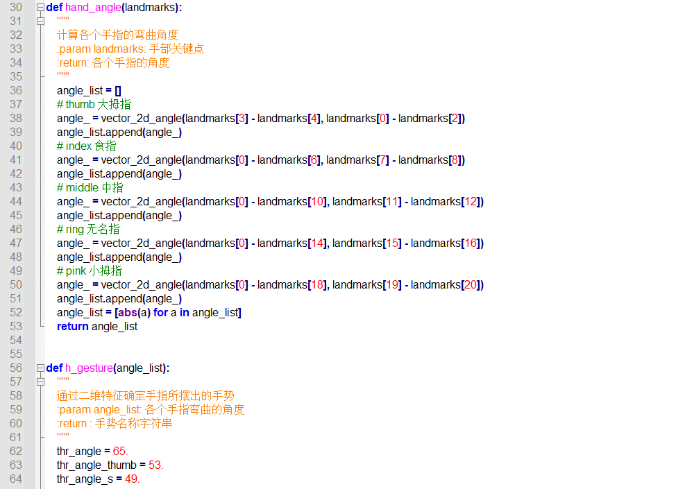

### 13.6.3 Operation Steps

The input command should be case sensitive, and the keywords can be complemented by “**Tab**” key.

1. Start JetHexa, and then connect it to NoMachine.

2. Double click  or press “**Ctrl+Alt+T**” to open command line terminal.

3. Input command “**sudo systemctl stop jethexa_bringup.service**” and press Enter to stop initial display service.

4. Input command “**roslaunch jethexa_tutorial electronic_model_08_hand_gesture.launch**” to run the program.

5. If want to close this game, please press “Ctrl+C”. If the game cannot be closed, please press the key again.

### 13.6.4 Program Outcome

After the program runs, please make the following gestures within the field of view of camera. When JetHexa recognizes the gesture, the gesture type will be displayed on the OLED screen, and the hand key points will be marked on the camera returned image.

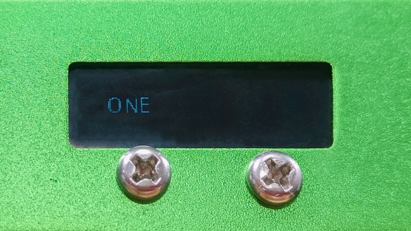

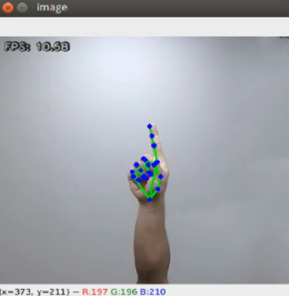

JetHexa can recognize the following gestures.

| **Gesture** | **Example** |
| --- | --- |
| fist | 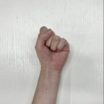 |
| hand_heart |  |
| OK | 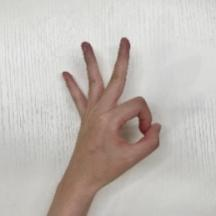 |
| one | 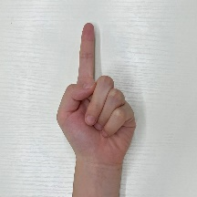 |
| two | 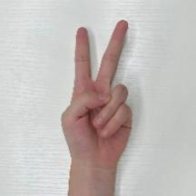 |
| three | 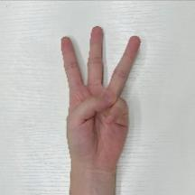 |
| four | 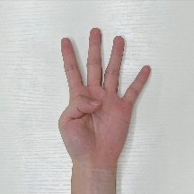 |
| five | 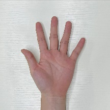 |
| six | 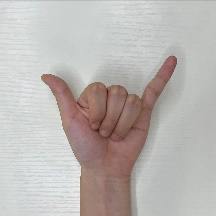 |

### 13.6.5 Program Analysis

### 13.6.6 Basic Configuration

- **OLED Display Configuration**

对OLED显示屏进行初始化配置。Initialize the configuration of OLED display

- **Build Hand Recognition Model**

Import the hand recognition sample in MediaPipe to build hand recognition model

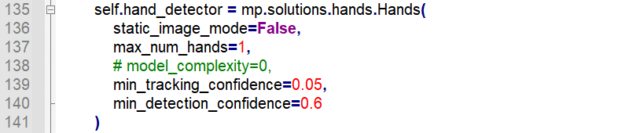

The first parameter “**static_image_mode**” is the processing mode of the input image, and it is set as “**False**” by default representing that the input image is video streaming that is landmark tracking will be performed on the subsequent images after the first picture is detected. When the tracking ends in failure, the image will be detected again, which is beneficial to reduce computation and latency.

When this parameter is set as “**True**”, the program will detect all the input images. This method is suitable to detect a batch of static and unrelated images.

The second parameter “**max_num_hands**” refers to the maximum detection quantity of hands at once.

The third parameter “**min_tracking_confidence**” is the minimum tracking confidence of the coordinate tracking model ranging from 0 to 1. When “**static_image_mode**” is set as “**True**”, this parameter is invalid.

The fourth parameter “min_detection_confidence” is the minimum detection confidence of the hand detection model ranging from 0 to 1. If the hand detection probability within the error range is greater than this value, the detection is successful.

### 13.6.7 Gesture Recognition

- Hand Key Point Detection

获得并处理摄像头图像后，基于先前搭建的手部识别模型，检测图像内的手部关键点。 After obtaining and processing the camera image, detect the hand key points within the image based on the hand recognition model previously built.

- **Connect Hand Key Points**

Call **solutions.drawing_utils.draw_landmarks()** function in mediapipe library to connect the key points of the hand with line.

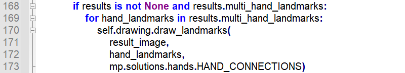

The first parameter “**result_image**” is the input image.

The second parameter “**hand_landmarks**” is the coordinate of the detected hand key point

The third parameter represents the line connecting the coordinates.

- **Judge Gesture**

According to the line connecting the hand key points, calculate the bending angle of each finger to judge the gesture.

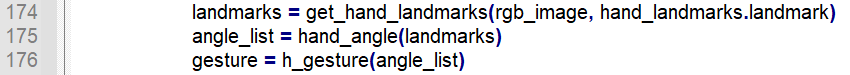

### 13.6.8 OLED Display

**self.draw.text()** function will be called to display the gesture type on the OLED screen.

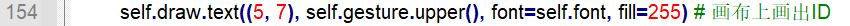

The first parameter “**(5, 7)**” s the coordinate of the position where the text begins to display.

The second parameter “**self.gesture.upper()**” is the text content i.e. gesture type.

The third parameter “**font=self.font**” stands for the font.

The fourth parameter “**fill=255**” represents the font color, and value “**255**” means red.
