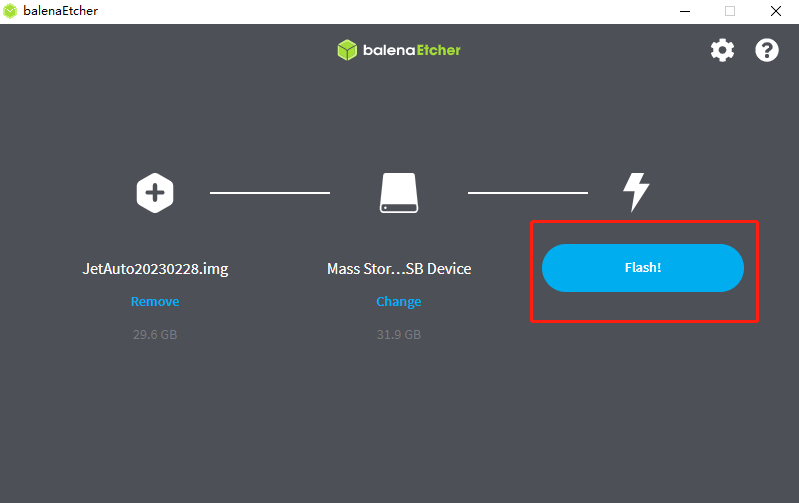
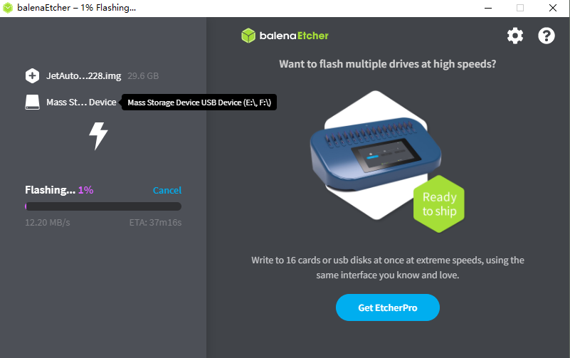
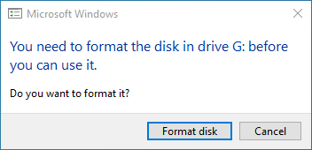

# 14. Appendix

## 14.1 Image

### 14.1.1 Burn System Image

The instructions below takes JetAuto as example. They can be applied to Jetson Nano series robots.

#### 14.1.1.1 Preparation

As Jetson Nano B01 board does not come with a built-in memory module, it’s important to burn the system image onto the SD card and insert the SD card into Jetson Nano so that Jetson Nano can boot up successfully.

Unlike an ISO file that is typically used to install an operating system on a computer, the official OS for the Jetson Nano (Ubuntu system) is an img file that needs to be written directly onto the SD card. For example, burn the system image of JetAuto created by our company.

Before burning the system image, you need to prepare the following stuffs:

- Card reader

- Memory card

- balenaEtcher-Portable (tool for burning the system image). The tool can be found in the same folder.

#### 14.1.1.2 Extract the System Image

Extract the system image files to a storage path that contains only English characters.

#### 14.1.1.3 Burn System Image

1. After completing the above steps, insert the SD card into card reader and connect the card reader to your computer. Then, use the software “**balenaEtcher**” to burn the system image.

2. Click-on “**Flash from file**” and import the extracted image file.

3. Click-on “**Select target**” to select the SD card onto which the image is burned.

**Note: the SD card will be formatted automatically during the process of image burning. If the SD card contains some important data, please remember to back up the data before burning the image.**

4. Select the corresponding SD card, and then click-on “**Select(1)**”.

5. Click-on “**Flash!**” to start burning the system image. It takes a wile for the burning process to be completed.

6. If the below window pops up, simply click-on “Cancel”.

The system image is burned successfully once the interface shows “**Flash Complete!**”.

