# 15. Microphone Array Module Lesson

## 15.1 Microphone Basic Course

### 15.1.1 Lesson 1 R818 Noise Reduction Board and Ring Six-Microphone Module Array Introduction

#### 15.1.1.1 R818 Noise Reduction Board Introduction

#### 15.1.1.2 Introduction

The R818 noise reduction board is a speech front-end solution based on a multi-microphone array. This module utilizes a 4-core high-performance edge computing processor. Integrated with iFLYTEK's speech algorithm, it utilizes the spatial filtering characteristics of the microphone array to form a directional pickup beam based on the angle of the user, suppressing noise outside the beam to enhance far-field pickup quality. Simultaneously, for integrated human-machine interaction terminals, it integrates high-performance echo cancellation algorithms to reduce the difficulty of speech and semantic recognition. Developers can integrate it quickly, enabling products to have functions such as multi-microphone audio collection, wake-up, noise reduction, and echo cancellation.

#### 15.1.1.3 Specification

The interfaces and interface descriptions of the R818 noise reduction board are as shown in the following figure and table:

| **Interface No.** | **Interface Name** | **Instruction** |
| --- | --- | --- |
| **1** | Serial port | Used for communicating with PC software |
| **2** | Reference signal port | Amplifier/Echo Cancellation Reference Signal |
| **3** | Microphone port | Connect with 6-micorphone array |
| **4** | Independent power port | Power input port |
| **5** | UAC port | Audio output port |

#### 15.1.1.4 Parameter Instruction

**1. Performance Parameter Indicators**

Key parameters:

| **Microphone** | SPA1687LR5H-1 |
| --- | --- |
| **Sensitivity** | -3dBV/Pa |
| **Signal-to-Noise Ratio (SNR)** | 65dB |
| **PCB Dimension** | 90mm\*50mm\*1.2mm |
| **External Interface** | Serial port, UAC port, independent power port, reference signal port, microphone port |

Electrical parameters:

| **Project** |  | **Minimum value** | **Typical value** | **Maximum value** |
| --- | --- | --- | --- | --- |
| **Operating voltage** | DC5V | 4.75V | 5V | 5.25V |
| **Operating current** | DC5V | 250mA | 300mA | 400mA |
| **Working environment** | Temperature | -20℃ | 25℃ | 70℃ |
| **Working environment** | Relative humidity | / | / | 95% |

**2. Structure Dimension Parameters**

Front View:

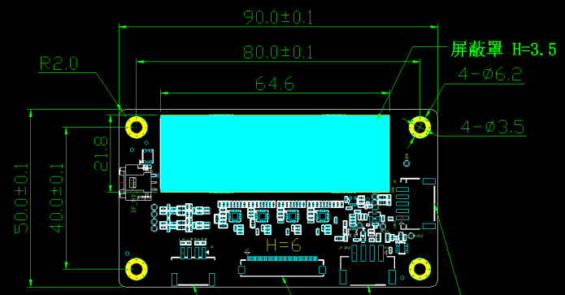

Back View:

#### 15.1.1.5 Ring 6-Microphone Array Introduction

#### 15.1.1.6 Introduction

The ring 6-microphone array is a high-sensitivity, high signal-to-noise ratio microphone pickup board, consisting of six analog silicon microphone capsules arranged in a circular pattern. When incorporating with a main board, it can achieve high-performance echo cancellation (AEC), environmental noise reduction, and 10-meter original sound pickup, among other functions.

#### 15.1.1.7 Specification

The structure of the ring 6-microphone array is as pictured:

Front view： Back view：

**1. Microphone signal interface: connect to the R818 noise reduction board.**

**2. The backside features six analog silicon microphones arranged in a circular pattern for sound reception.**

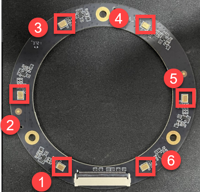

#### 15.1.1.8 Ring 6-Microphone Array Parameter Instruction

**1. Performance Parameter Indicators**

Key parameters:

| **Microphone**               | SPA1687LR5H-1                     |
| --- | --- |
| **Sensitivity**              | -3dBV/Pa                          |
| **Signal-Noise Ratio (SNR)** | 65dB                              |
| **PCB dimension**            | 115mm\*12mm\*1.2mm                |
| **External interface**       | Microphone board signal interface |

Electrical parameters:

| **Project** |  | **Minimum value** | **Typical value** | **Maximum value** |
| --- | --- | --- | --- | --- |
| **Operating voltage** | MICBIAS | / | 3.3V | / |
| **Operating current** | MICBIAS | / | 0.8mA | 10mA |
| **Working environment** |  | -20℃ | 25℃ | 70℃ |
| **Working environment** | Temperature Relative humidity | / | / | 95% |

**2. Structure Dimension Parameter**

Front view:

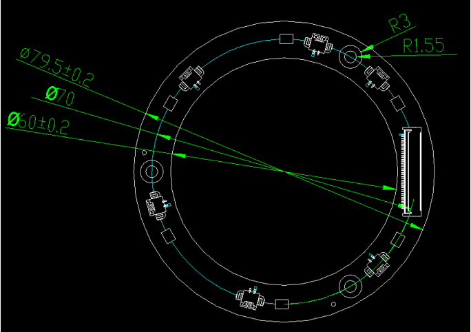

Back view:

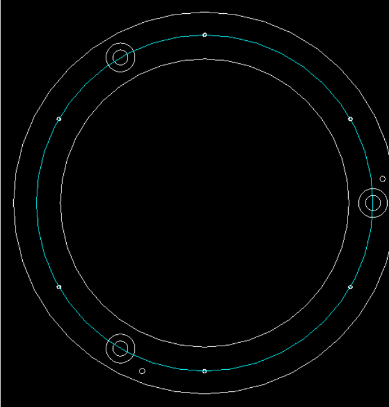

### 15.1.2 Lesson 2 Wiring and Serial Port Debugging

#### 15.1.2.1 Ring 6-Microphone Array Wiring

1. Prepare R8118 noise reduction board, ring 6-mirophone array, microphone cable, serial port cable, and UAC cable.

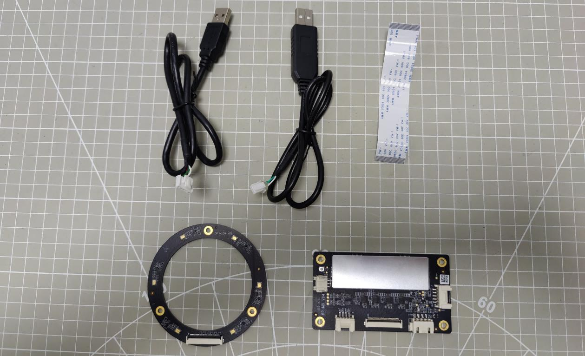

2. Use microphone cable to connect the microphone module to the noise reduction board as pictured. When making the connection, refrain from applying excessive force to prevent cable damage.

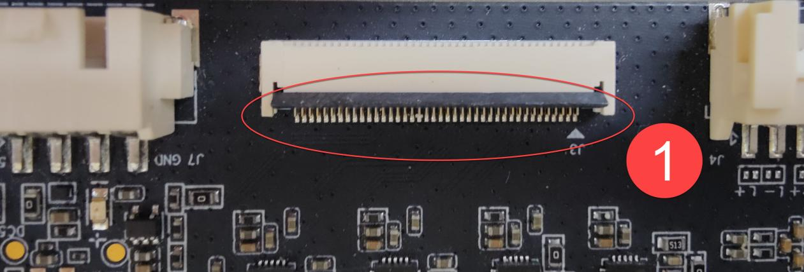

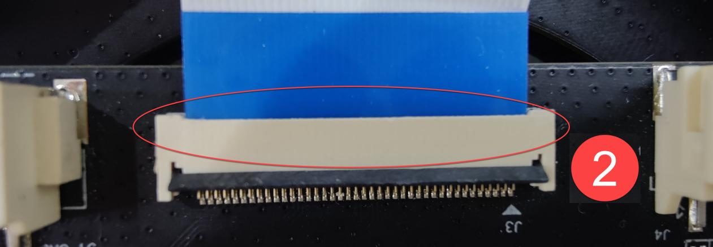

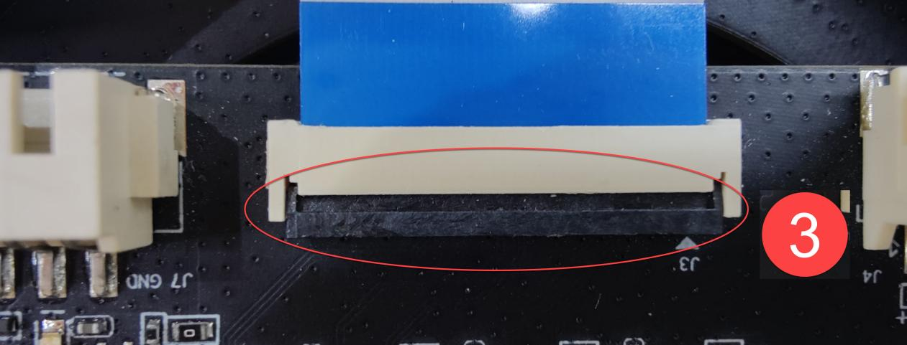

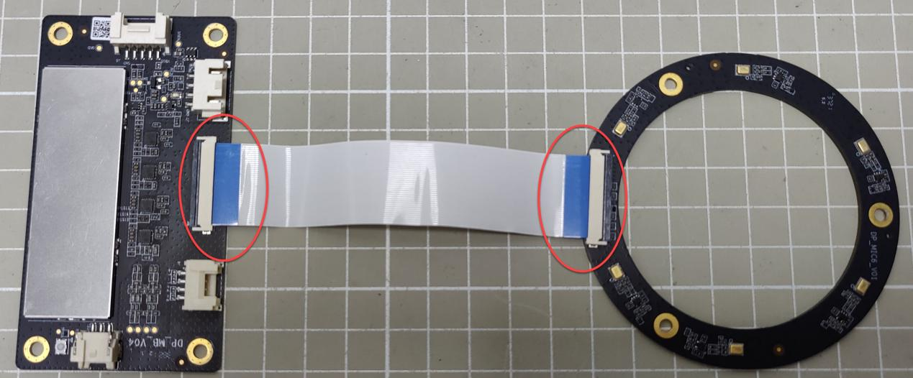

3. Prepare the microphone casing, and secure the ring microphone onto the casing. The fixing method is shown as follow:

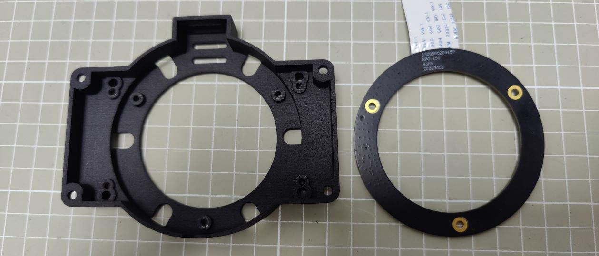

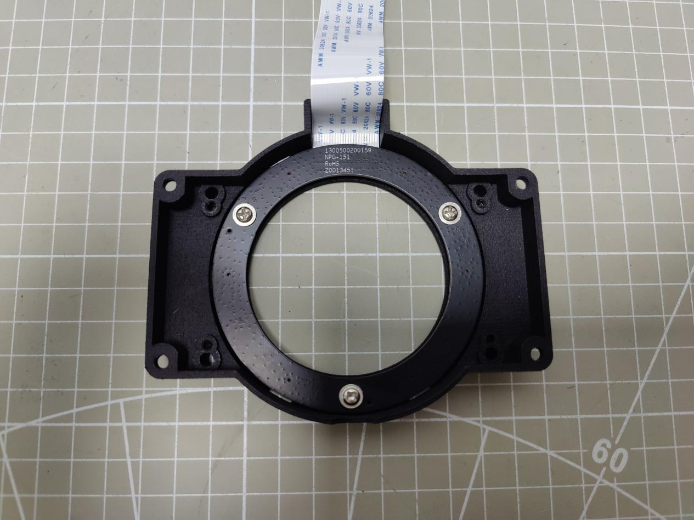

4. Insert the serial port cable and UAC cable into the corresponding serial port and UAC interface on the noise reduction board, respectively.

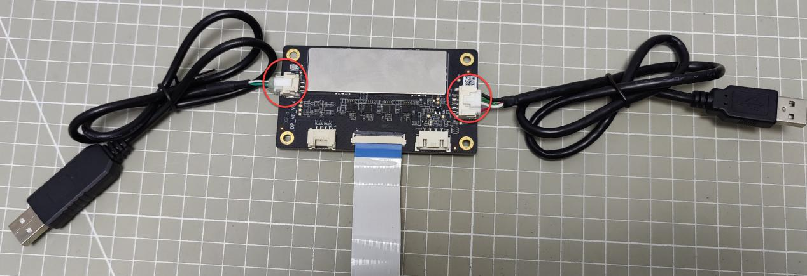

5. Attach the noise reduction board onto the casing as pictured:

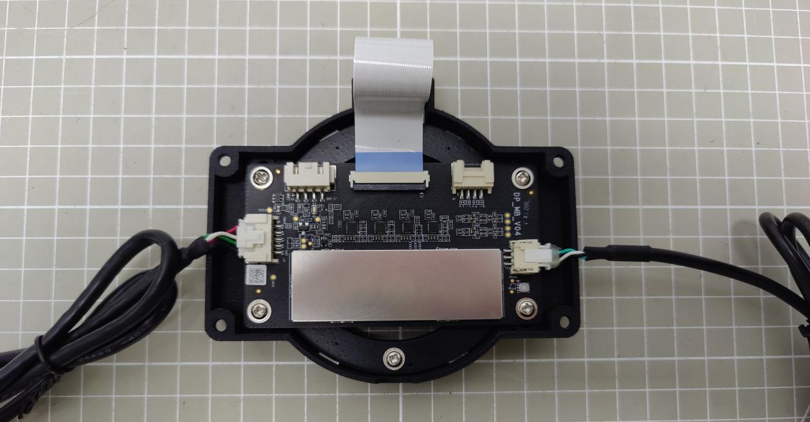

6. Plug the USB connectors of two cables into the USB port on your computer. At this point, the power indicator on the noise reduction board will illuminate red.

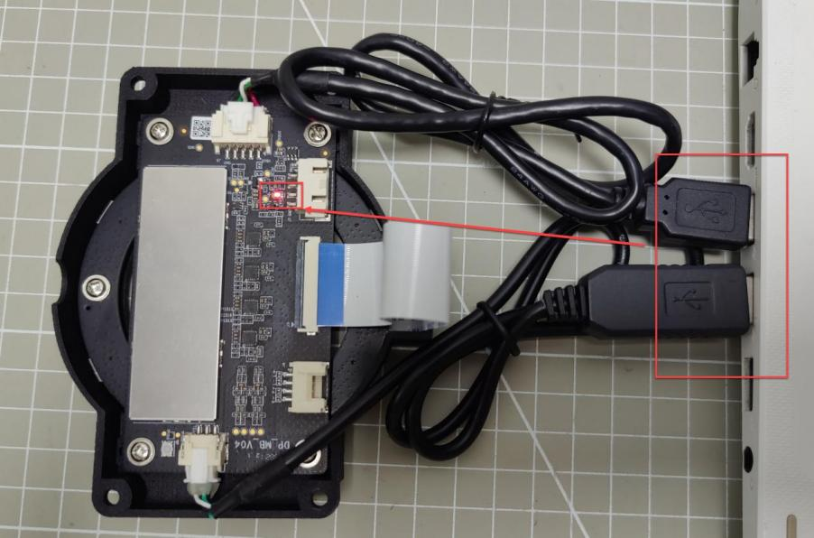

#### 15.1.2.2 Install Serial Port Debugging Tool

1. Locate the serial port debugging tool zip file in the “Serial Port Debugging Tool” folder at the same directory, and extract it.

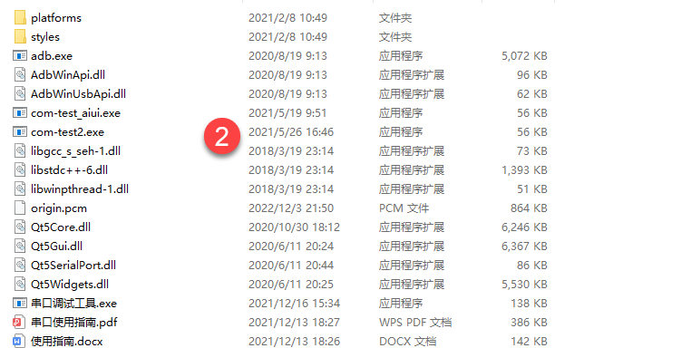

2. Double click the executable file “**Serial Port Debugging Tool.exe**” to open the serial port debugging tool.

3. Its interface can be divided into four areas: display area, serial selection area, command input area, and button areas, as illustrated in the diagram below:

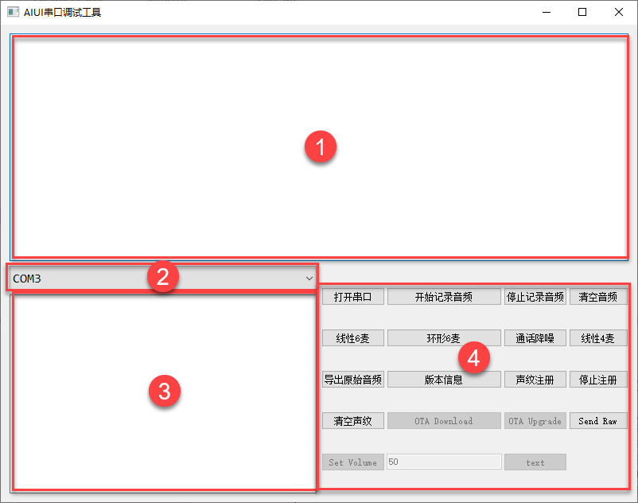

**1. Display area: display the real-time information of the serial port and microphone.**

**2. Serial port selection area: select the port number for the connected microphone**

**3. Command input area: input commands for microphone control**

**4. Button area: control the microphone. The specific functions corresponding to each button refers to the following table:**

#### 15.1.2.3 Test Ring 6-Microphone Array

**Note: when recording with the microphone, sound in the main microphone direction will be amplified, while sound in other directions will be attenuated. This can enhance the quality and clarify of the captured sound.**

1. Select the microphone’s serial port in the serial selection area. In this document, Connecting to COM3 will be used as example. (Note: Serial numbers are not fixed. If COM1 appears, do not connect to it, as it is the system communication interface. )

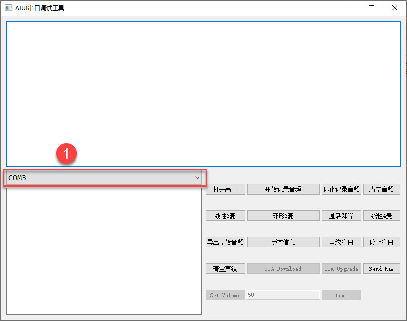

Note: If your computer is connected to multiple devices and you are unsure the port number for the microphone, you can right-click on "**This PC**" click "**Manage**" then navigate to Device Manager. Look for any entry with the label "**CH340**," as this indicates the port number for the microphone.

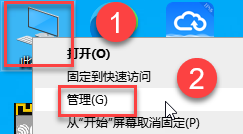

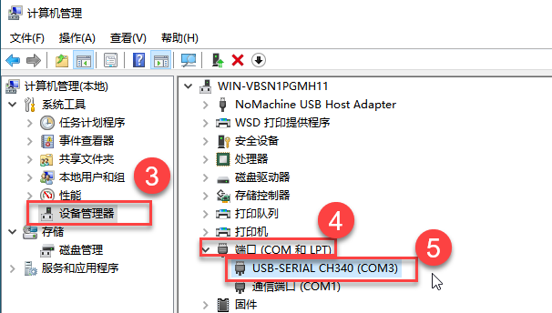

2. Click on "**Open Serial Port**" in the serial port selection area. When you see the page as shown below, it means the connection with the PC has been successfully established.

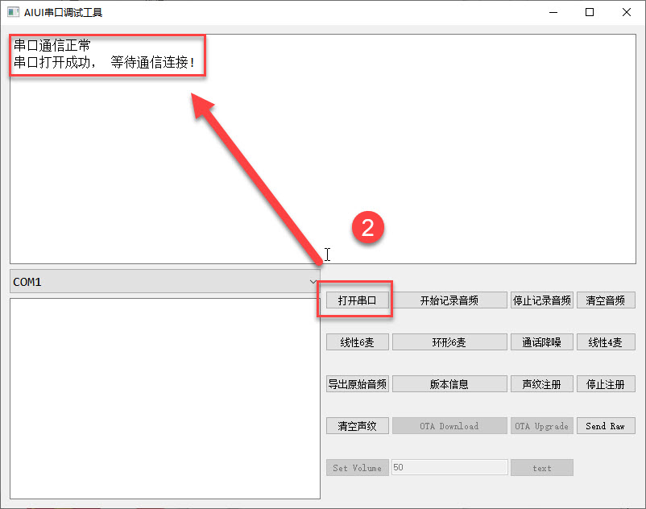

3. Input “**{"type":"version"}**” in the command input area and click “**Send Raw**” to view the version information of microphone in the display area.

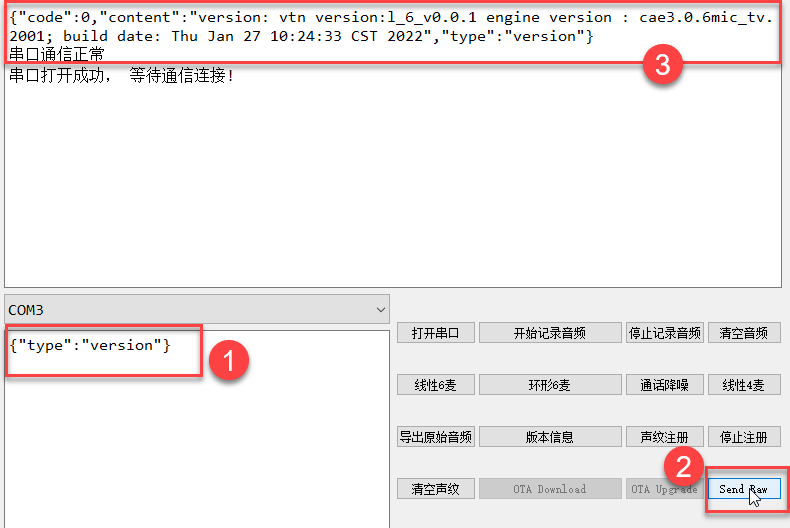

4. Enter "**{"type":"wakeup_keywords", "content":{"keyword": "xiao3 huan4 xiao3 huan4", "threshold": "900"}**" in the command input area, then click "**Send Raw**". You will then be able to view the microphone's communication information in the display area. ("**content:**" represents wakeup content, "**keyword:{}**" represents the keyword, where "**xiao3**" stands for "xiao" with the third tone, and "**huan4**" stands for "huan" with the fourth tone; if you want to change the wakeup word, modify its pinyin and tones accordingly).

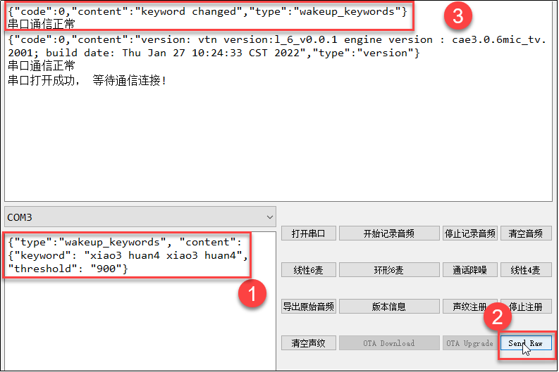

5. Then, simply speak “**Hello Hiwonde**r” to the microphone. At this point, the angle and wake-up word are printed in the display zone.

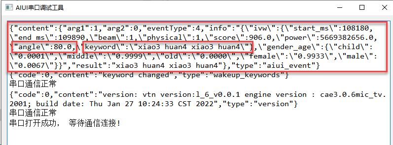

6. From the image above, “angle” represents that wake-up angel, and “keyword” represents the wake-up word.

#### 15.1.2.4 Use Microphone on PC

1. Open the recording tool on PC, and start recording.

2. After the recording is completed, click.

### 15.1.3 Lesson 3 Install and Configure Virtual Machine

In computing, a virtual machine is a software program that emulates a physical computer system, allowing users to run multiple operating systems or applications on a single machine. Common virtual machine software includes VMware Workstation, VirtualBox, Microsoft Virtual PC, and others. For example, VMware Workstation allows users to install and configure virtual machines on their computer. This lesson will cover the installation, startup, and configuration of a virtual machine using VMware Workstation as an example.

#### 15.1.3.1 Install VMware Workstation

1. Extract the virtual machine package which is stored in “**Appendix -\> Tools for ROS System -\> Virtual Machine Installation Package**”.

2. After the package is extracted, open the executable **.exe** file in the package.

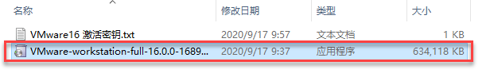

3. Finish the setup of virtual machine according to the below pictures.

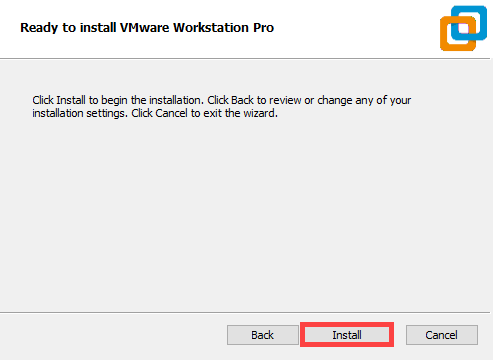

#### 15.1.3.2 Start Virtual Machine

1. Enter the virtual machine interface, then click “**Open a Virtual Machine**”.

2. Open the extracted image file on the pop-up.

3. Rename this virtual machine and change the storage path. For example, name it hiwonder and store it in D: Drive. After setting, click “**Import**”.

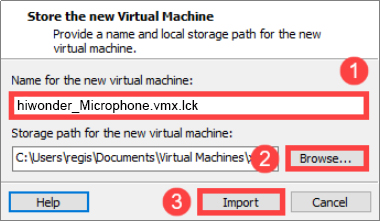

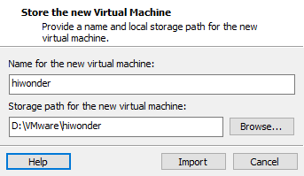

**NOTE:** it takes some time to import the image. Please be patient.

4. After the image is imported successfully, power on this virtual machine.

5. The virtual machine desktop is as pictured.

#### 15.1.3.3 Change Source

NOTE: This step is important and should not be skipped. Failing to complete this step may result in issues with downloading the installation package due to internet connectivity issues.

Ubuntu's Software application functions similarly to an App store on iOS and Android, allowing users to browse, download, and update software packages. By default, Ubuntu uses an officially designated software download server. However, if you experience slow download speeds or encounter errors while downloading, you can switch to a different server to download the software package.

For example, you can change the server to aliyun. You can choose the appropriate server based on your location or region for optimal download speed.

1. Click the buttons as pictured to check the network connectivity status.

2. Then search “**Software & Updates**”, double click the icon to open.

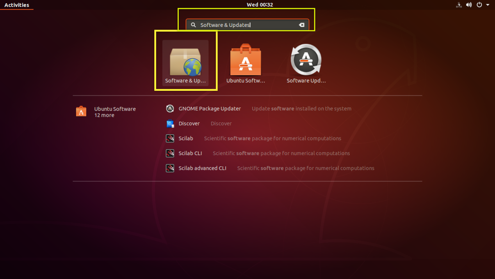

3. Click “**Download from -\> Other**”.

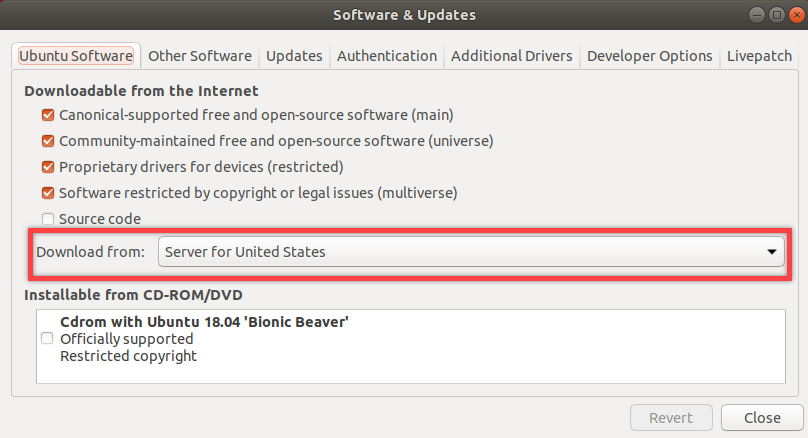

4. Scroll down the list to find aliyun server. (China-\>mirrors.aliyun.com)

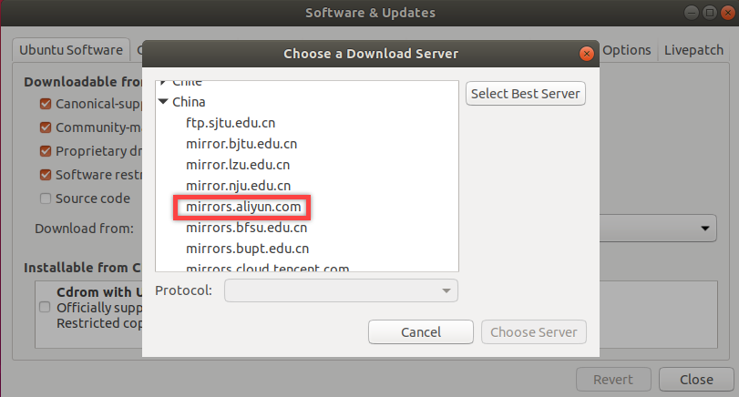

5. If you are not sure which server is suitable, you can click “**Select Best Server**”.

After selection, you are required to input the set password.

6. After the authentication is completed, click “**close**”.

7. If the following dialog box pops up, just click “**Rwload**” to update. Then close the page after update.

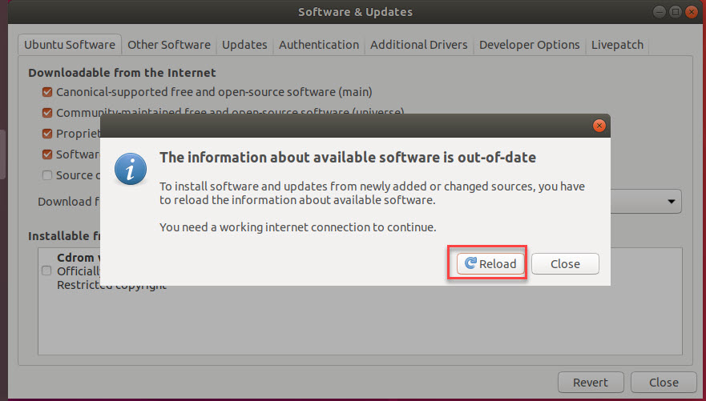

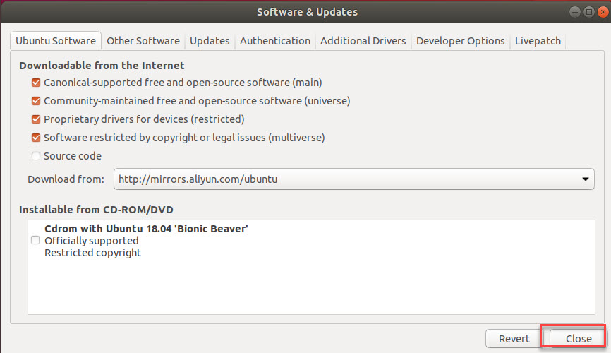

#### 15.1.3.4 Change Resolution

If you need to change the resolution, follow the instructions to operate.

1. Open “Settings”, and click search button at the bottom left corner, then input “display”.

2. Select the resolution you want, then follow the pop-up instructions to complete modification.

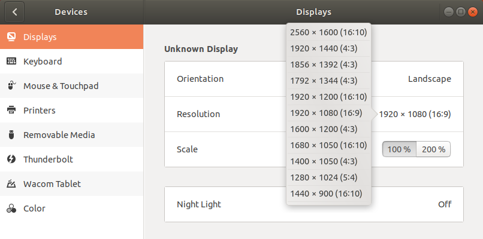

3. The final display effect is as follow.

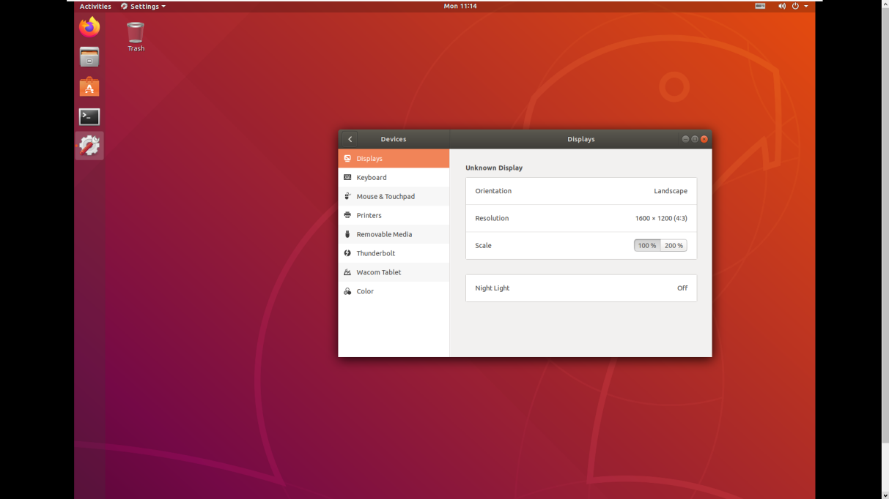

### 15.1.4 Lesson 4 Configure Ring 6-Microphone Array

#### 15.1.4.1 Apply for Offline Voice Resources and ID

As the robot utilizes offline voice recognition, you will require offline voice resources available exclusively on the iFLYTEC Chinese website. Please note that you need to switch the language to Chinese and follow the provided instructions for the process.

1. Enter iFLYTEC website, **https://www.xfyun.cn/,** then click “**sign in**” to create an account.

2. Choose “**Sign up with phone number**”, and fill in the required information. (select corresponding country code)

3. After registration, click ‘**console-\>my application**’ to add new application.

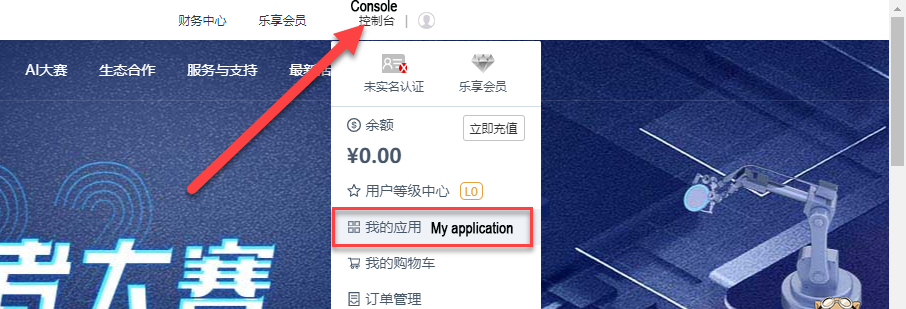

4. Fill in the required information, and click “Submit”.

5. Open the application you just added.

6. Then select **Speech Recognition → Offline Command Recognition** (New Version)

7. Download Linux AIKit.

8. Choose ‘OK’ to start downloading.

**Note: Each new application can only be used for free for ninety days. Subsequent use requires payment. When our application expires, we can apply for a new one up to five times per person. The method for applying for a new application is the same as mentioned above.**

9. Next, select your created username and Linux platform. After selecting, choose the '**Standard Version**' below, check '**Offline Command Recognition**' and '**Voice Wake-up**' functions, then click '**SDK Download**'.

10. Tick ‘I agree’ and choose ‘OK’ to confirm the download.

#### 15.1.4.2 ID Replace Offline Voice Resources and ID

**1.** **Extract the downloaded file and locate the offline voice resource “**common.jet**”.**

**2.** **After copying it, open the virtual machine, right-click on a blank area of the desktop, and select "**Paste**".**

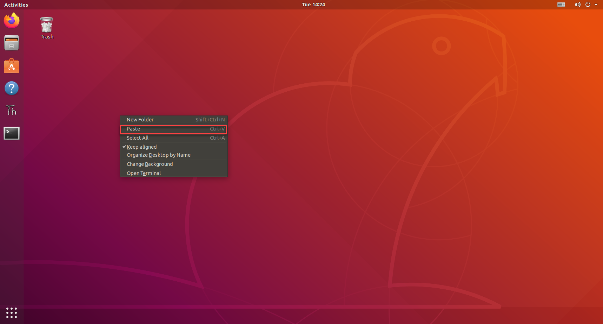

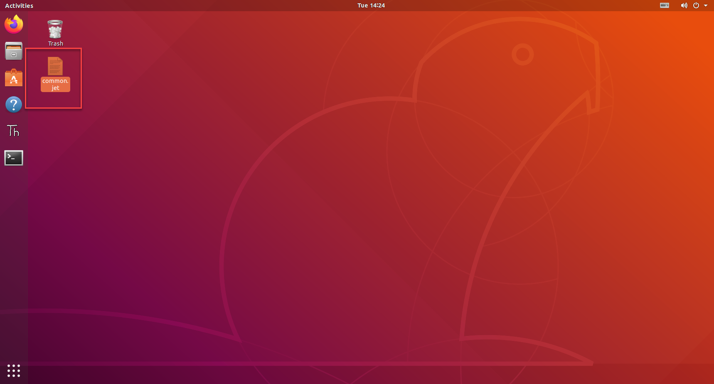

**3.** **Open the Ubuntu system within the virtual machine and navigate to the following path: “**ros_ws/src/xf_mic_asr_offline/config/msc/res/asr/**” to get access to the folder where the offline voice resources are stored. Then delete the files highlighted in the red box below:**

**4. Place the files obtained in the first step into the folder.**

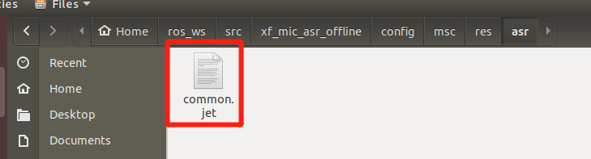

**5.** **Navigate to the path “**ros_ws/src/xf_mic_asr_offline/launch**”,and right click the “**mic_init.launchl**” file to select “**Open With Text Editor**”.**

**6. Set the appid inside the red box to the one obtained from iFLYTEK, then press "Ctrl+C" to save the changes. (Note: Offline voice resources must correspond to the appid.)**

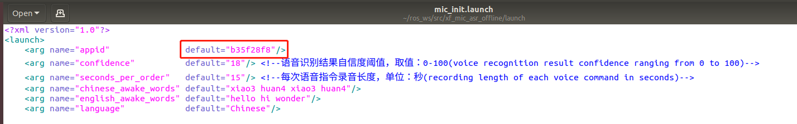

#### 15.1.4.3 Modify User Parameters

After modifying the APPID, if you need to adjust the threshold for speech recognition, recording duration, wakeup words, or wakeup voice, you can refer to the operations below:

1. Open the path "**ros_ws/src/xf_mic_asr_offline/launch**", right-click on the "**mic_init.launch**" file, and select the content highlighted in red box.

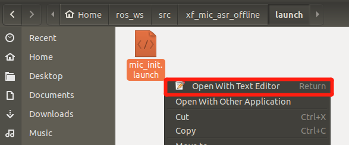

2. We can adjust the confidence threshold of speech results based on the two parameters highlighted in the red box as pictured, as well as set the duration for each voice command input.

3. Modify the English wakeup words based on the parameters highlighted in the red box in the image below.

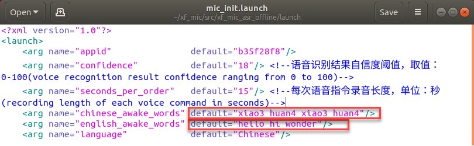

Syntax format for English wakeup words: "**word1 word2 word3 ...**"

4. According to the parameters highlighted in the red box in the image below, modify the wakeup language. If you want to change it to English, change it to "English".

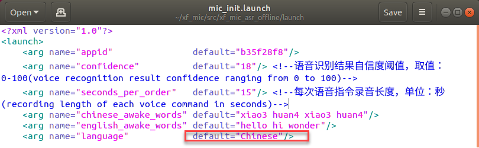

5. After completing the modifications, press "**Ctrl+S**" to save.

### 15.1.5 Lesson 5 Start Node

In this document, the initialization node of the microphone needs to be started to test if the microphone can work properly on the virtual machine.

1. Open the virtual machine.

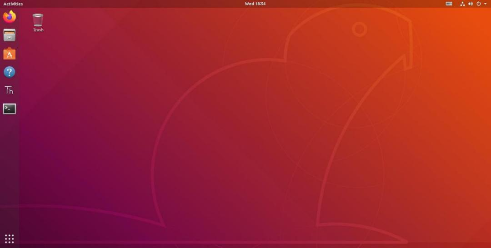

2. Apply and replace the offline voice resources according to the “**Lesson 4 Configure Ring 6-Microphone Array**” under the same directory.

3. Connect the microphone to your computer. The specific operations can refer to “**2. Wiring and Serial Port Debugging**”.

4. Select the device to be connected to the virtual machine in the pop-up window.

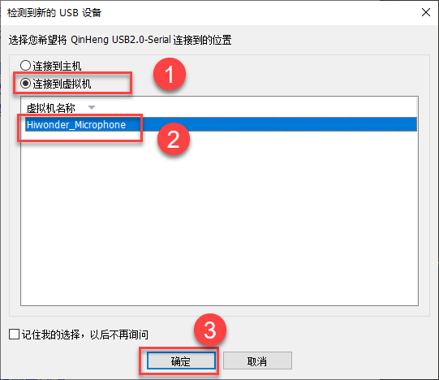

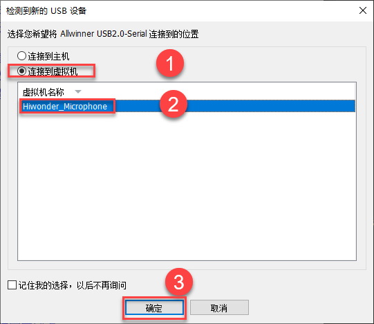

5. After making connection, press “**Ctrl+Alt+T**” to open the command-line terminal, and then enter the command “**ls /dev/tty**\*” to view the serial port number of the microphone, as highlighted in the following red box.

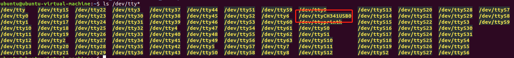

6. Enter the command “**cd ros_ws/src/xf_mic_asr_offline/launch/**” to access the file directory, and then enter “**vim mic_init.launch**” to open the file.

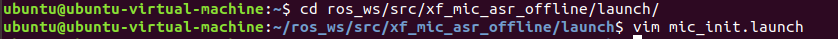

7. Change the serial port number inside the red box to “**/dev/ttyCH341USB0**” obtained in step 5), then save and exit

8. Enter the command “**/dev/ttyCH341USB0**”, press Enter and input the password to open the rules file.

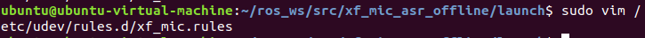

9. Enter the command **“ATTRS{idVendor}=="1a86", ATTRS{idProduct}=="7523", MODE="0666"**” to grant the use permission for the serial port of the microphone, then save and exit.

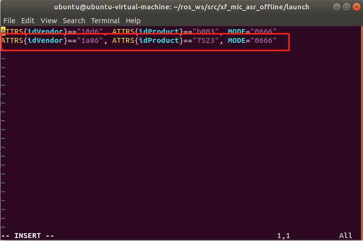

10. Enter the command "**roslaunch xf_mic_asr_offline mic_init.launch**" to start the initialization node.

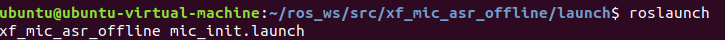

11. After initialization is completed, the content shown in the image below will appear. The initial startup may take some time, and once completed, it will appear as shown in the image below.

Note: if the prompt “**Microphone Device Not Found**” appears, please refer to the method below to install the microphone driver.

1. Enter the command “**cd ros_ws/src/CH341SER_LINUX/driver/**” and press Enter to switch to the directory where the driver is located.

2. Enter “**make**” to compile.

3. Enter “**sudo make load**” to load the driver.

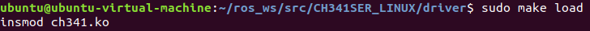

4. Enter “**sudo make install**” to install the program in system.

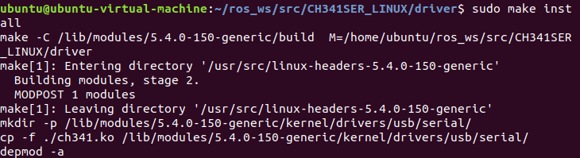

5. Once the driver is installed, enter the command “**roslaunch xf_mic_asr_offline mic_init.launch**” to start the microphone node.

12. Then, you can say “Hello Hiwonder” to wake up the microphone. After waking up, the terminal will print its wake-up angle, as shown in the figure below:

13. Press “Ctrl+C” to close the node.

### 15.1.6 Lesson 6 Wake up Microphone

#### 15.1.6.1 Start Voice Recognition

1. Enter the command “**roslaunch xf_mic_asr_offline mic_init.launch**” to start the microphone node.

2. The initial wake-up command is set as “**Hello Hiwonder**”, so you just need to speak “**Hello Hiwonder**” to wake up the microphone.

After wake-up, the microphone wake-up angle will appear as 259, which indicates the direction of the sound source relative to the microphone.

(Regarding the content of voice recognition, please refer to “**2. Voice Interaction\Lesson 3 Voice Respond”**.)

**Note: if the microphone has no respond to the wake-up command “Hello Hiwonder”, it is necessary to re-enter command to start microphone ROS node. （No need to re-plug the microphone）**

#### 15.1.6.2 Change Wake-up Command for Voice Recognition

**1.** **Navigate to the path “**ros_ws/src/xf_mic_asr_offline/launch**”, right click “**mic_init.launchl**” file and select “Open With Text Editor”.**

**2. Locate the content highlighted in red box.**

The syntax format for English wake-up command is “**Word1 Word2 Word3...**”.

**3.** **After modification is completed, press “**Ctrl+S**” to save.**

**4. Then enter the command “roslaunch xf_mic_asr_offline mic_init.launch” to start the voice wake-up function.**

#### 15.1.6.3 **Common Question**

Opening the initialization service for the six-channel microphone array multiple times may lead to the following issues:

This issue does not affect the normal use of the microphone. At this point, you just need to speak the wake-up word to restore normal functionality,

### 15.1.7 Lesson 7 Locate Sound Source

#### 15.1.7.1 Logic of Sound Source

Sound localization refers to the ability to locate a sound source in a sound field. There are two types of sound localization, including microphone array and sound intensity probe.

**1. Microphone array is composed of several or thousands of microphones that arranged in sequence. These microphones collect sound at the same time. As each microphone is placed in different position, the phases of audio they obtained are also different so that it calculates position of sound source based on this difference.**

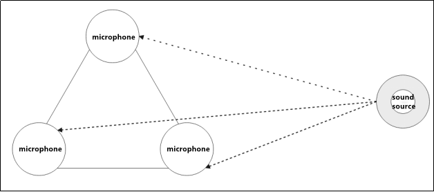

2）Sound intensity probe is composed of two microphones that face to each other. It can measure sound pressure, size and direction of sound wave vibration at each point in the space. Besides, scan and test near the surface or envelope of the measured object to get how the sound field distributes near the measured object, so as to grasp the location and distribution of the noise source.

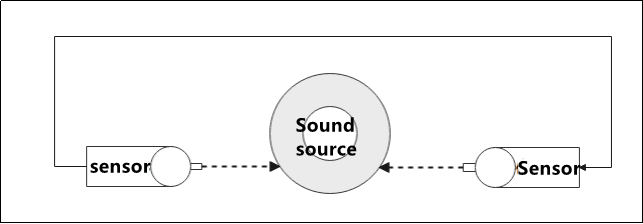

#### 15.1.7.2 Sound Localization Outcome

Please refer to “**Lesson 4 Wake up Microphone**” to wake up the microphone, then it will perform sound source localization. Following messages will pop up when microphone array is awaken.

Wake-up angle: 259. The sound source location and angle of microphone array center can be calculated based on the phase difference between sound collected by multiple microphones.

### 15.1.8 Lesson 8 Use of Sound Card and Speaker

#### 15.1.8.1 Sound Card Introduction

As a fundamental component of multimedia systems, a sound card converts analog sound waves into digital signals and vice versa. The primary function of a sound card is to convert raw audio signals from sources such as microphones, tapes, and disks, and output them to various devices such as speakers, headphones, amplifiers, and recorders. Additionally, sound cards can support the playback of the converted audio signals through MIDI interfaces.

Below is about the introduction to **USB to audio driver-free sound card.**

#### 15.1.8.2 Interface of Sound Card

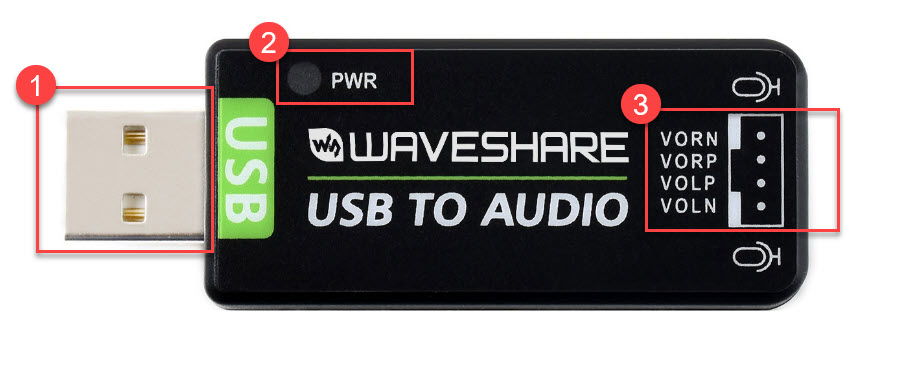

| **NO.** | **Name** | **Function** |
| --- | --- | --- |
| **1** | **USB interface** | connect to PC or embedded devices |
| **2** | **power indicator** | remains on red when the sound card is powered on |
| **3** | **speaker interface** | connect to external speaker |

#### 15.1.8.3 Interior Structure

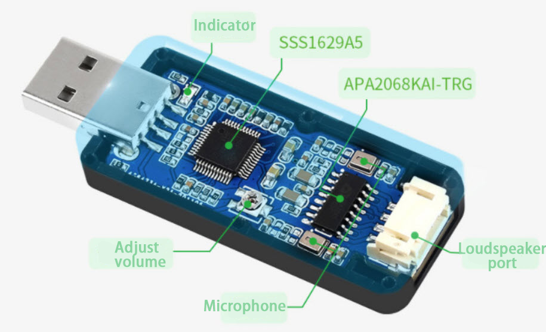

#### 15.1.8.4 Parameter

|     Power supply voltage     |            5V             |
| --- | --- |
| Audio encoding decoding chip |         SSS1629A5         |
|      Control interface       |            USB            |
|       Audio interface        |           PH2.0           |
|        Speaker driver        | 2.6W per channel (4Ω BTL) |

#### 15.1.8.5 Speaker Introduction

A speaker is an electroacoustic device that transforms an electrical signal into mechanical vibrations and emits sound waves into the surrounding space.

Parameters of speaker are as follow.

#### 15.1.8.6 Wiring Instruction

1. Connect the wire of speaker to the ports of sound card according to the below pictures. Please note that sound card must be turned off.

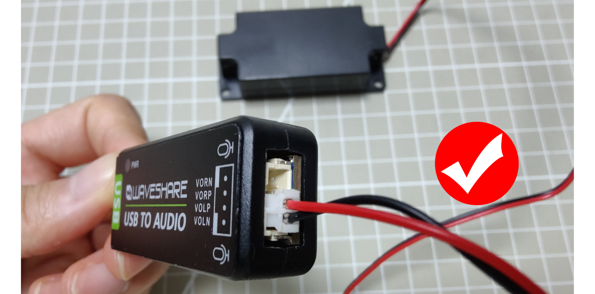

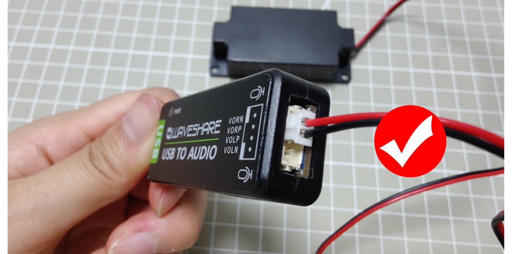

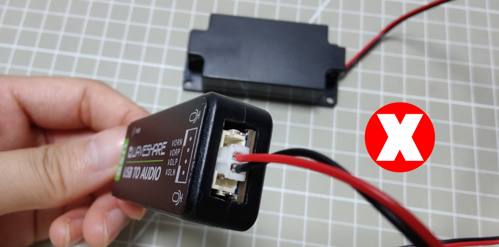

2. Then connect the USB extension cable to sound card.

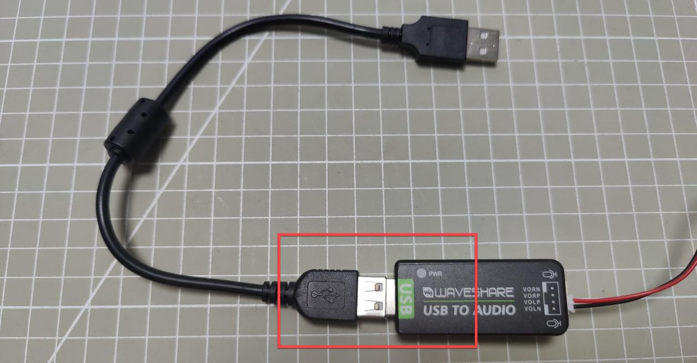

3. Lastly, connect the sound card to the USB port of Raspberry Pi.

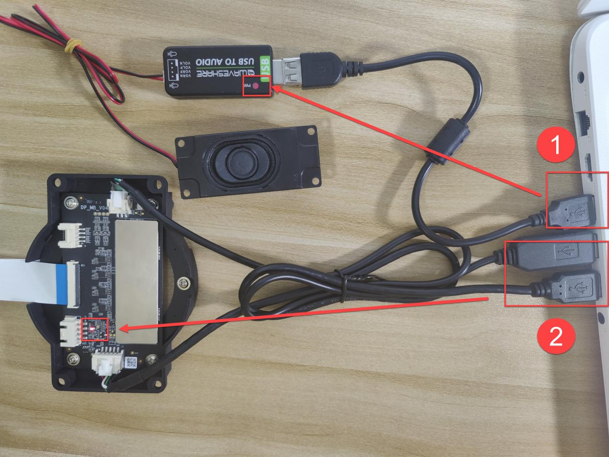

Additionally, the same connection method can also applicable to connect the sound card and the microphone to Raspberry Pi or Jetson Nano board.

#### 15.1.8.7 Hardware Testing

It is necessary to test if the sound card and speaker can operate properly.

1. Start the virtual machine. Regarding the configuration and installation, you can refer to “Lesson 2 Install and Configure Virtual Machine”.

**Note: if the virtual machine was not closed when the previous configuration is completed, the following prompt will pop up upon plugging the microphone. Follow the checkboxes in the figure below to proceed.**

2. Connect the sound card and speaker according to “Wiring Instructions”, then plug them into any USB port on the computer.

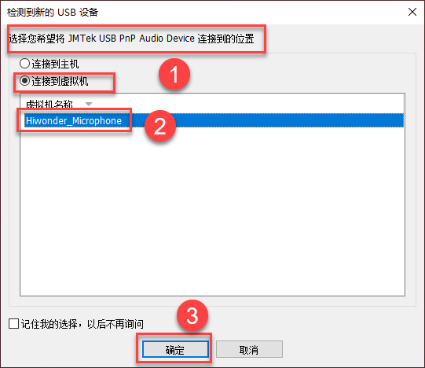

3. Click on the power button, then click on.

4. Locate the “**Sound**” tab, select “**USB PnP Audio Device**” in the output section, and click “**Test Speaker**”.

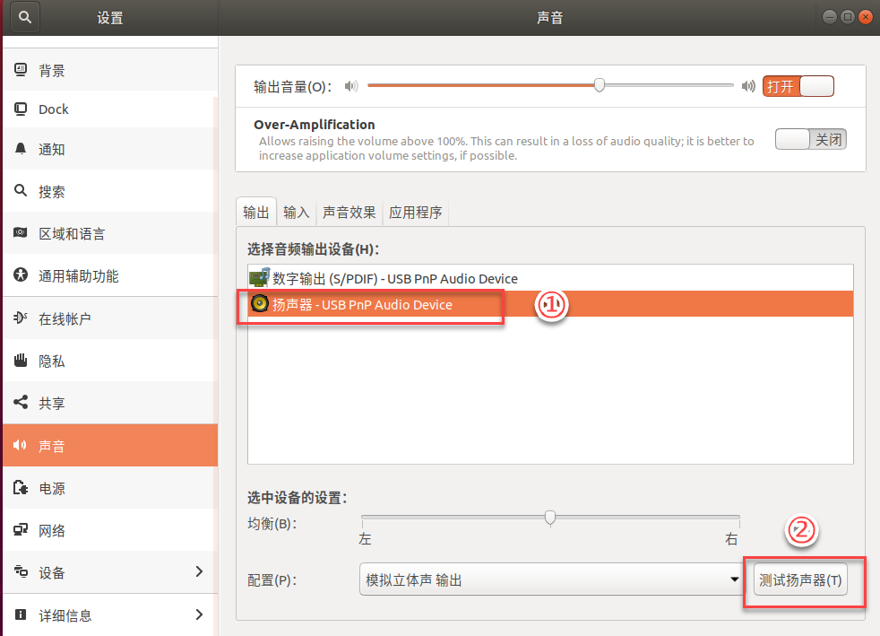

5. After opening, users can choose “Left front” or “Right front” based on the sound car wiring. For information on distinguishing between left and right channels, please refer to “3. Wiring Instructions”.

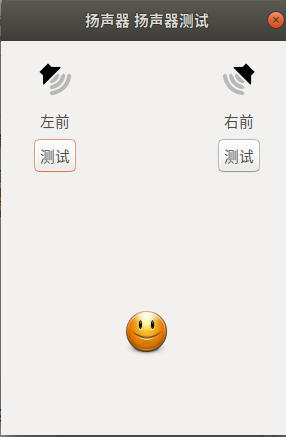

6. In this section, we are using the right channel connection as an example, so select "Right Front":

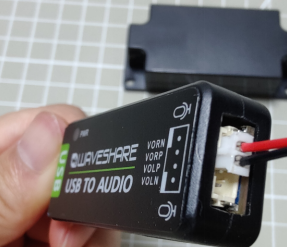

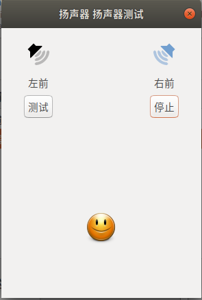

7. If you can hear the speaker broadcasting, it indicates that there are no hardware issues.

#### 15.1.8.8 Play Music

#### 15.1.8.9 Play Built-on Music File

If you want to play music, please refer to the following operations.

Regarding the configuration steps, please refer to “4. Test Hardware”. In this section, a built-in test music file is provided for user to get quick experience. The file location is indicated by the red box in the figure below.

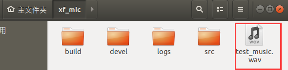

If you want to import external music, it is necessary to convert the music file to WAV format before importing. The importing method refers to “5.2 Import External Importing Music File”.

1. After opening the virtual machine, press “Ctrl+Alt+T” to open the command-line terminal. Enter command “**cd xf_mic/**” and press Enter. (**The input command should be case sensitive, and “TAB” key can be used to complement the key words**.)

2. Then enter the command “**play test_music.wav**” and press Enter to play music.

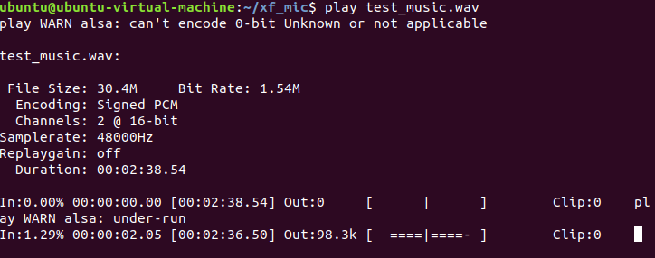

3. Press “**Ctrl+C**” stop playing music.

#### 15.1.8.10 Import External Music File

The virtual machine's system only supports playing audio files in WAV format by default. There are plenty of tutorials online on how to convert music files to WAV format. You can search for them on the internet. We won't provide detailed instructions here.

1. Copy the converted audio file from the PC. In this section, we'll use "**music123.wav**" as an example for illustration.

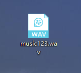

2. Then switch back to the virtual machine system and click on the button on the left side of the system. Next, locate the directory for the speech function package as shown in the image below. (Note: The placement in this directory is for demonstration purposes only.)

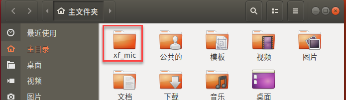

3. Right click “**Paste**”.

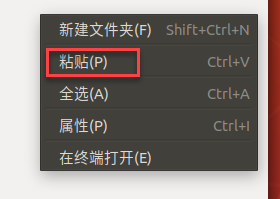

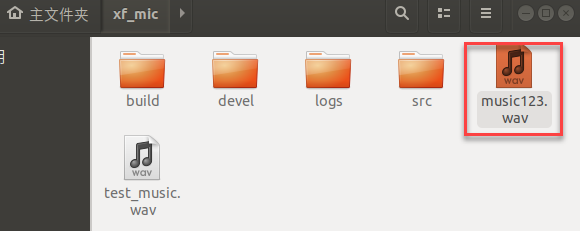

4. Press “**Ctrl+Alt+T**” to open the command-line terminal. Then, input the command to switch to the directory where the music is located by entering "**cd xf_mic/**" and press Enter. (**Note:The input command should be case sensitive, and “TAB” key can be used to complement the key words**.)

5. Then, enter the command “**play music123.wav**” and press Enter to play the music.

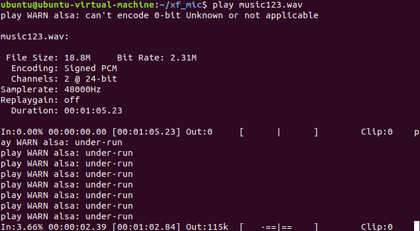

6. Press “**Ctrl+C**” to stop the music.

### 15.1.9 Lesson 9 Read Audio

#### 15.1.9.1 Function Introduction

The M260 Ring Microphone Array can store the original audio recordings, and the audio will be kept in the microphone until it is cleared.

窗体底端

#### 15.1.9.2 Export Raw Audio

1. Connect the serial port debugging tool according to “**Lesson 2 Wiring and Serial Port Debugging**”.

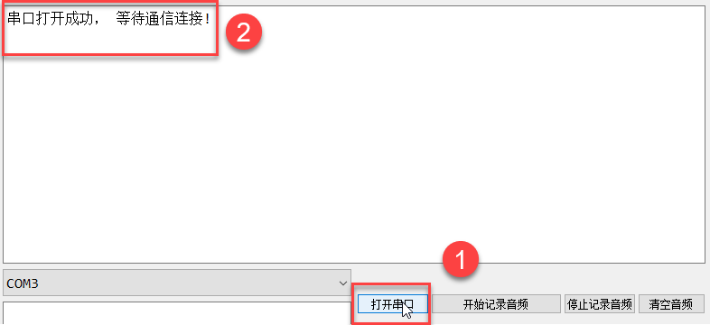

2. Click “**Start Recording Audio**”.

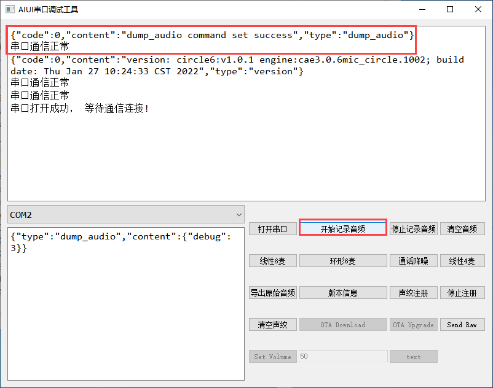

3. Click "**Stop Recording Audio**" when the recording is complete

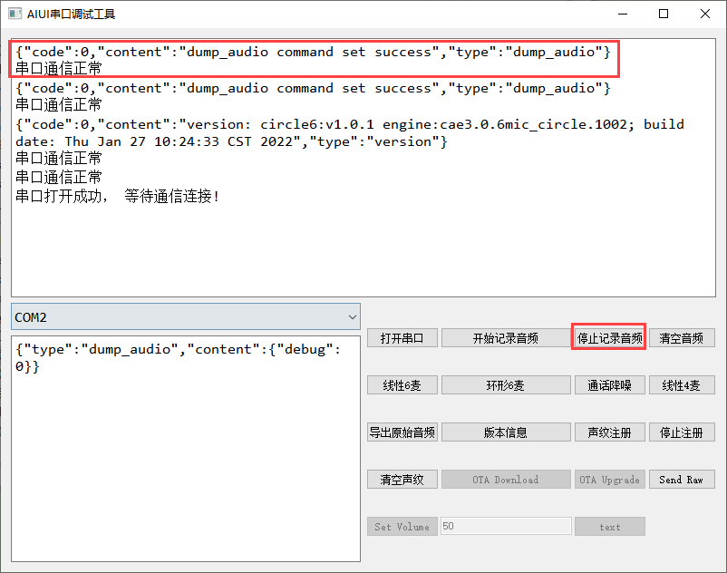

4）Click “**Export Raw Audio**”, then “**Select Folder**” to output the audio file. (Even after disconnecting and reconnecting, the audio will not be lost.)

Without clearing the audio, you can directly "Export Raw Audio" to output previously recorded audio.

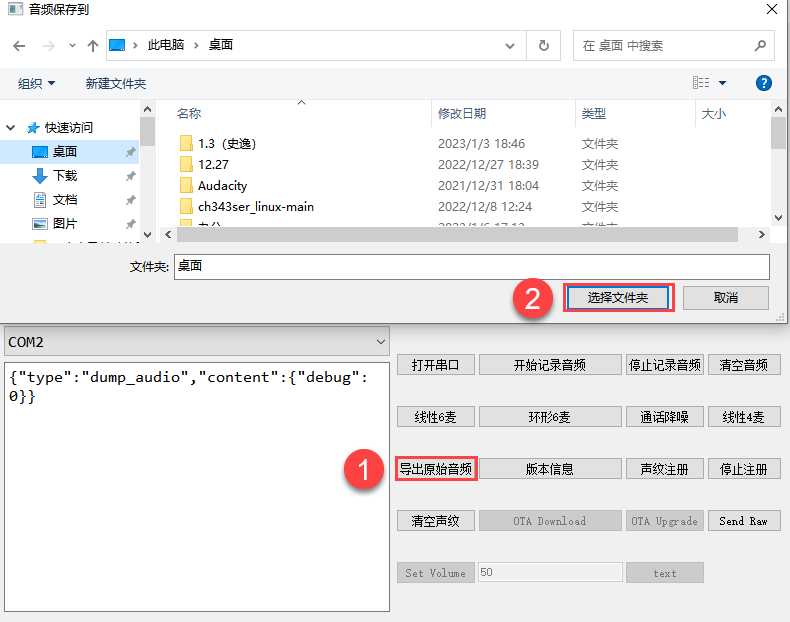

#### 15.1.9.3 Play Original Video

**1.** **Extract the "**Audacity Installation Package**" compressed file within the "**Audio Player Tool**" folder.**

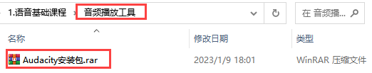

**2.** **Open the "**Audacity**" tool in the extracted folder.**

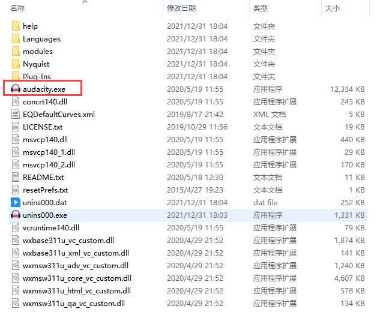

**3.** **Click on "**File**", then select "**Import -\> Raw Data**"**

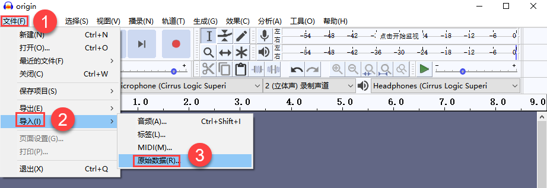

**4.** **Select the output “**.pcm**” audio file, and then open it.**

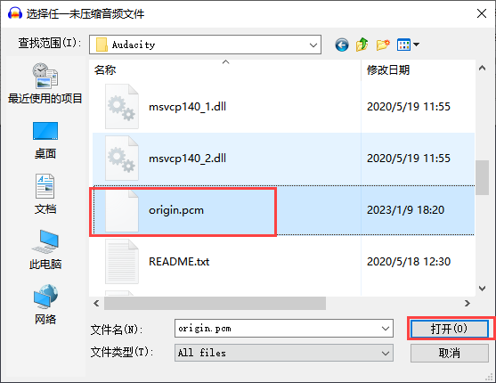

**5. Select the raw data parameters.**

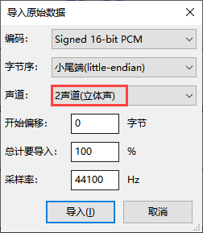

**6.** **After importing the audio, you can click “**Play**” to test it.**

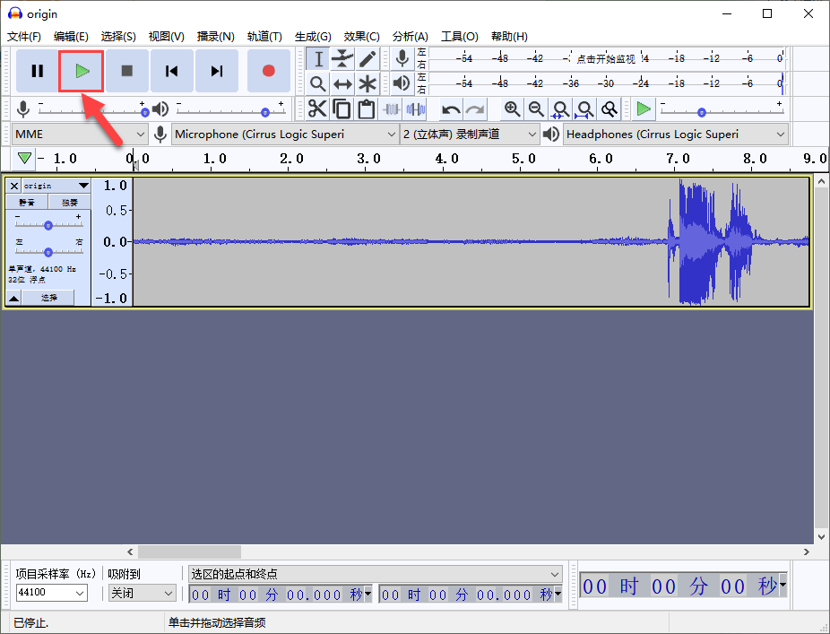

## 15.2 Microhpne Control Course

### 15.2.1 Lesson 1 Configuration for Speech Control (Link library configuration and appid setting)

If it is the first time that you perform the voice functions of JetHexa, it is imperative to configure the dynamic link library for wake-up microphone recognition and set the microphone’s appid. The specific operation steps are as follows.

**1. Configure Dynamic Link Library**

窗体底端

Note: for the first start-up of this function, it is necessary to modify some configuration files. Subsequently, no modifications are required, and you can skip this step and start the function directly.

(1) Start JetHexa and connect to NoMachine.

(2) Double clickto open the command-line terminal.

(3) Enter the command “**cd jethexa/src/xf_mic_asr_offline”** to access the directory of the configuration files.

(4) Enter the command “**sudo cp xf_mic.rules /etc/udev/rules.d**” to copy the configuration file to the corresponding path.

(5) Enter the command “**sudo service udev restart**” to restart the udev service.

(6) Enter the command “**cd lib/arm64/**” to access the corresponding dynamic link library directory.

(7) Enter the command “**sudo cp lib\* /usr/lib**” to copy the file to the corresponding path.

(8) Open a new terminal window, and enter the command “**cd jethexa/src/xf_mic_asr_offline**” to access the configuration file directory.

(9) Enter the command “**vim CMakeLists.txt**” to open the corresponding file.

(10) Press “i” to enter the inserting mode, and then change the code highlighted in red box to “**lib/arm64**”.

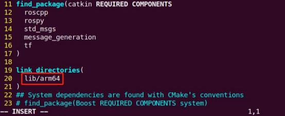

(11) After making modifications, press “Esc” and enter “**:wq**” to save and exit the file.

**(2) Apply for Offline Voice Resources and APPID**

As the robot utilizes offline voice recognition, you will require offline voice resources available exclusively on the iFLYTEC Chinese website. Please note that you need to switch the language to Chinese and follow the provided instructions for the process.

**Note: Be sure to register and apply on the Chinese website.**

(1) Enter iFLYTEC website, **https://www.xfyun.cn/,** then click “**sign in**” to create an account.

(2) Choose “**Sign up with phone number**”, and fill in the required information. (select corresponding country code)

(3) After registration, click ‘**console-\>my application**’ to add new application.

(4) Fill in the required information, and click “Submit”.

(5) Open the application you just added.

(6) Then select **Speech Recognition → Offline Command Recognition** (New Version)

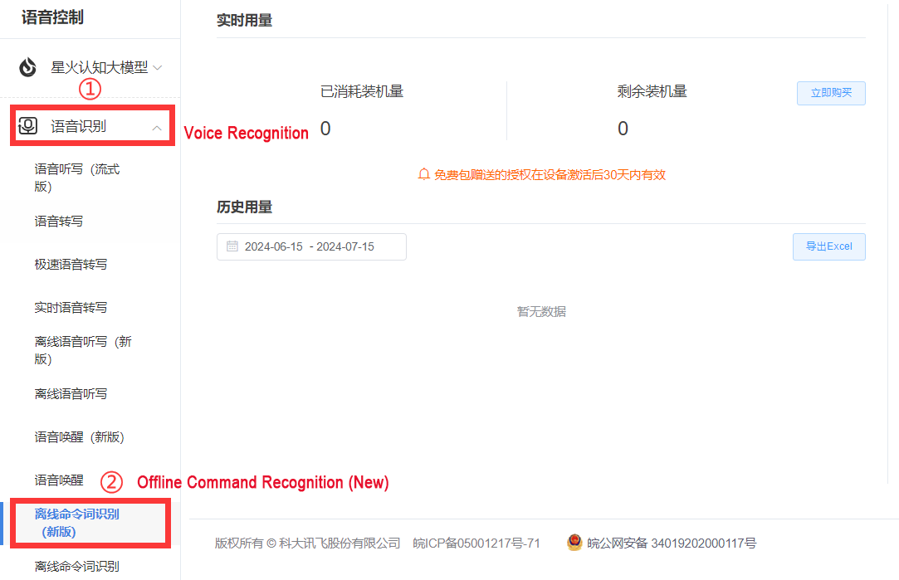

(7) Download Linux AIKit.

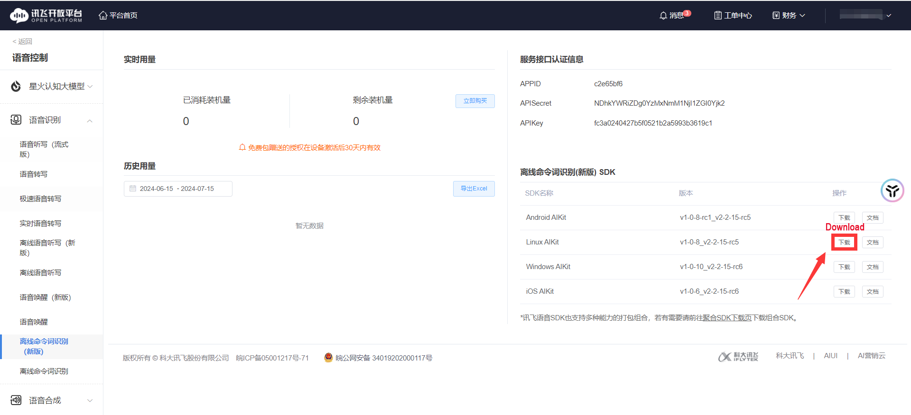

(8) Choose ‘OK’ to start downloading.

**Note: Each new application can only be used for free for ninety days. Subsequent use requires payment. When our application expires, we can apply for a new one up to five times per person. The method for applying for a new application is the same as mentioned above.**

(9) Next, select your created username and Linux platform. After selecting, choose the '**Standard Version**' below, check '**Offline Command Recognition**' and '**Voice Wake-up**' functions, then click '**SDK Download**'.

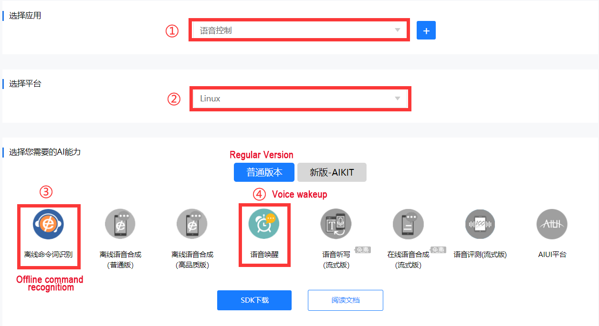

(10) Tick ‘I agree’ and choose ‘OK’ to confirm the download.

(11) Extract the downloaded file and locate the offline voice resource “**common.jet**”

(12) Use Nomachine to copy the “**common.jet**” file to the robot.

### 15.2.2 Lesson 2 Voice Control JetHexa

By speaking the wake-up command to the microphone, JetHexa will perform the corresponding action after recognition.

**1. Project Principle**

Initially, subscribe to the voice recognition service published by microphone node to perform operations such as voice recognition, noise reduction, and recognition.

Then, obtain the recognized commands and the angle of the sound source,

Subsequently, when the keyword is recognized, the robot will respond with the corresponding action.

**2. Start Game**

**(1) Initial Configuration**

For the first start-up of this function, it is necessary to configure resource environment. There is no need to configure for the subsequent operations.

(2) Start Game

Note: the input command should be case sensitive, and the “Tab” key can be used to complement the key words.

① Start JetHexa and connect to NoMachine.

② Double clickto open the command-line terminal.

③ Ensure that the auto-start service has been enabled (it has been activated by default after booting up). If not, please enter the command “**sudo systemctl start jethexa_bringup.service**” to enable the service.

④ Enter the command “**roslaunch xf_mic_asr_offline mic_in it.launch**” and press Enter to start the microphone node.

Note: if fail to do so, you can re-plug the USB port of microphone array module. Then try to start again.

⑤ Open a new terminal window, and then enter command “ rosrun xf_mic_asr_offline get_result.py” to start the voice control function.

⑥ If you want to close the program, press “**Ctrl+C**”. Failing to do so may require multiple tries.

**3. Outcome**

After starting the game and speaking the wake-up command “Hello Hiwonder”, the robot will print the angle of the sound source and turn towards the corresponding direction.

**4. Program Analysis**

The source code of the program is stored in:

**/home/hiwonder/jethexa/src/xf_mic_asr_offline/scripts/get_result.py**

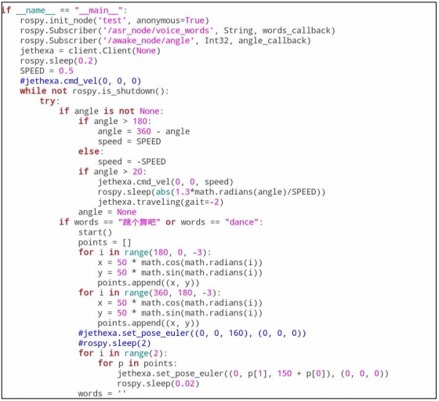

- **Subscribe to the Service**

  Subscribe to the service to obtain speech recognition words and wake-up angles.

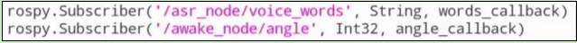

- **Print Information**

窗体底端

Print the recognized voice command and the wake-up angle.

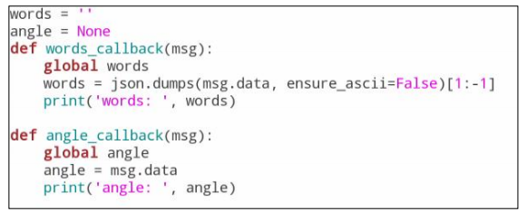

- **Robot initialization Angle**

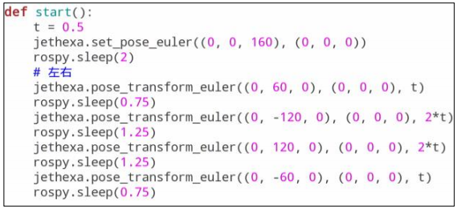

  When the robot is powered on, it needs to be given initial joint angles to establish a starting posture. This can be achieved by controlling the angles of each joint using the **pose_transform_euler function**. Specifically, the angles for each joint are as follows: (0,60,0), (0,120,0), (0,120,0), and (0,-60,0).

- **Voice Recognition**

  Match the recognized statement. If a match is successful with "dance" as the current statement received by the microphone, proceed with the subsequent actions.

窗体底端

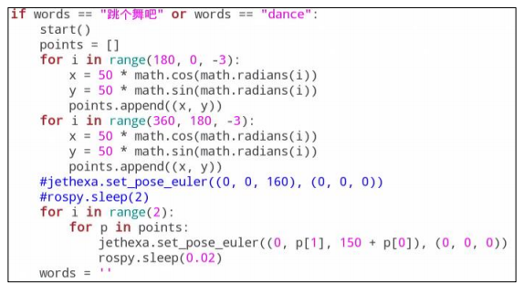

The parameters in the code "jethexa.set_pose_euler((0, p\[1\], 150 + p\[0\]), (0, 0, 0))" have the following meanings:

The first parameter "**(0, p\[1\], 150 + p\[0\])**" represents the coordinate of the pose transformation, corresponding to the order XYZ.

The second parameter "**(0, 0, 0)**" represents the angles of Euler rotation.

**5. Function Extension**

The default wake-up word in program is “Hello, Hiwonder”. You can change the wake-up word by modifying the configuration file. The specific operation steps are as follow:

(1) Start JetHexa and connect to NoMachine.

(2) Double clickto open the command-line terminal.

(3) Enter the command “**sudo systemctl start jethexa_bringup.service**” to start the robot node control and various message services.

(4) Enter the command “**vim ~/jethexa/src/xf_mic_asr_offline/launch/mic_in it.launch**” to access the configuration file directory.

Press “i” to enter the inserting mode. Change the values of “**awake_words**” to

**6.FAQ**

Q: The microphone cannot be awakened after the robot is powered on.

A: Firstly, check if there is any loose connection between the microphone and the USB port on the Jetson Nano board of the robot. If there is any looseness, reconnect the cable securely.

If there is no looseness found, log in to the robot's remote desktop and check if there is a microphone firmware recognition indicator in the taskbar of the desktop.

After selecting with the mouse, the current microphone firmware version is displayed in the taskbar, as shown in the following image.

If the above steps are checked and the status is normal, it is necessary to inspect the connection between the Jetson Nano and the microphone. Create a new terminal, then input the following command: "**ls /dev**".

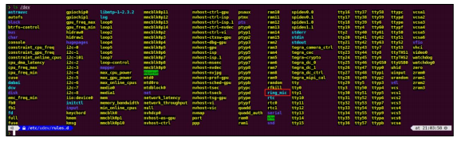

After entering the command, check in the terminal whether "**ring_mic**" appears. If it does, it indicates that the current connection is normal.

If all the above checks show no issues, it is necessary to replace the new two-in-one adapter board. Remove the two-in-one adapter board from the microphone, and then reinstall it according to the corresponding course document. Specific replacement steps can be found in "**Microphone Basic Course / Lesson 2 Wiring and Serial Port Debugging**".
