# 1. Basic Lesson

## 1.1 Getting Ready

### 1.1.1 Lesson 1 Introduction to JetHexa

#### 1.1.1.1 Product Description

JetHexa is an open source hexapod robot based on Robot Operating System (ROS). It is armed with high-performance hardware, such as NVIDIA Jetson Nano, intelligent serial bus servos, Lidar and HD camera/ 3D depth camera, which can implement robot motion control, mapping and navigation, tracking and obstacle avoidance, custom prowling, human feature recognition, somatosensory interaction and other functions. Adopted novel inverse kinematics algorithm, supporting tripod and ripple gaits and with highly configurable body posture, height and speed, JetHexa will bring user ultimate using experience.

JetHexa not only serves as an advanced platform for user to learn and verify hexapod movement, but also provides solutions for ROS development. To help user embark on a new journey of ROS hexapod robotic world, ample ROS and robot learning materials and tutorials are provided.

#### 1.1.1.2 Package List

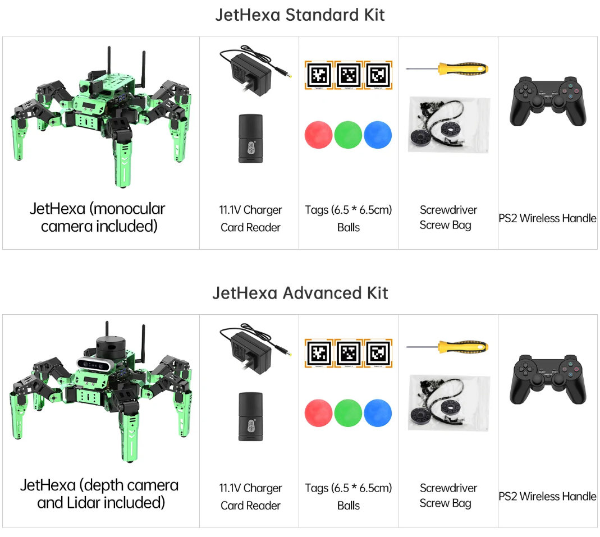

#### 1.1.1.3 Material Directory

| **1. Basic Lesson** |  |  |
| --- | --- | --- |
| **1. Getting Ready** |  | Lesson 1 Introduction to JetHexa Lesson 2 Prepare for Starting JetHexa Lesson 3 Start JetHexa |
| **2. Quick User Experience** |  | Lesson 1 APP Control Lesson 2 Color Threshold Setting Lesson 3 Wireless Handle Control |
| **2. Linux Basic Lesson** |  |  |
| Lesson 1 Linux Introduction Lesson 2 Environment Configuration in Windows Lesson 3 Linux Installation and Source Replacement Lesson 4 Basic Operation of Linux Lesson 5 Linux Directory Introduction Lesson 6 Common Linux Command Lesson 7 Linux Permission |  |  |
| **3. Python Lesson** |  |  |
| Lesson 1 Python Introduction and Installation Lesson 2 First Program-“Hello World” Lesson 3 Python Basic Syntax Lesson 4 Python Condition Statement Lesson 5 Python Loop Statement Lesson 6 Python Function and Module Lesson 7 Python Container Type and Related Operation Lesson 8 Python Class and File Operation |  |  |
| Lesson 9 Python Exception Handling Lesson 10 Python Built-in Function Lesson 11 Python Multithreading Lesson 12 Usage of Python PiP Lesson 13 Python Numpy Basic Operation |  |  |
| **4. OpenCV Computer Vision Lesson** |  |  |
| Lesson 1 Computer Vision and OpenCV Introduction Lesson 2 Build OpenCV Environment Lesson 3 OpenCV Modules and Structure Lesson 4 Picture & Video Loading and Display Lesson 5 Picture Drawing Lesson 6 Image Basic Operation Lesson 7 Image Processing---Color Space Conversion Lesson 8 Image Processing---Geometric Transformation Lesson 9 Image Processing---Smoothing Lesson 10 Image Processing---Edge Detection Lesson 11 Image Processing---Morphological Processing Lesson 12 Image Processing---Threshold Processing Lesson 13 Image Processing---Contour Introduction and Feature Lesson 14 Image Processing---Feature Matching Lesson 15 Image Processing---Corner Detection |  |  |
| **5. ROS Basic Lesson** |  |  |
| Lesson 1 ROS Introduction Lesson 2 Ros Documents and Terms Instruction Lesson 3 Create Workspace and Package Lesson 4 Write A Simple Publisher |  |  |
| Lesson 5 Write A Simple Subscriber Lesson 6 The Definition and Use Of Topics Message Lesson 7 Write A Simple Client Lesson 8 Write A Simple Server Lesson 9 The Definition and Use of Service Data Lesson 10 Parameters Usage and Programming Method Lesson 11 The Use of Launch File Lesson 12 The Programming Realization of TF Coordinates Broadcasting and Listening Lesson 13 Common Visualization Tools |  |  |
| **6. Jetson Nano and Jetson Nano Expansion Board Lesson** |  |  |
| **1. Jetson Nano Basic Lesson** |  | Lesson 1 Jetson Nano Introduction Lesson 2 Write Image Lesson 3 Remote Desktop Connection Lesson 4 Basic Operation of Jetson Nano Lesson 5 Change Software Download Source Lesson 6 Modify Wi-Fi Lesson 7 Jetson Nano Network Connection Lesson 8 Common Linux Command Lesson 9 Jetson Nano File Transmission Lesson 10 System Backup and Recover |
| **2. Jetson Nano Expansion Board** |  | Lesson 1 Jetson Nano Expansion Board Lesson 3 Application Notice Lesson 4 Control Serial Bus Servo Rotation Lesson 5 Adjust Serial Bus Servo Speed Lesson 6 Read Serial Bus Servo Status Lesson 7 Control Single PWM Servo |
| **2. Jetson Nano Expansion Board** |  | Lesson 8 Control PWM Servo Speed Lesson 9 Control 2 PWM Servos Lesson 10 Control Buzzer Lesson 11 Read Acceleration Sensor Lesson 12 Control Serial Port |
| **7. Standard Motion Control Lesson** |  |  |
| **1. Basic Control Lesson** |  | Lesson 1 Build Development Environment Lesson 2 Tripod Gait Analysis Lesson 3 Ripple Gait Analysis Lesson 4 Move Straight and Make Turns Lesson 5 Move Left or Right Lesson 6 Move in Specific Angle Lesson 7 Basic Communication of ROS Robot Lesson 8 PC Software Control |
| **2. Advanced Control Lesson** |  | Lesson 1 Speed Adjustment Lesson 2 Polyline Movement Lesson 3 Rectangular Movement |
| **3. Inverse Kinematics Control Lesson** |  | Lesson 1 Build Coordinate System Lesson 2 Inverse Kinematics Analysis Lesson 3 Posture Parameter Lesson 4 Walking Height Adjustment Lesson 5 Posture Adjustment Lesson 6 Body Twisting Lesson 7 Robot Dancing Lesson 8 Body Self-balancing |
| **4. URDF Model and Simulation Lesson** |  | Lesson 1 URDF Model Introduction Lesson 2 Hexapod URDF Model Introduction Lesson 3 gazebo Introduction Lesson 4 ROS Hexapod Robot Gazebo Simulation |
| **5. PC Software Action Editing Lesson** |  | Lesson 1 PC Software Introduction Lesson 2 Action Editing Lesson 3 Export and Import Action Lesson 4 APP Custom Control |
| **8. Monocular and Depth Camera Lesson** |  |  |
| **1. Monocular Camera** |  | Lesson 1 Basic Usage of Monocular Camera Lesson 2 Camera Calibration |
| **2. Depth Camera** |  | Lesson 1 Depth Camera Configuration Lesson 2 Depth Camera Installation Lesson 3 Usage of Depth Camera Lesson 4 Camera Calibration Lesson 5 Data Type and Point Cloud |
| **9. ROS+OpenCV Vision Standard Lesson** |  |  |
| **1.ROS+OpenCV Vision Recognition Lesson** |  | Lesson 1 Color Threshold Adjustment Lesson 2 Color Recognition Lesson 3 AprilTag Recognition Lesson 4 AR Vision |
| **2.ROS+OpenCV Vision Tracking Lesson** |  | Lesson 1 Colored Block Locating Lesson 2 Color Tracking Lesson 3 AprilTag Locating Lesson 4 AprilTag Tracking |
| **10. ROS+Deep Learning Lesson** |  |  |
| Lesson 1 Machine Learning Lesson 2 Machine Learning Library Lesson 3 Image Card Training Lesson 4 Waste Sorting Lesson 5 Mask Identification |  |  |
| **11. AI Creative Lesson** |  |  |
| **1. Monocular Camera AI Vision Games** | Lesson 1 Face Detection and Tracking Lesson 2 Gesture Recognition Lesson 3 Emotion Recognition Lesson 4 Line Following |  |
| **2. Depth Camera AI Vision Games** | Lesson 1 KCF Target Recognition Lesson 2 Gesture Control Lesson 3 Fingertip Trajectory Recognition Lesson 4 Human Posture Control |  |
| **12. Lidar Lesson** |  |  |
| Lesson 1 Introduction to Lidar Lesson 2 Lidar Basic Knowledge Lesson 3 Lidar Following Lesson 4 Lidar Guarding Lesson 5 Lidar Obstacle Avoidance Lesson 6 Gmapping Mapping Algorithm Lesson 7 Hector Mapping Algorithm Lesson 8 Karto Mapping Algorithm Lesson 9 Cartographer Mapping Algorithm |  |  |
| **13. Expanded Lesson** |  |  |
| Lesson 1 OLED Display Lesson 2 Voltage Display Lesson 3 Posture Detection Lesson 4 Emotion Recognition and Display Lesson 5 Tag Recognition and Display Lesson 6 Gesture Recognition and Display |  |  |

### 1.1.2 Lesson 2 Prepare for Starting JetHexa

#### 1.1.2.1 Charging and Application Notice

JetHexa is powered by 11.V Lipo battery. For delivery safety, the battery will not be fully charged, so please use the charger included in the package to charge the battery when you receive the product.

It takes 1 hour to fully charge the battery. Pay attention please charge the robot in time when the voltage is below 9.6V for better robot performance.

1. Push the switch of the exapnsion board to “**OFF**” side.

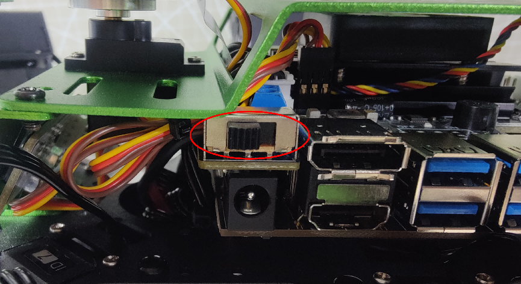

2. Remove these two screws on the bottom with screwdriver.

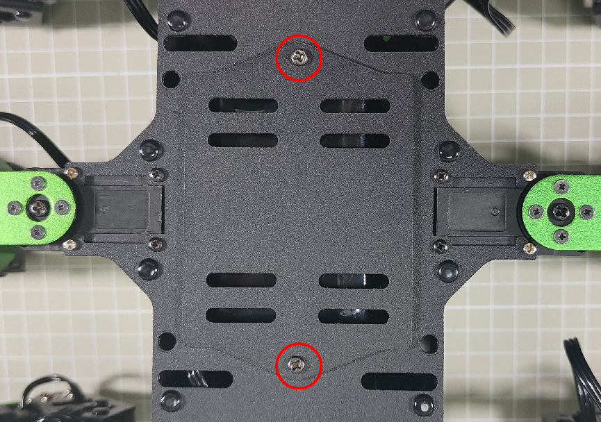

3. Take out the battery, and connect the wire as pictured. (Red to red and black to black)

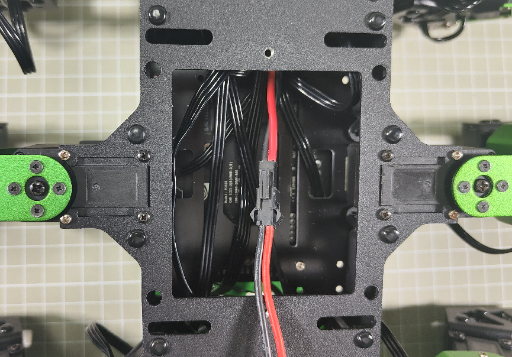

4. Having connected the wire, put the battery back to its original place, and install the cover and fix it.

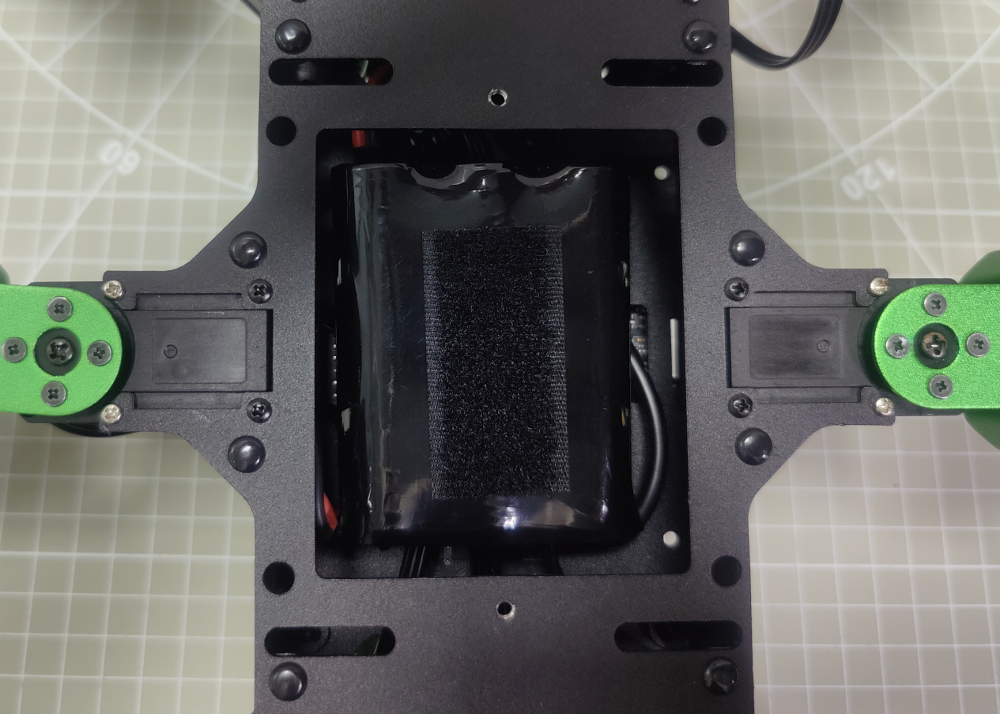

5. Insert the charger to the DC port on Jetson Nano expansion board to charge the robot.

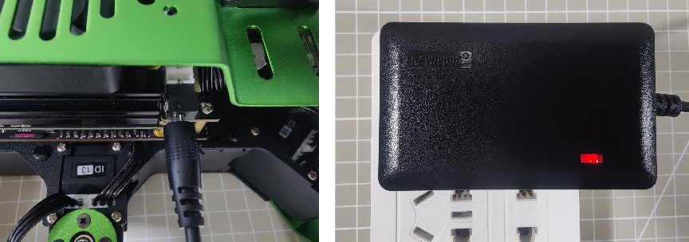

When the red light is on, the robot is being charged, and it is fully charged when green light turns on.

#### 1.1.2.2 **Using Instruction of Lipo Battery**

1. Before charging and using the robot, please connect the battery wire. And red wire should connect to red wire, and black to black.

2. Please use the charger comes with JetHexa to charge.

3. When the battery charger is connected to the battery without being plugged into an AC power outlet, the charger LED indicator will turn green.

4. When the charger is connected to battery and AC power outlet, the indicator will turn red representing that the battery is being charged. When the red indicator light turns green, the battery is fully charged. After charging, remove the charging cable timely to prevent battery from damage caused by overcharging.

5. If the battery butted line is not connected to the controller, please do not directly connect to the battery to prevent short circuit caused by the contact of the positive and negative electrode.

6. If the robot is not used for a long time, please fully charge the robot and then disconnect the line connecting the robot and the battery. Do not fiercely pull the line to avoid the damage to the interface.

7. Keep the battery far away from high temperature and all kinds of liquids to prevent overheating, fire or damp, which results in function decline and short service life.

### 1.1.3 Lesson 3 Start JetHexa

**Notice:**

**1. To ensure robot’s normal working, please fully charge the robot when its voltage is below 9.6V first, then continue your operation.**

**2. Please do not put the robot on uneven surface when starting the robot**

**3. When the robot is working, please keep your face and eyes from the robot to avoid injury.**

**4. Please do not put your finger within the motion range of the robot’s joints when robot is moving, otherwise the joints will be damaged.**

**5. Please watch out for dropping the robot from a height level.**

**6. Continuous long--time working may heat up the servo. And the servo needs to take a break and cannot back to work until it cools down.**

**7. Please get the servo change after long-time use or excessive use.**

#### 1.1.3.1 Start JetHexa

Before booting up, please place JetHexa as pictured to avoid the damage caused by sudden force from servos. And do not fold the legs.

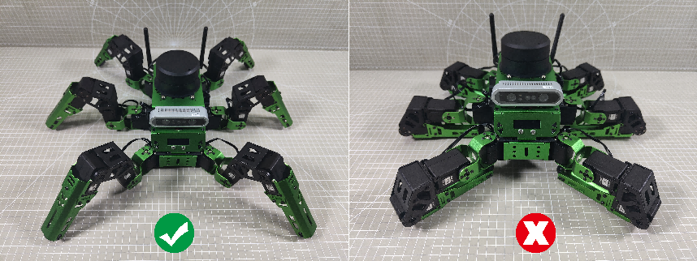

Push the switch of expansion board to “**ON**” side.

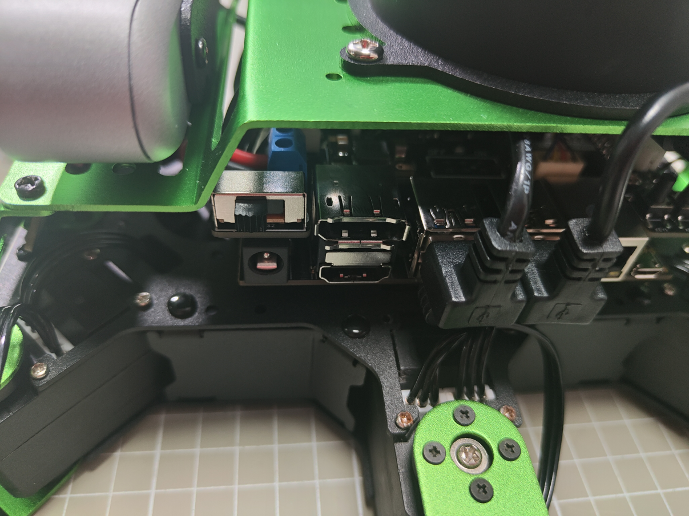

Then LED1 on expansion board will flash in blue. After a while, buzzer will beep and JetHexa will return to initial posture, which means that Ros completes configuration.

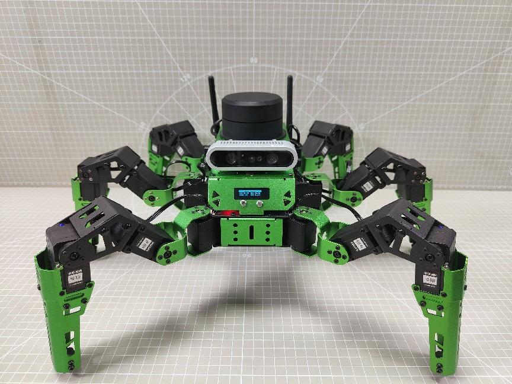

After successful start, the following data will be displayed on the dot matrix display module.

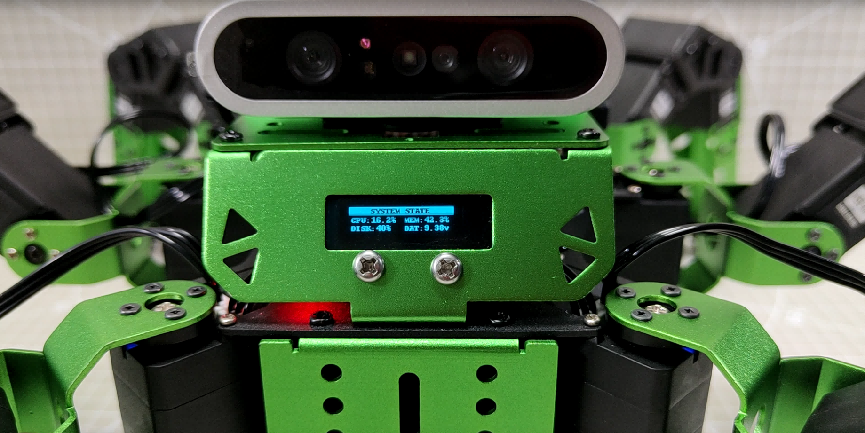

| **Name** |    **Meaning**     |
| --- | --- |
|   CPU    |  CPU utilization   |
|   MEM    | memory utilization |
|   DISK   |  disk utilization  |
|   BAT    |   Battery level    |

The default network connection mode is AP direct connection mode. After successful start, JetHexa will generate a WiFi starting with “**HW**”. And the WiFi password is “**hiwonder**”. (For how to connect to Ubuntu desktop, please refer to the material in “**7. Standard Motion Control Lesson-\>1. Basic Control Lesson-\>Lesson 1 Build Development Environment-\>1. Remote Tool Installation and Connection**”)

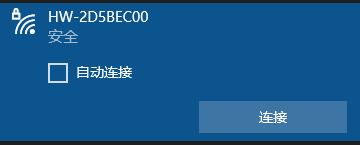

## 1.2 Quick User Experience

### 1.2.1 Lesson 1 APP Control

#### 1.2.1.1 APP Installation and Connection

In this lesson, you will learn how to download and install the "WonderAi" app, which allows you to control JetHexa. Once installed, you can use the app to remotely control JetHexa's various functions and features.

**1. APP Installation**

**Note:**

* **Please ensure all permissions are granted for the APP, otherwise certain app functions may be affected or unavailable.**

* **Turn on location and Wi-Fi before using the APP**.

**Method 1:**

(1) **Android user:** the installation package can be found in **Appendix** and please transfer it to your phone for downloading.

(2) **iOS user:** you can download “**WonderAi**” in App Store.

**Method 2:**

Scan the below QR code to download the APP.

**2. Boot up JetHexa**

According to the file in “**1. Basic Lesson-\>1. Getting Ready-\>Lesson 3 Start JetHexa**”, start JetHexa first. After successful start, it will generate a WiFi starting with “**HW**”.

**3. APP Connection**

**(1) Preparation**

① Install “**WonderAi**” APP

② Start JetHexa following the instructions in “**1. Basic Lesson-\>1. Getting Ready-\>Lesson 3 Start JetHexa**”.

**(2) Connection Mode Introduction**

There are two network modes, including AP direct connection mode and STA LAN mode.

① AP direct connection mode: Jetson Nano generates a WiFi which can be connected by phones. This WiFi has no internet access.

② STA LAN mode: Jetson Nano actively connects to specific WiFi. You can access Internet in this mode.

The default connection mode is AP direct connection mode. Whether you choose AP direct connection mode or STA LAN mode, robot performs the same. However, it is recommended to experience robot games under Direct Connection Mode.

**(3) Direct Connection (Must Read)**

Take the Android APP for example. The instructions are also applicable to iOS device.

① Open “**WonderAi**” APP, then tap “**Advanced -\> JetHexa**” in sequence.

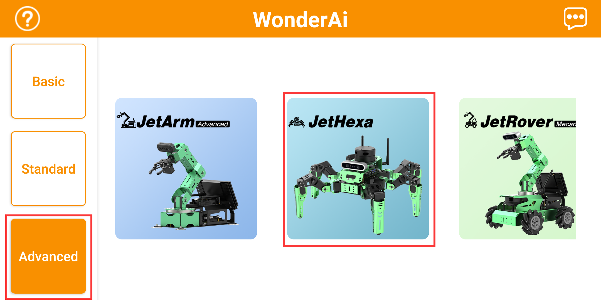

② Select the corresponding version of JetHexa. Choose “**JetHexa Standard**”.

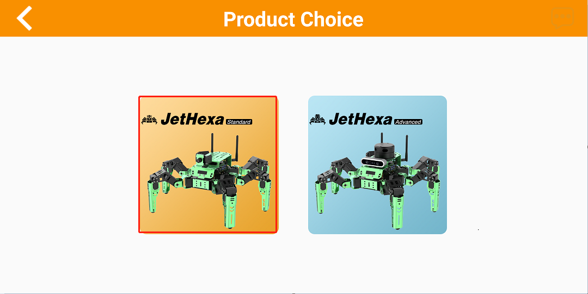

③ Click “**+**” button at the lower right corner, and then select “**Direct Connection Mode**”.

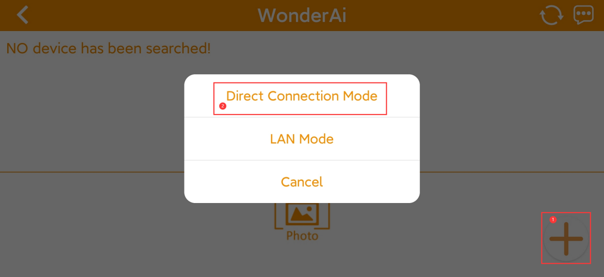

**Note: if you choose “LAN mode”, you can connect the network referring to the file in “6. Jetson Nano and Jetson Nano Expansion Board-\>1. Jetson Nano Basic Lesson-\>Lesson 7 Jetson Nano Network Connection”.**

④ Next, click “**Go to connect device hotspots**” to join the WiFi generated by JetHexa.

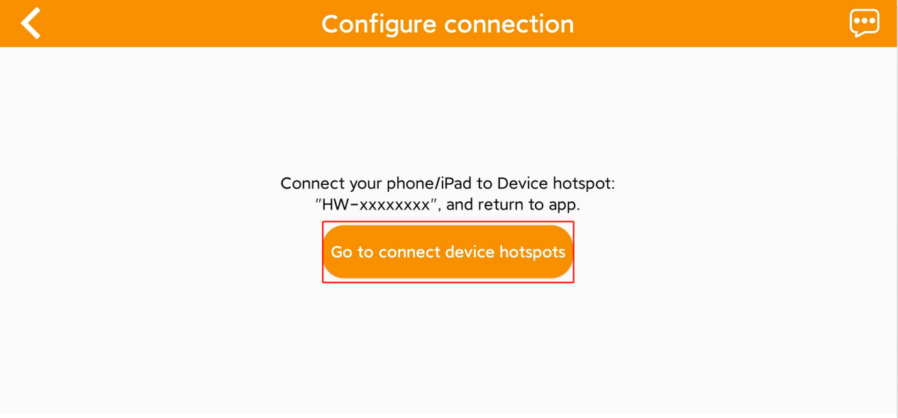

⑤ The device WiFi starts with “**HW**” and the password is “**hiwonder**”.

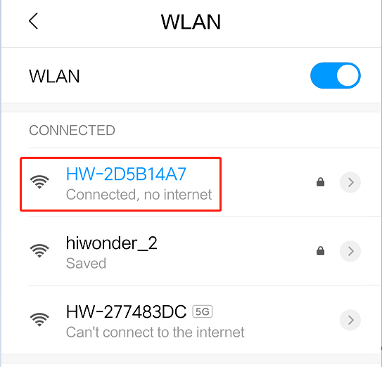

**Note: for iOS user, please do not back to the APP until the WiFi icon**  **appears above, otherwise JetHexa cannot be searched. If JetHexa cannot be searched, please click**  **to refresh.**

⑥ Return to the APP, and click the robotic icon to enter control interface.

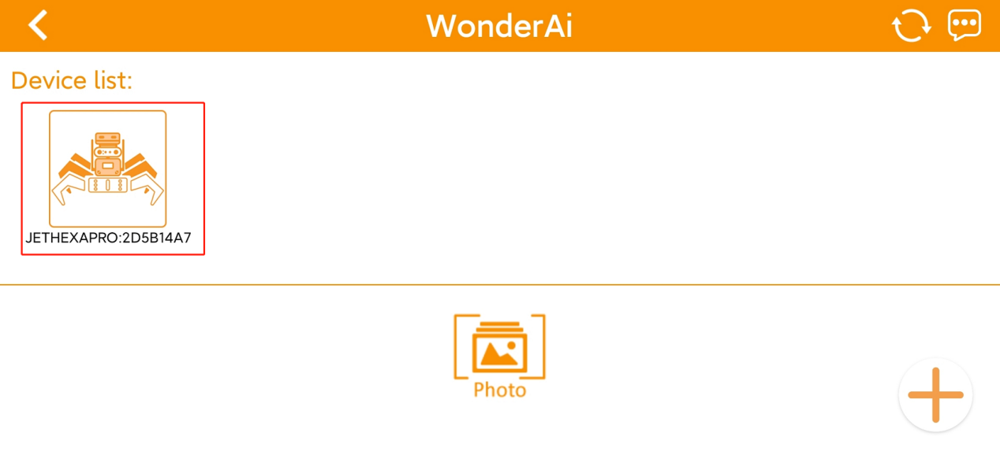

**If you are informed of “No Internet Connection. Whether to keep connection”, just select “Keep Connection”.**

⑦ When the following window pops up, just click “**cancel**” and back to “**Product Choice**” interface to select the correct version.

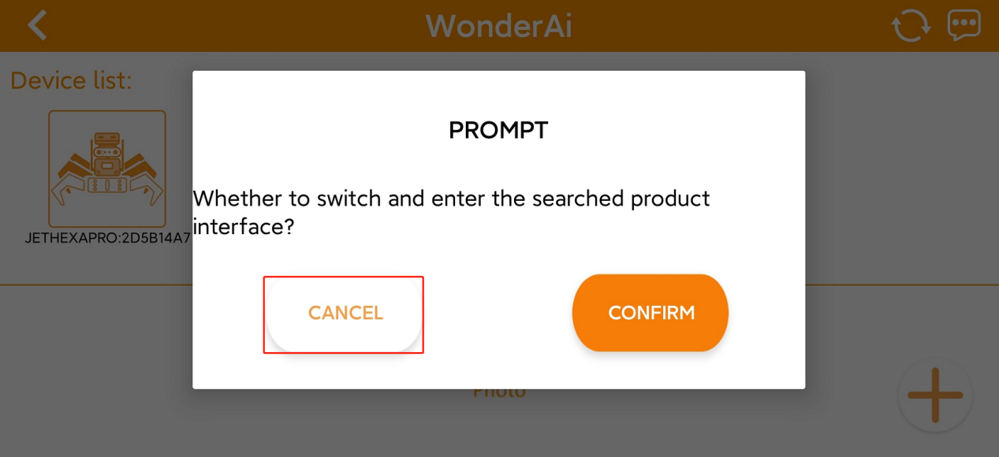

⑧ The home interface of JetHexa is as the picture shows.

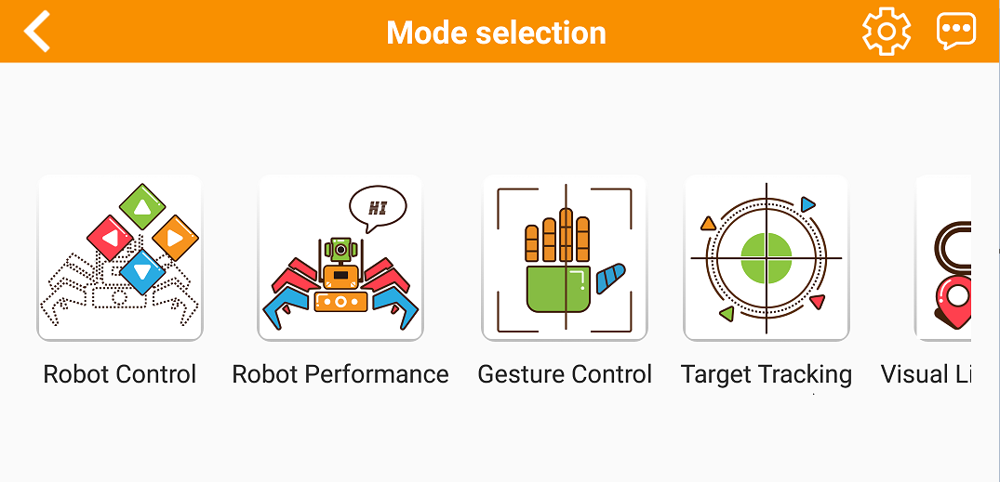

To learn about the instructions on each game, please refer to the file stored in “**1. Basic Lesson-\>2. Quick User Experience-\>Lesson 1 APP Control-\>2. APP Control**”.

**(4) LAN Mode (Optional)**

① Firstly, join 5G network, for example “Hiwomder_5G”. (The router supporting dual-frequency will distinguish the Wi-Fi name by default under the situation that 2.4 G and 5G are separated. For example, Wi-Fi “Hiwonder” is 2.4 frequency band while “Hiwonder_5G” is 5G frequency band)

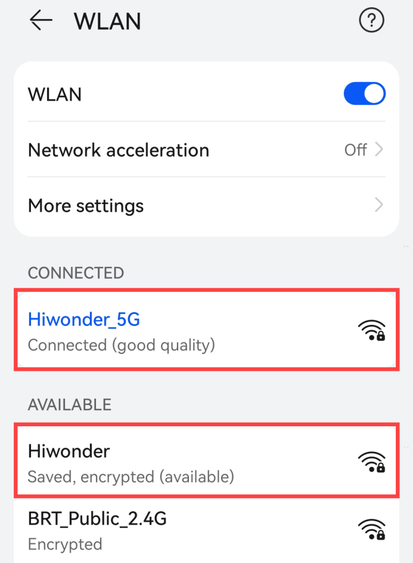

② After connection, open WonderAi. Then click “Advanced-\>JeHexa” in sequence. (Take JetHexa standard kit for example)

③ Click “**+**” button at the lower right corner, then select **LAN Mode**.

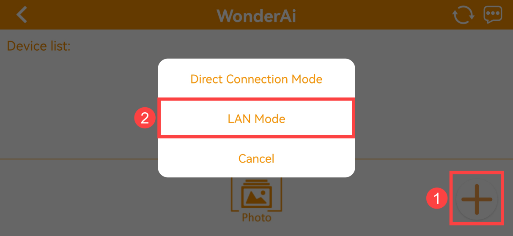

④ Continue, enter the Wi-Fi password. Having entered the password, click “OK”. Please ensure the password you enter is correct.

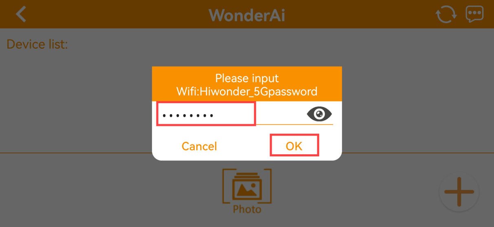

⑤ Click “Go to connect device hotspots”.

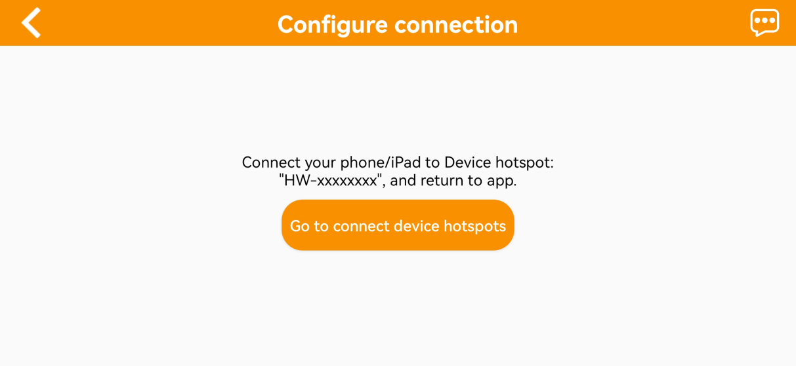

⑥ Join the WiFi starting with HW, and input the password “**hiwonder**”. After connection, return back to the APP interface.

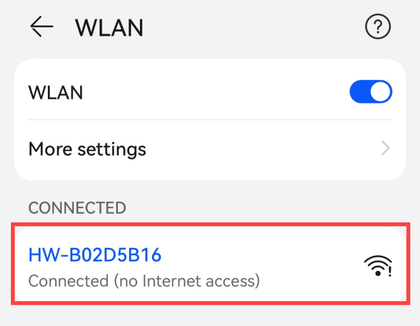

⑦ Then, WonderAi APP is connecting to the robot.

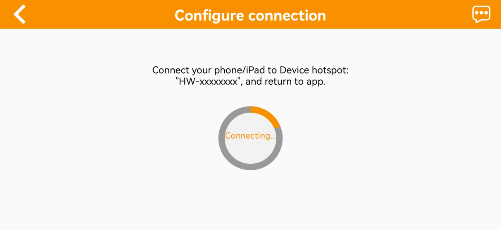

⑧ After a while, the robotic icon will show up. And at the same time, LED1 on the expansion board will light up.

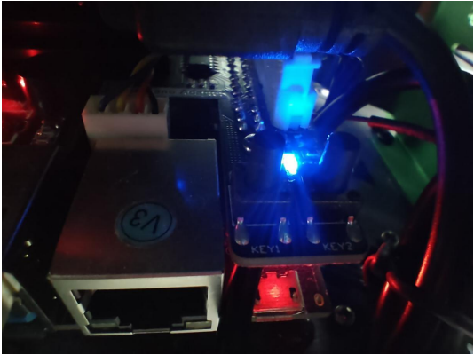

⑨ By long pressing the robotic icon, you can check the IP address and ID.

⑩ Input this IP address in the search bar on remote desktop software. Then you can enter the robot system desktop. For how to operate, please refer to the file in “**7. Standard Motion Control Lesson\1. Basic Control Lesson\\ Lesson 1 Build Development Environment**”.

⑪ If you want switch back to Direct Connect Mode, press KEY1 button on Jetson Nano expansion board until blue LED flashes, which means the current mode is Direct Connect Mode.

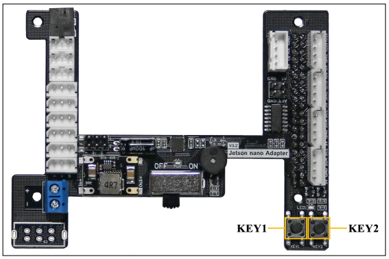

#### 1.2.1.2 APP Control

**1. Standard Kit**

Please install the APP first according to “**1. Basic Lesson/ 2. Quick User Experience/ Lesson 1 APP Control/ 1. APP Installation and Connection**”.

Take the operation on Android device for example, and the instructions are also applicable to iOS device.

* Start JetHexa, and connect it to “**WonderAi**” APP.

* For JetHexa standard kit, there are 5 games, including robot control, robot performance, gesture control, target tracking and visual line following.

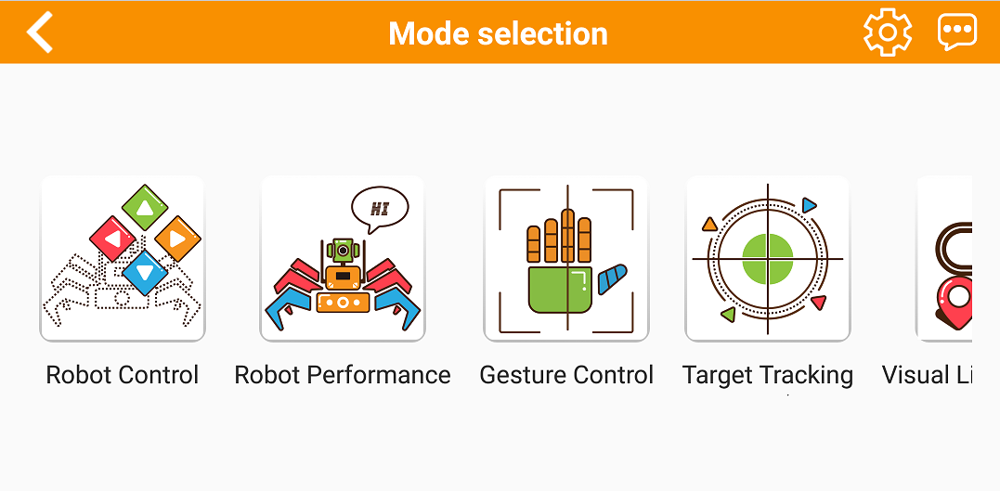

(1) Robot Control

① Interface Design

Click “**Robot Control**” in mode selection interface to enter the control interface.

② Icon Function

| **Icon** | **Function** |
| --- | --- |
|  | Used to control JetHexa to turn left and right, and “attention” key is used to control JetHexa to return back to initial posture. |
|  | Drag the central button to control JetHexa to go forward, backward, left and right. |
|  | Two options for gait |
|  | Adjust JetHexa’s stride ranging from 10mm to 60mm |
| 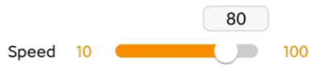 | Adjust JetHexa’s speed ranging from 10 to 100 |
| 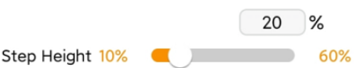 | Adjust the step height ranging from 10 to 60 |
|  | “**Z+**” button is used to control JetHexa to twist left, and “**Z-**” button is for controlling robot to twist right. |
| 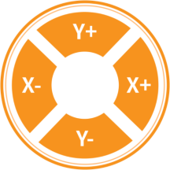 | “**Y+**” button is used to control JetHexa’s front half body to lean downward and hind half body to lean upward. “**Y-**” button is used to control JetHexa’s front half body to lean upward and hind half body to lean downward. “**X-**” button is used to control the robot to tilt to left. “**X+**” button is used to control the robot to tilt to right. |
| 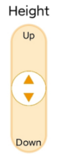 | Adjust JetHexa’s body height. |
| 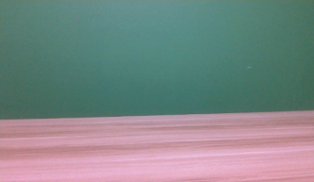 | Display the camera view |
|  | Capture the current camera view and the photo is saved in the photo album. |
|  | Close the navigation bar |

(2) Robot Performance

① Interface Design

* At left are the options for action groups, including built-in action group and custom action.

* At right is the self-balancing control button.

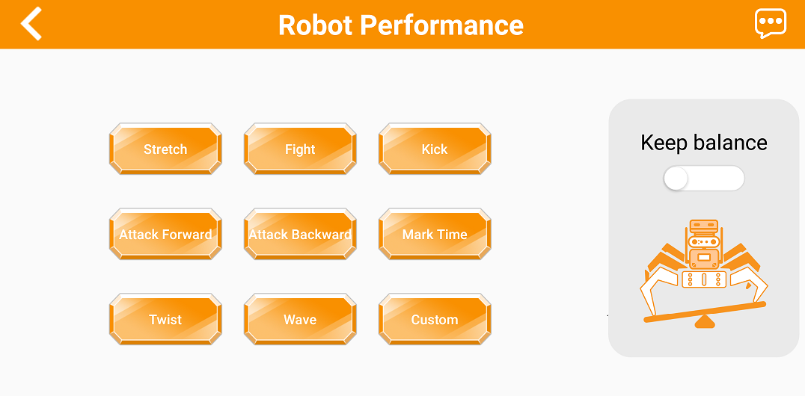

② Icon Function

| **Icon** | **Function** |
| --- | --- |
|     | Select the action to let JetHexa to perform. |
|  | Customize the action except the actions listed on interface. |
| 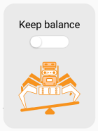 | Enable or stop JetHexa’s self-balancing function. When self-balancing function is enabled, JetHexa will adjust its posture to balance its body according to the tilt angle |
|  | Message box |

**Note: if you need to add custom actions, you can refer to the material in “7. Standard Motion Control Lesson-\>5. PC Software Action Editing Lesson-\>Lesson 4 APP Custom Control”**

(3) Gesture Control

① Interface Design

* At left is the “**Start**” button.

* At right is the camera view.

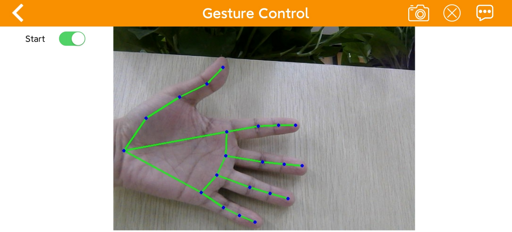

② Icon Function

| **Icon** | **Function** |
| --- | --- |
|  | Start or stop the game |
| 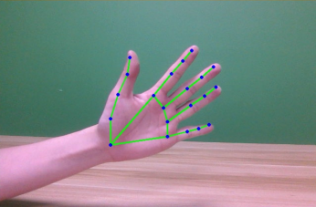 | Camera view |
|  | Capture the current camera view and the photo is saved in the photo album. |
|  | Close the navigation bar |
|  | Message box |

③ Operation Steps and Game Effect

**Note:**

* After the game starts, JetHexa can only recognize one hand at the same time.

* The interval between each round of gesture recognition is 5s.

JetHexa can recognize static gesture and dynamic gesture.

- **Static Gesture Recognition**

Make the following gestures within the field of view of the camera, then JetHexa will execute corresponding action after recognizing your gesture.

| **Static Gesture** | **Example** | **Robot Action** |
| --- | --- | --- |
| Finger heart |  | Wave |
| OK |  | shake |
| fist |  | Lunge forward |

- **Dynamic Gesture Recognition**

* After the game starts, open your hand to make “5” gesture within the field of view of camera. Then your hand key points will be marked on the camera view, and the buzzer will make two sound.

* Extend your index finger. Having recognized gesture “1”, JetHexa’s buzzer will beep once. Draw the line up, down, left and right with your index finger, then the fingertip trajectory will be displayed on the camera view.

* Open your hand again to sign the end of drawing. Later, JetHexa will execute corresponding action.

| **Dynamic Gesture** | **Robot Action** |
| --- | --- |
|    Draw line up     |    Go forward    |
|   Draw line down    |   Go backward    |
|   Draw line left    |    Move left     |
|   Draw line right   |    Move right    |

(4) Target Tracking

① Interface Design

* At left is game control, color/ tag selection, selected result display area.

* At right is the camera view.

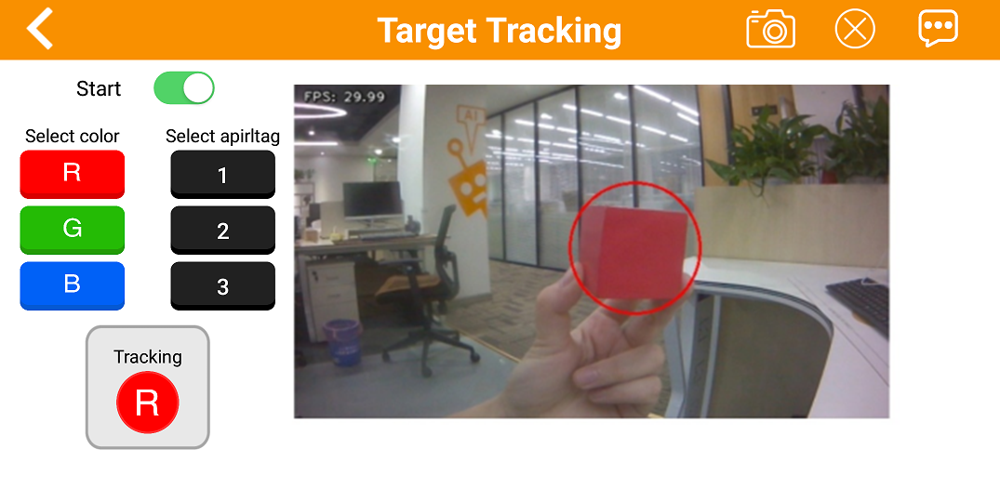

② Icon Function

| **Icon** | **Function** |
| --- | --- |
|  | Start or stop the game |
| 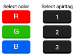 | Select the target color or Apriltag. |
| 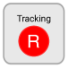 | Display the tracked target. |
| 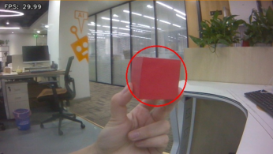 | Display the camera view |
|  | Capture the current camera view and the photo is saved in the photo album. |
|  | Close the navigation bar |
|  | Message box |

③ Operation Steps and Game Effect

**Note:**

* After the game starts, please remove other objects in target color except the tracked object from the field of view of the camera, otherwise the game will be influenced.

* When JetHexa cannot recognize the color well, you can adjust the color threshold according to the material in “1. Basic Lesson-\>2. Quick User Experience-\>Lesson 2 Color Threshold Setting”

* Click “**Start**” button, then click the color button, such as red.

* Place the red object within the field of view of the camera. When JetHexa recognizes the object, slightly move the object, then JetHexa’s head will turn as the object moves.

(5) Line Following

① Interface Design

* At left is the game control, color selection and selected result display area.

* At right is the camera view

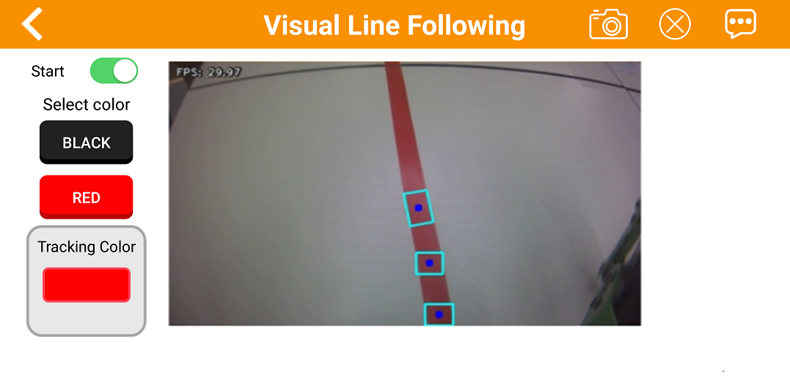

② Icon Function

| **Icon** | **Function** |
| --- | --- |
|  | Start or stop the game |
| 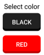 | Select the followed color |
| 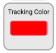 | Display the selected color |
| 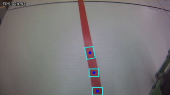 | Display the camera view |
|  | Capture the current camera view and the photo is saved in the photo album. |
|  | Close the navigation bar |
|  | Message box |

③ Operation Steps and Game Effect

**Note:**

* After the game starts, please remove other objects in target color from the field of view of the camera, otherwise the game will be influenced.

* Please don’t operate under strong light which will affect the realization of the game

* For example, let JetHexa move following red line. Set the path with the red tape, and place JetHexa on the path.

* Click “**Star**t” button

* Tap “**R**” button

* Having recognized the line, JetHexa will go forward along the line.

**2. Advanced Kit**

Please install the APP first according to “**1. Basic Lesson/ 2. Quick User Experience/ Lesson 1 APP Control/ 1. APP Installation and Connection**”.

Take the operation on Android device for example, and the instructions are also applicable to iOS device.

* Start JetHexa, and connect it to “**WonderAi**” APP.

* For JetHexa advanced kit, there are 4 games, including robot control, robot performance, Lidar and gesture control.

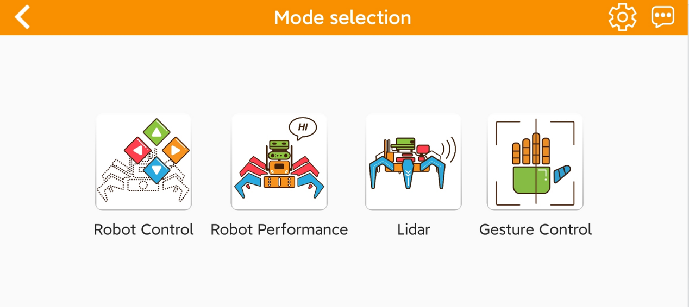

(1) Robot Control

① Interface Design

Click “**Robot Control**” in mode selection interface to enter the control interface.

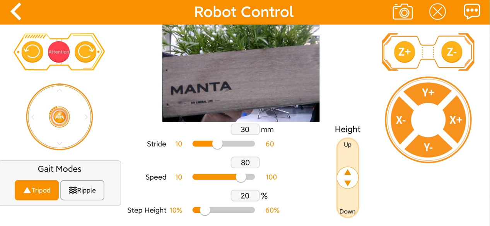

② Icon Function

| **Icon** | **Function** |
| --- | --- |
| 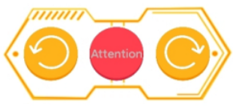 | Used to control JetHexa to turn left and right, and “attention” key is used to control JetHexa to return back to initial posture. |
| 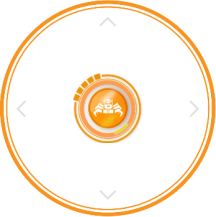 | Drag the central button to control JetHexa to go forward, backward, left and right. |
| 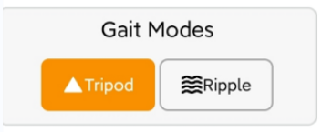 | Two options for gait |
| 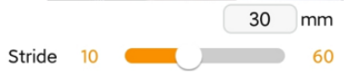 | Adjust JetHexa’s stride ranging from 10mm to 60mm |
|  | Adjust JetHexa’s speed ranging from 10 to 100 |
|  | Adjust the step height ranging from 10 to 60 |
|  | “**Z+**” button is used to control JetHexa to twist left, and “**Z-**” button is for controlling robot to twist right. |
|  | “**Y+**” button is used to control JetHexa’s front half body to lean downward and hind half body to lean upward. “**Y-**” button is used to control JetHexa’s front half body to lean upward and hind half body to lean downward. “**X-**” button is used to control the robot to tilt to left. “**X+**” button is used to control the robot to tilt to right. |
|  | Adjust JetHexa’s body height. |
| 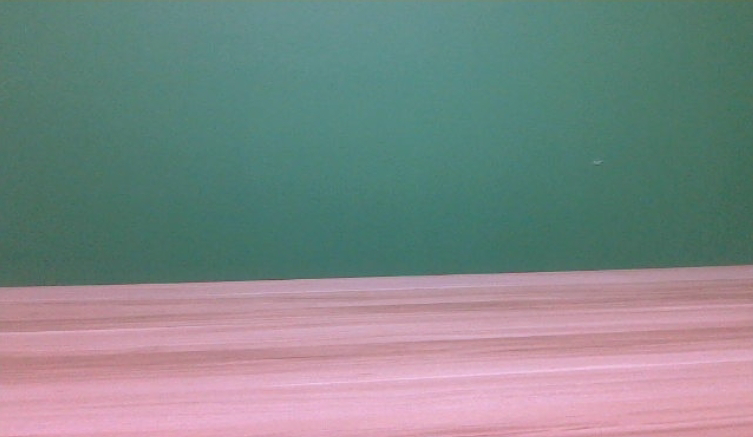 | Display the camera view |
|  | Capture the current camera view and the photo is saved in the photo album. |
|  | Close the navigation bar |

(2) Robot Performance

① Interface Design

* At left are the options for action groups, including built-in action group and custom action.

* At right is the self-balancing control button.

② Icon Function

| **Icon** | **Function** |
| --- | --- |
|     | Select the action to let JetHexa to perform. |
|  | Customize the action except the actions listed on interface. |
|  | Enable or stop JetHexa’s self-balancing function. When self-balancing function is enabled, JetHexa will adjust its posture to balance its body according to the tilt angle |
|  | Message box |

**Note: if you need to add custom actions, you can refer to the material in “7. Standard Motion Control Lesson-\>5. PC Software Action Editing Lesson-\>Lesson 4 APP Custom Control”**

(3) Lidar

① Interface Design

* At left is Lidar control and parameter adjustment area.

* At right is the camera view.

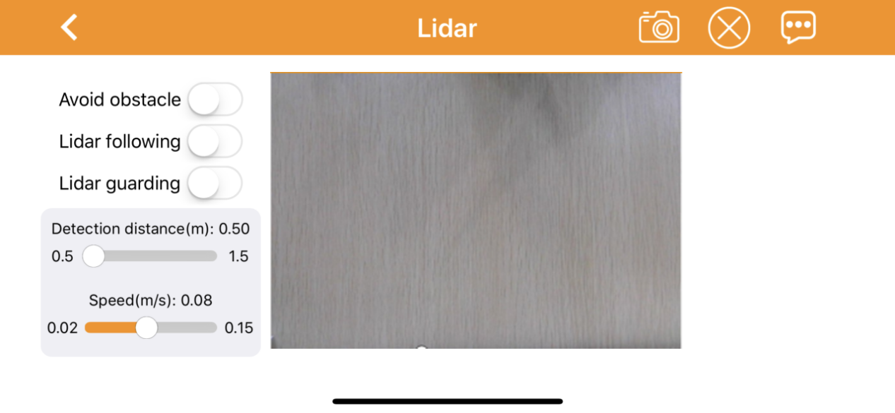

② Icon Function

| **Icon** | **Function** |
| --- | --- |
|  | Start or stop Lidar obstacle avoidance |
|  | Start or stop Lidar following |
|  | Start or stop Lidar guarding |
| 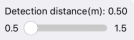 | Adjust Lidar detection distance ranging from 0.3 to 1.5m. |
| 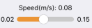 | Adjust JetHexa’s speed ranging from 0.02 to 0.15m/s |
|  | Display the camera view |
|  | Capture the current camera view and the photo is saved in the photo album. |
|  | Close the navigation bar |
|  | Message box |

③ Operation Steps and Game Effect

**Note:**

* In “Avoid Obstacle” and “Lidar Following” game, the detection zone is the sector of 90°radian at the front.

* In “Lidar Guarding” game, JetHexa will perform 360-degree detection.

There three Lidar games including avoid obstacle, lidar following and lidar guarding.

- **Avoid Obstacle**

* When “**Avoid Obstacle**” game starts, JetHexa will keep going forward.

* When detecting obstacle, JetHexa will bypass the obstacle.

- **Lidar Following**

  After the game starts, JetHexa will adjust its position when detecting the obstacle to leave a certain distance between it and the obstacle. This distance can be set in 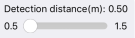

- **Lidar Guarding**

  After the game starts, JetHexa will adjust its body to face the obstacle when detecting the obstacle.

(4) Gesture Control

① Interface Design

* At left is the “**Start**” button.

* At right is the camera view.

② Icon Function

| **Icon** | **Function** |
| --- | --- |
|  | Start or stop the game |
|  | Camera view |
|  | Capture the current camera view and the photo is saved in the photo album. |
|  | Close the navigation bar |
|  | Message box |

③ Operation Steps and Game Effect

**Note:**

* After the game starts, JetHexa can only recognize one hand at the same time.

* The interval between each round of gesture recognition is 5s.

JetHexa can recognize static gesture and dynamic gesture.

- **Static Gesture Recognition**

Make the following gestures within the field of view of the camera, then JetHexa will execute corresponding action after recognizing your gesture.

| **Static Gesture** | **Example** | **Robot Action** |
| --- | --- | --- |
| Finger heart | 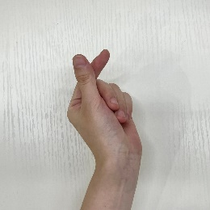 | Wave |
| OK | 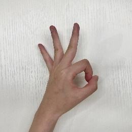 | shake |
| fist | 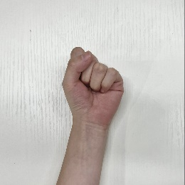 | Lunge forward |

- **Dynamic Gesture Recognition**

* After the game starts, open your hand to make “5” gesture within the field of view of camera. Then your hand key points will be marked on the camera view, and the buzzer will make two sound.

* Extend your index finger. Having recognized gesture “1”, JetHexa’s buzzer will beep once. Draw the line up, down, left and right with your index finger, then the fingertip trajectory will be displayed on the camera view.

* Open your hand again to sign the end of drawing. Later, JetHexa will execute corresponding action.

| **Dynamic Gesture** | **Robot Action** |
| --- | --- |
|    Draw line up     |    Go forward    |
|   Draw line down    |   Go backward    |
|   Draw line left    |    Move left     |
|   Draw line right   |    Move right    |

### 1.2.2 Lesson 2 Color Threshold Setting

One color under different lights may deviate, which has impact on the realization of color recognition.

To tackle this problem, we need to adjust the color threshold on the APP. Take operation on Android device for example, and the instruction is also applicable to iOS device.

1. Start JetHexa, and connect it to the APP “**WonderAi**”.

2. Enter Mode Selection interface, and the click  to enter the color threshold setting interface.

3. Take adjusting red for example. Place the red block within the camera frame, and then select red.

4. Click “**instruction**” to check how to make adjustment.

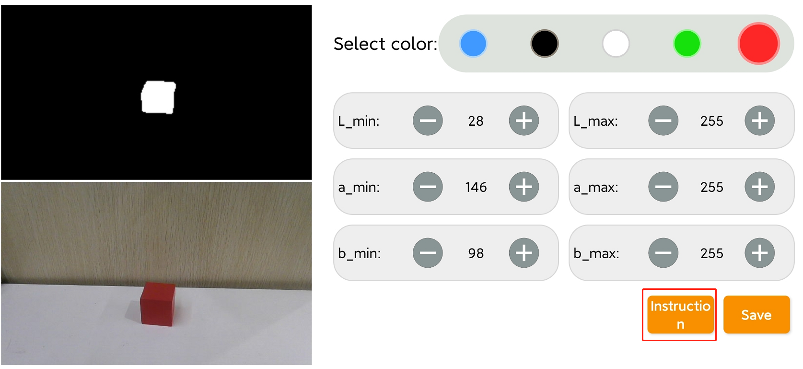

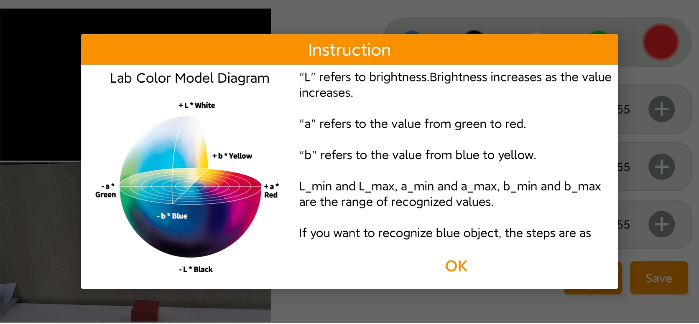

5. Set all the “ **\_min**” values as “**0**” and “**\_max”** values as “**255**”.

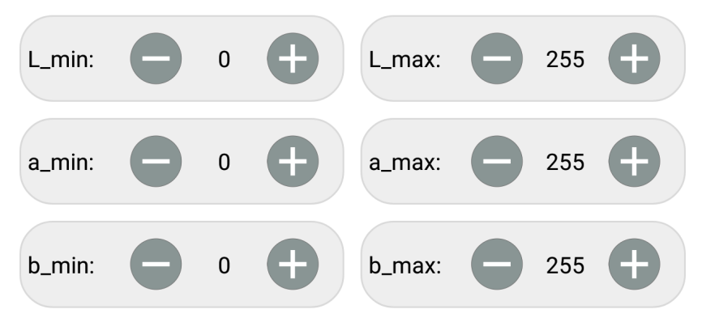

6. According to Lab color model diagram, adjust L, A and B components to approach the target color zone.

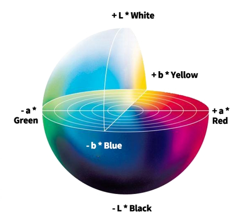

Red is around “**+a**” zone, hence A component needs to be increased, that is “**L_max**” value remains unchanged and “**L_min**” value needs to be increased until the red block at left turns white and other area turns black.

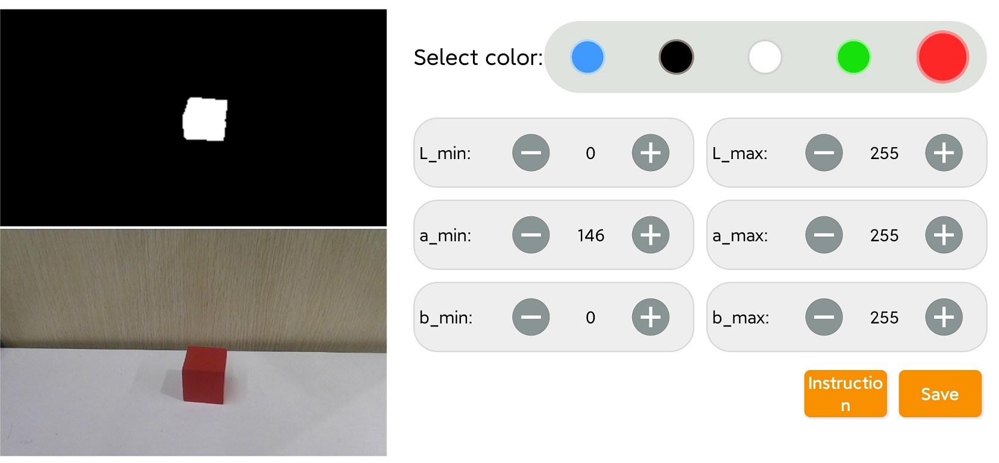

7. Based on the environment, modify “L” and “B” components. If it belongs to light red, increase “**L_min**”. Otherwise, decrease “**L_max**”. If it belongs to warm tone, increase “**b_min**”. Otherwise, decrease “**b_max**”.

8. After adjustment, click “**Save**” to save the adjusted threshold.

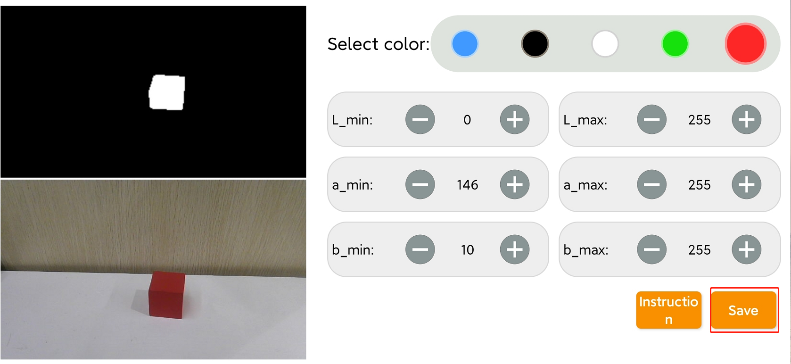

### 1.2.3 Lesson 3 Wireless Handle Control

#### 1.2.3.1 Preparation

**1. Insert the handle receiver into any USB interface on JetHexa.**

**Note: if you have already inserted the handle receiver before booting up JetHexa, you can skip this step.**

**2. Please bring your own two AAA dry batteries. And insert them into the battery slot and please do not invert the positive and negative electrode.**

#### 1.2.3.2 Device Connection

**1. Turn on JetHexa.**

**2. Turn on the switch on the handle. At this time, two LED lights (red and green) will flash simultaneously.**

**3. Please wait for a while. Then the robot will pair with the handle automatically. After successful pairing, the green light will keep lighting up.**

If the handle doesn’t connect to the robot within 30s or there is no operation on the handle within 5 minutes after turning on, it will enter sleep mode. And you can press “**START**” to activate the handle.

#### 1.2.3.3 Button Function

**Note:**

* **You can press the button and rotate the joystick simultaneously to control the robot.**

* **When you press any key, JetHexa will keep marching on the spot under the corresponding gait. And stop marching and reset its posture when you press the key again.**

The functions of the buttons are listed below. (Take JetHexa as the first person perspective)

| **Button** | **Function** | **Operation** |
| --- | --- | --- |
| START | stop and reset body | Short press |
| SELECT+START | stop and reset body. And step height and stride will restore to default value | Short press |
| L1 | speed up | Long press |
| L2 | Speed down | Long press |
| R1 | Increase the lifted height of the leg | Long press |
| R2 | Decrease the lifted height of the leg | Long press |
| Move the left joystick upward | move forward under tripod gait | Long press |
| Move the left joystick downward | move backward under tripod gait | Long press |
| Move the left joystick to the left | move to the left under tripod gait | Long press |
| Move the left joystick to the left | move to the right under tripod gait | Long press |
| △ | Robot will loop up | Long press |
| × | Robot will look down | Long press |
| ◻ | turn left under wave gait | Long press |
| ○ | turn right under wave gait | Long press |
| Upward button(▲) | Move forward under wave gait | Long press |
| Downward button(▼) | Move backward under wave gait | Long press |
| Left button(◄) | Move left under wave gait | Long press |
| Right button(►) | Move right under wave gait | Long press |
| move the right joystick upward | Raise the body height | Long press |
| move the right joystick downward | Lower the body height | Long press |
| move the right joystick to the left | Turn left under tripod gait | Long press |
| move the right joystick to the right | Turn right under tripod gait | Long press |
