# 3. Python Basic Lesson

## 3.1 Python Introduction and Installation

### 3.1.1 Python Introduction

**3.1.1.1 Object Oriented Introduction**

Python is a object oriented programming language. Object Oriented is a method of software development and a programming paradigm. Difference between Object Oriented and Procedure Oriented is as follow. 

| **Software Development Method** | **Programming Idea** |
|:--:|:--:|
| Procedure Oriented | Focus on procedure, analyze the steps to solve problems and implement the steps sequentially with functions. |
| Object Oriented | Focus on object, decompose things that make up the problem into several objects and describe the behavior of an object in the overall solution. |


**3.1.1.2 Python Overview**

First released in 1991, Python is a cross-platform programming language. And it gets its name from comedy troupe Monty Python preferred by its developer.  

Python provides ample API (Application Programming Interface) and tools, which enables the programmer to write extension modules in C, C++ and Cython. In addition, Python compiler can also be integrated into the program which requires scripting language, so it is frequently used to integrate and package the program written in other languages.  

Thanks to its syntax, dynamic typing and nature of interpreted language, Python is the programming language adopted by most platforms to write script and develop application. As the version keeps updating and new functions are added, Python is gradually applied in the development of independent and large-scale project. 

:::{Note}
 **Python2.0 is no longer maintained by the official since 2020, so it is recommended to use Python3.0 or above.**
:::

**3.1.1.3 Python Feature**

(1)  Easy to master: Python has small amount of keywords, simple structure and clear syntax definition. 

(2)  Easy to read and maintain: the definition of Python code is distinct and it is easy to maintain the source code.

(3)  Fast running: base layer, multiple standard libraries and the third-party libraries are written in C, which attributes to fast running.

(4) Free and open-source

(5) Abundant libraries: Python comes with large standard library which can handle various tasks, including regular expressions, documentation generation, unit testing, threading, databases, web browsers, CGI, FTP, and other system-related operations.

(6) Transplantable: as Python is open-source, it can be transplanted to various platforms, such as Linux and Windows.

### 3.1.2 Check Python Version

:::{Note}
the following operations are based on Ubuntu 18.04 . As Ubuntu 18.04 comes with Python 3.6.9, users who use this system can skip Python installation. 
:::

Enter the command "**python3 -V**" and press Enter to check the current Python version.

```bash
python3 -V
```

### 3.1.3 pyCharm Installation 

**3.1.3.1 Download pyCharm**

(1) Input command “sudo apt install snapd snapd-xdg-open” to install snap installation package.

```bash
sudo apt install snapd snapd-xdg-open
```

(2) Input command “snap refresh” to refresh snap.

```bash
snap refresh
```

:::{Note}
If connection errors occur during update, switch to an alternative mirror repository such as Tsinghua mirror and retry.
:::

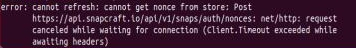

(3) Input command"**sudo snap install pycharm-community --classic**"to install PyCharm。

```bash
sudo snap install pycharm-community --classic
```

**3.1.3.2 Open PyCharm**

(1) Open menu and find pyCharm

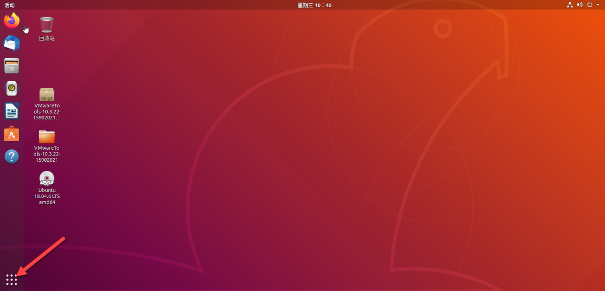


(2) Create new PyCharm project and configure. Click “New Project”.


(3) Select “**Previously configured interpreter**” and click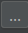。


(4) Select   "System lnterprefter"。

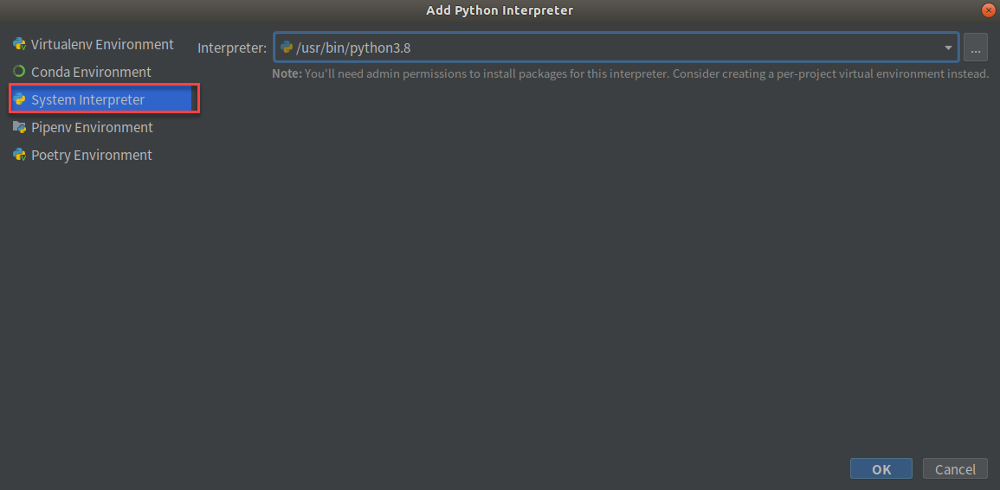

(5) Click"create"。

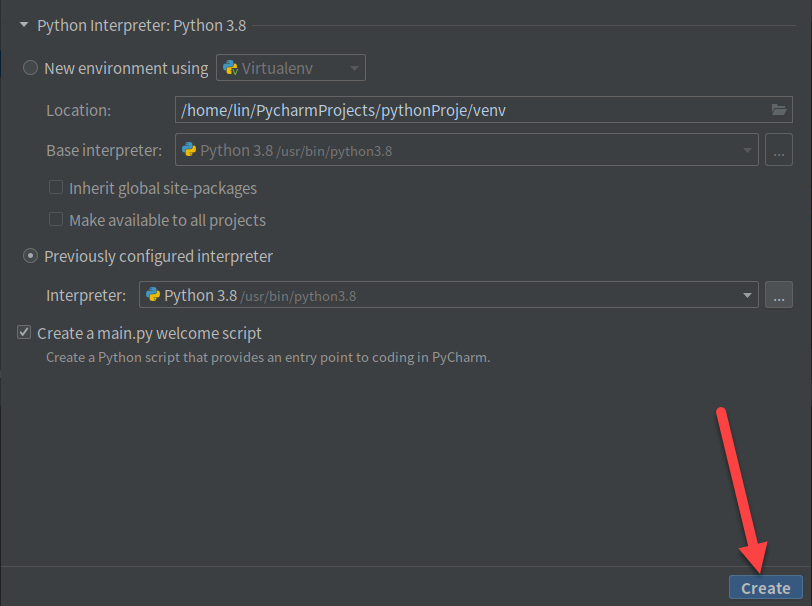

(6)  Lastly, you will enter this interface.

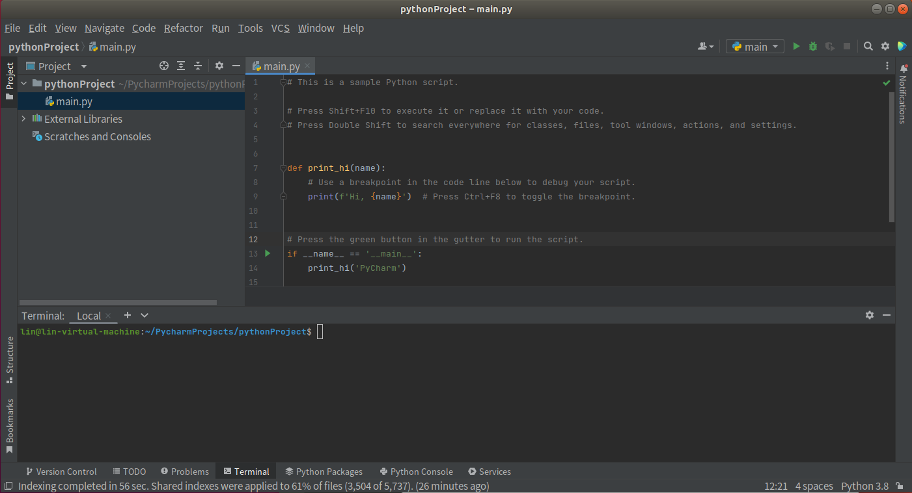


1.3.3 Usage of pyCharm

(1) The user interface of pyCharm is as follow.

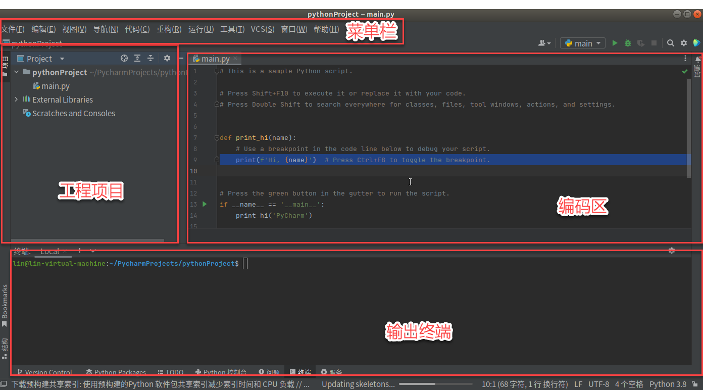

(2) Create a .py file. Right click the project folder.

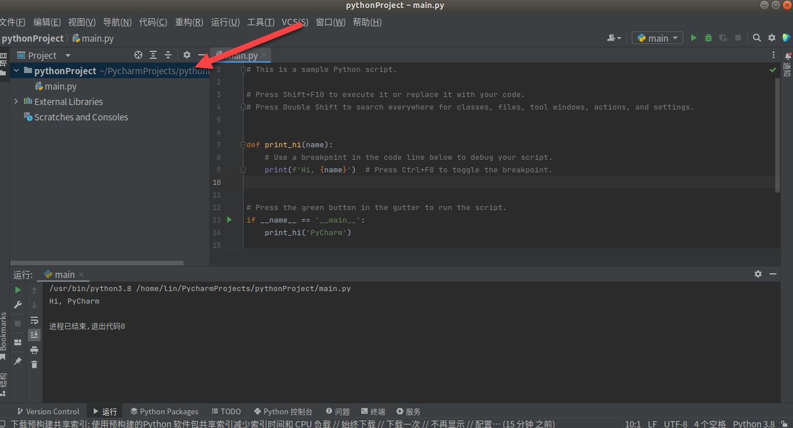

(3) Click “**New>Python file**”

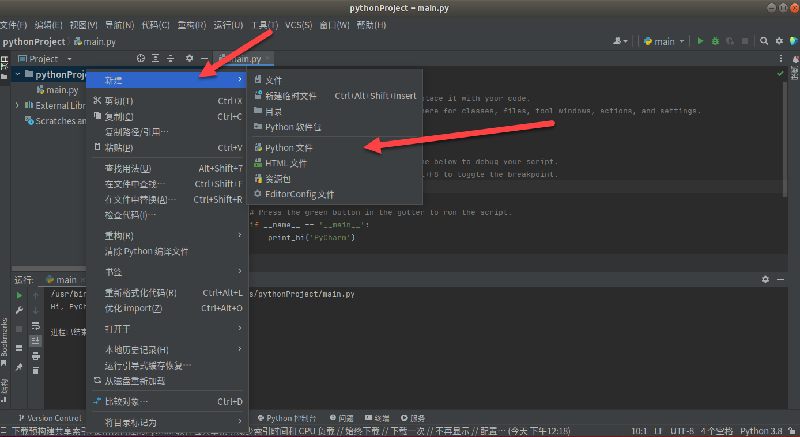

(4) Name python file you created.

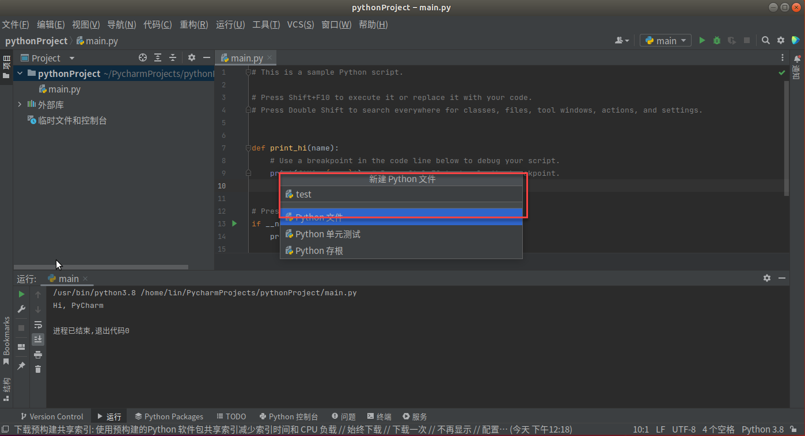

(5) The python is created.

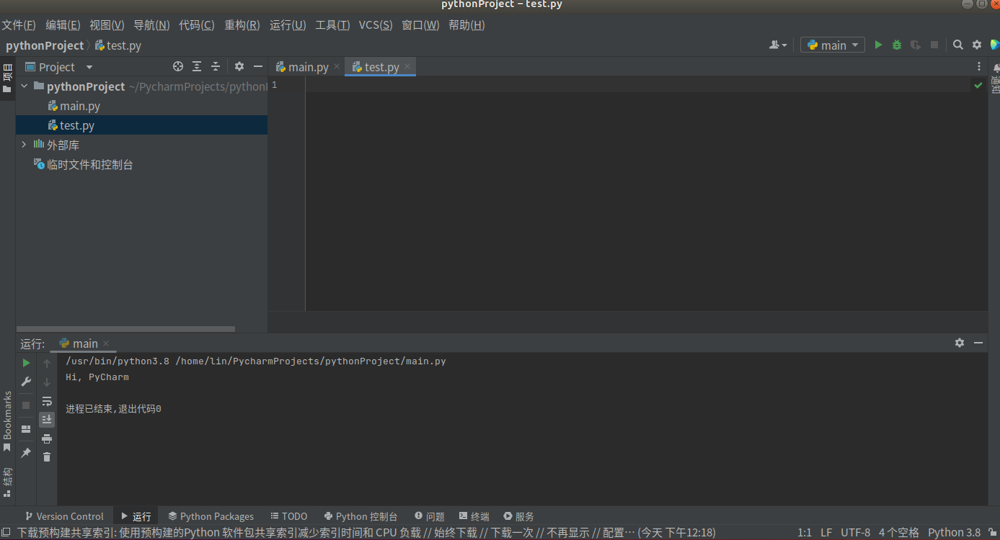

(6)Right click coding area to select “**run**”. You can check the output result on the output terminal.

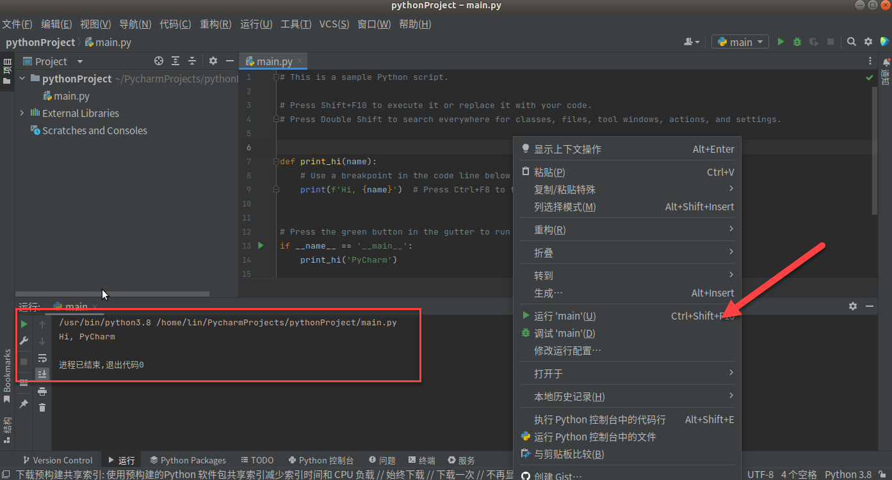

To learn more information, please visit pyCharm official website: https://www.jetbrains.com/zh-cn/pycharm/。

## 3.2 First Program-“Hello World”

String is a collection of multiple characters and enclosed by single or double quotation mark. String includes alphabet, Arabic numeral, Chinese or various symbols.

For example, we can print “**Hello**” string on the screen.

### 3.2.1 Operation Steps

```bash
sudo apt-get install vim
```

1. Type "**Y**" and press Enter when prompted to continue. Completion without error messages indicates successful installation.

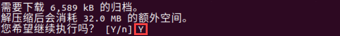

(2) Input “mkdir test” command and press Enter to build a folder named “test” under the current directory. 

```bash
mkdir test
```

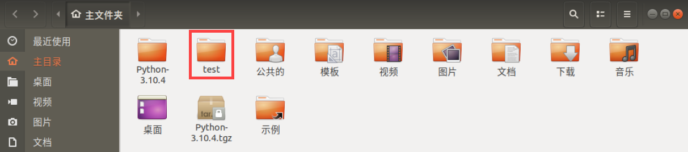

(3) Input command **“cd test/”** and press Enter to enter **“test”** folder.

```bash
cd test/
```

(4) Input “touch hello.py” command and press Enter to create a program file named “hello”.

```bash
sudo apt install vim
```

(5) Input “**touch hello.py**” command and press Enter to create a program file named “**hello**”.

```bash
touch hello.py
```

(6) Input “**vim hello.py**” command and press Enter to open program file.

```bash
vim hello.py
```

(7) Press **“I”** key to enter editing mode and then input **“print("Hello World")”.**

(8)Press “Esc” and input **“:wq”** and press Enter to save and exit the editing.

```bash
:wq
```

(9) Input **“python3 hello.py”** command and press Enter to run the program file. Then the string will be printed on the terminal.

```bash
python3 hello.py
```

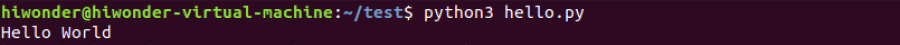

### 3.2.2 Expansion Content

Besides the string, print() function can be also used to output the result of mathematical expression. Take adding print() function of mathematical expression to the program file for example. 

(1) Start virtual machine, and click，and then click，or press “**Ctrl+Alt+T **” to open command line terminal.

(2)Input command "**cd test/**"，and press **Enter** to enter"**test**"folder.

```bash
cd test/
```

(3) Input"**vim hello.py**"，command, and press Enter to open program file.

```bash
vim hello.py
```

(4) Press “**I**” key to enter the editing mode and input “**print(100+100)**”


:::{Note}
 **there is no need to enclose the mathematical expression with double quotation mark.**
:::

(5) Press"**Esc**"and input "**:wq**"and press **Enter** to save and exit the editing.

```bash
:wq
```

(6) Input"**python3 hello.py**" command and press Enter to run the program file. Then the result of the mathematical expression will be printed on the terminal. 

```bash
python3 hello.py
```

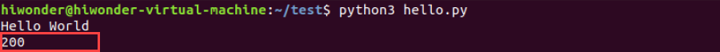

### 3.2.3 Function Explanation 

`print()` function is used to print output in the format below. 

```python
print(*objects, sep='', end='\n', file=sys.stdout, flush=False)
```

The first parameter “**objects**” is the output object. When output several objects, they should be separately with “***\*,\****” in between.

The second parameter “**sep**” is used to put string between the output objects, ’ ’ by default.

The third parameter “**end**” is used to add string at the end of output, ’\n’ by default. 

The fourth parameter “**file**” is the object with a write function, the default value is “sys.stdout”, that is screen. 

The fifth parameter “**flush**” is used to output cache and the default value is “**False**”. 

## 3.3 Python Basic Syntax

This lesson will explain the basic syntax of Python, such as comments, indentation rules, coding standards, etc.

### 3.3.1 Comment

Comments are used to explain Python code. Python support two types of comments, including single line comment and multi line comments.

(1) Single Line Comment

Comment starts with “#” and its format is as follow. 

```python
# comment
```

(2) Multi Line Comments

Insert three single quotation marks “***\*'''\****” or three double quotation marks “***\*"""\****” at the beginning and the end of the comment to comment multiple lines, and the format is as follow.

```python
'''
comment
comment
'''
```

Or:

```python
"""
comment
comment
"""
```

### 3.3.2 Indentation Rules

Python uses indentation and colon symbol (:) for showing where blocks of code begin and end

In Python, for class definitions, function definitions, flow control statements, exception handling statements, etc., the colon at the end of the line and the indentation of the next line represent the beginning of the next code block. And when indentation ends, a block of code ends. 

Each red frame in the picture below represents one block of code.

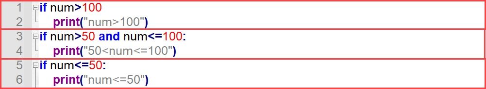

block of code at the same level should be indented consistently. We can use “**Tab**” key or input 4 spaces to indent. 

:::{Note}
Python uses 4 spaces as indentation by default. In general, one  Tab is equal to 4 spaces.
:::

### 3.3.3 Coding Standard

Python adopts PEP8 as coding standard. “**PEP**” represents Python Enhancement Proposal, and “**8**” indicates style guide of Python code. 

Please strictly follow the coding standard when coding to make the code neater, which will enhance the readability.

(1)  One “import” is for one module. Please don’t import multiple modules for one time.


| **Recommend** | 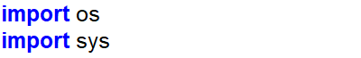 |
|:--:|:--:|
| **Not Recommend** |  |

(2) Please don’t put semicolon “;” at the end of the line, and don’t put two commands at the same line

| Recommend |  |
|:--:|:--:|
| **Not Recommend** | 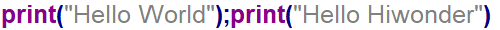 |

(3) The length of line should not be greater than 80 characters, and you can separate a command into several lines, and put the command inside “**()**”, as the example shown below. It is not recommended to use backslash “\” to connect the lines of contents.


| Recommend | 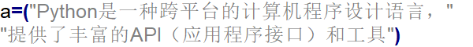 |
|:--:|:--:|
| **Not Recommend** | 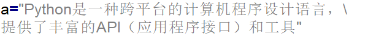 |

(4) When necessary, we can input space to improve the readability of the code.

(5)  In general, it is recommended to input space around both sides of operators and commas, and between parameters of function to separate. 

### 3.3.4 Identifier Naming Standard

Identifier is the name of variable, function, class, module and other objects. In Python, naming identifier should be consistent with the naming rules. 

(1)  Identifier names in Python can contain letters (A~Z, a-z), underscore (_) and number, and the name should always start with a non-numeric character.  

(2) Identifier must be different from keywords/ reserved words in Python. For the definition of keywords/ reserved, please move to “**5. keyword/ reserved word**”. 

(3)1） Identifier cannot contain **space**, **@**,**%** **,** **$** and other special characters.

Examples of valid and invalid identifier are listed below.  

| **Valid Identifier** |  |
|:--:|:--:|
| **Invalid Identifier** | 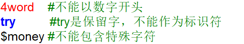 |

(4)  Identifier is case sensitive. For example, “num”, “Num” and “NUM” are three independent variables.

(5)  Identifier starting with underscore “**_**” has special meaning. Please avoid using identifier starting with “**_**” if not necessary.

| Identifier | Meaning | Example |
|:--:|:--:|:--:|
| Start with single underscore | Class properties that cannot be accessed directly through “from...import*” | \_width |
| Start with double underscore | Exclusive member of class | \_\_add |
| Start with double underscore | Special identifier | \_\_init\_\_ |

(6) Chinese can be used as identifier in Python. To avoid error, please shun Chinese.

Besides the rules mentioned above, there are corresponding rules in identifier naming under different situation.

① When used as module name, identifier should be short and composed of lower case letters. And underscore “_” can be used for separation. 

② When used as package name, identifier should be short and composed of lower case letters, but it is not recommended to use full stop “.”, such as “com.mr” and “com.mr.book”.

③ When used as class name, identifier should start with upper case letters, for example “Book” which defines a book class. 

④ When used as class name inside module, identifier can start with “_” and upper case letters, for example “_Book”. 

⑤ When used as function name, property name and method name in classes, identifier should be composed of lower case letters and underscore can be used to separate different words.

⑥ When used as constant name, identifier should consist of upper case letters and different words can be separated by underscore “_”.  

### 3.3.5 Keyword/ Reserved Word

Reserved word, also called keyword, is a word with special meaning in Python. And they cannot be used as variable names, function names, class names, module names or any other object names

In Python interactive programming environment, we can check the reserved words according to the steps below. 

(1) Start virtual machine，and click，and then click ， or press “**Ctrl+Alt+T**” to open command line terminal.

(2) Input"**python3**"command and press Enter to enter Python interactive programming environment.

```bash
python3
```

(3) Input"**import keyword**" command and press Enter to import “**keyword**” module.

```bash
import keyword
```

(4) Input"**keyword.kwlist**"  commend and press Enter to view all reserved words in Python. 

```bash
keyword.kwlist
```

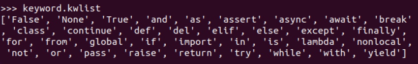

5. Enter the command "**exit()**" and press Enter to exit the Python interactive programming environment.

```bash
exit()
```

:::{Note}
Reserved words are also case sensitive. For example,**if** is reserved word, while **IF**,**iF** and **If** are not.
:::

**3.3.5.1 Data Type**

There are six types of data in Python3, including Number, String, List, Tuple, Dictionary and Set. 

And Number, String and Tuple are immutable, while List, Dictionary and Set are mutable.  

:::{Note}
**In Python,type(）function can be used to check the type of variable.**

:::

**(1) Number**

Number includes three numeric types to represent numbers or value. 

①  int: Integers can be binary, octal, decimal and hexadecimal values.

②  float: floats are decimal values generally composed of integers and decimals. Each floating point number occupy 8 bytes, that is 64 bits.

③ complex: complex number is a number with real and imaginary components. Both real and imaginary components belong to floating type.   

④  bool: Only has “**True**” and “**False**” values.  “**True**” corresponds to “**1**” and “False” corresponds to “**0**”

**(2) String**

A string is a collection of multiple characters. Strings in Python are surrounded by either single quotation marks “**'**”, or double quotation marks “**"**” and triple quotation marks “**''**” or “**"""**”.

① single quotation

```python
'
```

②  double quotation

```python
"
```

③ triple quotation

```python
'''
```

Strings with single quotation marks and double quotation marks are equivalent, and return the objects of the same type.  

:::{Note}
**when there is quotation marks inside the strings, we need to escape them through adding backslash ”\“ in front of the quotation marks to avoid syntax error.** 
:::

**(3) List**

List is a sequence structure in Python, which can store any types of data, including integer, decimal, string, list, tuple, etc. Its format is as follow.

```python
Variable name = (element 1, element 2,..., element n)
```

The number of elements in List is unlimited and there can be different types of elements in one List. For better readability of program, it is recommended to use one type of data in one list.

Each element in the List corresponds to integer index value. The corresponding element values can be obtained though index values so as to change and delete them.

 **(4)Tuple**  

Tuple is another important sequence structure in Python, which is similar to List. And its format is as follow.

```python
Variable name = (element 1, element 2,..., element n)
```

Different from List, Tuple is immutable sequence, which means that its elements cannot be changed or deleted.

**(5)Dictionary**

A dictionary is an unordered, mutable sequence that is created in the following format.

```python
Variable name = (key1:value1, key2:value2,…, keyn:valuen)
```

Dictionary is the only type of mapping in Python, which means that elements corresponds to each other.

The elements of dictionary can be List, Tuple, Dictionary and other types of data, but key value must be the immutable type. In addition, there should be only one key value in the same dictionary variable.

**(6) Set**

Set is used to store non-repetitive elements and its format is as follow.  

```python
variable name = {element 1, element 2,..., element n}
```

Set can only store immutable data type, including integer, float type, string and tuple, but cannot store mutable data type, including List, dictionary and set.  

## 3.4 Python Conditional Statement

### 3.4.1 Conditional  **Statement Introduction**

Conditional statement controls the execution of different blocks of code through judging whether the condition holds and based on the result of condition expression. 

### 3.4.2 Conditional Expression

Conditional expression consists of operator and operand. Take “**a<4**” for example. “**a**” and “**4**” are operand，and “**<**” is operator.

Judgment conditions can be any element with Boolean properties, including data, variables, and expressions composed of variables and operators. If its Boolean property is "True", the condition holds; if it is "False", the condition doesn’t hold. 

The table lists the commonly used operators by conditional expression. 

<table class="docutils-nobg" border="1">
    <thead><tr><th>Type</th><th>Operator</th><th>Mathematical Symbol</th><th>Meaning</th></tr></thead>
    <tbody>
        <tr><td rowspan="7">Arithmetic operator</td><td>+</td><td>+</td><td>add</td></tr>
        <tr><td>-</td><td>-</td><td>subtraction</td></tr>
        <tr><td>*</td><td>×</td><td>multiplication</td></tr>
        <tr><td>/</td><td>÷</td><td>Division, and the result is floating point number</td></tr>
        <tr><td>//</td><td> </td><td>Division, and the result is a rounded down integer</td></tr>
        <tr><td>%</td><td>%</td><td>Modules/ Surplus</td></tr>
        <tr><td>**</td><td>^</td><td>Exponentiation</td></tr>
        <tr><td rowspan="6">Comparison Operators</td><td>==</td><td>=</td><td>Equal</td></tr>
        <tr><td>!=</td><td>≠</td><td>Not equal</td></tr>
        <tr><td>&gt;</td><td>&gt;</td><td>Greater than</td></tr>
        <tr><td>&lt;</td><td>&lt;</td><td>Less than</td></tr>
        <tr><td>&gt;=</td><td>&gt;=</td><td>Greater than or equal to</td></tr>
        <tr><td>&lt;=</td><td>&lt;=</td><td>Less than or equal to</td></tr>
        <tr><td rowspan="2">Membership Operator</td><td>in</td><td>∈</td><td>Exist/ belong to</td></tr>
        <tr><td>not in</td><td>∉</td><td>Not exist/ not belong to</td></tr>
    </tbody>
</table>


Python is able to combine the judgement condition logically through the reserved words “not”, “and” and “or”.

(1) not: it represents the “**not**” relationship for an individual condition. If the Boolean property of the “**condition**” is “**True**”, the Boolean property of the “**not condition**” is “**False**”. If Boolean property of the “**condition**” is “**False**”, the Boolean property of the “**not condition**” is “**True**” 

(2)and: it represents “**and**” relationship between several conditions. Only when the Boolean properties of the conditions connected by “and” are **all** **“**True**”**, the Boolean property of the logic expression is “**True**”, otherwise “False”.

(3)or: it represents “**or**” relationship between several conditions. Only when the Boolean properties of the conditions connected by “or” are **all “False”**, the Boolean property of the logic expression is “**False**”, otherwise “**True**”. 

### 3.4.3 **Selection Statement**

There are three types of selection statements, including single-branch selection structure, double-branch selection structure and multi-branch selection structure.

- #### 3.4.3.1 **Selection Statement**

There are three types of selection statements, including single-branch selection structure, double-branch selection structure and multi-branch selection structure. 

| Syntax | Execution Process |
|:--:|:--:|
| 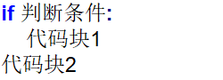 | 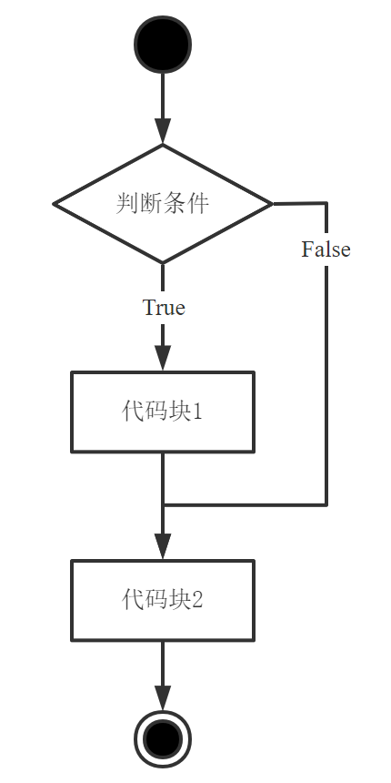 |

If the condition of “if statement” is true, block of code 1 and 2 will be executed in sequence. Otherwise, skip block of code 1 and directly execute block of code 2.

- #### 3.4.3.2 Double-branch selection structure

The syntax and execution process of double-branch selection structure are as follow.

| Syntax | Execution Process |
|:--:|:--:|
| 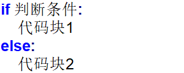 | 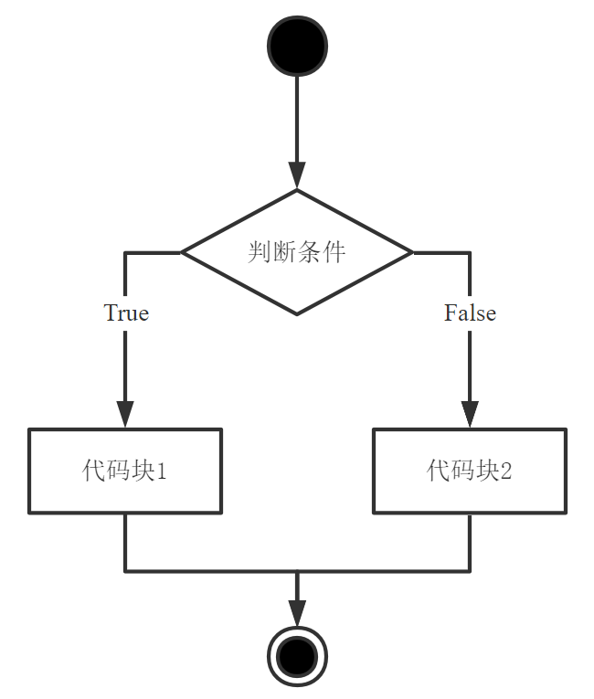 |

If the condition of “if statement” is true, block of code 1 will be executed. Otherwise, block of code 2 will be executed.

- #### 3.4.3.3 Multi-branch selection structure

The syntax and execution process of multi-branch selection structure are as follow.

| Syntax | Execution Process |
|:--:|:--:|
| 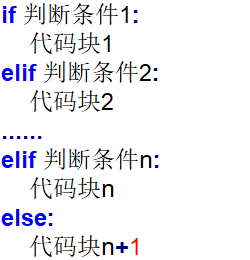 | 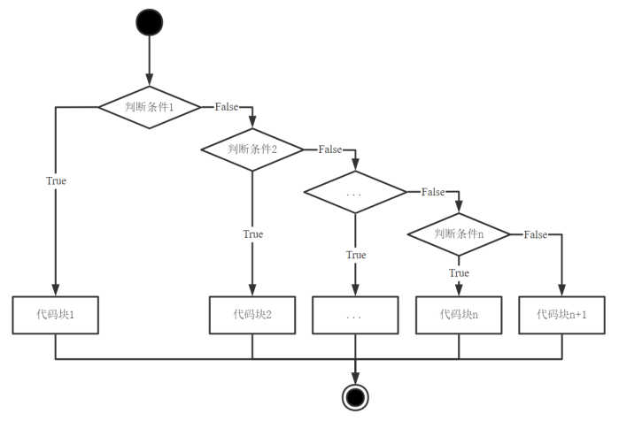 |

(1) If the condition of “if statement” is true, block of code 1 will be executed.

(2) If the condition of “if statement” is false, conditions of elif statements will be judged in sequence. When the condition is true, the corresponding block of code will be executed.

(3) If neither conditions of “if statement” nor elif statement are false, block of code n+1 will be executed. 

### 	3.4.4 Operation Steps

In this routine, the program will calculate BMI value based on the input height and weight, and then perform health assessment.

Before operation, please copy the routine **“conditional_statement.py”** stored in “ [Python Basic Lessons->4.Python Conditional Statement-> Routine Code]()” to the shared folder.

For the configuration of shared folder, please refer to the file in “[Linux Basic Lesson->3.Linux Installation and Source Replacement]()

:::{Note}
**the input command should be case sensitive and keywords can be complemented by “Tab” key.**
:::

(1) Start virtual machine, and click，and then click ，or press **“Ctrl+Alt+T”** to open command line terminal.。

(2) Input **“cd /mnt/hgfs/Share/”** command and press Enter to enter the shared folder

```bash
cd /mnt/hgfs/Share/
```

(3) Input"**python3 conditional_statement.py**"，command and press Enter to run the routine.

```bash
python3 conditional_statement.py
```

### 3.4.5 Program Outcome

Input height and weight in sequence, and press Enter. Then the terminal will print the corresponding BMI and assessment result.


### 3.4.6 **Program Analysis**

The routine can be found in ["OpenCV Computer Vision Lesson->Image Processing->5. Image Processing--Morphological Processing->Routine Code”]()

```python
height = float(input("height(m):"))
weight = float(input("weight(kg):"))

bmi = weight/(height ** 2) # calculate BMI
print("BMI: " + str(bmi))

if bmi < 18.5:
    print("Underweight")
elif bmi >= 18.5 and bmi < 24.9:
    print("Normal weight")
elif bmi >= 24.9 and bmi < 29.9:
    print("Overweight")
else:
    print("Obese")
```

**(1) Data input**

Call input() function to receive the input data. The hints are inside the parenthesis.  

```python
height = float(input("height(m):"))
weight = float(input("weight(kg):"))
```

**(2) Data calculation**

Process the input data based on BMI calculation formula, and then print the result on the terminal through **print()** function. 

```python
bmi = weight/(height ** 2) # caculate BMI
print("BMI: " + str(bmi))
```

The format of print() function is as follow. 

```python
print(\*objects, sep=’ ’, end=’\n’, file=sys.stdout, flush=False)
```

The first parameter **“objects”** is the output object. When several objects are output at one time, objects should be separated by comma “,”.
The second parameter **“sep”** is used to insert the string between the objects. The default value is a space.
The third parameter **“end”** is used to add string at the end of the output. The default value is a line break. 
The fourth parameter **“file”** is the object with a write function, the default value is “sys.stdout”, that is screen.
The fifth parameter **“flush”** is used to control and output cache. The default value is **“False”**.

**(3) Range Judgement**

As there are two or more judgement results, multi-branch structure should be adopted.

```python
if bmi < 18.5:
    print("Underweight")
elif bmi >= 18.5 and bmi < 24.9:
    print("Normal weight")
elif bmi >= 24.9 and bmi < 29.9:
    print("Overweight")
else:
    print("Obese")
```

① When BMI is less than 18.5, the corresponding BMI value and “underweight” will be printed. 

② When BMI is less than 24.9 and greater than or equal to 18.5, the corresponding BMI value and “normal, please keep it” will be printed. 

③ When BMI is less than 29.9 and greater than or equal to 24.9, the corresponding BMI value and “overweight” will be printed. 

④ When BMI is greater than 29.9, the corresponding BMI value and “obese” will be printed.

## 3.5 Python Loop Statement

In the program, some steps of the algorithm will be executed repeatedly under certain condition, which is loop statement. In this lesson, Python statement will be explained combining with the related routines.

### 3.5.1 Loop Statement Introduction

Loop statement includes **“while”** and “**for”**, which is used to repeat some steps.

- #### 3.5.1.1 while loop

The format and execution process of while loop are as follow. 

| Syntax | Execution Process |
|:--:|:--:|
| 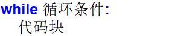 | 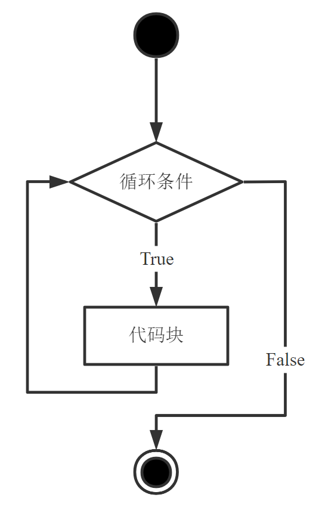 |

executed till the loop condition is **“False”**. When the loop condition is always **“True”**, it will fall into **“dead loop”**.

- #### 3.5.1.2 for loop

The syntax and execution process of for loop are as follow.

| Syntax | Execution Process |
|:--:|:--:|
| 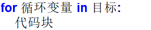 | 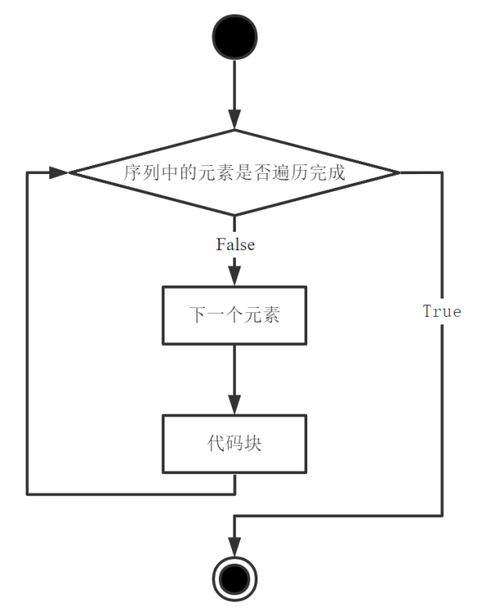 |

**”Target”** can be string, list, tuple, dictionary and other sequence type, while **“loop variable”** is used to store the elements read from the variable of the sequence type
After entering **for loop**, traverse the elements within target and execute the block of code within **for loop** till the traversal ends. 

### 3.5.2 Loop Control Statement Introduction

Loop control statement can be used to interrupt the loop, or skip the current loop to execute the next loop. Loop control statement contains **“break”**, **“continue”** and **“pass”**.。

- #### 3.5.2.1 break Statement

break statement is used to get out of the whole loop. The syntax and execution process are as follow. 

| Syntax | Execution Process |
|:--:|:--:|
| 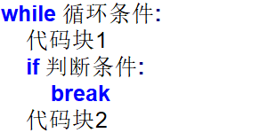 | 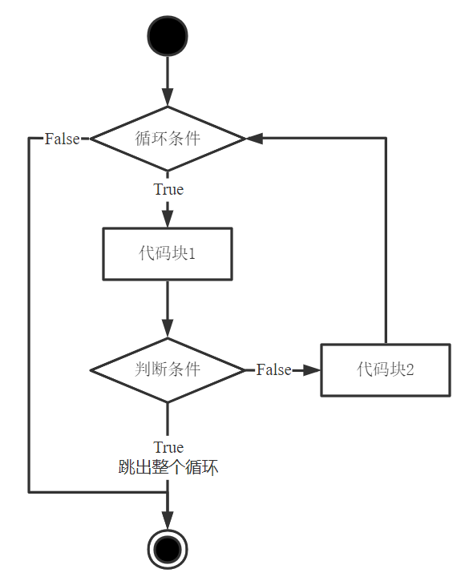 |
| 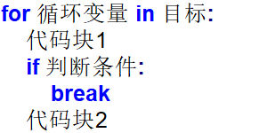 | 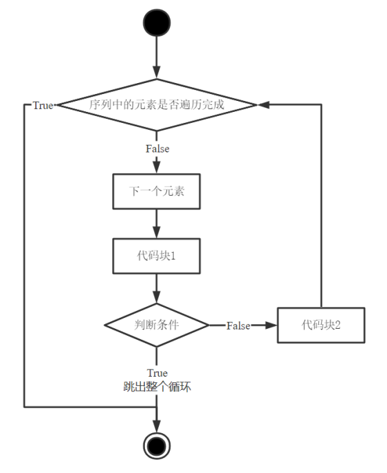 |

When the judgement condition is executed and is **“True”**, the loop will end. If the judgement condition is “False”, the block of code 2 will be executed and the loop will continue. 

- #### 3.5.2.2 continue Statement

continue statement is used to get out of this round of loop and carry out the next round of loop. The syntax and execution process are as follow.

| Syntax | Execution Process |
|:--:|:--:|
| 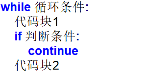 | 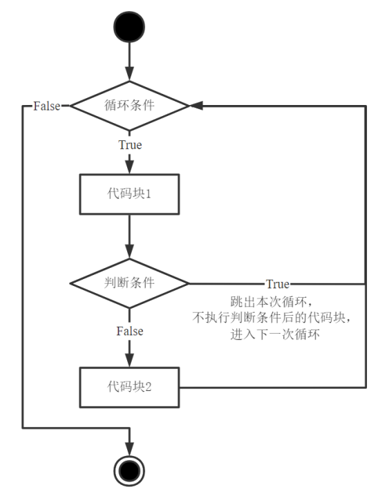 |
| 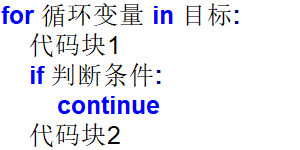 | 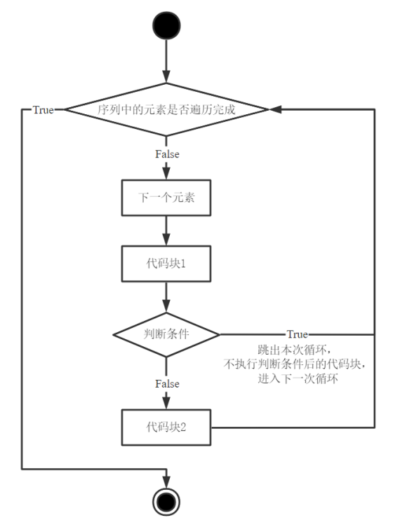 |

When the judgement statement is executed and is **“True”**, this round of loop is complete and next round of loop starts. If the judgement condition is “False”, the block of code 2 is executed and the second round of loop is done. 

- #### 3.5.2.3 pass statement

pass statement is null statement and nothing will be executed. It is used to keep the integrity of the program structure.

### 3.5.3 Operation Steps

This routine will calculate the factorial of the integer and print the elements of the string. 

Before operation, we need to copy the routine **“loop_statement.py”** stored in **“3. Python->Python Basic and Advanced Lesson-> Lesson 5 Python Loop Statement-> Routine Code”** to the shared folder.
For the configuration of the shared folder, please refer to the file in “**2. Linux Introduction and Usage->Linux Basic Lesson->Lesson 3 Linux Installation and Source Replacement”.**

```bash
the input command should be case sensitive, and the keywords can be complemented by “Tab” key.
```

(1)Start virtual machine, and click， and then click，1）or press “Ctrl+Alt+T” to open command line terminal.

(2) Input command **“cd /mnt/hgfs/Share/”** and press Enter to enter the shared folder.

```bash
cd /mnt/hgfs/Share/c
```

(3) Input the command **“python3 loop_statement.py”** and press Enter to run the routine.

```bash
python3 loop_statement.py
```

### 3.5.4 Program Outcome

Input one integer and press Enter, and then the terminal will print its factorial. 

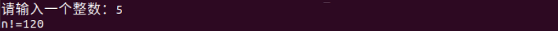

Input a string and press Enter, and then the terminal will print the elements of this string.

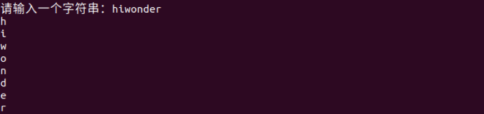

### 3.5.5 Program Analysis

The used routine **“loop_statement.py”** is stored in “**[Python Basic Lessons->5.Python Loop Statement-> Routine Code]()”**.

```python
n = int(input("Enter an integer: "))
fact = 1
i = 1
while i <= n:
    fact = fact * i
    i = i + 1
print("n!={}".format(fact))

string = input("Enter a string: ")
for c in string:
    print(c)
```

  **3.5.5.1 Calculate Factorial of the Value**  

**（1） Input data**

Call input() function to receive the input data. The hints are inside the parenthesis.

```python
n = int(input("Enter an integer: "))
```

**（2）Create variable** 
Create two variables for later calculation. **“fact”** is used to store the current factorial. 

```python
fact = 1
i = 1
```

**（3）while loop**
Use while loop statement to calculate the factorial of the designated integer. During loop, **“i”** value will keep adding up. When this value is greater than the input integer, the loop will end. Then, call print() function to print the result on the terminal. 

```python
while i <= n:
    fact = fact * i
    i = i + 1
print("n!={}".format(fact))
```

The syntax of print() function is as follow.  

```python
print(\*objects, sep=’ ’, end=’\n’, file=sys.stdout, flush=False)
```

The first parameter **“objects”** is the output object. When output several objects for one time, objects should be separated by “,”. 
The second parameter **“sep”** is used to insert the string between the objects. The default value is a space.
The third parameter **“end”** is used to add string at the end of the output. The default value is a line break.
The fourth parameter **“file”** is the object with a write function, the default value is **“sys.stdout”**, that is screen.
The fifth parameter **“flush”** is used to control and output cache. The default value is **“False”.**

**3.5.5.2 Print String Elements**

**（1）Input data**

Call input() function to receive the input data. The hints are inside the parenthesis.

```python
string = input("Enter a string: ")
```

**（2）For loop**

Use for loop to obtain the elements of the input string. Then call print() function in the loop structure to print the input string separately.

```python
for c in string:
    print(c)
```

## 3.6 Python Function and Module

In this lesson, functions and modules of Python will be explained combining the related routine.

### 3.6.1 Function Introduction

In Python, function is divided into built-in function and user-defined function. 

Built-in function that readily comes with Python can be directly called without importing any function libraries. The common built-in functions include print(), input(), range(), etc. 

User-defined function will define a piece of regular and reusable code as function to elevate the reuse rate and maintenance of the codes.

### 3.6.2 Function Definition

In Python, function generally is composed of function name, parameter list and function body consisting of series of statements. And the format is as follow.

```python
def function(parament list):
  function body
```

(1) A block of code starts with keyword **“def”**, and function identifier name and parameter list follows.

(2) For the convenience of future maintenance, it is better to reflect the function of the **function** on function identifier name. 

(3) Parameter list is used to set the parameters that can be received by the function, and the parameters can be separated by **“,”**.

(4) Any passed in parameters and variables should be inserted inside the parenthesis

(5) Functions should start with colon **“:”** and are indented strictly.

(6) The first line of statement in function can be docstring, i.e. function description.

(7) Functions have returned value which is **“None”** by default

:::{Note}
when building function, the parenthesis behind the function name cannot be omitted though there is no parameter in the function.
:::

### 3.6.3 Parameter and Argument

When defining function, we should adopt the parameter, while when calling the function, we adopt argument. They both work to pass the data. 

**3.6.3.1 parameter**

Parameters are not actual variables, so they are also called virtual variable. Parameters are adopted when defining function name and function. They are used to receive the parameters passed in when the function is called, and their scope is generally limited to the inside of the function body.

**3.6.3.2 argument**

Arguments are the parameters passed to the function when calling the function. They can be constants, variables, expressions and functions, and their scope is based on the actual setting. 
Regardless of the types, all arguments must have certain values when calling the function so that these values can be sent to parameter. 
Take the code below for example. **“width”** and **“height”** are parameters, while **“w”** and **“h”** defined outside the function body are arguments.

```python
# area()
def area(width,height):
    return width * height

#call area function
w = 4
h = 9
print("width=",w,"height=",h,"area=",area(w,h))
```


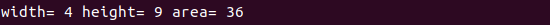


After parameter **“w”** and **“h”** are passed into the function body, **“width”** and **“height”** parameters are assigned to the corresponding values.

### 3.6.4 Return Value

After the function is executed, system will feed back some value to external caller, and these values are considered as return values of functions.
In Python, when function runs to return statement, it means that the function completes running and designated values will be returned. If there is no return statement inside the function, function will return **“None”** by default.
Take the code below for example. After **add()** function is called, this function will return the result of **“x+y”**, and assign variable **“result”** to this value. 

```python
# function definition
def add(x,y):
    print('x+y=',x+y)
    return x+y

#function calling
result = add(y=1,x=2)
print(result)
```

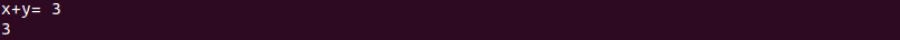

Pay attention, in Python, there can be multiple return values in one function as the picture below shown.

```python
# function definition
def calculate(x,y):
    print('x+y=',x+y)
    print('x*y=',x*y)
    return x + y,x * y

#function calling
a,b = calculate(y=1,x=2)
print(a,b)
```


There are two return values inside the **calculate()** function, including **“x+y”** and **“x*y”**. After this function is called, **“a”** and **“b”** variables will be assigned to these two return values. 

### 3.6.5 Function Passing

There are two types of function parameters, including mutable and immutable, whose calling results are different.

6.5.1 Mutable Parameter

The calling of mutable parameter is similar to pass-by-reference in C++. If the mutable parameter is passed, such as list and dictionary, modification of the passed in parameters inside the function will affect the external variables.
For example, after the passed in list **“list_01”** is changed inside **change_int()** function, the external variable will also be changed. 

```python
def change_int(list_01):
    list_01.append([1, 2, 3]) # change the passed-in list
    print("Modified variable inside function:", list_01)
    
list_01 = [10, 20, 30]
cjange_int(list_01)
print("Variable value outside function:", list_01)
```

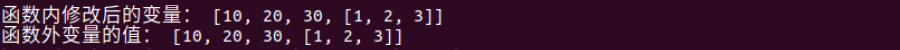

6.5.2 Immutable Parameter

Calling immutable parameters is similar to C++ pass-by-value. If immutable parameters are called, such as integer, string and tuple, the modification of the passed in parameter inside the function will not affect the external variable.

Take code below for example. The variable **"b"** points to the int object **"2"**.  When passed to the **unchange_int()** function, the variable "b" is copied by value, that is, the variable **"a"** and the variable **"b"** both point to the same int object **"2"** .

However, when execute **“a = 10”**, variable **“a”** points to newly generated int object **“10”**. Therefore, the external variable doesn’t change, and the printed value is **“2”**.

```python
def unchange_int(a):
    a = 10
b = 2
unchange_int(b)
print(b)
```


### 3.6.6 Parameter Type 

6.6.1 Positional Parameter

When calling function, each argument is associated with the corresponding parameter in positional order, and this association is called a positional parameter.  
Take the code below for example. When calling **describe_student()** function, name and age parameters should be offered in sequence. **“Jack”** and “18” are respectively stored in “person_name” and “student_age”. 

```python
def describe_student(person_name,student_age):
    print("My name is ",person_name)
    print(person_name + "is " + student_age + "years old")

describe_student('Jack', '18')
```

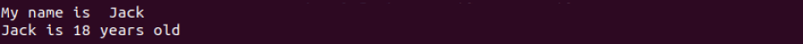

6.6.2 Default Parameter

When defining functions, we can specify the default value of each parameter. When calling function, if arguments are provided to parameters, adopt the designated argument. Otherwise, the default value of parameter should be adopted.  
For example, set the default value of **“student_age”** parameter as **“18”**. When argument is offered to **“student_age”** parameter during calling describe_student() function, adopt the designated argument. And the designated argument of this example is **“20”**.

```python
def describe_student(person_name,student_age='18'):
    print("My name is ",person_name)
    print(person_name + "is " + student_age + "years old")

describe_student('Jack', '20')
describe_student('Jack')
```

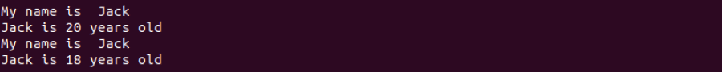

6.6.3 Variable-length Parameter

In Python, function can also be defined as variable-length parameter which is also called mutable parameter. By adding “*” in front of the identifier, the corresponding parameter can be defined as variable-length parameter.  
Take the codes below for example. After parameter “number” is defined as variable-length parameter, the called calculate() function can be directly used even though the passed in parameters are neither list nor tuple.

```python
def calculate(*numbers):
    sum = 0
    for n in numbers:
        sum = sum + n
    return sum

print(calculate(1, 2, 3, 4))
print(calculate())
```

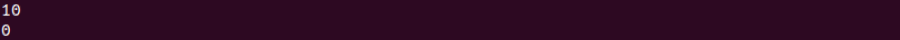

6.6.4 Keyword Parameter

Keyword parameter will be passed by **“parameter name-value”** pair. In this way, when designating the argument of function, the position of argument and parameter can be different and we just need to ensure the parameter name is correct. 
Check the code below. When passing the parameter, the function can output normally though the parameter order is adjusted. 

```python
def describe_student(person_name,student_age):
    print(person_name + "is " + student_age + "years old")

    describe_student(person_name+'Jack',student_age='18')
    describe_student(student_age='20',person_name='Mike')
```

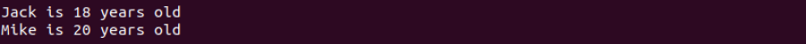

6.6.5 Named Keyword Argument

Named keyword arguments can be used when it is necessary to restrict parameters to be passed only by keyword. In user-defined function, parameters are separated by “*” and the parameters following “*” are named keyword parameter.  
Take the codes below for example. **“live_city” following** “*” is named keyword parameter. Therefore, the parameters must be passed by keyword, otherwise the program will throw error.  

```python
def describe_student(person_name, student_age, *, live_city):
    print("Name: " + person_name)
    print("Age: " + student_age)
    print("City: " + live_city)
    
describe student('Jack', '18', live_city='Guangzhou')
```

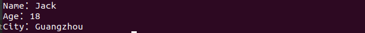

:::{Note}
 In Python, the parameters should be defined in order that is positional parameter, default parameter, mutable parameter, named keyword parameter and keyword parameter. 
:::

### 3.6.7 Module Introduction

In general, module is a file suffixed by “.py”. In addition, there is other file type of module, such as “.pyo”, “.pyc”, “.pyd”, “.so” and “.dll”. If you are Python novice, you can skip these types. 
Package the code that can realize specific function as an independent module, which is convenient for other programs and scripts to be imported and used, and avoid the function name from overlapping the variable name. Modules comes from three channels. 

(1)  Python built-in modules (standard library)

(2) the third-party module 

(3) User-defined module

When you need to call the function of a module, import this module through import statement before calling the function. There are two ways to import the module. (content inside the square parenthesis can be omitted)

(1) import module name [ as alias]

All members of the designated module will be imported when we use the import statement in this syntax. When you need to use the members of the module, this module name should be used as the prefix of the member name.

(2) from module name import member name[ as alias]

When the import statement in this syntax is adopted, only the designated member of the module will be imported but not all members. At the same time, when this member is used in the program, there is no need to add any prefix to the member name. 

:::{Note}
“from module name import *” can also be used to import all the members of the designated members, but it is not recommended to use this. 
:::

## 3.7 Python Container Type and Related Operation

### 3.7.1 Container Introduction

Object is the abstract of data in Python. All the data in Python program is represented by object or the relationship between objects. A Container is an object that contains the references to other objects, such as Tuple, List, Dictionary, etc. These referenced objects compose the object value of the container.
There are two common types of containers, including sequence (List, Tuple, etc.) and map (Dictionary). In sequence, each element has subscript and they are organized. In map, each element has its name (key), and they are unordered. Apart from sequence and map, **“Set”** is also a container.

### 3.7.2 Container Introduction 

 **3.7.2.1 List**

(1)  Syntax: [ 123 , "456" , classObjectA , [123,"456"] ]

(2)  Format: list is surrounded by square bracket and its elements are separated by comma. The type of the elements is diverse, and they can be nested, and read and written by subscript.

(3)  Feature: There is no unified type of the elements in List, and they can be added, deleted, modified and searched. We can delete (pop) the elements based on subscript, remove elements based on value, insert elements into some position and append the elements to the end of List.  

```python
list1 = [123, "123", [123, 456]]
```

 **3.7.2.2 Tuple**

(1) Syntax：（123，456，789，100）。Syntax: (123，456，789，100) 

(2) Format: surrounded by bracket and the elements are separated by comma. The elements can be nested, but the type of elements must be unified. They can be read by subscript, but cannot be written, added or deleted. 

(3) Feature: it is considered as immutable list and all the operations on it are similar to List. The only difference is that Tuple can only be searched. It cannot be added(append and insert), delete(remove and pop) and modify (assign value to elements). In other words, Tuple is a list whose elements should be unified and immutable, and content can only be read.

```python
tuple1 = (123, 456, 789)
```

 **3.7.2.3 Set**

(1) Syntax: { 1，"23"，classObjectA } 

(2)Format: it is surrounded by curly bracket. Its elements are separated by comma. The type of the elements is diverse, and they can be nested, and read and written by subscript

(3) Feature: apart from automatic deduplication and not supporting sorting, others are the same as list.


```python
set1 = {123, "123"}
```

**3.7.2.4 Dictionary** 

(1) Syntax：`{"name": "zhangsan", "age": 50}`

(2) Format: it is surrounded by curly bracket and the elements are separated by comma. The elements should be in unified format (When the elements are separated by semicolon, the front part should be string and the latter part can be any types.) and Key must be string.  If there is no semicolon within some element, dictionary will be considered as Set.

(3) Feature:dictionary is the most flexible container. It doesn’t support sorting, but support nesting. Access the elements through [ ] and get and the elements cannot use subscript. Delete the elements by pop key. (without remove)

```python
dict1 = {"123":123, "456":"abc", {"qwe":789}}
```

### 3.7.3 **Basic Operation of Container**

 **3.7.3.1 Basic Operation of List**

<table class="docutils-nobg" border="1">
    <thead><tr><th>Type</th><th>Keyword/ function/ method</th><th>Meaning</th></tr></thead>
    <tbody>
    	<tr><td rowspan="2">Add</td><td>append()</td><td>Append elements to the end</td></tr>
        <tr><td>insert()</td><td>Insert the data into the designated position</td></tr>
        <tr><td rowspan="4">Delete</td><td>clear()</td><td>Clear the list</td></tr>
        <tr><td>pop()</td><td>Pop up the data at the end by default</td></tr>
        <tr><td>pop(index)</td><td>Pop up the designated index data</td></tr>
        <tr><td>remove(data)</td><td>Remove the designated data</td></tr>
        <tr><td>Modify</td><td>extend(list 2)</td><td>Add the data of list 2 to the end of the current list</td></tr>
        <tr><td rowspan="2">Check</td><td>count(data)</td><td>Count the frequency of occurrence of the data</td></tr>
        <tr><td>index(content)</td><td>Check the position of the content</td></tr>
        <tr><td rowspan="3">Other</td><td>copy()</td><td>Copy a piece of list</td></tr>
        <tr><td>sort()</td><td>sort</td></tr>
        <tr><td>reverse()</td><td>Reverse the list</td></tr>
    </tbody>
</table>

(1) append：Add the elements to the end of the list

(2) insert：Insert the elements into the designated position.

(3) pop：Pop up the last element. And you can also specify the position of the pop-up element

(4) remove：Delete the designated elements

```python
list1 = [1, 2, 3, 4, 5, 6, 7]
list1.append(10)
print(list1)
list1.insert(2, 3)
print(list1)
list1.pop(0)
print(list1)
list1.remove(7)
print(list1)
```

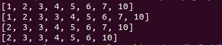

(5) index：Check the position of the designated elements

(6) sort：Sort the content in ascending order, or in descending order.

```python
list1 = [1, 7, 3, 8, 5, 9, 4]
print(list1.index(4))
list1.sort()
print(list1)
```


 **3.7.3.2 Basic Operation of Tuple**

The operations on tuple are similar to those on list, but they are still different.

(1) Tuple doesn’t have append(), extend(), insert(), etc., therefore we cannot add element to the tuple. 

(2) remove() and pop() are also not contained, hence we cannot delete elements from the tuple.

 **3.7.3.3 Basic Operation of Container**

<table class="docutils-nobg" border="1">
    <thead><tr><th>Method</th><th>Usage</th></tr></thead>
    <tbody>
        <tr><td>get(key,default=None)</td><td>Return the value of designated keys. If the value cannot be find in the dictionary, default value will be returned.</td></tr>
        <tr><td>keys()</td><td>Return all the keys of a dictionary as list</td></tr>
        <tr><td>values()</td><td>Return all the values of the dictionary as list</td></tr>
        <tr><td>update(dict2)</td><td>Update the key or value of dictionary dict to dict</td></tr>
        <tr><td>items()</td><td>Return tuple data, keys or value, that can be traversed</td></tr>
    </tbody>
</table>

(1) get:Return the value of designated key

(2) keys:Return all the keys of the dictionary

(3) values:Return all the values of the dictionary

```python
dect1 = {"Monday":1, "Tuesday":2, "Wednesday":3, "Thursday":4, "Friday":5}
print(dict1.get("Monday"))
print(dict1.keys())
print(dict1.values())
```

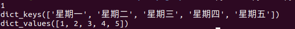

(4) Update：Update the existing key-value pairs or add new key-value pairs 

(5) items：Return an array of key-value tuples that can be traversed as a list  

```python
dict1 ={"Monday":1, "Tuesday":2, "Wednesday":3, "Thursday":4, "Friday":5}
dict2 = {"Saturday":6, "Sunday":7}
dict1.update(dict2)
print(dict1.items())
```

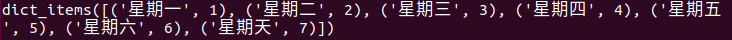

## 3.8 Python Class and File Operation

### 3.8.1 Object Oriented Programming

 Python is object-oriented advanced language where everything is considered as object. Object-oriented programming is to bound variable with data type, then classify and encapsulate so as to reduce repetitive codes. Object focuses on the encapsulation of functions and variables. However object-oriented focuses on who takes charge of encapsulation, and encapsulate multiple methods in an object based on the operator.

Two core definitions: classes and objects 

### 3.8.2 Class and Object Introduction**

**3.8.2.1 Class**

Class is used to describes the object sets with the same properties and methods. And it defines the properties and methods shared by all the objects of this set. Object is the instance of class.
For example, create a “cat” class, and define the name, color, age, etc., as well as the way to eat, drink, sound, etc. And instantiated object “ginger cat” will have these defined properties and methods. 

**3.8.2.2 Object**

An Object is an instance of a Class, which holds the properties and methods of class. In Python, all data types are considered as object, and objects can be user-defined. User-defined object data type is equal to class in object-oriented. 

### 3.8.3 Class Definition**

(1) Defined by class keywords, class name usually starts with capital letter. 

(2) _init_ function initializes class, which is equal to constructor. Whenever creating instance based on class, this function will be ran automatically in Python.  

(3)self function, implicit parameter and the object itself, is equivalent to this function.

(4) Properties correspond to member variables. 

```python
chass Cat():
    def __init__(self, name, age):
        self.name=name
        self.age=age
    def eat(self):
        print("Let's Eat!")
    def meow(self):
        print("MEOW~")
```

### 3.8.4 Instance Creating 

(1) Create the class name, and input the required properties. 

(2) These properties and methods can be called directly.


```python
my_cat = Cat("Tom", "6")
print("Name:" + my_cat.name + "Age:" + my_cat.age)
my_cat.eat()
my_cat.meow()
```


### 3.8.5 Property of Class and Instance

(1) Instance property are defined within \__init__ of a class, and class property are defined outside \__init__ of a class. An instance of a class created outside the class can define its own properties.

(2) Personal variable: if don’t want the external to access some properties, we can start the property name with double subscripts (__). Therefore, these properties will not be accessed by original variable name, that is, they can not be called from an instance. 

### 3.8.6 Class Inheritance and Polymorphism 

(1) Inheritance: when creating a class, you can write the name of the parent class in parentheses, so that the properties and methods of the parent class are inherited to the child class. If the child class does not have an initialization method, the initialization method of the parent class will be called.

(2) Method rewriting: If the name, return type and parameter list of a method defined in a child class exactly match those of a method in the parent class, the method of child class rewrites that of parent class. 

(3) Polymorphism: the behaviors of multiple child classes derived from one parent class are different, which is called polymorphism. In other words, child class rewrite the methods of parent class to let it has methods different from the parent class. When child class have the same method as parent class, the priority will be given to the method of child class, that is, the child class overrides the parent class. 

```python
class Animal():
    def __init__(self, name, age):
        self.name = name
        self.age = age
    def eat(self):
        print("Let's Eat!")
class Cat(Animal):
    def eat(self):
        print("Eat Fish!")
class Mouse(Animal):
    def eat(self):
        print("Eat Cheese")
my_cat = Cat("Tom", "6")
print("Name:" + my_cat.name + "Age:" + my_cat.age)
my_cat.eat()
my_mouse = Mouse("Jerry", "5")
print("Name:" + my_mouse.name + "Age:" + my_mouse.age)
my_mouse.eat()
```


After execution, the instance of child class will automatically call the construction method of parent class, and the child class will override the parent class method with the same name.

### 3.8.7 File Concept and Storage Modes

A computer file represents data stored on persistent storage media such as hard drives, USB flash drives, external storage drives, and optical discs.

Files are stored on disk in binary format.

Text files and binary files:

- Text Files

- Readable using standard text editors

- Stored fundamentally as binary data

- Examples include Python source files

- Binary Files

- Structured for software processing rather than direct human reading

- Examples include image files, audio files, and video files

- Cannot be read directly with text editors

### 3.8.8 File and File Path 

(1) Two key properties: “file name” and “path”

(2)  Absolute path and relative path: **“Absolute Path”** always starts with root folder. **“Relative Path”** corresponds to the current working directory of the program. For example, the relative path of **“test.py”** file under the current working directory is **“/test.py”** and its absolute path is **“python/scripts/test.py”.**

(3) (.) and (..) folder: Not real folders, they are the special name that can be used in the path. When a single period (".") is used as a folder directory name, it is an abbreviation for this directory. Two periods ("..") mean the parent folder.

### 3.8.9 File Reading Operation 

(1) Open and close file: call open function to pass in file name and identifier. Open file to return a file object, and then call close() method of File object to close this file. “with” statement can also be used to close the file automatically when ending.

(2) File reading: call read function to read the file content to the object. Use readline function to read one line at a time or read all lines at a time, and save them in one list.

(3) File writing：When opening a file, you can add designation parameters: read mode ("r"), write mode ("w") [write from the beginning], append mode ("a") [write at the end of the file], read at the same time and write the mode of file ("r+"). You can also write directly.  

```python
filename = 'num.txt'
with open(filename, 'r+') as file_object:
    file_object.write("Hiwonder")
file_object = open(filename, 'r')
lines = file_object.readlines()
print(lines[0])
```

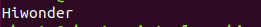

After execution, the first line of data just written will be read.

## 3.9 Python Exception Handling

### 3.9.1 Exception and Error

Program error refers to syntax error (wrong command) and logic error (wrong result of program execution), while program exception is an accidence taking place during program execution and affecting the normal execution of the program. For example, the file to be opened doesn’t exist, dividend is 0, wrong data type of the operation, storage error, internet request error.

In normal case, exception occurs when the program cannot be processed normally in Python. Exception is the Python object representing a error. When there is exception in Python script, we need to catch and handle it, otherwise the program will stop execution.

### 3.9.2 Common Types of Exception 

- **NameError**：Try to access a variable without statement

- **ZeroDivisionError**：The dividend is 0

- **SyntaxError**：Wrong syntax

- **IndexError**：Index exceed the range of sequence

- **KeyError**：Request a dictionary keyword that does not exist 

- **IOError**：Input and output error

- **AttributeError**：Attempt to access unknown object property

- **ValueError**：The parameter type passed to the function is correct

  

9.2.1 Exception Handling 

Exceptions may be thrown while the code is being interpreted and executed, and exceptions can be handled in a **try....except...** way. If an exception occurs in the code in **try**, it will jump to **except** to catch and handle the exception.

```python
try:
    print('try...')
    r = 10 / int('2')
    print('result:', r)
except ValueError as e:
    print('ValueError:', e)
except ZeroDivisionError as e:
    print('ZeroDivisionError', e)
else:
    print('no error!')
finally:
    print('finelly...')
print('END')
```


(1) The try code block is the code where an exception may occur

(2) Behind except are the exception type may occur and the handling content.

(3) except has several branches. If the exception occurs in and matches the first except, it will exit. If the exception class has a child class and a parent class, and the parent class exception is in front, the subsequent child class exceptions will not be matched.

(4) else statement will be executed when there is no exception.

(5) finally statement will be executed no matter there is exception or not.

## 3.10 Python Built-in Function

### 3.10.1 Built-in Function Definition 

Python compiler is a program that provides users with common functions with unique names. And these common functions are built-in functions. 

Built-in function is one part of compiler and takes effect as compiler starts. Standard library function is the external expansion of the compiler, and takes effect after the module is imported. In general, the execution efficiency of built-in function is higher than that of standard library function.

The amount of built-in functions must be strictly controlled, otherwise Python compiler will be “overstaffed”. Generally speaking, only the functions that are frequently used and are tightly bound to the language itself will be promoted as built-in function. 

### 3.10.2 Built-in Function List 

<table class="docutils-nobg" border="1">
    <tbody>
    	<tr><td>abs()</td><td>delattr()</td><td>hash()</td><td>memoryview()</td><td>set()</td></tr>
        <tr><td>all()</td><td>dict()</td><td>help()</td><td>min()</td><td>setattr()</td></tr>
        <tr><td>any()</td><td>dir()</td><td>hex()</td><td>next()</td><td>slicea()</td></tr>
        <tr><td>ascii()</td><td>divmod()</td><td>id()</td><td>boject()</td><td>sorted()</td></tr>
        <tr><td>bin()</td><td>enumerate()</td><td>input()</td><td>oct()</td><td>staticmethod()</td></tr>
        <tr><td>bool()</td><td>eval()</td><td>int()</td><td>open()</td><td>str()</td></tr>
        <tr><td>breakpoint()</td><td>exec()</td><td>isinstance()</td><td>ord()</td><td>sum()</td></tr>
        <tr><td>bytearray()</td><td>fillter()</td><td>issubclass()</td><td>pow()</td><td>super()</td></tr>
        <tr><td>bytes()</td><td>float()</td><td>iter()</td><td>print()</td><td>tuple()</td></tr>
        <tr><td>callable()</td><td>format()</td><td>len()</td><td>property(0</td><td>type()</td></tr>
        <tr><td>chr()</td><td>frozenset()</td><td>list()</td><td>range()</td><td>vars()</td></tr>
        <tr><td>classmethod()</td><td>getattr()</td><td>locals()</td><td>repr()</td><td>zip()</td></tr>
        <tr><td>compile()</td><td>globals()</td><td>map()</td><td>reversed()</td><td>_import_()</td></tr>
        <tr><td>complex()</td><td>hasattr()</td><td>max()</td><td>round()</td><td></td></tr>
    </tbody>
</table>


**3.10.2.1 Operation Type**

(1) abs(x)：abs function is used to return the absolute value of a value. The input x parameter can be the floating point number of the integer, and also can be complex number。

(2) max(x，key=None)：The parameter x of the max function is an iterable object or multiple parameters, and max function will return the maximum element among them. max function can return the maximum value through designating the key parameter. If there are multiple maximum values, the first value will be returned.。

(3)min(x,key=None)：The usage of min function is the same as that of max function. min function will return the minimum value of  an iterable object or multiple parameters. 

```python
print(abs(-46))
print(max(2, 3, 4, 5))
print(min(2, 3, 4, 5))
```

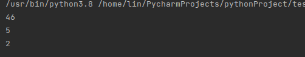

(4)pow(x,y, mod): When pow function only has x and y parameters, its function is to return x to the y power. When the third parameter mod exits, the pow function takes the remainder of mod on the basis of x raised to the y power.

(5) round(number,ndigits)：Return the value of number rounded to ndigits of precision after the decimal point. If ndigits is omitted, the integer closest to the number is returned.

(6) sum(x, start=0): sum function is to sum the values in x from left to right. Then add the value of start, sum and return the total value.

(7) divmod(a, b): divmod function takes a and b as arguments, and return the quotient and remainder of a/b. 

```python
print(pow(2, 3))
print(round(1.234, 3))
print(sum(1, 2, 3, 4), 2)
print(divmod(5, 2))
```

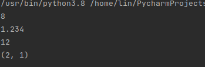

**3.10.2.2 Convert the Type**

- **int(x)**：If x is a number or string, the integer of x will be returned. If x is empty, 0 will be returned. 

- **float(x)**：If x is a number or string, the floating point number of x will be returned. If x is empty, 0 will be returned.

- **complex(real, imag)**：It will return the complex form of ***\*real + imag\*1j\****, or converts a string or number to the complex form. If the first parameter “real” is a string, the second parameter “***\*imag\****” should be omitted.

```python
print(int(2.3))
print(float(3))
print(complex(2, 3))
```

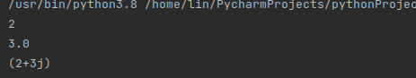

- **bool(x)**：Determine parameter x is true or false, and return **True** or **False.**

- **str(x)**：Convert the input x to string and return the result.

- **bytearray(x, encoding="utf-8")**：bytearray converts the input x to ordered and mutable array composed of bytes, and return the array.

- **bytes(x, encoding="utf-8")**：bytes convert the passed in parameter x to an immutable array of bytes, and return this array.

- **memoryview(x)**：it returns the memory view object of the parameter x, and the memory view object allows the data that supports the buffer protocol to be packaged, and the returned object is a list of tuples. Note: the incoming parameter x must be bytes.

```python
# bool function
print(bool(3 > 4))
print(bool("2" == "2"))
# str function
print(str(3.45))
print(str[3, 4])
# bytearray function
print(bytearray("python", encoding="utf-8"))
# bytes function
print(bytes("python", encoding="utf-8"))
# memoryview function
print(memoryview(bytes(123)))
```

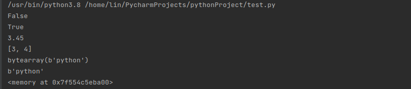

**3.10.2.3 Base Conversion**

- **bin(x)**：Convert the input integer x to a binary string prefixed with "0b"

- **oct(x)**：Convert the input integer x to an octal string prefixed with "0o"

- **hex(x)**：Convert the input integer x to a hexadecimal string prefixed with "0x".

- **ord(x)**：For the input single Unicode character, its corresponding Unicode integer will be returned.

- **chr(x)**：The chr function is the inverse of the ord function, and is used to return the corresponding single Unicode character for the input integer x.


```python
# bin function
print(bin(3))
# oct function
print(oct(3))
# hex function
print(hex(3))
# ord function
print(ord('c'))
# chr function
print(chr(99))
```


**3.10.2.4 Numerical Operations**

- **list(x)**：list function changes the incoming parameters to a new list and returns it. In addition, the list itself is also a mutable object.

- **dict(x)**：dict function changes the incoming parameter x into a new dictionary object and returns it. The dictionary object is immutable.

- **set(x)**：set function is used to change the input parameter x to a new collection object and return it. The set object is mutable, and its internal elements are not repeatable.

- **frozenset(x)**：frozenset function can also complete the function of the set function, but the frozenset object is immutable. Therefore it is not possible to insert values into the frozenset object.

```python
# list function
print(list("1234"))
print(list())
# dict function
print(dict(a=2, b=4))
print(dict())
# set function
print(set())
set1 = set([1, 2, 3, 4, 1, 2, 3, 4])
print(set1)
set1.add(5)
print(set1)
# frozenset function
forzenset1 = frozenset([1, 2, 3, 4, 1, 2, 3, 41])
print(frozenset1)
```


- **tuple(x)**：tuple function changes the incoming parameter x into a new tuple object and returns it. The tuple object is immutable.

- **enumerate(x)**：6)It returns an enumeration object, and the input parameter x is an iterable object. Through __next__(), the returned enumeration object returns a tuple containing the count value and the value in x obtained by iteration.

- **range(x)**：The range function generates an immutable sequence of numbers from an input x, typically used to loop a specified number of times in a for loop

- **iter(x)**： The iter function generates an iterable object based on the input parameter x and returns the iterable object.

```python
# tuple function
print(tuple([1, 2, 3, 4]))
print(tuple())
# enumerate function
for index, value in envmerate("abed"):
    print(index, ":", value)
# range function
print(range(10))
print(range(0, 10, 2))
# iter function
iter1 = iter([1, 2, 4, 5])
for i in range(3):
    print(next(iter1))
```


- **slice(x)**：The slice function is mainly used as flexible constructed slices, and it also returns a slice object.

- **object()**：In Python, the object class is the base of all classes. The object function does not accept any parameters and returns an object without any characteristics.

- **super()**：The super function is often used in Python class objects. In the inheritance of child classes from the parent class, the child class is used to refer to the objects and methods in the parent class without explicitly specifying the name of the parent class.

```python
# slice function
print(slice(5))
print(slice(0, 5, 2))
# object function
print(object())

# super function
class A:
    def __init__(self):
        self.fathername = "A"

class B(A):
    def __init__(self):
        super().__init__()
        self.sonname = "B"
        
print(B().fathername)
print(B().sonname)
```

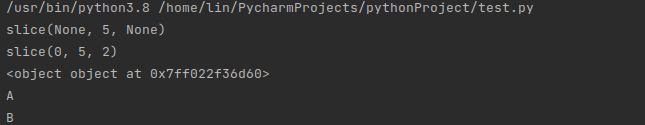

**3.10.2.5 Sorting Operation** 

- **sorted(x, key=None, reverse=False)**：Sort the iterable object x and return a new sorted object. The key parameter can specify how to compare, and when reverse is True, it indicates sorting in descending order.

- **reversed(seq )**：Reverse the input sequence seq to generate a new iterable object and return.

```python
# sorted function
print(sorted([1, 3, 6, 4, 7, 2]))
print(sorted([1, 3, 6, 4, 7, 2]), reverse=True)
print(sorted({"a":3, "b":6, "c":11}.itens(), key=lambda x: x[1]))

# revered function
print(list(reversed([1, 2, 3, 4, 5, 6])))
print(list(reversed("abcd")))
```

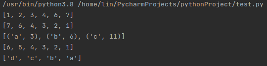

**3.10.2.6 Sequence Operation** 

- **all(x)**：Determine whether each element of the iterable object x is true, and if one element is False (0), return False.

- **any(x)**：Same as the all function, the any function determines whether each element in x(iterable object) is True, and returns True as long as one element is True.

- **map(func, iter)**：The map function returns an iterator in which the func function will be applied to each element in the iterable object iter

- **filter(func, iter)**：Filter the element values in the iterable object iter through the func function, and return a new iterator composed of the filtered elements.

- **next(iter)**：The next function returns the next element in the iterable object.

```python
# all function
print(all([i > 2 for i in [1, 2, 3, 4, 5]]))
# any function
print(any([i > 2 for i in [1, 2, 3, 4, 5]]))

# map function
def func(x):
    return x > 3

print(map(func, [1, 2, 3, 4, 5]))
for i in map(func, [1, 2, 3, 4, 5]):
    print(i, end=' )t')
    
# filter function
print(filter(func, [1, 2, 3, 4, 5]))
for i in filter(func, [1, 2, 3, 4, 5]):
    print(i, end=' It')
    
# next function
iterl = iter([1, 2, 3])
for i in range(3):
    print(next(iterl), end=' It')
```


- **zip(\*iter)**：According to multiple different iterators, the aggregation of elements in corresponding position is performed, and a new iterator is returned.

```python
# zip function
for a, b in zip([1, 2, 3, 4, 5], "abcde"):
    print(a, b)
```

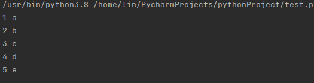

- **reduce(func,sequence\[,initial\])**：The two-argument function func is applied iteratively to each element in the sequence seq from left to right, and finally returns a single value as the result. It is a built-in function in Python2.x, and in Python3.x, you need to import the reduce function from functools first.

```python
import functools
def add(x, y):
    # Add two numbers
    return x + y
sum1 = functools.reduce(add, [1, 2, 3, 4, 5]) # Sum the lists：1+2+3+4+5
sum2 = functools.reduce(lambda x, y: x + y, [1, 2, 3, 4, 5]) 
print(sum1)
print(sum2)
```

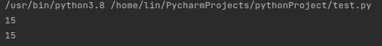

**3.10.2.7 Object Element Operation**  

- **help(object)**：The help function can help users to query the information of different objects, including built-in methods, properties and other information.

- **id(object)**：2)Returns the identity value of the object, which is an integer and remains unique in the object's life cycle.

```python
help function
help(int)
```

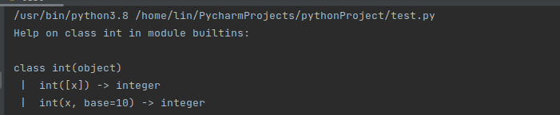

```python
# id function
num = 10
print(id(num))
```

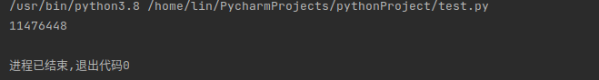

- **hash(object)**：If the object has a corresponding hash value, the corresponding hash value is returned.

- **type(object)**：The type function is used to return the type of the object.

- **dir(object)**：If there is no argument object, the dir function returns a list of names in the current local scope. If there is an argument object, the function attempts to return a list of valid properties for that object

- **len(object)**：Return the length of the object or the number of elements it contains.

```python
# hash function
print(hash("python"))
# type function
str1 = "python"
list1 = [1, 2]
print(type(str1))
print(type(list1))
# dir function
list2 = [1, 2, 3, 4]
str2 = "ererdfff"
print(len(list2))
print(len(str2))
```

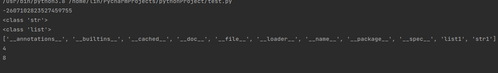

- **repr(object)**：The repr function returns a string containing a printable representation of an object.

- **ascii(object)**：The ascii function is similar to the repr function, the ascii function returns a string containing a printable representation of an object. However unlike the repr function, ascii() escape non-ASCII encoded characters.

- **format(value, format_spec)**：10)The function returns objects with a _dict__ attribute, such as modules, classes, instances, etc.

- **vars(object)**：The function returns objects with a _dict__ attribute, such as modules, classes, instances, etc.

```python
# repr function
print(repr([1, 2, 3, 4]))
print(repr("python"))
# ascii function
print(ascii([1, 2, 3, 4]))
print(ascii("python"))
print("python ()".format(123))
# Output in octal 123
print(format(123, 'o'))
# Output in hexadecimal
print(format(123, 'x'))

# vars function
class A:
    def _init_(self):
        self.name = "python"
        self.age = 10
       
print(vars(A()))
```


**3.10.2.8 Property Operation**

- **isinstance(object, classinfo)**：The function is used to determine whether the object belongs to the type of classinfo, if it is, it returns True, otherwise it returns False

- **issubclass(class, classinfo)**：If class is a child class of classinfo class, the function returns True, otherwise it returns False.

```python
# isinstance function
print(isinstance("python", str))
print(isinstance("python", int))

# issubclassa function
class A:
    def init_(self):
        pass
    
class B(A):
    def _init(self):
        pass
    
print(issubclass(B, A))
print(issubclass(int, object))
```


- **hasattr(object, name)**：Return True if the name string is the name of one of the properties of the object object, False otherwise.

- **getattr(object, name)**：Return the value of the named property of the object. name must be a string. If the string name is one of the properties of the object, the value of that property is returned.

- **setattr(object, name, value)**：The string name refers to an existing property or a new property of the object. As long as the setattr operation is allowed by the object, the function will assign the value to the attribute.

- **delattr(object, name)**：The string name must be the name of an property of the object. If the deleting property is allowed by object, the delattr function will delete the specified name property.

- **\_\_import(name)\_\_**：import modules dynamically

- **callable(object)**：If object can be called, True will be returned, otherwise False.

```python
# hasattr, getattr, setattr, delattr function
class A:
    def __init__(self)：
    	self.name = "python"
        self.age = 10
        self.sex = "male"
        
myclass = A()
print(hasattr(myclass, "name"))
print(getattr(myclass, "age"))
setarrt(myclass, "num", 12345)
print(vars(myclass))
delattr(myclass, "name")
print(vars(myclass))
# __impot__ function
np = __import__("numpy")
print(np._version)
# callable function 
print(callable(A))
```

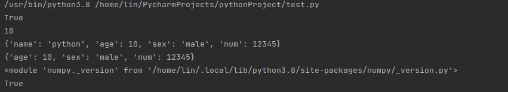

**3.10.2.9 Variable Operation** 

- **globals()**：Return a dictionary composed of global variables and their values in the scope

- **locals()**：Return a dictionary consisting of local variables and their values in the current scope.

```python
# globals function
print(globals())
```

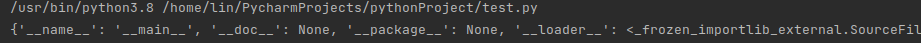

```python
# celocals function
def fune():
    local_varl = 123
    ocal_var2 = "python"
    print(locals())
    
fune()
```


**3.10.2.10 Human-computer Operation** 

- **print(\*objects, end='\n', file=sys.stdout)**：Print the contents of objects to the text stream specified by file, and end with end.

- **input()**：read the value input by user

- **open(file, mode='r')**：Open the file and return the corresponding file object, mode corresponds to the operation of reading or writing to the file. If the file cannot be opened, the program will throw OSError.

```python
# print function
print("python")
print(124)
#input function
input("Please enter a value：")
# open function
with open("a.txt", 'w') as fw:
    fw.write("python")
    fw.write("in")
with open("a.txt", 'r') as fr:
    print(fr.readlines())
```

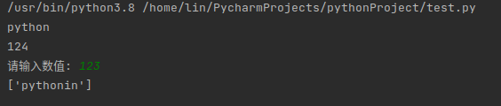

**3.10.2.11 Compilation Operation** 

- **compile(source,, mode)**：The function compiles the source into code which is then executed by the exec function or the eval function. The mode parameter indicates the mode adopted in compiling the code.

- **exec(object)**：The exec function supports dynamic execution of Python code, where object must be a string or a code object. If it is a string, the string will be parsed into a Python statement to execute, and if the two u fruit is coded, it will be executed directly.

- **eval(expression)**：The eval function evaluates the string expression as a valid expression and returns the result. The eval function can only evaluate a single expression, not complex code logic or assignment operation.

```python
# complie, exec function
str_code = "print ([i**2 for i in range (5) ])"
compilel = compile(str_code, '', mode="exec")
exec(compilel)
# eval function
print(eval("12*34+4"))
print(eval("float (200) "))
```

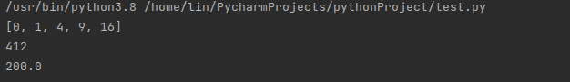

**3.10.2.12 Decorator Function**

- **classmethod()**：It is used to to encapsulate a method into a class method, and the method modified by the decorator can be called without creating a class object.

- **staticmethod()**：The staticmethod method is to convert the method in the class into a static method. The static method does not accept implicit parameters, and the static method can also be called without creating a class object.

- **property()**：As a decorator, property can convert class methods into class properties for use.

```python
class MyClass(object):
    district = "BeiJing"
    
   	def __init__(self, firstname="Joe", lastname="Harris"):
        self.firstname = firstname
        self.lastname = lastname
        self.age = 20
       
    # property, classmethod, staticmethod function
    @property
    def fullName(self):
        print("ful1Name: (). 1)").format(self.firstname, self.lastname)
       
    @classnethod
    def showDistrict(cls):
        print("I an in ".format(cls.district()))
       
    @staticmethod
    def showStaticmethod():
        print("this is showStaticmethod")
       
   
MyClass("hah", "lala").fullName
MyClass.showDistrict()
MyClass.showStaticmethod()
```


## 3.11 Python Multithreading

### 3.11.1 Process and Thread 

A process is the carrier to execute the program. A process is started whenever we open software and game, and execute Python script.

A thread is the smallest unit that performs operations in a process, and an entity in a process. It also is a basic unit that is independently scheduled and dispatched by the system. For example, the production in the workshop is a process, and each assembly line is one of its threads.

A thread does not have system resources, and only has a few resources that are essential for running.  However it can share all the resources owned by the process with other threads belonging to the same process. A thread can create and cancel another thread, and multiple threads in the same process can execute concurrently.

The process provides the pre-requirements for the thread to execute the program. And the thread executes the program with the reorganized resources. These two modules are commonly used in Python3 threads.

(1) _thread

(2) threading(recommend)

thread module has been abandoned, which can be replaced by threading. Therefore “thread” module cannot be used in Python3. For compatibility, thread is renamed as “_thread” by Python3.

### 3.11.2 Thread Object

```python
class threading.Thread(grounp=None, target=None, name=None, args={}, kwargs={})
```

- **group**：it should be None, and is reserved for ThreadGroup class extension in the future.   

- **target**：The object can be called by run(). It is set as None by default, which means that no method needs to be called.

- **name**：The thread name. By default, use the format of "Thread-N" to create a unique name, where N is a small decimal number.

- **args**：It is used to call the parameter tuple of the target function, () by default.

- **kwargs**：It is used to call dictionary of keyword parameters of the target function, {} by default.

### 3.11.3 Thread Method

<table class="docutils-nobg" border="1">
    <thead><tr><th>Method Name</th><th>Explanation</th><th>Usage</th></tr></thead>
    <tbody>
    	<tr><td>start</td><td>Start thread<br></td><td>start()</td></tr>
        <tr><td>run</td><td>Thread activity</td><td>run()</td></tr>
        <tr><td>join</td><td>Block until the thread execution ends. It blocks the thread calling this method until the thread that calls join() ends. No matter normal ending, unhandled exception or a timeout, the timeout is optional. Ensure to call is_alive() after Join() to determine if a timeout has occurred. if the thread is still alive, join() times out. And a thread can be join() many times.</td><td>join(timeout=None)</td></tr>
        <tr><td>getName</td><td>Obtain the name of the thread</td><td>getName()</td></tr>
        <tr><td>setName</td><td>Set the name of the thread</td><td>setName(name)</td></tr>
        <tr><td>is_alive</td><td>Judge whether the thread is alive or not</td><td>is_alive()</td></tr>
        <tr><td>setDaemon</td><td>Daemon the thread</td><td>setDaemon(True)</td></tr>
    </tbody>
</table>


### 3.11.4 **Create Thread Object**

**3.11.4.1 Thread Directly Create Thread** 

Pass a function object from the class constructor, which is the callback function used to handle the task.。

```python
from threading impport Thread

def task():
    print('i am sub_thread')
   
if __name__=='__main__':
    t = Thread(target=task)
    t.start()
    print('i an main-thread')
```

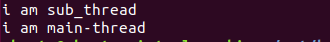

**3.11.4.2 Inherit Thread Class**

Write a custom class to inherit Thread, then rewrite the run() method, that is write the task processing code in it, and then create a child class of this Thread.

```python
from threading impport Thread

def task():
    print('i am sub_thread')
   
class MyThread(Thread):
    def run(self):
        task()
   
if __name__=='__main__':
    t = MyThread()
    t.start()
    print('i an main-thread')
```


### 3.11.5 Multithreading 

Multithreading is similar to workshop production where the efficiency of production can be improved by the simultaneous operation of several assembly lines. Create Thread objects and let them run. Each Thread object represents a thread. In each thread, the programs can handle different tasks, which is multi-threaded programming. 

For example, create 7 threads to execute tasks, and then call join method to wait for the thread execution to end, which is faster than a single main thread execution.

```python
import threading

def func(n):
    while n > 0:
        print("Number of current threads：",threading.activeCount())
        n -= 1
  
threads = []
for x in range(5):
    t = threading.Thread(target=func, args=(2,))
    threads.append(t)
    t.start()
   
for t in threads:
    t.join()
   
print("main thread：",threading.current_thread().name)
```

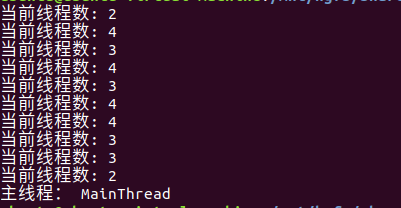

### 3.11.6 Thread Synchronization

Multiple threads modifying a data together will lead to unpredictable results. In order to ensure the accuracy of data, multiple threads need to be synchronized. Simple thread synchronization can be achieved by using the Lock and Rlock of the Thread object.

**3.11.6.1 LOCK**

- **acquire(blocking=True, timeout=-1)**：Puts the thread into a synchronously blocked state to acquire a lock. If the parameter blocking is set as True during calling, blocking will last until the lock is released, then lock the LOCK and return True. When the parameter blocking is set as False, no blocking will occur.

- **release()**：elease the lock. The lock must be acquired before using the thread, otherwise an exception will be thrown.

release() is only called under the locked state. It changes the state to unlocked and returns immediately. A RuntimeError exception will be triggered if an attempt is made to release a non-locking lock. For the Lock object, if a thread releases twice in a row, it will cause deadlock. Therefore, Lock is not commonly used, while Rlock is generally used to set thread locks.

```python
import threading

def job1():
    global A, lock
    lock.acquire()
    for i in range(10):
        A += 1
        print('job1', A)
    lock.release()
   
def job2():
    global A, lock
    lock.acquire()
    for i in range(10):
        A += 10
        print('job2', A)
    lock.release()
   
if __name__ == '__main__':
    lock = threading.Lock()
    A = 0
    t1 = threading.Thread(target=job1)
    t2 = threading.Thread(target=job2)
    t1.start()
    t2.start()
    t1.join()
    t2.join()
```


After execution, t1 first obtains the lock, and then releases the lock after the execution ends. t2 obtains the lock again, and continues to execute before releasing the lock, so as to avoid simultaneous processing and data errors.

**3.11.6.2 RLock**

- **acquire(blocking=True, timeout=-1)**：The lock can be acquired either blocking or non-blocking. When no parameter is called and if the thread already owns the lock, the recursion level is increased by one, and it returns immediately. Otherwise, if another thread owns the lock, block until the lock is unlocked.

​	Once the lock is unlocked (not owned by any thread), grab ownership, set the 	recursion level to one, and return. If multiple threads are blocked, wait for the 	lock to be unlocked and only one thread at a time can grab ownership of the 	lock. In this case, there is no return value.

- **release()**：Release the lock and decrement the recursion level. If it is reduced to zero, the lock is reset to the unlocked state (not owned by any thread). And, if other threads are blocked waiting for unlocking, only one of the threads is allowed to continue. If the recursion level is still non-zero after the decrement, the lock remains locked, still owned by the calling thread.

```python
import threading

lock = threading.RLock()

ret = lock.acquire()
print(ret)
ret = lock.acquire(timeout=3)
print(ret)
ret = lock.acquire(True)
print(ret)
ret = lock.acquire(False)
print(ret)

lock.release()
lock.release()
lock.release()
lock.release()
```


RLock (reentrant lock) is a synchronous instruction that can be requested multiple times by the same thread. RLock uses the concepts of "owned thread" and "recursion level". When in the locked state, RLock is owned by a thread. The thread that owns the RLock can call acquire() again, and call release() the same number of times when releasing the lock.

## 3.12 Usage of Python PiP

### 3.12.1 Brief Introduction

pip is a management tool for Python package offering searching, downloading, installing and uninstalling function. Most of packages are built-in or are installed by pip. Python 2.7.9 +, Python 3.4+ and other versions above come with pip tool.  

### 3.12.2 Download and Install

Open command line terminal, and then input “pip”. When the following message pops up, pip has been installed already. 

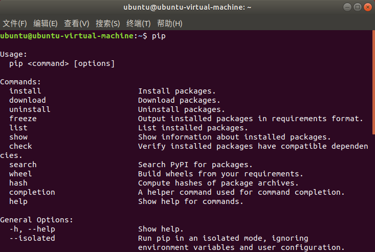

If pip is not installed, input command **“sudo apt install python-pip”** to install. After the command is executed, you will be required to input the password, and then select “y” to continue installation.

```py
sudo apt install python-pip
```

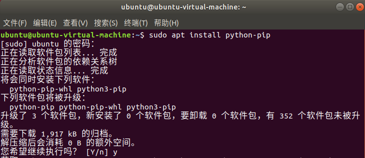

### 3.12.3 Common Command

(1) install: Install the command package, and the complete command is **“pip install packagename” 。**

```bash
pip3 install numpy
```

(2) uninstall: Uninstall the designated package, and the complete command is "**pip3 uninstall \<packagename\>**"。

```bash
pip3 uninstall numpy
```

(3) list: List the installed package, and the complete command is"**pip3 list**"。

```bash
pip3 list
```

(4) show: View the information about the installed packages, and the complete command is "**pip3 show \<packagename\>**"。

```bash
pip3 show numpy
```

## 3.13 Python Numpy Basic Operation

### 3.13.1 Brief Introduction

NumPy (Numerical Python) is an extension library of Python, which supports a large number of dimensional array and matrix operations, and also provides a large number of mathematical function libraries for array operations.。

(1) In some ways, Numpy arrays are greatly similar to built-in lists in Python. It is an essential tool for Python data science.

(2) A numpy one-dimensional array can be considered as a vector, and a two-dimensional array is a data frame (precisely corresponding to the matrix in R).

(3) The biggest difference between numpy arrays and lists in python is that the type of the data contained in the former should be the same, but there is no restriction on the latter.

### 3.13.2 Numpy Importing

Numpy is a third-party library that needs to be installed first. Open the command line terminal and enter the command to install **"pip install numpy"**.

```bash
pip3 install numpy
```

Then we need to import it in python with "import numpy". We can use "import numpy as np" to take "np" as an alias.

### 3.13.3 Create Array 

(1) np.array()：Create directly

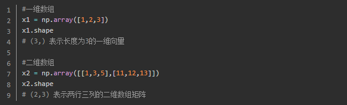

### 3.13.4 Take Fixed Value 

- **np.zeros(n, dtype=int)**：Create a one-dimensional array of integers of length n and all zeros

- **np.ones((a,b), dtype=float)**：Create a two-dimensional floating-point array with **“a”** row and **“b”** column, and all 1.

- **np.full((a,b),x, dtype=int/float)**：Create a two-dimensional array with **“a”** row and **“b”** column, and all **x**.


```python
np.full((3, 3), 1.11)
# array([1.11, 1.11, 1.11],
#		[1.11, 1.11, 1.11],
#		[1.11, 1.11, 1.11])
```

### 3.13.5 Regular Distribution 

- **np.arange()**：arithmetic progression

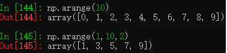

- **np.random.randint()**：Random integer


- **np.random.random(10)**：A one-dimensional array with a length of 10 and distributed uniformly from 0 to 1.

- **np.random.normal(0, 1, c(2,3))**：A two-dimensional array normally distributed with two rows and three columns, a mean of 0 and a standard deviation of 1.

### 3.13.6 **Take Subset**

**3.13.6.1 Index Starts from 0** 

(1) Similar to the way list takes subset in Python, the index of numpy array also starts from 0.

(2) The index of negative can be seen as the nth last value.

**3.13.6.2 Take Subset of Single Value** 

View with the element subscript.

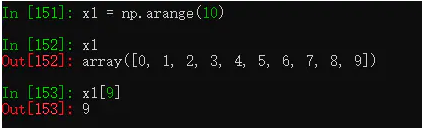

- #### 3.13.6.3 Slice Takes Subset

(1) For the one-dimensional array x1 of the length of 10, x1[0:5] represents the subset from index0 to index4, and the step size is 1 by default. 

(2) When a of [a​：b：​c] is 0, a can be omitted. When both a and b are omitted, it represents the complete set.

(3) When the step size is negative, it represents take subset in reversed order. 

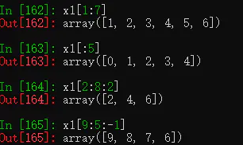

**3.13.6.4 Multiple Index of the List Take Subset** 

Take the subset in sequence according to the index.

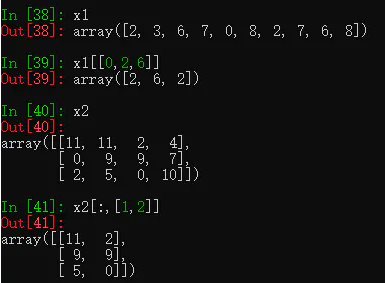

**3.13.6.5 Logical Boolean Takes Subset** 

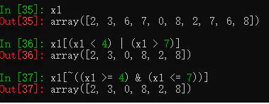

**3.13.6.6 Create Unrelated Subset Replicas** 

copy() can create unrelated subset replicas 


**3.13.6.7 Array Dimension Transforming** 

(1) Transpose matrix with T()：Transform row and column


(2) Transform dimension with reshaple(): transform the dimension according to your desire.


### 3.13.7 Arrays Merging and Splitting

**3.13.7.1 Array Merging**

(1) concatenate()： Connect two one-dimensional array or merge two two-dimensional arrays according to row and column. 

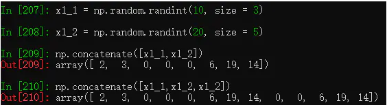

(2) vstack()：Merge two arrays vertically, as long as these two arrays have the same number of columns.


(3) hstack()：Merge two arrays horizontally, as long as these two arrays have the same number of rows.


**3.13.7.2 Split Array**

(1) split()：Split one-dimensional array. Where to split will be designated by the index of the parameter. When the function returns multiple objects, we need to set the corresponding numbers of object names in front of the equal sign. When the function result returns multiple objects, set the corresponding number of object names before the equal sign


(2) vsplit()：Split a two-dimensional array horizontally. And hsplit() splits a two-dimensional array vertically.

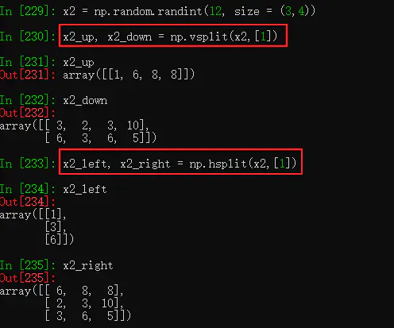
