# 5. OpenCV Computer Vision Lesson

## 5.1 Computer Vision and OpenCV Introduction

### 5.1.1 How robots “see” the world

For artificial intelligence, the ability to see is essential. And how robots see the world involves machine vision, an important branch of artificial intelligence.

Machine vision is the idea that the robot takes human’s place to measure and make judgments. The captured target will be converted into image signal by image sensor, CMOS or CCD, and then the image signal will be transferred to the specialized image processing system which will convert the image signal into digitized signal according to the pixel distribution, brightness, color, etc.

Image system perform various operations on these signals to extract the features of the target, so as to control the device in the field based on the judgments.

### 5.1.2 Common Applications of Machine Vision Technology

With advances in artificial intelligence and wireless technologies, machine vision has expanded across industrial manufacturing, agriculture, defense, medical care, aerospace, transportation, scientific research, and security. Common application domains are detailed below.

**1. Smart Transportation**

Urban traffic congestion requires rapid and effective monitoring. Machine vision applications in transportation systems continue to play a critical role.

For instance, the City Brain system utilizes machine vision and AI to process video feeds from traffic monitoring cameras and dynamically adjust traffic lights, reducing travel times on elevated highways and increasing average street speeds.

**2. Smart Home**

Machine vision applications in smart home environments enhance home appliances. Vision modules serve as core perception sensors to capture visual input.

Standard appliances operate via remote controllers or mobile apps. Integrating cameras and speech recognition components enables intelligent appliances to perceive visual cues and spoken commands.

For example, facial recognition entry systems integrate with indoor appliances to identify residents and visitors, automatically controlling access locks and home devices.

### 5.1.3 Image Recognition Introduction

Image recognition is a crucial technique that uses computer to process and analyze the image so as to recognize different targets.  

Similar to human eyes, machine image recognition starts at the point where there is huge variance or sudden change, and the features will recognized one by one. Our brain controls our eyes to collect the major features of the image and filter the redundant information, and then integrate the major features into the complete visual image. 

The process of computer image recognition is no different from that of human image recognition, which is divided into four steps.

(1) Acquire information: the light signal, sound signal, etc., are converted into electric signal by the sensors to acquire the information

(2) Image preprocessing: perform smoothing, denoising, etc., on the image to highlight the major features of the image.

(3) Feature extracting and selecting: extract and select the image features, which is the pivotal step.

(4) Image classification: make the recognition rules that is design classifier based on the training result to get the main category of the features so as to improve the recognition accuracy.

Image recognition is mostly applied in remote sensing image recognition and robot vision.

### 5.1.4 Common Applications of Image Recognition Technology

Image recognition technology holds a central position in artificial intelligence. Ongoing technical advances continue to expand its practical applications.

**1. Remote Sensing Image Recognition**

Aerial and satellite remote sensing images utilize image recognition algorithms to extract feature data. Primary applications include geological mapping, meteorological cloud analysis, and environmental monitoring.

**2. Robotics and Machine Vision**

Image processing constitutes a vital component of robotics technology. Widespread deployments include autonomous delivery vehicles, domestic service robots, robotic vacuum cleaners, and educational robotics platforms.

### 5.1.5 OpenCV Introduction

OpenCV (Open Source Capture Vision) is a computer vision library for free handling various tasks about image and video, for example display the image collected by the camera and make the robot recognize the real object.


OpenCV is more eminent than PIL, the built-in image processing library in Python. OpenCV provides complete Python interfaces, and Python3.5 and opencv-python library file have been integrated in the provided image system.

### 5.1.6 How Images are Stored in Computer

How the images are stored in computer after they are recognized?

In general, a picture is composed of pixels and each pixel can be represented by R, G and B components within 0-255. OpenCV stores each pixel as a ternary array making it convenient to record all information of the image. In addition, OpenCV records the data of three color channels of RGB image in the order of BGR.

Besides, images of other standards (HSV) are stored as multivariate array. An OpenCV image is a two-dimensional or three-dimensional array. An 8-bit grayscale image (black-and-white images) is a two-dimensional array, and a 24-bit BGR image is a three-dimensional array.   

For a BGR image, the first value of the element “**image[0,0,0]**” represents Y--axis coordinate or the row number(0 represents the top). The second value represents X-axis coordinate or column number (0 represents leftmost ). And the third value represents the color channel. 

Same as Python array, these array recording images can be accessed individually to obtain the data of some color channel or capture a region of the image.

## 5.2 Build OpenCV Environment

:::{Note]
All procedures in this document assume an official Ubuntu image installation. Prior mirror modifications such as Tsinghua or Alibaba repositories may cause OpenCV package installation failures.
:::

### 5.2.1 Install Numpy

Each picture involves several pixels, which results in that a large number of arrays need to be processed in the program. Numpy is a extension library for Python, which handles multi-dimensional arrays more efficiently than Python's native array structures. Besides, it can improve the readability of codes.

Open command line terminal and then input command “**pip install numpy**” to install Numpy. 

```bash
pip3 install numpy
```

### 5.2.2 Install OpenCV from Ubuntu Repository

OpenCV package can be obtained from Ubuntu repository. Then refresh the packages index and install the OpenCV package by typing the following commands.

(1) **sudo apt update:** refresh the packages index

```bash
sudo apt update
```

(2) **sudo apt install python3-opencv:** Install the package. During installation, input “y” to continue the execution and the complete installation may take 10s.

```bash
sudo apt install python3-opencv
```

### 5.2.3 Verify the Installation of OpenCV

We can import cv2 module to print the version of OpenCV so as to verify whether the installation is successful or not.

① python3: enter Python

② import cv2: import cv2 module

③ cv2.\__version__: check the version

If the version of OpenCV is printed, the installation is successful.

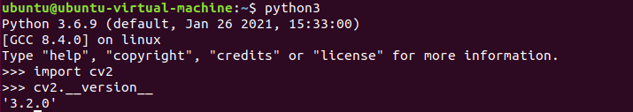

## 5.3 OpenCV Modules and Components

### 5.3.1 OpenCV Component

OpenCV is composed of several layers of modules.

(1) The bottom layer is the hardware optimization based on HAL (Hardware Acceleration Layer)

(2) Above the bottom layer are the codes contributed by other developers contained in opencv_contrib module. These codes, core of OpenCV, involves most of the high-level functionality.  

(3) The next layer are language bindings and sample applications.  

(4) The top layer is the interaction between OpenCV and operating system.

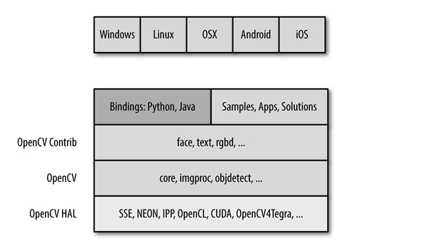

### 5.3.2 Specific Module of OpenCV

(1) Core: Contain the basic structure and operation of OpenCV library.

(2) Improc: Image processing module can transform the basic image, including filtering and convolution. 

(3) Highgui: Seen as lightweight Windows UI Toolkit, it is divided into imcodecs, videoio and highgui in OpenCV 3.0. It contains user-interaction function used to display the images or simple input.

(4) Video: Contain the functions for reading and writing the video streams.

(5) Calib3d: Contain the algorithm of the calibration of single, binocular and multiple cameras.  

(6) Feature2d: Used for the algorithm of feature point detection, description and matching.

(7) Objdectect: Contain the algorithm of specific target detection, including human face or passengers. And it can be used to train the  detector to detect other objects.

(8) Ml: Machine learning module is a comprehensive module that involves a mass of machine learning algorithms which can interact with OpenCV data type.  

(9) Flann: Flann stands for Fast Library for Approximate Nearest Neighbors, which will be called by the functions in other modules for fast nearest neighbor search in large datasets. 

(10) GPU: It is segmented into several cuda* modules in OpenCV. GPU module can optimize the functions on CUDA GPU and involves the functions only applicable to GPU. Without GPU, the computing resources cannot be promoted causing that some functions cannot return good results.  

(11) Photo: A new module that contains the functions of computational photography.  

(12) Stitching: Also a new module that stitches sophisticated images

(13) Nonfree: It is moved to opencv_contrib/xfeatures2d in OpenCV 3.0. There are some algorithms that is protected by patent and limited in usage in OpenCV, such as SIFT. These algorithms are isolated into their own modules, therefore you need to take special measures to use them in commercial products.

① Contrib: It involves something new that haven’t been integrated into OpenCV.  

② Legacy: It has been removed from OpenCV 3.0. This module contains some old stuffs that haven’t been completely removed. 

③ Ocl: Khronos OpenCL standard. It has been removed from OpenCV 3.0 and replaced by T-API. Similar to GPU module, it realizes Khronos OpenCL standard for open parallel programming.  

Compared with GPU module, it has fewer functions, but it aims at providing the parallel devices that can run on any GPU or is powered by Khronos. However, GPU module can only run on Nvidia GPU devices for the reason that it utilizes Nvidia CUDA toolkit to develop.

## 5.4 Picture & Video Loading and Display

### 5.4.1 Image Reading and Writing

Read image: cv2.imread(Location，Model)

(1) Location——read the location of the image which can be the absolute path and relative path. However pay attention to the usage of the slash in different operating system. 

(2) Model——model of image loading. The first model is cv2.IMREAD_COLOR used to load a color picture but will not load Alpha channel(record degree of transparency). The second one is cv2.IMREAD_GRAYSCALE which is used to load a grayscale picture. The third type is cv2.IMREAD_UNCHANGED for loading image and Alpha channel simultaneously.   

(3) Display image: cv2.imshow("Name", Pic)

(4) Name——Display the box name of the image

Pic——Pictures to be displayed(The image read by cv2.imread() has already used before) For example, create a new py file and put the picture named “**camera.png**” into the same folder. Then input the following codes. After the codes run, the image will be displayed and you can press any key to hide the image.

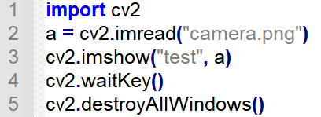

:::{Note}
cv2 waitkey() allows users to display a window for given milliseconds or until any key is pressed. And cv2.destroyALLWindows() function will close all the windows.
:::

### 5.4.2 Video Reading and Writing

Video can be seen as pictures that are switched swiftly. Therefore, video reading is the extension of the image reading and writing. Camera initialization: cv2.VideoCapture(Number) 

(1) Number——Serial number of camera, 0 usually. 

Read the frame of camera：cap.read()。 

(2) cap——the camera that has been defined before

Release the resources of the camera：cap.release()。

For example, the camera screen will be displayed on the desktop. When q key is pressed, the camera screen will be hidden.

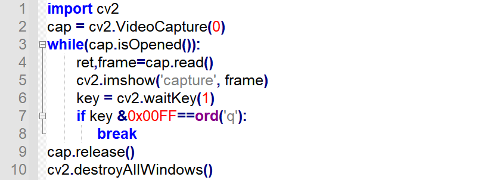

:::{Note}
cv2.waitKey(delay) will wait for the input from the keyboard and can be used to refresh the image in the video. “**delay**” in the bracket indicates the waiting time. When a frame of picture is displayed, the program will display the next frame in “delay” ms.
:::

### 5.4.3 Feature Demonstration

:::{Note}
Command entries are strictly case-sensitive and the Tab key can be pressed for keyword auto-completion.
:::

1. Connect to the Raspberry Pi remotely via VNC.

2. Move the cursor to the top center of the remote desktop window and click the transfer button highlighted in the red box.


3. Click the highlighted area to select files for transfer.


4. Open the "**Routine Code**" directory, select the required files, and click Open. VNC transfers the selected files to the Raspberry Pi desktop.

Routine names and corresponding functions:

Image Reading and Writing: show_test_1

Video Reading and Writing: show_test_2

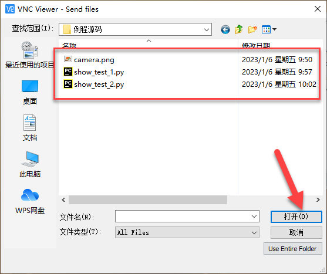

5. Open a terminal, enter "**cd Desktop**", and press Enter to navigate to the Desktop directory.

```bash
cd Desktop
```

6. Run the image reading routine by entering "**sudo python3 show_test_1.py**" and pressing Enter.

```bash
sudo python3 show_test_1.py
```

Upon execution, the imported image displays as shown below.

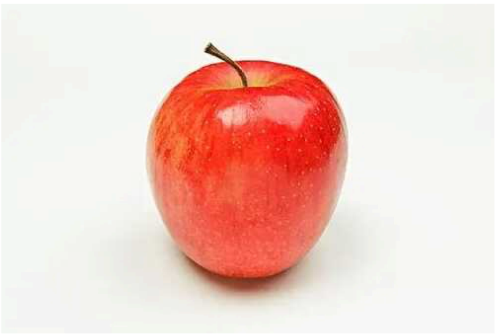

7. Run the video reading routine by entering "**sudo python3 show_test_2.py**" and pressing Enter.

```bash
sudo python3 show_test_2.py
```

The image below shows the live camera feed.

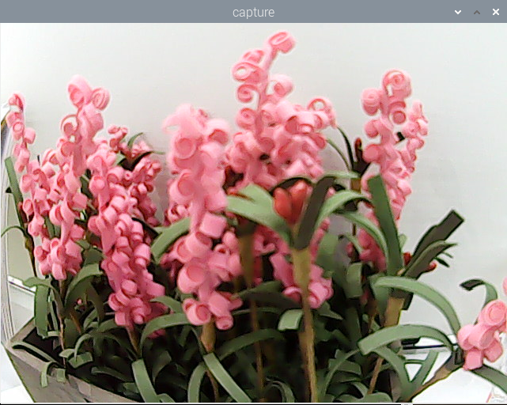

8. Select the terminal window and press Ctrl+C to terminate the program.

## 5.5 Image Drawing

Drawing function in OpenCV can be used to draw line, rectangle, circle, etc., and add texts to the designated position of the picture.

### 5.5.1 Draw Line

Function format: **cv2.line(image,pt1,pt2,color,thickness)** 

(1) Image: Image where the line will be drawn

(2) pt1: starting coordinate of the line. The coordinate is represented by a tuples consisting of two values i.e. (X,Y)

(3) pt2: ending coordinate of the line. The coordinate is represented by a tuples consisting of two values i.e. (X,Y).

(4) Color: The color of the line. And BGR is represented by a tuple. For example, (255, 0, 0) stands for blue. 

(5) Thickness: The thickness of the line

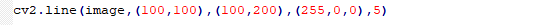

### 5.5.2 Draw Rectangle

Function format: **cv2.rectangle(image,pt1,pt2,color,thickness)** 

(1) image: The picture where the rectangle will be drawn

(2) pt1: vertex coordinate of the rectangle, (x,y), which is represented by a tuple consisting of two numbers.

(3) pt2: The diagonal vertex coordinates of pt1 and its format is similar to that of pt1.

(4) color: The color of the rectangle. And BGR is represented by a tuple. For example, (255, 0, 0) stands for blue. 

(5) thickness: Line thickness. The greater the value, the thicker the line. If the value is negative or cv2.FILLED, a filled rectangle will be drawn.

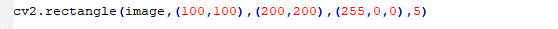

### 5.5.3 Draw Circle

Function format: **cv2.circle(image,center,radius,color,thickness)** 

(1) image: The picture where the circle will be drawn

(2) center: The center of the circle, (x,y), which is represented by a tuple consisting of two numbers. 

(3) radius: The radius of the circle. 

(4) color: The color of the circle. BGR is represented by a tuple. For example, (255, 0, 0) stands for blue. 

(5) thickness: Line thickness. The greater the value, the thicker the line. If the value is negative or cv2.FILLED, a filled circle will be drawn.

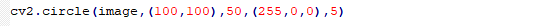

### 5.5.4 Draw Polygon

Function format: **cv2.polylines(image,pts,isClosed,color,thickness)**

(1) image: The picture where the polygon will be drawn

(2) pts: The vertex coordinate of the polygon. When several quadrangles are required in a picture, the shape of ndarray is (N，4，2). 

(3) isClosed: Whether the polygon is closed or not, True generally. 

(4) color: The color of the polygon. BGR is represented by a tuple. For example, (255, 0, 0) stands for blue.

(5) thickness: Line thickness. The greater the value, the thicker the line.

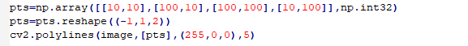

### 5.5.5 Add Text

Function format: **cv2.putText(image,text,pt,font,fontScale,color)** 

(1)  image: The image where the text is added.

(2) text: The text content

(3) pt: The coordinate of the upper left corner of the text 

(4) font: Font of the text

(5) fontScale: Font size 

(6) color: The color of the text. BGR is represented by a tuple. For example, (255, 0, 0) stands for blue.

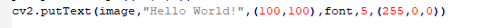

### 5.5.6 Feature Demonstration

:::{Note}
Command entries are strictly case-sensitive and the Tab key can be pressed for keyword auto-completion.
:::

1. Connect to the Raspberry Pi remotely via VNC.

2. Move the cursor to the top center of the remote desktop window and click the transfer button highlighted in the red box.


3. Click the highlighted area to select files for transfer.


4. Open the "**Routine Code**" directory, select the required files, and click Open. VNC transfers the selected files to the Raspberry Pi desktop.

Routine names and corresponding functions:

Draw Line: cv2_line

Draw Rectangle: cv2_rectangle

Draw Circle: cv2_circle

Draw Polygon: cv2_polylines

Draw Text: cv2_putText

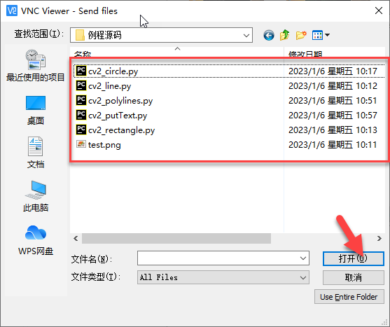

5. Start the virtual machine. Click the terminal icon  or press Ctrl+Alt+T to open a command line terminal.

6. Line drawing: Enter "**sudo python3 ./Desktop/cv2_line.py**" and press Enter to execute.

```bash
sudo python3 ./Desktop/cv2_line.py
```

Rectangle drawing: Enter "**sudo python3 ./Desktop/cv2_rectangle.py**" and press Enter to execute.

```bash
sudo python3 ./Desktop/cv2_rectangle.py
```

Circle drawing: Enter "**sudo python3 ./Desktop/cv2_circle.py**" and press Enter to execute.

```bash
sudo python3 ./Desktop/cv2_circle.py
```

Polygon drawing: Enter "**sudo python3 ./Desktop/cv2_polylines.py**" and press Enter to execute.

```bash
sudo python3 ./Desktop/cv2_polylines.py
```

Text drawing: Enter "**sudo python3 ./Desktop/cv2_putText.py**" and press Enter to execute.

```bash
sudo python3 ./Desktop/cv2_putText.py
```

7. Select the terminal window and press Ctrl+C to terminate the program.

## 5.6 Image Basic Operation

### 5.6.1 Acquire and Modify the Pixel of the Image

The value of the pixel can be acquired through the coordinate of row and column. For BGR image, an array consisting of blue, green and red values will be returned. For grayscale image, the corresponding intensity will be returned. And the pixel can be modified in this way. 

**(1) img[x,y]:** **Acquire the value of some pixel and return its BGR value.

**(2) img[x,y,index]:** **Acquire the value of a color channel. The order of the color channel is BGR. 

**(3) img[x,y]=[B,G,R]:** Modify the color channel value of this pixel.

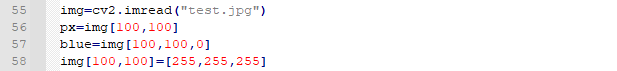

### 5.6.2 Acquire the Image Property

**(1) shape:** If it is a color picture, acquire the shape of the image and return an array containing the number of row, column and channel. If it is binary image or grayscale image, only the number of row and column will be returned. Through judging whether the returned value contains the number of channel, we can know that it is a grayscale picture or color picture.  

**(2) size:** Return the pixel number of the image. The format is “**row x column x channel**”. The number of channel of the grayscale picture is 1.

**(3) dtype:** Return the data type of the picture

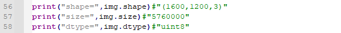

### 5.6.3 Splitting and Merging of Image Channel

**5.6.3.1 Splitting of Image Channel**

**split**：Input the image to be split and return the picture with three individual color channels.

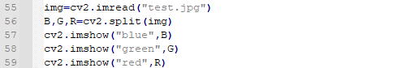

**5.6.3.2 Merging of Image Channel**

**merge**：Merge three individual channels, including B, G and R into BGR image with three channel.

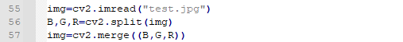

### 5.6.4 Color Space Conversion

There more than 150 ways to convert colors in OpenCV. And BGR is commonly converted into GRAY and HSV. The function format is **cvtColor(img,flag).** 

**(1) img:** The image converted the color space

**(2) flag:** The converted type. For example, **cv2.COLOR_BGR2HSV** indicates that convert BGR into HSV.

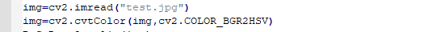

### 5.6.5 Feature Demonstration

:::{Note}
Command entries are strictly case-sensitive and the Tab key can be pressed for keyword auto-completion.
:::

1. Connect to the Raspberry Pi remotely via VNC.

2. Move the cursor to the top center of the remote desktop window and click the transfer button highlighted in the red box.


3. Click the highlighted area to select files for transfer.

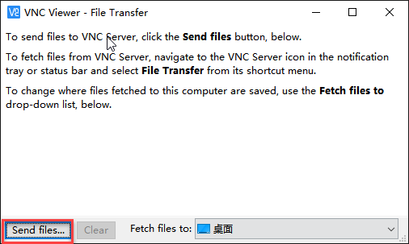

4. Open the "**Routine Code**" directory, select the required files, and click Open. VNC transfers the selected files to the Raspberry Pi desktop.

Routine names and corresponding functions:

Modify Pixel: cv2_pixel

Image Property: cv2_property

Channel Splitting: cv2_img_split

Channel Merging: cv2_img_merge

Color Space Conversion: cv2_Color_format

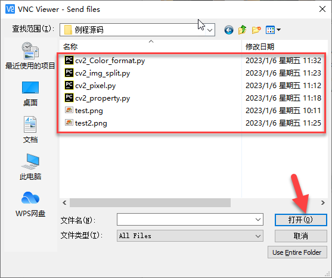

5. Start the system. Click the terminal icon  or press Ctrl+Alt+T to open a command terminal.

6. Modify pixel values: Enter "**sudo python3 ./Desktop/cv2_pixel.py**" and press Enter to execute.

```bash
sudo python3 ./Desktop/cv2_pixel.py
```

Image properties: Enter "**sudo python3 ./Desktop/cv2_property.py**" and press Enter to execute.

```bash
sudo python3 ./Desktop/cv2_property.py
```

Channel splitting: Enter "**sudo python3 ./Desktop/cv2_img_split.py**" and press Enter to execute.

```bash
sudo python3 ./Desktop/cv2_img_split.py
```

Channel merging: Enter "**sudo python3 ./Desktop/cv2_img_merge.py**" and press Enter to execute.

```bash
sudo python3 ./Desktop/cv2_img_merge.py
```

Color space conversion: Enter "**sudo python3 ./Desktop/cv2_Color_format.py**" and press Enter to execute.

```bash
sudo python3 ./Desktop/cv2_Color_format.py
```

7. Select the terminal window and press Ctrl+C to terminate the program.

## 5.7 Image Processing---Color Space Conversion

### 5.7.1 Color Space Introduction

Each frame of the picture is arranged by the pixels that are composed of three color components, including B, G and R.

Color model is also called color space which is a mathematical model using an array to describe color.

Besides the familiar RGB picture, there are other color spaces, including GRAY, Lab, XYZ, YCrCb, HSV, HLS, CIEL*a*b*, CIEL*u*v*, Bayer, etc.   

Expertise of each color space is different. Therefore, color space conversion can improve the efficiency of tackling a specific problem.  

Color space conversion refers to transform the image from one color space to another color space. For example, convert the picture from RGB to Lab. When extracting the feature of the picture, and calculating the distance, we usually covert the picture from RGB into gray color space. In some applications, it is necessary to convert the color space image into binary image.

Some common color spaces are listed below. 

### 5.7.2 Common Color Space

- #### 5.7.2.1 RGB Color Space

The properties of RGB color space are as follow.

(1) An RGB color space is an additive color space and the colors are obtained from linear combination of R(red), G(Green) and B(Blue). 

(2) The illumination will affect the value of each color channel and these three color channels are related. For better understanding of color space, we can divide the image into R, G and B three components

From the blue channel picture in indoor, blue is similar to white. However, from the blue channel picture in outdoor, there is distinction between blue and white. And this nonuniformity makes color-based segmentation infeasible in color space. In addition, the value of these two pictures are also different. Therefore, there are flaws in RGB color space, including uneven color value and mixed chroma and luminance.


- #### 5.7.2.2 Lab Color Space

Similar to RGB, Lab also has three image channels. 

L：Luminance channel

a：Color channel a representing colors from green to carmine.

b：Color channel b representing colors from blue to yellow

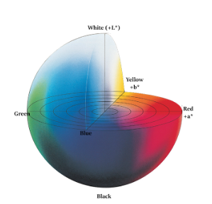

Lab is totally different from RGB color space. In RGB, colors are divided into three channels and each channel contains luminance. While in Lab, colors are divided into L channel only containing luminance, a channel and b channel.  

L component: represent the luminance of the pixel. The larger L value, the greater the luminance.  

a component: represent the range from red to green.

b component: represent the range from yellow to blue.

In OpenCV, R, G and B value in RGB color space all range from 0 to 255. In Lab color space, L ranges from 0 to 100. When L is 0, the color is black and when it is 100, the color is white. a and b values range from -128 to 127. When both a and b are 0, the color is gray.

To better assist in your understanding of the comparison between RGB and Lab, operate on PS.  

(1) Use eyedropper tool to get the color.

(2) Click the color picker at bottom left corner, the correspondence between Lab and RGB is listed below.

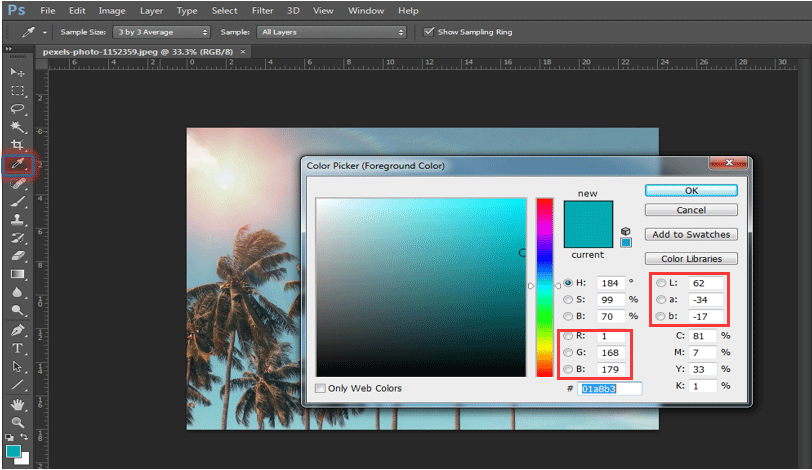

Lab color space has these features:

(1) A perceptually uniform color space align with the way human perceive color.

(2) Independent from device(capture or display)

(3) Widely applied in Adobe Photoshop 

(4) It is related to the RGB color space through complex transformation equations

In OpenCV, the image converted into Lab color space is as follow. 


- #### 5.7.2.3 Ycrcb Color Space

HVS (Human Visual System) is less sensitive to color than to luminance. In traditional RGB color space, three primary colors, RGB, bear the same importance, but luminance is overlooked. 

In YCrCb color space, Y represents luminance, and Cr and Cb stand for chroma. Cr indicates red component and Cb indicates blue component. Luminance can reflect how bright or dark a color is, which can be calculated through a weighted sum of the light intensity. The green component has the greatest impact on RGB light while the blue component the least.

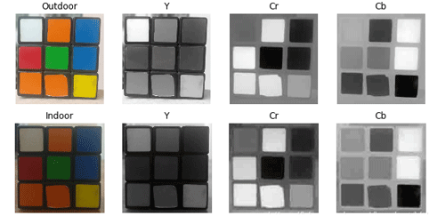

Observations focusing on intensity and color components can be made for LAB for illumination changes. Compared with LAB, the perception difference between red and orange in outdoor is smaller, while white between three components are distinguished. 

- #### 5.7.2.4 HSV Color Space

HSV color space is vision perception oriented color model which is composed of these three components.

H (hue), S (saturation) and V (value)

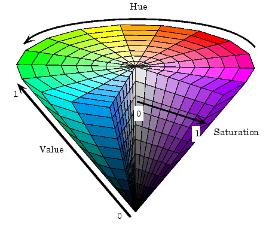

Hue: it is related to the dominant wavelength of light in the mixed spectrum, for example "red orange yellow green blue purple" represents different hues respectively. In the perspective of wavelength, light of different wavelength appear as different colors, i.e. different hues.   

Saturation: describes the purity of a color or pertains to the amount of white light mixed with a hue. Pure spectrum is fully saturated, and dark red (red mixed with white) and light purple (purple mixed with white) is not saturated enough. Saturation is inversely proportional to the amount of white light mixed.

Brightness: it reflect the brightness perceived by human and it is relative to the reflection of the object. For a hue, the greater the amount of white mixed in a hue, the greater the value. And the greater the amount of black mixed in a hue, the weaker the brightness. 

The most distinguished feature of HSV is that it only employs single channel to describe hue, which make it intuitive to designate a hue. But HSV colors rely on device. 


H components in outdoor and indoor are similar, which indicates the color is complete even though the lighting changes.

S components in outdoor and indoor are also similar. V stands for brightness so that it will change as the lighting changes. 

The difference of red value between indoor and outdoor is large for the reason that H component represent red by angle ranging from [300,360] and [0,60]. 

- #### 5.7.2.5 Gray Color Space

GRAY color space generally refers to grayscale image, monochromatic image, in which each pixel is processed into 256 gray level from black to white.  

These 256 gray levels are represented by the number within [0,255]. “0” indicates pure black, and “255” represents white. Number from 0 to 255 denote dark gray or light gray of different brightness (shade of hue).  

### 5.7.3 Color Conversion

The function below is used to transform color.

```python
dst = cv2.cvtColor( src, code[, dstCn] )
```

dst represents the output image whose data type and depth are similar to the original input image. src refers to original input image. 

code is the flag of color space conversion. 

dstCn is the number of channel of the target picture, 0 by default. 

|       Flag        | Shorthand |                   Function                   |
| :---------------: | :-------: | :------------------------------------------: |
| cv.COLOR_BGR2BGRA |     0     |          Add alpha channel for RGB           |
| cv.COLOR_BGR2RGB  |     4     |      change the order of color channels      |
| cv.COLOR_BGR2GRAY |    10     |    convert color picture into gray image     |
| cv.COLOR_GRAY2BGR |     8     |  convert the color picture into gray image   |
| cv.COLOR_BGR2YUV  |    82     | convert RGB color space into YUV color space |
| cv.COLOR_YUV2BGR  |    84     | convert YUV color space into RGB color space |
| cv.COLOR_BGR2HSV  |    40     | Convert RGB color space into HSV color space |
| cv.COLOR_HSV2BGR  |    54     | Convert HSV color space into RGB color space |
| cv.COLOR_BGR2Lab  |    44     | Convert RGB color space into Lab color space |
| cv.COLOR_Lab2BGR  |    56     | Convert Lab color space into RGB color space |

Take cv2.cvtColor(frame, cv2.COLOR_RGB2LAB) for example.

“frame” is the picture to be processed. “cv2.COLOR_RGB2LAB” is the designated conversion model, referring to convert the picture from RGB color space into LAB color space. 

Follow the following steps to transform the pictures into some common color spaces. 

- #### 5.7.3.1 Operation Steps

Before operation, please move to “**[OpenCV Computer Vision Lesson\7.Image Processing---Color Space Conversion\Sample Code]()**”, and copy the sample routine “**color_conversion.py**” and picture “img1.jpg” into the shared folder

For how to configure the shared folder, please refer to the file in “**[Linux Basic Lesson\3.Linux Installation and Source Replacement]()**”.

:::{Note}
**the input command should be case sensitive and the keywords can be complemented by "Tab" key**
:::

1. Connect to the Raspberry Pi remotely via VNC.

2. Move the cursor to the top center of the remote desktop window and click the transfer button highlighted in the red box.


3. Click the highlighted area to select files for transfer.


4. Open the "**Routine Code**" directory, select the required files, and click Open.

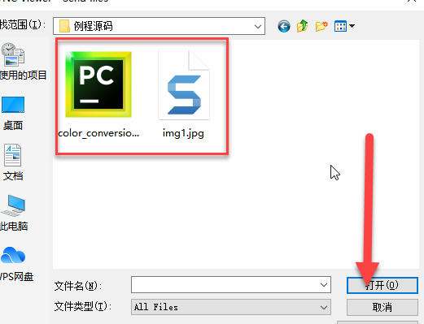

5. VNC transfers the selected files to the Raspberry Pi desktop.

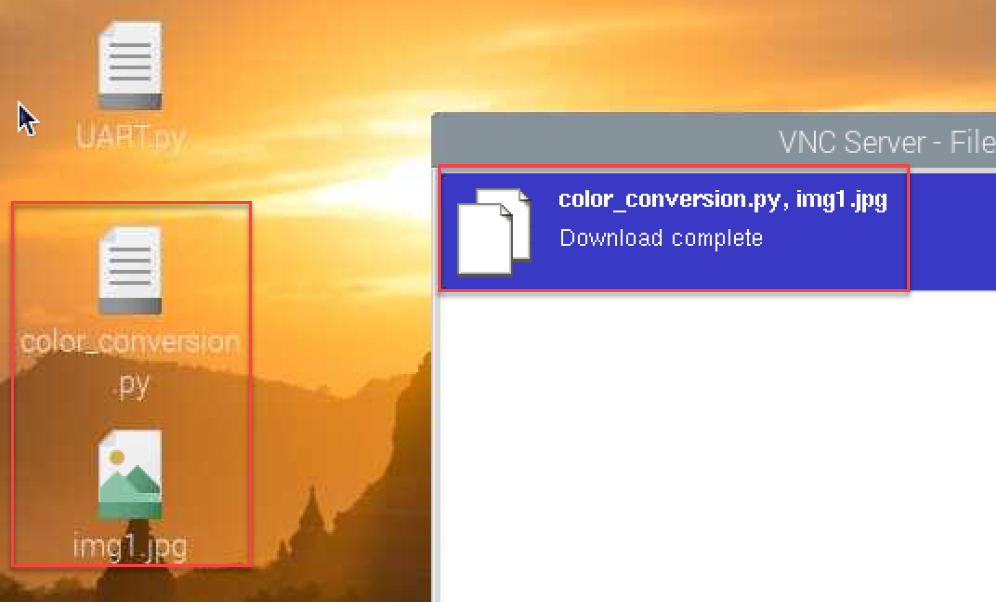

6. Open a terminal, enter "**cd Desktop**", and press Enter to navigate to the Desktop directory.

```bash
cd Desktop
```

7. Enter "**python3 color_conversion.py**" and press Enter to run the routine.

```bash
python3 color_conversion.py
```

- #### 5.7.3.2 Demonstration Result

After execution, the final processed result is as follow. 

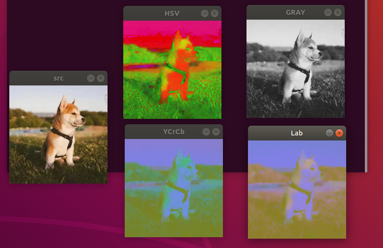

- #### 5.7.3.3 Program Analysis

（1）Firstly, import the required module with import statement.

```python
import numpy as np
import cv2 as cv
```

（2）Call imread() function in cv2 module to read the image to be processed.

```python
src = cv2.imread("img1,jpg")
```

（3）Next, set the size of the inserted picture. And in the bracket is the name of the picture.

```python
src = cv2.resize(src,(int(src.shape[1] / 2), int(src,shape[0] / 2))
```

（4）Create four functions in sequence to convert the image into Gray, Lab, Ycrcb amd HSV respectively.

```python
GRAY = cv2.cvtColor(src, cv2.COLOR_BGR2GRAY)
Lab = cv2.cvtColor(src, cv2.COLOR_BGR2LAB)
YCrCb = cv2.cvtColor(src, cv2.COLOR_BGR2YCrCb)
HSV = cv2.cvtColor(src, cv2.COLOR_BGR2HSV)
```

（5）Display the image before and after conversion respectively.

```python
cv2.waitKey(0)
cv2.destroyAllWindows()
```

（6）Lastly, close the window through the function.

```python
cv2.imshow("src", src)
cv2.imshow("GRAY", GRAY)
cv2.imshow("Lab", Lab)
cv2.imshow("YCrCb", YCrCb)
cv2.imshow("HSV", HSV)
```

cv2.waitKey() is a keyboard binding function. Its time unit is milliseconds (ms). The function will wait n ms set in bracket to check if there is any keyboard input. If there is, the ASCII value of the key is returned. -1 will be returned if there is no keyboard input. Generally we set it to 0, the function will wait for keyboard input endlessly.

cv2.destroyAllWindows() is used to delete the window. If there is no parameter in the bracket, all the windows will be deleted. If you input the specific value of the window, the designated window will be removed. 

- #### 5.7.3.4 File Management

Move this file to directory "home\pi\OpenCV_vision\Color_conversion" for future reference. Create directory OpenCV_vision\Color_conversion in the home folder if not already existing.

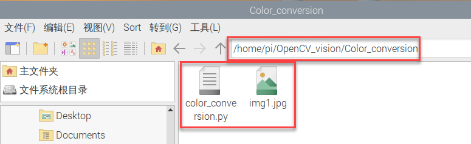

## 5.8 Image Processing --- Geometric Transformation

### 5.8.1 Introduction

A spatial transformation of an image is a geometric transformation of the image coordinate system. It map the coordinate of a picture to a new coordinate of other picture. And geometric transformation will not change the pixel of the image, but rearrange the pixels on the image plane.

According to OpenCV functions, we divide mapping into scaling, flipping,affine transformation, perspective, etc.


### 5.8.2 Import Routine

Transfer the routine directory located in the same path to the system desktop via VNC file transfer prior to operation.

1. Move the cursor to the top center of the remote desktop window and click the transfer button highlighted in the red box.


2. Click the highlighted area to select files for transfer.


3. Open the "**Routine Code**" directory, navigate to the target routine folder, select the required files, and click Open. VNC transfers the selected files to the Raspberry Pi desktop.

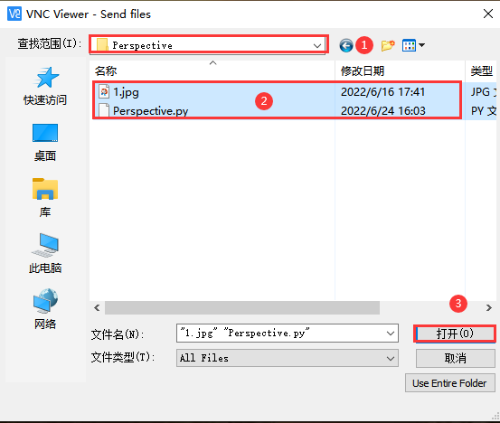

The transferred files display upon returning to the desktop.

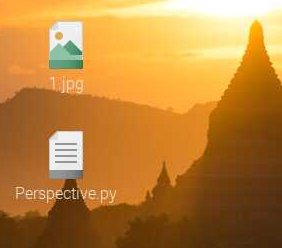

All routines utilized in this section display below:

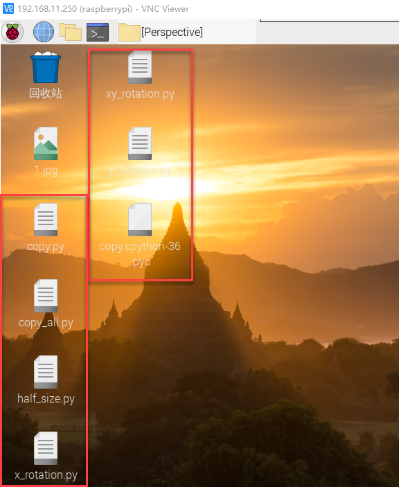

### 5.8.3 Scaling

Scaling is to adjust the size of the picture, for example zoom in or zoom out the picture. In OpenCV, cv2.resize() function is used to scale the image.  

```python
dst = cv2.resize(src, dsize[, fx[, fy[, interpolation]]] )
```

dst represents the output image whose type is the same as src. And its size is dsize (when it is not 0) or can be calculated through src.size(), fx and fy. 

(1) src represents the original picture

(2) dsize stands for the size of the output image 

(3) fx indicates the horizontal scaling ratio 

(4) fy denotes the vertical scaling ratio 

(5) interpolation is for interpolation method. 

<table class="docutils-nobg" border="1">
<colgroup>
<col  />
<col  />
</colgroup>
<tbody>
<tr>
<td ><strong>Type</strong></td>
<td ><strong>Description</strong></td>
</tr>
<tr>
<td >cv2.INTER_NEAREST</td>
<td >nearest neighbor interpolation</td>
</tr>
<tr>
<td >cv2.INTER_LINEAR</td>
<td >linear interpolation</td>
</tr>
<tr>
<td >cv2.INTER_CUBIC</td>
<td >Cubic spline interpolation. First, the cubic spline fitting is performed on the 4 x 4 nearest neighbors near the original image, and then the cubic spline value corresponding to the target pixel is taken as the value of the corresponding pixel in the target image.</td>
</tr>
<tr>
<td >cv2.INTER_AREA</td>
<td >Area interpolation similar to nearest interpolation. Sample the current pixel according to the pixels in the surrounding area of the current pixel.</td>
</tr>
<tr>
<td >cv2.INTER_LANCZOS4</td>
<td >Lanczos interpolation over 8×8 neighborhood</td>
</tr>
<tr>
<td >cv2.INTER_LINEAR_EXACT</td>
<td >Bit accurate bilinear interpolation</td>
</tr>
<tr>
<td >cv2.INTER_MAX</td>
<td >Difference encoding mask</td>
</tr>
<tr>
<td >cv2.WARP_FILL_OUTLIERS</td>
<td >Flag, fills all of the destination image pixels. If some of them correspond to outliers in the source image, they are set to zero</td>
</tr>
<tr>
<td >cv2.WARP_INVERSE_MAP</td>
<td ><p>flag, inverse transformation. For example, polar transformation. If flag is not set, perform transformation: dst(ρ,ϕ)=src(x,y)</p>
<p>For example, If flag is set, perform transformation: dst(x,y)=src(ρ,ϕ)</p></td>
</tr>
</tbody>
</table>


- #### 5.8.3.1 Operation Steps

The program will scale the image.

:::{Note}
**the input command should be case sensitive and the keywords can be complemented by "Tab" key.**
:::

（1）Input command “**cd Desktop**” and press Enter to enter the shared folder。

```bash
cd Desktop/
```

（2）Input command “**python3 Scale.py**” and press Enter to run the code.

```bash
python3 Scale.py
```

- #### 5.8.3.2 Program Outcome

The final output picture is as follow.

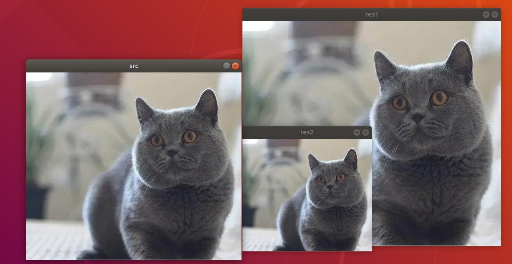

**(1) src:** Original picture. Its size is 492*430 pixels (width*height)

**(2) res1:** The size of the picture after zoomed in. Its size is 590*512 pixels (width*height) 

**(3) res2:** The size of the picture after zoomed out. And its size is 295*258 pixels(width*height)

**5.8.3.3 Program Analysis**

The routine “**Scale.py**” can be found in “**[OpenCV Computer Vision Lesson->8.Image Processing---Geometric Transformation->Routine Code->Scale.py]()**”.

```python
import numpy as np
import cv2 as cv

src = cv.imread('1.jpg')
# method  output the dimension directly
height, width = src.shape[:2]  # acquire the original dimension
res1 = cv.resize(src, (int(1.2*width), int(1.2*height)),interpolation=cv.INTER_CUBIC)
res2 = cv.resize(src, (int(0.6*width), int(0.6*height)),interpolation=cv.INTER_CUBIC)
cv.imshow("src", src)
cv.imshow("res1", res1)
cv.imshow("res2", res2)
print("src.shape=", src.shape)
print("res1.shape=", res1.shape)
print("res2.shape=", res2.shape)
cv.waitKey()
cv.destroyAllWindows()
```

Firstly, import the required module through import statement.

```python
import numpy as np
import cv2 as cv
```

Then call **imread()** function in cv2 module to read the image that needs to be scaled. 

```python
src =  cv.imcread("1.jpg")
```

In the bracket is the name of image.

The original width of the picture is 492 pixel, and height is 430 pixel. Parameter dsize can be used to designate the size of target image res1 and res2 (The name of the image can be customized)

The first parameter in dsize corresponds to the width after scaling. (width i.e. the number of columns which is related to parameter fx.) And the second parameter corresponds to the height after scaling. (height i.e. the number of row which is related to parameter fy)

If the value of dsize is specified, the size of the target image is determined by dsize regardless of whether the parameters fx and fy are specified.

```python
height, width = src.shape[:2]  # acquire the original dimension
res1 = cv.resize(src, (int(1.2*width), int(1.2*height)),interpolation=cv.INTER_CUBIC)
res2 = cv.resize(src, (int(0.6*width), int(0.6*height)),interpolation=cv.INTER_CUBIC)
```

Therefore, program to acquire the original dimension first, and then directly scale the width and height. To zoom in this picture, this routine enlarges the width of res1 to 1.2 times the original and height to 1.2 times the original. Through calculation, the width is 590 pixels (92x1.2) and the height is 516 pixels (430x1.2).

To zoom out the picture, this routine will shrink the res2 width to 0.6 times the original, and the height to 0.6 times the original. The final width is 295 pixels (492x0.6) and height is 258 pixels (430x0.6). And the image size, before and after processing, can printed. 

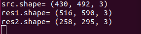

### 5.8.4 Affine Transformation

Affine transformation is that images can be translated, rotated, etc. through a series of geometric transformations, while lines and parallelism can be preserved. 

Linearity means that the straight lines of the image can still be preserved after affine transformation. And parallelism indicates that parallel lines can be preserved after affine transformation.   

Translation and rotation are special cases of affine transformation which is realized by the function **cv2.warpAffine()** in OpenCV. This function execute transformation by a transformation matrix M (transformation matrix of translation and rotation is different) 

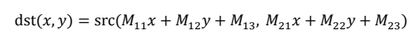

As the picture below shown, the original image O can be transformed into affine image R by a transformation matrix M.

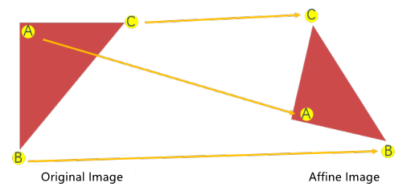

The format of **cv2.warpAffine()** function is as follow. 

```python
dst = cv2.warpAffine( src, M, dsize[, flags[, borderMode[, borderValue]]] )
```

(1) **dst: ** Represent the output image after affine transformation. The type of this image is similar to that of the original image. And the actual size of the output image is finally determined by dsize.

(2) **src:**  Represent the original image

(3) **M:** Stand for a 2x3 transformation matrix. Various affine transformation can be realized by using different transformation matrix. And the size of the output image is finally determined by dsize. 

(4) **flags:**  Represents the interpolation method which defaults to INTER_LINEAR. When it is **WARP_INVERSE_MAP**, M is an inverse transformation from the target image dst to the original image src. **borderMode**, optional parameter, represents the edge type,BORDER_CONSTANT by default. When it is **BORDER_TRANSPARENT**, the values in the target image do not change, and these values correspond to the outliers in the original image.

(5) **borderValue**: Refer to border value, 0 by default. 

The optional parameters of cv2.warpAffine() function can be omitted, and its final format is as follow. 

```python
dst = cv2.warpAffine( src , M , dsize )
```

By transformation matrix M, transform the original image src into the target image dst.

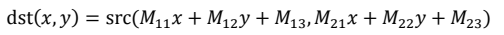

Therefore, the type of affine transformation relies on the transformation matrix M. 

- ####  5.8.4.1 Translation

Translation is the movement of the object. If the coordinates of the object translation is obtained, the following transformation matrix can be created.

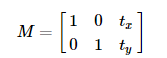

Put the transformation matrix into the array whose type is np.float32, and assign M matrix to cv2.warpAffine() function so as to realize translation. 

**（1）Operation Steps**

This routine will translate the image to right.The files used are shown in the following figure：

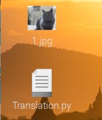

① Click，or press “**Ctrl+Alt+T**” to open command line terminal.

② Input command "**cd /Desktop**"，and press Enter to enter the shared folder.

```bash
cd /Desktop
```

③ Input command "**sudo python3 Translation.py**" and press Enter to run the routine. 

```bash
sudo python3 Translation.py
```

**（2）Program Outcome**

The final output picture is as follow.

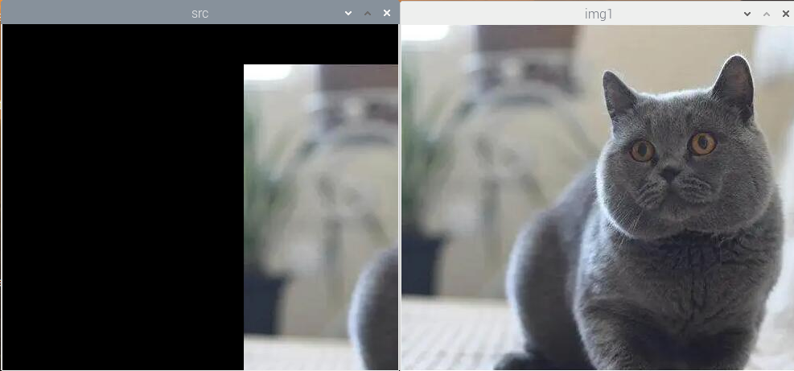

**（3）Program Analysis**

The routine **“Translation.py”** can be found in “**[OpenCV Computer Vision Lesson->8.Image Processing---Geometric Transformation->Routine Code->TranslaTion]()**”.

```py
import numpy as np
import cv2

img = cv2.imread('1.jpg')
rows, cols, ch = img.shape
M = np.float32([[1, 0, 300], [0, 1, 50]])

dst =cv2.warpAffine(img, M, (cols, rows))
cv2.imshow('imgl', img)
cv2.imshow('src', dst)
cv2.waitKey(0)
cv2.destroyAllwindows()
```

① Firstly, import the required module through import statement.

```py
import cv2
import numpy as np
```

② Then call **imread()** function in cv2 module to read the image that needs to be translated.

```py
img = cv2.imread('1.jpg')
```

③ Return the number of row, column and channel of the image pixel to rows, cols and ch.

```py
rows, cols, ch = img.shape
```

④ As mentioned before, if the coordinate of the object translation can be obtained, the transformation matrix can be created.


```py
M = np.float32([1, 0, 300], [0, 1, 50])
```

⑤ After setting, the picture before and after translation can be displayed through imshow function. 

```py
cv2.imshow('img1', img)
cv2.imshow('src', dst)
```

⑥ Lastly, close the window through the function, and you can press any key to exit the program.

```py
cv2.waitKey(0)
cv2.destroyAllwindows()
```

cv2.waitKey() is a keyboard binding function. Its time unit is milliseconds (ms). The function will wait n ms set in bracket to check if there is any keyboard input. If there is, the ASCII value of the key is returned. -1 will be returned if there is no keyboard input. Generally we set it to 0, the function will wait for keyboard input endlessly.

cv2.destroyAllWindows() is used to delete the window. If there is no parameter in the bracket, all the windows will be deleted. If you input the specific value of the window, the designated window will be removed.

**4. File Management**

Move this script to directory "**home\pi\OpenCV_vision\Translation**" for future reference. Create directory **OpenCV_vision\Translation** in the home folder if not already existing.

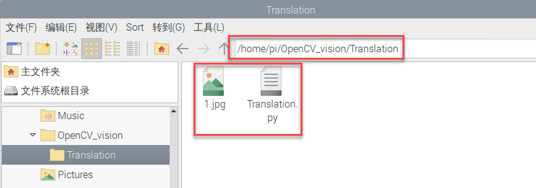

- #### 5.8.4.2 Rotation

Both translation and rotation are the examples of the affine transformation, and employ cv2.warpAffine function to realize affine transformation. But their transformation matrix is different. When rotating the image with function cv2.warpAffine(), obtain the transformation matrix with function cv2.getRotationMatrix2D().   

The function format is 

```python
retval=cv2.getRotationMatrix2D(center, angle, scale)
```

① enter refers to the center of rotation. 

② angle stands for rotation angle. When it is positive, the image will be rotated counterclockwise. When it is negative, the image will be rotated clockwise.

③ scale means scaled size

The rotation angle θ can be obtained from matrix M. 

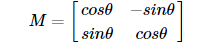

OpenCV has improved this matrix to provide scaling rotation and adjustable rotation center, as the picture shown below. 

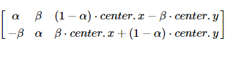

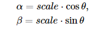

The above matrix represents a rotation around center.x and center.y by θ degrees. 

For example, set the function as below to rotate the image around the image center counterclockwise by 45 degree, and zoom out the image 0.6 times the original. Then call this function to generate the matrix.

```py
M=cv2.getRotationMatrix2D((height / 2, width / 2), 45, 0.6)
```

**（1）Operation Steps**

This routine will rotate the image 90 degree counterclockwise.The routine used is shown in the following figure：

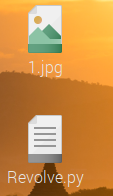

① Click ，or press "**Ctrl+Alt+T**" to open command line terminal.

② Input command "**cd /Desktop**" and press Enter to enter the shared folder.

```bash
cd /Desktop
```

③ Input the command "**sudo python3 Revolve.py**"and press Enter to run the routine.

```bash
sudo python3 Revolve.py
```

**（2）Program Outcome**

The output picture is as follow.

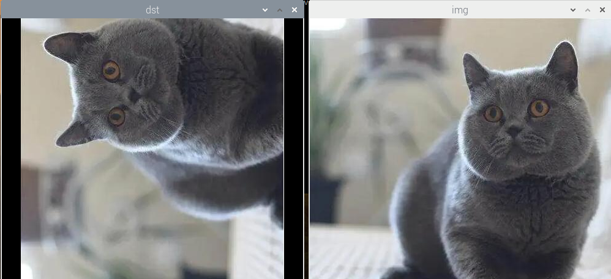

**（3）Program Analysis**

The routine “**Revolve.py**” can be found in “**[Image Processing---Geometric Transformation->Routine Code->Revolve]()**”.

```python
import cv2
import numpy as np

img = cv2.imread('1.jpg')
rows, cols, ch = img.shape
# rotate the center  rotation angle  scale factor
M = cv2.getRotationMatrix2D(((cols-1) / 2.0,(rows-1)/2.0), 90,1)
# original picture  convert matrix  output the image center
dst = cv2.warpAffine(img, M, (cols, rows))

cv2.imshow('img', img)
cv2.imshow('dst', dst)
cv2.waitKey(0)
cv2.destroyAllWindows()
```

① Firstly, import the required module through import statement.

```python
import cv2
import numpy as np
```

② Then call **imread()** function in cv2 module to read the image that needs to be rotated.

```py
img = cv2.imcread('1.jpg')
```

③ Return the number of row, column and channel of the image pixel to rows, cols and ch.

```py
rows, cols, ch = img.shape
```

④ The image will rotate around the image center 90 degree counterclockwise. And its size remains the same.

```py
M = cv2.getRotationMatrix2D(((cols - 1) / 2.0, (rows - 1) / 2.0), 90, 1)
```

⑤ Output the original image center.

```py
dst = cv2.warpAffine(img, M, (cols, rows))
```

⑥ After setting, we can call imshow function to display the pictures before and after rotation. 

```py
cv2.imshow('img', img)
cv2.imshow('dst', dst)
```

⑦ Lastly, call function below to close the window, and you can press any key to exit the program.

```py
cv2.waitKey(0)
cv2.destroyAllwindows()
```

cv2.waitKey() is a keyboard binding function. Its time unit is milliseconds (ms). The function will wait n ms set in bracket to check if there is any keyboard input. If there is, the ASCII value of the key is returned. -1 will be returned if there is no keyboard input. Generally we set it to 0, the function will wait for keyboard input endlessly.

cv2.destroyAllWindows() is used to delete the window. If there is no parameter in the bracket, all the windows will be deleted. If you input the specific value of the window, the designated window will be removed.

**4. File Management**

Move this script to directory "**home\pi\OpenCV_vision\Revolve**" for future reference. Create directory **OpenCV_vision\Revolve** in the home folder if not already existing.

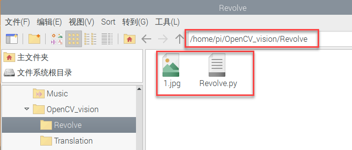

### 5.8.5 Perspective Transformation

Affine transformation are rotation, translation and scaling in 2D space, while perspective transformation is in 3D space.

Perspective transformation is realized by function cv2.warpPerspective(), and the function format is as follow.

```py
dst = cv2.warpPerspective( src, M, dsize[, flags[, borderMode[, borderValue]]] )
```

(1) dst represents the output image after perspective transformation, whose type is the same as the original picture. And its size is determined by dsize. 

(2) src represents the image to be processed.

(3) M stands for a 3x3 transformation matrix

(4) dsize indicates the dimension of the output image. 

(5) flags represents the interpolation method which defaults to INTER_LINEAR. When it is **WARP_INVERSE_MAP**, M is an inverse transformation from the target image dst to the original image src. **borderMode**, optional parameter, represents the edge type,BORDER_CONSTANT by default. When it is **BORDER_TRANSPARENT**, the values in the target image do not change, and these values correspond to the outliers in the original image.

- #### 5.8.5.1 Operation Steps

This routine will perform perspective transformation.The routine used is shown in the following figure：

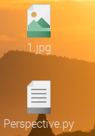

（1）Click  or press "**Ctrl+Alt+T**" to open command line terminal.

（2）Input command "**cd Desktop/**"and press Enter to enter the shared folder.

```bash
cd Desktop/
```

（3）Input command "**sudo python3 Perspective.py**" and press Enter to run the routine.

```py
sudo python3 Perspective.py
```

- #### 5.8.5.2 Program Outcome

The final output picture is as follow.

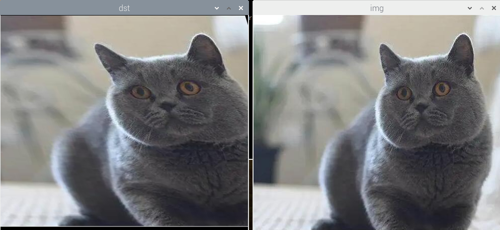

- #### 5.8.5.3 Program Analysis

The routine “**Perspective.py**” can be found in “**[Image Processing---Geometric Transformation->Routine Code->Perspective]()**”.

```py
import cv2
import numpy as np
img = cv2.imcread('1.jpg')
rows, cols = img.shape[:2]
print(rows, cols)

pts1 = np.float32([[150, 50], [400, 50], [60, 450], [310, 450]])
pts2 = np.float32([[50, 50], [rows-50, 50], [50, co1s-50], [rows-50, cols-50]])
M = cv2.getPerspectiveTransform(ptsl, pts2)
dst = cv2.warpPerspective(img, M, (cols, rows))

cv2.imshow("img", img)
cv2.imshow("dst", dst)
cv2.waitKey()
cv2.destroyAllwindows()
```

（1）Firstly, import the required module through import statement.


```py
import cv2
import numpy as np
```

（2）Then call **imread()** function in cv2 module to read the image for perspective transformation.

```py
img = cv2.imcread('1.jpg')
```

（3）Return the number of row, column and channel of the image pixel to rows, cols and ch.

```py
rwos, cols = img.shape[:2]
```

（4）In this example, specify four vertices pts1 of the parallelogram in the original image, and specify four vertices pts2 of the rectangle in the target image. Next, generate the transformation matrix M with **dst=cv2.warpPerspective(img,M,(cols,rows))** Next, employ **dst=cv2.warpPerspective(img,M,(cols,rows))** statement to convert parallelogram to rectangle.

```py
pts1 = np.float32([[150, 50], [400, 501], [60, 450], [310, 450]])
pts2 = np.float32([[50, 50], [rows-50, 50], [50, cols-50], [rows-50, cols-50]])
M = cv2.getPerspectiveTransform(pts1, pts2)
dst = cv2.warpPerspective(img, M, (cols, rows))
```

（5）After setting, the picture before and after translation can be displayed through imshow function.

```py
cv2.imshow("img", img)
cv2.imshow("dst", dst)
```

（6）Lastly, close the window through the function, and you can press any key to exit the program.

```py
cv2.waitKey()
cv2.destroyAllwindows()
```

cv2.waitKey() is a keyboard binding function. Its time unit is milliseconds (ms). The function will wait n ms set in bracket to check if there is any keyboard input. If there is, the ASCII value of the key is returned. -1 will be returned if there is no keyboard input. Generally we set it to 0, the function will wait for keyboard input endlessly.

cv2.destroyAllWindows() is used to delete the window. If there is no parameter in the bracket, all the windows will be deleted. If you input the specific value of the window, the designated window will be removed.

- #### 5.8.5.4 File Management

Move this script to directory "**home\pi\OpenCV_vision\Perspective**" for future reference. Create directory **OpenCV_vision\Perspective** in the home folder if not already existing.

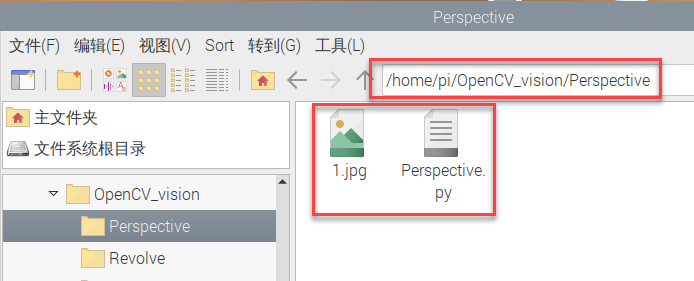

### 5.8.6 Remap

Remap is that the pixels are mapped from one picture to the corresponding positions in another image according to the rules to form a new image. 

As the pixel coordinates of the original image do not correspond to that of target image, in general, we describe the position (x, y) of each pixel by remapping.

g(x,y)=f(h(x,y))

g() refers to target image, f() is the original image and h(x,y) is the image after remapping. Take the below function for example. And **image I** will be remapped under the following conditions.  

h(x,y)=(I.cols-x,y)

The image will flip in the x direction. cv2.remap() function in OpenCV makes it more convenient and free to remap. And its format is as follow.

```python
dst = cv2.remap( src, map1, map2, interpolation[, borderMode[, borderValue]] )
```

(1) dst represents the output image whose type and size are the same as the original picture.

(2) src represents the original image

(3) There are two possible values of map1 parameter. It represents a map of (x,y), or x value of (x,y) of CV_16SC2 , CV_32FC1, CV_32FC2 type. 

(4) There are also two possible values of map2 parameter.

When map1 represents (x,y), its value is none. 

When map1 represents x value of (x,y), its value is the y value of (x,y) in CV_16UC1, CV_32FC1 type.  

Note: map1 refers to the column where the pixel is located, and map2 refers to the row where the pixel is located. So usually, map1 is written as mapx and map2 as mapy for better understanding.

(6) Interpolation is for interpolation method.

(7) borderMode refers to border value. When it is BORDER_TRANSPARENT, the pixel of target image corresponding to outliers in the original image will not be modified.  

(8) borderValue refers to border value, 0 by default.

- #### 5.8.6.1 Copy Pixel

**（1）Operation Steps**

All pixels in the target image are mapped to the pixels on the 100th row and 200th column in the original image.The routine used is shown in the following figure:


① Click  or press "**Ctrl+Alt+T**" to open command line terminal.

2. Enter "**cd Desktop/**" and press Enter to navigate to the desktop directory.

```bash
cd Desktop/
```

③ Input command "**sudo python3 copy.py**" and press Enter to enter the shared folder.

```bash
sudo python3 copy.py
```

**（2）Program Outcome**

A pure-colored picture will be output.

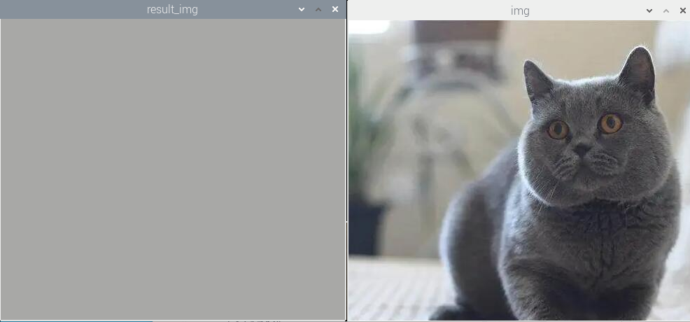

**（3）Program Analysis**

The routine “**copy.py**” can be found in “[OpenCV Computer Vision Lesson->8.Image Processing---Geometric Transformation->Routine Code->Remap]()”.

```python
import cv2
import numpy as np

img = cv2.imread("1.jpg")
rows, cols, ch = img.shape
mapx = np.ones(img.shape[:2], np.float32) * 200
mapy = np.ones(img.shape[:2l, np.float32) * 100
result img = cv2.remap(img, mapx, mapy, CV2.INTER_LINEAR)
                         
cv2.imshow("img", img)
cv2.imshow("result img", result_img)
cv2.waitKey()
cv2.destroyAllwindows()
```

① Firstly, import the required module through import statement.

```python
import cv2
import numpy as np
```

② Then call **imread()** function in cv2 module to read the image that needs to be scaled.

```python
img = cv2.imcread('1.jpg')
```

③ Return the number of row, column and channel of the image pixel to rows, cols and ch.

```python
rows, cols, ch = img.shape
```

④ mapx and mapy separately set the x axis and y axis coordinate. Map all the pixels on the target image to the pixels on 100th row, 200th column of the original image. 

```python
mapx = np.ones(img.shape[:2], np.float32) * 200
mapy = np.ones(img.shape[:2], np.float32) * 100
```

⑤ After setting, the picture before and after the pixels are copied can be displayed through imshow function. Lastly, close the window through the function, and you can press any key to exit the program.

```python
cv2.imshow("img", img)
cv2.imshow("result_img", result_img)
cv2.waitKey()
cv2.destroyAllWindows()
```

cv2.waitKey() is a keyboard binding function. Its time unit is milliseconds (ms). The function will wait n ms set in bracket to check if there is any keyboard input. If there is, the ASCII value of the key is returned. -1 will be returned if there is no keyboard input. Generally we set it to 0, the function will wait for keyboard input endlessly.

cv2.destroyAllWindows() is used to delete the window. If there is no parameter in the bracket, all the windows will be deleted. If you input the specific value of the window, the designated window will be removed.

**4. File Management**

Move the imported script to directory "**home\pi\OpenCV_vision\Remap**" for future reference. Create directory **OpenCV_vision\Remap** in the home folder if not already existing.


Create a \_\_pycache\_\_ folder inside the Remap directory to store file "**copy.cpython-36.pyc**".


- #### 5.8.6.2 Copy the Whole Image

**（1）Operation Steps**

Besides the pixels can be copied, the whole image can also be copied. For example, copy the whole original picture to the right. 

Before operation, please copy the routine “**Remap**” in “**[OpenCV->8.Image Processing --- Geometric Transformation->Routine Code]()**” to the shared folder.

For how to configure the shared folder, please refer to the file in **“[Linux Basic Lesson->3.Linux Installation and Source Replacement]()”.**

:::{Note}
**the input command should be case sensitive and the keywords can be complemented by "Tab" key.**
:::

1. Connect to the Raspberry Pi remotely via VNC.

② Input command "**cd OpenCV_vision/Remap/**"and press Enter to enter the shared folder.

```bash
cd OpenCV_vision/Remap/
```

③ Input command "**sudo python3 copy_all.py**"and press Enter to enter the shared folder.

```bash
sudo python3 copy_all.py
```

**（2）Program Outcome**

Correspond all the pixels of the original image to those of original image. The final output image is as follow. 


**（3）Program Analysis**

The routine “**copy_all.py**” can be found in “**[8.Image Processing---Geometric Transformation->Routine Code]()**”.

```python
import cv2
import numpy as np

img = cv2.imread("1.jpg")
rows, cols, ch = img.shape
mapx = np.ones(img.shape[:2], np.float32)
mapy = np.ones(img.shape[:2], np.float32)
for i in range(rows):
    for j in range(cols):
        mapx.itemset((i,j),j)#set Y-axis coordinate of each point mapped on the original picture 
        mapy.itemset((i,j),i)#set X-axis coordinate of each point mapped on the original picture
result_img = cv2.remap(img, mapx, mapy, cv2.INTER_LINEAR)
cv2.imshow("img", img)
cv2.imshow("result_img", result_img)
cv2.waitKey()
cv2.destroyAllWindows()
```

① Firstly, import the required module through import statement.

```python
import cv2
import numpy as np
```

② Then call **imread()** function in cv2 module to read the image.

```python
img = cv2.imcread('1.jpg')
```

③ Return the number of row, column and channel of the image pixel to rows, cols and ch.

```python
rows, cols, ch = img.shape
```

④ mapx and mapy separately set the x axis and y axis coordinate.

```python
mapx = np.ones(img.shape[:2], np.float32)
mapy = np.ones(img.shape[:2], np.float32)
for i in range(rows):
	for j in range(cols):
		mapx.itemset((i, j), j) # Set Y coordinate mapping to original image for each pixel
		mapy.itemset((i, j), i) # Set X coordinate mapping to original image for each pixel
```

⑤ After setting, the picture before and after the pixels are copied can be displayed through imshow function. Lastly, close the window through the function, and you can press any key to exit the program.

```python
cv2.imshow("img", img)
cv2.imshow("result_img", result_img)
cv2.waitKey()
cv2.destroyAllWindows()
```

cv2.waitKey() is a keyboard binding function. Its time unit is milliseconds (ms). The function will wait n ms set in bracket to check if there is any keyboard input. If there is, the ASCII value of the key is returned. -1 will be returned if there is no keyboard input. Generally we set it to 0, the function will wait for keyboard input endlessly.

cv2.destroyAllWindows() is used to delete the window. If there is no parameter in the bracket, all the windows will be deleted. If you input the specific value of the window, the designated window will be removed.

- #### 5.8.6.3 Rotate Around X Axis

If make the image flip around x axis, 

① x axis coordinate remains unchanged.

② The y-axis coordinate after rotation is symmetric with respect to x axis.

Or： 

① map1 remains unchanged

② map2= total number of row - 1 - current row number

Row indices in OpenCV start from index 0. Symmetric relationships satisfy the equation current row plus symmetric row equals total rows minus 1. Vertical flipping along the X axis sets map2 row values to total rows minus 1 minus current row.

**（1）Operation Steps**

With cv2.remap() function, the pixels can be remapped, and also be flipped and then remapped. Ensure the x axis coordinate remains unchanged and y-axis coordinate after rotation is symmetric with respect to x axis. 

① Input the command "**cd OpenCV_vision/Remap/**"and press Enter to enter the shared folder.

```bash
cd OpenCV_vision/Remap/
```

② Input the command "**sudo python3 x_rotation.py**"and press Enter to enter the shared folder.

```bash
sudo python3 x_rotation.py
```

**（2）Program Outcome**

The final output image is as follow.


**（3）Program Analysis**

The routine “**x_rotation.py**” can be found in “**[OpenCV Computer Vision Lesson->Lesson 8 Image Processing---Geometric Transformation->Routine Code]()**”.

```py
import cv2
import numpy as np

img = cv2.imread("1.jpg")
rows, cols, ch = img.shape
mapx = np.ones(img.shape[:2], np.float32)
mapy = np.ones(img.shape[:2], np.float32)
for i in range(rows):
    for j in range(cols):
        mapx.itemset((i,j),j)
        mapy.itemset((i,j),rows-1-i)#just modify this line of code. Symmetrical

result_img = cv2.remap(img, mapx, mapy, cv2.INTER_LINEAR)
cv2.imshow("img", img)
cv2.imshow("result_img", result_img)
cv2.waitKey()
cv2.destroyAllWindows()

```

① Firstly, import the required module through import statement.

```py
import cv2
import numpy as np
```

② Then call ***\*imread()\**** function in cv2 module to read the image that needs to be scaled.

```py
img = cv2.imcread('1.jpg')
```

③ Return the number of row, column and channel of the image pixel to rows, cols and ch.

```py
rows, cols, ch = img.shape
```

④ mapx and mapy separately set the x axis and y axis coordinate. map1 remains unchanged, and map2 = “**total number of row - 1 - current row number**”

```py
mapx = np.ones(img.shape[:2], np.float32)
mapy = np.ones(img.shape[:2], np.float32)
for i in range(rows):
	for j in range(cols):
		mapx.itemset((i, j), j)
		mapy.itemset((i, j), rows-1-i) # just modify this line of code，Symmetrical
```

⑤ After setting, the picture before and after can be displayed through imshow function. Lastly, close the window through the function, and you can press any key to exit the program.

```py
cv2.imshow("img", img)
cv2.imshow("result_img", result_img)
cv2.waitKey()
cv2.destroyAllWindows()
```

cv2.waitKey() is a keyboard binding function. Its time unit is milliseconds (ms). The function will wait n ms set in bracket to check if there is any keyboard input. If there is, the ASCII value of the key is returned. -1 will be returned if there is no keyboard input. Generally we set it to 0, the function will wait for keyboard input endlessly.

cv2.destroyAllWindows() is used to delete the window. If there is no parameter in the bracket, all the windows will be deleted. If you input the specific value of the window, the designated window will be removed.

- #### 5.8.6.4 Rotate Around Y Axis

If make the image flip around y axis, 

① y axis coordinate remains unchanged.

② The x-axis coordinate after rotation is symmetric with respect to y axis.

Or： 

① Map2 remains unchanged

② map2 = “**total number of column - 1 - current column number**”

Column indices in OpenCV start from index 0. Symmetric relationships satisfy the equation current column plus symmetric column equals total columns minus 1. Horizontal flipping along the Y axis sets map1 column values to total columns minus 1 minus current column.

**（1）Operation Steps**

Before operation, please copy the routine “**Remap**” in “ [OpenCV->Lesson 8 Image Processing --- Geometric Transformation->Routine Code]()” to the shared folder. 

① Input command "**cd OpenCV_vision/Remap/**" and press enter to enter the Remap folder.

```bash
cd OpenCV_vision/Remap/
```

② Input command "**sudo python3 y_rotation.py**" and press Enter to run the routine.

```bash
sudo python3 y_rotation.py
```

**（2）Program Outcome**

The final output image is as follow.


**（3）Program Analysis**

The routine “**y_rotation.py**” can be found in “**[OpenCV Computer Vision Lesson->Lesson 8 Image Processing---Geometric Transformation->Routine Code]()**”.

```python
import cv2
import numpy as np

img = cv2.imread("1.jpg")
rows, cols, ch = img.shape
mapx = np.ones(img.shape[:2], np.float32)
mapy = np.ones(img.shape[:2], np.float32)
for i in range(rows):
    for j in range(cols):
        mapx.itemset((i,j),cols-1-j)#just modify this line of code. 
        mapy.itemset((i,j),i)#
result_img = cv2.remap(img, mapx, mapy, cv2.INTER_LINEAR)
cv2.imshow("img", img)
cv2.imshow("result_img", result_img)
cv2.waitKey()
cv2.destroyAllWindows()
```

① Firstly, import the required module through import statement.

```py
import cv2
import numpy as np
```

② Then call **imread()** function in cv2 module to read the image that needs to be scaled.

```py
img = cv2.imcread('1.jpg')
```

③ Return the number of row, column and channel of the image pixel to rows, cols and ch.

```py
rows, cols, ch = img.shape
```

④ mapx and mapy separately set the x axis and y axis coordinate. mapy remains unchanged, and mapx = “**total number of column - 1 - current column number**” 

```py
mapx = np.ones(img.shape[:2], np.float32)
mapy = np.ones(img.shape[:2], np.float32)
for i in range(rows):
    for j in range(cols):
        mapx.itemset((i,j),cols-1-j)#just modify this line of code. 
        mapy.itemset((i,j),i)#
```

⑤ After setting, the picture before and after can be displayed through imshow function. Lastly, close the window through the function, and you can press any key to exit the program.

```py
cv2.imshow("img", img)
cv2.imshow("result_img", result_img)
cv2.waitKey()
cv2 .destroyAllwindows()
```

cv2.waitKey() is a keyboard binding function. Its time unit is milliseconds (ms). The function will wait n ms set in bracket to check if there is any keyboard input. If there is, the ASCII value of the key is returned. -1 will be returned if there is no keyboard input. Generally we set it to 0, the function will wait for keyboard input endlessly.

cv2.destroyAllWindows() is used to delete the window. If there is no parameter in the bracket, all the windows will be deleted. If you input the specific value of the window, the designated window will be removed.

- #### 5.8.6.5 Rotate Around XY Axis

If make the image rotate around x axis and y axis,

① The x-axis coordinate after rotation is symmetric with respect to y axis.

② The y-axis coordinate after rotation is symmetric with respect to x axis.

Or： 

① map1 = “**total number of row - 1 - current row number**”

② map2= “**total number of row - 1 - current row number**”

**（1）Operation Steps**

Before operation, please copy the routine “**Remap**” in “4.OpenCV->Lesson 8 Image Processing --- Geometric Transformation->Routine Code” to the shared folder.

:::{Note}
the input command should be case sensitive and the keywords can be complemented by "Tab" key.
:::

① Use VNC to remotely connect to Raspberry Pi.

② Input command "**cd OpenCV_vision/Remap/**" and press Enter to enter the shared folder.

```bash
cd OpenCV_vision/Remap/
```

③ Input command "**sudo python3 xy_rotation.py**" and press Enter to run the routine.

```bash
sudo python3 xy_rotation.py
```

**（2）Program Outcome**

The final output picture is as follow.


**（3）Program Analysis**

The routine “**xy_rotation.py**” can be found in “**[Image Processing---Geometric Transformation->Routine Code]()**”.

```py
import cv2
import numpy as np

img = cv2.imread("1.jpg")
rows, cols, ch = img.shape
mapx = np.ones(img.shape[:2], np.float32)
mapy = np.ones(img.shape[:2], np.float32)
for i in range(rows):
    for j in range(cols):
        mapx.itemset((i,j),cols-1-j)
        mapy.itemset((i,j),rows-1-i)
result_img = cv2.remap(img, mapx, mapy, cv2.INTER_LINEAR)
cv2.imshow("img", img)
cv2.imshow("result_img", result_img)
cv2.waitKey()
cv2.destroyAllWindows()
```

① Firstly, import the required module through import statement.

```py
import cv2
import numpy as np
```

② Then call **imread()** function in cv2 module to read the image that needs to be scaled.

```py
img = cv2.imread("1.jpg")
```

③ Return the number of row, column and channel of the image pixel to rows, cols and ch.

```py
rows, cols, ch = img.shape
```

④ mapx and mapy separately set the x axis and y axis coordinate. The value of mapy is changed as “total number of row - 1 - current row number”, and mapx = “total number of column - 1 - current column number”

```py
mapx = np.ones(img.shape[:2], np.float32)
mapy = np.ones(img.shape[:2], np.float32)
for i in range(rows):
    for j in range(cols):
        mapx.itemset((i,j),cols-1-j)
        mapy.itemset((i,j),rows-1-i)
```

⑤ After setting, the picture before and after can be displayed through imshow function. Lastly, close the window through the function, and you can press any key to exit the program.

```py
cv2.imshow("img", img)
cv2.imshow("result_img", result_img)
cv2.waitKey()
cv2.destroyAllWindows()
```

cv2.waitKey() is a keyboard binding function. Its time unit is milliseconds (ms). The function will wait n ms set in bracket to check if there is any keyboard input. If there is, the ASCII value of the key is returned. -1 will be returned if there is no keyboard input. Generally we set it to 0, the function will wait for keyboard input endlessly.

cv2.destroyAllWindows() is used to delete the window. If there is no parameter in the bracket, all the windows will be deleted. If you input the specific value of the window, the designated window will be removed.

- #### 5.8.6.6 Compress Image

Compressing image is to compress the original image by half.

**（1）Operation Steps**

Before operation, please copy the routine “**Scale**” in “**[OpenCV->8.Image Processing --- Geometric Transformation->Routine Code]()**” to the shared folder.

:::{Note}
**the input command should be case sensitive and the keywords can be complemented by "Tab" key.**
:::

① Use VNC to remotely connect to Raspberry Pi.

② Input command "**cd OpenCV_vision/Remap/**"and press Enter to enter the shared folder.

```bash
cd OpenCV_vision/Remap/
```

③ Input command "**sudo python3 half_size.py**"and press Enter to run the code.

```bash
sudo python3 half_size.py
```

**（2）Program Outcome**


**（3）Program Analysis**

The routine “**half_size.py**” can be found in “**[Image Processing---Geometric Transformation->Routine Code]()**”.

```python
import cv2
import numpy as np

img = cv2.imread("1.jpg")
rows, cols, ch = img.shape
mapx = np.ones(img.shape[:2], np.float32)
mapy = np.ones(img.shape[:2], np.float32)
for i in range(rows):
    for j in range(cols):
        mapx.itemset((i,j),j)
        mapy.itemset((i,j),2*i)#just modify this line of code
result_img = cv2.remap(img, mapx, mapy, cv2.INTER_LINEAR)
cv2.imshow("img", img)
cv2.imshow("result_img", result_img)
cv2.waitKey()
cv2.destroyAllWindows()
```

① Firstly, import the required module through import statement.

```py
import cv2
import numpy as np
```

② Then call **imread()** function in cv2 module to read the image.

```python
img = cv2.imread('1.jpg')
```

③ Return the number of row, column and channel of the image pixel to rows, cols and ch.

```python
rows, cols, ch = img.shape
```

④ mapx and mapy separately set the x axis and y axis coordinate and double the X axis

```python
mapx = np.ones(img.shape[:2], np.float32)
mapy = np.ones(img.shape[:2], np.float32)
for i in range(rows):
    for j in range(cols):
        mapx.itemset((i,j),j)
        mapy.itemset((i,j),2*i) # Modify this code line
```

⑤ After setting, the picture before and after can be displayed through imshow function. Lastly, close the window through the function, and you can press any key to exit the program

```python
cv2.imshow("img", img)
cv2.imshow("result_img", result_img)
cv2.waitKey()
cv2.destroyAllWindows()
```

cv2.waitKey() is a keyboard binding function. Its time unit is milliseconds (ms). The function will wait n ms set in bracket to check if there is any keyboard input. If there is, the ASCII value of the key is returned. -1 will be returned if there is no keyboard input. Generally we set it to 0, the function will wait for keyboard input endlessly.

cv2.destroyAllWindows() is used to delete the window. If there is no parameter in the bracket, all the windows will be deleted. If you input the specific value of the window, the designated window will be removed.


## 5.9 Image Processing - Smoothing

### 5.9.1 Image Noise

During collecting, processing and transferring, the digital image will be disturbed by different noises, which leads to low-quality image, obscure image and disappeared image feature. And image smoothing is to improve the image by removing noise, and salt-and-pepper noise as well as Gauss noise are common.

- #### 5.9.1.1 Salt-and-pepper Noise

Salt-and-pepper noise is also known as pulse noise which is white dots and black dots appearing randomly, like there are black pixels in bright area and white pixels in dark area.

At left is the original picture and the right is the picture with salt-and-pepper noise. 


- #### 5.9.1.2 Gauss Noise

Gauss noise is a term from signal processing theory denoting a kind of signal noise that has a probability density function (pdf) equal to that of the normal distribution (which is also known as the Gaussian distribution). Commonly, it can be suppressed by mathematical statistics.

At left is the original picture and the right is the picture with Gauss noise.


### 5.9.2 Image Smoothing

From the perspective of signal, image smoothing is to filter the high frequency part of the signal and reserve the low frequency part.

Based on filter, filtering can be divided into mean filtering, Gaussian filtering and median filtering.

- #### 5.9.2.1 Mean Filtering

The idea of mean filtering is simply to take the mean of all the pixels of the image that is assign the mean of all the pixels in the unit of a square to the center pixel.

Take the picture below as example. In picture (a), the center pixel value is “**226**” and the mean of all the pixels is “**122**” obtained from the equation below, and “**122**” is the new center pixel value.

 (40 + 107 + 5 + 198 + 226 + 223 + 37 + 68 + 193) \div 9 = 122 

Replace the original center pixel value by “122” as the picture (b) shown.


The algorithm of the mean filtering is simple and its calculation speed is fast. However, the details of the image are destroyed during removing noise resulting in low definition.

- #### 5.9.2.2 Gauss Filtering

The weighted mean is calculated by multiplying each value by the corresponding weight, adding the sum, and then dividing the sum by the number of the values.

Gauss filtering is to obtain the weighted mean of all the pixels of the image that is assign the weighted mean in the unit of a square to the center pixel. 

Take the picture below as example. In picture (a), the center pixel value is “226” and the weighted mean of all the pixels is “164” obtained from the equation below, and “164” is the new center pixel value.

40 \times 0.05 + 107 \times 0.1 + 5 \times 0.05 + 198 \times 0.1 + 226 \times 0.4 + 223 \times 0.1 + 37 \times 0.05 + 68 \times 0.1 + 193 \times 0.05 = 164

Replace the original center pixel value by “122” as the picture (c) shown.


- #### 5.9.2.3 Median Filtering

The median is the middle value when a data set is ordered from least to greatest.
Median filtering is to take the median of all the pixels of the image that is assign the median in the unit of square to the center pixel. 

Take the picture below as example. In picture (a), the center pixel value is “226” and the medium of the pixels is **“107”**, and **“107”** is the new center pixel value.

Replace the original center pixel value by “107” as the picture (b) shown.


### 5.9.3 **Operation Steps**

This routine will execute mean filtering, Gauss filtering and median filtering separately.

Before operation, please copy the routine “**filtering.py**” in “4.OpenCV->Lesson 9 Image Processing --- Smoothing->Routine Code” to the shared folder.

:::{Note}
the input command should be case sensitive and the keywords can be complemented by "Tab" key.
:::

1. Connect to the Raspberry Pi remotely via VNC.

2. Move the cursor to the top center of the remote desktop window and click the transfer button highlighted in the red box.


3. Click the highlighted area to select files for transfer.


4. Open the "**Routine Code**" directory, select the required files, and click Open.


5. VNC transfers the selected files to the Raspberry Pi desktop.


（6）Click or press “**Ctrl+Alt+T**” to open command line terminal.

（7）Input command "**cd Desktop/**" and press Enter to enter the shared folder.

```bash
cd Desktop/
```

（8）Input command "**python3 filtering.py**"and press Enter to run the routine.

```bash
python3 filtering.py
```

9. Prompts below indicate missing matplotlib installation, requiring manual package setup.


10. Enter "**sudo apt update**" and press Enter to update software repositories.

```bash
sudo apt update
```

11. Enter "**sudo apt-get install python3-matplotlib**" and press Enter to install.

```bash
sudo qpt-get install python3-matplotlib
```

12. Repeat Step 8 to run the routine.

### 5.9.4 Program Outcome

The final output image is as follow.


1. Original: Raw input image

2. Mean Filtering: Processed output image using mean filtering

3. Gauss Filtering: Processed output image using Gaussian filtering

4. Median Filtering: Processed output image using median filtering

### 5.9.5 Program Analysis

The routine “**filtering.py**” can be found in “[9.Image Processing --- Smoothing->Routine Code]()”.

```bash
import cv2
import numpy as np
import matplotlib.pyplot as plt

# image reading
img = cv2.imread('noise.jpg')

# image smoothing
blur1 = cv2.blur(img, (5, 5))   # mean filtering
blur2 = cv2.GaussianBlur(img, (5, 5), 1)    # Gauss filtering
blur3 = cv2.medianBlur(img, 5)  # Median filtering

# image display
plt.figure(figsize=(10, 5), dpi=100)
plt.rcParams['axes.unicode_minus'] = False
plt.subplot(141), plt.imshow(img), plt.title("Original")
plt.xticks([]), plt.yticks([])
plt.subplot(142), plt.imshow(blur1), plt.title("Mean Filtering")
plt.xticks([]), plt.yticks([])
plt.subplot(143), plt.imshow(blur2), plt.title("Gauss Filtering")
plt.xticks([]), plt.yticks([])
plt.subplot(144), plt.imshow(blur3), plt.title("Median Filtering")
plt.xticks([]), plt.yticks([])
plt.show()
```

- #### 5.9.5.1 Image Processing

**（1）Import Module **

Firstly, import the required module through import statement.

```bash
import cv2
import numpy as np
import matplotlib.pyplot as plt
```

**（2）Read Images **

Then call **imread()** function in cv2 module to read the image that needs to be filtered.

```bash
img = cv2.imread('noise.jpg')
```

In the bracket is the image name.

**（3）Mean Filtering**

Call blur() function in cv2 module to perform mean filtering on the specific image.

```py
blur1 = cv2.blur(img, (5, 5))   # mean filtering
```

The format of blur() function is as follow. 

cv2.blur(scr, ksize)

The first parameter “**scr**” is the input image.

The second parameter “**ksize**” is the size of convolution kernel.

**（4）Gauss Filtering **

Call GaussianBlur() function in cv2 module to perform Gauss filtering on the specific image.

```py
blur2 = cv2.GaussianBlur(img, (5, 5), 1)    # Gauss filtering
```

The format of GaussianBlur() function is as follow.

```python
cv2.GaussianBlur(src, ksize, sigmaX, sigmaY, borderType)
```

The first parameter “**scr**” is the input image.

The second parameter “**ksize**” is the size of Gaussian convolution kernel. Both the height and width of the convolution kernel must be positive number and odd number.  

The third parameter “**sigmaX**” is the horizontal standard deviation of Gaussian kernel.

The fourth parameter “**sigmaY**” is the vertical standard deviation of Gaussian kernel, **0** by default.

The fifth parameter “**borderType**” is the type of border filling.

**（5）Median Filtering **

Call medianBlur() function in cv2 module to perform median filtering on the specific image.

```py
blur3 = cv2.medianBlur(img, 5)  # Median filtering
```

The format of medianBlur() function is as follow

```python
cv2.medianBlur(src, ksize)
```

The first parameter “**scr**” is the input image.

The second parameter “**ksize**” is the size of the convolution kernel. 

- #### 5.9.5.2 Image Display

**（1）Create Custom Image** 

Call figure() function in matplotlib.pyplot module to create a custom image for displaying the final output image.

```py
plt.figure(figsize=(10, 5), dpi=100)
```

The format of the figure() function is as follow.

```python
matplotlib.pyplot.figure(num=None, figsize=None, dpi=None, facecolor=None, edgecolor=None, frameon=True, FigureClass=\<class 'matplotlib.figure.Figure'\>, clear=False, \*\*kwargs)
```

① The first parameter “**num**” is the only identifier of the image i.e. the serial number of the picture (number) or the name (string).

② The second parameter “**figsize**” is the width and height of the image in inch. 

③ The third parameter “**dpi**” is the resolution of the image i.e. the number of pixels by inch

④ The fourth parameter “**facecolor**” is the background color.

⑤ The fifth parameter “**edgecolor**” is the frame color

⑥ The sixth parameter “**frameon**” determines whether to draw the picture, and it is “**True**” by default.

⑦ The seventh parameter “**FigureClass**” is used to select the custom figure when generating the image

⑧ The eighth parameter “**clear**” determines whether to clear all the original images. 

⑨ The ninth parameter “**kwargs**” represents other properties of the image. 

**（2）Modify matplotlib Configuration**

matplotlib is plotting library of Python. User can access and modify matplotlib configuration options through parameter dictionary “**rcParams**”.

```python
plt.rcParams['axes.unicode_minus'] = False
```

The codes above are used to manipulate the display of the normal characters.

**（3）Set the Parameter of Image Display**

Call subplot(), imshow() and title() functions in matplotlib.pyplot modules to designate the position, color and headline of the subplot in the Figure.

```python
plt.subplot(141), plt.imshow(img), plt.title("Original")
```

① subplot() function is used to set the position of the subplot, and the function format is as follow

```python
matplotlib.pyplot.subplot(nrows, ncols, index, **kwargs)
```

The first parameter “**nrows**” and the second parameter “**ncols**” respectively are the number of row and column of subplot.

The third parameter “**index**” is the index position. Index starts at 1 in the upper left corner and increases to the right.

When both the row and column are less than “**10**”, these two values can be abbreviated to an integer. For example, the meaning of “**subplot(1, 4, 1)**” and “**subplot(141)**” are the same, both representing the image is divided into one row and four columns, and the subplot is in the first place i.e. 1st row, 1st column.

② imshow() function is used to set the color of subplot, and its format is as follow.

```python
matplotlib.pyplot.imshow(X, cmap=None)
```

The first parameter “**X**” is the image data.

The second parameter “**cmap**” is the colormap, RGB(A) color space by default.

③ title() function is used to set the title of the subplot. The parameter in the bracket is the name of the subplot and the function format is as follow.

```python
matplotlib.pyplot.title(label, fontdict=None, loc=None, pad=None, *, y=None, **kwargs)
```

The first parameter “**label**” is the title composed of string.

The second parameter “**fontdict**” is the property of the font, and the current parameter refers to dictionary.

The third parameter “**loc**” is the position of the title. It can be “**left**”, “**center**” or “**right**”, and “**center**” by default.

The fourth parameter “**pad**” is the padding distance (inside margin) between the tile and the subplot, “**6.0**” by default.

The fifth parameter “**y**” is the vertical distance between the title and the subplot, and the unit is the percentage of the height of the subplot. The default value is "None", that is, the position of the title is automatically determined to avoid overlapping with other elements. "**1.0**" means the title is at the top of the subplot.

The sixth parameter "**kwargs**" is the text object keyword property, which is used to determine the appearance of the text, such as font, text color, etc.

**（4）Set Axis Tick**

Call xticks() and yticks() function in matplotlib.pyplot module to set the tick and tag of X and Y axis. As the coordinate axis is not required in image display in this routine, the list is set as none that is the coordinate axis will not be displayed.

```python
plt.xticks([]), plt.yticks([])
```

The format of xticks() function is as follow.

```python
xticks(ticks=None, labels=None, **kwargs)
```

When the parameter is none, the function will return the current tick and tag of X axis. Otherwise the function is used to set the current tick and label of X axis.

The first parameter "**ticks**" is a list of the positions of the X-axis ticks. If the list is empty, the X-axis ticks will be cleared.

The second parameter “**labels**” is the label of X-axis tick. Only when parameter “ticks” is not none, can this parameter be passed. 

The third parameter “**kwargs**” is used to control the appearance of the tick and label.

The format of yticks() is the same as that of xticks(). The difference lies in the controlled object.

**（5）Display Image** 

Call show() function in matplotlib.pyplot module to display the image on the window.

```python
plt.show()
```

The complete codes of image display part are as follow.

```python
plt.figure(figsize=(10, 5), dpi=100)
plt.rcParams['axes.unicode_minus'] = False
plt.subplot(141), plt.imshow(img), plt.title("Original")
plt.xticks([]), plt.yticks([])
plt.subplot(142), plt.imshow(blur1), plt.title("Mean Filtering")
plt.xticks([]), plt.yticks([])
plt.subplot(143), plt.imshow(blur2), plt.title("Gauss Filtering")
plt.xticks([]), plt.yticks([])
plt.subplot(144), plt.imshow(blur3), plt.title("Median Filtering")
plt.xticks([]), plt.yticks([])
plt.show()
```

### 5.9.6 File Management

Move this file to directory "**home\pi\OpenCV_vision\Filtering**" for future reference. Create directory **OpenCV_vision\Filtering** in the home folder if not already existing.


## 5.10 Image Processing---Edge Detection

### 5.10.1 Edge Detection Introduction

Edge detection is fundamental technique in image processing and computer vision, which aims at identifying edges in a digital image at which the image brightness changes sharply. Sharp changes in image usually reflect important events and changes in properties. The edge is as the picture shown.


Edge detection greatly reduces the amount of data, removes irrelevant information, and preserves the important structural properties of the image. Edge detection is divided into two types.

(1) Based on search: The boundary is detected by finding the maximum and minimum values in the first derivative of the image, and it usually locates in the direction with the largest gradient. The representative algorithms are the Sobel operator and the Scharr operator.

(2) Based on zero-crossing: the boundary is found by searching the second-order derivative zero-crossing of the image, which is usually the Laplacian zero-crossing point or the zero-crossing point represented by the nonlinear difference, and the representative algorithm is the Laplacian operator.

### 5.10.2 Canny Edge Detection

Canny Edge Detection is a popular edge detection algorithm. It was developed by John F. Canny in 1986 and considered as the best algorithm of edge detection. Canny edge detection will go through 4 steps, including Noise Reduction, Finding Gradient Magnitude and Direction of the Image, Non-maximum Suppression and Hysteresis Thresholding.

**（1）Noise Reduction **

Since edge detection is susceptible to noise in the image, first step is to remove the noise in the image. For detailed operation, please refer to the file in “**[OpenCV Computer Vision Lesson->Lesson 3 Image Processing---Smoothing]()**”.

**（2）Finding Gradient Magnitude and Direction of the Image**

In math, gradient is a vector, indicating that the directional derivative of the function at a certain point reaches the maximum along this direction, that is, the function changes the fastest along the direction at this point, and the rate of change is the greatest.

In the image, gradient represents the degree and direction of gray value change, and the edge refers to the position where the gray intensity changes the most. Gradient direction is always perpendicular to edges.

Sobel filter is used to calculate the magnitude and direction of the gradient. The Sobel operator GX is the first derivative in the horizontal direction, which is used to detect the edge in the Y-axis direction, while GY is the the first derivative in the vertical direction, which is used to detect the edge in the X-axis direction.

The formula for calculating the gradient size is as follows

 G = \ \sqrt{(G_{X}^{2} + G_{Y}^{2})} 

The formula for calculating the gradient direction is as follows

 \theta = arctan\frac{G_{Y}}{G_{X}} 

**（3）Non-Maximum Suppression**

Non-Maximum Suppression (NMS) is that reserve local maximum and suppress all the values apart from local maximum. In simple terms, all the pixels of the image will be detected. If the gradient intensity of a point is greater than the pixels in the positive and negative directions of its gradient direction, the point is retained; otherwise, the point is suppressed.  

Canny edge detection algorithm perform non-maximum suppression along the gradient direction not the edge direction.

**(4) Hysteresis Thresholding**

This stage decides which are really edges. For this, we need two threshold values, “**minVal**” and “**maxVal**”. Any edges with intensity gradient more than maxVal are sure to be edges and those below minVal are sure to be non-edges. Those who lie between these two thresholds are classified edges or non-edges based on their connectivity. If they are connected to "sure-edge" pixels, they are considered to be part of edges. Otherwise, they are also discarded.

### 5.10.3 Operation Steps

This routine will perform the edge detection.

Before operation, please copy the routine “**edge_detection.py**”and sample picture “**luna.jpg**” in “**[Image Processing --- Edge Detection->Routine Code]()**” to the shared folder.

For how to configure the shared folder, please refer to the file in “**[Linux Basic Lesson->Lesson 3 Linux Installation and Source Replacement]()**”.

:::{Note}
the input command should be case sensitive and the keywords can be complemented by "Tab" key.
:::

1. Connect to the Raspberry Pi remotely via VNC.

2. Move the cursor to the top center of the remote desktop window and click the transfer button highlighted in the red box.


3. Click the highlighted area to select files for transfer.


4. Open the "**Routine Code**" directory, select the required files, and click Open.


5. VNC transfers the selected files to the Raspberry Pi desktop.


6. Click icon  or press Ctrl+Alt+T to open a command terminal.

7. Enter "**cd Desktop/**" and press Enter to navigate to the Desktop directory.

```bash
cd Desktop/
```

8. Enter "**sudo python3 edge_detection.py**" and press Enter to run the routine.

```bash
sudo python3 edge_detection.py
```

### 5.10.4 Program Outcome

The final output image is as follow.


"**Original**" represents the raw input image and "**Edge Detection**" represents the edge detection result image.

### 5.10.5 Program Analysis

The routine “**edge_detection.py**” can be found in “**[OpenCV Computer Vision Lesson->8.Image Processing---Edge Detection->Routine Code]()**”.

```py
import cv2
import numpy as np
import matplotlib.pyplot as plt

# read the image
img = cv2.imread('luna.jpg')

# Canny edge detection
lowThreshold = 1
max_lowThreshold = 80
canny = cv2.Canny(img, lowThreshold, max_lowThreshold)

# image display
plt.figure(figsize=(8, 5), dpi=100)
plt.rcParams['axes.unicode_minus'] = False
plt.subplot(121), plt.imshow(img, cmap=plt.cm.gray), plt.title("Original")
plt.xticks([]), plt.yticks([])
plt.subplot(122), plt.imshow(canny, cmap=plt.cm.gray), plt.title("Edge Detection")
plt.xticks([]), plt.yticks([])
plt.show()
```

- #### 5.10.5.1 Image Processing

**（1）Import Module**

Firstly, import the required module through import statement.

```py
import cv2
import numpy as np
import matplotlib.pyplot as plt
```

**（2）Read Image**

Call **imread()** function in cv2 module to read the image

```py
img = cv2.imread('luna.jpg')
```

The parameter in the bracket is the name of the image.

**（3）Set Threshold**

Set two thresholds to determine the final edge.

```py
lowThreshold = 1
max_lowThreshold = 80
```

**（4）Edge Detection**

Call Canny() function in cv2 module to perform edge detection on the specific image.

```py
canny = cv2.Canny(img, lowThreshold, max_lowThreshold)
```

The format of Canny() function is as follow.

```py
Canny(image, threshold1, threshold2)
```

The first parameter “**image**” is the input image.

The second parameter “**threshold1**” is the low threshold “**minVal**”

The third parameter “**threshold2**” is high threshold “**maxVal**”.

- #### 5.10.5.2 Image Display

**（1）Create Custom Figure** 

Call figure() function in matplotlib.pyplot module to create a custom figure for displaying the final output image.

```py
plt.figure(figsize=(8, 5), dpi=100)
```

The format of the figure() function is as follow.

```py
figure(num=None, figsize=None, dpi=None, facecolor=None, edgecolor=None, frameon=True, FigureClass=<class 'matplotlib.figure.Figure'>, clear=False, **kwargs)
```

① The first parameter “**num**” is the only identifier of the image i.e. the serial number of the picture (number) or the name (string).

② The second parameter “**figsize**” is the width and height of the image in inch. 

③ The third parameter “**dpi**” is the resolution of the image i.e. the number of pixels by inch

④ The fourth parameter “**facecolor**” is the background color.

⑤ The fifth parameter “**edgecolor**” is the frame color

⑥ The sixth parameter “**frameon**” determines whether to draw the picture, and it is “**True**” by default.

⑦ The seventh parameter “**FigureClass**” is used to select the custom figure when generating the image

⑧ The eighth parameter “**clear**” determines whether to clear all the original images. 

⑨ The ninth parameter “**kwargs**” represents other properties of the image.

**（2）Modify matplotlib Configuration**

matplotlib is plotting library of Python. User can access and modify matplotlib configuration options through parameter dictionary “**rcParams**”.

```py
plt.rcParams['axes.unicode_minus'] = False
```

The codes above are used to manipulate the display of the normal characters.

**（3）Set the Parameter of Image Display** 

Call subplot(), imshow() and title() functions in matplotlib.pyplot modules to designate the position, color and headline of the subplot in the Figure.

```py
plt.subplot(121), plt.imshow(img, cmap=plt.cm.gray), plt.title("Original")
```

① subplot() function is used to set the position of the subplot, and the function format is as follow.

```py
subplot(nrows, ncols, index, **kwargs)
```

The first parameter “**nrows**” and the second parameter “**ncols**” respectively are the number of row and column of subplot.

The third parameter “**index**” is the index position. Index starts at 1 in the upper left corner and increases to the right.

When both the row and column are less than “**10**”, these two values can be abbreviated to an integer. For example, the meaning of “subplot(1, 2, 1)” and “subplot(121)” are the same, both representing the image is divided into one row and 2 columns, and the subplot is in the first place i.e. 1st row, 1st column.

② imshow() function is used to set the color of subplot, and its format is as follow.

```py
imshow(X, cmap=None)
```

The first parameter “**X**” is the image data.

The second parameter “**cmap**” is the colormap, RGB(A) color space by default.

③ title() function is used to set the title of the subplot. The parameter in the bracket is the name of the subplot and the function format is as follow.

```py
title(label, fontdict=None, loc=None, pad=None, *, y=None, **kwargs)
```

The first parameter “**label**” is the title composed of string.

The second parameter “fontdict” is the property of the font, and the current parameter refers to dictionary.

The third parameter “**loc**” is the position of the title. It can be “**left**”, “**center**” or “**right**”, and “**center**” by default.

The fourth parameter “**pad**” is the padding distance (inside margin) between the tile and the subplot, “**6.0**” by default.

The fifth parameter “**y**” is the vertical distance between the title and the subplot, and the unit is the percentage of the height of the subplot. The default value is "**None**", that is, the position of the title is automatically determined to avoid overlapping with other elements. "**1.0**" means the title is at the top of the subplot.

The sixth parameter "**kwargs**" is the text object keyword property, which is used to determine the appearance of the text, such as font, text color, etc.

**（4）Set Axis Tick**

Call xticks() and yticks() function in matplotlib.pyplot module to set the tick and tag of X and Y axis. As the coordinate axis is not required in image display in this routine, the list is set as none that is the coordinate axis will not be displayed.

```py
plt.xticks([]), plt.yticks([])
```

The format of xticks() function is as follow.

```py
xticks(ticks=None, labels=None, **kwargs)
```

When the parameter is none, the function will return the current tick and tag of X axis. Otherwise the function is used to set the current tick and label of X axis.

The first parameter "**ticks**" is a list of the positions of the X-axis ticks. If the list is empty, the X-axis ticks will be cleared.

The second parameter “**labels**” is the label of X-axis tick. Only when parameter “ticks” is not none, can this parameter be passed.

The third parameter “**kwargs**” is used to control the appearance of the tick and label.

The format of yticks() is the same as that of xticks(). The difference lies in the controlled object.

**（5）Display Image**

Call show() function in matplotlib.pyplot module to display the image on the window.

```py
plt.show()
```

The complete codes of image display part are as follow.

```py
plt.figure(figsize=(8, 5), dpi=100)
plt.rcParams['axes.unicode_minus'] = False
plt.subplot(121), plt.imshow(img, cmap=plt.cm.gray), plt.title("Original")
plt.xticks([]), plt.yticks([])
plt.subplot(122), plt.imshow(canny, cmap=plt.cm.gray), plt.title("Edge Detection")
plt.xticks([]), plt.yticks([])
plt.show()
```

### 5.10.6 File Management

Move this file to directory "**home\pi\OpenCV_vision\Edge_detection**" for future reference. Create directory **OpenCV_vision\Edge_detection** in the home folder if not already existing.


## 5.11 Image Processing --- Morphological Processing

### 5.11.1 Morphology Introduction

Morphology is one of the most widely used techniques in image processing. It is mainly used to extract image components that are meaningful for describing the shape of an area, so that the most essential shape features of the target object can captured in subsequent recognition, such as boundaries and connected areas. In addition, techniques such as thinning, pixelation, and burr trimming are often used in image preprocessing and postprocessing, which can greatly strengthen the image.

The basic idea of morphology is to use a special structural element to measure or extract the corresponding shape or feature in the input image for further image analysis and target recognition.

### 5.11.2 Morphological Transformation

- #### 5.11.2.1 Erosion and Dilation

Both erosion and dilation are the basic and important morphological operation, and also the foundations of multiple advanced morphological processing. Many morphological algorithms are composed of these two.

**（1）Structuring Element**

Structuring element is required in erosion and dilation. A two-dimensional structuring element can be seen as a two-dimensional matrix element which is “**0**” or “**1**”.

**（2）Erosion**

Erosion works to remove small and meaningless object, and the whole process is divided into three steps.

① Build an image matrix upon the structuring element and determine its origin. Take the element at the upper left corner as the origin, and mark it with dark color.


② Make the structuring elements move on the pending image in order until all the images are processed completely.


③ Make the structuring elements move on the pending image in order until all the images are processed completely.


**（3）Dilation**

Dilation can enlarge the edge of the image and pad the edge of the target object or non-target pixel. The operations are divided into three steps.

① Build an image matrix upon the structuring element and determine its origin. Take the element at the upper left corner as the origin, and mark it with dark color.


② Overlay the structuring element on the pending image. If at least one of the value of the pixel in the image corresponding to the elements whose value is “**1**” in the structuring elements is “1”, the pixel at the corresponding position of the origin is assigned as "**1**", otherwise it is "**0**".


③ Make the structuring elements move on the pending image in order until all the images are processed completely.


- #### 5.11.2.2 Opening and Closing

In opening and closing, erosion and dilation are executed in sequence.

**（1）Open Operation**

Opening indicates that erosion is executed first and dilation follows. It is useful in separating objects, removing small area, removing highlight under dark background.

**（2）Close Operation**

In closing, dilation is executed first and erosion follows. It plays an important role in eliminating holes, that is, filling closed areas and deleting dark areas under a bright background.

- #### 5.11.2.3 Top Hat and Bottom Hat

**（1）Top Hat Operation**

It is the difference between input image and the image after opening (Top hat operation= input image - image after opening), and it can obtain areas with brighter gray in the original image

**（2）Bottom Hat Operation (Black Hat)**

It is the difference between input image and the image after closing (Top hat operation= input image - image after closing), and it can obtain areas with darker gray in the original image

### 5.11.3 Operation Steps

This routine will perform erosion, dilation, opening, closing, top hat operation and bottom hat operation on the designated image.

Before operation, please copy the routine “**example_org.jpg**” in “[OpenCV->11.Image Processing --- Geometric Transformation->Routine Code]()” to the shared folder.

For how to configure the shared folder, please refer to the file in “[Linux Basic Lesson->3.Linux Installation and Source Replacement]()”.

:::{Note}
the input command should be case sensitive and the keywords can be complemented by "Tab" key.
:::

(1) Open virtual machine and start the system. Click , and then  or press “**Ctrl+Alt+T**” to open command line terminal.

(2) Input command "**cd /mnt/hgfs/Share/**"1） and press Enter to enter the shared folder.

```bash
cd /mnt/hgfs/Share/
```

(3) Input command "**python3 morphology operations.py**" and press Enter to run the routine.

```bash
python3 morphology operations.py
```

### 5.11.4 Program Outcome

The final output image is as follow.


1. Original: Raw input image

2. Erosion: Output image after morphological erosion

3. Dilation: Output image after morphological dilation

4. Original2: Input image with noise

5. Open Operation: Output image after morphological opening

6. TopHat: Output image after top hat transformation

7. Original3: Input image with holes

8. Close Operation: Output image after morphological closing

9. BlackHat: Output image after black hat transformation

### 5.11.5 Program Analysis

The routine “**morphology_operations.py**” can be found in “[OpenCV Computer Vision Lesson->11.Image Processing---Morphological Processing->Routine Code]()”.

```py
import cv2
import numpy as np
import matplotlib.pyplot as plt

# read the image
img_org = cv2.imread('example_org.jpg')
img_noise = cv2.imread('example_noise.jpg')
img_cave = cv2.imread('example_cave.jpg')

# build nuclear structure
kernel = np.ones((10, 10), np.uint8)  # 10*10 all-one matrix

# Morphological processing
erosion_img = cv2.erode(img_org, kernel)  # erosion
dilate_img = cv2.dilate(img_org, kernel)  # dilation
open_img = cv2.morphologyEx(img_noise, cv2.MORPH_OPEN, kernel)  # open operation
close_img = cv2.morphologyEx(img_cave, cv2.MORPH_CLOSE, kernel)  # close operation
top_hat_img = cv2.morphologyEx(img_noise, cv2.MORPH_TOPHAT, kernel)  # top hat operation
black_hat_img = cv2.morphologyEx(img_cave, cv2.MORPH_BLACKHAT, kernel)  # bottom hat operation

# image display
plt.figure(figsize=(10, 6), dpi=100)
plt.rcParams['axes.unicode_minus'] = False

plt.subplot(331), plt.imshow(img_org), plt.title("Original")
plt.xticks([]), plt.yticks([])
plt.subplot(332), plt.imshow(erosion_img), plt.title("Erosion")
plt.xticks([]), plt.yticks([])
plt.subplot(333), plt.imshow(dilate_img), plt.title("Dilation")
plt.xticks([]), plt.yticks([])

plt.subplot(334), plt.imshow(img_noise), plt.title("Original2")
plt.xticks([]), plt.yticks([])
plt.subplot(335), plt.imshow(open_img), plt.title("Open Operation")
plt.xticks([]), plt.yticks([])
plt.subplot(336), plt.imshow(top_hat_img), plt.title("TopHat")
plt.xticks([]), plt.yticks([])

plt.subplot(337), plt.imshow(img_cave), plt.title("Original3")
plt.xticks([]), plt.yticks([])
plt.subplot(338), plt.imshow(close_img), plt.title("Close Operation")
plt.xticks([]), plt.yticks([])
plt.subplot(339), plt.imshow(black_hat_img), plt.title("BlackHat")
plt.xticks([]), plt.yticks([])

plt.show()


```

- #### 5.11.5.1 Image Processing

**（1）Import Module** 

Firstly, import the required module through import statement.

```py
import cv2
import numpy as np
import matplotlib.pyplot as plt
```

**（2）Read the Image** 

Then call **imread()** function in cv2 module to read the pending image.

```py
img_org = cv2.imread('example_org.jpg')
img_noise = cv2.imread('example_noise.jpg')
img_cave = cv2.imread('example_cave.jpg')
```

The parameter in the bracket is the name of the image

**（3）Create Nuclear Structure**

Call ones() function in numpy module to create the nuclear structure i.e. array required in the operation.

```py
kernel = np.ones((10, 10), np.uint8)  # 10x10 matrix of ones
```

The format of ones() function is as follow. 

```python
np.ones(shape, dtype=None, order='C')
```

The first parameter “**shape**” is a integer or integer tuple used to define the size of the array. If it designates the variable of the integer, one--dimensional array will be returned. If it designate integer tuple, the array in given shape will be returned. 

The second parameter “**dtype**” refers to the data type of the array, “**float**” by default.

The third parameter “**order**” is used to designate the storing order of the returned array elements in storage.

**（4）Erosion and Dilation**

Call erode() and dilate() function in cv2 module to perform erosion and dilation on the specific image.

```py
erosion_img = cv2.erode(img_org, kernel)  # erosion
dilate_img = cv2.dilate(img_org, kernel)  # dilation
```

The format of erode() function is as follow. 

```py
cv2.erode(src, kernel, iteration)
```

The first parameter “**src**” is the input image.

The second parameter “**kernel**” is the size of the kernel.

The third parameter is the umber of iteration.

The meaning of the parameter in dilate() function is the same as that of erode() function.

**（5）Open Operation and Close Operation**

Call morphologyEx() function in cv2 module to perform open operation, close operation, top hat operation and bottom hat operation on the specific image.

```py
open_img = cv2.morphologyEx(img_noise, cv2.MORPH_OPEN, kernel)  # open operation
close_img = cv2.morphologyEx(img_cave, cv2.MORPH_CLOSE, kernel)  # close operation
top_hat_img = cv2.morphologyEx(img_noise, cv2.MORPH_TOPHAT, kernel)  # top hat operation
black_hat_img = cv2.morphologyEx(img_cave, cv2.MORPH_BLACKHAT, kernel)  # bottom hat operation
```

The format of morphologyEx() function is as follow.

```py
cv2.morphologyEx(img, op, kernel)
```

The first parameter “**img**” indicates the input image

The second parameter “**op**”represents the operation type.

| **Operation Type** |      **Meaning**       |
| :----------------: | :--------------------: |
|   cv2.MORPH_OPEN   |     open operation     |
|  cv2.MORPH_CLOSE   |    close operation     |
| cv2.MORPH_GRADIENT | morphological gradient |
|  cv2.MORPH_TOPHAT  |   top hat operation    |
| cv2.MORPH_BLACKHAT |  bottom hat operation  |

The third parameter indicates the size of the frame.

- #### 5.11.5.2 Image Display

**（1）Create Custom Figure**

Call figure() function in matplotlib.pyplot module to create a custom figure for displaying the final output image.

```py
plt.figure(figsize=(10, 6), dpi=100)
```

The format of the figure() function is as follow.

```py
matplotlib.pyplot.figure(num=None, figsize=None, dpi=None, facecolor=None, edgecolor=None, frameon=True, FigureClass=<class 'matplotlib.figure.Figure'>, clear=False, **kwargs)
```

The first parameter “**num**” is the only identifier of the image i.e. the serial number of the picture (number) or the name (string).

The second parameter “**figsize**” is the width and height of the image in inch. 

The third parameter “**dpi**” is the resolution of the image i.e. the number of pixels by inch

The fourth parameter “**facecolor**” is the background color.

The fifth parameter “**edgecolor**” is the frame color

The sixth parameter “**frameon**” determines whether to draw the picture, and it is “**True**” by default.

The seventh parameter “**FigureClass**” is used to select the custom figure when generating the image

The eighth parameter “**clear**” determines whether to clear all the original images. 

The ninth parameter “**kwargs**” represents other properties of the image.

**（2）Modify matplotlib Configuration**

matplotlib is plotting library of Python. User can access and modify matplotlib configuration options through parameter dictionary “**rcParams**”.

```py
plt.rcParams['axes.unicode_minus'] = False
```

The codes above are used to manipulate the display of the normal characters.

**（3）Set the Parameter of Image Display**

Call subplot(), imshow() and title() functions in matplotlib.pyplot modules to designate the position, color and headline of the subplot in the Figure.

```py
plt.subplot(331), plt.imshow(img_org), plt.title("Original")
```

① subplot() function is used to set the position of the subplot, and the function format is as follow.

```py
matplotlib.pyplot.subplot(nrows, ncols, index, **kwargs)
```

The first parameter “**nrows**” and the second parameter “**ncols**” respectively are the number of row and column of subplot.

The third parameter “**index**” is the index position. Index starts at 1 in the upper left corner and increases to the right.

When both the row and column are less than “**10**”, these two values can be abbreviated to an integer. For example, the meaning of "**subplot(3, 3, 1)**" and “**subplot(331)**” are the same, both representing the image is divided into three rows and three columns, and the subplot is in the first place i.e. 1st row, 1st column.

② imshow() function is used to set the color of subplot, and its format is as follow.

```py
matplotlib.pyplot.imshow(X, cmap=None)
```

The first parameter “**X**” is the image data.

The second parameter “**cmap**” is the colormap, RGB(A) color space by default.

③ title() function is used to set the title of the subplot. The parameter in the bracket is the name of the subplot and the function format is as follow.

```py
matplotlib.pyplot.title(label, fontdict=None, loc=None, pad=None, *, y=None, **kwargs)
```

The first parameter “**label**” is the title composed of string.

The second parameter “**fontdict**” is the property of the font, and the current parameter refers to dictionary.

The third parameter “**loc**” is the position of the title. It can be “**left**”, “**center**” or “**right**”, and “**center**” by default.

The fourth parameter “pad” is the padding distance (inside margin) between the tile and the subplot, “**6.0**” by default.

The fifth parameter “**y**” is the vertical distance between the title and the subplot, and the unit is the percentage of the height of the subplot. The default value is "**None**", that is, the position of the title is automatically determined to avoid overlapping with other elements. "1.0" means the title is at the top of the subplot.

The sixth parameter "**kwargs**" is the text object keyword property, which is used to determine the appearance of the text, such as font, text color, etc.

**（4）Set Axis Tick**

Call xticks() and yticks() function in matplotlib.pyplot module to set the tick and tag of X and Y axis. As the coordinate axis is not required in image display in this routine, the list is set as none that is the coordinate axis will not be displayed.

```py
plt.xticks([]), plt.yticks([])
```

The format of xticks() function is as follow.

```python
matplotlib.pyplot.xticks(ticks=None, labels=None, \*\*kwargs)
```

The first parameter "**ticks**" is a list of the positions of the X-axis ticks. If the list is empty, the X-axis ticks will be cleared.

The second parameter “**labels**” is the label of X-axis tick. Only when parameter “ticks” is not none, can this parameter be passed.

The third parameter “**kwargs**” is used to control the appearance of the tick and label.

The format of yticks() is the same as that of xticks(). The difference lies in the controlled object.

**（5）Display Image**

Call show() function in matplotlib.pyplot module to display the image on the window.

```py
plt.show()
```

The complete codes of image display part are as follow.

```py
plt.subplot(331), plt.imshow(img_org), plt.title("Original")
plt.xticks([]), plt.yticks([])
plt.subplot(332), plt.imshow(erosion_img), plt.title("Erosion")
plt.xticks([]), plt.yticks([])
plt.subplot(333), plt.imshow(dilate_img), plt.title("Dilation")
plt.xticks([]), plt.yticks([])

plt.subplot(334), plt.imshow(img_noise), plt.title("Original2")
plt.xticks([]), plt.yticks([])
plt.subplot(335), plt.imshow(open_img), plt.title("Open Operation")
plt.xticks([]), plt.yticks([])
plt.subplot(336), plt.imshow(top_hat_img), plt.title("TopHat")
plt.xticks([]), plt.yticks([])

plt.subplot(337), plt.imshow(img_cave), plt.title("Original3")
plt.xticks([]), plt.yticks([])
plt.subplot(338), plt.imshow(close_img), plt.title("Close Operation")
plt.xticks([]), plt.yticks([])
plt.subplot(339), plt.imshow(black_hat_img), plt.title("BlackHat")
plt.xticks([]), plt.yticks([])

plt.show()
```

## 5.12 Image Processing --- Thresholding

### 5.12.1 Image Binaryzation

Image binaryzation is to set the gray values of image pixels as two values, 0 (represent black) and 255 (represent white) generally, which will make the image turn black-and-white. 

Commonly, it will process the grayscale image, and then set a threshold to divide the image into two parts, including the part greater than the threshold and the part smaller than the threshold. Next, assign different pixel values to these two parts of image.

Image binaryzation facilitates the further processing of the image, makes the image simple, reduces the amount of data and highlights the target contour you are interested in.

Under different situation, there are three ways to execute thresholding, including Global Thresholding, Adaptive Thresholding and Otsu Thresholding

### 5.12.2 Global Thresholding

Global thresholding will process the whole image according to the set threshold.

- #### 5.12.2.1 Operation Steps

:::{Note}
- Before operation, please copy the routine “threshold_demo.py” and sample picture “test.jpg” in “4.OpenCV->Lesson 12 Image Processing --- Thresholding->Routine Code ”to the shared folder
- For how to configure the shared folder, please refer to the file in “2. Linux Basic Lesson->Lesson 3 Linux Installation and Source Replacement”
- The input command should be case sensitive and the keywords can be complemented by “Tab” key.
:::

（1）Open virtual machine and start the system. Click, and then  or press “**Ctrl+Alt+T**” to open command line terminal.

（2）Input command"**cd /mnt/hgfs/share/**" and press Enter to enter the shared folder.

```bash
cd /mnt/hgfs/share/
```

（3）Input command "**python3 threshold_demo.py**" and press Enter to run the routine.

```bash
python3 threshold_demo.py
```

- #### 5.12.2.2 Program Outcome


The final output picture is as shown above.

- #### 5.12.2.3 Code Analysis

The routine “**threshold_demo.py**” can be found in “**OpenCV Computer Vision Lesson->12.Image Processing --- Thresholding->Routine Code**”.

```py
import cv2
img=cv2.imread('test.jpg')
img_gray = cv2.cvtColor(img,cv2.COLOR_BGR2GRAY)
ret, img2 = cv2.threshold(img_gray, 127, 255, cv2.THRESH_BINARY)
#the threshold is 127
#set maxval as 255. And the output image after processing is black-and-white image
cv2.imshow("BINARY", img2)
cv2.waitKey(0)    
cv2.destroyAllWindows()
```

**Import Module**：Import cv2 module.

**Read Picture**：Call imread function to read picture and the parameter stands for the name of the picture.

**Color Space Conversion**：call cvtColor function to convert the image into GRAY color space, and the parameter indicates the picture and conversion mode.

```py
ret, img2 = cv2.threshold(img_gray, 127, 255, cv2.THRESH_BINARY)
```

**Thresholding**：use threshold function to execute. The specific format and parameters are as follow.

```python
threshold(src, thresh, maxval, type)
```

1) The first parameter “**src**” is the pending image.
2) The second parameter “**thresh**” is the set threshold.
3) The third parameter “**maxval**” will be set only when the type is “**THRESH_BINARY**” or “**THRESH_BINARY_INV**”. It refers to the new value assigned when the gray values of the picture pixels are greater (smaller) than the threshold  
4) The fourth parameter “**type**” represents the type of thresholding.

- cv2.THRESH_BINARY：the part greater than threshold is set as maxval, otherwise 0. 

This method converts the input image into a binary image with two pixel values. Pixel intensities exceeding the threshold are set to the maximum value while intensities less than or equal to the threshold are set to 0.

The graphical representation of this transformation is shown below.


- cv2.THRESH_BINARY_INV：u the part greater than threshold is set as 0, and the rest is maxval.

This method converts the input image into a binary image with two pixel values. Pixel intensities exceeding the threshold are set to 0 while intensities less than or equal to the threshold are set to the maximum value.

The graphical representation of this transformation is shown below.


- cv2.THRESH_TRUNC：u the part greater than threshold is set as threshold, and the part smaller than threshold remains unchanged. 

This method caps pixel intensities exceeding the threshold at the threshold value while intensities less than or equal to the threshold remain unchanged.

The graphical representation of this transformation is shown below.


- cv2.THRESH_TOZERO：u the part greater than threshold is set as threshold, and the part smaller than threshold is set as 0.

This method sets pixel intensities less than or equal to the threshold to 0 while intensities exceeding the threshold remain unchanged.

The graphical representation of this transformation is shown below.


- cv2.THRESH_TOZERO_INV：u the part greater than threshold is set as 0, and the part smaller than threshold remains unchanged.

This method sets pixel intensities exceeding the threshold to 0 while intensities less than or equal to the threshold remain unchanged.

The graphical representation of this transformation is shown below.


```py
cv2.imshow("BINARY", img2)
cv2.waitKey(0)    
cv2.destroyAllWindows()
```

**Display image**：Call imshow function to display image and the parameter in bracket refers to the title of the window and displayed image.

**Close window**：waitKey function will wait until the keyboard is pressed, and then execute destroyAllWindows function to close the window.

### 5.12.3 Adaptive Thresholding

Adaptive thresholding is the method where the threshold value is calculated for smaller regions to process the image.

- ##### 5.12.3.1 Operation Steps

:::{Note}
- Before operation, please copy the routine “adaptiveThreshold_demo.py” and sample picture “test.jpg” in “4.OpenCV->Lesson 12 Image Processing --- Thresholding->Routine Code” to the shared folder.
- For how to configure the shared folder, please refer to the file in “2. Linux Basic Lesson->Lesson 3 Linux Installation and Source Replacement”.
- The input command should be case sensitive and the keywords can be complemented by “Tab” key.
:::

（1）Open virtual machine and start the system. Click , and then 1） or press “**Ctrl+Alt+T**” to open command line terminal.

（2）Input command "**cd /mnt/hgfs/share/**" and press Enter to enter the shared folder.

```bash
cd /mnt/hgfs/share/
```

（3）Input command "**python3 adaptiveThreshold_demo.py**" and press Enter to run the routine.

```bash
python3 adaptiveThreshold_demo.py
```

- #### 5.12.3.2 Program Outcome


The final output image is as above.

- #### 5.12.3.3 Code Analysis

For a picture with balanced color, its threshold is usually set as 127.

However, when the color of the image is out of balance, setting the threshold as 127 will make the output image bad. Therefore we need to turn to other thresholding methods. 

The routine “**adaptiveThreshold_demo.py**” can be found in “**4. OpenCV Computer Vision Lesson->Lesson 12 Image Processing---Thresholding->Routine Code**”.

```py
import cv2
img=cv2.imread('test.jpg')
img_gray = cv2.cvtColor(img,cv2.COLOR_BGR2GRAY)
img2 = cv2.adaptiveThreshold(img_gray, 255, cv2.ADAPTIVE_THRESH_MEAN_C, cv2.THRESH_BINARY,5,3)
cv2.imshow("BINARY", img2)
cv2.waitKey(0)    
cv2.destroyAllWindows()
```

**（1）Import Module**：Import cv2 module.

**（2）Read Image**：Call imread function to read picture and the parameter stands for the name of the picture.

**（3）Color Space Conversion**：call cvtColor function to convert the image into GRAY color space and the parameter indicates the picture and conversion mode.

```py
img2 = cv2.adaptiveThreshold(img_gray, 255, cv2.ADAPTIVE_THRESH_MEAN_C, cv2.THRESH_BINARY,5,3)
```

**（4）Thresholding**：use **adaptiveThreshold** function to execute. The specific format and parameters are as follow.

```python
adaptiveThreshold(src, maxValue, adaptiveMethod, thresholdType, blockSize, C)
```

① The first parameter “**src**” refers to the pending image.

② The second parameter “**maxValue**” will be set only when the type is “cv2.THRESH_BINARY” or “cv2.THRESH_BINARY_INV”. It refers to the new value assigned when the gray values of the picture pixels are greater (smaller) than the threshold

③ The third parameter “**adaptiveMethod**” decides how the adaptive  threshold value is calculated. And the specific methods are as follow.

- cv2.ADAPTIVE_THRESH_MEAN_C：u set the weight value of all pixels in the neighborhood as the same.

- cv2.ADAPTIVE_THRESH_GAUSSIAN_C：Obtain the weight value of all the pixels in the neighborhood through Gaussian formula. The weight value is associated with the distance between pixels in each neighbor and target pixel. The shorter the distance, the greater the weight value. The longer the distance, the smaller the weight value.

④ The fourth parameter “**thresholdType**” indicates the type of the thresholding, which is combined with **maxValue** to use. This parameter only can be set as **cv2.THRESH_BINARY** or **cv2.THRESH_BINARY_INV**. 

⑤ The fifth parameter “**blockSize**” represents the size of the neighbour area. It is generally set as 3, 5, 7, ect.

⑥ The sixth parameter “**C**” is a constant. The threshold is mean or weight value minus this constant.

```py
cv2.imshow("BINARY", img2)
cv2.waitKey(0)    
cv2.destroyAllWindows()
```

**（5）Display image**： Call imshow function to display image and the parameter in bracket refers to the title of the window and displayed image. 

**（6）Close window**：waitKey function will wait until the keyboard is pressed, and then execute destroyAllWindows function to close the window.

### 5.12.4 Otsu Thresholding

Appropriate threshold will be automatically calculated.

 **（1）Operation Steps**

:::{Note}

1.Before operation, please copy the routine “Otsu_demo.py” and sample picture “test.jpg” in “4.OpenCV->Lesson 12 Image Processing --- Thresholding->Routine Code” to the shared folder.

2.For how to configure the shared folder, please refer to the file in “2. Linux Basic Lesson->Lesson 3 Linux Installation and Source Replacement”.

3.The input command should be case sensitive and the keywords can be complemented by “Tab” key.
:::

① Open virtual machine and start the system. Click , and then 1） or press “**Ctrl+Alt+T**” to open command line terminal.

② Input command "**cd /mnt/hgfs/share/**" and press Enter to enter the shared folder.

```bash
cd /mnt/hgfs/share/
```

③ Input command "**python3 Otsu_demo.py**"1） and press Enter to run the routine.

```bash
python3 Otsu_demo.py
```

 **（2）Program Outcome**


The final output picture is as above.

 **（3）Code Analysis**

The Otsu thresholding, also known as the maximum inter-class variance method, is a method where the inter-class variance is calculated by assigning pixels into two or more classes. When the variance reaches the maximum value, the class dividing line i.e. the gray value is used as the image segmentation threshold.

The routine “**Otsu_demo.py**” can be found in “**4. OpenCV Computer Vision Lesson->Lesson 12 Image Processing---Thresholding->Routine Code**”.

```py
import cv2
img=cv2.imread('test.jpg')
img_gray = cv2.cvtColor(img,cv2.COLOR_BGR2GRAY)
ret, img2 = cv2.threshold(img_gray, 0, 255, cv2.THRESH_BINARY+cv2.THRESH_OTSU)
#the threshold is 127
#set maxval as 255. And the output image after processing is black-and-white image 
cv2.imshow("BINARY", img2)
cv2.waitKey(0)    
cv2.destroyAllWindows()
```

Otsu thresholding is to pass a parameter “***\*cv2.THRESH_OTSU\****” in the parameter type of ***\*threshold\**** function, so as to realize Otsu threshold segmentation.  

**In cv2.threshold(img, 0, 255, cv2.THRESH_BINARY+cv2.THRESH_OTSU)**，parameter thresh needs to set as 0, and parameter type should be set as "cv2.THRESH_BINARY+cv2.THRESH_OTSU"

## 5.13 Image Processing---Contour Introduction and Feature

### 5.13.1 Contour Introduction

Contour is defined as the line joining all the points along the boundary of an image that are having the same color or intensity. Contour is useful tool for shape analyzing as well as object detection and recognition.  

For higher accuracy, binaryzation will be performed first. After the binary image is obtained, search the contour that is find the white object under the black background. Therefore, our target is the white object and the background is black.

### 5.13.2 Search and Draw Contour

After the object is found, search for the contour points and draw the contour.

- #### 5.13.2.1 Operation Steps

:::{Note}

1.**Before operation, please copy the routine “contours_demo.py” and sample picture “test.jpg” in “4.OpenCV->Lesson 13 Image Processing --- Contour Introduction and Feature->Routine Code” to the shared folder.**

2.**For how to configure the shared folder, please refer to the file in “2. Linux Basic Lesson->Lesson 3 Linux Installation and Source Replacement”.**

3.**The input command should be case sensitive and the keywords can be complemented by “Tab” key.**
:::

（1）Open virtual machine and start the system. Click , and then  or press “**Ctrl+Alt+T**” to open command line terminal.

（2）Input command "**cd /mnt/hgfs/share/**" and press Enter to enter the shared folder.

```bash
cd /mnt/hgfs/share/
```

（3）Input command "**python3 contours_demo.py**"1） and press Enter to run the routine.

```bash
python3 contours_demo.py
```

- #### 5.13.2.2 Program Outcome


The final output picture is as above.

- #### 5.13.2.3 Code Analysis

The routine “**contours_demo.py**” can be found in “**4.OpenCV->Lesson 13 Image Processing --- Contour Introduction and Feature->Routine Code**”.

```py
import cv2
img=cv2.imread('test.jpg')
img_gray = cv2.cvtColor(img,cv2.COLOR_BGR2GRAY)
ret, img2 = cv2.threshold(img_gray, 127, 255, cv2.THRESH_BINARY)
binary,contours, hierarchy = cv2.findContours(img2, cv2.RETR_TREE, cv2.CHAIN_APPROX_SIMPLE)
img3 = cv2.drawContours(img, contours, -1, (0,255,255), 3)
cv2.imshow("BINARY", img)
cv2.waitKey(0)    
cv2.destroyAllWindows()
```

**（1）Import Module**：Import cv2 module

**（2）Read Picture**：Call imread function to read picture and the parameter stands for the name of the picture.

**（3）Color Space Conversion**：call cvtColor function to convert the image into GRAY color space, and the parameter indicates the picture and conversion mode.

```py
ret, img2 = cv2.threshold(img_gray, 127, 255, cv2.THRESH_BINARY)
```

**（4）Thresholding**：use threshold function to execute. The specific format and parameters are as follow.

```python
threshold(src, thresh, maxval, type)
```

① The first parameter “**src**” is the pending image.

② The second parameter “**thresh**” is the set threshold.

③ The third parameter “**maxval**” will be set only when the type is “**THRESH_BINARY**” or “**THRESH_BINARY_INV**”. It refers to the new value assigned when the gray values of the picture pixels are greater (smaller) than the threshold

④ The fourth parameter “**type**” represents the type of thresholding. cv2.THRESH_BINARY indicates the part greater than threshold is set as maxval, otherwise 0

```py
binary,contours, hierarchy = cv2.findContours(img2, cv2.RETR_TREE, cv2.CHAIN_APPROX_SIMPLE)
```

**（5）Search for contour**：**findContours** function is employed to search the contour, and the specific format and parameters are as follow.

```python
findContours(img,mode,method)
```

① The first parameter “**img**” represents the pending picture.

② The second parameter “**mode**” represents the detection mode of the contour.

- RETR_EXTERNAL = 0，u only the outermost contour will be detected

- RETR_LIST = 1，detect all the contours without building hierarchy and all the contours will be put into one list

- RETR_CCOMP = 2，u detect all the contour and divide them into two layers

- RETR_TREE = 3，Detect layer by layer from right to left according to the tree-shaped storage contour

③ The third parameter “**method**” stands for the method used to search the contour. The specific method is as follow.

- CHAIN_APPROX_NONE，u Preserve all the dots on the contour

- CHAIN_APPROX_SIMPLE：u Compress the horizontal, vertical and oblique part that is only keep their corner coordinate. For example, 4 dots are enough to save the information about the rectangle contour.

:::{Note}
**In OpenCV4.2 or above, this function will only return two values, including "contours" and "hierarchy"  And  “binary” will not be returned.**
:::

```py
img3 = cv2.drawContours(img, contours, -1, (0,255,255), 3)
```

**（6）Contour drawing**：adopt drawContours function to draw the contour, and its specific format and parameters are as follow.

```python
drawContours(image, contours, contourIdx, color, thickness)
```

1) The first parameter “**image**” represents the image whose contour will be drawn.
2) The second parameter “**contours**” represents the coordinate of all contours are found.
3) The third parameter “**contoursIdx**” indicates the serial number of the contour drawing. -1 means that all the contours will be drawn.
4) The fourth parameter “**color**” refers to the color of the contour.
5) The fifth parameter “**thickness**” represents the width of the contour. -1 means that the contour will be padded.

### 5.13.3 Contour Feature Moment

Feature moment is global feature of a contour and a picture. The moment contains the  geometric features in different types of the corresponding objects. There are three types of moments, including spatial moment, central moment and normalized central moment  

（1）Spatial moment: it is also called geometric moment about the area and perimeter of the image, including zero-order moment: m00, first-order moment: m10, m01, second-order moment: m20, m11, m02, third-order moment: m30, m21, m12, m03 

（2）Central moment: For the higher--order image, the moment will vary with the position, which can be fixed by central moment. The invariance of translation can be obtained by subtracting the mean value, so we can compare whether two objects at different positions are consistent, that is, the central moment features translation invariance.

It includes two-order central moments: mu20, mu11 and mu02, as well as three-order central moment: mu30, mu21, mu12 and mu03. 

（3）Normalized central moment: Apart from translation, some pictures will be scaled. Even though the image is scaled, its features can be detected. Normalized central moment obtain the scale invariance by dividing by the dimension of the object. 

It includes two-order Hu moment: nu20, nu11 and nu02, and three-order Hu moment: nu30, nu21, nu12 and nu03. Following, based on the obtained contour, calculate the feature moment, area and perimeter of the contour.

- #### 5.13.3.1 Operation Steps

:::{Note}
- Before operation, please copy the routine “moments_demo.py” and sample picture “test.jpg” in “4.OpenCV->Lesson 13 Image Processing --- Contour Introduction and Feature->Routine Code” to the shared folder.

- For how to configure the shared folder, please refer to the file in “2. Linux Basic Lesson->Lesson 3 Linux Installation and Source Replacement”.

- The input command should be case sensitive and the keywords can be complemented by “Tab” key.

  :::

（1）Open virtual machine and start the system. Click , and then  or press “**Ctrl+Alt+T**” to open command line terminal.

（2）Input command "**cd /mnt/hgfs/share/**"1） and press Enter to enter the shared folder.

```bash
cd /mnt/hgfs/share/
```

（3）Input command "**python3 moments_demo.py**" and press Enter to run the routine.

```bash
python3 moments_demo.py
```

- #### 5.13.3.2 Program Outcome


The unit of the area and perimeter is pixel. The outermost contour of the image will be calculated

- #### 5.13.3.3 Code Analysis

The routine “**moments_demo.py**” can be found in “**4.OpenCV Computer Vision Lesson->Lesson 13 Image Processing --- Contour Introduction and Feature->Routine Code**”.

```py
import cv2
img=cv2.imread('test.jpg')
img_gray = cv2.cvtColor(img,cv2.COLOR_BGR2GRAY)
ret, img2 = cv2.threshold(img_gray, 127, 255, cv2.THRESH_BINARY)
binary,contours, hierarchy = cv2.findContours(img2, cv2.RETR_TREE, cv2.CHAIN_APPROX_SIMPLE)
cnt=contours[0]
m=cv2.moments(cnt)
area=cv2.contourArea(cnt)
perimeter=cv2.arcLength(cnt,True)
print("Feature moments:", m)
print("Area:", area)
print("Perimeter:", perimeter)
```

**（1）Take out the outermost contour**： take the first contour with index 0 in the contour list.

```py
cnt=contours[0]
```

**（2）Feature moment calculation**：use **moments** function to calculate the feature moment, and the function format and parameters are as follow.

```python
moments(array,binaryImage)
```

- The first parameter “**array**” is the contour point.

- The second parameter “**binaryImage**” is set as False by default. If it is True, all non-zero pixels will be treated as 1, which is equivalent to image binaryzation.

```py
m=cv2.moments(cnt)
```

**（3）Area calculation**：adopt **countourArea** function to calculate the area, and its format and parameters are as follow.

**countourArea(contour)，**"**contour**" is a contour in the contour list.

```py
area=cv2.contourArea(cnt)
```

**3. arcLength(curve, closed)**: Calculates contour perimeter using the arcLength function with parameters detailed below.

**arcLength(curve,closed)**

① The first parameter “**curve**” represents the contour.

② The second parameter “**closed**” decide whether the contour is closed or not. If it is closed, set is as **True**, otherwise False.

```py
perimeter=cv2.arcLength(cnt,True)
```

### 5.13.4 Polygon Approximation

The searched “contours” maybe too complex and not smooth, approxPolyDP function can be adopted to appropriately approximate the polygon curve, which is polygon approximation. 

This function uses polygons to approximate the contour, utilizing the Douglas-Peucker algorithm (DP). The principle of the DP algorithm is simple. Its core is to continuously find the farthest point of the polygon to form a new polygon until the shortest distance is less than the specified accuracy.

Next, analyze the object contour with polygon approximation.

- #### 5.13.4.1 Operation Steps

:::{Note}

- **Before operation, please copy the routine “approx_demo.py” and sample picture “test.jpg” in “4.OpenCV->Lesson 13 Image Processing --- Contour Introduction and Feature->Routine Code” to the shared folder.**

- **For how to configure the shared folder, please refer to the file in “2. Linux Basic Lesson->Lesson 3 Linux Installation and Source Replacement”.**

- **he input command should be case sensitive and the keywords**

:::

1. Open virtual machine and start the system. Click, and then  or press “**Ctrl+Alt+T**” to open command line terminal.

2. Input command "**cd /mnt/hgfs/share/**" and press Enter to enter the shared folder.

```bash
cd /mnt/hgfs/share/
```

3. Input command "**python3 approx_demo.py**" and press Enter to run the routine.

```bash
python3 approx_demo.py
```

- #### 5.13.4.2 Program Outcome


The contour after polygon approximation will try to fit the figure as much as possible.

- #### 5.13.4.3 Code Analysis

The routine “**approx_demo.py**” can be found in “**4. OpenCV Computer Vision Lesson->Lesson 13 Image Processing---Contour Introduction and Feature->Routine Code**”.

```py
import cv2
img=cv2.imread('test.jpg')
img_gray = cv2.cvtColor(img,cv2.COLOR_BGR2GRAY)
ret, img2 = cv2.threshold(img_gray, 127, 255, cv2.THRESH_BINARY)
binary,contours, hierarchy = cv2.findContours(img2, cv2.RETR_TREE, cv2.CHAIN_APPROX_SIMPLE)
cnt=contours[1]
approxl=cv2.approxPolyDP(cnt,20,True)
img3 = cv2.drawContours(img, [approxl], -1, (255,0,0), 3)
cv2.imshow("BINARY", img)
cv2.waitKey(0)    
cv2.destroyAllWindows()
```

**（1）Take the contour**：take the second contour with index 1 in the contour list

```py
cnt=contours[1]
```

**（2）Polygon approximation**：apporxPolyDP function is adopted. The specific format is as follow.

```python
apporxPolyDP(curve, epsilon, closed)
```

1. The first parameter “**curve**” is the contour to be searched.

2. The second parameter “**epsilon**” indicates accuracy. The smaller the number, the lower the accuracy and the more consistent with the pattern contour.

3. The third parameter “**closed**” decide whether the contour is closed or not. If it is closed, set is as **True**, otherwise False.


```py
approxl=cv2.approxPolyDP(cnt, 20, True)
```

### 5.13.5 Contour Convex Hull

Convex Hull will look similar to contour approximation, but it is the convex polygon in the outermost of the object. Convex hull refers to a polygon that completely contains the original contour and consists only of points on the contour. Every part of the convex hull is convex, that is, the line connecting any two points in the convex hull is inside the convex hull. In the convex hull, the interior angle of any three consecutive points is less than 180°.  

Next, analyze the object contour through contour convex hull.

- #### 5.13.5.1 Operation Steps

:::{Note}

**1) Before operation, please copy the routine “hull_demo.py” and sample picture “test.jpg” in “4.OpenCV->Lesson 13 Image Processing --- Contour Introduction and Feature->Routine Code” to the shared folder.**

**2) For how to configure the shared folder, please refer to the file in “2. Linux Basic Lesson->Lesson 3 Linux Installation and Source Replacement”.**

**3)** **The input command should be case sensitive and the keywords can be complemented by “Tab” key.**

:::

（1）Open virtual machine and start the system. Click , and then 1） or press “**Ctrl+Alt+T**” to open command line terminal.

（2）Input command "**cd /mnt/hgfs/share/**" and press Enter to enter the shared folder.

```bash
cd /mnt/hgfs/share/
```

（3）Input command "**python3 hull_demo.py**" and press Enter to run the routine.

```bash
python3 hull_demo.py
```

- #### 5.13.5.2 Program Outcome


The convex hull will connect the vertices of the contour.

- #### 5.13.5.3 Code Analysis

The routine “**hull_demo.py**” can be found in “**4. OpenCV Computer Vision Lesson->Lesson 13 Image Processing---Contour Introduction and Feature Routine Code**”

```py
import cv2
img=cv2.imread('test.jpg')
img_gray = cv2.cvtColor(img,cv2.COLOR_BGR2GRAY)
ret, img2 = cv2.threshold(img_gray, 127, 255, cv2.THRESH_BINARY)
binary,contours, hierarchy = cv2.findContours(img2, cv2.RETR_TREE, cv2.CHAIN_APPROX_SIMPLE)
cnt=contours[1]
hull=cv2.convexHull(cnt,True)
img3 = cv2.drawContours(img, [hull], -1, (255,0,0), 3)
cv2.imshow("BINARY", img)
cv2.waitKey(0)    
cv2.destroyAllWindows()
```

**Convex hull**：use **convexHull** function to draw the convex hull. The function format and parameters are as follow.

```python
convexHull(points, clockwise,)
```

（1）The first parameter “**points**” is the contour to be searched.

（2）The second parameter “**clockwise**” refers to the drawing direction. When it is True, the convex hull will be draw clockwise. When it is False, the convex hull will be drawn counterclockwise.


```py
hull=cv2.convexHull(cnt,True)
```

### 5.13.6 Circumscribed Rectangle

The bounding rectangle is divided into the minimum bounding rectangle with rotation angle and the regular circumscribed rectangle.

**Minimum bounding rectangle**: it is drawn with minimum area, so it considers the rotation

**Regular bounding rectangle**: frame the object with the rectangle.

Next, draw the regular bounding rectangle and minimum bounding rectangle.

- #### 5.13.6.1 Operation Steps

:::{Note}
- Before operation, please copy the routine “rect_demo.py” and sample picture “test.jpg” in “4.OpenCV->Lesson 13 Image Processing --- Contour Introduction and Feature->Routine Code” to the shared folder.
- For how to configure the shared folder, please refer to the file in “2. Linux Basic Lesson->Lesson 3 Linux Installation and Source Replacement”.
- The input command should be case sensitive and the keywords can be complemented by “Tab” key.

:::

（1）Open virtual machine and start the system. Click , and then  or press “**Ctrl+Alt+T**” to open command line terminal.

（2）Input command "**cd /mnt/hgfs/share/**" and press Enter to enter the shared folder.

```bash
cd /mnt/hgfs/share/
```

（3）Input command "**python3 rect_demo.py**" and press Enter to run the routine.

```bash
python3 rect_demo.py
```

- #### 5.13.6.2 Program Outcome


The green one is the regular bounding rectangle, and the blue one is the minimum bounding rectangle.

* **5.13.6.3 Code Analysis** 

The routine “**rect_demo.py**” can be found in “[OpenCV Computer Vision Lesson->13. Image Processing---Contour Introduction and Feature Routine Code]( ) ”

```bash
import cv2
import numpy as np
img=cv2.imread('test.jpg')
img_gray = cv2.cvtColor(img,cv2.COLOR_BGR2GRAY)
ret, img2 = cv2.threshold(img_gray, 127, 255, cv2.THRESH_BINARY)
binary,contours, hierarchy = cv2.findContours(img2, cv2.RETR_TREE, cv2.CHAIN_APPROX_SIMPLE)
cnt=contours[1]
RotatedRect=cv2.minAreaRect(cnt)
x,y,w,h=cv2.boundingRect(cnt)
box=cv2.boxPoints(RotatedRect)
box=np.int0(box)
img3 = cv2.drawContours(img, [box], -1, (255,0,0), 3)
img4=cv2.rectangle(img,(x,y),(x+w,y+h),(0,255,0),3)
cv2.imshow("BINARY", img)
cv2.waitKey(0)    
cv2.destroyAllWindows()
```

**(1) Acquire minimum bounding rectangle**：adopt **minAreaRect** function to get the minimum bounding rectangle. And the function format and parameters are as follow.

**(2)  minAreaRect( points )**，“**points**”refers to contour, and the returned value contains the starting coordinate, width, height and angle.

```py
RotatedRect=cv2.minAreaRect(cnt)
```

**(3) Obtain the regular bounding rectangle**：use “**boundingRect**” function to realize. The function format and parameters are as follow.

**(4) boundingRect（array）**，“**array**” refers to contour and the returned value “**Rect**” contains the starting coordinate, width and height. 

```py
x,y,w,h=cv2.boundingRect(cnt)
```

**(5) Get the vertex coordinate of the minimum bounding rectangle**：**boxPoints** function will be employed. The function format and parameters are as follow.

**(6) boxPoints(rect)**，refers to the rectangle whose vertex coordinate needs to be obtained. Its data type belongs to floating point number.

```py
box=cv2.boxPoints(RotatedRect)
```

**(7) Number rounding**：use **int0** function to execute. The function format and parameters are as follow.

**(8) int0(date)**，“date” is the data to be rounded.

```py
box=np.int0(box)
```

**(9) Draw rectangle**：rectangle function will be adopted to draw the rectangle. The function format and parameters are as follow.

```py
rectangle(src,pt1,pt2,color,thickness
```

① The first parameter “**src**” refers to the image to draw the contour. 

② The second parameter “**pt1**” represents one of the vertices of the rectangle.

③ The third parameter “**pt2**” refers to the diagonal vertices of pt1

④The fourth parameter “**color**” represents the color of the rectangle.

The fifth parameter “**thickness**” represents the width of the drawn rectangle. “-1” indicates padding rectangle.

```py
img4 = cv2.rectangle(img,(x,y),(x+w,y+h),(0,255,0),3)
```

## 5.14 Image Processing---Feature Matching

### 5.14.1 Brute-Force Matching

The feature descriptor is to describe the key point with a set of vectors after the key point is calculated. It includes not only the key point, but also the pixels around the key point that has made a contribution. It serves as the basis for target matching, and enables the key points to have more invariant characteristics, such as illumination changes, 3D viewpoint changes, etc.

Each feature descriptor in one set of features is matched with the nearest feature descriptor of the other set, then the obtained distances are sorted, and finally the feature with the shortest distance is selected as the matching point for the two.

Next, use brute force matching to match the features of the two images.

- #### 5.14.1.1 Operation Steps

:::{Note}

* Before operation, please copy the routine “bf_demo.py” and sample picture “test.jpg” in “OpenCV->Lesson 14 Image Processing --- Feature Matching->Routine Code” to the shared folder.

* For how to configure the shared folder, please refer to the file in “ [Linux Basic Lesson->Linux Installation and Source Replacement]()”. 

* The input command should be case sensitive and the keywords can be complemented by “Tab” key. 

:::

（1）Open virtual machine and start the system. Click , and then  or press "**Ctrl+Alt+T**" to open command line terminal.

（2）Input command "**cd /mnt/hgfs/share/**" and press Enter to enter the shared folder.

```bash
cd /mnt/hgfs/share/
```

（3）Input command "**python3 bf_demo.py**" and press Enter to run the routine.

```bash
python3 bf_demo.py
```

- #### 5.14.1.2 Program Outcome


Take out one part of the original image, and then match features between these two images.

- #### 5.14.1.2 Code Analysis

The routine “**bf_demo.py**” can be found in “**[OpenCV->14.Image Processing --- Feature Matching->Routine Code]()**”.

```py
import cv2
 
img1 = cv2.imread('test.jpg')
img2=cv2.imread('test1.jpg')
 
# initialize ORB feature detector
orb = cv2.ORB_create()
 
# detect feature and descriptor 
kp1, des1 = orb.detectAndCompute(img1,None)
kp2, des2 = orb.detectAndCompute(img2,None)
 
# Create a brute force (BF) matcher
bf = cv2.BFMatcher_create(cv2.NORM_HAMMING, crossCheck=True)
 
# match descriptor
matches = bf.match(des1,des2)
 
# draw ten matched descriptors 
img3 = cv2.drawMatches(img1, kp1, img2, kp2, matches[:10], None, flags=2)
 
cv2.imshow("show",img3)
cv2.waitKey()
cv2.destroyAllWindows()
```

**（1）Import Module**：Import cv2 module.

**（2）Read Picture**：Call imread function to read picture and the parameter stands for the name of the picture.

**（3）Initialized detector**：use ORB_create constructor for initialization.  

```py
orb = cv2.ORB_create()
```

**（4）Detect feature and descriptor**：**detectAndCompute** function will be used to detect. And the specific format and parameter are as follow.

```python
detectAndCompute(src,mask)
```

① The first parameter “**src**” is the image to process the threshold.

② The second parameter “**mask**” is the image in which the object is black and the rest is white. If the mask is not required, set the parameter as None.


```py
kp1, des1 = orb.detectAndCompute(img1,None)
kp2, des2 = orb.detectAndCompute(img2,None
```

**（5）Create BFMatcher object**：BFMatcher belongs to features2d module and inherits from DescriptorMatcher. The function format is as follow.

```python
static Ptr<BFMatcher> create(int normType , bool crossCheck)
```

① The first parameter “**normType**” can be set as NORM_L1, NORM_L2, NORM_HAMMING or NORM_HAMMING2. The HOG descriptors of SIFT and SURF correspond to the Euclidean distances L1 and L2; the BRIEF descriptors of ORB and BRISK correspond to the Hamming distance HAMMING; HAMMING2 corresponds to the ORB algorithm when WTA_K = 3 or 4.

② Euclidean distance：it is defined as the distance between two points in n-dimensional space.


Hamming distance: It is computer's XOR operation suitable for binary string descriptors, such as BRIEF descriptors. Its definition is as follow.


③ The second parameter “**crossCheck**” is set as “**FALSE**” by default. If set as TRUE, the matching is valid only when the features in the two groups match with each other. In other words, only when the x point descriptor in group A and the y point in group B are the best matching points for each other, the matching is effective. 

```py
bf = cv2.BFMatcher_create(cv2.NORM_HAMMING, crossCheck=True)
```

**Match descriptor**：**detectAndCompute** function will be adopted, and its specific format and parameters are as follow.

```python
match(queryDescriptors,trainDescriptors)
```

① The first parameter “**queryDescriptors**” is the image feature vector to be matched.

② The second parameter “**trainDescriptors**” is the image feature vector that needs to be matched.

```py
matches = bf.match(des1,des2)
```

**Draw matches**：**drawMatches** function will used. The specific format and parameters are as follow.

```python
drawMatches(src1,kp1,src2,kp2,match,matchesMask,flags)
```

① The first parameter “**src1**” is the matching image 1.

② The second parameter “**kp1**” is the feature of image 1.

③ The third parameter “**src2**” is the matching image 2.

④ The fourth parameter “**kp2**” is the feature of the image 2.

⑤ The fifth parameter “**match**” is the set of matching points to be drawn.

⑥ The sixth parameter “**matchesMask**” determines which images to draw. If it is set as None, all the images will be drawn. 

⑦ The seventh parameter “**flags**” represents the drawing flag. 0 indicates that all the features will be drawn, and 2 indicates that only the matched feature will be drawn. 4 stands for the drawing styles. 

```py
img3 = cv2.drawMatches(img1, kp1, img2, kp2, matches[:10], None, flags=2)
```

**Display image**：Call imshow function to display image and the parameter in bracket refers to the title of the window and displayed image.

**Close window**：waitKey function will wait until the keyboard is pressed, and then execute destroyAllWindows function to close the window.

```py
cv2.imshow("show",img3)
cv2.waitKey()
cv2.destroyAllWindows()
```

### 5.14.2 Nearest Neighbor Matching

FLANN (Fast Library for Approximate Nearest Neighbors) is a FLANN is a open-source library for performing fast approximate nearest neighbor searches in high dimensional spaces.

The nearest neighbor matching operator FlannBasedMatcher based on the FLANN library is much more efficient than BFMatcher in the field of large feature datasets or some real-time processing.

Next, adopt nearest neighbor matching to match the features of the two images.

- #### 5.14.2.1 Operation Steps

:::{Note}

* Before operation, please copy the routine **“flann_demo.py”** and sample pictures“test.jpg” and “test1.jpg” in “[OpenCV->14.Image Processing --- Feature Matching->Routine Code” to the shared folder]().

* For how to configure the shared folder, please refer to the file in “[Linux Basic Lesson->3. Linux Installation and Source Replacement]()”.

* The input command should be case sensitive and the keywords can be complemented by “Tab” key
  :::

(1) Open virtual machine and start the system. Click , and then  or press "**Ctrl+Alt+T**" to open command line terminal.

(2) Input command "**cd /mnt/hgfs/share/**" and press Enter to enter the shared folder.

```bash
cd /mnt/hgfs/share/
```

(3) Input command "**python3 flann_demo.py**" and press Enter to run the routine.

```bash
python3 flann_demo.py
```

- #### 5.14.2.2 Program Outcome


- #### 5.14.2.3 Code Analysis

The routine “**flann_demo.py**” can be found in “[OpenCV Computer Vision Lesson->14.Image Processing---Feature Matching->Routine Code]()”.

```py
import numpy as np
import cv2 as cv

img1 = cv.imread('test.jpg',cv.IMREAD_GRAYSCALE)    # index image
img2 = cv.imread('test1.jpg',cv.IMREAD_GRAYSCALE)    # training image
 
# initialize ORB descriptor 
orb = cv.ORB_create()
 
# search keypoint and descriptor based on ORB 
kp1, des1 = orb.detectAndCompute(img1,None)
kp2, des2 = orb.detectAndCompute(img2,None)

# parameters of FLANN 
FLANN_INDEX_LSH = 6
index_params= dict(algorithm = FLANN_INDEX_LSH,
                   table_number = 6, # 12
                   key_size = 12,     # 20
                   multi_probe_level = 1) #2
search_params = dict(checks=50)   # transfer a empty dictionary
flann = cv.FlannBasedMatcher(index_params,search_params)

matches = flann.knnMatch(des1,des2,k=2)

img3 = cv.drawMatchesKnn(img1,kp1,img2,kp2,matches,None)
cv.imshow("show",img3)
cv.waitKey()
cv.destroyAllWindows()
```

**Set FLANN parameter**：FlannBasedMatcher function will be adopted. And its format and parameters are as follow.

FlannBasedMatcher（IndexParams,SearchParams）(The two parameters in the bracket refers to the type of the dictionary).

① The first parameter "**IndexParams**" the algorithm designated to use.

② The second parameter "**SearchParams**" is the number of times the tree in the specified index should be traversed recursively. Higher values provide better accuracy, but also take more time.

```py
index_params= dict(algorithm = FLANN_INDEX_LSH,
                   table_number = 6, # 12
                   key_size = 12,     # 20
                   multi_probe_level = 1) #2
search_params = dict(checks=50)   # transfer a empty dictionary
flann = cv.FlannBasedMatcher(index_params,search_params)
```

**Nearest neighbor matching**：knnMathch function will be used, And the function format and parameters are as follow.

knnMathch(**queryDescriptors,trainDescriptors,k**)，The first two parameters are consistent with match, and "k" is the best number of matches to be returned.)

```py
matches = flann.knnMatch(des1,des2,k=2)
```

## 5.15 Image Processing---Corner Detection

### 5.15.1 **1.** Corner Introduction

- #### 5.15.1.1 Corner Definition

The corner is defined as the intersection of two edges, or a feature with two main directions in the neighborhood. In general, corner is the point on the edge curve with maximum curvature, or the point with large variation in intensity in the image.

- #### 5.15.1.2 Detection Idea

Define a tiny local window in the image, then move this window in all directions, which will leads to three results, including flat areas, edges and corners.

(1) If the image intensity of window doesn’t change as the window is moving in all directions, inside the window are all flat areas, and corner isn’t involved.


(2) If the image intensity of window change greatly as the window is moving in one (some) direction(s), but keeps still in other directions, there maybe “edges” inside the window.


(3) If the image intensity of window change greatly in all direction, there maybe “corners” inside the window.


- #### Harris Corner Detection Formula


And：

**① det(M)= λ1λ2 **

 **② trace(M)= λ1+ λ2**

**③ λ1 and λ2 are the feature values of the moment M.**

The region type can be judged based on these features: 

When |R| is small, which happens when λ1 and λ2 are small, the region is flat.

When R<0, which happens when λ1>>λ2 or vice versa, the region is edge.

When R is large, which happens when λ1 and λ2 are large and λ1∼λ2, the region is a corner.

### 5.15.2 Operation Steps

Next, detect the corners of the image through Harris corner detection.

:::{Note}

* Before operation, please copy the routine “corners_demo.py” and sample pictures “test.jpg” in “4.OpenCV->Lesson 15 Image Processing --- Corner Detection->Routine Code” to the shared folder.

* For how to configure the shared folder, please refer to the file in “2. Linux Basic Lesson->Lesson 3 Linux Installation and Source Replacement”.

* The input command should be case sensitive and the keywords can be complemented by “Tab” key.
  :::

(1) Open virtual machine and start the system. Click , and then  or press "**Ctrl+Alt+T**" to open command line terminal.

(2) Input command "**cd /mnt/hgfs/share/**" and press Enter to enter the shared folder.

```bash
cd /mnt/hgfs/share/
```

(3) Input command "**python3 corners_demo.py**" and press Enter to run the routine.

```bash
python3 corners_demo.py
```

### 5.15.3 Program Outcome


### 5.15.4 Code Analysis

The routine “**corners_demo.py**” can be found in “**[OpenCV->15.Image Processing --- Corner Detection->Routine Code]()**”

```py
import numpy as np
import cv2 as cv


def harris(image):
    # Detector parameters
    blockSize = 2
    apertureSize = 3
    k = 0.04
    # Detecting corners
    gray = cv.cvtColor(image, cv.COLOR_BGR2GRAY)
    dst = cv.cornerHarris(gray, blockSize, apertureSize, k)
    # Normalizing
    print(dst)
    dst_norm = np.empty(dst.shape, dtype=np.float32)
    cv.normalize(dst, dst_norm, alpha=0, beta=255, norm_type=cv.NORM_MINMAX)
    # Drawing a circle around corners
    for i in range(dst_norm.shape[0]):
        for j in range(dst_norm.shape[1]):
            if int(dst_norm[i, j]) > 120:
                cv.circle(image, (j, i), 2, (0, 255, 0), 2)
    # output
    return image


src = cv.imread("test.jpg")
result = harris(src)
cv.imshow('result', result)
cv.waitKey(0)
cv.destroyAllWindows()
```

**(1) Import Module**：Import cv2 and nmupy module.

```py
gray = cv.cvtColor(image, cv.COLOR_BGR2GRAY)
```

**(2) Create corner detection function：**harris(image)：the parameter in the bracket is the image that needs to process.

**(3) color space conversion**：cvtColor(src,mode)

The first parameter “**src**” refers to the image to convert.

The second parameter “**mode**” is the conversion mode of the color space.

```py
dst = cv.cornerHarris(gray, blockSize, apertureSize, k)
```

**(4) Corner Detection**：cornerHarris(src,blockSize,apertureSize,k)

The first parameter “**src**” is the image for detection.

The second parameter “**blockSize**” is the size of the domain pixel.  

The third parameter “**apertureSize**” is the size of the used window.

The fourth parameter “**k**” is a free parameter ranging [0.04，0.06]. 

```py
dst_norm = np.empty(dst.shape, dtype=np.float32)
```

**(5) Acquire the array of the same type：**empty(shape,dtype)

The first parameter “**shape**” represents the shape of the returned array defined by the integer or a tuple of integers.  

The second parameter “**dtype**” refers to the data type defining the type of the returned array.

```py
cv.normalize(dst, dst_norm, alpha=0, beta=255, norm_type=cv.NORM_MINMAX)
```

**(6) Normalization**：Normalization is to process the data and then limit within the required range. The size of the output image of Harris corner detection after normalization is the same as the original image. Pixel value of each point corresponds to the probability that the point is corner. The greater the value, the more likely it is a corner.

**Function format：normalize(src,dst,alpha,beta,normType)**

The first parameter “**src**” is the input array.

The second parameter “**dst**” is the output array after processing.

The third parameter “**alpha**” is the minimum value of normalization 

The fourth parameter “**beta**” is the maximum value of normalization 

The fifth parameter “**normType**” indicates the types of normalization as below.

- NORM_MINMAX: The value of the array is translated or scaled to a specified range. Linearly normalized is commonly used.

- NORM_INF: it is the C-norm of the normalized array (the maximum value of the absolute value)

- NORM_L1: L1-norm of the normalized array (sum of absolute values)

- NORM_L2: (Euclidean) L2-norm of the normalized array

```py
    for i in range(dst_norm.shape[0]):
        for j in range(dst_norm.shape[1]):
            if int(dst_norm[i, j]) > 120:
                cv.circle(image, (j, i), 2, (0, 255, 0), 2)
```

**(7) Circle the corner**：use a loop to traverse the normalized image array and draw a circle in the corner area.

**Function format**：**circle(src,point,radius,color,thickness)**

The first parameter “**src**” is the image to be drawn.

The second parameter “**point**” is the center of the drawn circle 

The third parameter “**radius**” refers to the radius of the circle

The fourth parameter “**color**” is the set color

The fifth parameter “**thickness**” refers to the line thickness of the circle. When it is negative number, it is solid circle.

```py
src = cv.imread("test.jpg")
result = harris(src)
cv.imshow('result', result)
cv.waitKey(0)
cv.destroyAllWindows()
```

**(8) Read image, process image, display image and close the window：**

**Read image:** Use imread(image) function to read the image, and the parameter in the bracket is the name of the picture 

**Process image:** call harris(image) function to process the image and the image parameters will be passed in. 

**Display image:** employ **imshow(title,src)** function to display the output image. The parameters in the bracket are the title of window and the displayed image.

**Close window:** Adopt waitKey function to wait for the key to be pressed, and then call **destroyAllWindows** function to close the display window. 
