# 7. Standard Motion Control Lesson

## 7.1 Basic Control Lesson

### 7.1.1 Lesson 1 Build Development Environment

#### 7.1.1.1 Remote Tool Installation and Connection

If you want to control JetHexa to execute games through computer, check the source codes and modify the program, the lesson is necessary.


**1. Preparation**


**2. Hardware Preparation**


Please prepare a laptop or desktop computer. If you are using desktop computer, USB cable and wireless network card are required in the operation.


**3. NoMachine Installation**


NoMachine is a graphical software for remote control. After connecting the computer to the Wi-Fi created by Jetson Nano, we can directly control Jetson Nano on our computer. Next, I will show you how to install this software in several steps.


(1) Double click the “**nomachine_7.1.3_1.exe**” file in this folder, then click “**Next**”


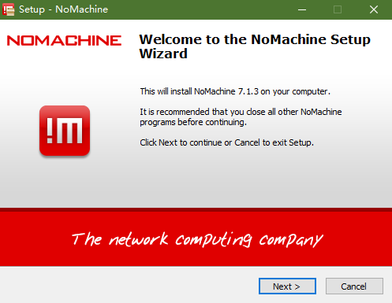


(2) Tick “**I accept the agreement**” and set the language as English.


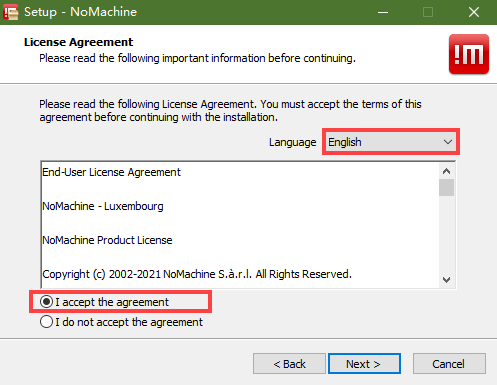


(3) Select the folder to install the software, then click “**Next**”.


(4) Please wait until the installation ends. Later on, the window will pop up, then click “**Finish**”.


(5) After complete installation, click “**Yes**” to restart the computer in the pop-up window. Please don’t skip this step!


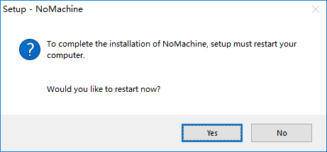


**4. Device Connection**


(1) The default network connection mode is AP Direct Connection Mode. Boot up JetHexa, and it will generate a Wi-Fi starting with HW after booting up. And you can search this Wi-Fi on your computer.


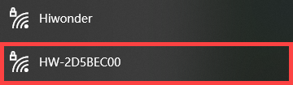


(2) Open NoMachine, and then double click JetHexa icon. Or you can enter “**192.168.149.1**” in the search box and then double click the corresponding icon.


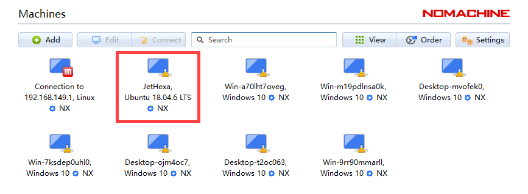


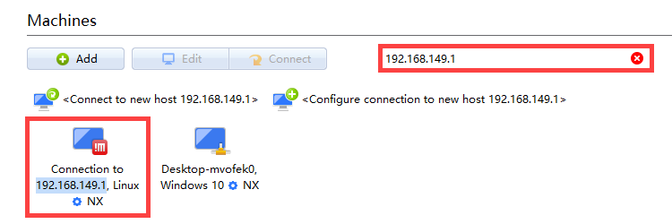


(3) Then, you will be asked to enter the Username and Password. The username is “**hiwonder**” and password is “**hiwonder**”. Having typed, tick “**Save this password**” and click “**Login**”. Later, keep selecting “**OK**” in the subsequent pop-up windows. Lastly, Jetson Nano desktop will be displayed on your screen.


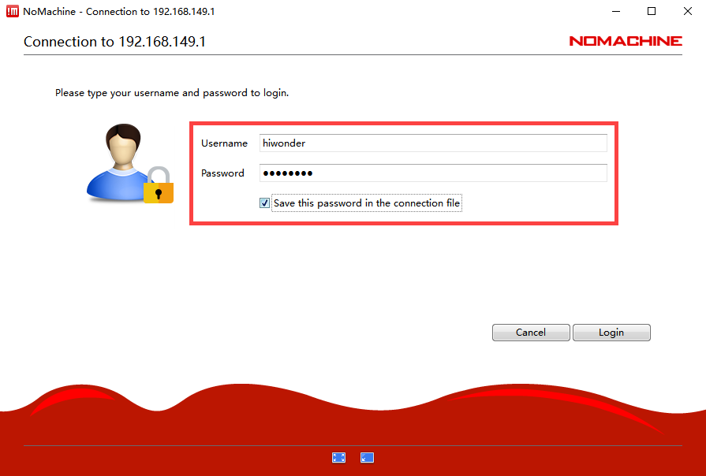


(4) If warning dialog box occurs, just click “**Cancel**”. (This is normal phenomenon.) If black screen appears, you can try to reboot up Jetson Nano.


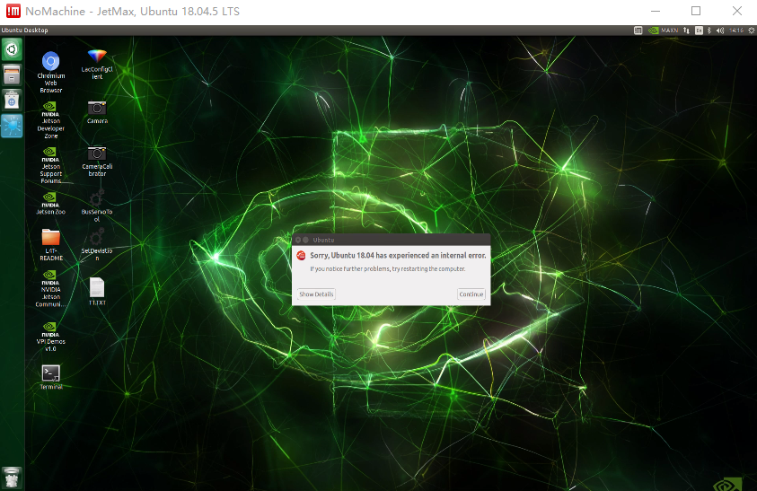


For how to start the games, please refer to the subsequent lessons.


**5. Confirm Device Version**


Ensure the version of the devices on the robot is in line with those set in system image in the first connection. If not, you can follow steps below to change the system image.


(1) The table below list all system image editions. Select the corresponding system image according to the model of Lidar and camera.


| Edition | Starter kit | Standard kit | Advanced kit (G4) | Advanced kit (A1) | Advanced kit (G4) | Advanced kit (A1) |
| --- | --- | --- | --- | --- | --- | --- |
| System image | SetAsBase | SetAsStandard | SetAsStnadradG4 | SetAsStnadradA1 | SetAsPro | SetAsPro_A1 |
| Lidar type | NONE | NONE | YDLIDAR_G4 | RPLIDAR_A1 | YDLIDAR_G4 | RPLIDAR_A1 |
| Camera type | NONE | CSI | CSI | CSI | DABAI | DABAI |


(2) Confirm Lidar and camera model. Double click  to open terminal. Find the content as pictured. The model of Lidar in this system image is G4 Lidar and camera model is Astra Pro DABAI. For example, change Lidar model to A1 Lidar.


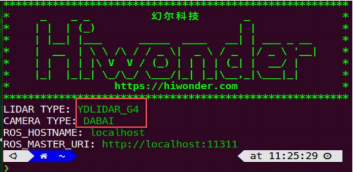


(3) Move to ‘Home\factory’. Double click 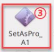 to let robot restart.


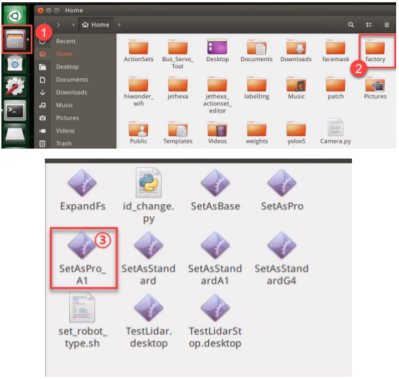


(4) When buzzer on the robot beeps once, robot restarts successfully. Then you can follow ‘**2. Device Connection**’ to operate again.


Note: if robot does not restart after you change system image edition, you can restart robot manually.


(5) Having connected to Jetson Nano system, open terminal to check the edition of system image.


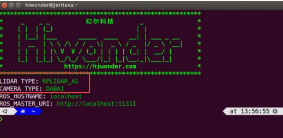


**6. Enable Remote NDIS Compatible Device**


If you are using desktop computer, you use NDIS compatible device for fluent running.


(1) Connect the controller to the computer with the Android cable.


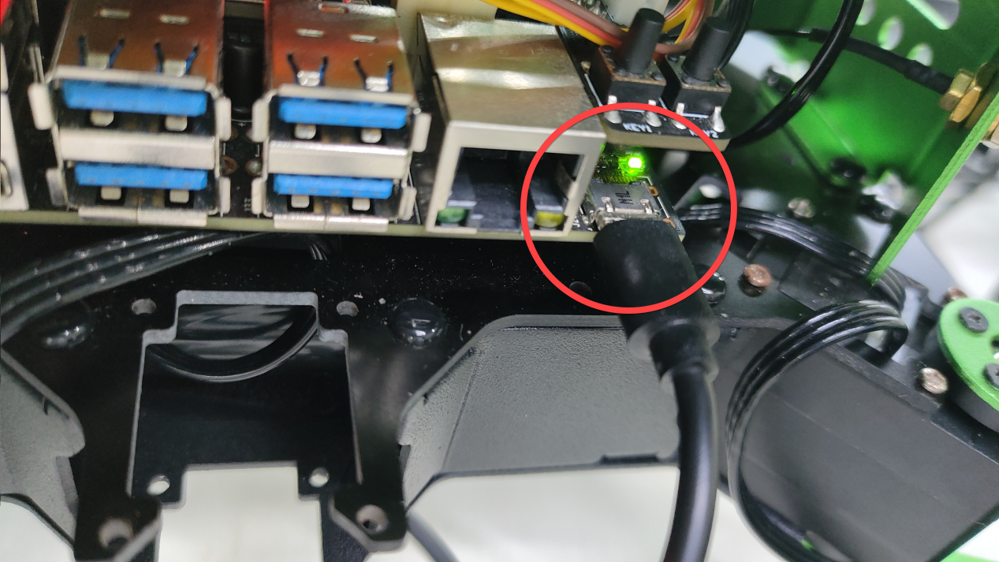


(2) Right click “**This** **Computer**” and then select “**Manage**”.


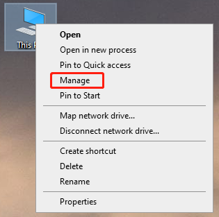


(3) Next, install the NDIS driver. Right click “**Computer**” and select “**Properties**”. Then click “**Device Manager**” to find the NDIS driver and select “**Update driver**”.


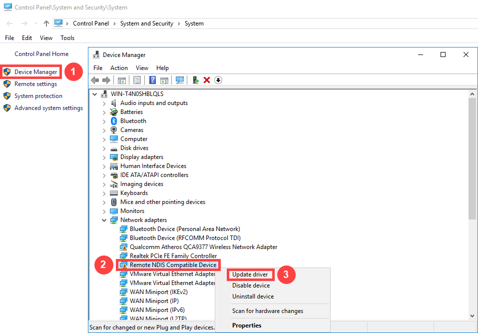


(3) After finishing update, follow step **2. Device Connection** to login the system. **Note: The login address needs to be changed to "192.168.55.1"**.


(7) Solution to Abnormal Resolution


If the screen resolution is abnormal as the picture below shown, this problem can be fixed by sending the following commands.


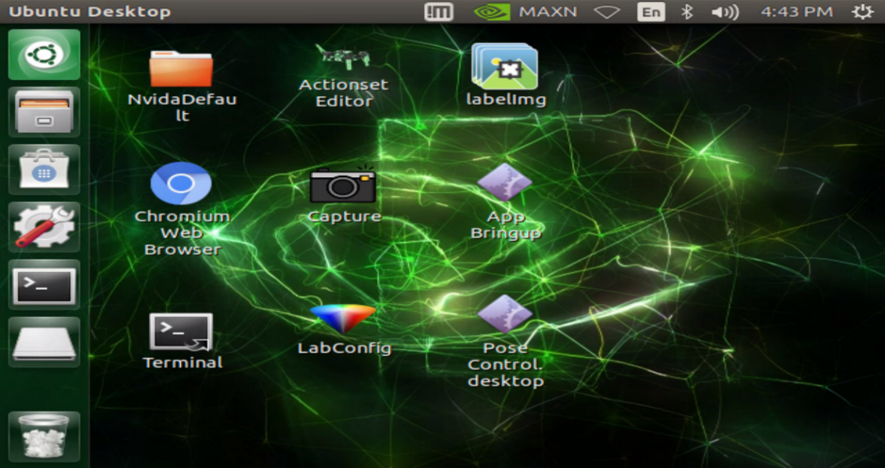


(1) Double click  to open command line terminal.


2)Input command “**rm -rf ~/.bash_history**” and press Enter to delete the history command files.


3)Input “**history -c**” command and press Enter to delete the history record. If it shows that “**History file deleted.**”, the files are deleted successfully.


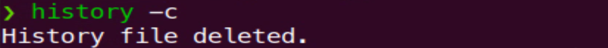


4)Input command “**xrandr --fb 1920x1080**” and press Enter to adjust resolution.


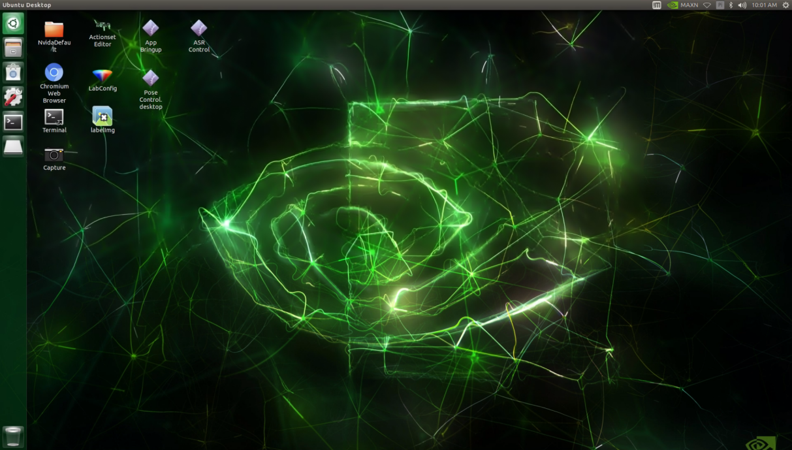


**Note: if the mouse pointer is still abnormal, close NoMachine window, and re-enter the system according to the instruction in “2. Device connection”.**

### 7.1.2 Lesson 2 Tripod Gait Analysis

#### 7.1.2.1 Gait Definition


Gait is the pattern of movement of the limbs of animals. Generally speaking, it is used to describe how the animal walks. The common hexapod gaits include Tripod and Ripple.


The explanations for words used to describe the gait are listed below.


| **Word** | **Explanation** |
| --- | --- |
| phase | Interpreted as Angle which indicates the position in cyclic motion. |
| phase difference | The angle difference between two motion position |
| swing phase | When the legs are lifted, the body is without support. |
| support phase | The legs touch the ground |
| cycle | The legs in one side from first to next touching ground is a cycle |
| gait frequency | The number of completed cycle per unit time |
| step length | The motion distance of the leg between lifting and touching ground in one cycle |
| stride length | The motion distance of the body in one cycle |
| Duty ratio | The ratio of the duration of one leg on ground to the gait cycle. |


#### 7.1.2.2 Tripod Gait Definition


Tripod gait is the classic gait adopted by Hexapod robot to realize walking. Generally, “Hexapod” insect doesn’t walk with 6 legs at the same time, but with 3 legs in tripod structure for the reason that tripod structure can keep the robot body stationary. Its 6 legs are separated into two groups and one group consists of 3 legs.


At present, most Hexapod robots on the market are designed with insect-like structure that there are 3 legs in each side of the body, and these 6 legs are divided into 2 groups to from a tripod, and these two groups of legs are employed in sequence to realize the switch between swing phase and support phase, which is called tripod gait. The first group consists of left front leg, left hind leg and right middle leg, and the second group is composed of right front leg, right hind leg and left middle leg.


Under tripod gait, two groups of legs of hexapod robot move alternately, as the figures below shown.


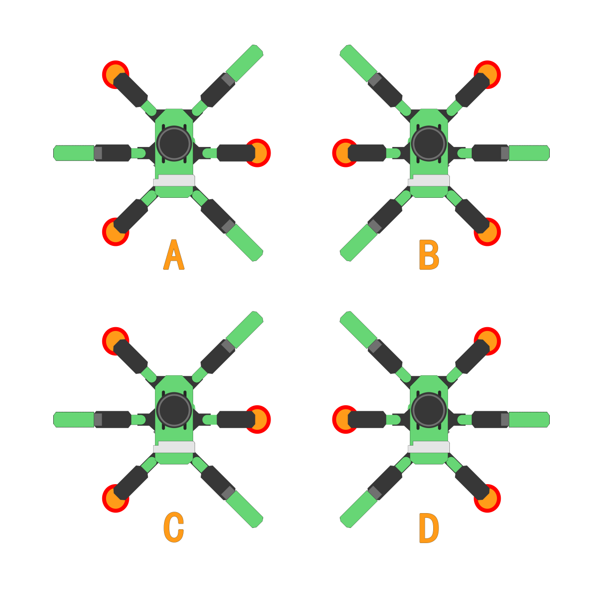


In figure (a), NO. 2, 4 and 6 legs are lifted and swing forward, while NO. 1, 3 and 5 legs keep still to support the body so as to ensure the robot’s center of gravity is at the intersection of the diagonals. At this time, NO. 2, 4 and 6 legs are in swing phase, and NO. 1, 3 and 5 are in support phase.


In figure (b), 6 legs all touch the ground that is they are in support phase. The position of NO. 1, 3 and 5 legs is as before, and NO. 2, 4 and 6 legs moves forward.


In figure (c), on the contrary, NO. 1, 3 and 5 legs are lifted and swing forward, while NO. 2, 4 and 6 legs keep still to support the body so as to ensure the robot’s center of gravity is at the intersection of the diagonals. At this time, NO. 1, 3 and 5 legs are in swing phase, and NO. 2, 4 and 6 are in support phase.


In figure (d), 6 legs all touch the ground that is they are in support phase.


And (a), (b), (c) and (d) movements constitute one complete period of gait.


#### 7.1.2.3 Operation Steps

The input command should be case sensitive, and the keywords can be complemented by “**Tab**” key.


1. Start JetHexa, and then connect it to NoMachine.


2. Double click  or press “**Ctrl+Alt+T**” to open command line terminal.


3. Enter command “**systemctl stop jethexa_bringup**” and press Enter key to stop auto-start program.


4. Input command “**cd jethexa/src/jethexa_tutorial/scripts/**”, and press Enter to enter the directory where the source codes are stored.


5. Input command “**vim simple_control_02_tripod_gait.py**” and press Enter to open source code file.


6. Locate to the codes as shown below.


When “**gait**” is set as “**0**”, the robot will not move. And “**1**” represents ripple gait, and “**2**” represents tripod gait. Set “**gait=2**” to make robot move under tripod gait.


7. After modification, press “Esc” key, input “**:wq**” and press Enter to save and exit the editing.


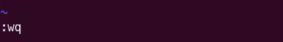


8. Input command “**roslaunch jethexa_tutorial simple_control_02_tripod_gait.launch**” and press Enter to run the program.


9. If want to close this game, please press “**Ctrl+C**”.


#### 7.1.2.4 Program Outcome


After the game starts, JetHexa will move using tripod gait where 6 legs are divided into two groups to move forward for 10s alternately and then stop.


#### 7.1.2.5 Program Parameter


The source code of this program is stored in **/home/hiwonder/jethexa/src/jethexa_tutorial/scripts/simple_control_02.py**


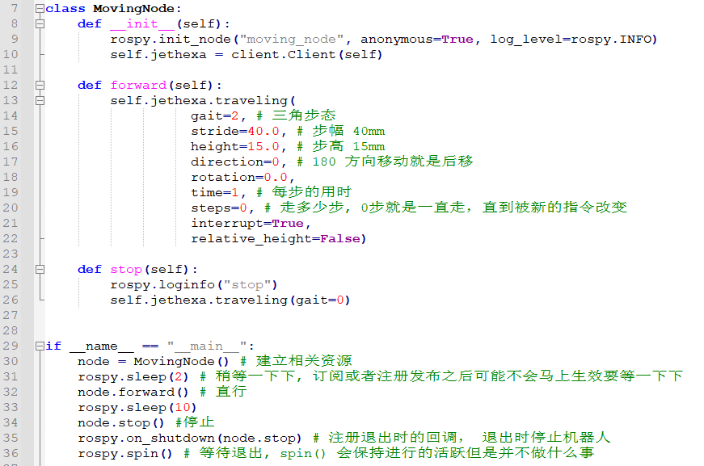


Parameters in traveling function are used to control robot’s motion.


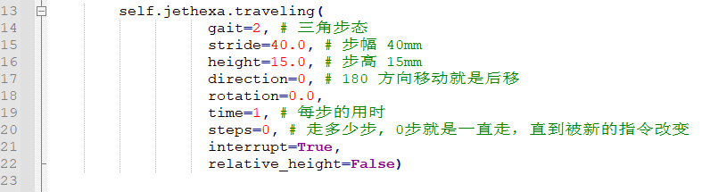


When the first parameter “**gait**” is set as “**0**”, the robot will not move. And “**1**” represents ripple gait, and “**2**” represents tripod gait.


The second parameter “**stride**” ranging from 0 mm to 65mm. Please don’t set the value exceeding this range, otherwise the robot’s movement will be stuck.


The third parameter “**height**” refers to step height ranging from 0 mm to 50mm. Please don’t set the value exceeding this range, otherwise the robot’s movement will be stuck.


The fourth parameter “**direction**” indicates the moving direction ranging from 0 to 360 degree. When it is correct to 0-180 degree, JetHexa will move forward. When the value lies between 180 to 360 degree, JetHexa will move backward.


The fifth parameter “**rotation**” stands for the rotation speed in rad/s. When it belongs to positive number, JetHexa will rotate counterclockwise, otherwise rotate clockwise.


The sixth parameter “**time**” denotes the interval between each step in second.


The seventh parameter “**steps**” is the number of step. When it is set as “**0**”, JetHexa will keep moving.


The eighth parameter “**interrupt**” determines whether to interrupt the robot’s movement.


The ninth parameter “**relative_height**” determines whether the third parameter “**height**” is the height relative to the ground. And “**False**” means it is relative height.

### 7.1.3 Lesson 3 Ripple Gait Analysis

#### 7.1.3.1 Gait Definition


Gait is the pattern of movement of the limbs of animals. Generally speaking, it is used to describe how the animal walks. The common hexapod gaits include Tripod and Ripple.


The explanations for words used to describe the gait are listed below.


| **Word** | **Explanation** |
| --- | --- |
| phase | Interpreted as Angle which indicates the position in cyclic motion. |
| phase difference | The angle difference between two motion position |
| swing phase | When the legs are lifted, the body is without support. |
| support phase | The legs touch the ground |
| cycle | The legs in one side from first to next touching ground is a cycle |
| gait frequency | The number of completed cycle per unit time |
| step length | The motion distance of the leg between lifting and touching ground in one cycle |
| stride length | The motion distance of the body in one cycle |
| Duty ratio | The ratio of the duration of one leg on ground to the gait cycle. |


#### 7.1.3.2 Ripple Gait Definition


Walking mechanism of ripple gait is divided into three steps. Under ripple gait, robot’s two legs will swing to step forward, while the rest four legs will support the body in cycle.


Compared with tripod gait, locomotion speed of ripple gait is lower and the sequence of the legs to swing is different.


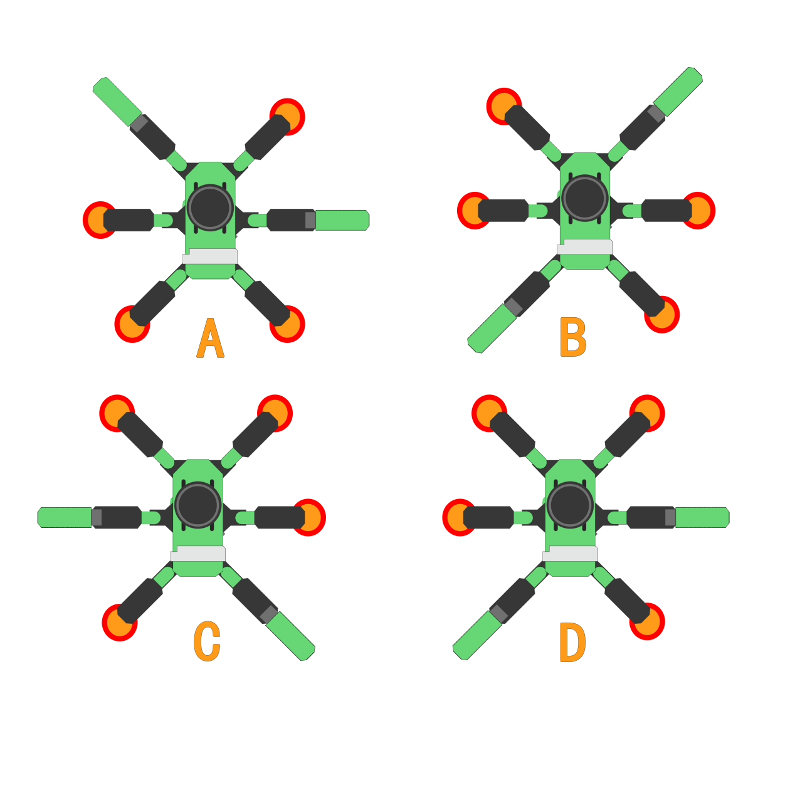

Under ripple gait, robot’s diagonal legs move alternately, as the picture above shown.


In figure A, NO.3 and NO.5 legs are lifted and swing forward, while NO. 1, 2, 4 and 6 legs support the body so as to ensure the robot’s center of gravity is at the intersection of the diagonals. At this time, NO.3 and NO.5 legs are in swing phase, and NO. 1, 2, 4 and 6 legs are in support phase.


In figure B, NO.3 and NO.6 legs are lifted and swing forward, while NO. 1, 2, 4 and 5 legs support the body so as to ensure the robot’s center of gravity is at the intersection of the diagonals. At this time, NO.3 and NO.6 legs are in swing phase, and NO. 1, 2, 4 and 5 legs are in support phase.


In figure C, NO.2 and NO.4 legs are lifted and swing forward, while NO. 1, 3, 5 and 6 legs support the body so as to ensure the robot’s center of gravity is at the intersection of the diagonals. At this time, NO.2 and NO.4 legs are in swing phase, and NO. 1, 3, 5 and 6 legs are in support phase.


In figure D, NO.3 and NO.5 legs are lifted and swing forward, while NO. 1, 2, 4 and 6 legs support the body so as to ensure the robot’s center of gravity is at the intersection of the diagonals. At this time, NO.3 and NO.5 legs are in swing phase, and NO. 1, 2, 4 and 6 legs are in support phase.


#### 7.1.3.3 Operation Steps

The input command should be case sensitive, and the keywords can be complemented by “**Tab**” key.


1. Start JetHexa, and then connect it to NoMachine.


2. Double click  or press “**Ctrl+Alt+T**” to open command line terminal.


3. Enter command “**systemctl stop jethexa_bringup**” and press Enter key to stop auto-start program.


4. Input command “**cd jethexa/src/jethexa_tutorial/scripts/**”, and press Enter to enter the directory where the source codes are stored.


5. Input command “**vim simple_control_02_tripod_gait.py**” and press Enter to open source code file with vim.


6. Locate to the codes as shown below, and modify 14<sup>th</sup> line of code as “**gait = 1**”.


When “**gait**” is set as “**0**”, the robot will not move. And “**1**” represents ripple gait, and “**2**” represents tripod gait. Set “**gait=1**” to make robot move under ripple gait.


7. After modification, press “Esc” key, input “**:wq**” and press Enter to save and exit the editing.


8. Input command “**roslaunch jethexa_tutorial simple_control_02_tripod_gait.launch**” and press Enter to run the program.


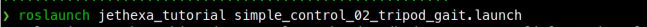


9. If want to close this game, please press “**Ctrl+C**”.


#### 7.1.3.4 Program Outcome


After the game starts, JetHexa will move using ripple gait in which 2 legs are lifted and step forward for 10s each time and then stop. Two legs at diagonal opposite ends of the body work as a group and each group move alternately.


#### 7.1.3.5 Program Outcome


The source code of the program is stored in


**/home/hiwonder/jethexa/src/jethexa_tutorial/scripts/simple_control_02_tripod_gait.py**


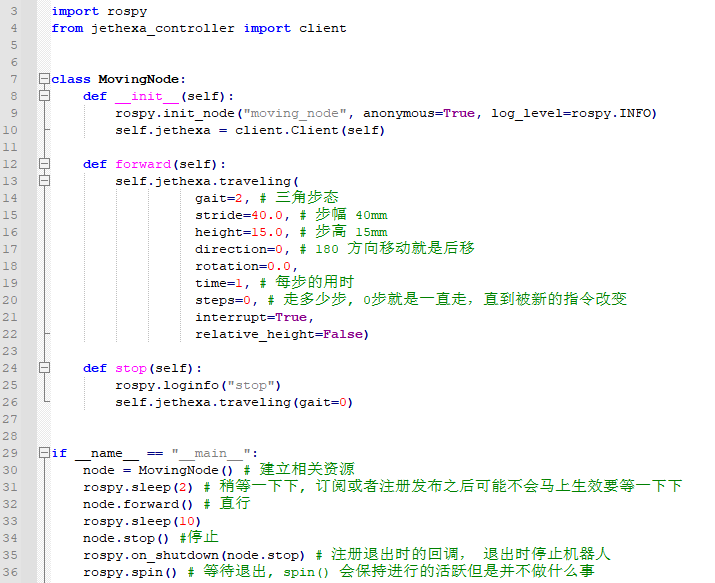


Parameters in traveling function are used to control robot’s motion.


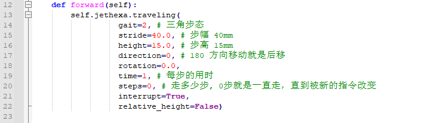


When the first parameter “**gait**” is set as “**0**”, the robot will not move. And “**1**” represents ripple gait, and “**2**” represents tripod gait.


The second parameter “**stride**” ranging from 0 mm to 65mm. Please don’t set the value exceeding this range, otherwise the robot’s movement will be stuck.


The third parameter “**height**” refers to step height ranging from 0 mm to 50mm. Please don’t set the value exceeding this range, otherwise the robot’s movement will be stuck.


The fourth parameter “**direction**” indicates the moving direction ranging from 0 to 360 degree. When it is correct to 0-180 degree, JetHexa will move forward. When the value lies between 180 to 360 degree, JetHexa will move backward.


The fifth parameter “**rotation**” stands for the rotation speed in rad/s. When it belongs to positive number, JetHexa will rotate counterclockwise, otherwise rotate clockwise.


The sixth parameter “**time**” denotes the interval between each step in second.


The seventh parameter “**steps**” is the number of step. When it is set as “**0**”, JetHexa will keep moving.


The eighth parameter “**interrupt**” determines whether to interrupt the robot’s movement.


The ninth parameter “**relative_height**” determines whether the third parameter “**height**” is the height relative to the ground. And “**False**” means it is relative height.


##

### 7.1.4 Lesson 4 Move Straight and Make Turns

For detailed description of ripple gait, you can refer to the file in “**7. Standard Motion Control Lesson-\>1. Basic Control Lesson-\>Lesson 3 Ripple Gait Analysis**”


Based on ripple gait, JetHexa will be controlled to move forward and make turns through modifying the corresponding parameters.


#### 7.1.4.1 Operation Steps

The input command should be case sensitive, and the keywords can be complemented by “**Tab**” key.


**1. Start JetHexa, and then connect to ubuntu desktop through NoMachine.**


**2.** **Click  or press “**Ctrl+Alt+T**” to open command line terminal.**


**3.** **Input the command, “**roslaunch jethexa_tutorial simple_control_03_forward_and_rotate.launch”**, and press Enter to make JetHexa move forward and turn.**


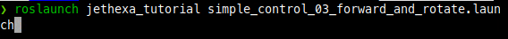


**4.** **If want to close this game, please press “**Ctrl+C**”. If the game cannot be closed, please press the key again.**


#### 7.1.4.2 Program Outcome


Under ripple gait, JetHexa will keep moving forward for 10s. After that, it will keep turning left for 10s, and then stop.


#### 7.1.4.3 Program Parameter


The source code of this program is stored in **/home/hiwonder/jethexa/src/jethexa_tutorial/scripts/simple_control_03_forward_and_rotate.py**


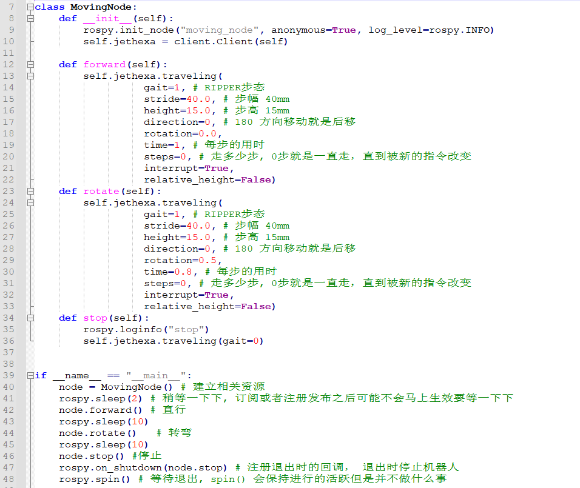


#### 7.1.4.4 Motion Parameter Adjustment


Through setting the corresponding parameters, adjust JetHexa’s moving and turning speed, direction, etc.


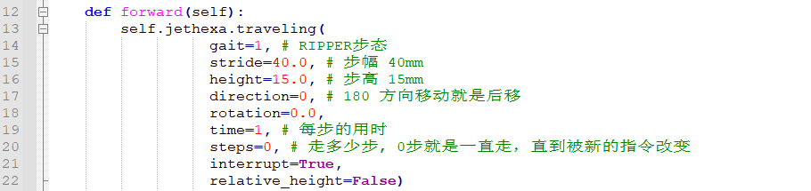


Take moving forward function for example. We mainly set the parameters of traveling function to control robot’s motion. And the meaning of each parameters are as follows.


1. gait：Set the gait mode. “**0**” represents stop, “**1**” stands for ripple gait, and “**2**” indicates tripod gait.


2. stride：Set the motion stride in mm. Please set the stride according to actual situation, otherwise the robot will stumble if the value is set too large.


3. height：Set the lifted height of the legs in mm. Please set the height according to actual situation, otherwise the robot will stumble if the value is set too large.


4. direction：Set the moving direction ranging from 0 to 360 degree. “**0**” indicates moving forward, and “**180**” means moving backward.


5. rotation：Set the rotation speed in radians per second. Positive number is for counterclockwise rotation, and negative number is for clockwise rotation. The robot will stumble if the value is set too large.


6. time：Set the interval between each movement in seconds.


7. steps：Set the number of step in movements and the unit is **step**. “**0**” means that the robot will keep moving.


8. interrupt：Set whether to interrupt the movement. No matter what it is set, “**True**” or “**False**”, the robot movement will not be interrupted.


9. relative：Whether the height set before is relative value. For example, if it is set as True and the height is set as 15, the robot will lift 15% relative to the ground.


#### 7.1.4.5 Motion Time Adjustment


The duration of moving forward and turning can be adjusted through setting the corresponding parameter.


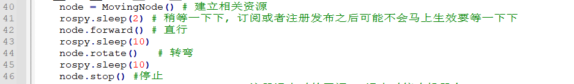


The robot will **move forward** first, and then **rotate**, and lastly will **stop** movement. And sleep function is used to set the duration, in second, between each state.

### 7.1.5 Lesson 5 Move Left or Right

For detailed description of ripple gait, you can refer to the file in “**7. Standard Motion Control Lesson-\>1. Basic Control Lesson-\>Lesson 3 Ripple Gait Analysis**”


Based on ripple gait, JetHexa will be controlled to move left or right through modifying the corresponding parameters.


#### 7.1.5.1 Operation Steps

The input command should be case sensitive, and the keywords can be complemented by “**Tab**” key.


**1. Start JetHexa, and then connect to ubuntu desktop through NoMachine.**


**2. Click  or press “Ctrl+Alt+T” to open command line terminal.**


**3.** **Input command “**roslaunch jethexa_tutorial simple_control_05_move_left_right.launch**”, and press Enter to start the game.**


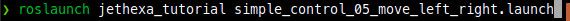


**4.** **If want to close this game, please press “**Ctrl+C**”. If the game cannot be closed, please press the key again.**


#### 7.1.5.2 Program Outcome


Under ripple gait, JetHexa will keep moving left or right


#### 7.1.5.3 Program Parameter


The source code is stored in **/home/hiwonder/jethexa/src/jethexa_tutorial/scripts/simple_control_05_move_left_right.py**


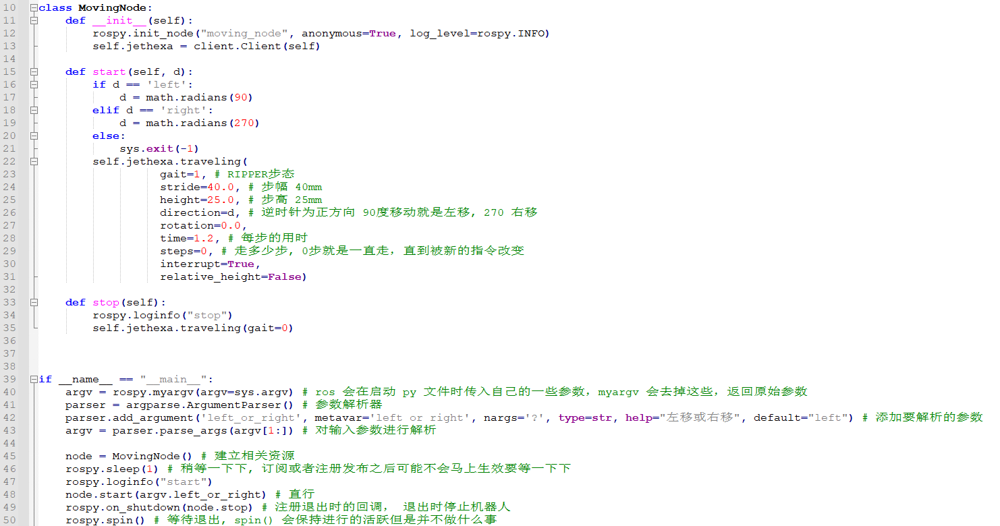


#### 7.1.5.4 Motion Parameter Adjustment


Through setting the corresponding parameters, adjust JetHexa’s speed, direction, etc.


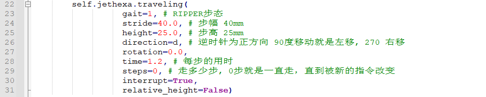


Robot’s movement can be controlled by setting the parameters of traveling function.


1. gait：Set the gait mode. “**0**” represents stop, “**1**” stands for ripple gait, and “**2**” indicates tripod gait.


2. stride：Set the motion stride in mm. Please set the stride according to actual situation, otherwise the robot will stumble if the value is set too large.


3. height：Set the lifted height of the legs in mm. Please set the height according to actual situation, otherwise the robot will stumble if the value is set too large.


4. direction：Set the moving direction ranging from 0 to 360 degree. “**0**” indicates moving forward, and “**180**” means moving backward.


5. rotation：Set the rotation speed in radians per second. Positive number is for counterclockwise rotation, and negative number is for clockwise rotation. The robot will stumble if the value is set too large.


6. time：Set the interval between each movement in seconds.


7. steps：Set the number of step in movements and the unit is **step**. “**0**” means that the robot will keep moving.


8. interrupt：Set whether to interrupt the movement. No matter what it is set, “**True**” or “**False**”, the robot movement will not be interrupted.


9. relative：Whether the height set before is relative value. For example, if it is set as True and the height is set as 15, the robot will lift 15% relative to the ground.


#### 7.1.5.5 Moving Direction Parameter Setting


JetHexa’s moving direction can be adjusted through typing the command and setting the corresponding parameters.


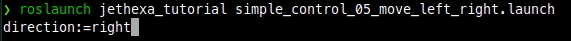


Take the command above for example. Having input the command, press Space key, input parameter “**direction:=right**” and press Enter to make robot move right. You can input “left” or “right” after “**=**”. When the value is none, the robot will move left by default.

### 7.1.6 Lesson 6 Move in Specific Angle

For detailed description of ripple gait, you can refer to the file in “**7. Standard Motion Control Lesson-\>1. Basic Control Lesson-\>Lesson 3 Ripple Gait Analysis**”


Based on ripple gait, JetHexa will be controlled to move in specific angle through modifying the corresponding parameters.


#### 7.1.6.1 Operation Steps

The input command should be case sensitive, and the keywords can be complemented by “**Tab**” key.


1. Start JetHexa, and then connect to ubuntu desktop through NoMachine.


2. Click  or press “Ctrl+Alt+T” to open command line terminal.


3. Input command “**roslaunch jethexa_tutorial simple_control_06_diagonally.launch direction:=45**”, and press Enter to start the game.


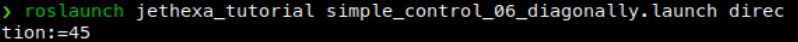


4. If want to close this game, please press “**Ctrl+C**”. If the game cannot be closed, please press the key again.


#### 7.1.6.2 Program Outcome


Under ripple gait, JetHexa will keep moving at a set angle of 45 degree.


#### 7.1.6.3 Program Parameter


The source code is stored in **/home/hiwonder/jethexa/src/jethexa_tutorial/scripts/simple_control_06_diagonally.py**


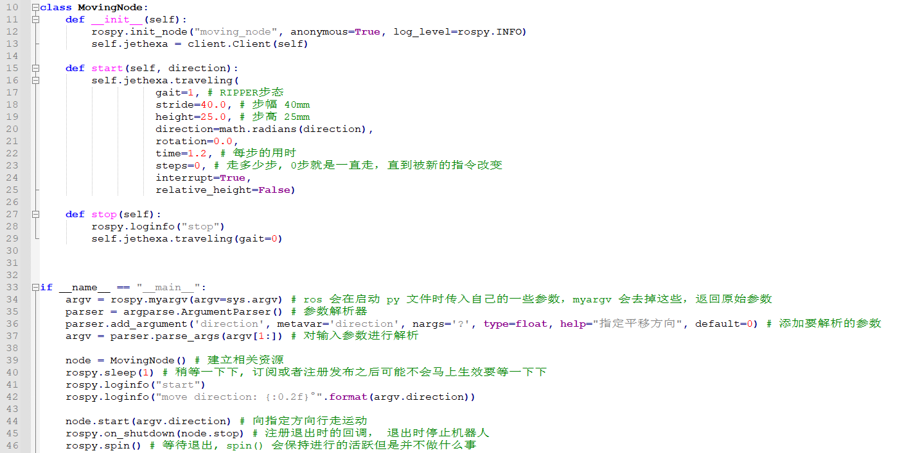


#### 7.1.6.4 Motion Parameter Adjustment


Robot’s movement can be controlled by setting the parameters of traveling function


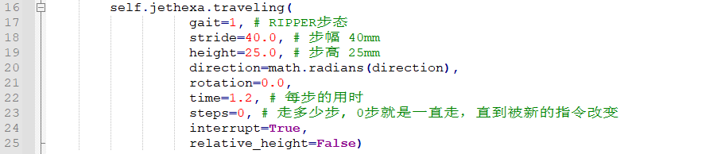


Robot’s movement can be controlled by setting the parameters of traveling function.


1. gait: Set the gait mode. “**0**” represents stop, “**1**” stands for ripple gait, and “**2**” indicates tripod gait.


2. stride: Set the motion stride in mm. Please set the stride according to actual situation, otherwise the robot will stumble if the value is set too large.


3. height: Set the lifted height of the legs in mm. Please set the height according to actual situation, otherwise the robot will stumble if the value is set too large.


4. direction: Set the moving direction ranging from 0 to 360 degree. “**0**” indicates moving forward, and “**180**” means moving backward.


5. rotation: Set the rotation speed in radians per second. Positive number is for counterclockwise rotation, and negative number is for clockwise rotation. The robot will stumble if the value is set too large.


6. time: Set the interval between each movement in seconds.


7. steps: Set the number of step in movements and the unit is **step**. “**0**” means that the robot will keep moving.


8. interrupt: Set whether to interrupt the movement. No matter what it is set, “**True**” or “**False**”, the robot movement will not be interrupted.


9. relative: Whether the height set before is relative value. For example, if it is set as True and the height is set as 15, the robot will lift 15% relative to the ground.


#### 7.1.6.5 Moving Direction Parameter Setting


JetHexa’s moving direction can be adjusted through typing the command and setting the corresponding parameters.


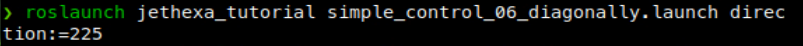


Take the command above for example. Having input the command, press Space key, input parameter “**direction:=225**” and press Enter to make robot move toward the direction of 225 degree. When the value is none, the robot will move in the direction of 0 degree by default.

### 7.1.7 Lesson 7 Basic Communication of ROS Robot

#### 7.1.7.1 Communication Method


Communication between ROS robots is the communication between nodes. There are 2 ways, including topic and service.


Topic adopts Asynchronous Communication Mechanism and use publish/ subscribe model. In this model, publisher transfers the data to subscriber. And there can be multiple publishers or subscribers in one **Topic**.


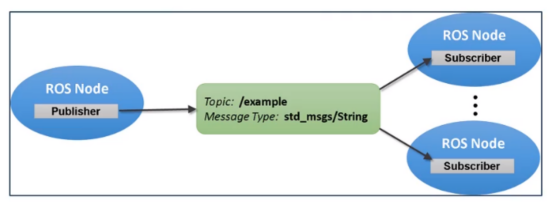


Service adopts Synchronous Communication Mechanism and uses client/ server model. In this model, client will send request, and server will response after processing.


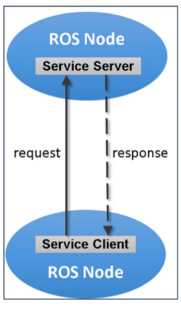


**2. Topic Communication**


#### 7.1.7.2 Check Topic Communication


ROS comes with RQT tool. And we can use the corresponding tool to check the communication between the nodes of JetHexa.


The input command should be case sensitive, and the keywords can be complemented by “**Tab**” key.


**1. Start JetHexa, and then connect to ubuntu desktop through NoMachine.**


**2.** **Click  or press “**Ctrl+Alt+T**” to open command line terminal.**


**3.** **Input command “**roslaunch jethexa_tutorial electronic_module_05_posture.launch**” and press Enter to make JetHexa perform posture detection.**


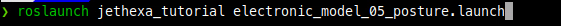


**4.** **Open a new command line terminal, and type the command “**rqt_graph**” and press Enter to enable the tool.**


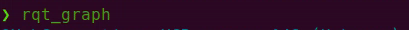


**5.** **Find the codes as the figure below shown, and set it as “**Nodes/Topics(all)**”**


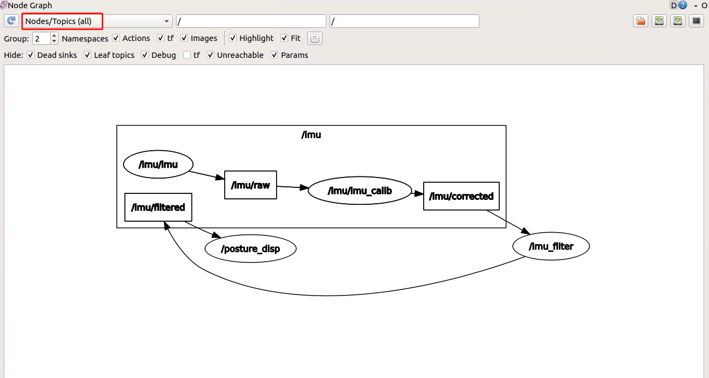


The communication flow chart about **Posture Detection and Information Display** is displayed on the interface. Topics are in the frame, and nodes are in ellipse.


#### 7.1.7.3 Analysis of Topic Communication


For better understanding, let’s take the process of **Posture Detection and Information Display** and as example for analysis.


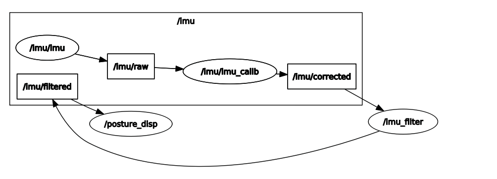


The communication process is as follow.


**1.** **“**/imu/imu**” node publishes “**/imu/raw**” topic.**


**2.** **“**/imu/imu_callb**” node subscribes “**/imu/raw**” topic published by “**/imu/imu**” node, and publish “**/imu/corrected**” topic simultaneously.**


**3.** **“**/imu_filter**” node subscribes “**/imu/corrected**” topic published by “**/imu/imu_callb**” node, and publish “**/imu/filtered**” topic simultaneously.**


**4.** **“**/posture_disp**” node subscribe “**/imu/filtered**” published by “**/imu_filter**” node.**


#### 7.1.7.4 Service Communication


We can check the service communication of JetHexa on the file “**jethexa_controller_main.py**”.


The file is stored in **“/home/hiwonder/jethexa/src/jethexa_controller/jetspider_controller/scripts/jethexa_controller_main.py”.**


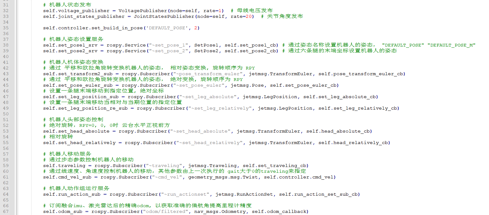


In this file, we can find that “**set_pose_1”, “set_pose_2”, “pose_transform_euler”, “set_pose_euler”** and **“set_leg_absolute”** requests are mainly sent in service communication.


| **Service** | **Function** |
| --- | --- |
| set_pose_1 | set the robot posture by typing the specific posture name |
| set_pose_2 | set the robot posture through the coordinate of its feet |
| pose_transform_euler | change robot’s relative posture through translation and Euler Angle rotation |
| set_pose_euler | change robot’s absolute posture through translation and Euler Angle rotation |
| set_leg_absolute | Set one foot to move to the designated coordinate that is absolute coordinate. |
| set_leg_relatively | Set one foot to move to the designated position relative to the current position. |
| set_head_absolute | Set the posture of the robot head. The value is absolute. |
| set_head_relatively | Set the posture of the robot head. The value is relative. |
| traveling | Control robot’s movement through adjusting the gait parameters |
| cmd_vel | Control robot’s movement through adjusting linear velocity and angular velocity. Other parameters are designated by traveling function. |
| run_actionset | Service about running robot action group |
| odom/filtered | Accurate odom after integrating imu and lidar to obtain accurate yaw angle so as to improve Odometer accuracy. |

### 7.1.8 Lesson 8 PC Software Control

#### 7.1.8.1 Open PC Software


Extract the PC software to any English path, then find the application below and open it. (Please turn off the firewall before opening the application)


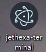


#### 7.1.8.2 PC Software Connection


1. Turn on JetHexa


2. Please wait for JetHexa to boot up successfully. Then connect your computer to the WiFi starting with HW. **Note:** if you are using desktop computer, wireless network card is required.


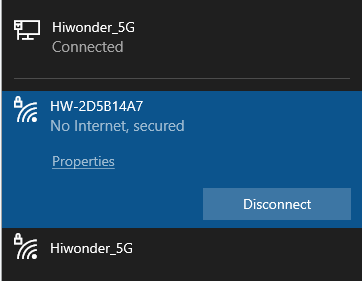


3. Connect to ubuntu desktop through NoMachine. Having entered ubuntu desktop, click  or press “**Ctrl+Alt+T**” to open command line terminal.


4. Input command “**roslaunch jethexa_bringup base.launch**” and press Enter to enable the basic service.


5. Next, open PC software, and click “**connect**”. And it takes a while to complete connection, and please be patient.


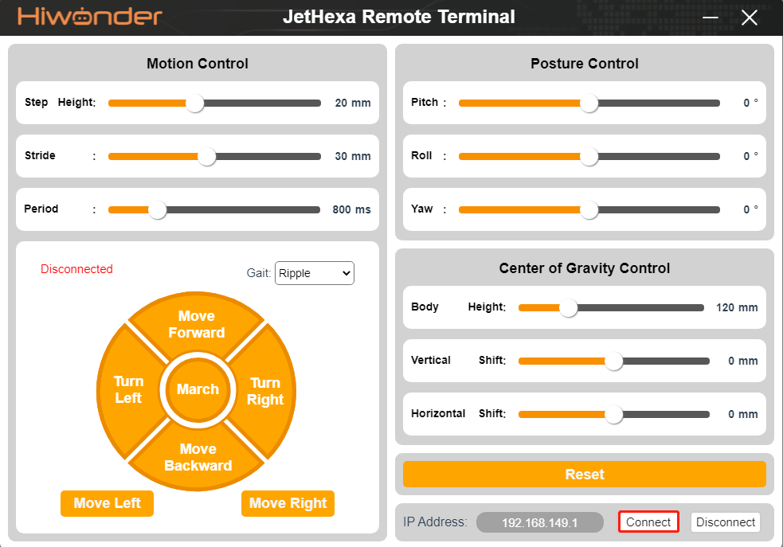


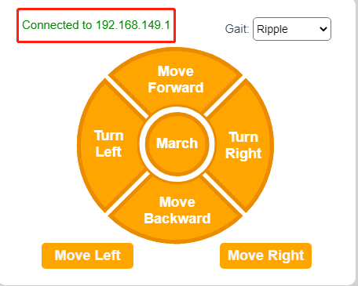


#### 7.1.8.3 Interface Layout


**Note: it is normal that there is no reaction when you click the buttons on PC software for the first time. And you need to long press the buttons to make JetHexa keep moving.**


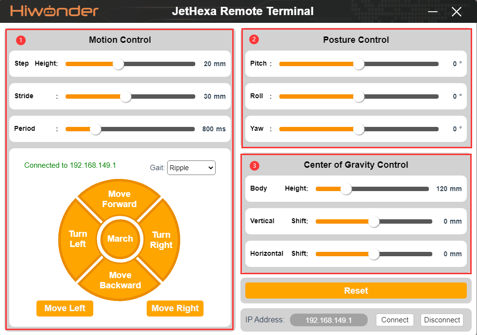


#### 7.1.8.4 **Motion Control Area**


| **Icon** | **Function** |
| --- | --- |
|  | The maximum lifted height of foot during walking in mm |
|  | Robot’s stride during movement in mm |
|  | Time taken to complete one gait in ms |
|  | Switch between Wave and Tripod gait. |
|  | Buttons for motion control. Click the button or press corresponding key to realize control |


#### 7.1.8.5 **Posture Control Area**


| Icon | Function |
| --- | --- |
|  | Angle for JetHexa to look up and down. When it is positive, JetHexa will look up. When it is negative, JetHexa will look down. The greater the absolute value, the larger the pitch angle. |
|  | Angle of left and right tilt. When it is positive, JetHexa will tilt to right. When it is negative, JetHexa will tilt to left. The greater the absolute value, the greater it tilts. |
|  | Body twisting angle. The greater the value, the greater it twists. When it is positive number, JetHexa will twist to left. When it is negative number, JetHexa will twist to right. |


#### 7.1.8.6 **Center of Gravity Control**


| **Icon** | **Function** |
| --- | --- |
|  | Adjust the height of robot in mm |
|  | When it is positive number, JetHexa’s body will lean forward. When it is negative number, JetHexa’s body will lean backward. |
|  | When it is positive number, JetHexa’s body will lean to left. When it is negative number, JetHexa’s body will lean to right. |

## 7.2 Advanced Control Lesson

### 7.2.1 Lesson 1 Speed Adjustment

For detailed description of wave gait, you can refer to the file in “**7. Standard Motion Control Lesson-\>1. Basic Control Lesson-\>Lesson 3 Hexapod Wave Gait Analysis**”


Based on wave gait, JetHexa’s moving forward speed through modifying the corresponding parameters


#### 7.2.1.1 Operation Steps

The input command should be case sensitive, and the keywords can be complemented by “**Tab**” key.


**1. Start JetHexa, and then connect to ubuntu desktop through NoMachine.**


**2.** **Click  or press “**Ctrl+Alt+T**” to open command line terminal.**


**3.** **Input command “**roslaunch jethexa_tutorial advanced_control_01_speed_control.launch**” and press Enter to start the game.**


**4.** **If want to close this game, please press “**Ctrl+C**”. If the game cannot be closed, please press the key again.**


#### 7.2.1.2 Program Outcome


Under wave gait, JetHexa will move forward with stride of 40 and interval of 0.8.


#### 7.2.1.3 Program Parameter


The source code is stored in **/home/hiwonder/jethexa/src/jethexa_tutorial/scripts/advanced_control_01_speed_control.py**


#### 7.2.1.4 Motion Parameter Adjustment


Robot’s movement can be controlled by setting the parameters of traveling function


Robot’s movement can be controlled by setting the parameters of traveling function.


1. gait: Set the gait mode. “**0**” represents stop, “**1**” stands for wave gait, and “**2**” indicates tripod gait.


2. stride: Set the motion stride in mm. Please set the stride according to actual situation, otherwise the robot will stumble if the value is set too large.


3. height: Set the lifted height of the legs in mm. Please set the height according to actual situation, otherwise the robot will stumble if the value is set too large.


4. direction: Set the moving direction ranging from 0 to 360 degree. “**0**” indicates moving forward, and “**180**” means moving backward.


5. rotation: Set the rotation speed in radians per second. Positive number is for counterclockwise rotation, and negative number is for clockwise rotation. The robot will stumble if the value is set too large.


6. time: Set the interval between each movement in seconds.


7. steps: Set the number of step in movements and the unit is **step**. “**0**” means that the robot will keep moving.


8. interrupt: Set whether to interrupt the movement. No matter what it is set, “**True**” or “**False**”, the robot movement will not be interrupted.


9. relative: Whether the height set before is relative value. For example, if it is set as True and the height is set as 15, the robot will lift 15% relative to the ground.


#### 7.2.1.5 Speed Parameter Setting


JetHexa’s speed can be adjusted through typing the command and setting the corresponding parameters.


Take the commands above for example. Having input the command, press Space key, input parameter “**period:=1 stride:=50**”, and press Enter to make robot move forward with the stride of 50 and interval of 1s. And “**period**” stands for interval between steps and “**stride**” represents step length. When the value is none, the stride is 40 and period is 0.8 by default.


#### 7.2.1.6 Function Extension


Apart from adding the parameter at the end of the command, you can modify the program to change JetHexa’s speed. For example, change the value of “**stride**” and “**time**” to slow down JetHexa.


1. Double click  to open command line terminal.


2. Input command “**cd jethexa/src/jethexa_tutorial/scripts/**” and press Enter to enter the directory where the code files are kept.


3. Input command “**vim advanced_control_01_speed_control.py**” and press Enter to open the file


4. Locate the following code.


“**period**” means the interval between each step. And the default setting is “**stride=40**” and “**period=0.8**”. To slow down JetHexa, you can increase the value of stride and period, for example “**stride=55**”and “**period=1**”.


5. After modification, press “**Esc**”, input “**:wq**” and press Enter to save and exit the editing.


6. Input command “**roslaunch jethexa_tutorial advanced_control_01_speed_control.launch**” and press Enter to run the program.


7. If you need to close the game, you can press “**Ctrl+C**”

### 7.2.2 Lesson 2 Polyline Movement

For detailed description of wave gait, you can refer to the file in “**7. Standard Motion Control Lesson-\>1. Basic Control Lesson-\>Lesson 3 Hexapod Wave Gait Analysis**”


Based on wave gait, JetHexa’s direction can be adjusted through modifying the corresponding parameters.


#### 7.2.2.1 Operation Steps


he input command should be case sensitive, and the keywords can be complemented by “**Tab**” key.


**1. Start JetHexa, and then connect to ubuntu desktop through NoMachine.**


**2.** **Click  or press “**Ctrl+Alt+T**” to open command line terminal.**


**3.** **Input command “**roslaunch jethexa_tutorial advanced_control_02_f_line.launch**” and press Enter to start the game**


**4.** **If want to close this game, please press “**Ctrl+C**”. If the game cannot be closed, please press the key again.**


#### 7.2.2.2 Program Outcome


Under wave gait, JetHexa will move forward left for 4 seconds, and then move forward right for 4 seconds and cycle in this form.


#### 7.2.2.3 Program Parameter


The source code is stored in **/home/hiwonder/jethexa/src/jethexa_tutorial/scripts/advanced_control_02_f_line.py**


Robot’s speed and direction can be adjusted by setting the corresponding parameters of **traveling** function. The explanation for these parameters are as follow.


1. gait: Set the gait mode. “**0**” represents stop, “**1**” stands for wave gait, and “**2**” indicates tripod gait.


2. stride: Set the motion stride in mm. Please set the stride according to actual situation, otherwise the robot will stumble if the value is set too large.


3. height: Set the lifted height of the legs in mm. Please set the height according to actual situation, otherwise the robot will stumble if the value is set too large.


4. direction: Set the moving direction ranging from 0 to 360 degree. “**0**” indicates moving forward, and “**180**” means moving backward.


5. rotation: Set the rotation speed in radians per second. Positive number is for counterclockwise rotation, and negative number is for clockwise rotation. The robot will stumble if the value is set too large.


6. time: Set the interval between each movement in seconds.


7. steps: Set the number of step in movements and the unit is **step**. “**0**” means that the robot will keep moving.


8. interrupt: Set whether to interrupt the movement. No matter what it is set, “**True**” or “**False**”, the robot movement will not be interrupted.


relative: Whether the height set before is relative value. For example, if it is set as True and the height is set as 15, the robot will lift 15% relative to the ground.


#### 7.2.2.4 Function Extension


Through modifying the program, JetHexa’s direction can be changed. Modify “**a**” parameter to change the direction of the robot movement.


1. Double click  to open command line terminal.


2. Input command “**cd jethexa/src/jethexa_tutorial/scripts/**” and press Enter to enter the directory where the code files are kept.


3. Input command “**vim advanced_control_02_f_line.py**” and press Enter to open the file


4. Locate the following code.


“**direction**” is set as “**0**” by default. And “**a**” in the list is called by “**direction**”, so you can modify “**\[45，360-45\]**” as other value, such as “**\[60，-60\]**”


5. After modification, press “**Esc**”, input “**:wq**” and press Enter to save and exit the editing.


6. Input command “**roslaunch jethexa_tutorial advanced_control_02_f_line.launch**” and press Enter to run the program.


7. If you need to close the game, you can press “**Ctrl+C**”

### 7.2.3 Lesson 3 Rectangular Movement

For detailed description of wave gait, you can refer to the file in “**7. Standard Motion Control Lesson-\>1. Basic Control Lesson-\>Lesson 3 Hexapod Wave Gait Analysis**”


Based on wave gait, the size of the rectangle can be adjusted through modifying the corresponding parameters.


#### 7.2.3.1 Operation Steps

The input command should be case sensitive, and the keywords can be complemented by “**Tab**” key.


**1. Start JetHexa, and then connect to ubuntu desktop through NoMachine.**


**2.** **Click  or press “**Ctrl+Alt+T**” to open command line terminal.**


**3.** **Input command “**roslaunch jethexa_tutorial advanced_control_03_squared.launch**” and press Enter to start the game**


**4.** **If want to close this game, please press “**Ctrl+C**”. If the game cannot be closed, please press the key again.**


#### 7.2.3.2 Program Outcome


Under wave gait, JetHexa will move toward the direction of 0 degree, 90 degree, 180 degree and 270 degree in sequence.


#### 7.2.3.3 Program Parameter


The source code is saved in **/home/hiwonder/jethexa/src/jethexa_tutorial/scripts/advanced_control_03_squared.py**


JetHexa’s speed, direction, etc., can be adjusted through setting the corresponding parameter.


We mainly set the parameters of **traveling** function to control JetHexa’s movement.


1. gait: Set the gait mode. “**0**” represents stop, “**1**” stands for wave gait, and “**2**” indicates tripod gait.


2. stride: Set the motion stride in mm. Please set the stride according to actual situation, otherwise the robot will stumble if the value is set too large.


3. height: Set the lifted height of the legs in mm. Please set the height according to actual situation, otherwise the robot will stumble if the value is set too large.


4. direction: Set the moving direction ranging from 0 to 360 degree. “**0**” indicates moving forward, and “**180**” means moving backward.


5. rotation: Set the rotation speed in radians per second. Positive number is for counterclockwise rotation, and negative number is for clockwise rotation. The robot will stumble if the value is set too large.


6. time: Set the interval between each movement in seconds.


7. steps: Set the number of step in movements and the unit is **step**. “**0**” means that the robot will keep moving.


8. interrupt: Set whether to interrupt the movement. No matter what it is set, “**True**” or “**False**”, the robot movement will not be interrupted.


9. relative: Whether the height set before is relative value. For example, if it is set as True and the height is set as 15, the robot will lift 15% relative to the ground.


#### 7.2.3.4 Function Extension


Through modifying the program, the size of the rectangle generated by JetHexa’s movement. Modify the movement duration to change the size of the rectangle . For example, prolong the duration to enlarger the rectangle.


1. Double click  to open command line terminal.


2. Input command “**cd jethexa/src/jethexa_tutorial/scripts/**” and press Enter to enter the directory where the code files are kept.


3. Input command “**vim advanced_control_03_square.py**” and press Enter to open the file


4. Locate the following code.


rospy.sleep(3) represents that the duration is 3s. And you can modify “**3**” as “**5**” to change the size the rectangle.


5. After modification, press “**Esc**”, input “**:wq**” and press Enter to save and exit the editing.


6. Input command “**roslaunch jethexa_tutorial advanced_control_02_f_line.launch**” and press Enter to run the program.


7. If you need to close the game, you can press “**Ctrl+C**”

## 7.3 Inverse Kinematics Control Lesson

### 7.3.1 Lesson 1 Build Coordinate System

#### 7.3.1.1 Coordinate System Introduction


Input the coordinates of JetHexa’s 6 feet to output the rotation angle of all servos with inverse kinematics calculation so as to control JetHexa’s movement.


And the first step is to establish JetHexa’s coordinate system. When establishing the coordinate system, take the center of JetHexa as the origin (0,0,0) of the coordinate system. With robot itself as the first person perspective, positive x-axis points front, positive Y-axis points left and positive Z-axis points top, as the picture below shown.


Only X,Y and Z axis values of JetHexa’s six feet need to be set.


#### 7.3.1.2 Coordinate Illustration


For better understanding, take the coordinates under JetHexa’s initial posture for example.


The source code is saved in **/home/hiwonder/jethexa/src/jethexa_controller/jetspider_controller/src/jethexa_controll er/bulid_in_pose.py**


The program defines three initial coordinates and height.


The position of NO.4 and NO.7 servos is as the picture shown.


1. (**X1,Y1**) refers to the offset from the rotation shaft of NO.5 servo to the center of the robot.


2. **(X2,Y2)** is the offset from the rotation shaft of NO.11 servo to the center of the robot.


3. **(INITIAL_X,INITIAL_Y)** is the offset from each foot to the rotation shaft of the innermost servo.


4. **INITIAL_HEIGHT** is the vertical height offset from each foot to the center of the robot


Under initial posture, the position of 6 legs are calculated from the above three initial coordinates and heights. The first coordinate refers to the foothold of NO.1 leg. JetHexa’s legs are numbered as the picture shown.


1. **NO.1 leg**：（163.6，170.805，-60）


2. **NO.2 leg**：（0，193.535，-60）


3. **NO.3 leg**：（-163.6，170.805，-60）


4. **NO.4 leg**：（-163.6，-170.805，-60）


5. **NO.5 leg**：（0，-193.535，-60）


6. **NO.6 leg**：（163.6，-170.805，-60）

### 7.3.2 Lesson 2 Inverse Kinematics Analysis

#### 7.3.2.1 Inverse Kinematics Introduction


Inverse kinematics matters in JetHexa’s path planning and control, because whether the inverse kinematics solution is fast and accurate directly affect the precision of JetHexa’s path planing and control. Therefore, fast and accurate inverse kinematics solution is essential.


For JetHexa, what inverse kinematics is that solve the rotation angle of three servos on each leg according to the foot coordinate. The servos distribution is as the picture shown.


The process of inverse kinematics calculation is divided into two steps.


1. The position of the leg can be calculated according to the foot coordinate so as to obtain the rotation angle of the corresponding servo.


2. The corresponding value can be calculated through the rotation angle of servo to control the servo directly.


#### 7.3.2.2 Case Analysis


#### 7.3.2.3 Storage Path of Source Code


For better understanding, we will combine program control and inverse kinematics to analyze.


The source code of this program is stored in **/home/hiwonder/jethexa/src/jethexa_tutorial/scripts/advanced_control_ik_01.py**


#### 7.3.2.4 Operation Steps

The input command should be case sensitive, and the keywords can be complemented by “**Tab**” key.


**1. Start JetHexa, and then connect to ubuntu desktop through NoMachine.**


**2.** **Click  or press “**Ctrl+Alt+T**” to open command line terminal.**


**3.** **Input command “**roslaunch jethexa_tutorial advanced_control_ik_01.launch**” and press Enter to start the game**


**4.** **If want to close this game, please press “**Ctrl+C**”. If the game cannot be closed, please press the key again.**


#### 7.3.2.5 Program Outcome


After the game starts, NO.2 leg of JetHexa will contract and stretch three times according to the set coordinate. And the rotation angle of the servo will be printed on the terminal.


#### 7.3.2.6 Program Analysis


**set_leg_position** function is used to control servos on legs.


Take “**joints = self.jethexa.set_leg_position(2, (0, 140, -50), 2)**” for example. The explanation of its parameters is as follow.


- “**joints**” represents the returned rotation angle of the servo.


- “**2**” stands for the serial number of the robot leg.


- “**(0, 140, -50)”** represents the coordinate to which the leg moves. And values in the bracket respectively correspond to X, Y and Z axis value.


- “**2**” represents the time taken for rotation in second.


#### 7.3.2.7 Coordinate Analysis


Establish the coordinate system with robot as the first person perspective and robot center as the origin. As the picture below shown, positive x-axis points front, positive Y-axis points left and positive Z-axis points top.


Take the code “**joints = self.jethexa.set_leg_position(2, (0, 140, -50), 2)**” for example. “**(0, 140, -50)**” represents the coordinate of NO.2 leg, and the unit is mm. According to this coordinate, **set_leg_position** function will calculate the rotation angle of ID 11, 9 and 7 servos on NO.2 leg. And the final result is as the figure shown.


As X axis value is set as 0, NO.11 servo will stay still without rotation.


Under initial posture, Y-axis coordinate of NO.2 feet is around 193. Therefore servo on the direction of Y axis needs to move along the negative Y-axis to 140 position.


Under initial posture, Z-axis coordinate of NO.2 feet is around -60. Therefore servo on the direction of Z axis needs to move along positive Y-axis to -50 position.


### 7.3.3 Lesson 3 Posture Parameter

#### 7.3.3.1 Introduction


Posture parameter of JetHexa refers to the parameters when it keeps still, such as height, pitch angle and roll angle when JetHexa is standing.


Through adjusting the coordinate of its six feet, JetHexa’s posture can be changed. And we need to call “**jethexa.py**” file to set the posture.


This file is stored in **/home/hiwonder/jethexa/src/jethexa_controller/jetspider_controller/src/jethexa_controller/jethexa.py**


#### 7.3.3.2 Parameter Explanation


JetHexa’s posture can be adjusted through setting the parameters.


**transform_pose_2(translate, axis, euler, duration, degrees=True)**


| Parameter | Explanation |
| --- | --- |
| **translate** | The translation of the robot center on each axis in mm. When it is positive number, the robot move toward positive direction. Otherwise, it moves toward negative direction. Too large value that overrides the posture limitation is ineffective. |
| **axis** | The order of three axis of Euler angle. If it is set as “xyz”, the robot will rotate around X, Y and Z in sequence. |
| **euler** | Tuple of Euler angle corresponding to the rotation angle of each axis. The order and length you set needs to be consistent with the former. When it is positive number, robot will rotate counterclockwise. When it is negative number, robot will rotate clockwise |
| **duration** | Time taken for posture transformation in second. |
| **degrees** | Whether to set the unit of Euler angle as degree. When it is set as True, the unit is degree. When it is set as False, the unit is radian. |


Set the parameter as follow, and the robot will move 20mm forward along X-axis and rotate around the axis simultaneously. The robot will rotate around 15 degrees clockwise around the X axis, and then rotate 15 degrees counterclockwise around the Y axis. The whole process will take 2s.


**transform_pose_2((20,0,0),”xyz”, (-15,15,0),2, degrees=True)5**

### 7.3.4 Lesson 4 Walking Height Adjustment

For detailed description of ripple gait, you can refer to the file in “**7. Standard Motion Control Lesson-\>1. Basic Control Lesson-\>Lesson 3 Ripple Gait Analysis**”


Based on ripple gait, modify the corresponding parameters to adjust JetHexa’s body height.


#### 7.3.4.1 Operation Steps

The input command should be case sensitive, and the keywords can be complemented by “**Tab**” key.


**1. Start JetHexa, and then connect to ubuntu desktop through NoMachine.**


**2.** **Click  or press “**Ctrl+Alt+T**” to open command line terminal.**


**3.** **Enter command “**roslaunch jethexa_tutorial advanced_control_ik_04.launch**” and press Enter to start the game.**


**4.** **If want to close this game, please press “**Ctrl+C**”. If the game cannot be closed, please press the key again.**


#### 7.3.4.2 Program Outcome


JetHexa’s body height can be raised and lowered as it is moving forward under ripple gait.


#### 7.3.4.3 Program Parameter


The source code of this program is stored in


**/home/hiwonder/jethexa/src/jethexa_tutorial/scripts/advanced_control_ik_04.py**


#### 7.3.4.4 Parameter Adjustment


JetHexa’s body height is adjusted mainly through the parameters in **transform_pose_2** function.


**transform_pose_2((0, 0, 3), 'xyz', (0,0,0), 0.1)**


1. **(0, 0, 3)**：The translation of the robot center on each axis in mm. **(0, 0, 3)** represents the robot center is lifted 3mm on z axis.


2. **'xyz'**：it refers to the sequence of three axis of euler angle.


3. **(0,0,0)**：Tuple of euler angle. And the sequence of the values are in line with that of “**xyz**”.


4. **0.1**：The time taken for translation, and its unit is second.


#### 7.3.4.5 Modify Body Height

The program is default to raise or lower JetHexa’s height by 60mm in a cycle. And the height is adjusted 20 times a cycle, and is raised or lowered by 3mm for each time. But you can set the height to be raised or lowered for each time as 4mm.


1. Start JetHexa, and then connect to ubuntu desktop through NoMachine.


2. Click  or press “**Ctrl+Alt+T**” to open command line terminal.


3. Input command “**rosed jethexa_tutorial advanced_control_ik_04.py**” and press Enter to open the program file.


4. Press “**i**” key to enter editing mode, and locate the codes framed in the figure below.


5. Modify the translation on Z axis as 4 and -4, and press “Esc”, input “**:wq**” to save and exit editing.


Note: adjustment range under different robot posture is different. Please adjust the value based on the actual posture, otherwise setting the value too large will lead to failure.

### 7.3.5 Lesson 5 Posture Adjustment

For detailed description of ripple gait, you can refer to the file in “**7. Standard Motion Control Lesson-\>1. Basic Control Lesson-\>Lesson 3 Ripple Gait Analysis**”.


Based on ripple gait, modify the corresponding parameters to adjust JetHexa’s body posture.


#### 7.3.5.1 Operation Steps

The input command should be case sensitive, and the keywords can be complemented by “**Tab**” key.


**1. Start JetHexa, and then connect to ubuntu desktop through NoMachine.**


**2.** **Click  or press “**Ctrl+Alt+T**” to open command line terminal.**


**3.** **Enter command “**roslaunch jethexa_tutorial advanced_control_ik_05_body.launch**” and press Enter to start the game.**


**4.** **If want to close this game, please press “**Ctrl+C**”. If the game cannot be closed, please press the key again.**


#### 7.3.5.2 Program Outcome


The whole action is divided into two parts. Firstly, it will rotate 15 degree clockwise around X axis, and 15 degree counterclockwise around Y axis. After that, its body will tilt to its right behind. Then rotate 15 degree around Y axis clockwise, and 15 degree around X axis counterclockwise to make its body return to initial posture.


In the second part, JetHexa will move forward 20mm first, and move left 20mm. After that, its body will tilt to left. Then move backward 20mm, and move right 20mm to make its body return to initial posture.


#### 7.3.5.3 Program Parameter


The source code of this program is stored in：**/home/hiwonder/jethexa/src/jethexa_tutorial/scripts/advanced_control_ik_05_body.py**


#### 7.3.5.4 Explanation of Posture Parameter


JetHexa’s body posture is adjusted mainly through the parameters in **transform_pose_2** function.


**transform_pose_2((x, y, z), axis, (u,v,w), duration, degrees=True)**


1. **(x, y, z)**：The translation of the robot center on each axis in mm. The translation range depends on robot’s posture.


2. **axis**：it refers to the sequence of three axis of euler angle.


3. **(u,v,w)**：Tuple of euler angle. And the sequence of the values are in line with that of three axis of euler angle. When it is set as positive number, JetHexa will rotate counterclockwise. When it is set as negative number, JetHexa will rotate clockwise.


4. **duration**：The time taken for translation, and its unit is second.


5. **degrees：**it determines whether the unit of the angle is degree. When it is set as **True**, its unit is degree, otherwise radian.


#### 7.3.5.5 Modify Body Posture


The sequence of the Euler angles of the first action is “**xyz**”, and you can modify it as “**yxz**”.


1. Start JetHexa, and then connect to ubuntu desktop through NoMachine.


2. Click  or press “**Ctrl+Alt+T**” to open command line terminal.


3. Input command “**rosed jethexa_tutorial advanced_control_ik_05_body.py**” and press Enter to open the program file.


4. Press “**i**” key to enter editing mode, and locate the codes framed in the figure below.


5. Modify ‘xyz’ as ‘**yxz**’, and then press Esc, and input “**:wq**” to save and exit the editing.


### 7.3.6 Lesson 6 Body Twisting

For detailed description of ripple gait, you can refer to the file in “**7. Standard Motion Control Lesson-\>1. Basic Control Lesson-\>Lesson 3 Ripple Gait Analysis**”.


Based on ripple gait, modify the corresponding parameters to control JetHexa to twist its body.


#### 7.3.6.1 Operation Steps

The input command should be case sensitive, and the keywords can be complemented by “**Tab**” key.


**1. Start JetHexa, and then connect to ubuntu desktop through NoMachine.**


**2.** **Click  or press “**Ctrl+Alt+T**” to open command line terminal.**


**3.** **Enter command “**roslaunch jethexa_tutorial advanced_control_ik_06_wave.launch**” and press Enter to start the game.**


**4.** **If want to close this game, please press “**Ctrl+C**”. If the game cannot be closed, please press the key again.**


#### 7.3.6.2 Program Outcome


JetHexa will twist it body back, forth, left and right. At the beginning, the intensity and speed of the twisting will keep increasing. After a period of time, both of them will keep decreasing to make the robot body return to initial posture.


#### 7.3.6.3 Program Parameter


The source code of this program is stored in:


**/home/hiwonder/jethexa/src/jethexa_tutorial/scripts/advanced_control_ik_06_wave.py**


JetHexa’s body posture is adjusted mainly through the parameters in **transform_euler** function in which robot’s posture is transformed through body translation and **euler** angle rotation so as to return new coordinate of the footholds.


**transform_euler(pose,translate, axis,euler, degrees=True)**


1. **pose**：The pose needs to be transformed.


2. **translate**：The translation of the robot center on each axis in mm. The translation range depends on robot’s posture.


3. **axis**：It refers to the sequence of three axis of euler angle.


4. **euler**：Tuple of euler angle. And the sequence and length of the values are in line with that of three axis of euler angle.


5. **degrees：** It determines whether the unit of the angle is degree. When it is set as **True**, its unit is degree, otherwise radian.


#### 7.3.6.4 Change the Twisting Intensity


In the first of the robot movement, robot will twist greatly, and you can make the robot twist mildly.


1. Start JetHexa, and then connect to ubuntu desktop through NoMachine.


2. Click  or press “**Ctrl+Alt+T**” to open command line terminal.


3. Input command “**rosed jethexa_tutorial advanced_control_ik_06_wave.py**” and press Enter to open the program file.


4. Press “**i**” key to enter editing mode, and locate the codes framed in the figure below.


5. Modify the coefficient of the variable i from 0.3 to 0.2, then press Esc key, and enter ":wq" to exit and save editing.


### 7.3.7 Lesson 7 Robot Dancing

For detailed description of ripple gait, you can refer to the file in “**7. Standard Motion Control Lesson-\>1. Basic Control Lesson-\>Lesson 3 Ripple Gait Analysis**”.


Based on ripple gait, program JetHexa to move its body like drawing a circle by modifying the corresponding parameter.


#### 7.3.7.1 Operation Steps

The input command should be case sensitive, and the keywords can be complemented by “**Tab**” key.


**1. Start JetHexa, and then connect to ubuntu desktop through NoMachine.**


**2.** **Click  or press “**Ctrl+Alt+T**” to open command line terminal.**


**3.** **Enter command “**roslaunch jethexa_tutorial advanced_control_ik_07_wave.launch**” and press Enter to start the game.**


**4.** **If want to close this game, please press “**Ctrl+C**”. If the game cannot be closed, please press the key again.**


#### 7.3.7.2 Program Outcome


With its body center as the circle center, JetHexa moves its body to draw a circle. And the size of the circle will keep increasing.


#### 7.3.7.3 Program Parameter


The source code of this program is stored in


**/home/hiwonder/jethexa/src/jethexa_tutorial/scripts/advanced_control_ik_07_wave.py**


#### 7.3.7.4 Posture Parameter


JetHexa’s body posture is adjusted mainly through the parameters in **transform_euler** function in which robot’s posture is transformed through body translation and **euler** angle rotation so as to return new coordinate of the footholds.


**transform_euler(pose,translate, axis,euler, degrees=True)**


1. **pose**：The pose needs to be transformed.


2. **translate**：The translation of the robot center on each axis in mm. The translation range depends on robot’s posture.


3. **axis**：It refers to the sequence of three axis of euler angle.


4. **euler**：Tuple of euler angle. And the sequence and length of the values are in line with that of three axis of euler angle.


5. **degrees：**It determines whether the unit of the angle is degree. When it is set as **True**, its unit is degree, otherwise radian.


#### 7.3.7.5 Change Dancing Range


The default size of the dancing circle ranges from 10 to 50, and you can modify it as “10-30”.


1. Start JetHexa, and then connect to ubuntu desktop through NoMachine.


2. Click  or press “**Ctrl+Alt+T**” to open command line terminal.


3. Input command “**rosed jethexa_tutorial advanced_control_ik_07_wave.py**” and press Enter to open the program file.


4. Press “**i**” key to enter editing mode, and locate the codes framed in the figure below.


5. Modify 50 as 30, and press Esc, and the input “**:wq**” to save and exit the editing.


### 7.3.8 Lesson 8 Body Self-balancing

#### 7.3.8.1 Program Logic


Firstly, the program will initialize the posture parameter of JetHexa to set the posture as medium posture. And confirm whether JetHexa is in the initial posture before detection.


Then, subscribe the topic published by MPU6050 sensor node to obtain and record the posture parameter of JetHexa in real time.


Lastly, reset JetHexa’s pitch angle and roll angle according to the change of posture parameter. Then calculate the rotation angle of the servo through inverse kinematics, and control the servo to rotate to the specific angle to complete self-balancing.


The source code of this program is stored in:


**/home/hiwonder/jethexa/src/jethexa_tutorial/scripts/ros_ai_creative_selfbalancing_02.py**


#### 7.3.8.2 Operation Steps

The input command should be case sensitive, and the keywords can be complemented by “**Tab**” key.


**1. Start JetHexa, and then connect to ubuntu desktop through NoMachine.**


**2.** **Click  or press “**Ctrl+Alt+T**” to open command line terminal.**


**3.** **Enter command “**roslaunch jethexa_tutorial ros_ai_creative_selfbalancing_02.launch**” and press Enter to start the game.**


**4.** **If want to close this game, please press “**Ctrl+C**”. If the game cannot be closed, please press the key again.**


#### 7.3.8.3 Program Outcome


After the game starts, JetHexa will automatically adjust its posture according to the tilt angle of the surface to keep its body horizontal.


#### 7.3.8.4 Program Parameter


JetHexa’s body posture is adjusted mainly through the parameters in **transform_euler** function.


**transform_euler(pose, translate, axis, euler, degrees=True)**


1. **pose**：The pose needs to be transformed.


2. **translate**：The translation of the robot center on each axis in mm. The translation range depends on robot’s posture.


3. **axis**：It refers to the sequence of three axis of euler angle.


4. **euler**：Tuple of euler angle. And the sequence and length of the values are in line with that of three axis of euler angle.


5. **degrees：**It determines whether the unit of the angle is degree. When it is set as **True**, its unit is degree, otherwise radian.

## 7.4 URDF Model and Simulation Lesson

### 7.4.1 Lesson 1 URDF Model Introduction

#### 7.4.1.1 URDF Model Introduction


The Unified Robotic Description Format (URDF) is an XML file format, universal description format, used in ROS to describe all elements of a robot. Robots are usually composed of several linkages and joints that connect two linkages. A robot motion model is that multiple linkages are connected and restricted by each other. And UDRF files describe the relationship between joints and linkages, and their inertial properties, geometric characteristics and collision models.


#### 7.4.1.2 Install URDF Model


1. Input command “**sudo apt update**” to update the package information


2. Input command “**sudo apt-get install ros-melodic-urdf**” to install URDF model.


When messages below occur, the installation is completed.


3. Input command “**sudo apt-get install ros-melodic-xacro**” to install URDF model.


When the hints appear, as below, the installation is finished.


#### 7.4.1.3 Basic Parameters of URDF Model


#### 7.4.1.4 Link


In URDF model, link describes the appearance and physical properties of a rigid component.


The following keywords will be used in editing link action.


\< visual \>：describe the appearance parameters of link, including size, color, shape, etc.


\< inertial\>：describe inertial parameters of link containing dynamics operation of the robot.


\<collision\>：describes the collision properties of link.


#### 7.4.1.5 Joint


**1. In URDF, joint describes the properties of joint kinematics and dynamics, and the position and speed restriction of joint movement.**


2）The following keywords will be adopted in editing joint movements.


```xml
<child_link> reference position of joint that is used to calibrate the absolute position of the joint
<dynamics> describes the physical properties of the movements
<limit> describes the limiting values of movement
```
#### 7.4.1.6 Robot Tag


The complete top tag of robot. \<link\> and \<joint\> tags must be involved in \<robot\> as the picture below shown.


### 7.4.2 Lesson 2 Hexapod URDF Model Introduction

#### 7.4.2.1 RVIZ Introduction


For better understanding of hexapod robot model, we can view the URDF model in RVIZ.


RVIZ is a 3D visualizer for the Robot Operating System (ROS) framework. It can visualize the robot model and display ROS service information. Via RVIZ, you can publish control information so as to monitor and control the robot.


#### 7.4.2.2 Start Simulation System


1）After extracting the virtual machine, import the virtual machine and open the Client.


2）Click “**File-\>Open**” button in sequence.


3）Move to the folder where the virtual machine is extracted, select “**JetHexa_1804.ovf**” and click “**open**”.


4）Click “**import**”.


5）Click “**open this virtual machine**” and wait for the virtual machine to complete opening.


6）Before opening RVIZ, we need to open **gazebo** system. Open Ubuntu system and right click to select “**Open Terminal**”.


7）Input these commands “**roslaunch jethexa_gazebo jethexa_gazebo.launch**” and open **gazebo**.


If the following figure occurs, **gazebo** starts successfully.


8）Input command “**roslaunch jethexa_controller jethexa_controller.launch**” to enable service of controlling hexapod robot.


If these content printed on the terminal, the related service is enabled successfully.


#### 7.4.2.3 Open RVIZ


**1.** **Click  and select “**New Terminal**”.**


**2.** **Input command “**cd ~/jethexa_vm/src/jethexa_description/rviz**” to enter the folder where RVIZ files are stored.**


**3.** **Input command “**rosrun rviz rviz -d ./jethexa.rviz**” to open RVIZ.**


If the following figure appears, RVIZ starts successfully.


#### 7.4.2.4 RVIZ Interface Layout


RVIZ interface is separated into these parts.


#### 7.4.2.5 Hexapod Robot Model Introduction


1）Hexapod robot model is composed of six legs, controller and camera.


2）Each leg is composed of three joints and three linkages.


**4. The head of hexapod robot is comprised of a camera and a joint. A camera can also be seen as a linkage.**


#### 7.4.2.6 URDF Model of Hexapod Robot Analysis


#### 7.4.2.7 Open URDF Model


1）Input command “**cd ~/jethexa_vm/src/jethexa_description/urdf**” and enter the folder where URDF model is saved.


2. Input command “**vim jethexa_description.urdf.xacro**” and open **URDF** model via vim.


If the following messages show up, URDF model of hexapod robot’s legs are opened.


#### 7.4.2.8 URDF Model of Robot Leg Analysis


1）The main body can be considered as a linkage which is connected to the legs by a joint. The codes framed in the picture below describe the position of the joint connecting the main body and the legs.


**2. The codes below describe the position of joint 1 connecting the linkage of legs and the main body, the location of joint 2 connecting the linkages on the robot legs, and define the position of the legs.**


**3. The following codes describe the connection of fibula (linkage) and joint2, the connection of fibula and joint3, as well as define the location of fibula.**


**4. The codes shown in the picture describe the connection of joint3 and tibia, as well as define the position of tibia.**


#### 7.4.2.9 Complete URDF Model of Hexapod Robot


For better understanding, we can reckon that the URDF model of the whole hexapod robot is constructed by connecting six legs to a point. There are three legs on each side of hexapod robot. “**side=R**” or “**side=L**” refers to the three legs on R(right) or L(left) side. “**position=R**”, “**position=M**” or “**position=F**” refers to the front, middle, hind leg on one side. X and Y stand for the position of the corresponding leg.


### 7.4.3 Lesson 3 gazebo Introduction

#### 7.4.3.1 Gazebo Introduction


On simulation software, a realistic virtual physical environment can be rendered to test and experiment how the robot complete the task.


Gazebo is the most commonly used robot simulation software in the ROS system. It can provide high-fidelity physical simulation conditions and a complete set of sensor models. It offers friendly interaction between the simulation environment and the robot, and can improve the robot’s performance in complex environments.


Gazebo supports files in urdf and sdf format which are adopted to describe simulation environment. Hexapod robot adopts urdf model, and the official provides various commonly used models that can be directly used.


#### 7.4.3.2 Gazebo GUI Introduction


1. The Gazebo interface is as follow


| Name | Function |
| --- | --- |
| Menu bar | Configure or modify the parameters of the simulation software and some interactive functions. |
| Tool bar | Provide the most commonly used options for interaction with simulator. |
| Time | Set the time of the virtual space |
| Action bar | Make any operations on the models and modify the parameters. |
| Scene | The main part of the simulator where the simulated model is displayed. |


**2. The functions of different parts are listed below.**

### 7.4.4 Lesson 4 ROS Hexapod Robot Gazebo Simulation

#### 7.4.4.1 Install Virtual Machine


1）After extracting the virtual machine, import the virtual machine and open the Client.


2）Click “**File-\>Open**” button in sequence.


3）Move to the folder where the virtual machine is extracted, select “**JetHexa_1804.ovf**” and click “**open**”.


4）Click “**import**”.


5）Click “**Power on this virtual machine**” and wait for the virtual machine to complete opening.


#### 7.4.4.2 Simulation Software Introduction


1. The GUI of simulation software is as follow.


2. Click the button shown in the figure below to start simulation.


#### 7.4.4.3 Open Simulation Software


1）Right click to select “**Open Terminal**”.


**2.** **Input these commands “**roslaunch jethexa_gazebo jethexa_gazebo.launch**” and open **gazebo**.**


If the following figure occurs, **gazebo** starts successfully.


**3.** **Input command “**roslaunch jethexa_controller jethexa_controller.launch**” to enable service of controlling hexapod robot.**


If these content printed on the terminal, the related service is enabled successfully.


#### 7.4.4.4 Use Simulation Software


1）Input command “**rostopic list**” to open and check the related services of hexapod robot.


**2.** **Input command “**rostopic pub /jethexa_control/traveling**” and press “TAB” key to complement the command.**


And the complete command is as follow.


3）Modify the parameter in green frame as 30.


**3. Then, the robot will start moving.**


## 7.5 PC Software Action Editing Lesson

### 7.5.1 Lesson 1 PC Software Introduction

#### 7.5.1.1 Open PC Software


There are two ways to open JetHexa PC software.


#### 7.5.1.2 Desktop Icon


1. Start JetHexa, and connect it to NoMachine.


2. Double click  on the desktop to open the PC software.


#### 7.5.1.3 Command


1. Start JetHexa, and connect it to NoMachine.


2. Double click  on the desktop to open the command line terminal.


3. Input command “**rosrun jethexa_bringup ros_entry.bash jethexa_actionset_editor/main.py**” and press Enter to open PC software.


#### 7.5.1.4 PC Software Interface Layout


The interface is divided into 4 areas, including servo control area, action list, action group setting area and deviation setting area.


**1. Servo Control Area**


JetHexa’s posture can be adjusted through adjusting the corresponding servo value.


| **Icon** | **Function** |
| --- | --- |
|  | Servo ID |
|  | Used to adjust servo angle within 0-1000 |
|  | Used to adjust servo deviation within -125-125<br>To avoid maloperation, please click “**Read Deviation**” before adjusting the deviation with slider. |


**2. Action List**


The duration and servo parameter of the action are displayed in the action list.


| **Icon** | **Function** |
| --- | --- |
|  | Action number |
|  | The duration of the action |
|  | Angle value of the corresponding servo. You can double click the value to modify |
|  | Run the selected action |


**3. Action Group Setting Area**


| **Icon** | **Function** |
| --- | --- |
|  | The time taken to run the individual action. You can modify the value directly. If the box behind “ms” is ticked, the time will be fixed. |
|  | The total time taken to run the whole action group |
|  | Cut off the power of the servos to let you adjust the rotation angle of the servo manually. |
|  | Combine with , read the current angle of each servo |
|  | Add the current servo value set in the servo control area to the bottom of action list to form a new action |
|  | Delete the selected action in the action list |
|  | Replace the selected servo parameter in the action list with current value set in servo control area. And the **Time** will be substituted by the value set in  |
|  | Insert one action above the selected action in the action list. The value of inserted action is the same as that set in servo control area. And the **Time** is the same as  |
|  | Move the selected action to the previous line |
|  | Move the selected action to the next line |
|  | Run the actions in the action list once. If “**Loop**” is selected, the actions will be ran in loop. |
|  | Open the action group file we want |
|  | Save the actions in the action list to the designated path |
|  | When there are actions on the action list, click this button to link the designated action up with the last action of the previous action group |
|  | Display the saved action groups |
|  | Delete the selected action group file |
|  | (**⚠**) Delete all the action group files. |
|  | Execute the selected action group once |
|  | Stop running action group |


**Note: the action group files are all saved to the path, “/home/hiwonder/ActionSets”.**


**4. Deviation Setting Area**


| **Icon** | **Function** |
| --- | --- |
|  | Read the current servo deviation |
|  | Download the adjusted servo deviation to JetHexa |
|  | Restore the value of all servos in the servo control area to 500. |


**Note: JetHexa’s deviation has been adjusted before delivery.**

### 7.5.2 Lesson 2 Action Editing

In this lesson, an action group will be edited to make JetHexa “**clap**”.


#### 7.5.2.1 Action Editing


1. Start JetHexa, and connect it to NoMachine.


2. Double click  on the desktop to open PC software.


3. For better demonstration, the robot’s legs are numbered as follow.


4. **Action 1:** click “**reset servo**” button to make JetHexa return to initial posture.


5. Modify the time as 500ms, and click “**Add Action**” button to add the initial action to the action list.


The specific parameter of the action group is displayed on the action list.


**Note: please remember to click “Add Action” button after finishing editing an action.**


6. Drag the slider to set the value of ID:8 servo as 300.


7. **Action 2:** modify the value of ID 7, 8, 9 and 10 servos as the picture below shown to enable JetHexa to lift NO. 2 and 5 leg.


8. **Action 3:** Adjust the value as the figure shown to let JetHexa swing NO.2 and 5 legs forward.


**  **


9. **Action 4:** Set the value as pictured below to make NO.2 and 5 legs touch the ground.


10. **Action 5:** repeat action 4 to make the transition smoother and more natural. Set the time as 200ms and click “**Add Action**” button to add this action to the action list.


**  **


11. **Action 6:** raise NO.1 and 6 legs to its chest. Set the value of the corresponding servos as this picture illustrates, then change the time as 700ms, and click “**Add Action**” button.


12. **Action 7:** let NO.1 and 6 legs slightly close together to act like clapping. Set value as below, then modify the time as 400ms, and click “**Add Action**” button.


13. **Action 8:** set the value of ID 1 and 6 servos to separate NO.1 and 6 legs.


14. **Action 9:** let NO.1 and 6 legs slightly close together to act like clapping.


15. **Action 10:** Separate NO.1 and 6 legs


16. **Action 11:** repeat action 10 to make the transition smoother and more natural. Set the time as 200ms and click “**Add Action**” button to add this action to the action list.


17. **Action 12:** Set the value as below to reset NO.1 and 6 legs. Set the time as 500ms, and click “**Add Action**”.


18. **Action 13:** modify the value of ID 7, 8, 9 and 10 servos as the picture below shown to enable JetHexa to lift NO. 2 and 5 leg. Then set the time as 800ms, and click “**Add Action**” button to add this action to the action list.


19. **Action 14:** set the value as follows to make NO.2 and 5 leg swing backward. Then modify the time as 500ms, and click “**Add Action**” button to add this action to the action list.


20. **Action 15:** click “**reset servo**” to make JetHexa return to initial posture. Then click “**Add Action**” to add this action.


All the values of the complete action group are as pictured.


**Note: the values marked in red are the values need to be adjusted in the previous steps.**


#### 7.5.2.2 Save Action


1. For future debugging and management, click “**Save Action Files**” to keep this action group.


2. Select the path, **/home/hiwonder/ActionSets,** where the action group should be stored, and name this action “**clap**”, and then click “**Save**”.


### 7.5.3 Lesson 3 Export and Import Action

There have been some built-in action groups storing in “**/home/hiwonder/ActionSets**”. Besides, you can export and import the action group you want following the instruction below.


#### 7.5.3.1 Export Action Group


**1. Start JetHexa, and connect it to NoMachine. Then insert the U disk to any USB interface on JetHexa.**


**2. Click  to open the file manager.**


**3.** **Move to the directory, “**/home/hiwonder/ActionSets**”, and right click the action you want and select “**copy**” or press “**Ctrl+C**” key to copy the file.**


**4.** **Next, switch to the directory of U disk, and right click the blank area, then select “**Paste**” or press “**Ctrl+V**” to paste the action group file. The action group is exported successfully.**


#### 7.5.3.2 Import Action Group


1. Start JetHexa, and connect it to NoMachine.


2. Insert the U disk with action group files to any USB interface on JetHexa. Later, the file manager window will automatically pop up.


3. Right click the action group file to be imported, and select “**Copy**” or press “**Ctrl+C**” to copy the file.


4. Then switch to the directory “**/home/hiwonder/ActionSets**”, and right click the blank area, then select “**Paste**” or press “**Ctrl+V**” to paste the action group file. The action group is imported successfully.


5. Double click  to open PC software


6. Click “**Open Action Files**” button, then the action group file “**punch.d6a**” is imported.


### 7.5.4 Lesson 4 APP Custom Control

In previous lesson, “**7. Standard Motion Control Lesson-\>5. PC Software Action Editting Lesson-\>Lesson 2 Action Editing**”, action group “**clap**” has been generated. And, with the custom function of the APP, we can make JetHexa execute this action group.


#### 7.5.4.1 Preparation


1. Start JetHexa, and connect it to NoMachine, remote control software.


2. Click  to open the file manager.


3. Enter the folder “**/home/hiwonder/ActionSets**” where the names of all action groups can be checked.


#### 7.5.4.2 Operation Steps


1. Open the APP “**WonderAi**”, then connect to JetHexa. After successful connection, enter “**Robot Performance**”.


**Note: if you forget how to connect the robot to the APP, please refer to the file in “1. Basic Lesson-\>2. Quick User Experience-\>Lesson 1 APP Control”**


2. Click “**Custom**” button.


3. Then click “**Add**” button to add custom action.


4. Type the **Action Name, “clap”,** and Action File Name, “**clap.d6a**”. Having finished, click “**OK**”.


**Note: you can input randomly in the bar of “Action Name”. But in the bar of “Action File Name”, you need to enter the accurate file names of the existed action groups. And you can follow the steps in “2. Preparation” to check.**


5. Click “**Custom**” button, and then select “clap” action. Then JetHexa will execute this action.


6. If need to modify this action, we can long press “**clap**”. In the pop-up window, you can edit or delete this action.


