# 8. Monocular and Depth Camera Lesson

## 8.1 Monocular Camera

### 8.1.1 Lesson 1 Basic Usage of Monocular Camera

The Camera Serial Interface (CSI) is a specification of the Mobile Industry Processor Interface (MIPI) Alliance. Compared with USB camera, CSI camera features higher bandwidth and lower power consumption. And Jetson series provide a set of Camera SubSystem for CSI camera to improve efficiency, which is proper to apply in smart robots for video and image input.

The connection of CSI camera and Jetson Nano is as follow.

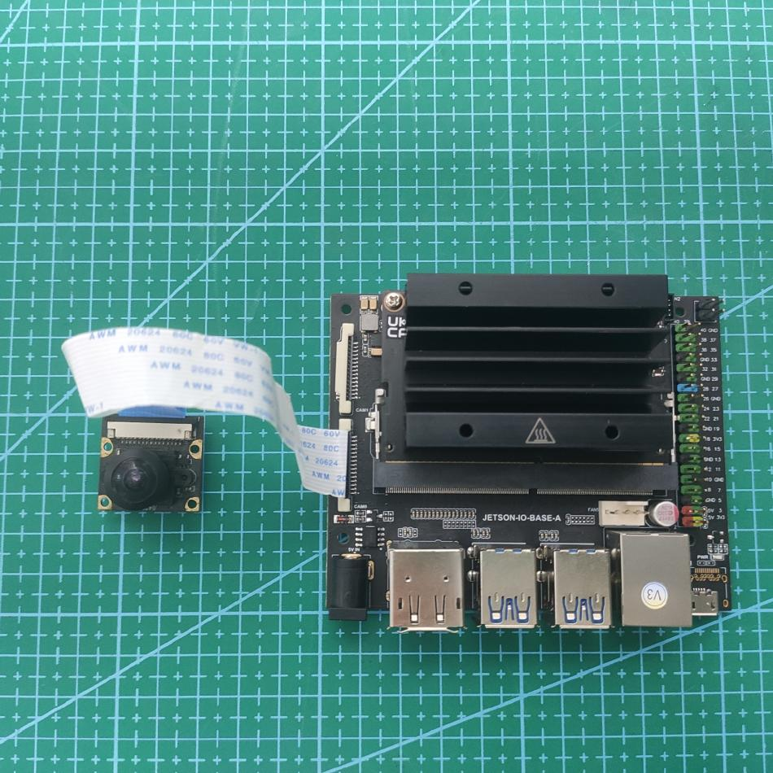

JetHexa adopts CSI camera. In OpenCV, VideoCapture function can be used to open USB camera directly. While opening CSI camera requires a gstreamer_pipeline, video data reading framework, which lets the video data flow between different codes making it convenient to develop and process the video.

#### 8.1.1.1 Operation Steps

The input command should be case sensitive, and the keywords can be complemented by “**Tab**” key.

**1. Start JetHexa, and then connect to ubuntu desktop through NoMachine.**

**2.** **Click  or press “**Ctrl+Alt+T**” to open command line terminal.**

**3.** **Input command “**sudo systemctl stop jethexa_bringup.service**” to stop the auto-start service to avoid the camera from being occupied by other services.**

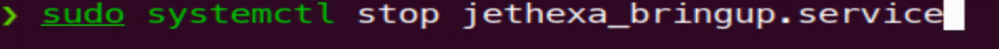

**4.** **Input command “**python3 Camera.py**” and press Enter to start the game.**

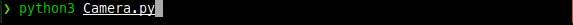

**5.** **If you want to close this game, please press “**Ctrl+C**”. If the game cannot be closed, please try again.**

**6.** **In order to not affect the normal function of the game, please input command “**sudo systemctl start jethexa_bringup.service**” after the game ends to restart the service.**

#### 8.1.1.2 Program Outcome

After the game starts, camera will transmit the image to the screen.

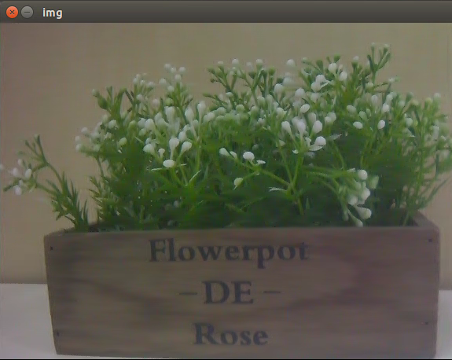

#### 8.1.1.3 Program Parameter

**The source code of this program is stored in /home/hiwonder/Camera.py**

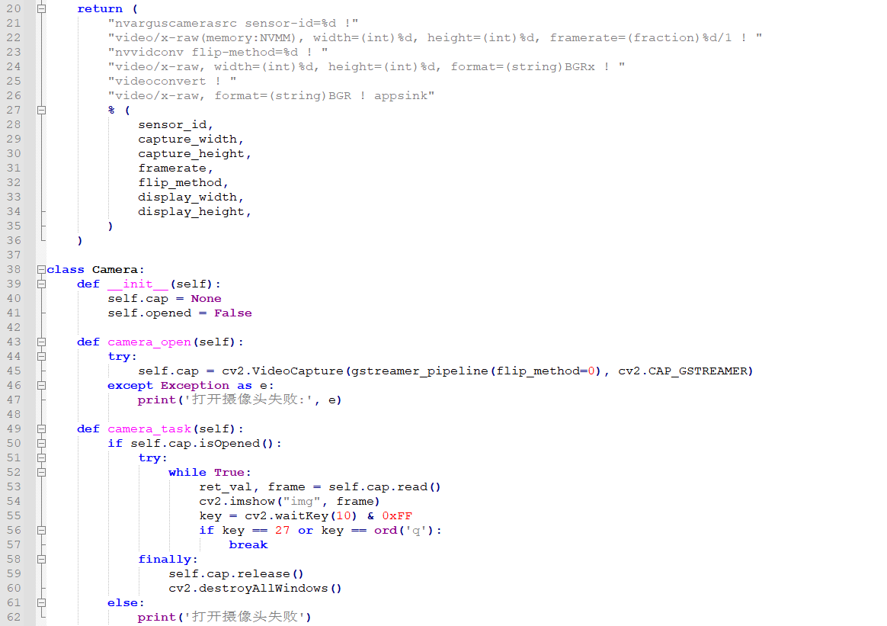

- **Read CSI camera**

Modify the parameters of VideoCapture function to adjust the posture. Take “**cv2.VideoCapture(gstreamer_pipeline(flip_method=0), cv2.CAP_GSTREAMER)**” for example. The meaning of the parameters in the bracket is as follow.

1. The first parameter “**gstreamer_pipeline(flip_method=0)**” is passed in gstreamer_pipeline framework where the reading properties of the video data are set.

2. The second parameter “**cv2.CAP_GSTREAMER**” is for selecting pipeline mode.

- **Read and Display Image**

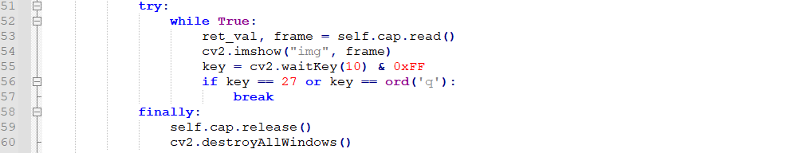

Call read function to read the image of the video and then call imshow function to display the image. Take “**cv2.imshow("img", frame)**” for example. The meaning of the parameters in the bracket is as follow.

1. The first parameter “**img**” is the title of the display window.

2. The second parameter “**frame**” is the passed in image.

When you press “**q**” key to close the window, release function will be called first to release the camera, and then destroyAllWindows function will be called to close all the windows.

### 8.1.2 Lesson 2 Camera Calibration

Usually, there are two ways to calibrate the camera. One is to use the camera to capture the chessboard in real time, the other is to use the pictures of chessboard already required for calibration. And detailed explanation for the first method will be offered in this lesson.

Note: please print the chessboard pictures stored in the same directory before calibration.

#### 8.1.2.1 Operation Steps

The input command should be case sensitive, and the keywords can be complemented by “**Tab**” key.

**1. Start JetHexa, and then connect to ubuntu desktop through NoMachine.**

**2.** **Click  or press “**Ctrl+Alt+T**” to open command line terminal.**

**3.** **Input command “**roslaunch jethexa_peripherals csi_camera.launch**” and press Enter to start CSI camera.**

**4.** **Open a new terminal, and input command “**rosrun camera_calibration cameracalibrator.py --size 9x6 --square 0.014 image:=/csi_camera/image_raw camera:=/csi_camera**”.**

The value of “**size**” is equal to the number of intersection of the horizontal and vertical lines. In the picture below, there are 9 red points and 6 yellow points, therefore the size of this picture is 9x6.

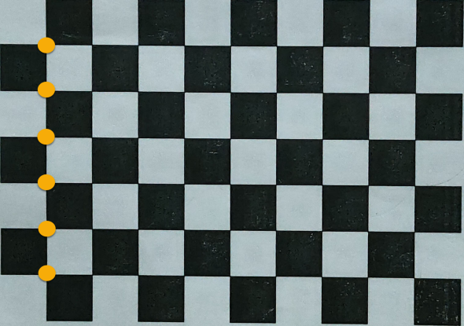

“square” represents the side length of each square in meter. You can use the ruler to measure the side length of the square. For example, the measured distance is 1.4cm, and you need to set the value of square as 0.014.

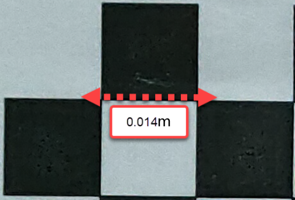

Having finished input, start the program of camera calibration.

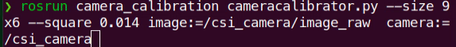

**5.** **Face the chessboard picture horizontally to the camera while quickly move and tilt the picture till the parameters of x, y, size and scale at right turn green. Then click “**calibrate**” to start calculating the calibration.**

**Note: the time taken to calculate the calibration depends on the quantity of the pictures to be calibrated. The more pictures, the longer it takes.**

Parameter “**x**” represents the right and left zone of the camera field of view, and we need to move the chessboard left and right. Parameter “**y**” indicates top and bottom zone of the camera field of view, and we need to move the chessboard up and down. Parameter “**size**” is the distance between the picture and the camera, and we need to move the picture away from or close to the camera. Parameter “**scale**” stands for the tilt of the picture, and we need to tilt the picture at any angle while keeping the chessboard horizontal.

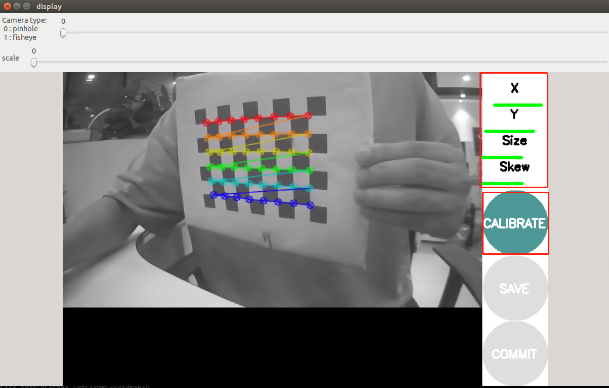

**6. After the program has finished calculated the calibration, you can move the picture within the camera frame to check whether the picture is displayed normally without Fisheye effect.**

Click “**SAVE**” button, and then the picture and calculation data will be saved in “**tmp**” folder. You can enter “**cd /tmp**” command to open “**tmp**” folder and find the related file.

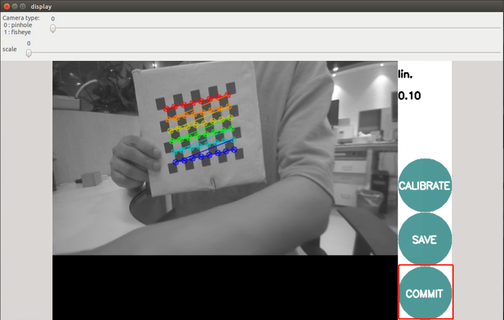

#### 8.1.2.2 Check the Calibration Effect

1. Start JetHexa, and connect to the WiFi generated by the robot.

2. Open the browser, and input the address “**http://192.168.149.1:8080/**” to enter the communication service.

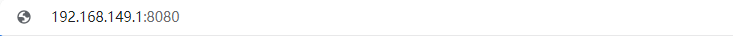

3. Topic “[**image_rect_color**](http://192.168.149.1:8080/stream_viewer?topic=/csi_camera/image_rect_color)” indicates the camera image after calibration, and “[**image_raw**](http://192.168.149.1:8080/stream_viewer?topic=/csi_camera/image_raw)” represents the raw camera image.

4. If you select “**image_raw**”, move the picture close to the camera and the picture will be distorted, which is called fisheye effect, as picture(a) shown. If you select “**image_rect_color**”, make the picture approach the camera and the picture will be displayed normally without distortion, as picture(b) shown.

（a）

 （b）

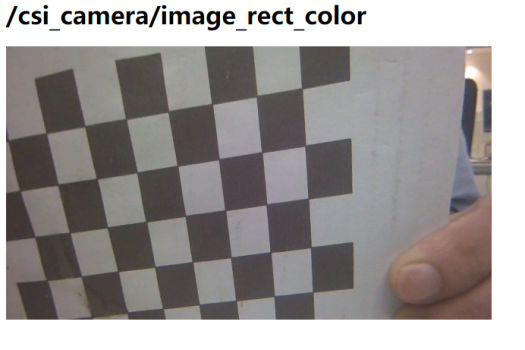

## 8.2 Depth Camera

### 8.2.1 Lesson 1 Depth Camera Configuration

#### 8.2.1.1 Install Dependency

1）Input command “**sudo apt update**” to update **apt** library.

After update, the following messages will occur.

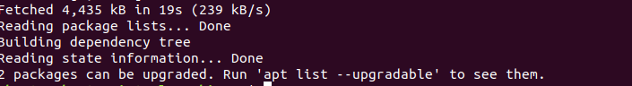

2）Input command “**sudo apt install ros-\$ROS_DISTRO-rgbd-launch**” to install dependency library.

3）Input command “**sudo apt install ros-\$ROS_DISTRO-libuvc**” to install dependency library.

4）Input command “**sudo apt install ros-\$ROS_DISTRO-libuvc-camera**” to install dependency library.

5）Input command “**sudo apt install ros-\$ROS_DISTRO-libuvc-ros**” to install dependency library.

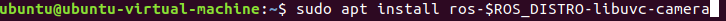

#### 8.2.1.2 Build Work Space

**1.** **Input command “**mkdir -p ~/astra_ws/src && cd ~/astra_ws**” to build work space.**

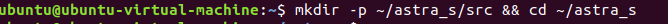

**2.** **Input command “**catkin_make**” to compile new work space.**

If the following content appears, the compilation is successful.

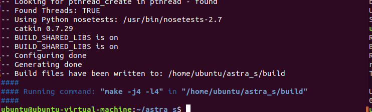

**3.** **Input command “**source ~/astra_ws/devel/setup.bash**” to set new work space.**

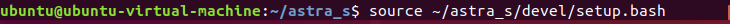

**4.** **Input command “**source ~/astra_ws/devel/setup.bash**” to set the work space as environment variable.**

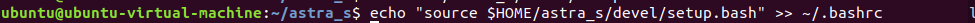

### 8.2.2 Lesson 2 Depth Camera Installation

#### 8.2.2.1 Install the Source Code of Depth Camera

1）Copy “**ros_astra_camera.zip**” in “8. Monocular and Depth Camera Lesson/ 2. Depth Camera/ Lesson 2 Depth Camera Installation” to the virtual machine.

2）Input command “**cd Desktop**” to enter the desktop.

**3.** **Input command “**unzip ros_astra_camera.zip**” to extract the file.**

The file is extracted to the desktop as the pictured below.

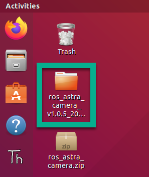

4）Double click the folder in the green frame, and right click **ros_astra_camera** folder and select “**copy**”.

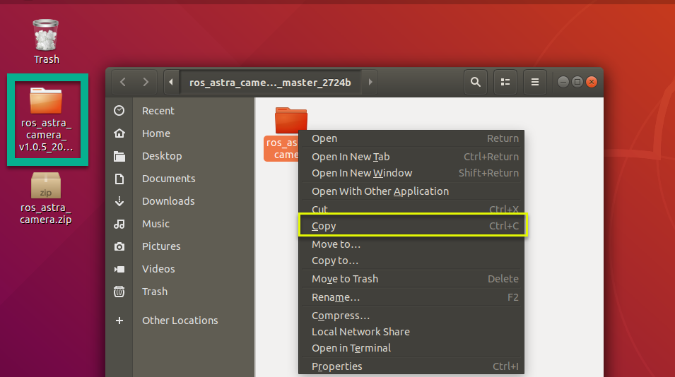

5）Move to the directory as shown in the green frame, and paste **ros_astra_camera** folder to it.

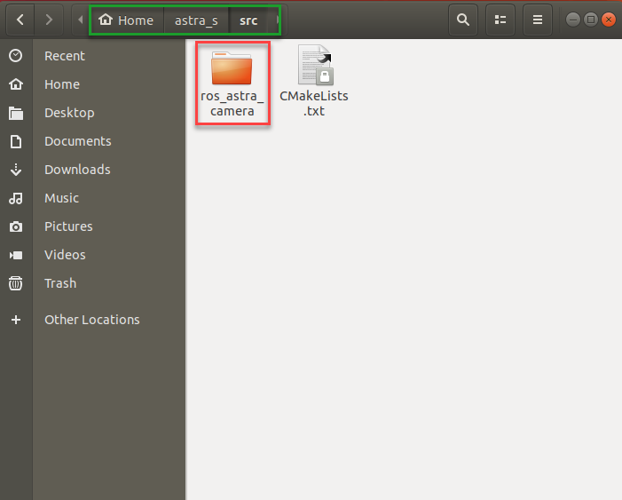

**6.** **Input command “**cd ~/astra_s/src/ros_astra_camera**” to enter the work space.**

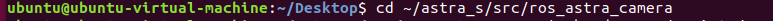

**7.** **Input command “**chmod a+x ./scripts/create_udev_rules**” to add permission.**

**8.** **Input command “**./scripts/create_udev_rules**” to restart udev.**

### 8.2.3 Lesson 3 Usage of Depth Camera

#### 8.2.3.1 Enable Camera Service

1）Input command “**roslaunch astra_camera Halley.launch**” to enable the camera service.

When the messages below occur and there is no red error reporting, the service is enabled successfully.

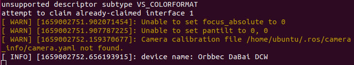

#### 8.2.3.2 View on rqt_image_viewer

1）Input command “**rosrun rqt_image_view rqt_image_view**” to open **rqt_image_viewer**.

When the following interface occurs, the tool is opened successfully.

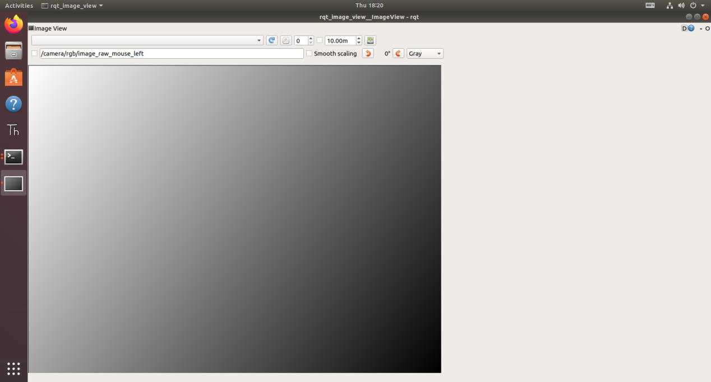

**2. If you need to view the pictures, please select the option in drop-down menu according to the content in the red frame.**

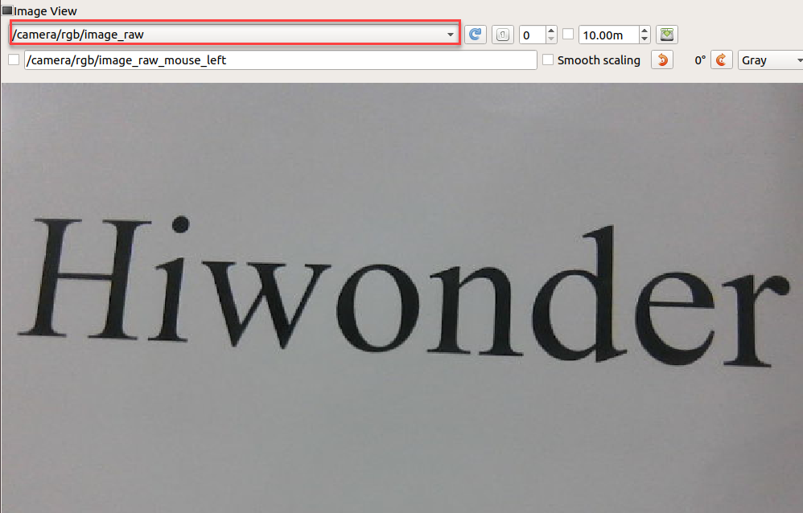

**3. If you need to view infrared image, please complete the settings according to the content in the red frame.**

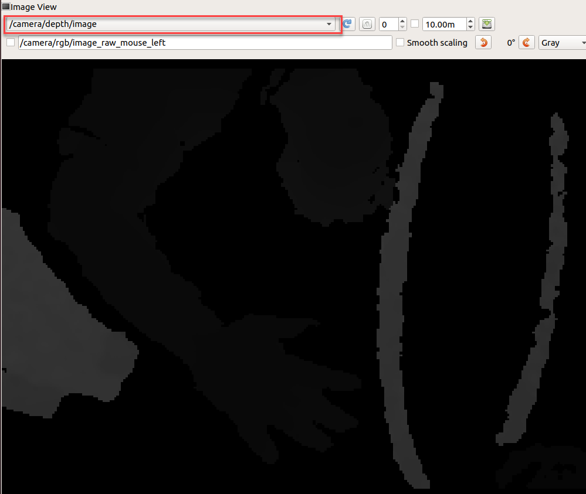

#### 8.2.3.3 View on rviz

1）Input command “**rosrun rviz rviz**” to open **rviz**

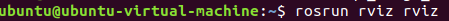

When the following interface occurs, the tool is opened successfully.

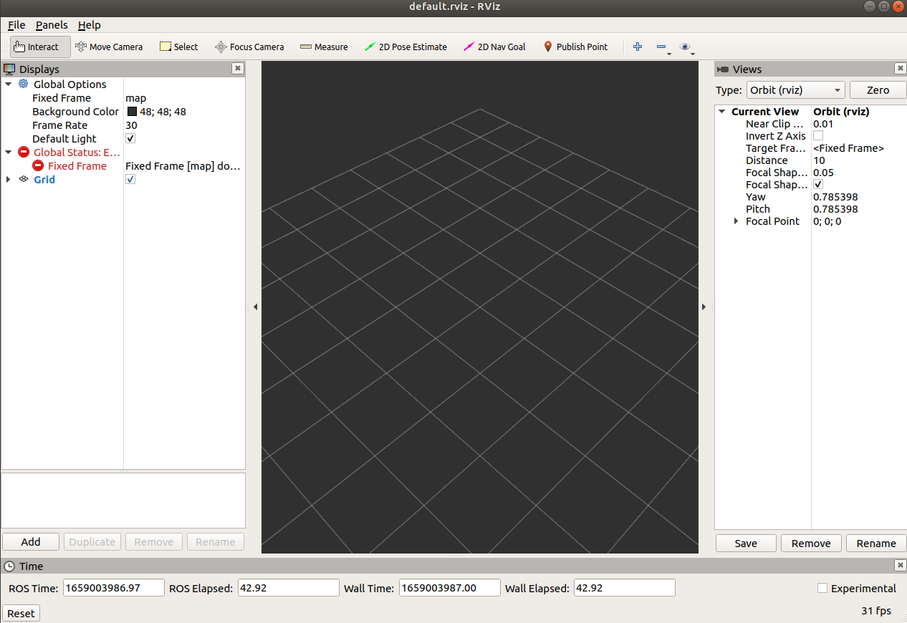

2）If you need to view camera returned image, set “**Fixed Frame**” as “**camera_link**” firstly. Then click “**Add**”. Next, select “**By topic -\>rgb-\>Image**”, and click “**OK**”.

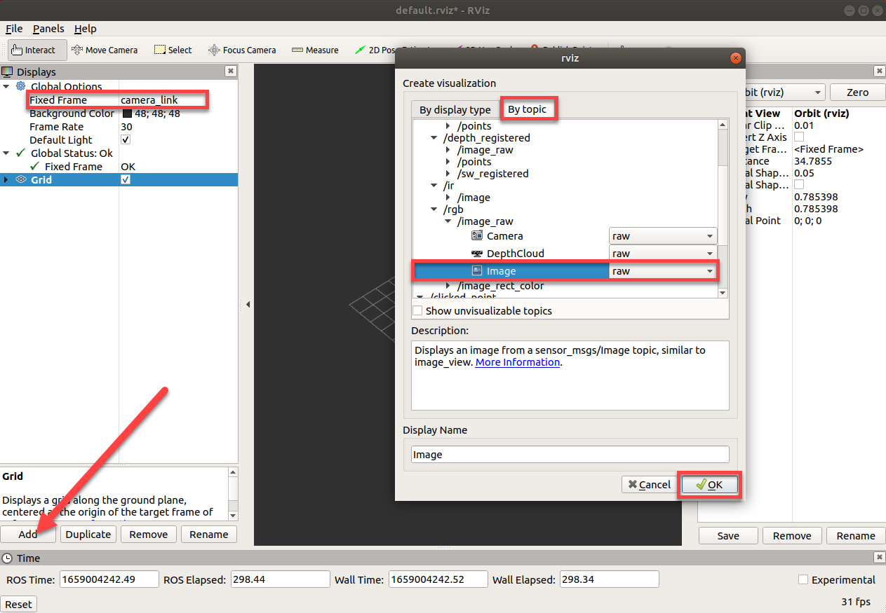

When the following interface show up, the camera returned image is linked successfully.

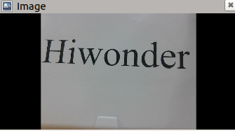

3）If you need to view the camera returned image, set “**Fixed Frame**” as “**camera_link**” firstly. Then click “**Add**”. Next, select “**By topic -\>camera-\>depth-\>Image-\>Image**”, and click “**OK**”.

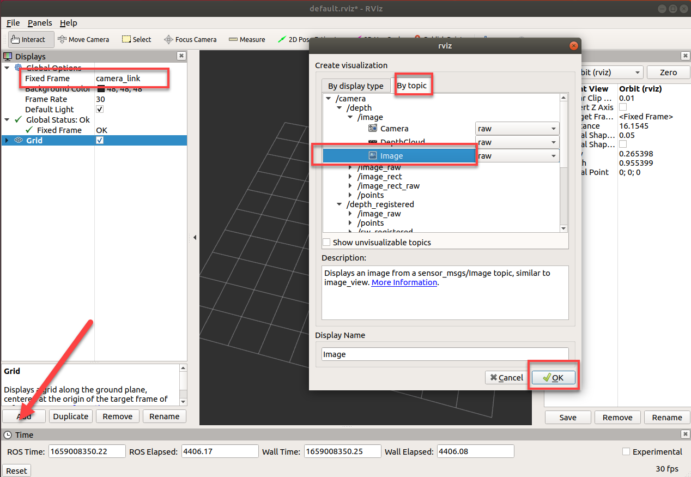

When the following interface shows up, you can view the infrared image.

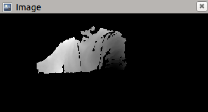

### 8.2.4 Lesson 4 Camera Calibration

Usually, there are two ways to calibrate the camera. One is to use the camera to capture the chessboard in real time, the other is to use the existed chessboard pictures for calibration. And detailed explanation for the first method will be offered in this lesson.

Note: please print the the chessboard pictures stored in the same directory before calibration.

#### 8.2.4.1 Operation Steps

The input command should be case sensitive, and the keywords can be complemented by “**Tab**” key.

**1. Start JetHexa, and then connect to ubuntu desktop through NoMachine.**

**2.** **Click  or press “**Ctrl+Alt+T**” to open command line terminal.**

**3.** **Input command “**roslaunch jethexa_peripherals camera.launch**” and press Enter to start CSI camera.**

**4.** **Open a new terminal, and input command “**rosrun camera_calibration cameracalibrator.py --size 9x6 --square 0.014 image:=/camera/rgb/image_raw camera:=/camera/rgb**”.**

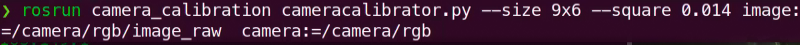

The value of “**size**” is equal to the number of the square in the first row and column except the first square. In the picture below, there are 9 squares on the first row except the first one, and 6 squares on the first column except the first one also, so the size of this chessboard is 9 x 6.

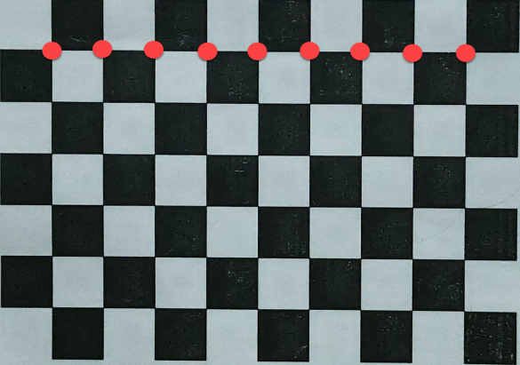

“**square**” represents the side length of each square in meter. You can use the ruler to measure the side length of the square. For example, the measured distance is 1.4cm, and you need to set the value of square as 0.014.

Having finished input, start the program of camera calibration.

**5.** **Face the chessboard picture horizontally to the camera while quickly move and tilt the picture till the parameters of x, y, size and scale at right turn green. Then click “**calibrate**” to start calculating the calibration.**

**Note: the time taken to calculate the calibration depends on the quantity of the pictures to be calibrated. The more pictures, the longer it takes.**

Parameter “**x**” represents the right and left zone of the camera field of view, and we need to move the chessboard left and right. Parameter “**y**” indicates top and bottom zone of the camera field of view, and we need to move the chessboard up and down. Parameter “**size**” is the distance between the picture and the camera, and we need to move the picture away from or close to the camera. Parameter “**scale**” stands for the tilt of the picture, and we need to tilt the picture at any angle while keeping the chessboard horizontal.

**6. After the program has finished calculated the calibration, you can move the picture within the camera frame to check whether the picture is displayed normally without Fisheye effect.**

Click “**SAVE**” button, and then the picture and calculation data will be saved in “**tmp**” folder. You can enter “**cd /tmp**” command to open “**tmp**” folder and find the related file.

#### 8.2.4.2 Check the Calibration Effect

1. Start JetHexa, and connect to the WiFi generated by the robot.

2. Open the browser, and input the address “**http://192.168.149.1:8080/**” to enter the communication service.

3. Topic “[**image_rect_color**](http://192.168.149.1:8080/stream_viewer?topic=/csi_camera/image_rect_color)” indicates the camera image after calibration, and “[**image_raw**](http://192.168.149.1:8080/stream_viewer?topic=/csi_camera/image_raw)” represents the raw camera image.

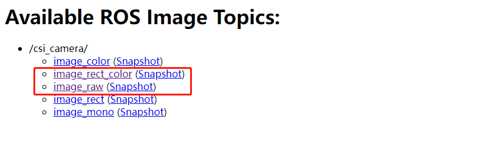

4. If you select “**image_raw**”, move the picture close to the camera and the picture will be distorted, which is called fisheye effect, as picture(a) shown. If you select “**image_rect_color**”, make the picture approach the camera and the picture will be displayed normally without distortion, as picture(b) shown.

（a）

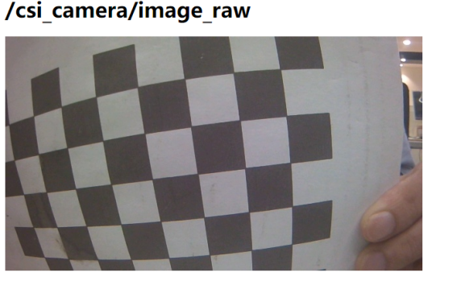

（b）

 

### 8.2.5 Lesson 5 Data Type and Point Cloud

#### 8.2.5.1 Point Cloud Introduction

Human possess 3D vision, however computer only has 2D vision that is it only obtains 2D information from the pictures. To enable computer to display 3D objects, it is required to empower computer with 3D vision. And point cloud is a specific example of 3D vision.

#### 8.2.5.2 Data Type of Point Cloud

Point cloud data is a set of vectors in 3D coordinate system, which are generally represented by X, Y, Z of 3D coordinate system. Usually, it is used to indicate the outer shape of an object, and also RGB color, gray value, depth, etc.

JetHexa’s point cloud data is obtained by Lidar and depth camera which can be used for measurement.

Point cloud data is commonly stored in the format of pts, asc, dat, stl, imw, xyz, txt, csv, etc. Working like attribute list, it records the position of X, Y and Z axis of the corresponding point, as well as various attributes.

#### 8.2.5.3 Point Cloud Image of JetHexa

#### 8.2.5.4 Point Cloud Image of Depth Camera

**1.** **Input command “**sudo systemctl stop jethexa_bringup**” to close the auto-start program.**

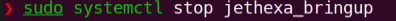

**2.** **Input command “**roslaunch jethexa_peripherals camera.launch**” to enable camera service.**

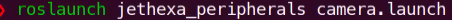

After the service is successfully enabled, the terminal interface is as follows.

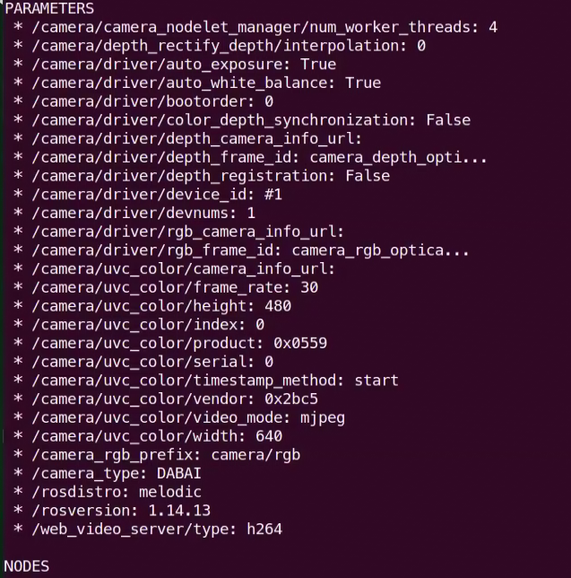

**3.** **Open a new command bar, and input “**roslaunch jethexa_peripherals rgbd_viewer.launch**” command to open the point cloud image of depth camera.**

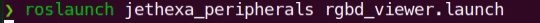

4）The point cloud image is as pictured. The colors represents the point cloud data which is obtained from the infrared sensor on depth camera.

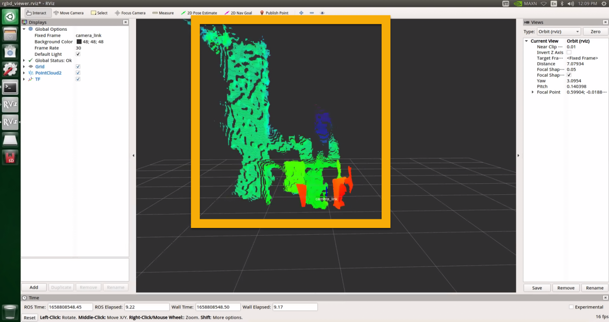

#### 8.2.5.5 Configure Point Cloud Image of Depth Camera

1）Input command “**rosrun rviz rviz**” to enable rivz, default configuration.

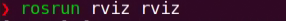

When rivz is enabled successfully, this window will pop up.

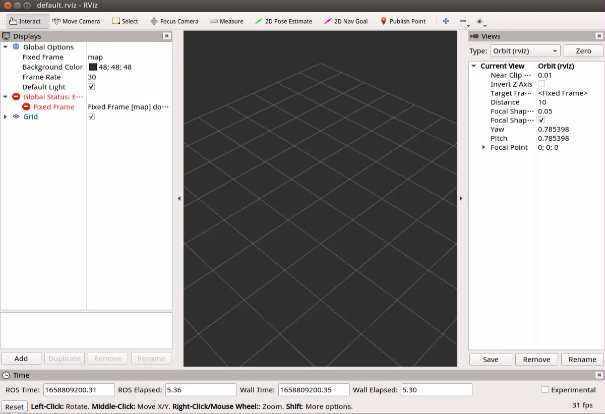

2）Click “**Add**”, select “**By topic -\>camera-\>depth-\>points-\>PointCloud2**” in sequence, and then click “**OK**” to add the point cloud image to rviz.

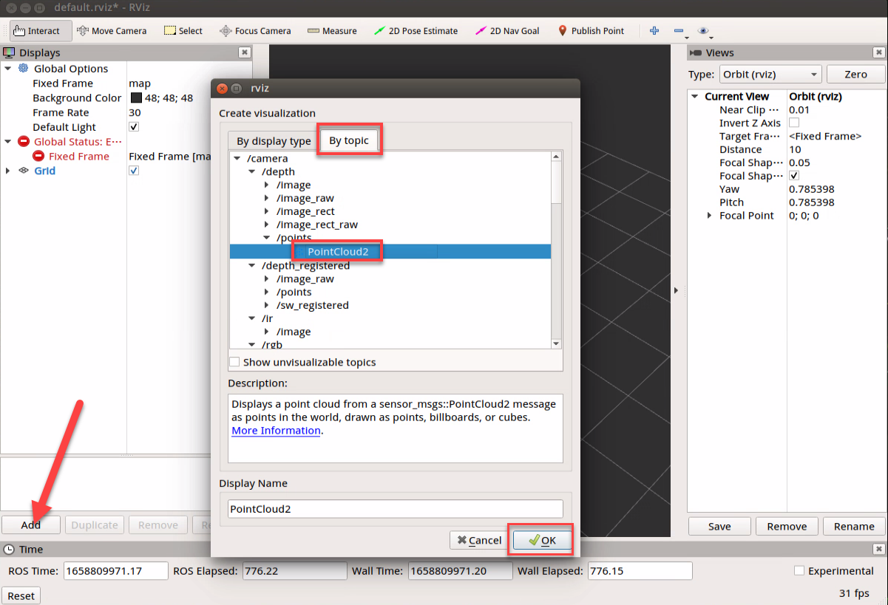

3）Set the parameters according to the picture.

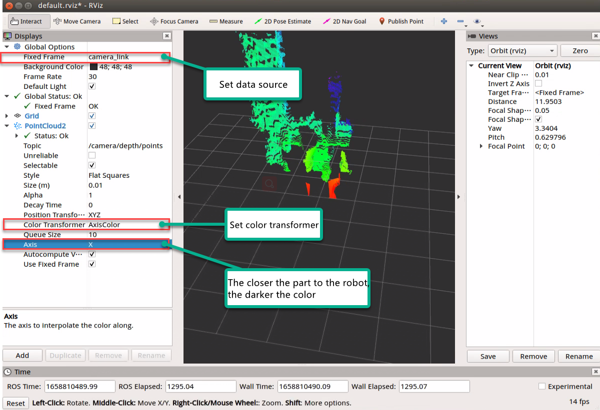

#### 8.2.5.6 Point Cloud Image of Lidar

**Note: for more materials of Lidar, please move to the chapter “12. LIdar Lesson”**

**1.** **Input command “**sudo systemctl stop jethexa_bringup**” to close the auto-start program.**

**2.** **Input command “**rroslaunch jethexa_peripherals lidar.launch**” to enable camera service.**

After the service is enabled, the following messages will show up.

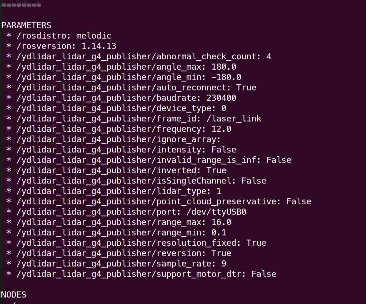

**3.** **Open a new command bar, and input “**roslaunch jethexa_peripherals laser_viewer.launch**” command to open the point cloud image of Lidar.**

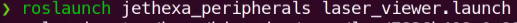

4）The point cloud image is as the picture shows. The red dots are the point cloud data, which are drawn according to the distance of the object.

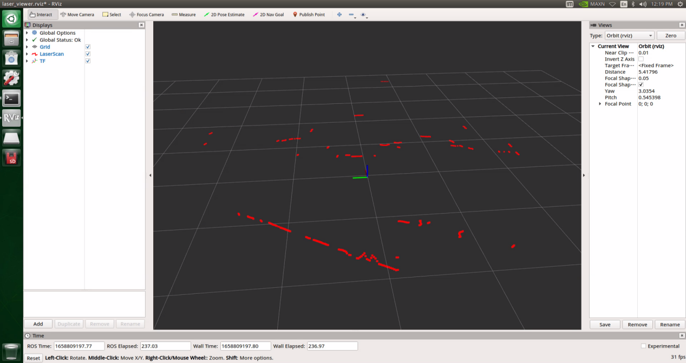

#### 8.2.5.7 Point Cloud Image of Lidar

1）Type command “**roslaunch jethexa_peripherals lidar.launch**” to enable Lidar service.

After the service is enabled, the following messages will show up.

2）Enter command “**rosrun rviz rviz**” to open rviz, default configuration.

After rviz is opened successfully, this video will occur.

2）Click “**Add**”, select “**By topic -\>scan-\>LaserScan**” in sequence, and then click “**OK**” to add the point cloud image to rviz.

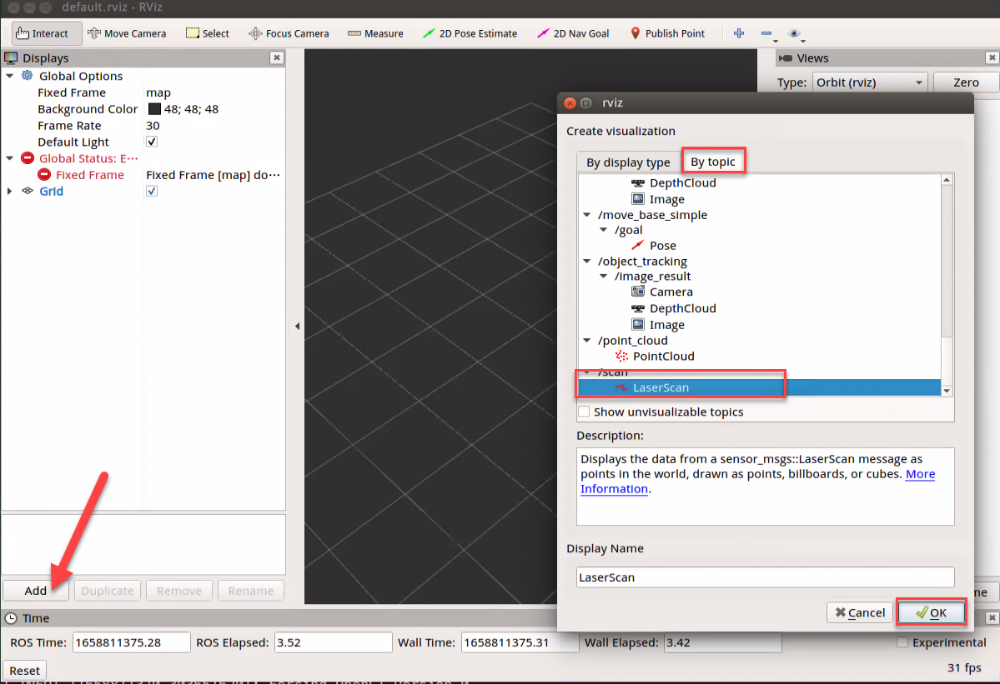

3）Set the parameters according to the picture.

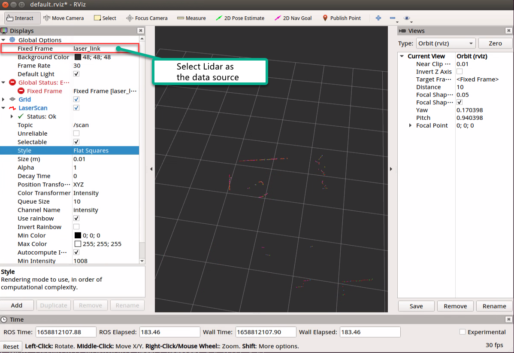
