# 9. ROS+OpenCV Vision Standard Lesson

## 9.1 ROS+OpenCV Vision Recognition Lesson

### 9.1.1 Lesson 1 Color Threshold Adjustment

Different light source will have different influence on the colors, which will results in recognition discrepancy. To tackle this problem, you can use LabConfig tool to adjust the color threshold.

#### 9.1.1.1 Open LabConfig

**Note: The input command should be case sensitive, and the keywords can be complemented by “Tab” key.**

1. Start JetHexa and connect it to NoMachine, remote control software.

2. Double click  on the desktop to open LabConfig. If it is opened successfully, you can skip step 3-6.

3. If LabConfig tool cannot be opened, double click  to open the command line terminal.

4. Input command “**roslaunch lab_config lab_config_manager.launch**” and press Enter.

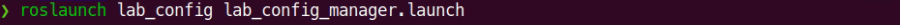

5. Input command “**roslaunch jethexa_peripherals camera.launch**” and press Enter.

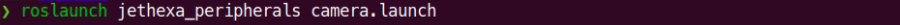

6. Double click  on the desktop to open LabConfig tool.

#### 9.1.1.2 LabConfig Interface Layout

LabConfig interface is divided into two areas, including image display area and recognition adjustment area.

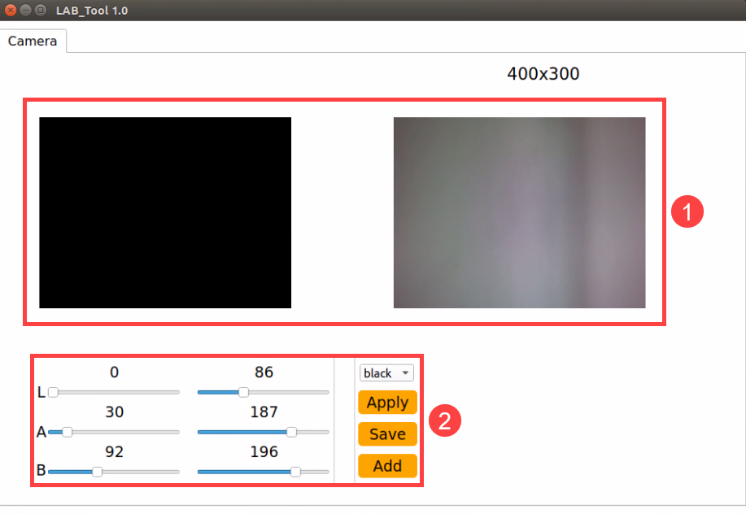

**1. Image display area: at left is the original camera image, and at right is the processed image.**

**Note: if there is no image transmitted by camera, the camera may not connect successfully. And you need to check the wiring of the camera is secure or not.**

**2. recognition adjustment area: adjust the color threshold. And the functions of the buttons are listed below.**

| **Button** | **Function** |
| --- | --- |
| 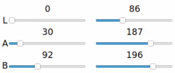 | L, A and B sliders are used to adjust L, A and B components of the image. |
| 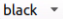 | Select the color |
|  | Apply the color threshold we adjust currently. |
| 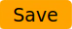 | Save the adjusted color threshold |
| 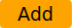 | Add other colors |

#### 9.1.1.3 Adjust Color Threshold

1. Open LabConfig, and select the color in the drop down menu. Take adjusting red color for example.

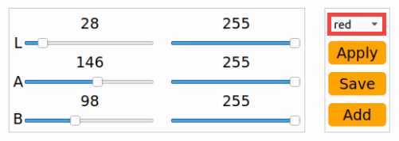

2. Modify all the values in “**min**” as 0, and “**max**” area as 255.

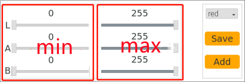

3. Put the red block within the camera frame. According to the “**LAB color space**”, adjust L, A and B components to approach the zone of the recognized color.

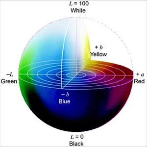

Red is around “**+a**” zone, hence we need to increase A component that is remain “**max**” value of A component the same and increase “**min**” value till the red block at left turns white and other area turns black.

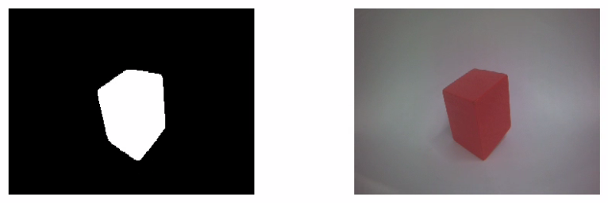

4. Based on the environment, modify the value of “L” and “B”. If it belongs to light red, increase L min value at left. Otherwise, decrease L max value at right. If it belongs to warm tone, increase B min value at left. Otherwise, decrease B max at right

LAB Threshold Adjustment Parameter

| **Color Component** | **Range** | **Corresponding Color Zone** |
| --- | --- | --- |
|          L          |   0~255   |    Black-White（-L ~ +L）    |
|          A          |   0~255   |     Green-Red（-a ~ +a）     |
|          B          |   0~255   |    Blue-Yellow（-b ~ +b）    |

5. Click “**Apply**” to apply the adjusted color threshold parameter.

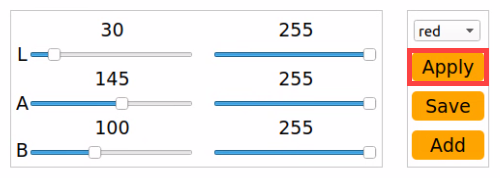

6. Click “**Save**” button to keep the adjusted value.

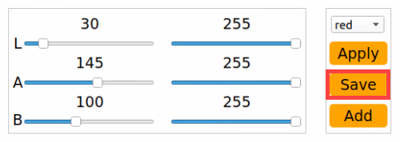

#### 9.1.1.4 Add New Recognition Color

Besides three built-in recognized colors, we can add other recognized color. For example, purple.

1. Open LabConfig and click “**Add**” button.

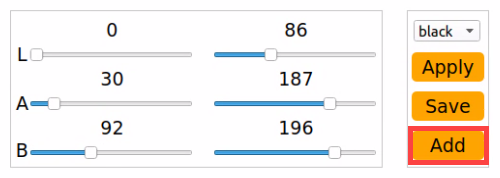

2. Then fill in “**purple**”.

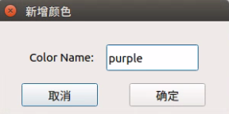

3. Face the camera to the purple object. And then drag the slider of L, A and B to adjust the color threshold till the purple ball at left turns white and other area turns black.

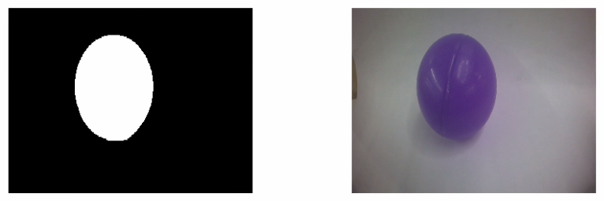

**Note: for how to adjust the color threshold, please scroll up to “3. Adjust Color Threshold”.**

4. Click “**Apply**” to apply the adjusted color threshold parameter.

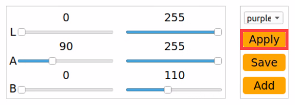

5. Click “**Save**” button to keep the adjusted value.

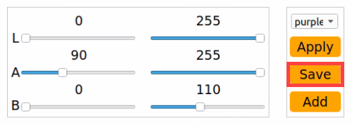

### 9.1.2 Lesson 2 Color Recognition

#### 9.1.2.1 Program Logic

Firstly, through subscribing the topic published by the camera node, the program obtains the RGB image. Then the image will be zoomed, Gaussian blurred and converted from RGB into LAB.

Next, perform binaryzation, corrosion, dilation, etc., on the image to obtain the maximum contour which contains the target color.

Lastly, JetHexa will be controlled to execute the corresponding action according to the recognition result.

The source code of this program is stored in **/home/hiwonder/jethexa/src/jethexa_tutorial/scripts/ros_opencv_06_color_detect.py**

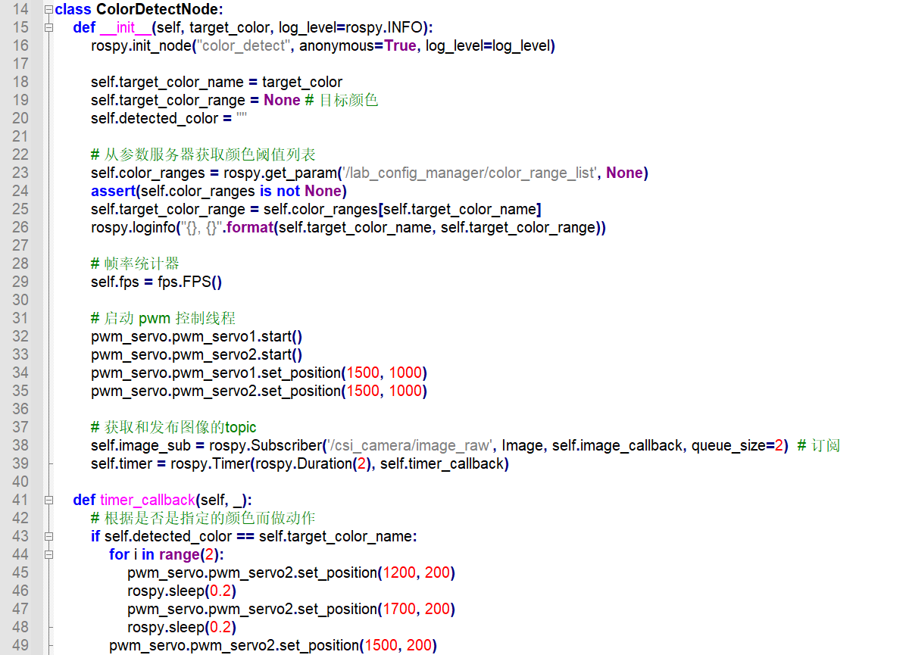

#### 9.1.2.2 Operation Steps

**Note:** The input command should be case sensitive, and the keywords can be complemented by “**Tab**” key.

1. Start JetHexa, and then connect to ubuntu desktop through NoMachine.

2. Double click  or press “**Ctrl+Alt+T**” to open command line terminal.

3. Input command “**roslaunch jethexa_tutorial ros_opencv_06_color_detect.launch color:=red**” and press Enter to start the game.

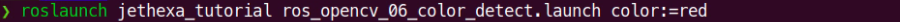

If you want to change the recognition color, you can directly modify “**red**” at the end of the command as other color.

4. If want to close this game, please press “**Ctrl+C**”. If the game cannot be closed, please press the key again.

#### 9.1.2.3 Program Outcome

**Note: after the game starts, please ensure there is no other object containing the recognition color except the target object within the camera frame, otherwise the recognition result will be affected.**

After the game starts, put red, green and blue objects within the camera frame. When recognizing red, JetHexa will nod. Otherwise, it will shake its head.

#### 9.1.2.4 Program Analysis

#### 9.1.2.5 Basic Configuration

- **Command Line Interface**

Create the required command line interface through Argparse module. The whole process involves creating parser, adding parameter and parsing parameters.

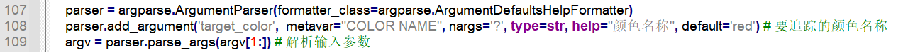

Take “**parser.add_argument('target_color', metavar="COLOR NAME", nargs='?', type=str, help="颜色名称", default='red')**” for example. The meaning of the parameters is as follow.

The first parameter “**'target_color'**” is a name or a list of option strings.

The second parameter “**metavar='COLOR NAME**” is the parameter name displayed when the user obtain the **help** information.

The third parameter “**nargs='?'**” refers to the quantity of the command line parameters that should be consumed.

The fourth parameter “**type=str**” indicates the type of the parameter.

The fifth parameter “**help="颜色名称"**” is the simple description of the option.

The sixth parameter “**default="red"**’ is the default parameter, which means that the default recognition color is red.

- **Subscribe Topic**

Obtain the camera image in real time through subscribing the topic published by the camera node.

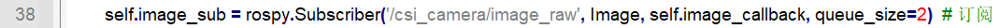

#### 9.1.2.6 Process Image

- **Scale**

Adopt resize() function in cv2 library to scale the image so as to decrease computation.

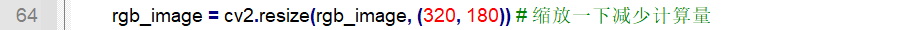

The first parameter “**rgb_image**” is the input image, and the second parameter “**(320, 180)**” is the width and length of the image after scaling.

- **Gaussian filtering**

Adopt **GaussianBlur()** function in cv2 library to perform Gaussian filtering on the image to remove the noise from the image.

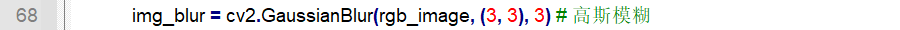

The first parameter “**rgb_image**” is the input image

The second parameter “**(3, 3)**” is the size of Gaussian convolution kernel, and its height and width must be positive number and odd number.

The third parameter "**3**" is the standard deviation of the Gaussian kernel in the horizontal direction.

- **Binaryzation Processing**

Adopt **inRange()** function in cv2 library to perform binaryzation on the image.

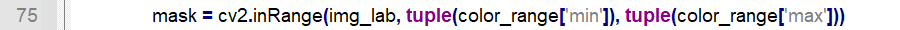

The first parameter “**img_lab**” is the input image.

The second parameter “**tuple(color_range\['min'\])**” is the minimum value of the color threshold.

The third parameter “**tuple(color_range\['max'\])**” is the maximum value of the color threshold.

When the RGB value of a pixel is within the color threshold range, this pixel will be assigned as “**1**”, otherwise “**0**”.

- **Corrosion and Dilation**

Perform corrosion and dilation on the image to smooth the contour edge of the image for better searching the target contour.

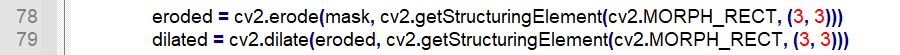

erode() function is used to execute corrosion. Take “**eroded = cv2.erode(mask, cv2.getStructuringElement(cv2.MORPH_RECT, (3, 3)))**” for example. The meaning of the parameters in bracket is as follow.

The first parameter “**mask**” is the input image.

The second parameter “**cv2.getStructuringElement(cv2.MORPH_RECT, (3, 3))**” is the structuring element or kernel deciding the nature of the operation. And the first parameter in the bracket is the kernel shape and the second parameter is the dimension of the kernel.

dilate() function is used for dilation. The meaning of the parameters in the bracket is the same as that of erode() function.

- **Acquire the Maximum Contour**

Call findContours() function in cv2 library to find the maximum contour of the recognition color in the image.

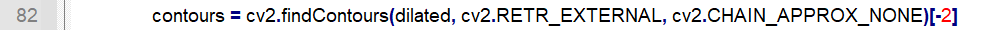

The first parameter “**dilated**” is the input image.

The second parameter “**cv2.RETR_EXTERNAL**” is the contour retrieving mode.

The third parameter “**cv2.CHAIN_APPROX_NONE**” is the method of contour approximation.

#### 9.1.2.7 Action Feedback

Call **pwm_servo.pwm_servo1.set_position()** function in jethexa_sdk library to control JetHexa’s head to rotate horizontally. **pwm_servo.pwm_servo2.set_position()** function is used to control its head to rotate vertically.

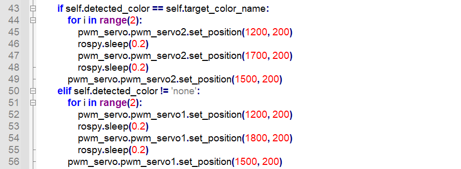

Take “**pwm_servo.pwm_servo2.set_position(1200, 200)**” for example. The meaning of the parameters in the bracket is as follow.

The first parameter “**1200**” is the position to which the servo rotates. The value is pulse width ranging from 500 to 2500. And “**1200**” corresponds to 63 degree. The conversion formula is: pulse=11.1×angle + 500 (this formula is only for reference)

The second parameter “**200**” is the rotation time in ms.

### 9.1.3 Lesson 3 AprilTag Recognition

#### 9.1.3.1 Program Logic

Firstly, through subscribing the topic published by the camera node, the program obtains the RGB image. Then the image will be gray processed and zoomed.

Next, acquire the tag information, including tag ID, tag center, coordinate of angular point, etc.

Lastly, calibrate the camera, and display the result of tag recognition on the camera returned image.

The source code of this program is stored in **/home/hiwonder/jethexa/src/jethexa_tutorial/scripts/ros_opencv_07_apriltag.py**

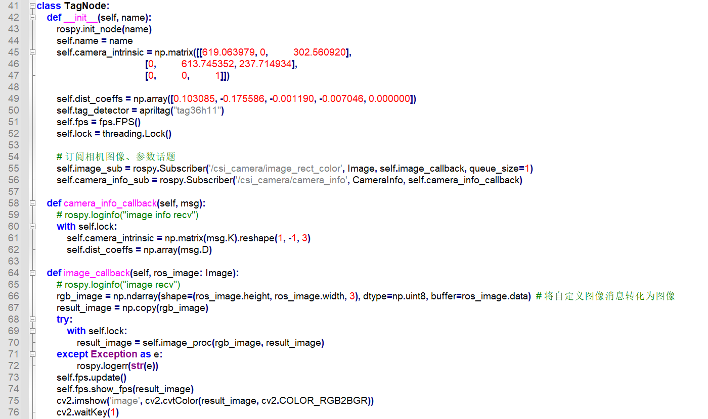

#### 9.1.3.2 **Operation Steps**

The input command should be case sensitive, and the keywords can be complemented by “**Tab**” key.

1. Start JetHexa, and then connect to ubuntu desktop through NoMachine.

2. Click  or press “**Ctrl+Alt+T**” to open command line terminal.

3. Input command “**roslaunch jethexa_tutorial ros_opencv_07_apriltag.launch**” and press Enter to start the game.

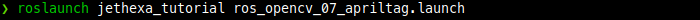

4. If want to close this game, please press “**Ctrl+C**”. If the game cannot be closed, please press the key again.

#### 9.1.3.3 Program Outcome

After the game starts, put the tag card within the camera frame. When the tag is recognized, coordinate axis will be drawn on the tag on the camera returned image, and the four corners of the tag will marked by blue dots.

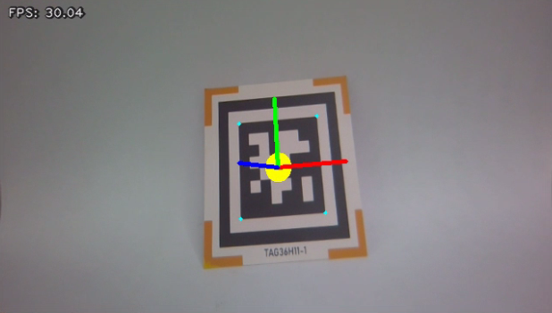

#### 9.1.3.4 Program Analysis

Through subscribing the topic published by the camera node, obtain the real-time image of the camera.

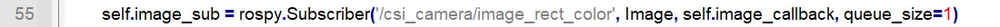

#### 9.1.3.5 Image Processing

- **Image Grayscale**

Through calling cvtColor() function in cv2 library, convert the colored image collected by the camera into grayscale image so as to improve computation efficiency.

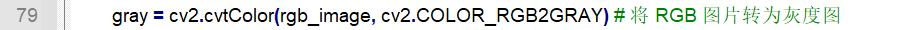

The first parameter “**rgb_image**” stands for the input image, and the second parameter “**cv2.COLOR_RGB2GRAY**” represents the conversion type of the image.

- **Scale**

resize() function in cv2 library will be adopted to scale the image in order to reduce the calculation amount.

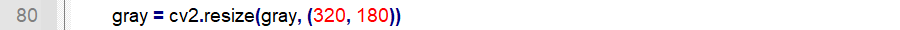

The first parameter “**gray**” in the bracket is the input image, and the second parameter “**(320, 180)**” is the width and length of the image after zooming.

#### 9.1.3.6 Tag Detection

- **Acquire Tag Coordinate**

After the tag is detected, extract the required tag information.

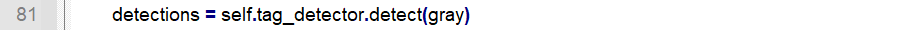

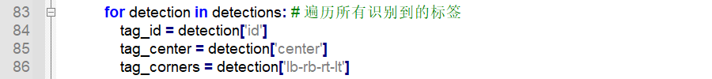

“**tag_id**” refers to tag ID, “**tag_center**” is the coordinate of the tag center and “**tag_corners**” indicates the coordinate of the angular coordinate.

- **Calibrate Camera**

After the coordinate of the tag is obtained, call solvePnP() function in cv2 library to deduce geometric model parameters for camera imaging.

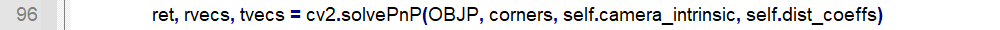

The first parameter “**OBJP**” is the world coordinate of feature point.

The second parameter “**corners**” is the pixel coordinate of the feature points on the image.

The third parameter “**self.camera_intrinsic**” is the intrinsic parameter matrix of the camera.

The fourth parameter “**self.dist_coeffs**” is the distortion parameter of the camera.

- **Acquire Two-dimensional Coordinate**

Call projectPoints() function in cv2 library to calculate the coordinate of the 3D point projected onto the 2D image.

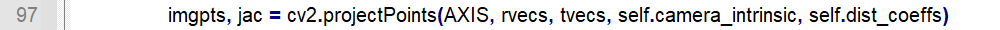

The first parameter “**AXIS**” is the 3D coordinate of the 3D point in the world coordinate system.

The second parameter “**rvecs**” is the rotation vector from the world coordinate system to the camera coordinate system

The third parameter “**tvecs**” is the translation vector from the world coordinate system to the camera coordinate system

The fourth parameter “**self.camera_intrinsic**” is the intrinsic parameter of the camera.

The fifth parameter “**self.dist_coeffs**” is the distortion parameter of the camera

#### 9.1.3.7 Feedback Information

- **Angular Point Identification**

Call circle() function in cv2 library to draw the dots on the four corners of the tag.

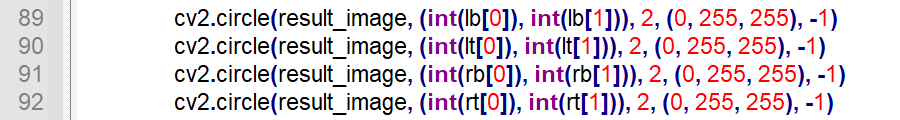

Take “**cv2.circle(result_image, (int(lb\[0\]), int(lb\[1\])), 2, (0, 255, 255), -1)**” for example. The meaning of the parameter in the bracket is as follow.

The first parameter “**result_image**” is the input image.

The second parameter “**(int(lb\[0\]), int(lb\[1\]))**” is the coordinate of the center of a circle.

The third parameter “**2**” is the radius of circle.

The fourth parameter “**(0, 255, 255)**” is the line color, and these three values respectively correspond to B, G and R.

The fifth parameter “**3**” is the line width.

- **Draw Coordinate System**

line() function in cv2 library can be adopted to draw the coordinate axis.

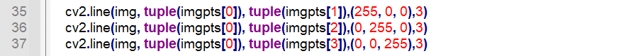

Take “**cv2.line(img, tuple(imgpts\[0\]), tuple(imgpts\[1\]),(255, 0, 0),3)**” for example. The meaning of the parameter in the bracket is as follow.

The first parameter “**img**” refers to the input image.

The second parameter represents the start coordinate of the line

The third parameter “**tuple(imgpts\[1\])**” represents the end coordinate of the line

The fourth parameter “**(255, 0, 0)**” means the color of line. These three values respectively correspond to B, G and R.

The fifth parameter “**3**” refers to the line width.

### 9.1.4 Lesson 4 AR Vision

#### 9.1.4.1 Program Logic

Firstly, through subscribing the topic published by the camera node, the program obtains the RGB image. Then the image will be gray processed and zoomed.

Next, detect the tag to obtain the tag information including tag ID, the coordinate of the tag center and the angular point, etc.

Lastly, execute model projection, polygon filling and other operation to draw 3D image on the designated position of the camera returned image.

The source code of this program is stored in：**/home/hiwonder/jethexa/src/jethexa_tutorial/scripts/ros_opencv_08_ar.py**

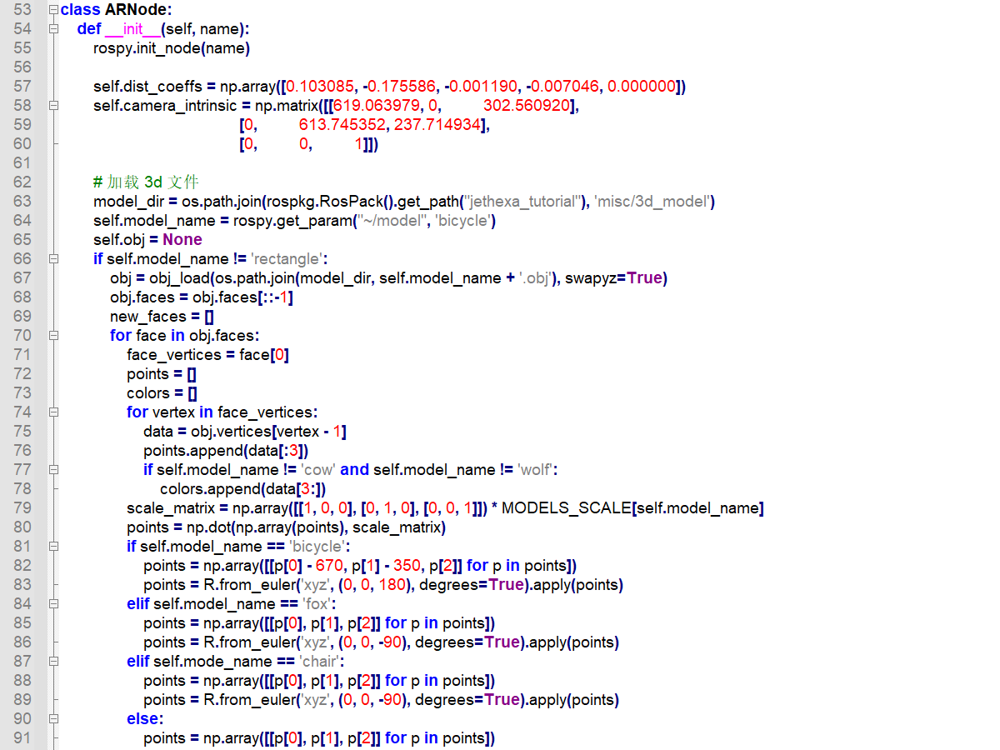

#### 9.1.4.2 **Operation Steps**

The input command should be case sensitive, and the keywords can be complemented by “**Tab**” key.

1. Start JetHexa, and then connect to ubuntu desktop through NoMachine.

2. Click  or press “**Ctrl+Alt+T**” to open command line terminal.

3. Input command “**roslaunch jethexa_tutorial ros_opencv_08_ar.launch**” and press Enter to start the game.

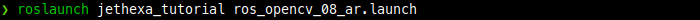

4. If want to close this game, please press “**Ctrl+C**”. If the game cannot be closed, please press the key again.

#### 9.1.4.3 Program Outcome

After the game starts, place the tag card within the camera frame. When the tag is recognized, four corners of the tag will be marked by blue dots, and the 3D image will be displayed on the tag.

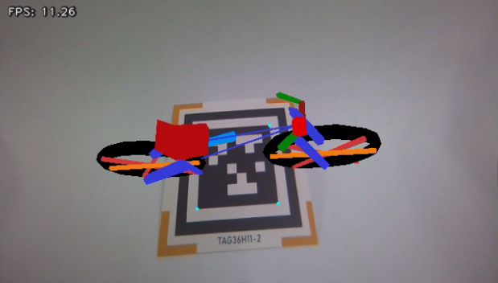

#### 9.1.4.4 Function Extension

#### 9.1.4.5 Change Default Displayed Image

The program is default to display 3D bicycle. And other 3D models are available, including fox, chair, cow, wolf and rectangle.

For example, we can modify the program to display 3D cow. We need to take 6 steps to realize this.

1. Click  at upper left corner or press “**Ctrl+Alt+T**” to open command line terminal.

2. Input command “**rosed jethexa_tutorial ros_opencv_08_ar.py**” and press Enter to open the program file.

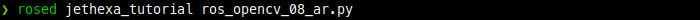

3. Please jump to this line of code.

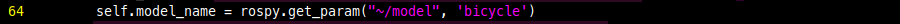

**Note: input the line number and press “Shift+G” to jump to the corresponding line.**

4. Press “**i**” key to enter editing mode and modify the code as “**self.model_name = rospy.get_param("~/model", 'cow')**”.

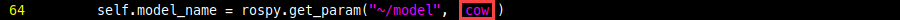

5. After modification, press “**Esc**”, input “**:wq**” and press Enter to save and exit the editing.

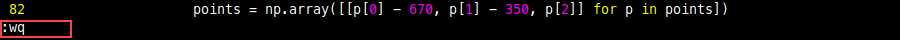

6. Input the command “**roslaunch jethexa_tutorial ros_opencv_08_ar.launch**” to restart the game, and then the 3D cow image will be displayed on the camera returned image.

#### 9.1.4.6 Program Parameter

#### 9.1.4.7 Basic Configuration

- **File Path of 3D Image**

File path of 3D image is required for subsequent loading.

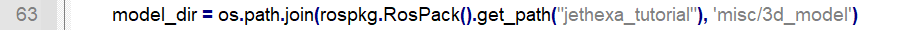

- **Set the Default Displayed Image**

Set the default displayed 3D image. Bicycle is set as the default displayed image in this program.

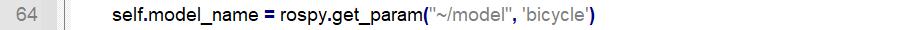

- **Acquire 3d Image Information**

Acquire the related information of the 3D image, including the position, color, etc.

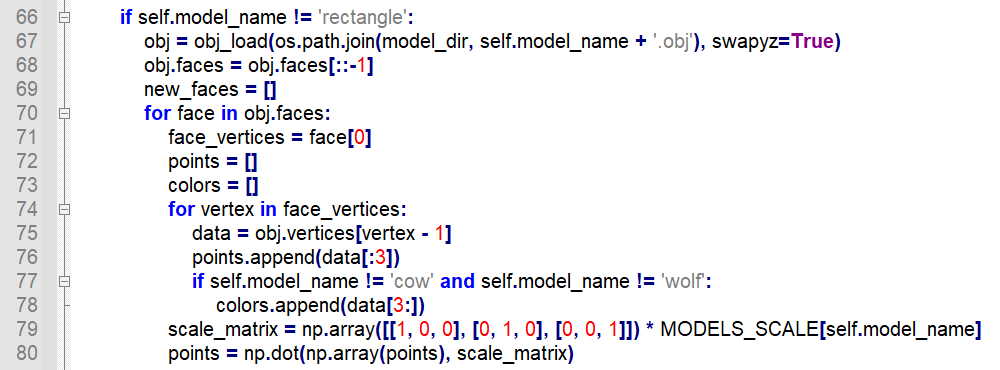

- **Covert Euler Angle into Rotation Matrix**

Convert the Euler angle into rotation matrix for subsequent adjustment of the angle to display the 3D image.

Take “**points = R.from_euler('xyz', (0, 0, 180), degrees=True).apply(points)**” for example. The meaning of the parameter in the bracket is as follow

The first parameter “**xyz**” is the rotation axis.

The second parameter “**(0, 0, 180)**” is the rotation angle i.e. Euler angle.

The third parameter “**degrees=True**” determines the unit of the rotation angle.

- **Subscribe Topic**

**1. Subscribe the topic published by the target detection node to obtain the result of target detection.**

**2. Through subscribing the topic published by the camera node, obtain the real-time image of the camera.**

#### 9.1.4.8 Image Processing

- **Grayscale Processing**

Call **cvtColor()** function in cv2 library to convert the colored image collected by the camera into grayscale image so as to improve computation efficiency.

The first parameter “**rgb_image**” stands for the input image, and the second parameter “**cv2.COLOR_RGB2GRAY**” represents the conversion type of the image.

- **Scale**

resize() function in cv2 library will be adopted to scale the image in order to reduce the calculation amount.

The first parameter “**gray**” in the bracket is the input image, and the second parameter “**(320, 180)**” is the width and length of the image after zooming.

#### 9.1.4.9 Tag Detection

- **Acquire Tag Coordinate**

After the tag is detected, extract the required tag information.

“**tag_id**” refers to tag ID, “**tag_center**” is the coordinate of the tag center and “**tag_corners**” indicates the coordinate of the angular coordinate.

- **Calibrate Camera**

After the coordinate of the tag is obtained, call solvePnP() function in cv2 library to deduce geometric model parameters for camera imaging.

The first parameter “**OBJP**” is the world coordinate of feature point.

The second parameter “**corners**” is the pixel coordinate of the feature points on the image.

The third parameter “**self.camera_intrinsic**” is the intrinsic parameter matrix of the camera.

The fourth parameter “**self.dist_coeffs**” is the distortion parameter of the camera.

- **Acquire Two-dimensional Coordinate**

Call projectPoints() function in cv2 library to calculate the coordinate of the 3D point projected onto the 2D image.

Take “**imgpts, jac = cv2.projectPoints(AXIS, rvecs, tvecs, self.camera_intrinsic, self.dist_coeffs)**” for example. The meaning of the parameter in the bracket is as follow.

The first parameter “**AXIS**” is the 3D coordinate of the 3D point in the world coordinate system.

The second parameter “**rvecs**” is the rotation vector from the world coordinate system to the camera coordinate system

The third parameter “**tvecs**” is the translation vector from the world coordinate system to the camera coordinate system

The fourth parameter “**self.camera_intrinsic**” is the intrinsic parameter of the camera.

The fifth parameter “**self.dist_coeffs**” is the distortion parameter of the camera

#### 9.1.4.10 Draw 3D Image

- **Draw Cube**

If the displayed image you set is cube, there is no need to call the external file. **drawContours()** and **line()** function in cv2 library can be directly called to draw the cube.

**1.** **drawContours()** function can be used to draw the specific contour, and the meaning of the parameter in the bracket is as follow.**

The first parameter “**img**” is the input image.

The second parameter “**\[imgpts\[4:\]\]**” is the contour, and in Python, it serve as List.

The third parameter “**-1**” is used to specify which contour in contour List is drawn. And “**-1**” means that all the contours in the list will be drawn.

The fourth parameter “**(255, 255, 0)**” is the color of the contour line and the values in the bracket respectively correspond to B, G and R.

The fifth parameter “**-1**” is the width of the contour line. And “**-1**” means that the interior of the contour will be filled.

**2. line() function is used to draw the straight line. And the meaning of the parameters is as follow.**

The first parameter “**img**” is the input image

The second parameter “**tuple(imgpts\[i\])**” is the starting coordinate of the line.

The third parameter “**tuple(imgpts\[j\])**” is the end coordinate of the line.

The fourth parameter “**(255)**” is the color of the line.

The fifth parameter “**3**” is the width of the line.

- **Coloring**

fillConvexPoly() function can be used to color the polygon.

Take “**cv2.fillConvexPoly(result_image, imgpts, (255, 255, 0)**” for example. The meaning of the parameter in the bracket is as follows.

The first parameter “**result_image**” is the input image.

The second parameter “**imgpts**” is the vertex of the polygon.

The third parameter “**(255, 255, 0)**” stands for the color, and the values respectively corresponds to R, G and B.

## 9.2 ROS+OpenCV Vision Tracking Lesson

### 9.2.1 Lesson 1 Colored Block Locating

#### 9.2.1.1 Program Logic

Firstly, through subscribing the topic published by the camera node, the program obtains the RGB image. Then the image will be zoomed, Gaussian blurred and converted from RGB into LAB.

Next, perform binaryzation, corrosion, dilation, etc., on the image to obtain the maximum contour which contains the target color.

Lastly, display the recognition result on the camera returned image and the terminal.

The source code of this program is stored in：**/home/hiwonder/jethexa/src/jethexa_tutorial/scripts/ros_opencv_tracking_01_color_blob.py**

#### 9.2.1.2 Operation Steps

**Note:**

**1.** **The input command should be case sensitive, and the keywords can be complemented by “**Tab**” key.**

**2. Red, green and blue can be recognized.**

1. Start JetHexa, and then connect to ubuntu desktop through NoMachine.

2. Double click  or press “**Ctrl+Alt+T**” to open command line terminal.

3. Input command “**roslaunch jethexa_tutorial ros_opencv_tracking_01_color_blob.launch color:=red**” and press Enter to start the game.

If you want to change the recognition color, you can directly modify “**red**” at the end of the command as other color.

4. If want to close this game, please press “**Ctrl+C**”. If the game cannot be closed, please press the key again.

#### 9.2.1.3 Program Outcome

**Note: after the game starts, please ensure there is no other object containing the recognition color except the target object within the camera frame, otherwise the recognition result will be affected.**

After the game starts, put the colored block within the camera frame. When the colored block is recognized, the block will be circled in the corresponding color on the camera returned image, and its coordinate will be printed on the terminal.

#### 9.2.1.4 Program Analysis

#### 9.2.1.5 **Basic Configuration**

- **Command Line Interface**

Create the required command line interface through Argparse module. The whole process involves creating parser, adding parameter and parsing parameters.

Take “**parser.add_argument('target_color', metavar='color', nargs='?', type=str, help="颜色名称如 red", default="red")**” for example. The meaning of the parameters is as follow.

The first parameter “**'target_color'**” is the name of parameter or a list of option strings.

The second parameter “**metavar='COLOR NAME**” is the parameter name displayed when the user obtain the **help** information.

The third parameter “**nargs='?'**” refers to the quantity of the command line parameters that should be consumed.

The fourth parameter “**type=str**” indicates the type of the parameter.

The fifth parameter “**help="颜色名称"**” is the simple description of the option.

The sixth parameter “**default="red"**’ is the default parameter, which means that the default recognition color is red.

- **Subscribe Topic**

Obtain the camera image in real time through subscribing the topic published by the camera node.

#### 9.2.1.6 Process Image

- **Binarization Processing**

Adopt inRange() function in cv2 library to binarize the image.

The first parameter “**img_lab**” is the input image.

The second parameter “**tuple(self.target_color_range\['min'\])**” is the minimum value of the color threshold.

The third parameter “**tuple(self.target_color_range\['max'\])**” is the maximum value of the color threshold.

When the RGB value of a pixel is within the range of color threshold, this pixel will assigned as “**1**”, otherwise “**0**”.

- **Corrosion and Dilation**

Perform corrosion and dilation on the image to smooth the contour edge of the image for the convenience of finding the target contour.

erode() function is used for corrosion. Take “**eroded = cv2.erode(mask, cv2.getStructuringElement(cv2.MORPH_RECT, (3, 3)))**” for example. The meaning of the parameters in the bracket is as follow.

The first parameter “**mask**” is the input image.

The second parameter “**cv2.getStructuringElement(cv2.MORPH_RECT, (3, 3))**” is the structuring element or kernel determining the nature of the operation. The first parameter in the bracket refers to the kernel shape. And the second parameter is the kernel size.

dilate() function is used for dilation. The meaning of the parameters is the same as that of erode() function.

- **Acquire the Contour with Maximum Area**

Call findContours() function in cv2 library to search for the maximum contour of the target recognition color in the image.

The first parameter “**dilated**” is the input image.

The second parameter “**cv2.RETR_EXTERNAL**” is the contour retrieving mode.

The third parameter “**cv2.CHAIN_APPROX_NONE**” is the method of contour approximation.

#### 9.2.1.7 Information Feedback

- **Mark on the Camera Returned Image**

**1.** **Call **minEnclosingCircle()** function in cv2 library to obtain the minimum circumcircle of the target contour.**

**2. Call circle() function in cv2 library to circle the target contour on the camera returned image.**

The first parameter “**result_image**” is the input image.

The second parameter “**(int(center_x), int(center_y))**” is the coordinate of the circle center.

The third parameter “**int(radius)**” is the radius of the circle.

The fourth parameter “**circle_color**” is the color of the circle.

The fifth parameter is the width of the circle border.

- **Print the Coordinate of Colored Block**

**1.** **Call **putText()** function in cv2 library to print the coordinate of the colored block on the camera returned image.**

The first parameter “**result_image**” is the input image.

The second parameter “**string**” is the added text i.e. the coordinate of the block.

The third parameter “**(int(center_x), int(center_y + 16))**” is the coordinate of the upper left corner of the added text.

The fourth parameter “**cv2.FONT_HERSHEY_SIMPLEX**” is the font of the text.

The fifth parameter “**0.6**” is the font size.

The sixth parameter “**draw_color**” is the font color. And the color order is B, G and R.

The seventh parameter “**2**” is the font weight.

**2. Call print() function to print the coordinate of the block on the terminal.**

### 9.2.2 Lesson 2 Color Tracking

#### 9.2.2.1 Program Logic

Firstly, through subscribing the topic published by the camera node, the program obtains the RGB image. Then the image will be zoomed, Gaussian blurred and converted from RGB into LAB.

Next, perform binaryzation, corrosion, dilation, etc., on the image to obtain the maximum contour which contains the target color.

Lastly, the target contour will be marked on the camera returned image. According to the relative position of the contour center to the image center, adjust the pitch angle and yaw angle of JetHexa so as to realize target contour tracking.

The source code of this program is stored in **/home/hiwonder/jethexa/src/jethexa_tutorial/scripts/ros_opencv_tracking_02_color_tracking.py**

#### 9.2.2.2 Operation Steps

**Note:**

1. The input command should be case sensitive, and the keywords can be complemented by “**Tab**” key.

2. Red, green and blue can be recognized.

1. Start JetHexa, and then connect to ubuntu desktop through NoMachine.

2. Double click  or press “**Ctrl+Alt+T**” to open command line terminal.

3. Input command “**roslaunch jethexa_tutorial ros_opencv_tracking_02_color_tracking.launch color:=red**” and press Enter to start the game.

If you want to change the recognition color, you can directly modify “**red**” at the end of the command as other color.

4. If want to close this game, please press “**Ctrl+C**”. If the game cannot be closed, please press the key again.

#### 9.2.2.3 Program Outcome

**Note: after the game starts, please ensure there is no other object containing the recognition color except the target object within the camera frame, otherwise the recognition result will be affected.**

After the game starts, put the colored object within the camera frame. When the object is recognized, it will be circled in the corresponding color on the camera returned image, and its pitch angle and yaw angle will be printed on the terminal.

#### 9.2.2.4 Program Analysis

#### 9.2.2.5 **Basic Configuration**

- **Command Line Interface**

Create the required command line interface through Argparse module. The whole process involves creating parser, adding parameter and parsing parameters.

Take “**parser.add_argument('target_color', metavar="COLOR NAME", nargs='?', type=str, help="颜色名称", default='red')**” for example. The meaning of the parameters is as follow.

The first parameter “**'target_color'**” is the name of parameter or a list of option strings.

The second parameter “**metavar='COLOR NAME**” is the parameter name displayed when the user obtain the **help** information.

The third parameter “**nargs='?'**” refers to the quantity of the command line parameters that should be consumed.

The fourth parameter “**type=str**” indicates the type of the parameter.

The fifth parameter “**help="颜色名称"**” is the simple description of the option.

The sixth parameter “**default="red"**’ is the default parameter, which means that the default recognition color is red.

- **Subscribe Topic**

Obtain the camera image in real time through subscribing the topic published by the camera node.

- **Reset Servo**

Initialize the servos of JetHexa that is reset servo.

#### 9.2.2.6 Process Image

- **Binarization Processing**

Adopt inRange() function in cv2 library to binarize the image.

The first parameter “**img_lab**” is the input image.

The second parameter “**tuple(self.target_color_range\['min'\])**” is the minimum value of the color threshold.

The third parameter “**tuple(self.target_color_range\['max'\])**” is the maximum value of the color threshold.

When the RGB value of a pixel is within the range of color threshold, this pixel will assigned as “**1**”, otherwise “**0**”.

- **Corrosion and Dilation**

Perform corrosion and dilation on the image to smooth the contour edge of the image for the convenience of finding the target contour.

erode() function is used for corrosion. Take “**eroded = cv2.erode(mask, cv2.getStructuringElement(cv2.MORPH_RECT, (3, 3)))**” for example. The meaning of the parameters in the bracket is as follow.

The first parameter “**mask**” is the input image.

The second parameter “**cv2.getStructuringElement(cv2.MORPH_RECT, (3, 3))**” is the structuring element or kernel determining the nature of the operation. The first parameter in the bracket refers to the kernel shape. And the second parameter is the kernel size.

dilate() function is used for dilation. The meaning of the parameters is the same as that of erode() function.

- **Acquire the Contour with Maximum Area**

Call findContours() function in cv2 library to search for the maximum contour of the target recognition color in the image.

The first parameter “**dilated**” is the input image.

The second parameter “**cv2.RETR_EXTERNAL**” is the contour retrieving mode.

The third parameter “**cv2.CHAIN_APPROX_NONE**” is the method of contour approximation.

#### 9.2.2.7 Information Feedback

- **Obtain the Minimum Circumscribed Circle**

Call minEnclosingCircle() function in cv2 library to obtain the minimum circumscribed circle of the target contour.

- **Mark Target Contour**

Call circle() function in cv2 library to circle the target contour on the camera returned image.

The first parameter “**result_image**” is the input image.

The second parameter “**(int(center_x), int(center_y))**” is the coordinate of the circle center.

The third parameter “**int(radius)**” is the radius of the circle.

The fourth parameter “**circle_color**” is the color of the circle.

The fifth parameter is the width of the circle border.

#### 9.2.2.8 Action Feedback

- **Adjust Pitch Angle**

If the difference between the Y-axis coordinate of target contour center and the Y-axis coordinate of the camera returned image center is greater than the set threshold, the PID controller of pitch angle will be adjusted. Otherwise, reset the PID controller of the pitch angle.

- **Adjust Yaw Angle**

If the difference between the X-axis coordinate of target contour center and the X-axis coordinate of the camera returned image center is greater than the set threshold, the PID controller of pitch angle will be adjusted. Otherwise, reset the PID controller of the pitch angle.

Call loginfo() function in rospy library to print the pitch angle and yaw angle on the terminal.

- **Restrict the Servo Rotation Angle**

To protect the servo from over rotating, limit the rotation angle of the servo in the program.

- **Control Servo Rotation**

According to the obtained data output by PUD controller, set the angle of specific servo.

### 9.2.3 Lesson 3 AprilTag Locating

#### 9.2.3.1 Program Logic

Firstly, call **cvtColor** function to convert the image from RGB image into grayscale image. Then call **tag_detector.detect** function to recognize tag, obtain tag ID, the position of center point and four angular points. Lastly, circle four corners of the tag, and draw the 3D coordinate axis of the tag and display the tag ID and coordinate.

The source code of this program is stored in **/home/hiwonder/jethexa/src/jethexa_tutorial/scripts/ros_opencv_03_tag_detect.py**

#### 9.2.3.2 Operation Steps

**Note:** the input command should be case sensitive, and keywords can be complemented by **Tab** key.

1. Click  on the desktop to open the command line terminal

2. Input command “**roslaunch jethexa_tutorial ros_opencv_03_tag_detect.launch**” and press Enter to start the game.

3. If want to close this program, press “**Ctrl+C**”. If the program cannot be closed, press the key again.

#### 9.2.3.3 Program Outcome

> After the program runs, the tag will be recognized, and 3D coordinate axis and angular point of the tag center will be drawn. And tag ID and coordinate can be printed on the terminal.

#### 9.2.3.4 Program Parameter

#### 9.2.3.5 Tag Detection

- **Grayscale Processing**

Call cvtColor() function in cv2 library to convert the colored image collected by the camera into grayscale image, change the size and collect the tag information from the image.

- **Extract Tag Information**

Extract the required information after obtaining the tag information.

“**tag_id**” is the tag coordinate, “**tag_center**” is the tag center, and “**tag_corners**” is the four corners of the tag.

#### 9.2.3.6 Draw Coordinate Axis

> Call line function in cv2 library to draw the coordinate axis on the camera returned image.

Take “**cv2.line(img, tuple(imgpts\[0\]), tuple(imgpts\[1\]),(255, 0, 0),3)**” for example. The meaning of the parameter in the bracket is as follow.

1. The first parameter “**img**” is the input image.

2. The second parameter “**tuple(imgpts\[0\]), tuple(imgpts\[1\])**” is the starting coordinate and end coordinate of line segment on coordinate axis.

3. The third parameter “**(255, 0, 0)**” is the color of the line segment, and the values respectively correspond to B, G and R

4. The fourth parameter “**3**” is the width of the line segment.

#### 9.2.3.7 Draw Angular Point

Call circle function in cv2 library to draw the angular point of the tag.

Take “**cv2.circle(result_image, (int(lb\[0\]), int(lb\[1\])), 2, (0, 255, 255), -1)**” for example. And the meaning of the parameter in the bracket is as follow.

1. The first parameter “**result_image**” is the image on the recognition screen.

2. The second parameter “**(int(lb\[0\]), int(lb\[1\]))**” is the center of the drawn center. The current parameter refers to the point at the bottom left corner of the tag.

3. The third parameter “**2**” is the radius of the circle

4. The fourth parameter “**(0, 255, 255)**” is the color of the circle

5. The fifth parameter “**-1**” is the width of the circle contour. And negative number stands for solid circle

#### 9.2.3.8 Print Tag Property

Lastly, Tag ID and coordinate will be printed.

### 9.2.4 Lesson 4 AprilTag Tracking

#### 9.2.4.1 Program Logic

AprilTag is a visual positioning marker, which is similar to QR code or bar code. It can facilitate the tag detection and relative position calculation. It’s mainly applied to AR, robot and camera calibration, etc.

The process of tag tracking is as follow.

Firstly, program to recognize tag, which involves image graying, positioning and other operations.

Next, encode and decode the tag, and display the recognition result on the camera returned image and terminal interface.

Lastly, according to the distance between the tag and the camera, control JetHexa to move with the tag so as to realize tag tracking.

The source code of this program is stored in: **/home/hiwonder/jethexa/src/jethexa_tutorial/scripts/ros_opencv_04_tag_track.py**

#### 9.2.4.2 Operation Steps

**Note:** the input command should be case sensitive and the key words can be complemented by Tab key.

1. Click  on the desktop to open command line terminal.

2. Input “**roslaunch jethexa_tutorial ros_opencv_04_tag_track.launch**” command and press Enter to start the game.

3. If you want to close this program, press “**Ctrl+C**”. If the program cannot be closed, press the key again.

#### 9.2.4.3 Program Outcome

> After the program runs, the robot will march on the spot. The tag within the camera frame will be recognized, and the 3D coordinate axis of tag center and the angular points will be drawn. At the same time, the robot will move with the tag.

#### 9.2.4.4 Function Extension

#### 9.2.4.5 Modify Default

The distance threshold has been set in the program, which is used to decide JetHexa perform which action for feedback.

After the tag is recognized, the side length of the tag on the image will be calculated and the side length is the threshold for judgement. When the side length is greater than 20 pixels, the robot will move backward till the side length is less than or equal to 20 pixels. When the side length is less than 20 pixels, the robot will move forward till the side length is more than or equal to 20 pixels.

For example, set 30 pixel as the default threshold according to the below steps.

1. Click  or press “**Ctrl+Alt+T**” to open command line terminal

2. Input command “**rosed jethexa_tutorial ros_opencv_04_tag_track.py**” and press Enter to open the program file.

3. Press “**i**” key to enter the editing mode, and find the codes in the red frame.

**Note: we can input the line number and press “Shift+G” to jump to the corresponding line.**

4. Modify the threshold as “**30**”. After modification, press “**Esc**” key and input “**:wq**” and press Enter to save and exit editing.

5. Input command “**roslaunch jethexa_tutorial ros_opencv_04_tag_track.launch**” and press Enter to restart the game to check the JetHexa’s performance.

#### 9.2.4.6 Change the Default Moving Speed

The program has set the forward and backward speed as the value calculated by PID. The speed can be changed by adjusting **P value** that will affect the forward and backward speed. For example, we can modify P value as 3 according to the steps below.

1. Click  to open command line terminal

2. Input command “**rosed jethexa_tutorial ros_opencv_04_tag_track.py**” and press Enter to open the program file.

3. Press “**i**” key to enter the editing mode and find the codes in the red frame.

**Note: we can input the line number and press “Shift+G” to jump to the corresponding line.**

4. Set the P value relates to moving forward as “**3**”. After modification, press “**Esc**” key and input “**:wq**” and press Enter to save and exit the editing.

5. Input command “**roslaunch jethexa_tutorial ros_opencv_04_tag_track.launch**” to restart the game and check JetHexa’s performance.

#### 9.2.4.7 Program Parameter

#### 9.2.4.8 Tag Detection

- **Image Graying**

Call **cvtColor()** function in cv2 library to convert the collected colored image into grayscale image and collect the tag information.

- **Extract Tag Information**

After collecting the tag information, extract the useful information.

“**tag_id**” is tag coordinate, “**tag_center**” is the tag center, and “**tag_corners**” is four angular points of the tag.

#### 9.2.4.9 Draw Coordinate Axis

> Call line function in cv2 library to draw the coordinate axis on the camera returned image.

Take “**cv2.line(img, tuple(imgpts\[0\]), tuple(imgpts\[1\]),(255, 0, 0),3)**” for example. The meaning of the parameters in the bracket is as follow.

1. The first parameter “**img**” is the input image.

2. The second parameter “**tuple(imgpts\[0\]), tuple(imgpts\[1\])**” is starting coordinate and end coordinate of the coordinate line segment.

3. The third parameter “**(255, 0, 0)**” is the color of line segment, and the values respectively correspond to B, G and R.

4. The fourth parameter “**3**” is the width of line segment.

#### 9.2.4.10 Draw Angular Point

Call circle function in cv2 library to circle the angular points of the tag.

Take “**cv2.circle(result_image, (int(lb\[0\]), int(lb\[1\])), 2, (0, 255, 255), -1)**” for example. The meaning of the parameters in the bracket is as follow.

1. The first parameter “**result_image**” is the image on the screen.

2. The second parameter “**(int(lb\[0\]), int(lb\[1\]))**” is to draw the circle center. And **(int(lb\[0\]), int(lb\[1\]))** corresponds to the point at the bottom left corner of the tag.

3. The third parameter “**2**” is the radius of the drawn circle.

4. The fourth parameter “**(0, 255, 255)**” is the color of the circle.

5. The fifth parameter “**-1**” represents the contour width of the circle. Negative number stands for the solid circle.
