# 1. JetHexa User Manual

## 1.1 Product Overview

### 1.1.1 Overview of JetHexa

::: Starter Kit

JetHexa Starter Kit is a comprehensive hexapod robot developed for ROS educational scenarios. It runs Ubuntu 22.04 LTS and comes pre-installed with the ROS 2 Humble robotics operating system.

Powered by the NVIDIA Jetson Orin Nano/Orin NX controller, high-voltage bus servos, and a monocular camera, it enables robotic motion control, human body feature recognition, and body posture interaction. Integrated with OpenCV and YOLO26, it performs color recognition, object tracking, and waste sorting, fulfilling requirements for learning and validating ROS 2 and machine vision algorithms.

For locomotion, it employs a hexapod ripple gait with adjustable body posture, height, and speed, delivering an enhanced control experience.

:::

::: Standard Kit

JetHexa Standard Kit is a comprehensive hexapod robot developed for ROS educational scenarios. It runs Ubuntu 22.04 LTS and comes pre-installed with the ROS 2 Humble robotics operating system.

Powered by high-performance hardware configurations including the NVIDIA Jetson Orin Nano/Orin NX controller, high-voltage bus servos, a COIN-D6 LiDAR, a monocular camera, and a WonderEcho Pro AI voice interaction box, it enables robotic motion control, mapping and navigation, tracking and obstacle avoidance, autonomous cruising, human body feature recognition, body posture interaction, voice control, and large AI model applications. Integrated with OpenCV and YOLO26, it performs color recognition, object tracking, and waste sorting, fulfilling requirements for learning and validating ROS 2 and machine vision algorithms.

For locomotion, it employs a hexapod ripple gait with adjustable body posture, height, and speed, delivering an enhanced control experience.

:::

::: Advanced Kit

JetHexa Advanced Kit is a comprehensive hexapod robot developed for ROS educational scenarios. It runs Ubuntu 22.04 LTS and comes pre-installed with the ROS 2 Humble robotics operating system.

Powered by high-performance hardware configurations including the NVIDIA Jetson Orin Nano/Orin NX controller, high-voltage bus servos, a COIN-D6 LiDAR, an Aurora930 Pro 3D depth camera, and a WonderEcho Pro AI voice interaction box, it enables robotic motion control, mapping and navigation, tracking and obstacle avoidance, autonomous cruising, human body feature recognition, body posture interaction, voice control, and large AI model applications. Integrated with OpenCV and YOLO26, it performs color recognition, object tracking, and waste sorting, fulfilling requirements for learning and validating ROS 2 and machine vision algorithms.

For locomotion, it employs a hexapod ripple gait with adjustable body posture, height, and speed, delivering an enhanced control experience.

:::

::: Ultimate Kit

JetHexa Ultimate Kit is a comprehensive hexapod robot developed for ROS educational scenarios. It runs Ubuntu 22.04 LTS and comes pre-installed with the ROS 2 Humble robotics operating system.

Powered by high-performance hardware configurations including the NVIDIA Jetson Orin Nano/Orin NX controller, high-voltage bus servos, an RPLIDAR C1 LiDAR, an Aurora930 Pro 3D depth camera, and a WonderEcho Pro AI voice interaction box, it enables robotic motion control, mapping and navigation, tracking and obstacle avoidance, autonomous cruising, human body feature recognition, body posture interaction, and large AI model applications. Integrated with OpenCV and YOLO26, it performs color recognition, object tracking, and waste sorting, fulfilling requirements for learning and validating ROS 2 and machine vision algorithms.

For locomotion, it employs a hexapod ripple gait with adjustable body posture, height, and speed, delivering an enhanced control experience.

:::

### 1.1.2 Packing List

::: Starter Kit

| Item | Image | Qty. | Item | Image | Qty. |
| :---: | :---: | :---: | :---: | :---: | :---: |
| JetHexa | 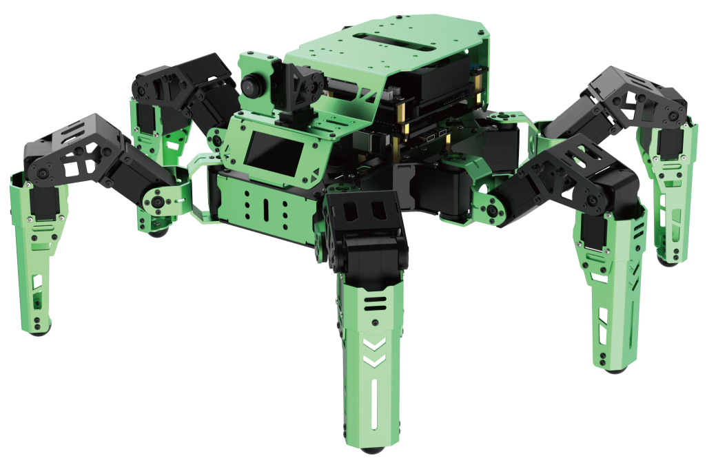 | 1 | EVA color block (35 mm) | 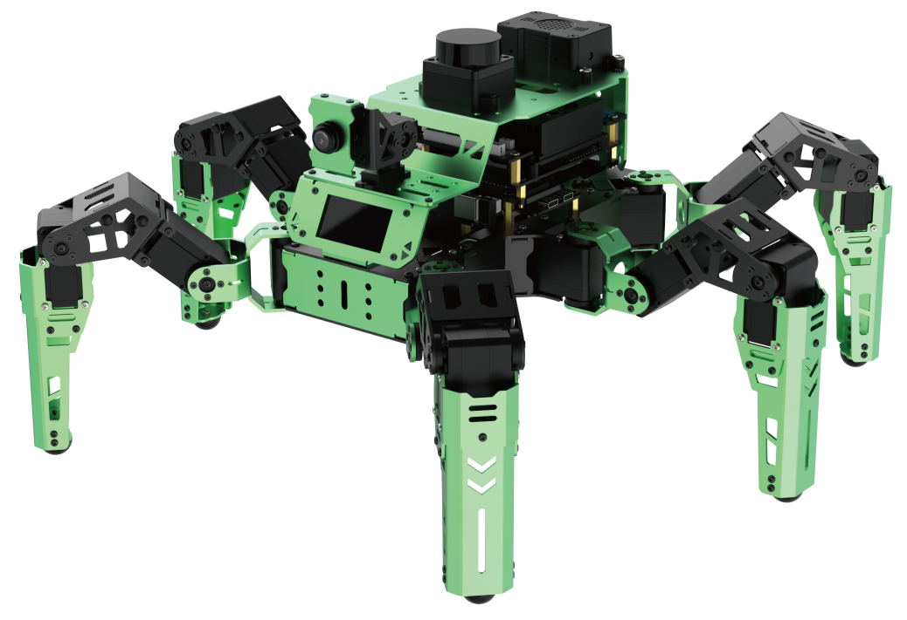 | 1 |
| Wireless controller |  | 1 | Tag cards (65 × 65 mm) | 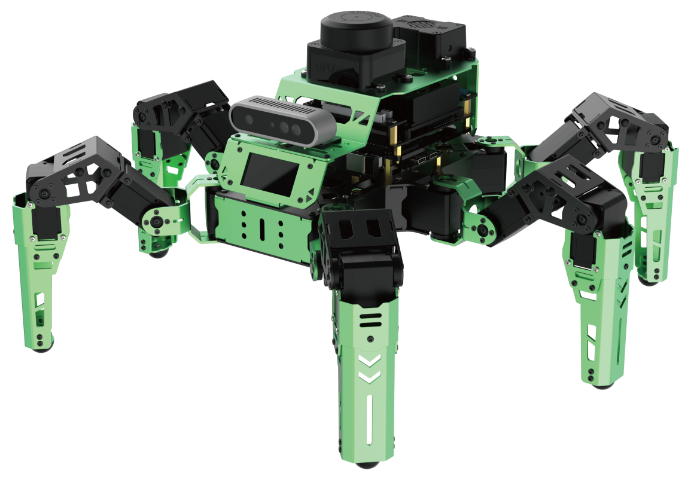 | 3 |
| 12.6 V 2 A charger (DC5.5 × 2.5) |  | 1 | Screwdriver and screw accessory pack |  | 1 |
| Card reader |  | 1 | 5264 servo cables (100 mm / 160 mm) | 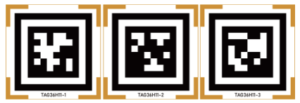 | 2 |

:::

::: Standard Kit

| Item | Image | Qty. | Item | Image | Qty. |
| :---: | :---: | :---: | :---: | :---: | :---: |
| JetHexa |  | 1 | EVA color block (35 mm) |  | 1 |
| Wireless controller |  | 1 | Tag cards (65 × 65 mm) | 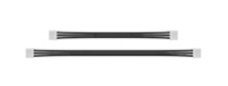 | 3 |
| 12.6 V 2 A charger (DC5.5 × 2.5 male plug) |  | 1 | Screwdriver and screw accessory pack |  | 1 |
| Card reader |  | 1 | 5264 servo cables (100 mm / 160 mm) |  | 2 |

:::

::: Advanced Kit

| Item | Image | Qty. | Item | Image | Qty. |
| :---: | :---: | :---: | :---: | :---: | :---: |
| JetHexa | 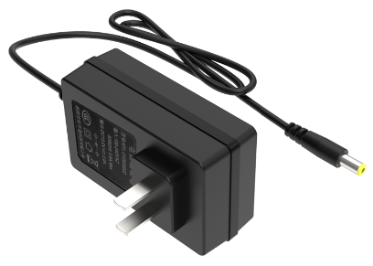 | 1 | EVA color block (35 mm) | 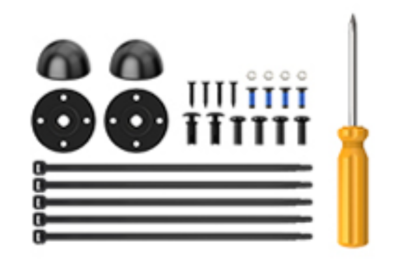 | 1 |
| Wireless controller | 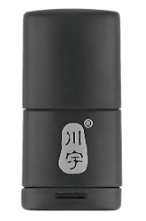 | 1 | Tag cards (65 × 65 mm) |  | 3 |
| 12.6 V 2 A charger (DC5.5 × 2.5 male plug) | 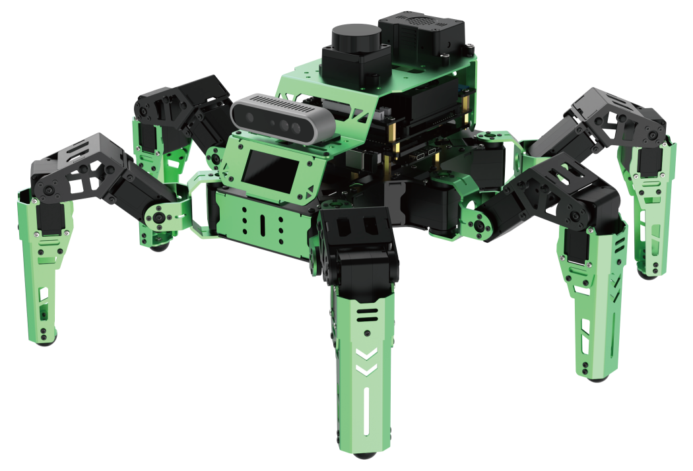 | 1 | Screwdriver and screw accessory pack |  | 1 |
| Card reader |  | 1 | 5264 servo cables (100 mm / 160 mm) |  | 2 |

:::

::: Ultimate Kit

| Item | Image | Qty. | Item | Image | Qty. |
| :---: | :---: | :---: | :---: | :---: | :---: |
| JetHexa |  | 1 | EVA color block (35 mm) |  | 1 |
| Wireless controller |  | 1 | Tag cards (65 × 65 mm) |  | 3 |
| 12.6 V 2 A charger (DC5.5 × 2.5 male plug) |  | 1 | Screwdriver and screw accessory pack |  | 1 |
| Card reader |  | 1 | 5264 servo cables (100 mm / 160 mm) |  | 2 |

:::

## 1.2 Hardware Interfaces and Wiring

This chapter introduces the hardware architecture of the JetHexa robot, including the electronic control system, the Jetson series controller, LiDAR, and camera sensors such as monocular and depth cameras.

### 1.2.1 Port Descriptions

#### 1.2.1.1 Jetson Orin Nano/Orin NX Controller

The following diagrams illustrate the ports on the Jetson Orin Nano controller connected to each module in the Ultimate Kit. Refer to the tables below for standard wiring connections. If the purchased kit does not include a specific module, skip the corresponding port.


| No. | Port Name |
| :---: | :--- |
| ① | Jetson Orin Nano controller power port |
| ② | Dummy HDMI/DP display port |
| ③ | LiDAR port |
| ④ | Hub port |
| ⑤ | WonderEcho Pro voice box port |
| ⑥ | LCD screen port |
| ⑦ | Wired network port |

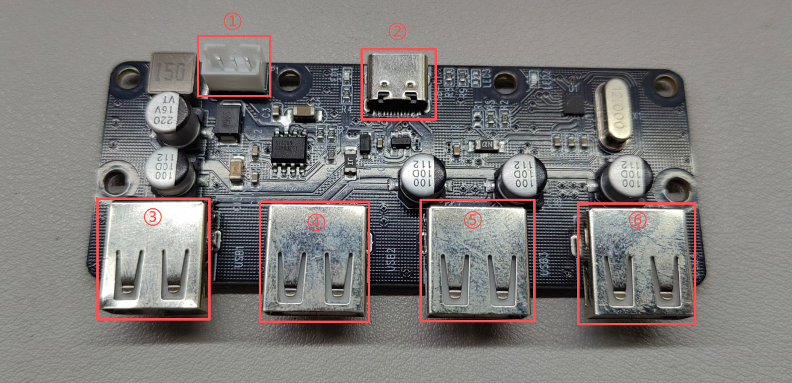

| No. | Port Name |
| :---: | :--- |
| ① | Hub 3-pin power port |
| ② | Hub communication port |
| ③ | Custom expansion port |
| ④ | Custom expansion port |
| ⑤ | STM32 communication port |
| ⑥ | Monocular/depth camera port |

#### 1.2.1.2 STM32 Robot Controller Ports

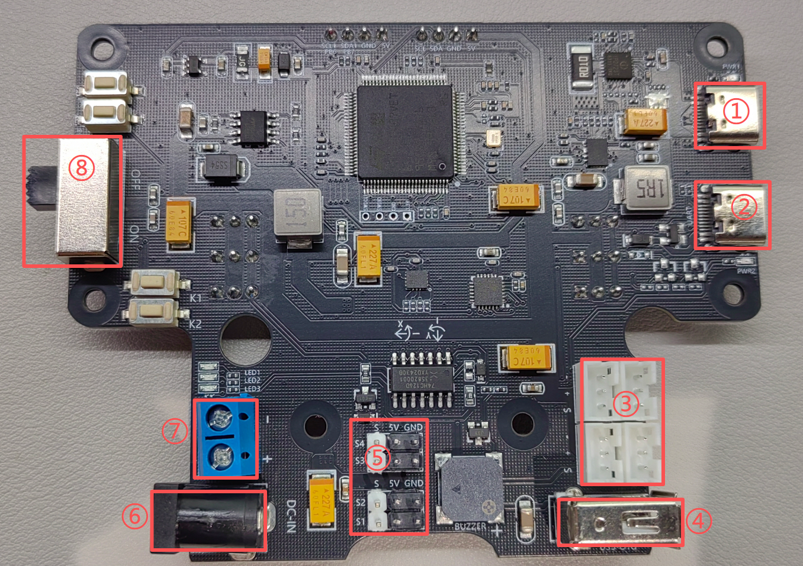

| No. | Function Description |
| :---: | :--- |
| ① | 5V power output port |
| ② | UART serial port for controller communication |
| ③ | Power port for Jetson Orin Nano/Orin NX, hub, and LiDAR |
| ④ | USB wireless controller receiver port |
| ⑤ | 4-channel PWM servo ports |
| ⑥ | 12.6 V charger port |
| ⑦ | Lithium battery power port |
| ⑧ | Power switch |

#### 1.2.1.3 STM32 Controller Wiring Diagram

* Connect one end of the **Type-C** data cable to the **Type-C** port on the front of the controller.

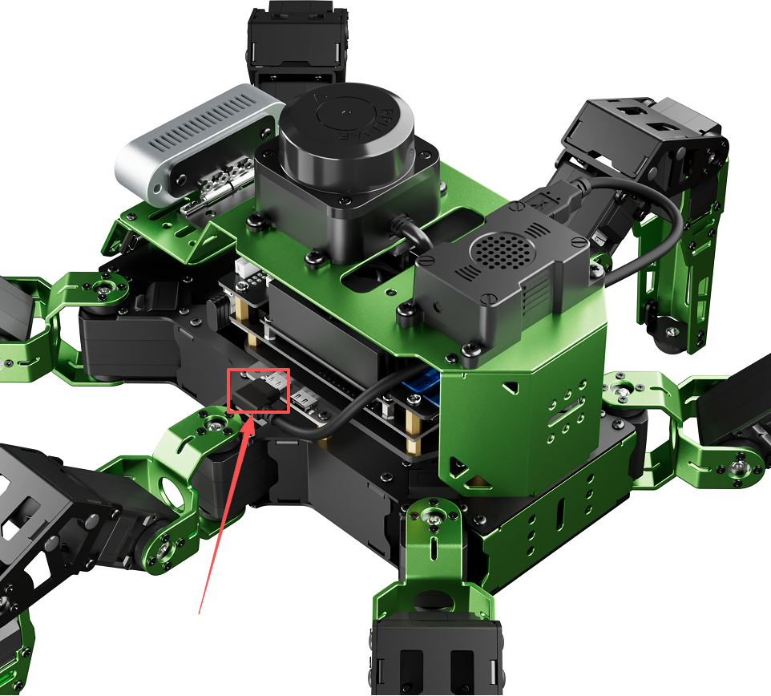

* Connect the other end to the second **USB** port of the **USB** hub, using the **Jetson** controller as an example. The connection port position remains identical for Raspberry Pi 5.

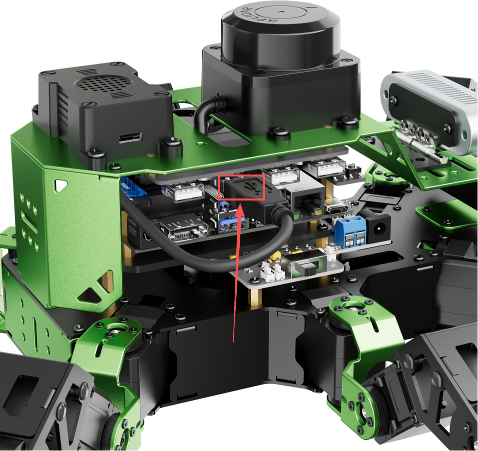

## 1.3 Basic Operation Guide

This section covers the startup status of the robot, hardware module verification, app remote control, and wireless controller operation.

To connect to the robot using remote tools, explore advanced features, or inspect program source code, refer to [Section 1.4 Development Environment Setup](#quick-mapping-navigation).

### 1.3.1 Charging Instructions

The battery is disconnected and partially discharged prior to shipping to ensure safety during transit. Before initial operation, connect the battery power cables and fully charge the battery. Charging the battery from 10 V to approximately 12.3 V takes 2–3 hours.

#### 1.3.1.1 Lithium Battery Safety Guidelines

> [!NOTE]
>
> * **Use only the dedicated charger included in the kit and ensure that the robot is powered off during charging. Never operate the robot while charging. The charger indicator glows red during charging and turns green once charging is complete.**
>
> * **Disconnect the charger promptly after completion. If the battery voltage drops below 10 V or the buzzer beeps continuously, stop operation immediately and recharge the battery.**
>
> * **For long-term storage, charge the battery fully, disconnect all cables, and store it in a cool, dry environment free of strong static electricity or magnetic fields, away from high temperatures and liquids.**
>
> * **Never impact, drop, step on, disassemble, modify, or solder the battery or charger. Never connect the battery directly to an AC power outlet or short-circuit the positive and negative terminals with metal objects to prevent severe damage, overheating, or fire.**

Solemn Statement: Failure to adhere to the aforementioned safety guidelines and operating standards may result in equipment damage, financial loss, or safety accidents, for which the manufacturer assumes no liability.

#### 1.3.1.2 Charging Procedure

> [!NOTE]
>
> **Before powering on the robot for the first time, ensure that the battery cables located at the bottom of the chassis are firmly connected. Remove the two bottom screws to open the sheet metal compartment and inspect the connections.**
>
> 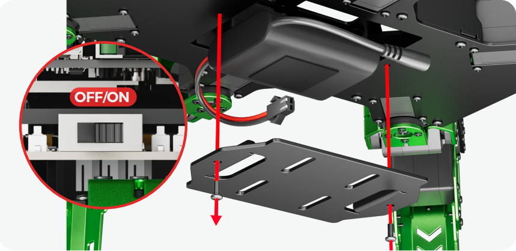
>
> 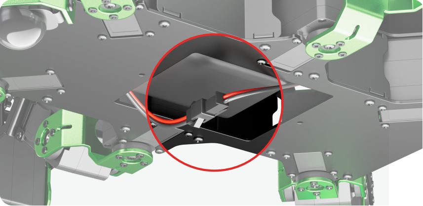

1. Ensure that the power switch on the robot is toggled to **OFF**.


2. Insert the charging plug of the 12.6 V charger into the charging port on the side of the STM32 controller.

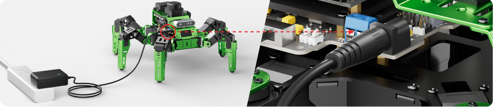

3. Observe the LED indicator on the charger to monitor the charging progress. A red light indicates charging in progress, and a green light indicates that charging is complete.


> [!NOTE]
>
> **Disconnect the charger promptly once charging is complete to prevent overcharging.**

### 1.3.2 Initial Power-On and Inspection

#### 1.3.2.1 Pre-Power-On Precautions

Before powering on, inspect all robotic joints to confirm proper installation and clear all obstacles within the operating workspace. Never forcefully twist or pull the servo joints manually after power-on. Avoid grasping excessive loads, operating at limit angles for extended periods, or running the servos under mechanical stall conditions. If stuttering, continuous jitter, abnormal noise, positional deviation, significant servo overheating, smoke, or unusual odors occur during operation, terminate the program immediately and turn off the power. Contact technical support if necessary to avoid servo damage caused by prolonged stall or high-load operation.

#### 1.3.2.2 Startup Status and Inspection Guide

> [!NOTE]
>
> **Place the robot in the correct posture before powering on. An incorrect starting posture may cause servo stall and trigger overload protection.**

Correct posture:

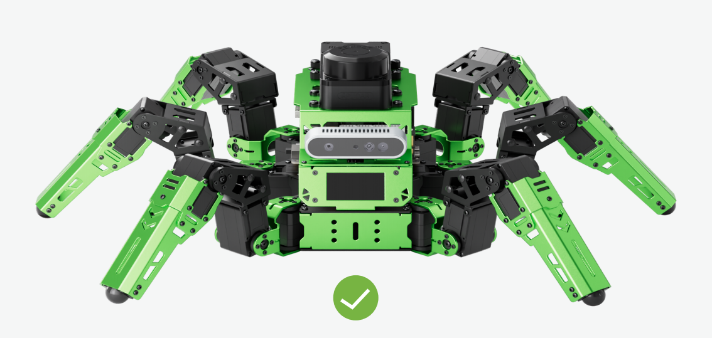

Incorrect posture:

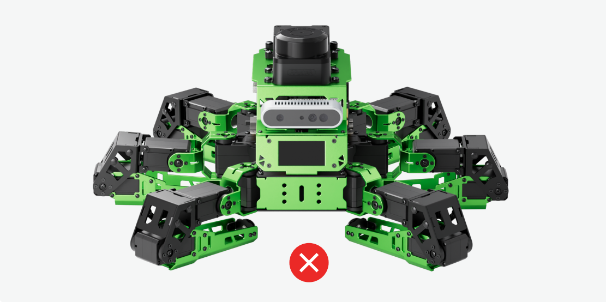

1. Place the robot on a flat, smooth surface and toggle the power switch on the right side to **ON**. The red power indicator **PWR** and the blue LED on the STM32 controller illuminate and remain solid.

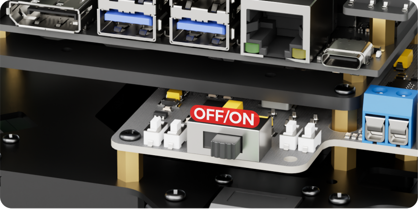

2. The blue LED **LED1** at the lower-right corner of the expansion board lights up and flashes, indicating that the network configuration service has started while the ROS system and remaining background services are initializing. Wait until the buzzer emits a short beep and the robot resets to its default stance, indicating that system startup is complete.

Jetson series controller:

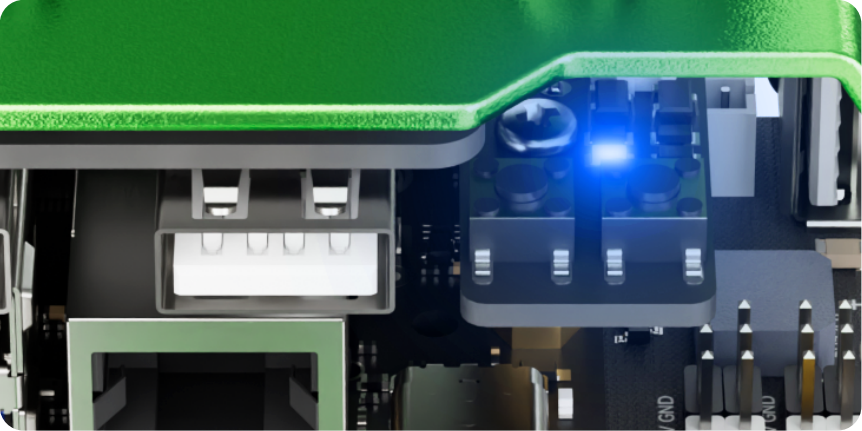

Robot reset posture:

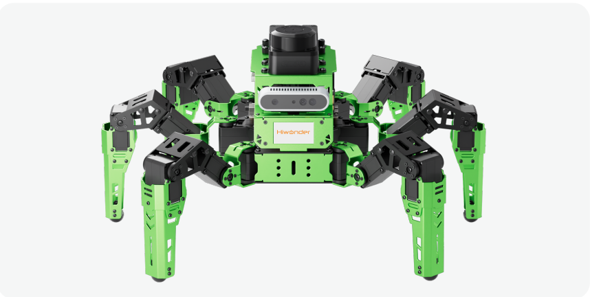

Upon completion of startup, the front LCD screen displays system status and hardware parameters.

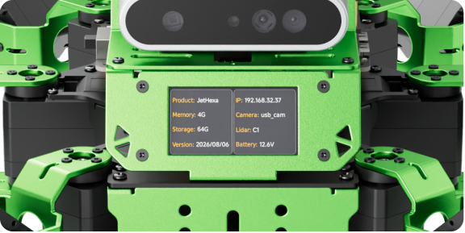

> [!NOTE]
>
> **If the buzzer fails to emit a short beep, an on-board hardware issue with the IMU, buzzer, or buttons may exist. Under normal operating conditions, this does not occur. If encountered, contact technical support for assistance.**

3. The device defaults to AP direct connection mode upon leaving the factory. Once booted successfully, a Wi-Fi hotspot with the prefix **HW** is generated. When connecting via the app or remote desktop, enter the password **hiwonder**.

> [!NOTE]
>
> **If the device hotspot cannot be detected, troubleshoot using the following steps:**
>
> * **Verify that LED1 on the expansion board is blue and flashing as described in step 2.**
>
> * **Connect a Type-C cable to the Type-C port of the Jetson controller to establish a remote connection and check system boot status. For remote connection details, refer to [Section 1.4.2.3 Type-C Fixed IP Connection](#4.2.3).**

4. Refer to the following table to verify hardware module functionality:

| Module | Verification Step | Expected Behavior |
| :--- | :--- | :--- |
| Expansion board LED | Observe LED state and flashing pattern. | Defaults to AP mode with a flashing blue LED, confirming that network services have loaded. |
| Buzzer | Check for initial beep. | Buzzer emits a short beep, indicating normal on-board hardware operation. |
| Key1 button on expansion board | Toggle network mode. | After connecting via STA LAN mode in the app, long-press **Key1** and verify that indicator **LED1** flashes. |
| Microphone array | Listen for voice prompt on boot. | The system provides voice feedback "I'm ready" , or the corresponding default prompt. Saying "Hello, Hiwonder" triggers the response "I'm here." |
| Depth camera & pan-tilt | 1) Open the app and connect to the robot.<br>2) Open the **Robot Control** mode to view the depth camera feed.<br>3) Display the pan-tilt controls and drag each joint slider. | Real-time camera feed renders properly, and pan-tilt servos rotate smoothly. |
| STM32 robot controller | Power on and control locomotion using the wireless controller or the app **Robot Control** screen. | Robot chassis moves and responds normally to directional commands. |

<p id="3.3"></p>

### 1.3.3 App Installation and Connection

The robot can be controlled using the dedicated **WonderAi** app. This section details how to obtain, install, and connect the app.

The app can be acquired either from the app store or by downloading the installation package from the official Hiwonder website.

> [!NOTE]
>
> * **Grant all requested permissions upon installing the app to prevent feature limitations.**
>
> * **Enable GPS location services and Wi-Fi on the smartphone, and disable mobile cellular data before launching the app.**

#### 1.3.3.1 App Installation

Scan the QR code below to download the app:


#### 1.3.3.2 Connection Modes Overview

The robot supports two networking modes:

1. **AP direct mode**: The development board broadcasts a Wi-Fi hotspot for direct smartphone connection, without external Internet access.
2. **STA LAN mode**: The development board connects to a designated local Wi-Fi router or hotspot, enabling external Internet access.

The robot defaults to AP direct mode. All robot features and interactive modes operate identically under both AP and STA modes. Connecting via AP direct mode first is recommended for initial feature testing. STA LAN mode can be configured subsequently as needed.

#### 1.3.3.3 Direct AP Mode Connection

The following procedure demonstrates connection using an Android device, and the same steps apply to iOS devices.

1. Launch the **WonderAi** app and tap **JetHexa**.

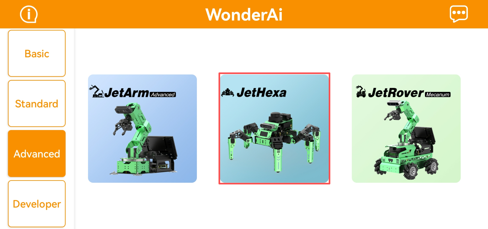

2. Tap the **+** button in the lower-right corner of the interface and select **Direct Connection Mode**.

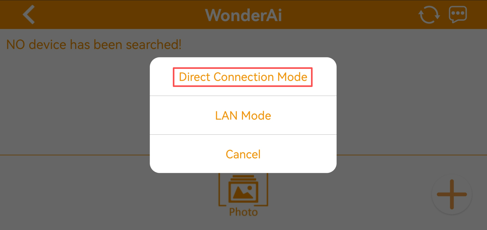

> [!NOTE]
>
> **To connect via STA LAN mode instead, refer to [Section 1.3.3.4 STA LAN Mode Connection (Optional)](#anther3.3.4).**

3. Tap **Go to connect device hotspots** to open the smartphone Wi-Fi settings and connect to the robot hotspot.

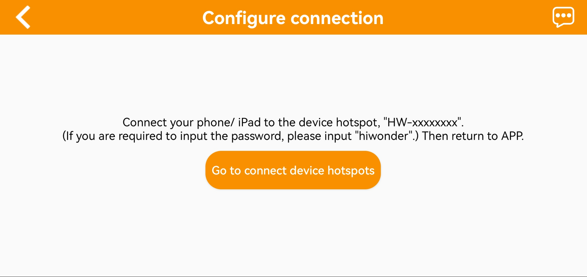

4. Locate the hotspot named with the prefix **HW** and enter the password **hiwonder**.


> [!NOTE]
>
> **On iOS devices, wait until the Wi-Fi icon  appears in the status bar before returning to the app; otherwise, the device may not be discovered. If device discovery fails, tap the refresh icon  in the upper-right corner of the app.**

5. Return to the app and tap the detected robot icon to enter the mode selection interface.

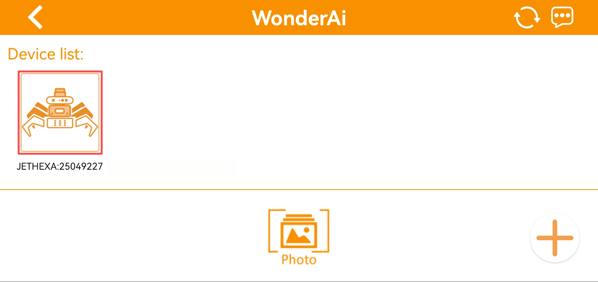

> [!NOTE]
>
> **If a prompt stating "No Internet access. Keep connection?" appears, tap "Keep Connection".**

6. If a dialog asking "Whether to switch and enter the searched product interface?" appears, an incorrect product model was selected in step 1. Tap **CONFIRM** to switch directly to the correct model interface.

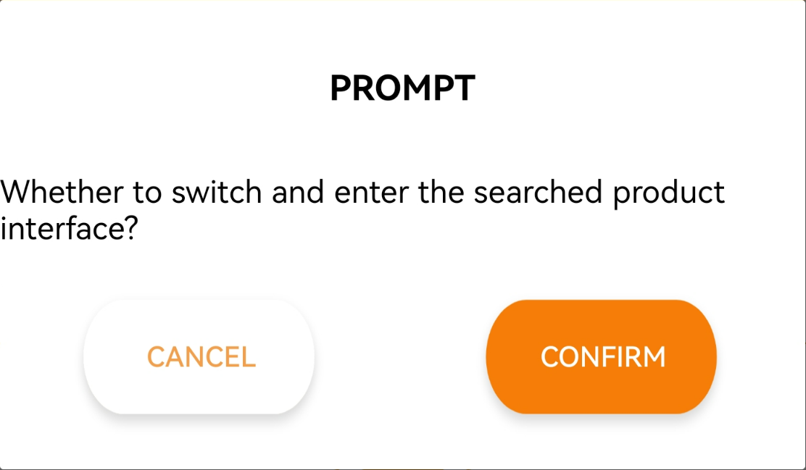

7. The mode selection interface is shown below:


For detailed instructions on each mode, refer to [Section 1.3.4.1 App Features Overview](#3.4.2).

<p id="anther3.3.4"></p>

#### 1.3.3.4 STA LAN Mode Connection (Optional)

1. Connect the smartphone to a 5 GHz Wi-Fi network, taking "Hiwonder_5G" as an example. Routers supporting dual-band Wi-Fi typically broadcast separate SSIDs for 2.4 GHz and 5 GHz bands.


2. Open the **WonderAi** app and tap **JetHexa**.
3. Tap the **+** button in the lower-right corner and select **LAN Mode**.

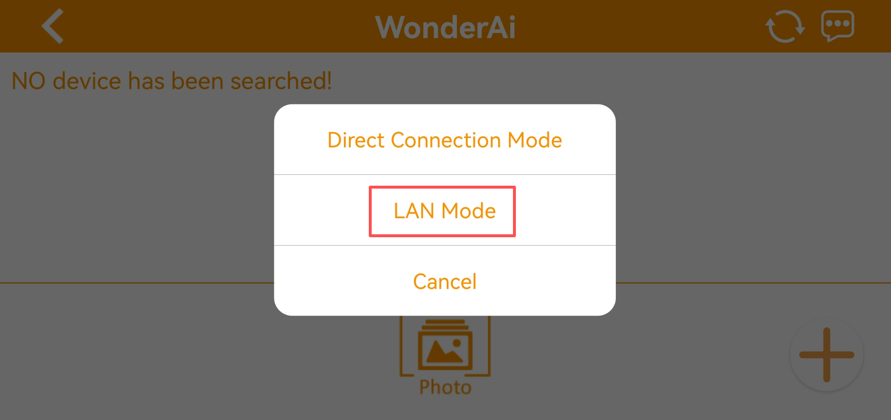

4. Enter the password for the connected Wi-Fi network in the prompt dialog and tap **OK**. Ensure the password is typed accurately, as an incorrect password prevents connection.

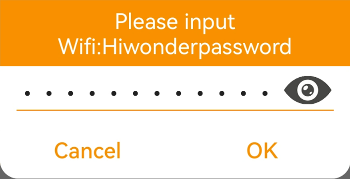

5. Tap **Go to connect device hotspots**.

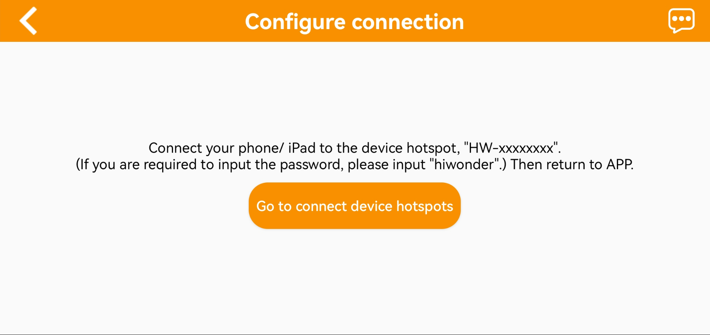

6. The system navigates to the smartphone Wi-Fi settings page. Select the hotspot with the prefix **HW**, enter the password **hiwonder**, and tap **Back** to return to the app.

7. The app initiates the connection process.

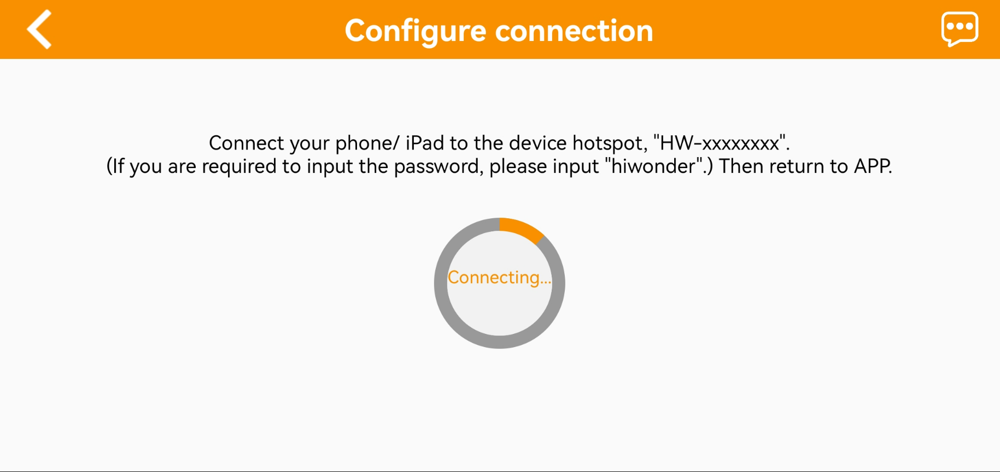

8. After a brief wait, the main screen displays the robot icon and name, and LED1 on the expansion board remains steadily on.

9. Long-press the robot icon in the app to inspect the assigned IP address and device ID.

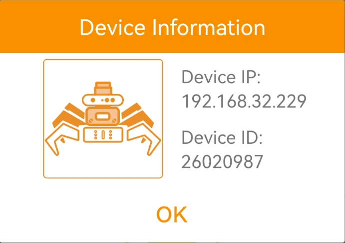

10. Connect to the robot using a remote desktop tool by entering this IP address. For connection details, refer to [Section 1.4 Development Environment Setup](#quick-mapping-navigation).

11. To switch from STA LAN mode back to AP direct mode, press and hold the **KEY1** button on the expansion board until the blue LED flashes.

### 1.3.4 App Control

The robot can be operated and various AI vision features can be experienced using the **WonderAi** app. The following section explains the operation of each feature using iOS as an example, and identical steps apply to Android.

<p id="3.4.2"></p>

#### 1.3.4.1 App Features Overview

The app provides six interactive modes: Robot Control, Robot Performance, Lidar, Object Tracking, Line Following, and Gesture Control.

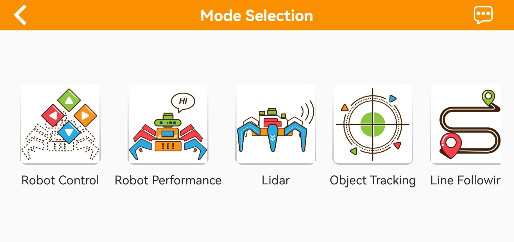

The table below outlines each interactive mode:

| Icon | Mode | Description |
| :---: | :--- | :--- |
| 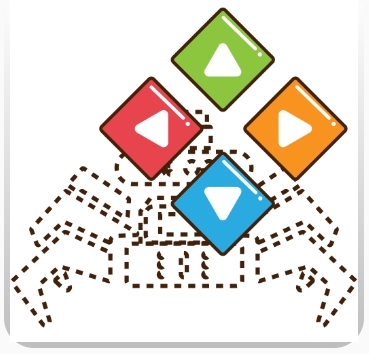 | Robot Control | Controls robot movement, executes preset and custom action groups, switches gaits, and adjusts stride, speed, and pitch angles. |
|  | Robot Performance | Executes built-in performance routines and enables the auto-balancing function. |
| 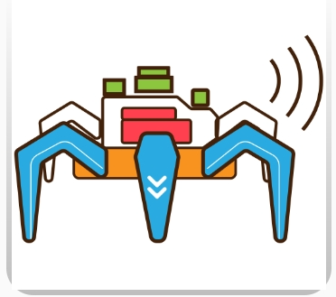 | Lidar | Provides radar obstacle avoidance, radar following, and radar guarding modes. |
|  | Object Tracking | Selects a target color for chassis tracking with the depth camera, or pan-tilt tracking with the monocular camera. |
|  | Line Following | Tracks a laid track by recognizing and following the selected target line color. |
| 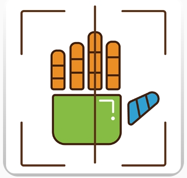 | Gesture Control | Recognizes designated hand gestures and executes corresponding reactive behaviors. |
|  | Large AI Models | Enables multi-turn dialogue, question answering, and robot locomotion control in STA LAN mode. |

#### 1.3.4.2 Robot Control

* **Interface Overview**

Tap **Robot Control** on the mode selection screen to open its control interface.

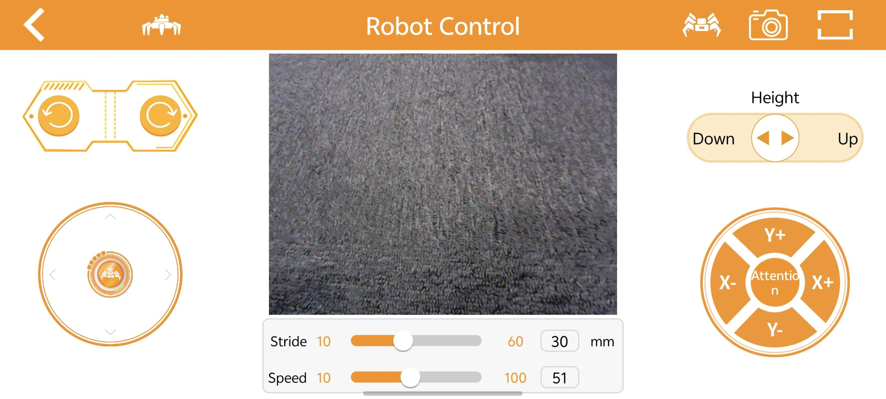

* **Button Functions**

| Icon | Function Description |
| :---: | :--- |
|  | Rotates the robot left or right using the side buttons. |
| 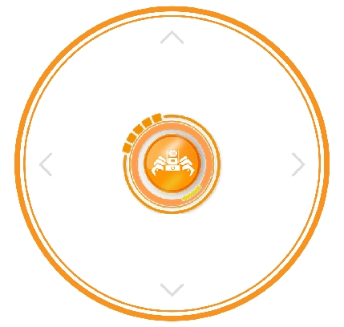 | Controls omnidirectional movement forward, backward, left, and right via the virtual joystick. |
|  | Switches the locomotion gait. |
| 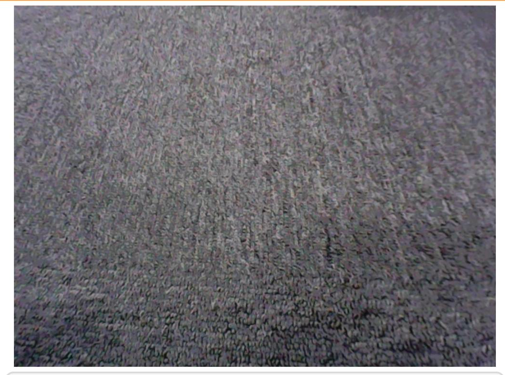 | Displays the live first-person view, or FPV, camera stream. |
| 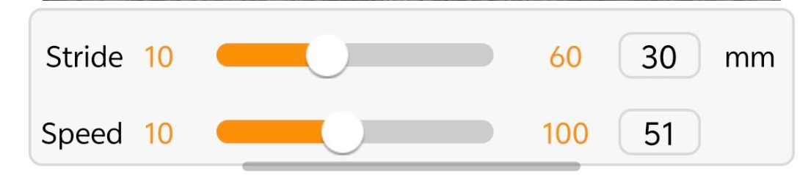 | Adjusts the robot movement stride within a range of 10–60 mm, and adjusts the movement speed within a range of 10–100. |
| 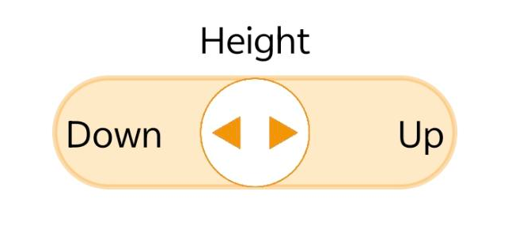 | Adjusts the chassis height of the robot. |
| 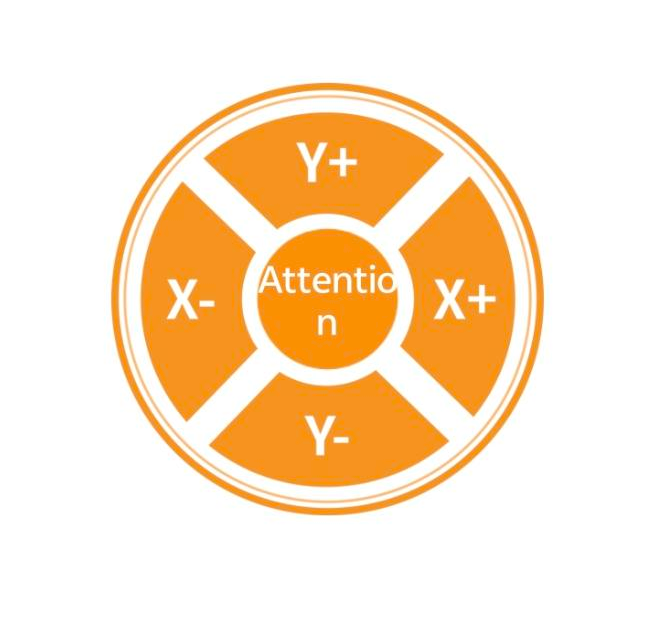 | From the first-person perspective of the robot: **Y+** tilts the robot forward, lowering the front and raising the rear. **Y-** tilts the robot backward, raising the front and lowering the rear. **X-** tilts the robot left, lowering the left and raising the right. **X+** tilts the robot right, raising the left and lowering the right. The center **Attention** button restores the initial posture. |
|  | Adds executable action groups. |

#### 1.3.4.3 Robot Performance

* **Interface Overview**

Tap **Robot Performance** on the mode selection screen to open its control interface.

1. The left panel provides action group selection, including built-in and custom action groups.
2. The right panel contains the auto-balancing toggle.

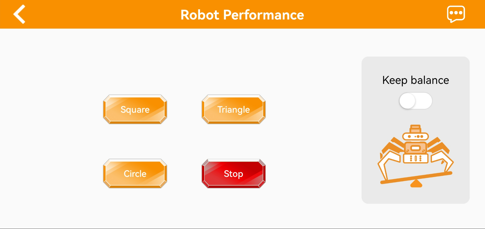

| Icon | Function Description |
| :---: | :--- |
| 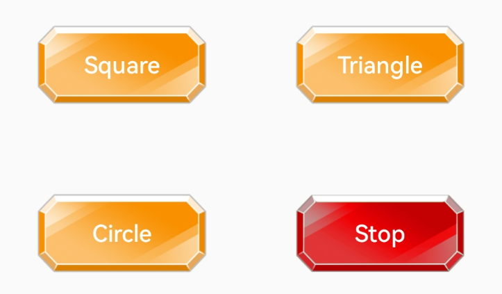 | Tap buttons to control the robot to execute built-in action groups. |
| 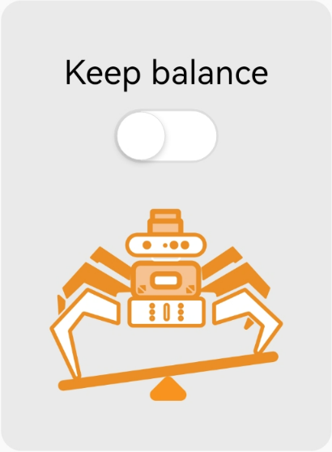 | Enables or disables the auto-balancing function of the hexapod robot. |

#### 1.3.4.4 Lidar

* **Interface Overview**

Tap **Lidar** on the mode selection screen to open its control interface. The interface consists of two sections:

1. The left panel contains mode switches and parameter adjustment sliders.
2. The right panel displays the live camera feed.

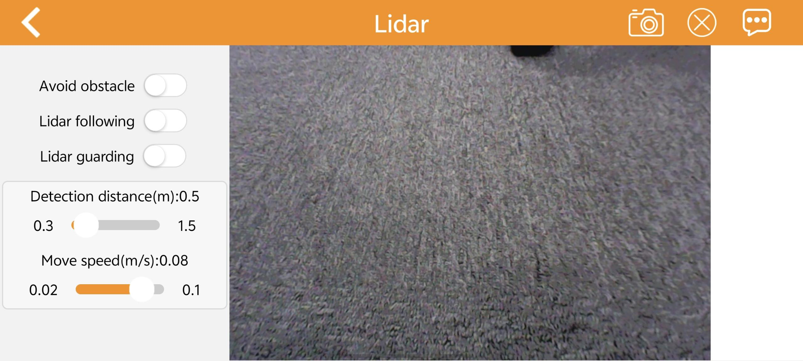

| Icon | Function Description |
| :---: | :--- |
| 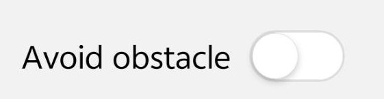 | Enables or disables radar obstacle avoidance mode. |
|  | Enables or disables radar following mode. |
| 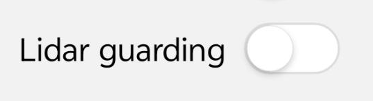 | Enables or disables radar guarding mode. |
| 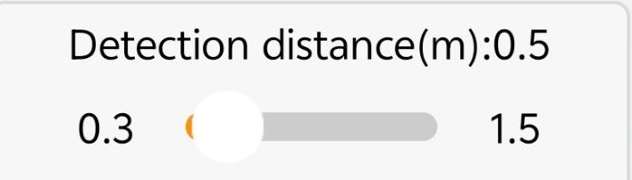 | Adjusts the detection distance of the LiDAR within a range of 0.3–1.5 m. |
| 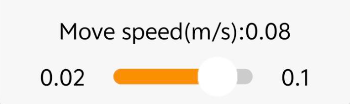 | Adjusts the movement speed of the hexapod robot within a range of 0.02–0.1 m/s. |

* **Operating Instructions and Behaviors**

> [!NOTE]
>
> **In this mode, the effective LiDAR detection range is an unblocked sector ahead of the robot. Place target obstacles within this range after enabling the mode, or feature performance may be affected.**

1. **Avoid obstacle**: 
   Tap the switch next to **Avoid obstacle** to start the mode. 
   The robot moves forward continuously. Upon detecting an obstacle, it turns automatically to navigate around it.
2. **Lidar following**: 
   Tap the switch next to **Lidar following** to start the mode. 
   Upon detecting an obstacle or target, the robot adjusts its position to maintain a preset following distance.
3. **Lidar guarding**: 
   Tap the switch next to **Lidar guarding** to start the mode. 
   When an obstacle enters the detection zone, the robot rotates in place to face directly toward it.

#### 1.3.4.5 Object Tracking

> [!NOTE]
>
> * **Place the target object on the same ground plane as the robot and translate it smoothly for optimal tracking performance.**
>
> * **Keep the color threshold range moderate. A range that is too wide captures background colors, while a range that is too narrow results in tracking loss. Avoid having objects with similar colors to the target within the camera field of view.**

* **Interface Overview**

Tap **Object Tracking** on the mode selection screen to open its control interface. The screen contains two areas:

1. The left area includes mode switches and color picker controls.
2. The right area shows the camera feed.

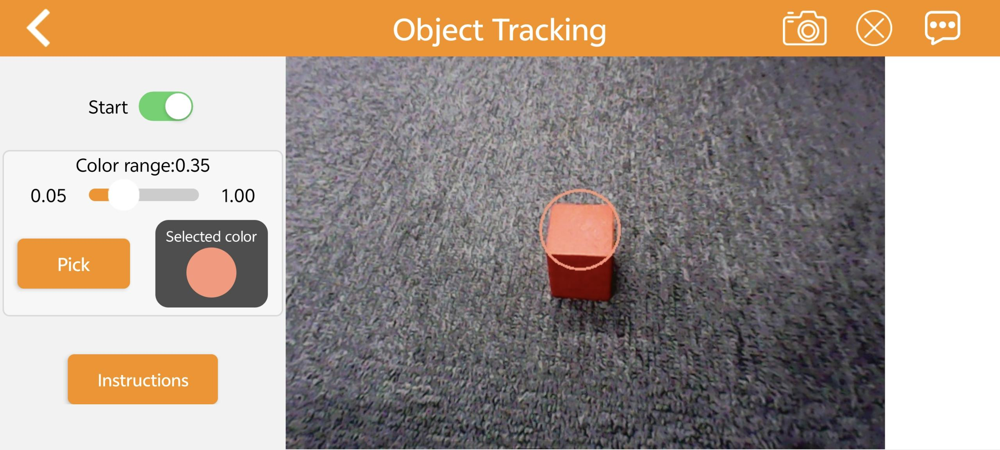

* **Function Description**

| Icon | Function Description |
| :---: | :--- |
|  | Enables or disables the feature. |
|  | Adjusts the color threshold range within 0.05–1.00. |
|  | Extracts the color from the designated region in the camera feed. |
| 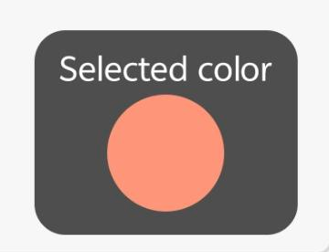 | Displays the extracted color. |
|  | After tapping **Pick**, the button switches to **OK**, used to confirm the extracted color. |
| 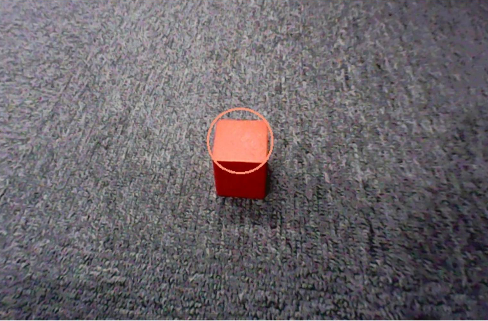 | Displays the current camera feed. |

* **Operating Steps and Expected Behavior**

1. Tap **Pick**, then drag the selection circle in the live feed over the target ball or object to extract its color.
2. Tap **OK** to confirm the color. The selected color is displayed under **Selected color**.
3. Tap the **Start** switch to launch the mode. The robot tracks the target object via chassis movement on the depth camera edition, or via pan-tilt servo tracking on the monocular camera edition.

#### 1.3.4.6 Line Following

> [!NOTE]
>
> * **Lay out a track line using colored tape and place the robot on the track before launching this mode.**
>
> * **Keep the color threshold range moderate. A range that is too wide captures background colors, while a range that is too narrow results in tracking loss. Avoid having objects with similar colors to the target within the camera field of view.**
>
> * **After launching this mode, ensure that no other objects containing the target recognition color exist within the camera field of view to prevent unintended interference with tracking performance.**

* **Interface Overview**

Tap **Line Following** on the mode selection screen to open its control interface. The interface consists of two sections:

1. The left section contains mode switches and color picking controls.
2. The right section displays the live camera feed.

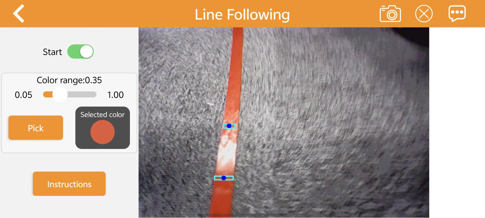

* **Function Description**

| Icon | Function Description |
| :---: | :--- |
|  | Enables or disables the feature. |
|  | Adjusts the color threshold range within 0.05–1.00. |
|  | Extracts the color from the designated region in the camera feed. |
|  | Displays the extracted color. |
|  | After tapping **Pick**, the button switches to **OK**, used to confirm the extracted color. |
| 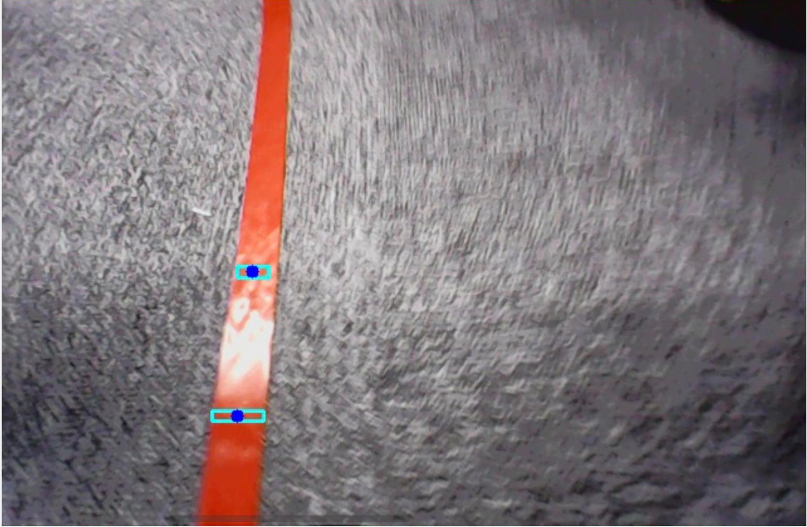 | Displays the current camera feed. |

* **Operating Steps and Expected Behavior**

1. Tap **Pick**, then drag the circular selector in the live feed over the track to pick its color.
2. Tap **OK** to confirm the line color. The selected color is displayed under **Selected color**.
3. Tap the **Start** switch to launch the mode. The robot moves forward along the track.

#### 1.3.4.7 Gesture Control

* **Interface Overview**

Tap **Gesture Control** on the mode selection screen to open its control interface. The interface consists of two sections:

1. The left section contains the mode switch and operating instructions.
2. The right section displays the live camera feed.

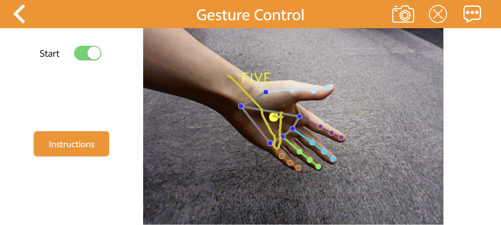

* **Function Description**

| Icon | Function Description |
| :---: | :--- |
|  | Enables or disables the feature. |
| 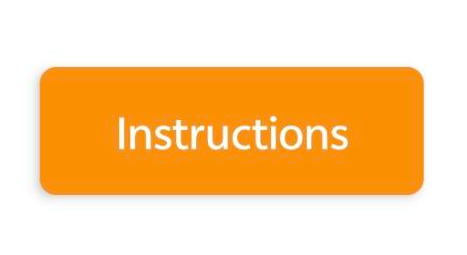 | Tap to view operational help. |

* **Operating Steps and Expected Behavior**

Tap the **Start** switch to launch the mode. Present different hand gestures to trigger corresponding robot action responses:

| Gesture Name | Description | Example | Action Response |
| :---: | :---: | :---: | :--- |
| rock | Rock gesture |  | Attack |
| thumbs_up | Thumbs-up gesture |  | Body twist |
| OK | OK gesture |  | Wave greeting |
| yes | Peace / V gesture |  | Fast left-right turn |

<p id="3.5"></p>

#### 1.3.4.8 Large AI Models

> [!NOTE]
>
> * **Ensure that the robot is connected in STA LAN mode before using large model features. If in AP mode, switch to STA mode following [Section 1.3.3.4 STA LAN Mode Connection (Optional)](#anther3.3.4).**
>
> * **Configure the large model API key before running large model features. Obtain the API key as described in [Section 11.2 Multimodal Large Model Applications]().**

* **Interface Overview**

Tap **Ai** on the mode selection screen to open its control interface. The interface consists of two sections:

1. The left section contains the mode switch and configuration controls.
2. The right section displays the live camera feed.

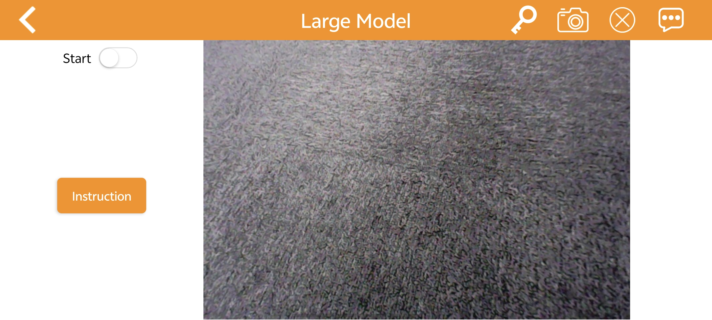

* **Function Description**

| Icon | Function Description |
| :---: | :--- |
|  | Enables or disables the large AI model mode via the **Start** switch. |
|  | Configures the large AI model API key.<br />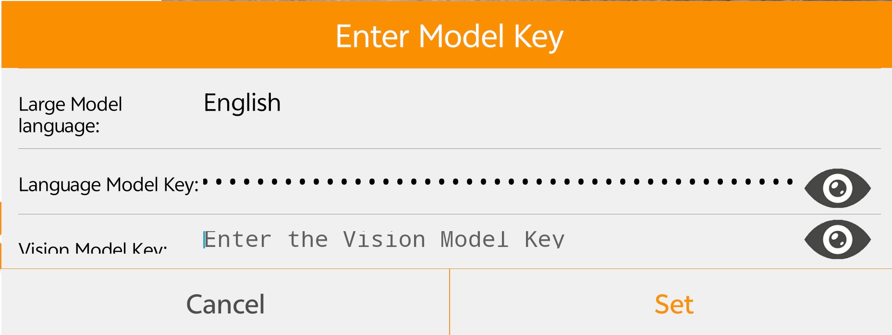 |
|  | Tap to view operational help. |

* **Operating Steps**

**Configuring the Large AI Model API Key in the App:**

1. Tap the key configuration button  at the top of the interface and confirm the system language.
2. Tap the show key button , then paste the large AI model API key into the input field.
3. Tap **Set**, restart the robot, and wait for initialization to complete.
4. After restarting, begin interacting with large AI model features.

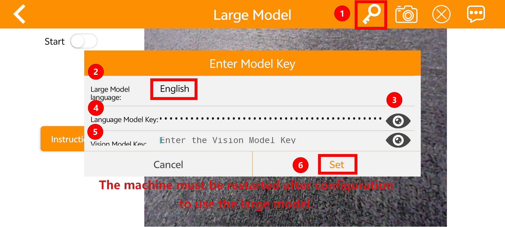

* **Sample Commands**

| Sample Voice Command | Expected Action |
| :--- | :--- |
| Move forward 10 cm, then move backward 10 cm | The robot moves forward 10 cm and then steps back 10 cm. |
| Describe what you see in front of you | The robot identifies the scene using the vision-language model and describes it. |
| Tell me a joke | The robot generates and speaks a joke. |
| What is the weather like in New York today? | The robot retrieves and announces the current weather conditions. |
| How many centimeters away is the obstacle in front of you? | The robot measures and reports the distance to the obstacle ahead. |
| Lift the arm, open the gripper, then lower the arm and close the gripper | The robot executes the sequential arm and gripper motion. |
| Hand me the red block on the table | The robot tracks, grips the red block, and extends it forward. |
| Follow the black line and stop if an obstacle is detected | The robot starts visual line following and stops when blocked. |

> [!NOTE]
>
> **Commands do not require exact word-for-word matching. Instructions with similar semantic meanings are recognized and executed.**


### 1.3.5 Wireless Controller Operation

#### 1.3.5.1 Precautions

1. Confirm that the USB wireless controller receiver is inserted into the USB port prior to powering on the robot. The receiver is pre-installed at the factory.
2. Observe proper battery polarity when inserting AAA batteries into the controller.


3. The system automatically launches the background app service on startup, which includes the wireless controller service. Unless manually terminated, the controller service connects automatically.
4. Because wireless controllers may experience cross-talk, avoid using this feature when multiple robots operate in the same area to prevent accidental connection and unintended control.
5. If the controller is not paired within 30 s after powering on, or remains idle for more than 5 min after pairing, it enters sleep mode automatically. Press the **START** button to wake the controller.

#### 1.3.5.2 Device Pairing

1. After the robot completes its boot sequence, toggle the power switch on the wireless controller to **ON**. Both the red and green LED indicators flash simultaneously.
2. After several seconds, the robot and controller complete automatic pairing. The green LED remains solid, and the red LED turns off upon successful pairing.


<p id="anther3.5.3"></p>

#### 1.3.5.3 Button Mapping and Functions

The table below outlines the functions of the wireless controller buttons and joysticks from the first-person perspective of the robot:

> [!NOTE]
>
> * **Buttons and joysticks can be operated simultaneously for combined motion control.**
>
> * **Pressing any motion button causes the robot to step in place using the previous gait until another button is pressed to reset the posture and halt stepping.**

| Button | Function in Robot Control Mode | Description |
| :---: | :--- | :--- |
| **START** | Halt movement and reset stance / exit sleep mode | Press |
| **L1** | Increase movement speed, or step frequency | Long-press |
| **L2** | Decrease movement speed, or step frequency | Long-press |
| **R1** | Increase leg lift height, or step height | Long-press |
| **R2** | Decrease leg lift height, or step height | Long-press |
| **Left Joystick Up** | Move forward in tripod gait with large stride | Long-press |
| **Left Joystick Down** | Move backward in tripod gait with large stride | Long-press |
| **Left Joystick Left** | Shift left in tripod gait with large stride | Long-press |
| **Left Joystick Right** | Shift right in tripod gait with large stride | Long-press |
| **Y** | Tilt chassis upward | Long-press |
| **A** | Tilt chassis downward | Long-press |
| **X** | Turn left in ripple gait with small stride | Press |
| **B** | Turn right in ripple gait with small stride | Press |
| **D-pad Up** | Move forward in ripple gait with small stride | Long-press |
| **D-pad Down** | Move backward in ripple gait with small stride | Long-press |
| **D-pad Left** | Shift left in ripple gait with small stride | Long-press |
| **D-pad Right** | Shift right in ripple gait with small stride | Long-press |
| **Right Joystick Up** | Raise chassis height | Long-press |
| **Right Joystick Down** | Lower chassis height | Long-press |
| **Right Joystick Left** | Turn left in tripod gait with large stride | Long-press |
| **Right Joystick Right** | Turn right in tripod gait with large stride | Long-press |

### 1.3.6 LCD Module Functions

#### 1.3.6.1 Post-Boot Display

1. When the robot powers on, the LCD screen displays the company logo:

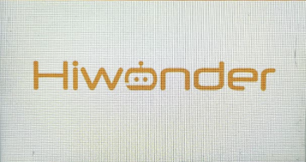

2. After the buzzer emits a short beep and the servos calibrate to center positions, the screen updates to show hardware information. Values shown in the figure are for reference only, and the actual display on the device shall prevail:


The displayed parameters are detailed below:

| Parameter | Meaning | Description |
| :--- | :--- | :--- |
| **Product** | Product model | Displays the model name of the robot |
| **Memory** | RAM capacity | Available RAM on the Jetson controller in GB |
| **Storage** | Storage capacity | Available disk space on the storage drive in GB |
| **Version** | System version | Software release version |
| **SSID/IP** | Hotspot SSID / IP address | Connected Wi-Fi SSID or controller IP address |
| **Camera** | Camera model | Detected camera module model |
| **Lidar** | LiDAR model | Detected LiDAR module model |
| **Battery** | Battery voltage | Current battery voltage reading in V |

#### 1.3.6.2 LCD Menu Navigation and Features

> [!NOTE]
>
> * **Wait until the buzzer beeps and all servos return to their neutral center positions before navigating the LCD menu. This indicates that the operating system has completed initialization.**
>
> * **The LCD menu is navigated primarily using the Key2 button on the Jetson expansion board: press Key2 to cycle through options or advance to the next step, and long-press Key2 to confirm selection.**
>
> * **If the menu is accessed before the system finishes booting, an initialization prompt appears. Wait for boot completion before proceeding.**
>
> 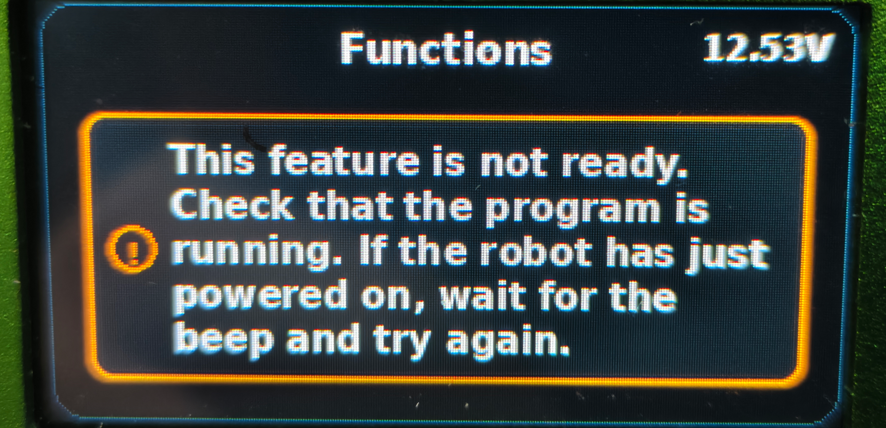

##### 1.3.6.2.1 Menu Interface Overview

1. Long-press **Key2** to open the function menu.
2. Short-press **Key2** to cycle through menu options, and long-press **Key2** to confirm and launch the selected function.

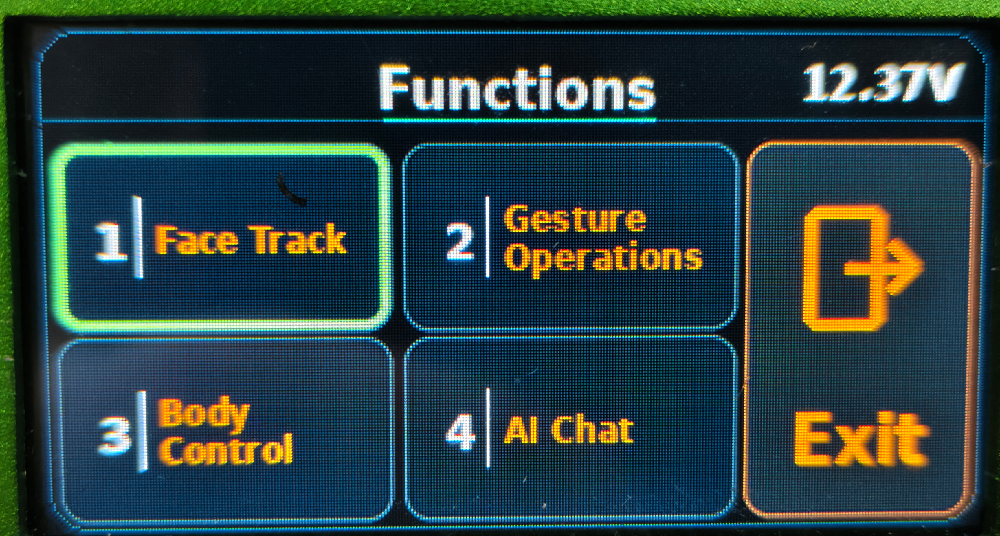

The function options are summarized below:

| Option | Function Description |
| :--- | :--- |
| 1. Face Tracking | Identifies and tracks the face closest to the camera center. |
| 2. Gesture Control | Controls locomotion and pan-tilt movements via preset hand gestures. |
| 3. Body Motion Control | Drives forward, backward, or lateral chassis translation based on full-body posture. |
| 4. AI Dialogue | Performs conversational Q&A, scene description, and voice-commanded robot actions via large AI models. |
| 5. Exit | Exits the LCD menu interface. |

##### 1.3.6.2.2 Face Tracking

> [!NOTE]
>
> **Place the robot on a flat, stable surface well away from table edges to prevent collisions or accidental falls during movement.**

1. Short-press **Key2** to navigate to **Face Tracking**.
2. Long-press **Key2** to start face tracking mode.
3. Position a face within the camera field of view. The robot locks onto and tracks the face closest to the center.
4. Long-press **Key2** to end tracking and return to the main menu.

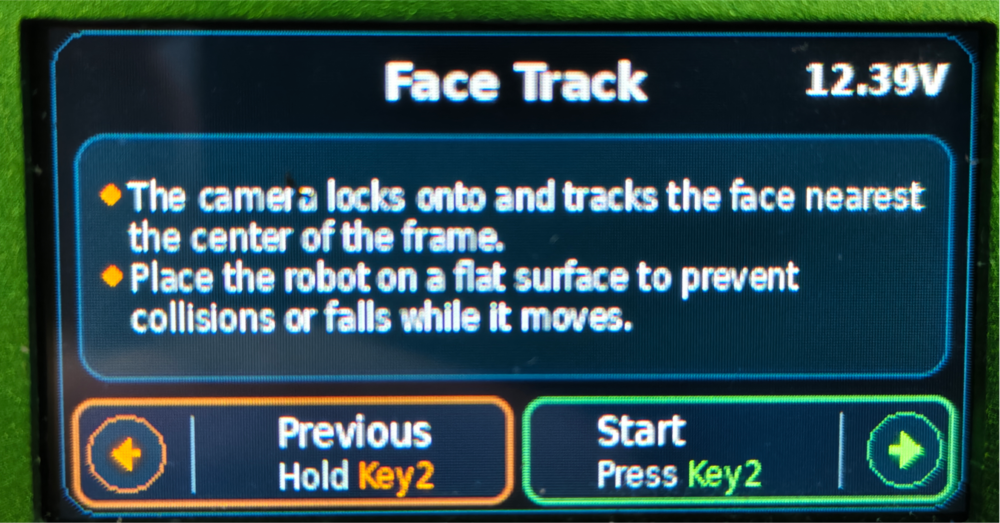

##### 1.3.6.2.3 Gesture Control

1. Short-press **Key2** to navigate to **Gesture Control**.
2. Long-press **Key2** to start gesture control mode.
3. On first launch, the screen shows feature demonstrations. Short-press **Key2** to advance to the next slide, or long-press **Key2** to return to the previous slide.
4. After reviewing the examples, present the illustrated hand gestures to command the robot.
5. Long-press **Key2** to exit and return to the menu.

The recognized gestures and their corresponding responses are illustrated below:

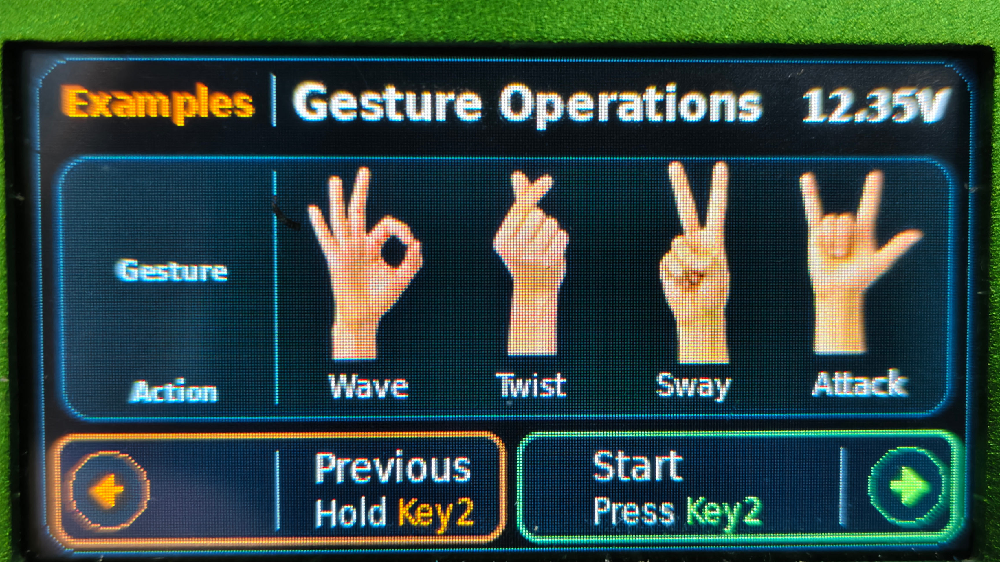

##### 1.3.6.2.4 Body Motion Control

> [!NOTE]
>
> **Place the robot on a flat surface and ensure the camera captures the entire upper body to ensure accurate posture recognition.**

1. Short-press **Key2** to navigate to **Body Motion Control**.
2. Long-press **Key2** to start body motion control mode.
3. Review the on-screen posture examples. Short-press **Key2** to view the next slide, and long-press **Key2** to return.
4. Perform the designated body postures to control robot movement.
5. Long-press **Key2** to exit and return to the menu.

Body postures and their corresponding controls:

* Raise both arms horizontally to begin imitation.
* Cross both arms overhead to exit imitation.

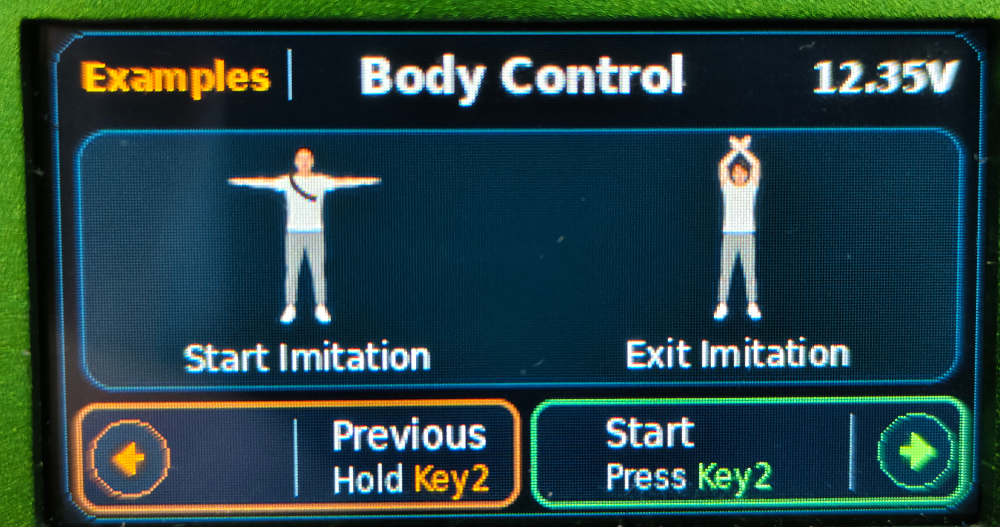

##### 1.3.6.2.5 AI Dialogue

> [!NOTE]
>
> * **Ensure the robot is connected in STA LAN mode before using large model features. If in AP direct mode, switch to STA mode following [Section 1.3.3.4 STA LAN Mode Connection (Optional)](#anther3.3.4).**
>
> * **Obtain and configure the large AI model API key prior to launching this mode as described in [Section 11.2 Multimodal Large Model Applications]().**

* **Network and Large Model API Key Configuration**

When launching **AI Dialogue** for the first time while in AP direct mode, a configuration prompt appears on the screen. Access the web console to configure the network and API key.

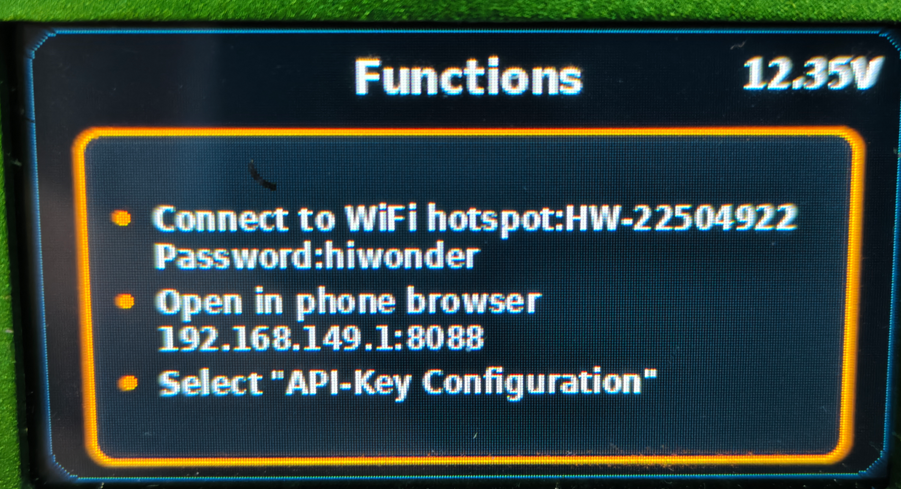

> [!NOTE]
>
> **If the robot is already connected in STA LAN mode, skip network setup and proceed directly to API key configuration.**

**Network Setup:**

1. Open a web browser on a computer connected to the robot hotspot, enter **192.168.149.1:8088**, and press **Enter** to access the web console. Click **Network Settings**.

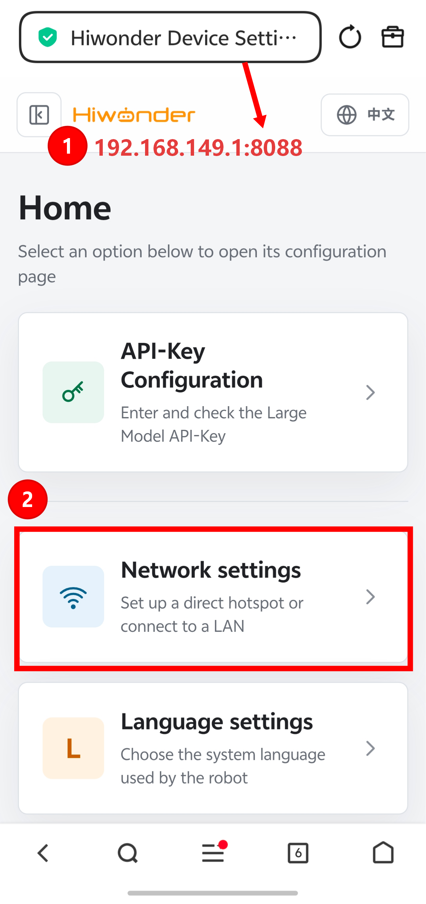

2. Click **LAN Mode**, click **Show Password**, clear any previously saved Wi-Fi credentials, and click **Scan** to discover nearby wireless networks.

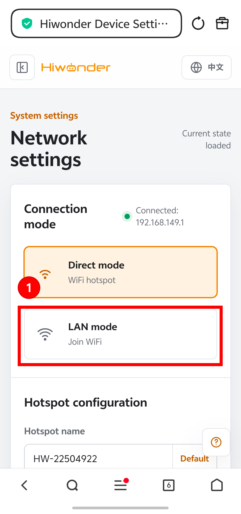

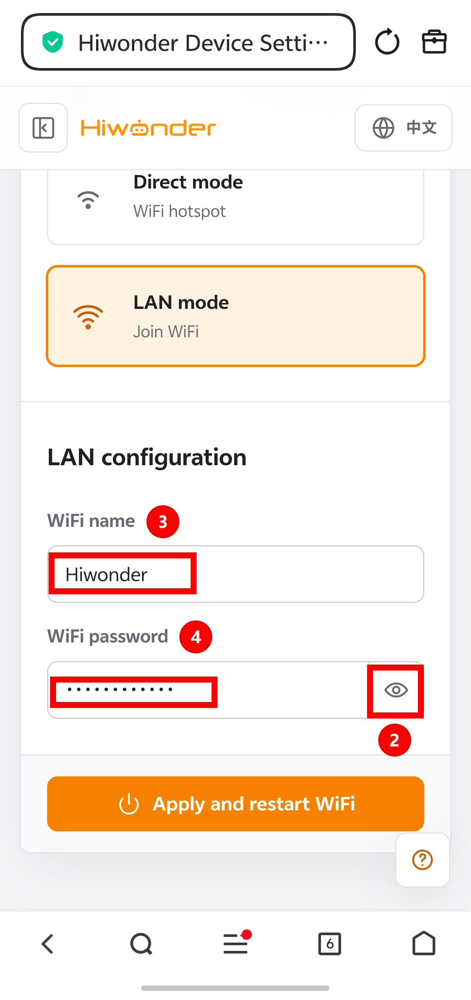


> [!NOTE]
>
> * **Ensure that the Wi-Fi credentials are typed correctly, as incorrect credentials cause connection failure and revert the robot to AP mode.**
>
> * **Clearing previous Wi-Fi information is required before scanning to ensure discovered networks populate correctly.**

3. Click **Apply and Restart Wi-Fi** to apply changes.

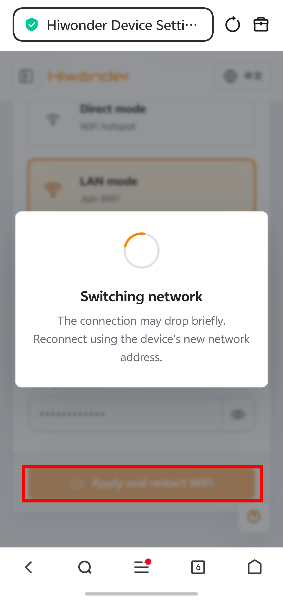

5. Once connected, **LED2** on the Jetson expansion board illuminates solid blue, and the assigned IP address appears in the upper-right corner of the LCD screen.

> [!NOTE]
>
> **This assigned IP address can be used for remote desktop sessions. To access the web console again while in STA LAN mode, append :8088 to the new IP address, for example, 192.168.36.147:8088.**

**Large Model API Key Configuration:**

1. Ensure the robot is connected to the Internet in STA LAN mode. Open a browser on a computer on the same local network and navigate to the robot IP address with port **8088**, such as **192.168.36.147:8088**.

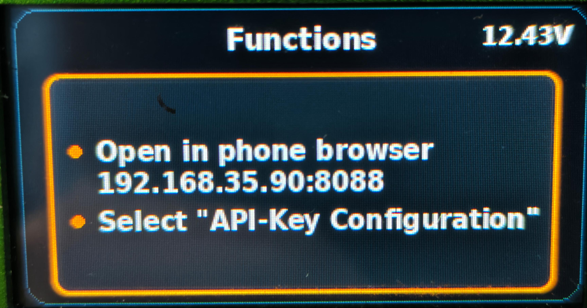

> [!NOTE]
>
> **Verify that the computer and the robot are connected to the same local network. Check the IP address displayed on the LCD screen, such as 192.168.36.147, and open that address with port 8088 in the browser.**

2. The web console interface opens:

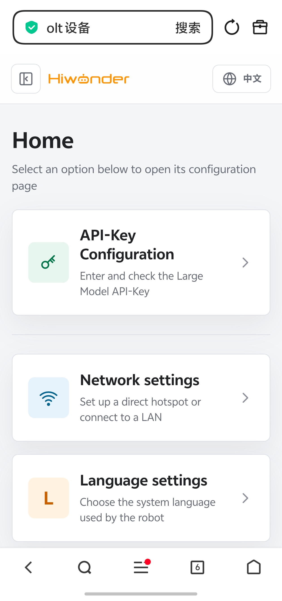

3. Click **Large Model Key Configuration**.

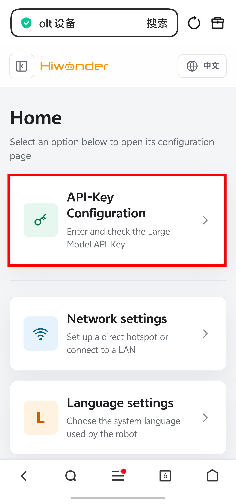

4. Obtain the API key as guided in [Section 11.2 Multimodal Large Model Applications]().
5. Paste the API key into the field and click **Check and Save**.

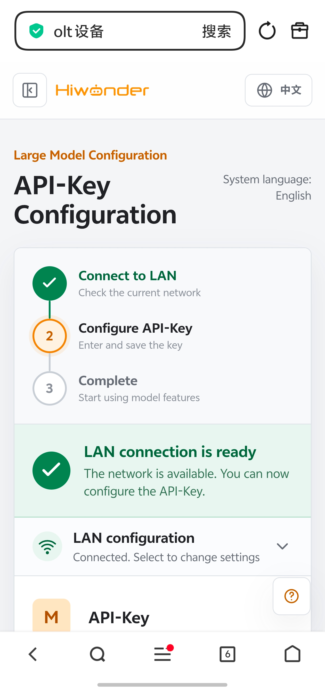

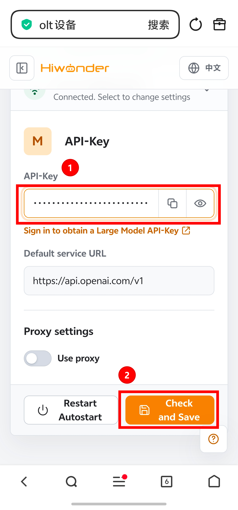

6. The system verifies the API key status.

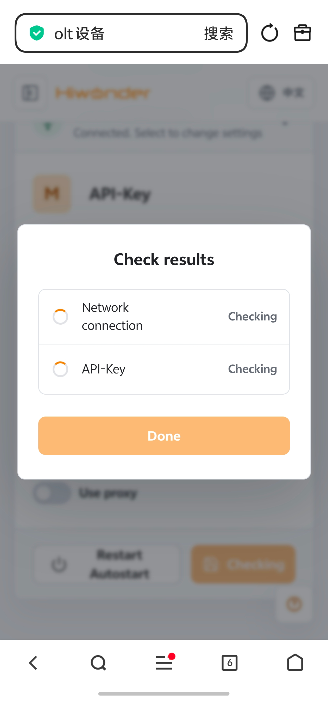

> [!NOTE]
>
> **If verification fails, verify available account quota and re-acquire a valid API key.**

7. Click **Restart Auto-Start Service** to reboot the background nodes and apply the new configuration.

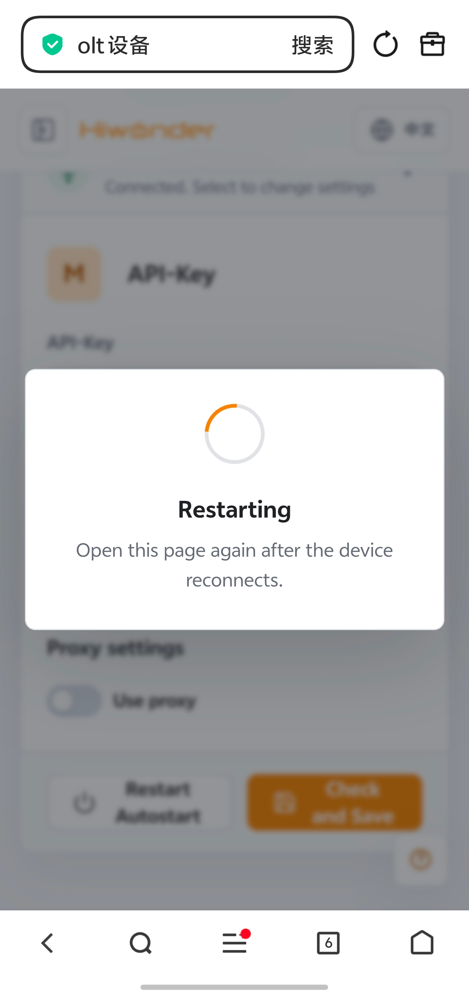

8. A short beep confirms that the service reboot is complete.

* **Starting the Feature**

1. In the LCD menu, short-press **Key2** to highlight **AI Dialogue**.
2. Long-press **Key2** to launch the AI dialogue mode.
3. Review on-screen examples on first launch. Short-press **Key2** to advance, or long-press **Key2** to return.
4. Interact with the robot using natural speech or conversational commands as shown below:

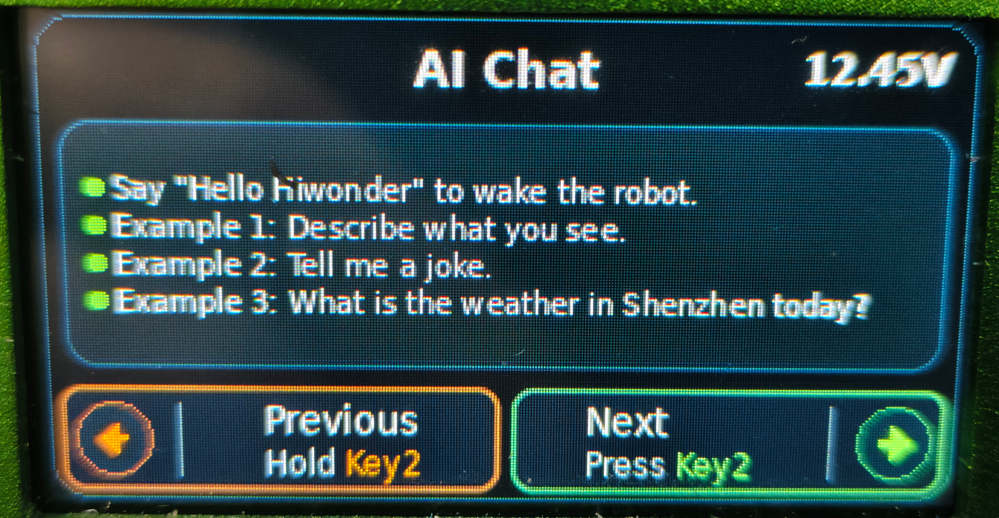

| Sample Command | Expected Behavior |
| :--- | :--- |
| Move forward 10 cm, then backward 10 cm. | The robot steps forward 10 cm and then steps backward 10 cm. |
| Describe what you see. | The robot analyzes the camera feed and describes the scene. |
| Tell me a joke. | The robot generates and speaks a joke. |
| What is the weather like in New York today? | The robot retrieves and announces current weather information. |
| Tell me the distance to the obstacle ahead in centimeters. | The robot reports the distance measured by the sensor. |
| Lift the arm, open the gripper, then lower the arm and close the gripper. | The robot executes the sequential arm and gripper movements. |
| Hand me the red block on the table. | The robot tracks, grips the red block, and presents it forward. |
| Follow the black line and stop when encountering an obstacle. | The robot initiates line tracking and halts upon obstacle detection. |

> [!NOTE]
>
> **Commands do not require exact phrasing. Instructions with equivalent semantic meaning are recognized.**


<p id="4. "></p>

## 1.4 Development Environment Setup

> [!NOTE]
>
> * **Complete this chapter before attempting to run command-line programs or modify source code on a computer.**
>
> * **For the Jetson Orin Nano/Orin NX controller, insert the dummy HDMI display plug into the controller port to ensure the remote desktop renders properly.**
>
> 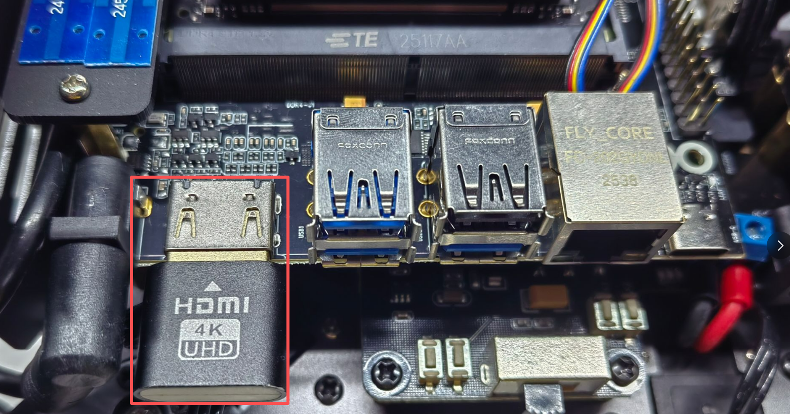

### 1.4.1 Remote Desktop Software Installation

#### 1.4.1.1 Jetson Series Controller: NoMachine Installation

NoMachine is a graphical remote desktop application that enables full desktop control over the robot via Wi-Fi. For desktop computers, using a 5 GHz wireless network adapter is recommended for optimal streaming stability.

Installation steps:

1. Locate the installer under [**2. Software/2. Remote Desktop Software/1. Graphical Remote Desktop Access Tool/**](https://drive.google.com/drive/folders/1Wu-WXVR4Cu0C64R5ZO19hGFN3lSSjGwg?usp=sharing) in the same directory as this document, or download NoMachine, and run the installer **nomachine_8.4.2_10_x64.exe**.
2. Click **Next**.


3. Select **English** as the setup language, accept the license agreement, and click **Next**.


4. Retain the default destination directory and click **Next**.


5. Wait for the installation to finish, then click **Finish**.

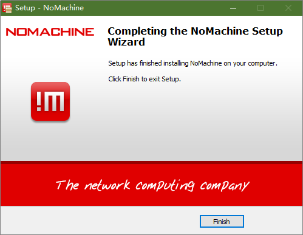

6. Click **Yes** to restart the computer. Do not skip this restart.


### 1.4.2 Remote Connection Setup

#### 1.4.2.1 Direct AP Mode Connection

**AP direct mode**: The development board broadcasts a Wi-Fi hotspot for direct connection without requiring external router infrastructure.

1. The robot defaults to AP direct mode. After booting, search for the Wi-Fi hotspot with the prefix **HW** on the computer and connect to it using the password **hiwonder**.


2. Launch NoMachine, enter the IP address **192.168.149.1** into the search bar, and select **Configure connection to new host 192.168.149.1**.

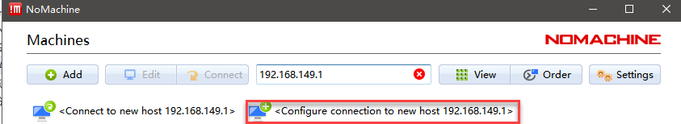

3. Set the **Name** field to **JetHexa**, retain all default settings, and click **Connect**.


4. Enter the username **ubuntu** and the password **ubuntu**. Check **Save this password in the connection file** and click **OK**.


> [!NOTE]
>
> **When connecting in STA LAN mode, follow the identical procedure while updating the IP address, username, and password in steps 2, 3, and 4 accordingly.**

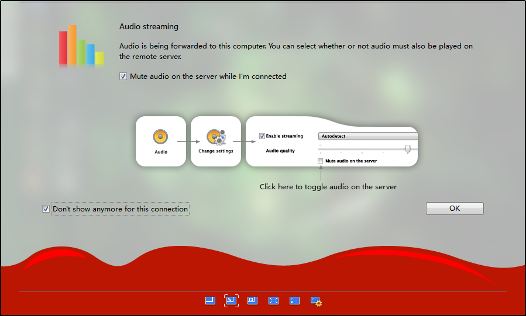

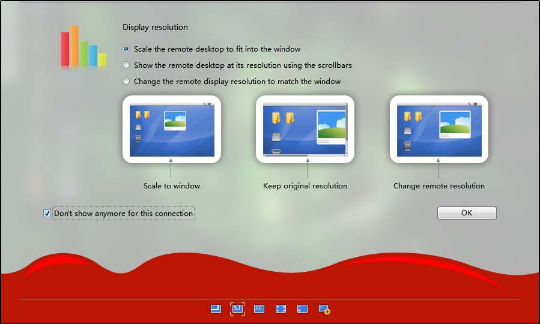

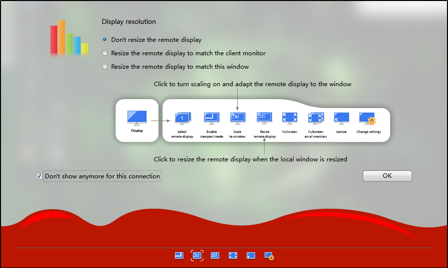

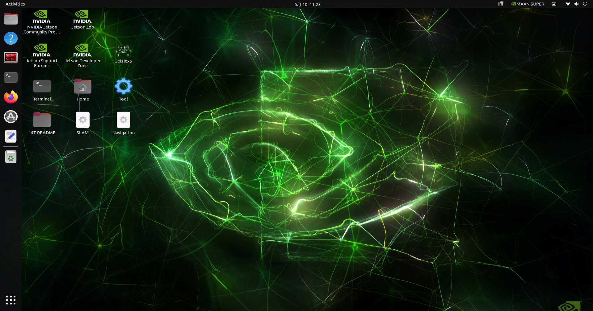

#### 1.4.2.2 STA LAN Mode Connection

**STA LAN mode**: The development board joins an existing local Wi-Fi router network, granting the robot access to local resources and the Internet.

> [!NOTE]
>
> * **When configuring Wi-Fi via a smartphone, ensure location services are enabled.**
>
> * **Do not attempt to switch networks using the default Ubuntu desktop network applet, as the wireless system uses custom configuration scripts. Follow the configuration steps below.**


Procedure for Jetson controllers:

1. Click the terminal icon  on the left side of the desktop to open a command line terminal.
2. Enter the command and press **Enter** to enter the configuration file directory:

```bash
cd wifi_manager
```

3. Enter the command and press **Enter** to open the configuration file:

```bash
gedit wifi_conf.py
```

4. First, modify the value of `WIFI_MODE` to `2`. `1` represents direct mode where the robot autonomously generates Wi-Fi, and `2` represents LAN mode where the robot connects to an internal local area network. Here, set it to `2`.


5. Modify `WIFI_STA_SSID` and `WIFI_STA_PASSWORD` to match the router Wi-Fi SSID and password. Ensure the values are enclosed in single quotes. The robot supports 5 GHz Wi-Fi networks.


6. After confirming the input is correct, press **Ctrl + S** to save the file, and click the close button in the upper-right corner.
7. Return to the command line terminal, enter the command, and press **Enter** to restart the robot Wi-Fi service:

```bash
sudo systemctl restart wifi.service
```

8. To switch to direct mode, re-edit the configuration file, set `WIFI_MODE` to `1`, and then refer to the previous step to restart the robot Wi-Fi service.

<p id="4.2.3"></p>

#### 1.4.2.3 Type-C Fixed IP Connection

> [!NOTE]
>
> **This connection method applies specifically to Jetson series controllers.**

The robot supports high-speed, low-latency remote desktop operation by configuring a remote NDIS network device over a Type-C cable with a fixed IP address of **192.168.55.1**. This eliminates the need for Wi-Fi hotspot or router connections:

1. Connect a **Type-C** data cable between the robot controller and the PC.


2. On the PC, right-click **This PC** and select **Manage**.

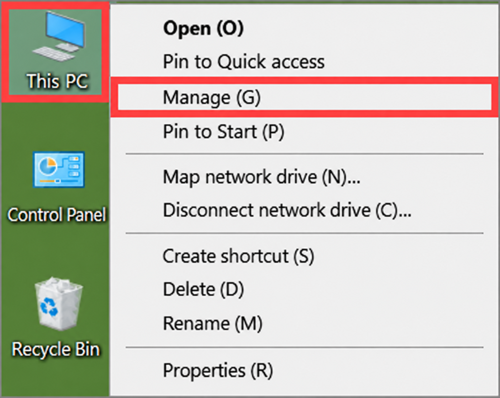

3. Click **Device Manager** in the left sidebar, expand **Network adapters**, locate the NDIS device, right-click it, and select **Update driver**.

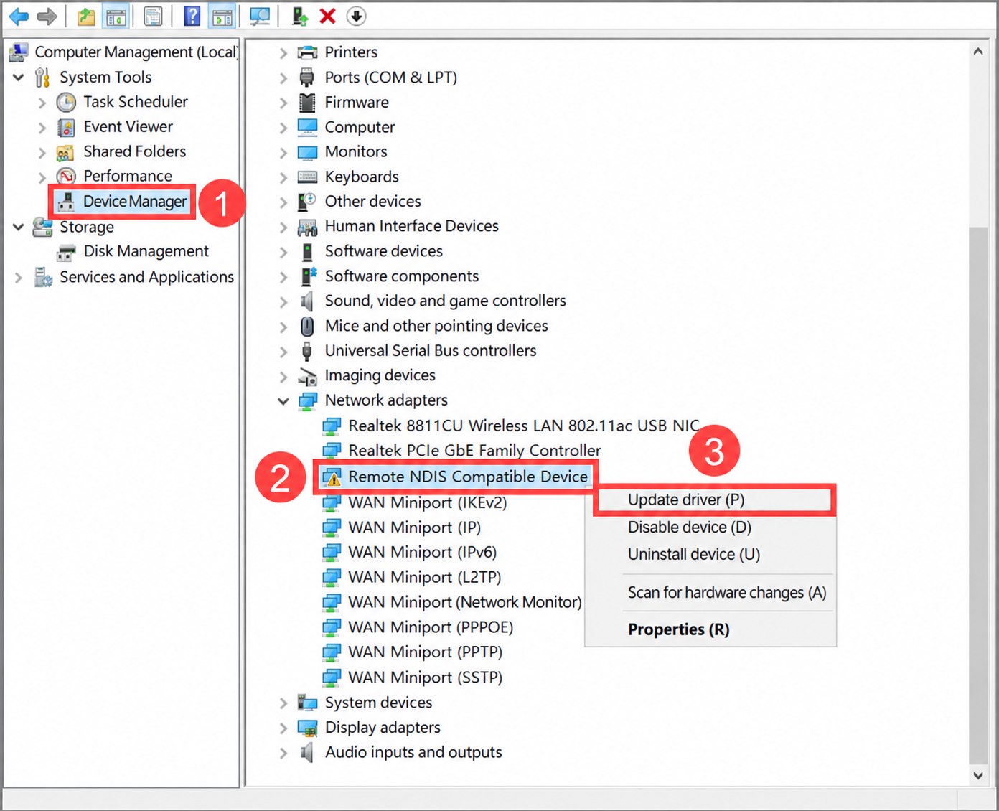

4. Once driver installation completes, open NoMachine and connect to the fixed IP address **192.168.55.1** as described in the direct connection guide.

#### 1.4.2.4 SSH Connection with MobaXterm

Compared with graphical desktop clients like NoMachine or VNC, command-line SSH clients such as MobaXterm consume significantly fewer system resources and lower computational overhead, making them ideal for running scripts and command-line tools.

1. Locate the installation package under [**2. Software/2. Remote Desktop Software/2. SSH Remote Login Client/**](https://drive.google.com/drive/folders/1YnOI0idwj9pvDDXZHpaR36Qf2dSKnCfr?usp=sharing) in the same directory as this document, or download MobaXterm, and run the installer as prompted.
2. Obtain the robot IP address using either direct AP mode or STA LAN mode.

**Creating an SSH Session:**

The following example uses the direct connection IP address. Replace it with the assigned STA IP address when connected via a router.

(1) On the main interface, click **Session** in the upper-left corner to create a new session. In the session configuration window, enter the noted Direct Connection IP address **192.168.149.1**, and click **OK**.


If prompted with a security alert, select the third option to accept and proceed:

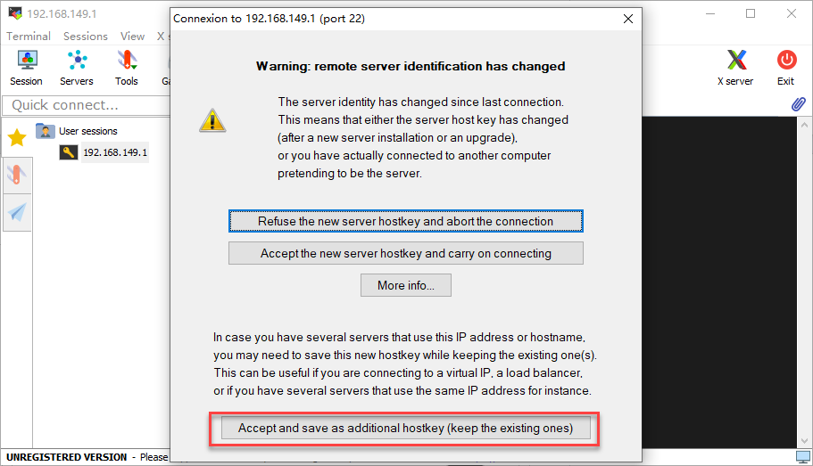

(2) The interface prompts for the username and password, identical to the credentials configured in direct connection or LAN mode. Enter the credentials and press **Enter**. Characters do not display on screen during password entry in Linux environments.

> [!NOTE]
>
> **The username must be entered in all lowercase characters.**

(3) After entering the password correctly, the system interface displays as shown below:

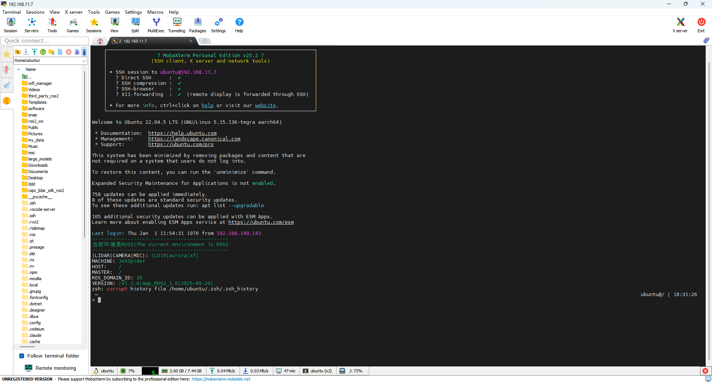

### 1.4.3 Speaker Volume Adjustment

If connecting to the robot desktop via NoMachine before the robot completes its boot process, the system audio configuration may automatically attenuate the speaker volume. Click the sound icon in the upper-right corner of the desktop to increase the speaker volume, an adjustment that applies equally to subsequent voice course experiments.

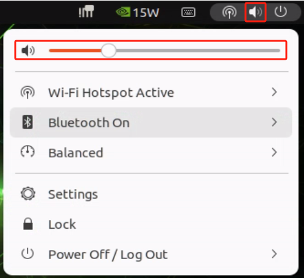

### 1.4.4 Remote Desktop Resolution Adjustment (Optional)

If the desktop resolution appears distorted or mismatched in NoMachine, adjust the display scaling as follows:

1. Move the mouse cursor to the upper-right corner of the NoMachine window until the peel-away menu icon appears:


2. Click the peel icon and select **Display**.


3. Click **Change settings**.


4. Adjust the **Resolution** slider to **1920 × 1080**, or select a resolution suitable for the local monitor, and click **Modify**.


5. Return to the desktop to confirm that the remote resolution has updated.


<a id="quick-mapping-navigation"></a>

## 1.5 Quick Mapping and Navigation

### 1.5.1 Quick Mapping Experience

This section provides a quick walkthrough of 2D LiDAR SLAM mapping and autonomous navigation without requiring complex terminal operations, as features can be launched directly from desktop shortcut icons.

During quick mapping, control robot locomotion using the wireless controller or the keyboard. For single-robot operation, the wireless controller is recommended. In multi-robot environments, keyboard control prevents wireless signal interference across units.

Once mapping finishes, save the map file to disk. The autonomous navigation package loads the most recently saved map by default. Creating and saving a new map overwrites previous map files.

Manual mapping utilizes the **slam_toolbox** package. The **slam_toolbox** package subscribes to `LaserScan` messages from the LiDAR and applies coordinate transformations from `odom` to `base_link` to generate a 2D occupancy grid map of the environment. The package supports full serialization of pose graphs and map data for continuous mapping, relocalization, and multi-session map merging. It operates in synchronous mode, processing all valid sensor measurements regardless of processing lag, and asynchronous mode, processing sensor measurements as computational bandwidth permits.

For algorithmic principles, launch commands, and multiple map management, refer to [5. Mapping and Navigation Course]().

#### 1.5.1.1 Mapping Preparation

Before starting the robot, confirm that the LCD display is securely connected. Verify that the wireless controller receiver is firmly seated in the USB port on the STM32 controller. Connect to the robot desktop using NoMachine as described in [Section 1.4 Development Environment Setup](#quick-mapping-navigation).

> [!NOTE]
>
> **The wireless controller receiver is pre-installed on the STM32 controller before shipping.**

For wireless controller functions, refer to [Section 1.3.5 Wireless Controller Operation](#3.5).

When the robot is powered on, the desktop shortcut icons correspond to the following functions: quick mapping  and autonomous navigation :

> [!NOTE]
>
> **Set up an enclosed testing environment on flat ground. If placing obstacles, ensure their height extends above the horizontal scanning plane of the LiDAR.**

#### 1.5.1.2 Mapping Procedure

1. Place the robot inside the testing enclosure.
2. Double-click the **SLAM** desktop shortcut icon to launch quick mapping.
3. Several terminal windows open to launch the underlying nodes. Wait for initialization.

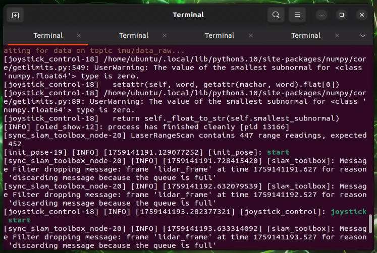

4. Once initialization completes, the RViz visualization window appears:

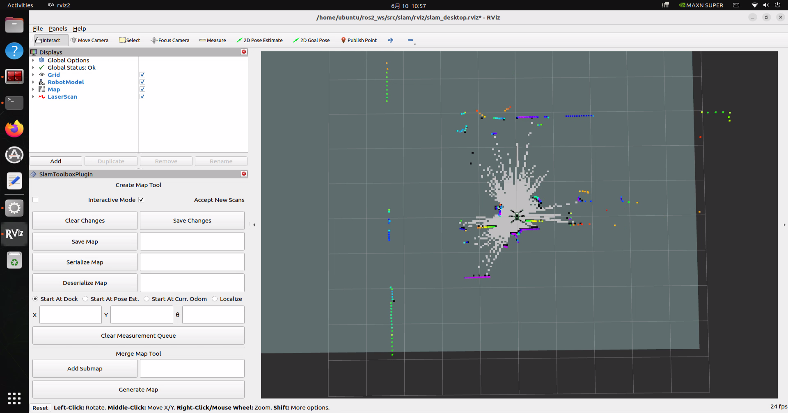

5. Drive the robot using the wireless controller to map the area. For controller button mappings, refer to [Section 1.3.5.3 Button Mapping and Functions](#anther3.5.3).

> [!NOTE]
>
> **Maintain a close distance between the wireless controller and the robot to prevent wireless signal drops.**

Alternatively, keyboard control is available, but is not recommended here, as subsequent courses cover keyboard control in detail. To use keyboard control, connect to the remote desktop and click to switch to the terminal window configured for keyboard control.

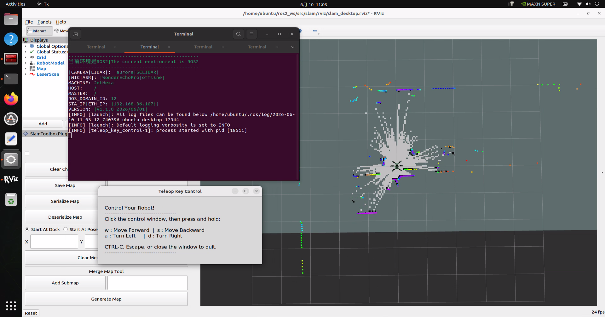

Keyboard teleoperation controls:

| Key | Function | Description |
| :---: | :--- | :--- |
| W | Forward | Short-press to drive forward continuously |
| S | Backward | Short-press to drive backward continuously |
| A | Turn left | Long-press to interrupt translation and rotate counterclockwise in place |
| D | Turn right | Long-press to interrupt translation and rotate clockwise in place |

Pressing **W** or **S** sets continuous forward or backward translation. Pressing **A** or **D** interrupts linear translation to rotate counterclockwise or clockwise, and releasing **A** or **D** halts rotation to hold position.

6. Once the environment is mapped, click **Save Map** in the RViz side panel to save the generated map.


7. The completed 2D grid map is shown below:

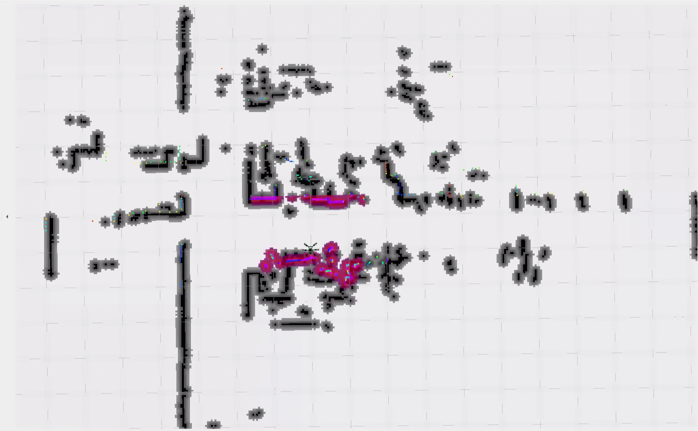

8. To terminate the mapping session, press **Ctrl + C** in each of the opened terminal windows.

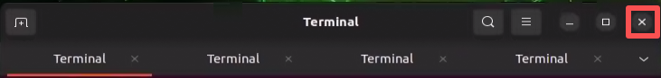

### 1.5.2 Autonomous Navigation Experience

> [!NOTE]
>
> * **The navigation stack loads the most recently saved map file by default.**
>
> * **For instructions on managing and switching between multiple saved maps, refer to [5. Mapping and Navigation Course]().**

#### 1.5.2.1 Navigation Procedure

1. It is recommended to place the robot at its initial starting position used during mapping.
2. Start the robot, tap the touchscreen, and select and open the **Navigation** icon for the quick navigation feature.
3. Once opened, a terminal program will run. Wait briefly, and the appearance of the following interface indicates a successful launch:

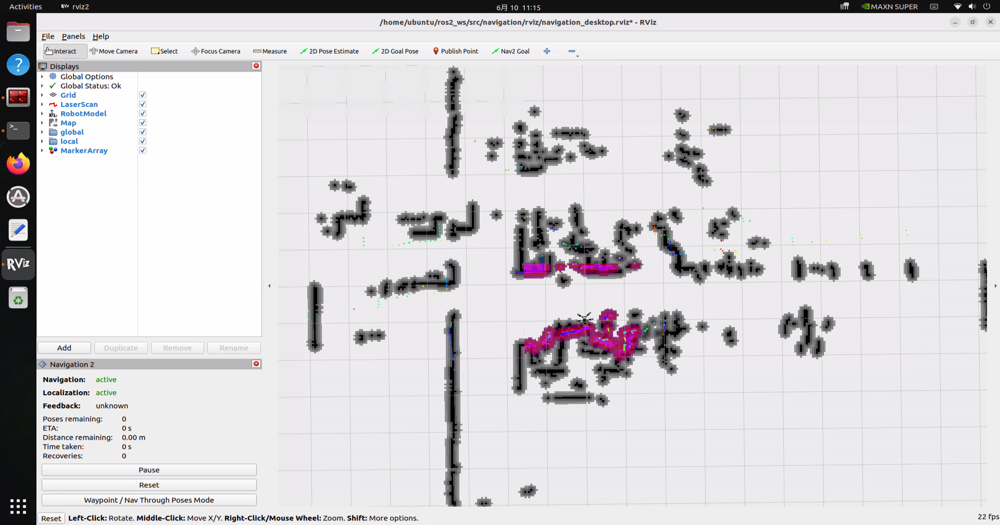

4. In the RViz top toolbar:
   * **2D Pose Estimate**: Initializes and calibrates the initial robot pose on the map.
   * **2D Goal Pose**: Sets a single navigation target waypoint.
   * **Nav2 Goal**: Sets multiple waypoints for multi-point waypoint following.


5. Click **2D Goal Pose**, click a target location on the map, and drag the mouse to set the target heading orientation. The navigation stack plans a path and drives the robot toward the target.

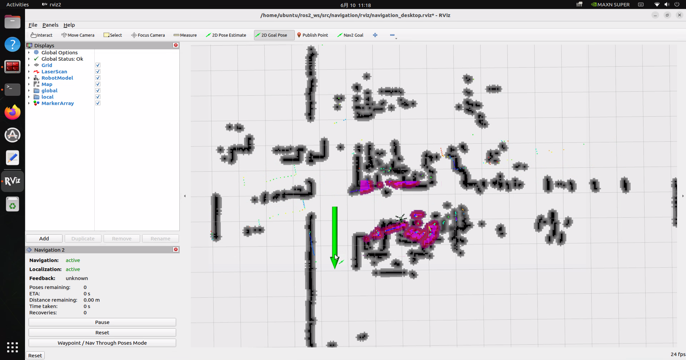

6. Click the icon in the lower-left corner  to enable multi-point navigation. Click **Nav2 Goal** to set a waypoint, and click and drag the mouse to define the target heading orientation. Repeat this operation to set multiple waypoints.

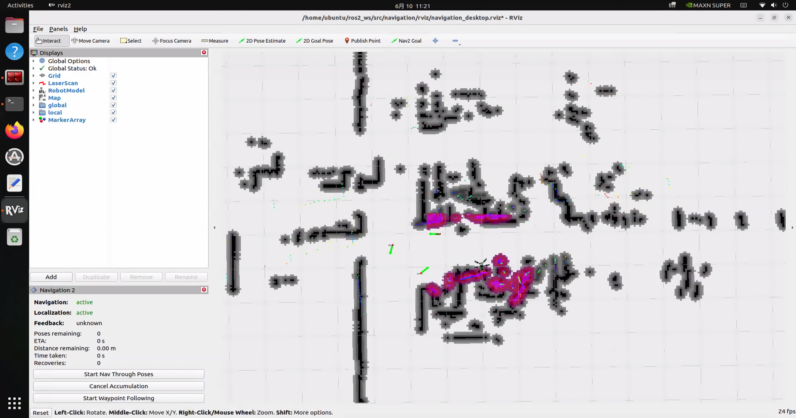

7. Once all waypoints are placed, click **Start Waypoint Following** in the lower-left panel. The robot navigates sequentially through each waypoint while autonomously detecting and avoiding dynamic obstacles.


## 1.6 Software Architecture and Directory Structure

### 1.6.1 Desktop Environment Overview

Taking the Jetson Orin Nano controller as an example, which also applies to other ROS controllers, start the JetHexa hexapod robot and connect it to the remote desktop software NoMachine. The system desktop is shown below:


Primary desktop shortcuts and their functions:

| Shortcut Icon | Function Description |
| :---: | :--- |
|  | Command-line terminal |
| 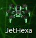 | JetHexa PC software |
| 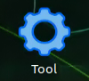 | Robot version configuration tool |
| 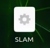 | Quick SLAM mapping |
|  | Autonomous navigation |

### 1.6.2 Directory Structure and Workspace Overview

1. Double-click the terminal icon 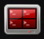, execute `ls`, and press **Enter** to inspect the home directory contents:


Overview of core directories in the home folder:

| Directory | Purpose |
| :--- | :--- |
| **ros2_ws** | Primary ROS 2 workspace containing all robot packages |
| **third_party_ros2** | Third-party packages and vision models, including YOLO models |
| **large_models** | Core scripts and configurations for large AI models |
| **wifi_manager** | Network configuration and Wi-Fi management scripts |
| **Music** | Audio and sound effect files |
| **Pictures** | Image storage |
| **Public** | Public shared directory |
| **Videos** | Video file storage |
| **Templates** | Template files |
| **Downloads** | Downloaded files |

2. Enter the command and press **Enter** to navigate to the robot package directory, and enter "ls" to view the files in the directory:

```bash
cd ros2_ws
ls
```


Overview of ROS 2 workspace directories:

| Directory | Description |
| :--- | :--- |
| **build** | Build directory storing intermediate compilation caches |
| **command** | Utility scripts and shortcut command references |
| **install** | Installation prefix containing built binaries and packages |
| **logs** | Build and runtime log files |
| **src** | Source code space containing all ROS 2 packages |

3. Enter the command and press **Enter** to enter the **src** directory, and enter "ls" to view each package in the **src** directory:

```bash
cd src
ls
```


Overview of ROS 2 packages in **src**:

| Package Directory | Type | Functional Description |
| :--- | :--- | :--- |
| **app** | App application packages | Gesture control, LiDAR features, visual line following |
| **example** | Vision and AI application packages | Color sorting, waste classification, visual handling |
| **interfaces** | ROS 2 communication interfaces | Custom msg and srv definitions |
| **slam** | SLAM mapping packages | Various SLAM algorithms and map serialization |
| **navigation** | Navigation packages | Nav2 goal dispatching and RViz navigation |
| **xf_mic_asr_offline** | Offline voice control package | Speech recognition and voice command handling |
| **xf_mic_asr_offline_msgs** | Voice control interface package | Message definitions for speech processing |
| **peripherals** | Peripheral device driver packages | LiDAR drivers, controller nodes, keyboard teleop |
| **simulations** | Simulation packages | Gazebo, MoveIt 2, and URDF kinematics models |
| **driver** | Hardware driver packages | Kinematics algorithms and STM32 serial communication |

4. Examining package layout using **/home/ubuntu/ros2_ws/src/app** as an example:

```bash
cd app
ls
```

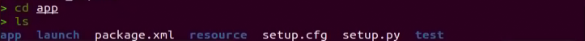

The **launch** folder houses XML/Python launch files, while the **app** folder contains the Python/C++ source code:


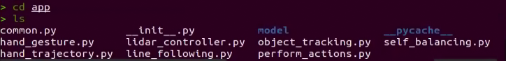

Remaining functional packages adhere to this standard ROS 2 package architecture.

### 1.6.3 Managing Auto-Start Services

Because the robot enables the background app control service by default on boot, terminate this background service manually before developing custom ROS nodes or running individual application scripts to release hardware device handles, such as cameras and serial ports:

1. Click the terminal icon  to open a terminal.
2. Enter one of the following two commands and press **Enter** to stop the auto-start service:

```bash
~/.stop_ros.sh
```

```bash
sudo systemctl stop start_app_node.service
```

> [!NOTE]
>
> **The first script terminates all running ROS nodes, whereas the second command stops only the background auto-start systemd service.**

3. Remember to enable the auto-start service after finishing study and development, otherwise the robot cannot be controlled using the mobile app or wireless controller.
4. Enter the command in the command line terminal and press **Enter** to enable the auto-start service:

```bash
sudo systemctl restart start_app_node.service
```

## 1.7 Hardware Specifications

This section details the hardware architecture of the JetHexa robot, including the electronic control system, Jetson Orin Nano/Orin NX controller, LiDAR, 3D depth camera, and bus servos.

<p id="2.2"></p>

### 1.7.1 Hardware Architecture

#### 1.7.1.1 Hardware System Block Diagram

The block diagram below illustrates the hardware architecture centered on the Jetson Orin Nano/Orin NX controller:

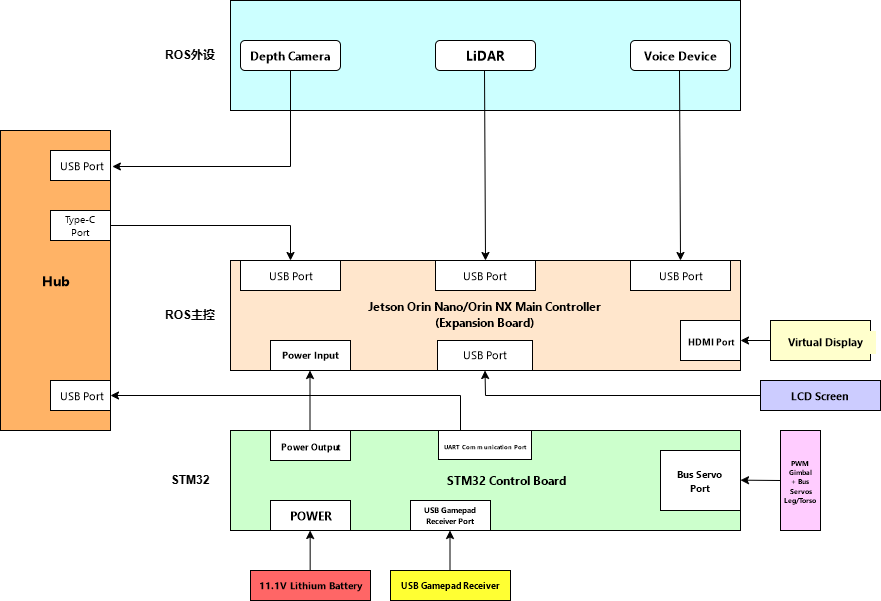

### 1.7.2 Electronic Control System Overview

The electronic control architecture adopts a dual-brain design: the Jetson Orin Nano/Orin NX controller acts as the host controller managing LiDAR, the 3D depth camera, and voice peripherals, while the STM32 controller acts as the sub-controller driving the multi-channel bus servos and integrating a 6-axis IMU for real-time motion control, attitude feedback, and sensor acquisition.

#### 1.7.2.1 ROS Controller

Jetson Orin Nano/Orin NX:


The JetHexa robot employs the Jetson Orin Nano/Orin NX controller paired with a dedicated expansion board. The compute module runs modern deep learning frameworks to deliver ample edge AI compute power for machine vision and large AI model tasks.

The expansion board breaks out status LEDs and tactile buttons, enabling network status monitoring and connection mode switching, while providing exposed GPIO, I2C, and LiDAR serial communication headers.

The controller runs Ubuntu 22.04.5 LTS with ROS 2 Humble pre-installed.

For controller fundamentals, refer to [Development Basics Course]().

#### 1.7.2.2 STM32 Robot Controller

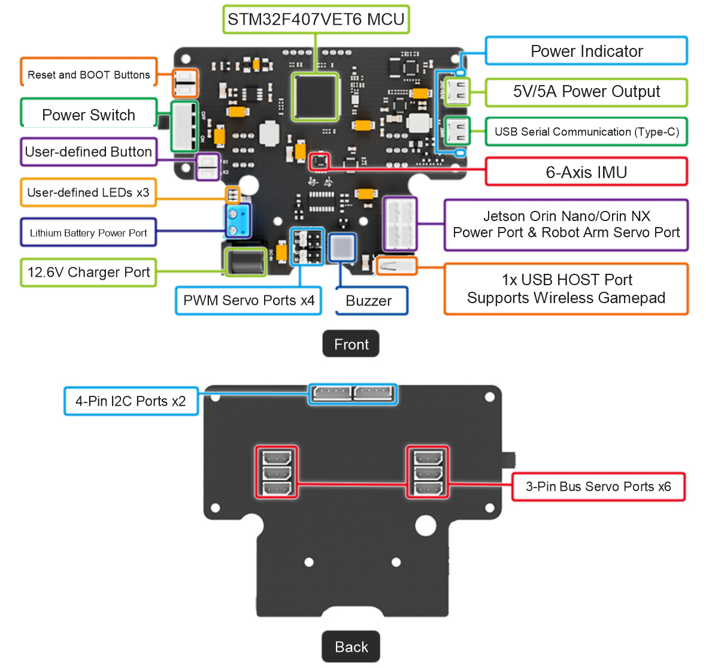

The STM32 controller acts as the motion sub-controller. It features an on-board STM32F407VET6 MCU, PWM and bus servo driver circuits, and a QMI8658 6-axis IMU motion sensor.

The sub-controller receives high-level velocity and trajectory commands from the ROS controller or wireless controller via UART to drive the 18 chassis bus servos and 2 pan-tilt servos, while supplying power to the host controller. Multi-function programmable buttons are also available for custom programmable functions.

#### 1.7.2.3 Aurora930 Pro 3D Depth Camera


Vision serves as the primary perceptual sensor of the robot.

The robot utilizes an Aurora930 Pro 3D depth camera based on 3D structured light technology. By fusing RGB color images with calibrated depth maps, it provides dense 3D spatial perception for obstacle avoidance, visual SLAM, and spatial tracking.

In software, it supports OpenCV vision tasks, deep learning object detection, and KCF target tracking. For camera tutorials, refer to [4. Camera Basics Course]().


Camera technical specifications:

| Category | Parameter | Specification |
| :--- | :--- | :--- |
| Module Parameters | Dimensions | 76.5 × 20.7 × 21.8 mm |
| | Baseline | 40 mm |
| | Interface | USB 2.0 Wafer connector |
| | Depth Accuracy | 8 mm @ 1 m |
| | Depth Precision | 3 mm @ 0.5 m, 7 mm @ 1 m |
| | Operating Range | 30–300 cm |
| | Operating Temperature | -10 °C to 55 °C |
| | Operating Humidity | 0%–95%, non-condensing |
| | Ambient Light | 3–6000 Lux |
| | Power Supply | 5 V ± 10%, 1.5 A |
| | Power Consumption | Average < 1.6 W |
| | Safety Rating | Class 1 laser safety |
| Image Performance | Depth Data Format | Raw 16 |
| | Depth Resolution / Frame Rate | 640 × 400 (320 × 240) / 5–15 fps / H71° × V46° |
| | Color Data Format | NV12 |
| | Color Resolution / Frame Rate | 640 × 400 (320 × 240) / 5–15 fps / H71° × V46° |
| | Infrared Data Format | Raw 8 |
| | Infrared Resolution / Frame Rate | 640 × 400 (320 × 240) / 5–15 fps / H71° × V46° |
| System Compatibility | Operating Systems | Linux / Armv8 / ROS / Windows / Android |

> [!NOTE]
>
> **Individual 3D camera units may exhibit minor manufacturing variances. Values above represent theoretical design specifications for reference.**

#### 1.7.2.4 LiDAR Sensors

The robot supports two LiDAR options: the COIN-D6 LiDAR, also designated as LD19, and the RPLIDAR C1. The LiDAR sensor emits modulated laser pulses to measure distance and bearing, generating 360° 2D point cloud scans. Applications include obstacle avoidance, target following, 2D SLAM mapping, and autonomous navigation. For details, refer to [3. LiDAR Course]().

The LD19 LiDAR incorporates a ranging core, wireless power transfer coil, wireless optical transceiver, angle measurement unit, motor driver, and protective casing. After power-on, the scan frequency stabilizes to 10 ± 0.1 Hz within 3 s. It provides an external PWM interface for closed-loop speed regulation using a PID controller.

The LD19 interfaces via a ZH1.5T-4P 1.5 mm connector for DC power and serial data:


| Pin No. | Signal | Type | Description | Min | Typical | Max |
| :---: | :---: | :---: | :--- | :---: | :---: | :---: |
| 1 | Tx | Output | LiDAR serial data output | 0 V | 3.3 V | 3.5 V |
| 2 | PWM | Input | Motor speed control signal | 0 V | - | 3.3 V |
| 3 | GND | Power | Power ground | - | 0 V | - |
| 4 | P5V | Power | 5 V power input | 4.5 V | 5 V | 5.5 V |

The RPLIDAR C1 is a hybrid 2D LiDAR featuring a high-speed laser ranging sampling capability of 5,000 samples per second. It adopts non-contact energy and signal transmission technology, overcoming the lifespan limitations of traditional LiDAR to achieve reliable, stable long-term operation.

The RPLIDAR C1 provides a ranging radius of up to 12 m with a minimum blind zone down to 0.05 m, easily scanning and ranging objects across various distances to address diverse obstacle challenges in the environment. While maintaining powerful performance, the RPLIDAR C1 features a compact and agile form factor, ultra-low noise, and minimal vibration, making it easy to embed into various applications. It can be used in practical applications such as robot vacuum cleaners, educational ROS wheeled robots, commercial robots, low-speed park autonomous vehicles, and parking space detection.

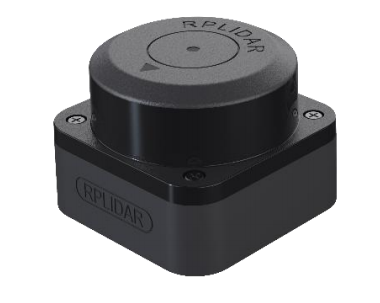

The RPLIDAR C1 uses a separate 5 V DC power supply to simultaneously power both the ranging system and the motor system. It uses an XH2.54-5P specification male socket, and the specific interface definitions are shown in the figure below:

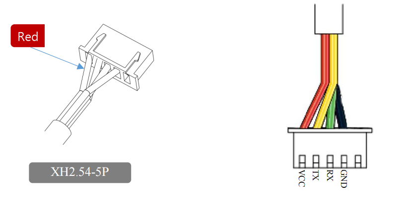

For additional technical manuals, refer to the hardware documentation package.

#### 1.7.2.5 WonderEcho Pro


The WonderEcho Pro AI voice interaction module integrates high-performance noise-canceling microphones and a high-fidelity speaker with a plug-and-play USB audio interface supporting multi-platform recording and playback without driver installation.

It combines multi-stage speech processing algorithms with active noise suppression to filter ambient background noise, enabling an end-to-end voice pipeline from wake-word detection to ASR speech recognition and TTS speech synthesis. The modular architecture allows components such as wake-up, detection, recognition, and synthesis, to be developed and evaluated independently.

For additional information, refer to [8. Voice Control Course]().

#### 1.7.2.6 LCD Screen


The on-board 1.9-inch color LCD displays real-time telemetry parameters, camera feeds, large model conversational outputs, and interactive feature menus, connecting low-level hardware states with high-level software algorithms for transparent human-robot interaction.

#### 1.7.2.7 HX-35H Intelligent Bus Servo

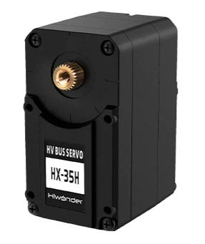

The JetHexa chassis is articulated by 18 **HX-35H** intelligent high-voltage bus servos connected to precision sheet-metal brackets. Each servo provides real-time position, voltage, and temperature feedback with over-temperature and stall protection. For servo specifications and protocol details, refer to the bus servo hardware documentation.

## 1.8 System Image Flashing

> [!NOTE]
>
> **The robot system image is pre-flashed at the factory. Re-flashing is unnecessary under standard initial operation.**

### 1.8.1 Preparation

**Hardware Requirements:**

For **Jetson Orin Nano** and **Jetson Orin NX** editions, prepare an M.2 NVMe solid-state drive, sized according to the system image, an external M.2 SSD USB reader/enclosure, and a computer running Windows 10 or later.


**Software Tools:**
Locate the disk partitioning tool DiskGenius under [**2. Software/3. Image Burning Tool/3. Hard Drive Initialization Tool/**](https://drive.google.com/drive/folders/1m-AOJ6maLWh_pp4vPbf-uX6FccfvayKM?usp=sharing) in the same directory as this document, and the flashing tool Win32DiskImager under [**2. Software/3. Image Burning Tool/2. System Image Flashing Tool/**](https://drive.google.com/drive/folders/1tJK1aM7D1n512dR8KR4SjXjAOiIaD755?usp=sharing).

> [!NOTE]
>
> * **Before flashing the image, use DiskGenius to delete all redundant partitions on the SSD.**
>
> * **When flashing completes, Windows may display several prompts requesting to format the unreadable Linux partitions. Click Cancel on all such prompts. Never format these partitions.**
>
> 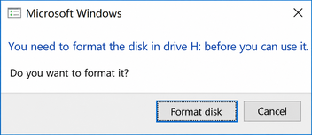

### 1.8.2 Solid-State Drive Formatting

> [!NOTE]
>
> **If using a brand-new, unpartitioned SSD or SD card, formatting is not required.**

1. Remove the SSD from the Jetson Orin Nano or Jetson Orin NX controller:


2. Launch **DiskGenius.exe**. Verify that the target drive letter matches the external SSD reader before modifying partitions to avoid accidentally altering computer drives.
3. Insert the SSD into the PC using the external reader. The external drive appears in DiskGenius:


4. Right-click the SSD drive entry and select **Delete All Partitions**.

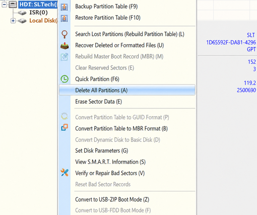

5. Once deleted, the drive displays as unallocated space:


6. Click **New Partition** to create a single readable partition, and click **OK** in the confirmation dialog:

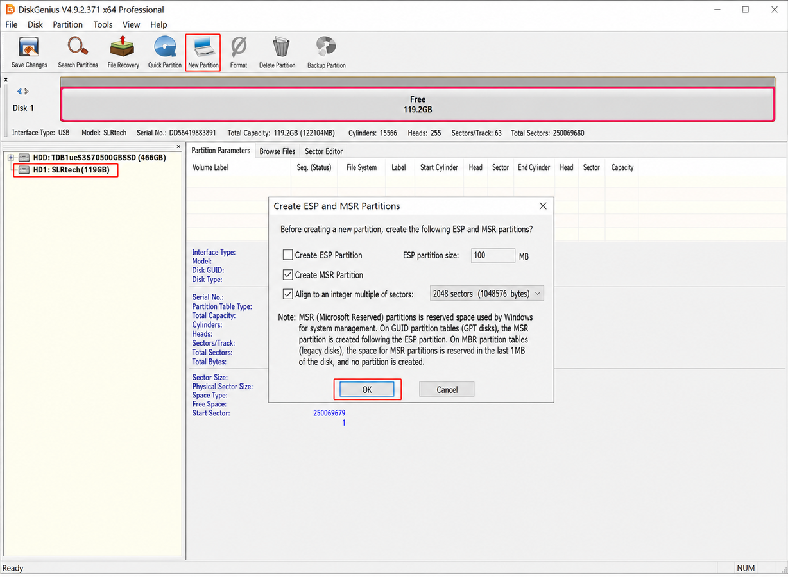

7. Click **Save Changes** in the top toolbar.


8. The formatted partition details appear, confirming completion:


### 1.8.3 Image Flashing Procedure

1. Open **Win32DiskImager**. Click the folder icon  to select the system image file, downloading and decompressing as required. The image shown is for reference only, and the actual image shall prevail. Under **Device**, select the drive letter corresponding to the SSD. Click **Write** to begin flashing.

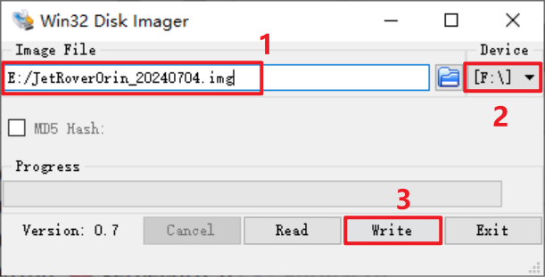

> [!NOTE]
>
> **Ensure that the file path containing the system image contains no non-ASCII characters.**

2. If a confirmation dialog appears, click **Yes**.


3. When the **Write Successful** notification appears, flashing is complete. If an error occurs, temporarily disable third-party antivirus software, re-insert the SSD, and repeat the write procedure.


> [!NOTE]
>
> **Dismiss any Windows formatting prompts that appear upon completion.**

4. Safely eject the SSD, reinstall it into the Jetson controller, and power on the robot to boot into the newly flashed system.
