# 10. Gazebo Simulation

<p id ="p10-1"></p>

## 10.1 Virtual Machine Installation and Import

### 10.1.1 Virtual Machine Software Installation

* **Installing VMware Workstation**

In simple terms, a virtual machine is software that allows another operating system to run inside the host operating system. This section uses VMware Workstation as an example. The installation procedure is as follows:

1. Extract the virtual machine software archive located under [1. Tutorials/10. Gazebo Simulation/Resource Files/1. Virtual Machine Software](https://drive.google.com/drive/folders/1Q111qAwjOuBtv2-INBaEZ7Qh5yeFUbd6?usp=sharing).

2. Open the extracted virtual machine folder, and double-click the installer executable file with the **.exe** extension.


3. Complete the virtual machine installation following the sequential prompts shown in the figures.

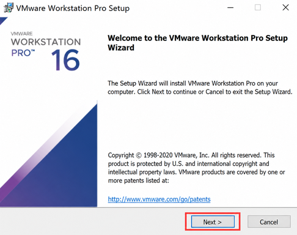


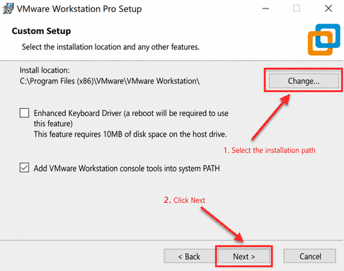

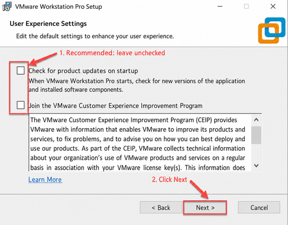

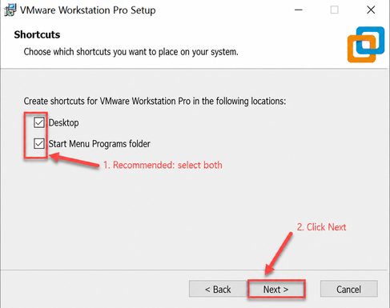

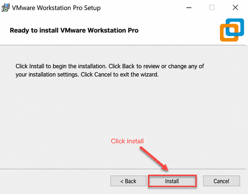

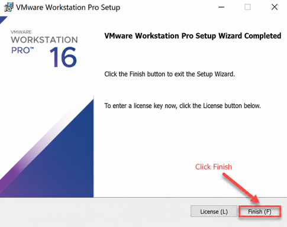

4. When launching the virtual machine for the first time, enter the product key, and then click **Continue**.

* **Starting Local VMware Services on the Host PC**

1. On the host computer, press the shortcut keys **Win+R** to open the Run dialog. Enter **control** and press **Enter** to open the Control Panel.

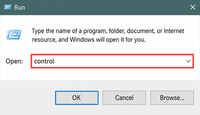

2. Click **Administrative Tools** to open the management panel, and double-click **Services**.


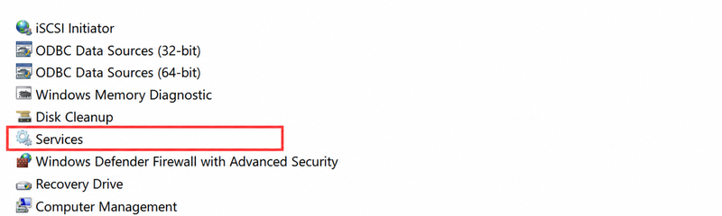

3. Locate the VMware-related services, as shown in the following image:

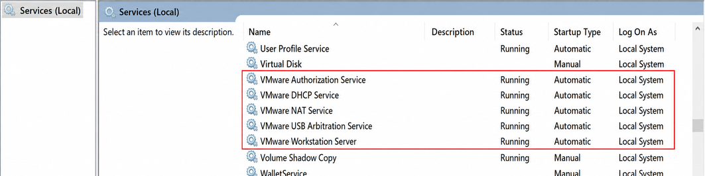

4. Right-click and select **Start** to start all VMware-related services.


### 10.1.2 Virtual Machine Image Import

1. In the software interface, click **Open a Virtual Machine**.


2. Navigate to [1. Tutorials/10. Gazebo Simulation/Resource Files/2. Virtual Machine Images](https://drive.google.com/drive/folders/10VAttqWkDNHYcdOEvYb9ZVPg9pNh-Gng?usp=sharing), locate the virtual machine image file shown below, and open it.

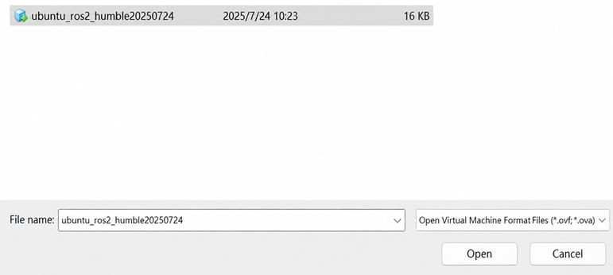

3. Select the target storage path, click **Import**, and wait for the import process to complete.

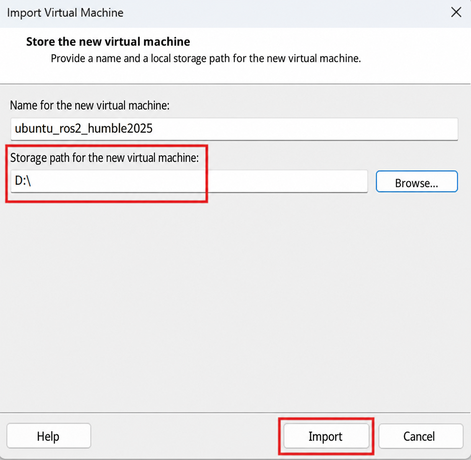

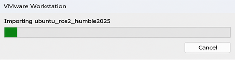

4. After the import is complete, virtual machine operations can proceed.

### 10.1.3 Virtual Machine Settings

1. Select the imported virtual machine, and click **Edit virtual machine settings**.

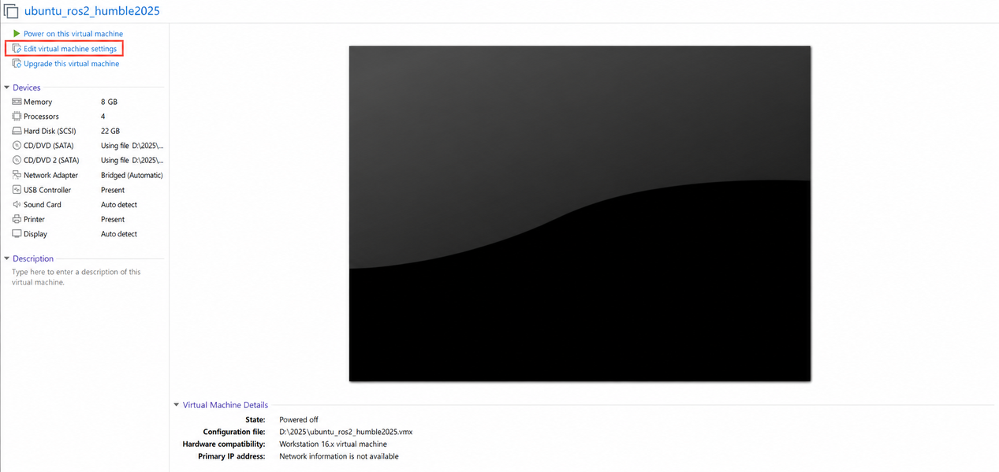

2. Click **Network Adapter**, and select **Bridged**.

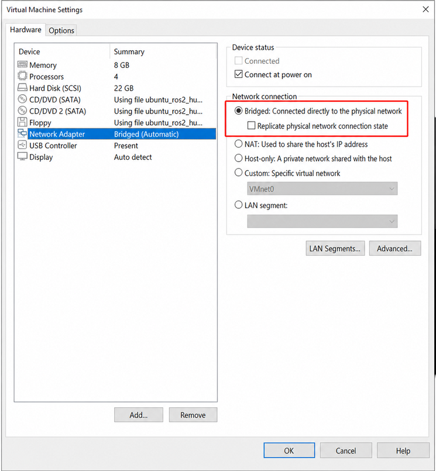

3. Click **Display**, and uncheck **Accelerate 3D graphics**.

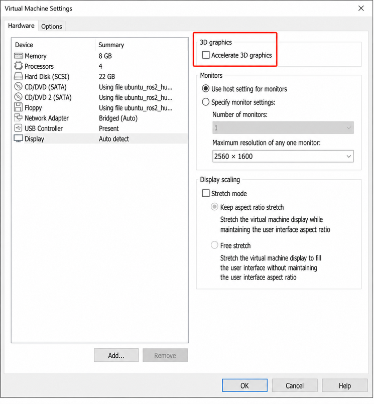

<p id ="p10-2"></p>

## 10.2 Environment Configuration

> [!NOTE]
>
> **The initial startup of the virtual machine typically requires extra time to initialize, which is normal behavior.**

The interface after launching the virtual machine is shown in the following image:

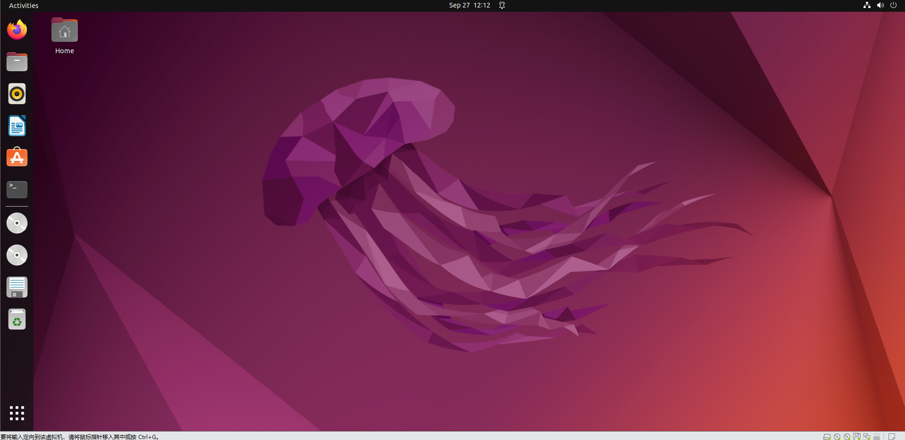

### 10.2.1 Package Import

1. Start the virtual machine. Click the 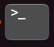 icon on the desktop to open a command terminal.

2. Click the Home  icon on the desktop to enter the file manager.

3. Locate the **simulations** archive and the **.typerc** file under [1. Tutorials/10. Gazebo Simulation/Resource Files/3. Package Files](https://drive.google.com/drive/folders/1H1bYSlHbMaeGp0IaqFi6mFC20H-gKFI7?usp=sharing), and drag them into the **Home** directory of the virtual machine.

4. Right-click inside the **Home** directory, and click **Open in Terminal** to open a terminal window.


5. Enter the command to create the workspace source directory:

```bash
mkdir -p ~/ros2_ws/src
```

6. Enter the following commands sequentially to decompress and place the package inside the workspace directory:

```bash
unzip ~/simulations.zip
mv ~/simulations ~/ros2_ws/src/simulations
```

7. Enter the following command to build the package, and wait for the compilation to finish:

```bash
cd ~/ros2_ws && colcon build --symlink-install
```

8. Enter the command to move the **.typerc** configuration file:

```bash
mv /home/ubuntu/.typerc ~/ros2_ws/.typerc
```

9. Enter the command to verify that the file has been moved successfully:

```bash
cd ~/ros2_ws/ && ls -a
```

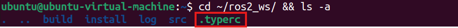

10. Enter the commands to configure automatic loading of the environment settings:

```bash
echo "source ~/ros2_ws/install/setup.bash">>~/.bashrc
echo "source ~/ros2_ws/.typerc">>~/.bashrc
```

11. Reload the configuration file to apply the new settings:

```bash
source ~/.bashrc
```

### 10.2.2 Network Configuration on the Robot

To ensure smooth communication between the virtual machine and the robot during subsequent collaborative operations, configure the network of the device first.

1. Power on the robot, and open a command terminal.

2. Enter the following command to configure the Wi-Fi file:

```bash
cd wifi_manager && gedit wifi_conf.py
```

3. Set the mode to LAN mode, and enter the Wi-Fi network name and password. A dedicated Wi-Fi router or mobile phone hotspot is required for subsequent connections.


4. Press **Ctrl+S** to save the changes, and close the editor.

5. Ensure that the device and the virtual machine are located within the same network segment for subsequent connections. Enter the following command in the terminal to check the IP address:

```bash
ifconfig
```

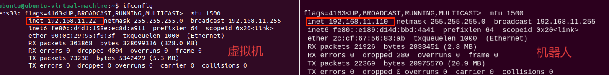

As shown above, the virtual machine and the robot are on the same **192.168.11.x** network segment, allowing normal communication.

* **Common Connection Methods**:

1. Connection via a router, which is the recommended method: Connect the computer and the Jetson board to the same router using Ethernet cables.

2. Connection via a local area network, another recommended method: Configure the STA mode according to the tutorial, and then connect both the robot and the computer to the same Wi-Fi network or mobile hotspot.

3. Direct connection, which is not recommended: Set the robot to AP mode for direct connection, and then connect the computer to the Wi-Fi network broadcast by the robot.

### 10.2.3 Device Configuration on the Virtual Machine

The network environment has been configured in the preceding section. However, within the same network, the virtual machine and the robot must have matching ID numbers to communicate with each other. The configuration procedure is as follows:

1. Power on the robot, and open a command terminal.

2. The terminal displays the `DOMAIN_ID` of the device, as shown in the following image. This value is for reference only and must be adjusted according to the actual setup.


3. Start the virtual machine. Click the  icon on the desktop to open a command terminal.

4. Enter the following command to open the configuration file:

```bash
gedit ~/ros2_ws/.typerc
```

5. Modify the ID shown in the following image to **10**:

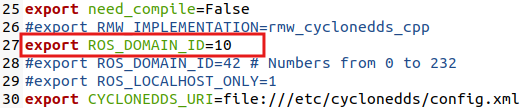

6. Press **Ctrl+S** to save the configuration, and then close the editor.

7. Close the current terminal and open a new terminal window. The ID number is now updated to **10**:

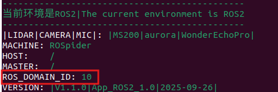

<p id ="p10-3"></p>

## 10.3 Introduction to URDF Models

<p id ="p10-3-1"></p>

### 10.3.1 URDF Model Overview and Introduction

> [!NOTE]
>
> **This tutorial relies on the virtual machine for configuration and simulation. If the virtual machine is not installed, install it first by referring to [Section 10.1 Virtual Machine Installation and Import](#p10-1).**

* **URDF Model Overview**

URDF, or Unified Robot Description Format, is an XML-based specification used to describe robot structures. The purpose of this format is to provide a standardized and widely applicable robot description specification.

Robots are typically modeled as structures composed of multiple links and joints. A link represents a rigid body with physical mass, while a joint connects and constrains the relative motion between two links.

When multiple links are interconnected and constrained through joints, a complete robot kinematic model is formed. A URDF document describes the relative relationships, inertial properties, geometric features, and collision models of this series of joints and links.

* **Comparison Between Xacro and URDF Models**

A URDF model is a straightforward robot model description file characterized by a clear and accessible structure. However, when using standard URDF to describe complex robot structures, the description file becomes lengthy and repetitive, making concise modeling difficult.

The Xacro model is an extension of the URDF model, and both share the same fundamental format. Describing a robot using Xacro enables advanced macro definitions to streamline the description file, enhancing code reusability and effectively resolving the redundancy of standard URDF files.

For example, to describe the two legs of a humanoid robot in a standard URDF model, each leg must be defined separately. Using a Xacro model, only a single leg macro needs to be defined and then reused for both legs.

* **Installing URDF Dependencies**

> [!NOTE]
>
> **The URDF and Xacro packages are pre-installed in the virtual machine, so manual installation is not required. The following steps are provided for reference only.**

1. Enter the command and press **Enter** to update package information:

```bash
sudo apt update
```

2. Enter the command and press **Enter** to install the URDF dependency:

```bash
sudo apt-get install ros-humble-urdf
```

The output shown in the following image indicates a successful installation:


3. Enter the command and press **Enter** to install the Xacro extension format for URDF models:

```bash
sudo apt-get install ros-humble-xacro
```

The output shown in the following image indicates a successful installation:


* **Basic URDF Syntax**

1. XML Basic Syntax

Since URDF models are written based on XML specifications, understanding the fundamental structure of XML is essential.

(1) Elements can be defined with custom names according to the following syntax rules:

```xml
<element>
</element>
```

(2) Attributes are contained within elements to define properties and parameters, following this structure:

```xml
<element attribute_1="value1" attribute_2="value2">
</element>
```

(3) Comments do not affect other attributes or elements, defined with the following syntax:

```xml
<!-- Comment content -->
```

2. Links

Links use the `<link>` tag in URDF models to describe the appearance and physical properties of a rigid body part of the robot. Defining link behavior utilizes the tags shown in the following image:


* `<visual>`: Describes the visual appearance parameters of the link, such as dimensions, color, and shape.
* `<inertial>`: Describes the inertial parameters of the link, primarily used in robot dynamics calculations.
* `<collision>`: Describes the collision detection properties of the link.

Each tag contains corresponding child tags and distinct functions, as detailed in the following table:

| Tag | Description |
| :--- | :--- |
| origin | Describes the pose of the link, containing two parameters: `xyz` defines the position in the simulation map, and `rpy` defines the orientation in the simulation map. |
| mass | Describes the mass of the link. |
| inertia | Describes the inertia of the link. Due to the symmetry of the inertia matrix, six parameters must be entered as attributes: `ixx`, `ixy`, `ixz`, `iyy`, `iyz`, and `izz`, which are obtained through calculation. |
| geometry | Describes the geometry of the link. The `mesh` parameter loads the mesh file, and the `filename` parameter specifies the path to the mesh file. It also includes three sub-tags: `box`, `cylinder`, and `sphere`, representing rectangular prism, cylinder, and sphere respectively. |
| material | Describes the material of the link, where the `name` parameter is required. Color and transparency can be adjusted via the `color` sub-tag. |

3. Joints

Joints use the `<joint>` tag in URDF models to describe the kinematic and dynamic properties of a robot joint, along with position and velocity limits. Based on the type of motion, joints are categorized into the six types listed in the following table:

| Type and Description | Tag |
| :--- | :--- |
| Revolute joint that can rotate infinitely around a single axis | continuous |
| Revolute joint similar to continuous, but with rotation angle limits | revolute |
| Prismatic joint that moves along a specific axis with position limits | prismatic |
| Planar joint that allows translation or rotation in orthogonal directions on a plane | planar |
| Floating joint that allows both translational and rotational motion | floating |
| Fixed joint that does not permit any relative motion | fixed |

Defining joint behavior utilizes the tags shown in the following image:


* `<parent_link>`: The parent link.
* `<child_link>`: The child link.
* `<calibration>`: Used to calibrate joint angles.
* `<dynamics>`: Describes physical dynamics parameters of motion.
* `<limit>`: Describes physical limits of motion.

Each tag contains corresponding child tags and distinct functions, as detailed in the following table:

| Tag | Description |
| :--- | :--- |
| origin | Describes the pose relative to the parent link, containing two parameters: `xyz` defines the position in the simulation map, and `rpy` defines the orientation in the simulation map. |
| axis | Specifies the rotation axis of the child link relative to the parent link along any of the X, Y, or Z axes. |
| limit | Constrains the child link. The `lower` and `upper` attributes limit the rotation range in radians, the `effort` attribute limits the applied torque during rotation in N, and the `velocity` attribute limits the rotational velocity in m/s. |
| mimic | Describes the relationship between this joint and other joints. |
| safety_controller | Describes safety control parameters used to protect robot joint movements. |

4. `<robot>` Tag

The top-level root tag of a complete robot model. The `<link>` and `<joint>` tags must be enclosed inside `<robot>`, formatted as follows:


5. `<gazebo>` Tag

Used in conjunction with the Gazebo simulator to configure simulation parameters. This tag is used to integrate Gazebo plugins, configure Gazebo physical properties, and set simulation attributes:


6. Writing a Simple URDF Model

(1) Setting the Robot Model Name

At the very beginning of writing a URDF model, specify the name of the robot model using `<robot name="robot_name">`. At the end of the model definition, enter `</robot>` to indicate completion:


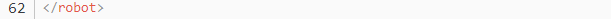

(2) Setting the Link

1. Define the first link. Indentation indicates that this link belongs to the configured model. Specify the name of the link using `<link name="link_name">`. At the end of the link block, enter `</link>` to conclude the definition:


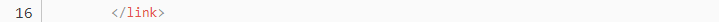

2. Define the visual description section. Indentation indicates that this description applies to the configured link. Enter `<visual>` at the start of the description and `</visual>` at the end:


3. The `<geometry>` tag describes the shape of the link and concludes with `</geometry>`. Indented content inside specifies the geometry details. The following image defines a cylinder link with `<cylinder length="0.01" radius="0.2"/>`, where `length="0.01"` indicates a length of 0.01 m, and `radius="0.2"` indicates a radius of 0.2 m:

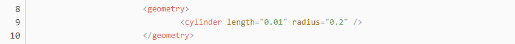

4. The `<origin>` tag describes the position and orientation of the link. The following image defines a link pose with `<origin rpy="0 0 0" xyz="0 0 0" />`, where `rpy` defines the Euler angles, and `xyz` defines the coordinate position, placing the link at the origin of the coordinate system:


5. The `<material>` tag describes the color and material of the link, starting with `<material>` and ending with `</material>`. The following image sets the link color to yellow with `<color rgba="1 1 0 1" />`, where `rgba="1 1 0 1"` specifies the color thresholds:

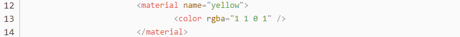

(3) Setting the Joint

1. Define the first joint. Indentation indicates that this joint belongs to the configured model. Specify the name and type of the joint using `<joint name="joint_name" type="joint_type">`. At the end of the joint block, enter `</joint>` to complete the joint definition:


2. Define the parent and child links connected by the joint using `<parent link="parent_link"/>` and `<child link="child_link"/>`. When the joint rotates, it rotates the child link relative to the parent link as the pivot:


3. The `<origin>` tag describes the relative position of the joint. The following image defines a joint position with `<origin xyz="0 0 0.1" />`, where `xyz` defines the specific coordinates in the coordinate frame as x = 0, y = 0, and z = 0.1:

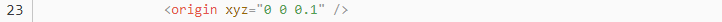

4. The `<axis>` tag describes the rotation axis of the joint. The following image defines a joint axis with `<axis xyz="0 0 1" />`, where `xyz` specifies the direction vector of the rotation axis:

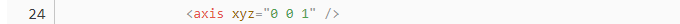

5. The `<limit>` tag constrains joint motion. The following image limits the maximum torque to 300 N, with an upper rotation limit of 3.14 rad and a lower limit of -3.14 rad. The parameters are defined as: `effort` sets the maximum torque in N, `velocity` sets the maximum joint velocity, `lower` sets the lower limit in radians, and `upper` sets the upper limit in radians:


6. The `<dynamics>` tag describes the dynamics parameters of the joint. The following image defines joint dynamics parameters with `<dynamics damping="50" friction="1" />`, where `damping` specifies the damping coefficient and `friction` specifies the physical friction:

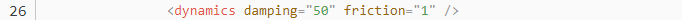

The complete code is shown below:

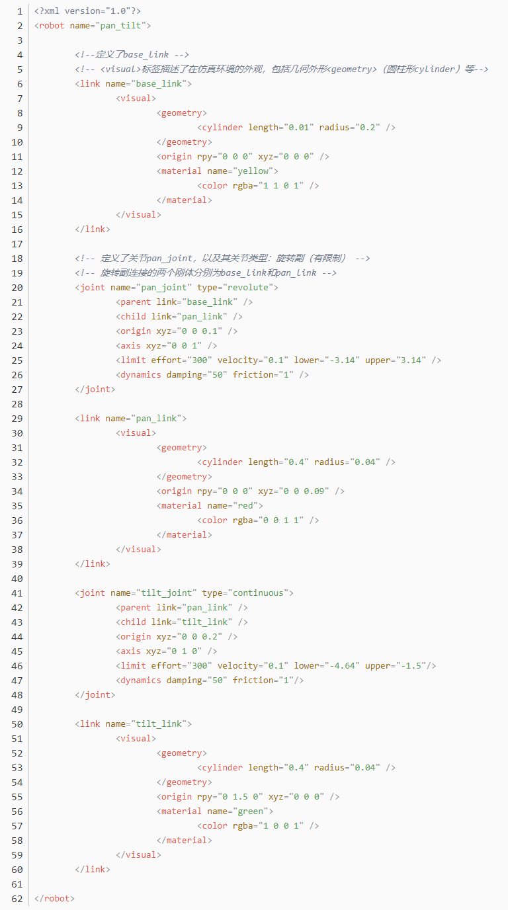

### 10.3.2 Robot URDF Model Explanation

* **Preparations**

This section provides a concise analysis of the robot model code and component models. For the syntax related to URDF models, refer to [Section 10.3.1 URDF Model Overview and Introduction](#p10-3-1).

* **Viewing the Robot Model Code**

1. Start the virtual machine. Click the 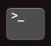 icon on the left side of the desktop to open a command terminal.

2. Enter the command and press **Enter** to navigate to the launch program directory:

```bash
cd ros2_ws/src/simulations/rospider_description/urdf
```

3. Enter the command to open the robot simulation model file:

```bash
vim rospider.xacro
```

The file includes multiple URDF models to compose the complete robot:

| File Name | Component |
| :--- | :--- |
| materials | Color |
| inertial_matrix | Inertia matrix |
| base | Base |
| lidar | LiDAR |
| imu | Inertial measurement unit |
| depth_camera | Depth camera |
| arm | Robotic arm |
| gripper | Gripper |

* **Brief Analysis of the Robot Model**

Open a new terminal window and enter the command to open the robot model file:

```bash
vim arm.urdf.xacro
```

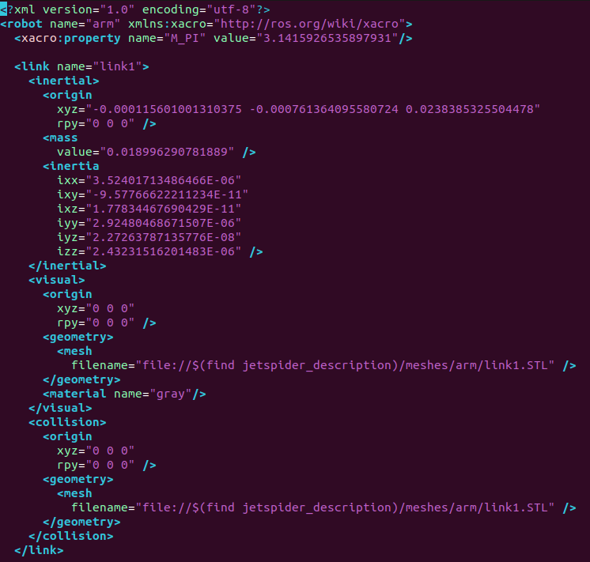

The header of the URDF file specifies the XML version and encoding, and defines a robot model named **arm**. The file uses the `xmlns:xacro` namespace to generate the URDF using Xacro macro definitions. A constant `M_PI`, representing pi with a value of approximately 3.14159, is defined for joint angle calculations.

The following table provides an analysis of the **link1** link:

| Sub-tag | Description and Parameters |
| :--- | :--- |
| `<inertial>` | Defines the physical inertial properties of the link, affecting mechanical behavior in simulation.<br />**origin**: Pose of the inertial frame relative to the link frame, where xyz represents position and rpy represents orientation.<br />**mass**: Link mass, with a value of 0.018996290781889 kg.<br />**inertia**: Inertia matrix with six parameters, describing rotational inertia around each axis. |
| `<visual>` | Defines the visual model of the link displayed in tools such as RViz. <br />**origin**: Pose of the visual model relative to the link, which coincides with the link frame here.<br />**geometry**: Loads the STL model file via mesh from **link1.STL** under the **jetspider_description** package.<br />**material**: Specifies the color as gray. |
| `<collision>` | Defines the collision detection model used for collision evaluation in simulation. Shares the same STL model with `<visual>` to ensure visual and collision boundaries match.<br />**origin**: Coincides with the link frame, ensuring the collision detection boundary matches the appearance model exactly. |


The following table provides an analysis of the **joint1** joint:

| Parameter | Description |
| :--- | :--- |
| name | Joint name: **joint1**. |
| type | Joint type: revolute, representing a revolute joint with angle limits. |
| origin | Pose of the joint frame relative to the parent link: position x = 0.065006 m, y = 0 m, z = 0.082583 m, with orientation set to 0. |
| parent | Parent link: **base_link**, representing the robotic arm base. |
| child | Child link: **link1**, representing the first arm segment. |
| axis | Rotation axis: vector 0.00040398, 0, 1, approximately along the Z-axis in the vertical direction. |
| limit | Motion limits: angle range from -π to π, corresponding to -180° to 180° for omnidirectional rotation; maximum torque effort of 1000 N; maximum velocity of 10 m/s. |

> [!NOTE]
>
> **This tutorial relies on the virtual machine for configuration and learning. If the virtual machine is not installed, install it first by referring to [Section 10.1 Virtual Machine Installation and Import](#p10-1).**

<p id ="p10-4"></p>

## 10.4 Gazebo Simulation

### 10.4.1 Gazebo Overview and Introduction

This section introduces Gazebo, a simulation software used to create a virtual physical environment that closely simulates the real world, allowing robots to perform tasks realistically.

Gazebo is a standalone software application and the most widely used robot simulation software within the ROS ecosystem. It provides high-fidelity physical simulation and a comprehensive suite of sensor models, along with an intuitive user interface to enhance robotic development in complex environments.

Gazebo supports both URDF and SDF format files, and the robot utilizes URDF models. Both formats are used to describe simulation environments, and official repositories provide various standard model blocks ready for direct use.

* **Gazebo GUI Overview**

The simulation software interface is shown in the following image:

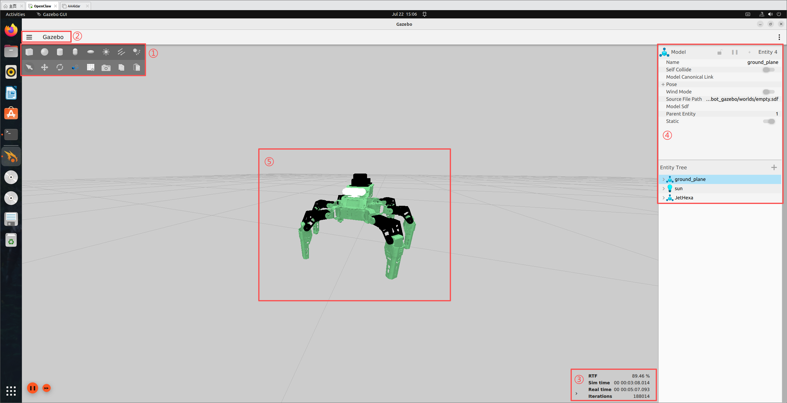

The specific functions of each area are detailed in the following table:

| Item | Function |
| :--- | :--- |
| Toolbar ① | Provides the most commonly used options for interacting with the simulator. |
| Menu bar ② | Configures and modifies simulation parameters, and provides interactive functions. |
| Time panel ③ | Controls and manipulates simulation time in the virtual environment. |
| Actions panel ④ | Manipulates models and adjusts their parameters. |
| Scene ⑤ | The main display area of the simulator where simulation models are rendered. |

For more information regarding Gazebo, visit the official website at [https://gazebosim.org/](https://gazebosim.org/).

* **Gazebo Learning Resources**

* Gazebo official website: [https://gazebosim.org/](https://gazebosim.org/)
* Gazebo tutorials: [https://gazebosim.org/tutorials](https://gazebosim.org/tutorials)
* Gazebo GitHub repository: [https://github.com/osrf/gazebo](https://github.com/osrf/gazebo)
* Gazebo Answers forum: [http://answers.gazebosim.org/](http://answers.gazebosim.org/)

### 10.4.2 Visualizing the Xacro Model in Gazebo

To understand the structure and kinematics of the robot model intuitively, visualize and inspect the robot model using Gazebo.

* **Starting the Simulation**

> [!NOTE]
>
> **Commands are strictly case-sensitive. Press Tab to autocomplete keywords in the terminal.**

1. Start the virtual machine. Click the  icon on the desktop to open a command terminal.

2. Enter the following command to launch the Gazebo simulation model:

```bash
ros2 launch robot_gazebo gazebo.launch.py
```

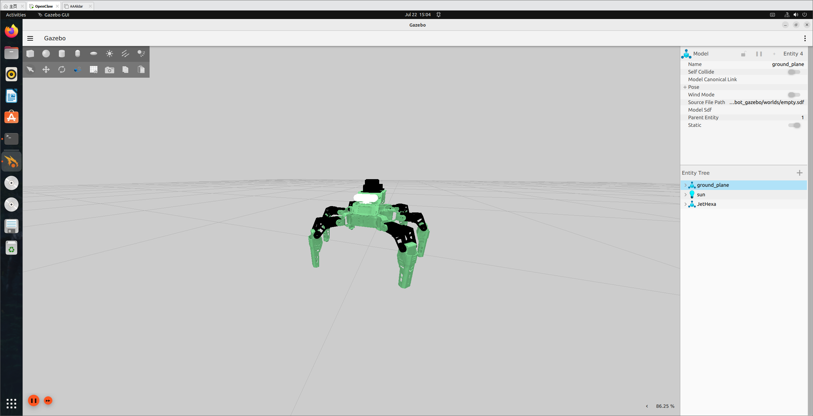

Press the shortcut keys **Ctrl+C** in the command terminal window to terminate the currently running program.

* **Shortcuts and Toolbar Overview**

This section introduces common shortcut controls and tools using mouse interactions:

(1) Left mouse button: Drags the map and selects targets in the Gazebo simulation. Press and hold the left mouse button on the ground plane to pan the view, or click on a model to select it.

(2) Middle mouse button or Shift + left mouse button: Press and hold the middle mouse button, or hold **Shift** while dragging the left mouse button, to rotate the viewpoint around the current target point.

(3) Right mouse button or mouse scroll wheel: Press and hold the right mouse button or scroll the wheel to zoom in and out at the current cursor position.

The three primary tools in the toolbar operate as follows:

(1) Selection tool : The default tool in Gazebo, used to select models.

(2) Translation tool : After selecting a model with this tool, drag along the three axes to translate the model.

(3) Rotation tool : After selecting a model with this tool, drag along the three axes to rotate the model.

For more information regarding Gazebo, visit the official website at [https://gazebosim.org/](https://gazebosim.org/).

3. Open a new terminal and enter the following command to launch keyboard teleoperation control:

```bash
ros2 run robot_gazebo teleop_key_control
```

Control the movement of the robot within the simulation interface using the teleoperation terminal window.

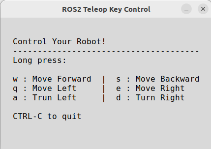
