# 12. OpenClaw Practical Course

> [!NOTE]
>
> **The robot comes pre-configured with OpenClaw and related packages from the factory. Initial operation on Jetson Orin series versions does not require copying or compiling these packages. If errors or incompatibilities occur while running applications according to the tutorial, refer to [12.1 Preparation](#p12-1) to re-import the provided backup resource files, packages, and skills into their corresponding directories, and compile them. After successful compilation, proceed with the application tutorials.**

<p id ="p12-1"></p>

## 12.1 Preparation

Before running applications, the OpenClaw resource files must be transferred to their corresponding directories.

1. Establish a remote desktop connection to the robot using **NoMachine** to access the system desktop.

2. Drag **openclaw_resource.zip** from the OpenClaw resource folder to the desktop.

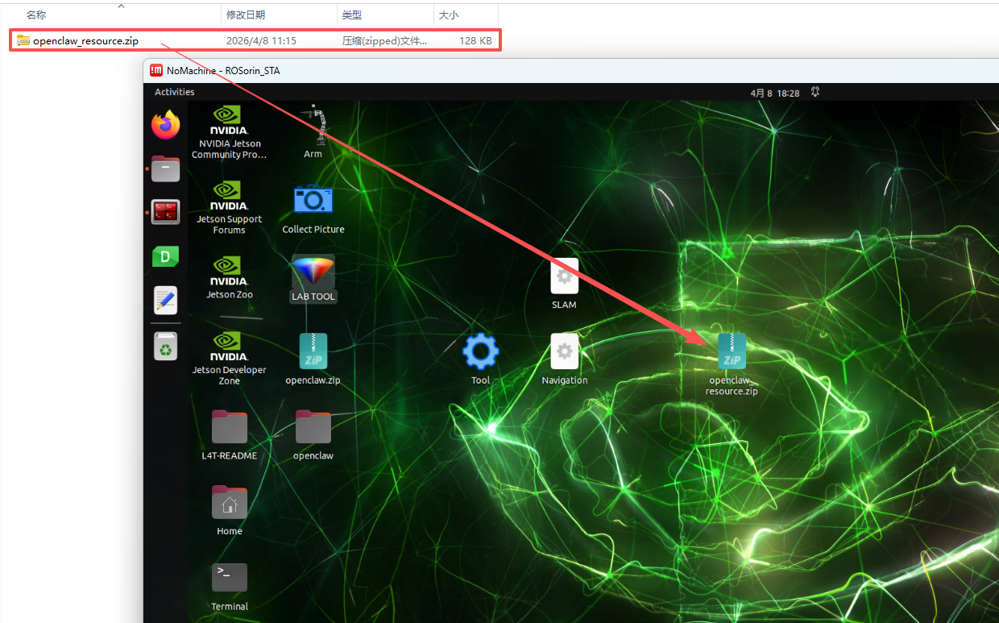

3. Click the terminal icon  on the left dock to open a terminal.

4. Enter the command to extract the archive to the current directory:

```bash
unzip ~/Desktop/openclaw_resource.zip -d .
```

5. Enter the command to switch to the extracted directory:

```bash
cd openclaw_resource
```

6. Enter the command to execute the deployment script:

```bash
zsh deploy.sh
```

7. When prompted during execution, continuously enter **y** to confirm.


8. After running the script, backups of the previous **IDENTITY.md**, **MEMORY.md**, and **skills** files are saved in the **backup.20260408_111805** folder. Use the `ls` command to inspect them.

9. Enter the following command in the terminal to navigate to the workspace and compile the **openclaw_controller** package:

```bash
cd ~/ros2_ws/ && colcon build --event-handlers console_direct+ --cmake-args -DCMAKE_BUILD_TYPE=Release --symlink-install --packages-select openclaw_controller
```

10. Once compilation is complete, enter the command to refresh the environment variables:

```bash
source ~/.zshrc
```

<p id ="p12-2"></p>

## 12.2 Obtaining and Configuring Large AI Model API Keys

Before using OpenClaw on the robot, configure the model used by the agent first. This requires obtaining an API key for the large model and filling it in the corresponding configuration file. 

OpenClaw supports multiple large AI models. If a different model is selected, obtain the corresponding API key online and add it to the configuration file.

### 12.2.1 Large Model API Key Setup

> [!NOTE]
>
> **This section requires registering on the official OpenAI website and obtaining an API key for accessing large language models.**

#### 12.2.1.1 OpenAI Account Registration and Deployment

1) Copy and open the following URL: https://platform.openai.com/docs/overview, then click the **Sign Up** button in the upper-right corner.


2) Register and log in using a Google, Microsoft, or Apple account, as prompted.

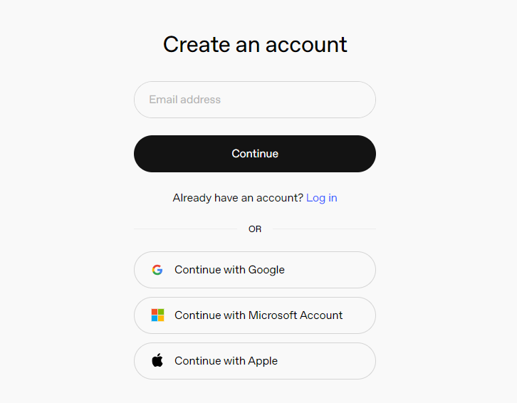

3) After logging in, click the Settings button, then go to **Billing**, and click **Payment Methods** to add a payment method. The payment is used to purchase **tokens**.

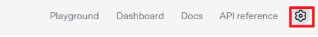

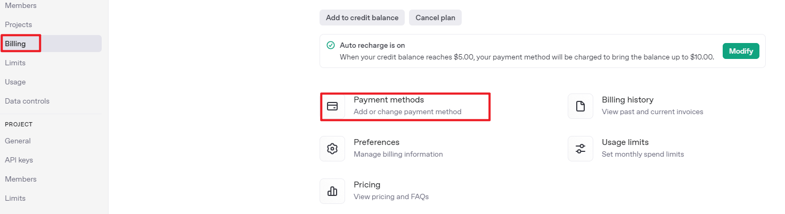

4) After completing the preparation steps, click **API Keys** and create a new key. Follow the prompts to fill in the required information, then save the key for later use.


5) The creation and deployment of the large model have been completed, and this API will be used in the following sections.

### 12.2.2 API Configuration

1. Use NoMachine to connect to the robot, then click the terminal icon  on the left side of the interface to open a terminal.

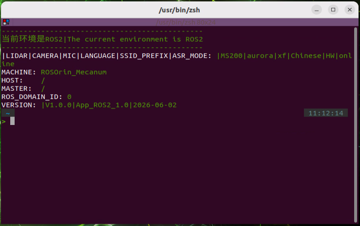

2. Enter the following command to configure OpenClaw.

```bash
openclaw config
```

3. Select **Local (this machine)** and press **Enter**.

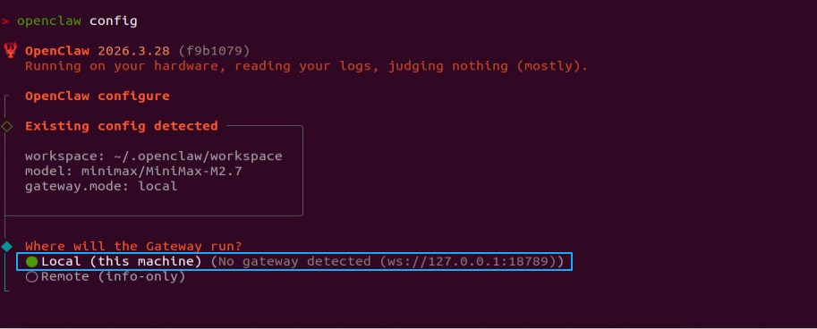

4. The model item needs to be configured here. Select **Model** and press **Enter**.


5. Select **OpenAI**, press **Enter**.


6. Select **OpenAI API key** and press **Enter**.

   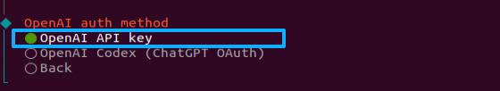

7. Paste the previously generated API key here.


8. Select **openai/gpt-5.4** or another suitable model, then press **Enter**.

   

9. This completes the model configuration.

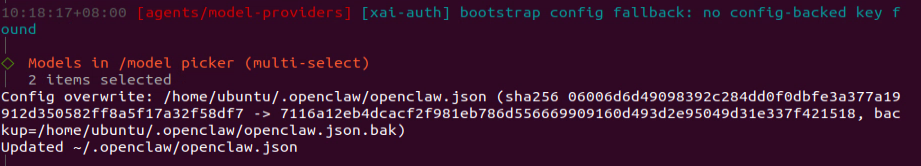

<p id ="p12-3"></p>

## 12.3 Configuring Telegram

> [!NOTE]
>
> **Telegram can be set up from either the app or Telegram Web. The steps below use Telegram Web.**

Telegram Web address: https://web.telegram.org/k/

* **Step 1: Log in to Telegram.**

Scan the QR code with the app, or log in with a phone number and verification code.

<div align="center">

</div>


* **Step 2: Search for BotFather.**

Search for **BotFather** in the search bar at the upper-left corner of Telegram, then open the officially verified account with the blue checkmark.

<div align="center">

</div>


* **Step 3: Create a bot and get the token.**

Send `/newbot` in the chat to create a Bot and get the Token. The bot username must end with `_bot`.

> [!NOTE]
>
> **A Token will be generated after the setup is complete. Save it securely and do not share it. This token will be required later in the OpenClaw configuration.**

<div align="center">
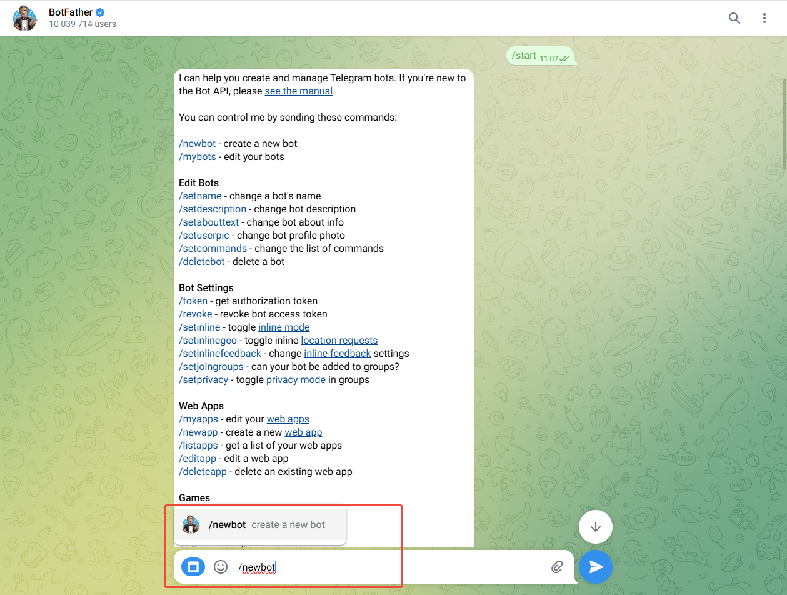
</div>


<div align="center">

</div>


* **Connect Telegram to OpenClaw through the Plugin**

After the Telegram bot is ready, configure OpenClaw from the server or local terminal.

* **Step 1**: Enable the Telegram plugin in the OpenClaw config.

```bash
openclaw config set channels.telegram.enabled true
```

<div align="center">

</div>


* **Step 2**: Add the Telegram bot Token to OpenClaw.

```powershell
openclaw config set channels.telegram.botToken "TELEGRAM_BOT_TOKEN"
```

<div align="center">

</div>


* **Step 3**: Start the OpenClaw Gateway service.

```bash
openclaw gateway
```

<div align="center">

</div>


* **Step 4**: In the BotFather chat, click the bot link shown in the message, such as **t.me/openclaw_hiwonder_bot**, to open the bot chat. Then click **START**.

> [!NOTE]
>
> `openclaw gateway` must be started before clicking **START** in Telegram. Otherwise, the pairing code will not be received.

<div align="center">
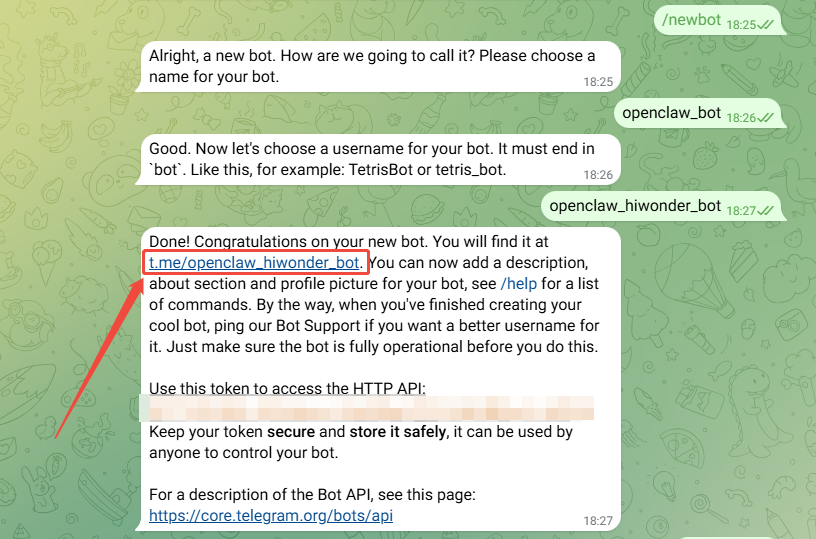
</div>


<div align="center">

</div>


* **Step 5**: During the first chat, the Telegram Bot sends a pairing code. Run the following command on the server to complete pairing.

<div align="center">
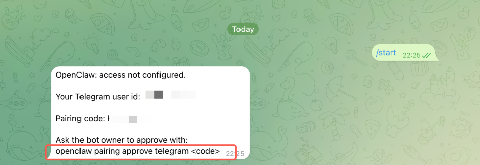
</div>


* **Step 6**: Open a new command-line terminal and run the following command. Replace `<code>` with the Pairing code received in Telegram. **Do not include the angle brackets when entering it.**

```bash
openclaw pairing approve telegram <code>
```

<div align="center">

</div>


* **Step 7**: After the command runs successfully, send a test message to the Telegram Bot, such as `hello`. If the bot replies like an AI assistant, the Telegram connection to OpenClaw is working properly.

<div align="center">

</div>


The Telegram integration for **OpenClaw** is now complete.


## 12.4 OpenClaw Basic Applications

<p id ="p12-4-1"></p>

### 12.4.1 OpenClaw Camera Feed Recognition

Once the program starts running, entering text commands enables OpenClaw to recognize the current camera feed and save captured photos locally, such as **Take a photo**, **Take a look**, or **What do you see?** OpenClaw matches tasks with skill descriptions via its built-in skills, and then subscribes to the ROS 2 camera image topic based on the instruction. After executing the task, OpenClaw invokes the configured large model via its agent to generate and return a text response.

#### 12.4.1.1 Preparation

* **Prerequisites**

Refer to [12.1 Preparation](#p12-1).

* **Configuring Large Model API Key**

Refer to [12.2 Obtaining and Configuring Large AI Model API Keys](#p12-2).

* **Configuring Telegram**

Refer to [12.3 Configuring Telegram](#p12-3).

#### 12.4.1.2 Operating Steps

> [!NOTE]
>
> * **Command inputs are strictly case-sensitive and space-sensitive.**
>
> * **The robot must be connected to the network, configured in STA (LAN) mode or connected via an Ethernet cable in AP (direct connection) mode.**

1. Click the terminal icon  on the left dock to open a terminal.

2. Enter the command to terminate the app auto-start service:

```bash
~/.stop_ros.sh
```

3. Enter the command and press **Enter** to enable robot hardware control and start the camera feed:

```bash
ros2 launch openclaw_controller robot_base_control.launch.py
```


4. Open a new terminal window, enter the following command, and press **Enter** to start the OpenClaw service. If the service is already running, skip this step.

```bash
openclaw gateway run
```

5. Open another terminal window, enter the command, and press **Enter** to launch the TUI window for sending commands:

```bash
openclaw tui
```

6. In the TUI window or the Telegram app chat interface, enter the command: **Take a photo, tell me what you see, summarize it, and tell me where it is saved.** Press **Enter** to start image recognition.

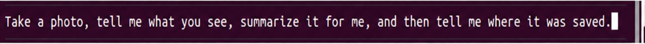

7. After a moment, OpenClaw describes the content of the current scene in text format, saves the captured image, and displays the storage path.

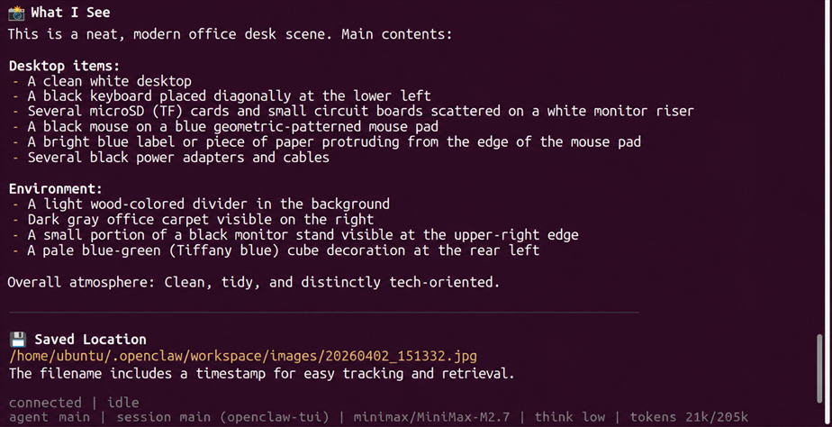

> [!NOTE]
>
> **Responses are automatically generated by the large AI model. While semantic accuracy is maintained, text phrasing and arrangement may vary.**

8. When the TUI window displays output matching the image above, the current round of dialogue interaction is complete. Enter new control commands to start the next interaction.

9. To experience other basic applications, continue entering different control commands according to the respective tutorials. To proceed to comprehensive applications, press **Ctrl+C** in the last terminal window opened in Step 5 to stop robot hardware control. If the process does not terminate immediately, press the key combination multiple times. If it still fails to exit, open a new terminal window and enter the command to clear active ROS nodes:

```bash
~/.stop_ros.sh
```

10. To shut down the OpenClaw application completely, press **Ctrl+C** in each open terminal window.

#### 12.4.1.3 Program Outcome

After the application starts, natural text commands can be sent via the TUI window or the Telegram app chat interface. OpenClaw describes the content of the current camera feed in text format.

> [!NOTE]
>
> **Actual performance varies depending on the selected large model, including command execution latency, response time, and minor discrepancies between execution results and given instructions.**

<p id ="p12-4-2"></p>

### 12.4.2 OpenClaw JetHexa Motion Control

Once the program starts running, entering text commands controls robot locomotion, such as **Move forward for 2 seconds, then turn left for 1 second.** OpenClaw matches tasks with skill descriptions via its built-in skills, and then sends messages or service calls to control JetHexa motion. After executing the task, OpenClaw invokes the configured large model via its agent to generate and return a text response.

#### 12.4.2.1 Preparation

* **Prerequisites**

Refer to [1. Tutorials/11. Large AI Model Course/11.2 Multimodal Large Model Applications](https://drive.google.com/drive/folders/1fFo3fA72xG8UAcqcdB7UyhIA6pN2Gjrq?usp=sharing) to configure the Alibaba Cloud API key.

Refer to [12.1 Preparation](#p12-1).

* **Configuring Large Model API Key**

Refer to [12.2 Obtaining and Configuring Large AI Model API Keys](#p12-2).

* **Configuring Telegram**

Refer to [12.3 Configuring Telegram](#p12-3).

#### 12.4.2.2 Operating Steps

> [!NOTE]
>
> * **Command inputs are strictly case-sensitive and space-sensitive.**
>
> * **The robot must be connected to the network, configured in STA (LAN) mode or connected via an Ethernet cable in AP direct connection mode.**

1. Click the terminal icon  on the left dock to open a terminal.

2. Enter the command to terminate the app auto-start service:

```bash
~/.stop_ros.sh
```

3. Enter the command and press **Enter** to enable robot hardware control and start the camera feed:

```bash
ros2 launch openclaw_controller robot_base_control.launch.py
```

4. Open a new terminal window, enter the command, and press **Enter** to start the OpenClaw service. If the service is already running, skip this step.

```bash
openclaw gateway run
```

5. Open another terminal window, enter the command, and press **Enter** to launch the TUI window for sending commands:

```bash
openclaw tui
```

6. In the TUI window or the Telegram app chat interface, enter the command: **Move forward 2 steps, then turn left.** Press **Enter** to control JetHexa motion.

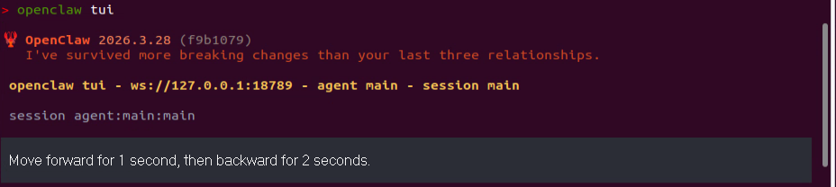

7. After a moment, JetHexa walks forward 2 steps, turns left, and stops. A text response is then generated in the TUI window.

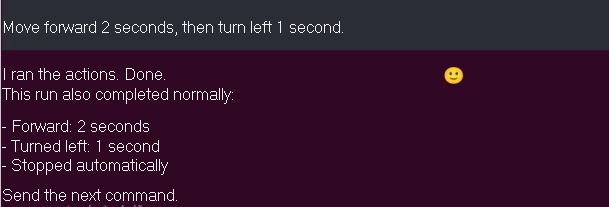

> [!NOTE]
>
> **Responses are automatically generated by the large AI model. While semantic accuracy is maintained, text phrasing and arrangement may vary.**

8. When the TUI window displays output matching the image above, the current round of dialogue interaction is complete. Enter new control commands to start the next interaction.

9. To experience other basic applications, continue entering different control commands according to the respective tutorials. To proceed to comprehensive applications, press **Ctrl+C** in the last terminal window opened in Step 5 to stop robot hardware control. If the process does not terminate immediately, press the key combination multiple times. If it still fails to exit, open a new terminal window and enter the command to clear active ROS nodes:

```bash
~/.stop_ros.sh
```

10. To shut down the OpenClaw application completely, press **Ctrl+C** in each open terminal window.

#### 12.4.2.3 Program Outcome

After the application starts, natural text commands can be sent via the TUI window or the Telegram app chat interface to control the robot to move forward, move backward, turn left, turn right, and stop.

> [!NOTE]
>
> **Actual performance varies depending on the selected large model, including command execution latency, response time, and minor discrepancies between execution results and given instructions.**

#### 12.4.2.4 Program Analysis

Program path:

**/home/ubuntu/.openclaw/workspace/skills/ros2-bot-control/scripts/execute_actions.py**

1. The program reads an action sequence in JSON format from the command line. Each action is represented by `[x, y, z, t]`, where `x` and `y` represent linear velocities along the forward and lateral directions, `z` represents rotational angular velocity, and `t` denotes action duration. Once parsing finishes, a ROS 2 node is created to execute the actions sequentially.

```py
def main(args=None):
    parser = argparse.ArgumentParser(description='Execute action sequence / 执行动作序列')
    parser.add_argument('--actions', '-a', type=str, required=True, help='JSON format action list, e.g. "[[0.15, 0, 0, 2], [0, 0, 0, 0]]" / JSON 格式的动作列表，如 "[[0.15, 0, 0, 2], [0, 0, 0, 0]]"')
    parser.add_argument('--topic', type=str, default='/controller/cmd_vel', help='cmd_vel topic / cmd_vel话题')

    parsed_args, _ = parser.parse_known_args(args)

    # Parse JSON / 解析 JSON
    try:
        action_list = json.loads(parsed_args.actions)
    except json.JSONDecodeError:
        print(f"JSON parse failed / JSON 解析失败: {parsed_args.actions}")
        return

    print(f"Executing actions / 执行动作: {action_list}")

    # Execute / 执行
    rclpy.init()
    node = ActionExecutor(parsed_args.topic)
    node.execute(action_list)
    node.destroy_node()
    rclpy.shutdown()
```

2. The `ActionExecutor` class creates the `/controller/cmd_vel` velocity publisher while retaining publishers for gait and action groups. The `stop_all()` method clears velocities and interrupts chassis gaits and action sets, ensuring that the robot stops once the action sequence concludes.

```py
class ActionExecutor(Node):
    def __init__(self, topic_name='/controller/cmd_vel'):
        super().__init__('action_executor')
        self.topic_name = topic_name
        self.cmd_vel_pub = self.create_publisher(Twist, topic_name, 10)
        self.traveling_pub = self.create_publisher(Traveling, '/controller/traveling', 10)
        self.actionset_pub = self.create_publisher(RunActionSet, '/controller/run_actionset', 10)
        self.get_logger().info(f'Initialized, publishing to {topic_name} / 初始化完成，发布到 {topic_name}')

    def stop(self):
        """Send stop command / 发送停止命令"""
        twist = Twist()
        self.cmd_vel_pub.publish(twist)

    def stop_all(self):
        # 1. Clear velocity command / 清零速度
        self.stop()

        # 2. Stop gait movement / 停止底盘步态
        traveling = Traveling()
        traveling.gait = 0
        traveling.stride = 0.0
        traveling.height = 0.0
        traveling.direction = 0.0
        traveling.rotation = 0.0
        traveling.time = 1.0
        traveling.steps = 0
        traveling.relative_height = False
        traveling.interrupt = True
        self.traveling_pub.publish(traveling)

        # 3. Stop action set / 停止动作组
        action = RunActionSet()
        action.action_path = 'stop'
        action.interrupt = True
        self.actionset_pub.publish(action)

        for _ in range(3):
            rclpy.spin_once(self, timeout_sec=0.05)
            self.stop()
            self.actionset_pub.publish(action)
            self.traveling_pub.publish(traveling)
```

3. During action execution, the program writes action parameters into a `Twist` message and publishes it continuously for the specified duration. An all-zero action represents a pause or immediate stop. Once all actions are executed, `stop_all()` is called uniformly to prevent the chassis from continuing its movement.

```py
    def execute(self, action_list):
        """Execute action sequence / 执行动作序列"""
        for action in action_list:
            x, y, z, t = action

            # If it's stop/pause command (x=y=z=0) / 如果是停止/暂停指令 (x=y=z=0)
            if x == 0 and y == 0 and z == 0:
                # t > 0 means pause, t = 0 means immediate stop / t > 0 表示暂停，t = 0 表示立即停止
                if t > 0:
                    self.get_logger().info(f'Pausing / 暂停: t={t}s')
                    start_time = self.get_clock().now()
                    timeout_duration = rclpy.duration.Duration(seconds=float(t))
                    while rclpy.ok():
                        self.stop()
                        rclpy.spin_once(self, timeout_sec=0.05)
                        elapsed = self.get_clock().now() - start_time
                        if elapsed > timeout_duration:
                            break
                else:
                    self.stop_all()
                continue

            twist = Twist()
            twist.linear.x = float(x)
            twist.linear.y = float(y)
            twist.linear.z = 0.0
            twist.angular.x = 0.0
            twist.angular.y = 0.0
            twist.angular.z = float(z)

            self.get_logger().info(f'Executing / 执行: x={x}, y={y}, z={z}, t={t}s')

            # Keep publishing / 持续发布
            start_time = self.get_clock().now()
            timeout_duration = rclpy.duration.Duration(seconds=float(t))
            while rclpy.ok():
                self.cmd_vel_pub.publish(twist)
                rclpy.spin_once(self, timeout_sec=0.05)
                elapsed = self.get_clock().now() - start_time
                if elapsed > timeout_duration:
                    break

            # Brief pause / 短暂停顿
            rclpy.spin_once(self, timeout_sec=0.2)

        # Final stop / 最后停止
        self.stop_all()
        self.get_logger().info('Action sequence completed, stopped / 动作序列执行完成，已停止')
```

<p id ="p12-5"></p>

## 12.5 OpenClaw Comprehensive Applications

<p id ="p12-5-2"></p>

### 12.5.2 OpenClaw + Smart Assistant

Once the program starts running, entering text commands controls robot locomotion and handles daily conversational scenarios, such as **Take me to the zoo to see what animals are there**, **How is the weather today? Is anyone playing soccer?**, or **I am very thirsty, go buy a bottle of water.** OpenClaw matches tasks with skill descriptions via its built-in skills, and then sends messages or service calls to complete the tasks. After executing the task, OpenClaw invokes the configured large model via its agent to generate and return a text response.

#### 12.5.3.1 Preparation

* **Prerequisites**

Refer to [12.1 Preparation](#p12-1).

Refer to [1. Tutorials/5. Mapping and Navigation Course/5.1 Mapping Tutorial](https://drive.google.com/drive/folders/1fFo3fA72xG8UAcqcdB7UyhIA6pN2Gjrq?usp=sharing) to build a map.

* **Configuring Large Model API Key**

Refer to [12.2 Obtaining and Configuring Large AI Model API Keys](#p12-2).

* **Configuring Telegram**

Refer to [12.3 Configuring Telegram](#p12-3).

<p id ="p12-5-3-2"></p>

#### 12.5.3.2 Operating Steps

> [!NOTE]
>
> * **Command inputs are strictly case-sensitive and space-sensitive.**
>
> * **The robot must be connected to the network, configured in STA (LAN) mode or connected via an Ethernet cable in AP (direct connection) mode.**

1. Click the terminal icon  on the left dock to open a terminal.

2. Enter the command to terminate the app auto-start service:

```bash
~/.stop_ros.sh
```

3. Enter the command and press **Enter** to enable robot hardware navigation and launch the **RViz** tool:

```bash
ros2 launch openclaw_controller navigation_manager.launch.py
```

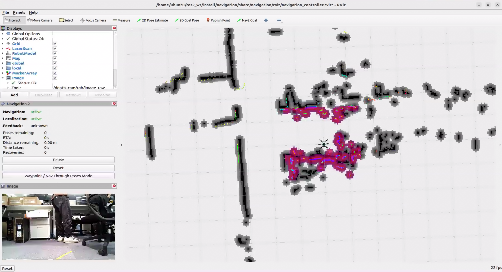

4. Open a new terminal window, enter the command, and press **Enter** to start the OpenClaw service. If the service is already running, skip this step.

```bash
openclaw gateway run
```

5. Open another terminal window, enter the command, and press **Enter** to launch the TUI window for sending commands:

```bash
openclaw tui
```

6. In the TUI window or the Telegram app chat interface, enter the command: **Take me to the zoo to see what items are there, and summarize them for me.** Press **Enter** to initiate robot navigation.

7. After a moment, the robot navigates to the target point, observes the scene ahead, and generates a text response in the TUI window.

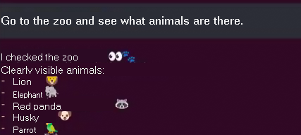

> [!NOTE]
>
> **Responses are automatically generated by the large AI model. While semantic accuracy is maintained, text phrasing and arrangement may vary.**

8. When the TUI window displays output matching the image above, the current round of dialogue interaction is complete. Enter new control commands to start the next interaction.

9. To experience other basic applications, continue entering different control commands according to the respective tutorials. To proceed to comprehensive applications, press **Ctrl+C** in the last terminal window opened in Step 5 to stop robot hardware control. If the process does not terminate immediately, press the key combination multiple times. If it still fails to exit, open a new terminal window and enter the command to clear active ROS nodes:

```bash
~/.stop_ros.sh
```

10. To shut down the OpenClaw application completely, press **Ctrl+C** in each open terminal window.

#### 12.5.3.3 Program Outcome

After the application starts, natural text commands can be sent via the TUI window or the Telegram app chat interface to navigate the robot and capture photos for scene recognition.

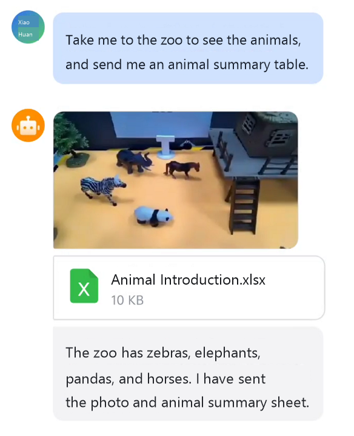

> [!NOTE]
>
> **Actual performance varies depending on the selected large model, including command execution latency, response time, and minor discrepancies between execution results and given instructions.**

#### 12.5.3.4 Navigation Point Modification

1. Click the terminal icon  on the left dock to open a terminal.

2. Enter the command to navigate to the target directory:

```bash
cd ros2_ws/src/openclaw_controller/config
```

3. Enter the command to edit the YAML configuration file:

```bash
gedit navigation_position.yaml
```

4. Modify the values for the coordinate points `x`, `y`, and `yaw` as required.

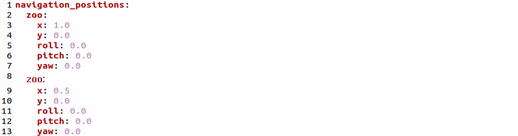

5. After making modifications, press **Ctrl+S** to save the file and exit the editor. Then follow [12.5.3.2 Operating Steps](#p12-5-3-2) to rerun the application.

6. When adding new navigation points, add them to the **navigation_position.yaml** file following the same format.
