# 2.1 Basic Motion Control

### 2.1.1 Gait Overview

* **Gait Concept**

Robot gait describes the periodic locomotion phenomenon observed in animals and refers to the coordinated movement sequence and trajectory of each robot leg. It serves as a vital factor in ensuring the stable operation of a legged mechanism. Research into gaits primarily aims to achieve stable periodic locomotion for legged robots.

In everyday terms, gait describes how animals walk. Common gait patterns observed in hexapod insects include the tripod gait and ripple gait.

**Tripod Gait**: Three legs alternate with the other three legs to support the body. Specifically, when the left front leg touches the ground, the right rear leg and left rear leg contact the ground simultaneously, followed by the right front leg. This gait ensures stability during movement and minimizes energy consumption.

**Ripple Gait**: All six legs contact the ground in a phased rhythmic sequence. Specifically, when the left front leg contacts the ground, the other five legs follow in sequence with specified phase delays. This gait enhances movement speed, smoothness, and body coordination across varied terrain.

The table below lists common terminology used in gait analysis:

| Term | Description |
| :--- | :--- |
| Phase | Represents the angular position or relative state within a cyclic motion. |
| Phase difference | Describes the advance or lag in motion between different legs. |
| Swing phase | Refers to the state where a leg is lifted and suspended in the air. |
| Stance phase | Refers to the state where a leg contacts the ground and supports the body. |
| Cycle | Describes the complete motion sequence from the touch-down of one foot to its subsequent touch-down during locomotion. |
| Gait frequency | Indicates the number of gait cycles completed per unit of time. |
| Step length | Represents the distance traveled by the foot tip from lifting off to touching down within a single cycle. |
| Stride length | Represents the total displacement of the robot chassis within a single cycle. |
| Duty cycle | Indicates the ratio of the duration a single leg spends in the stance phase to the total gait cycle duration. |

## 2.2 Tripod Gait

### 2.2.1 Tripod Gait Overview

The tripod gait is a classic locomotion method for hexapod walking robots. When hexapod insects walk, all six legs do not move forward in a straight line simultaneously. Instead, the three pairs of legs are divided into two alternating triangular support structures that advance in sequence. In simple terms, two groups of three legs alternate lifting and lowering.

Under this triangular support structure, the chassis maintains static stability at all times.

In tripod gait, each leg swings according to a specific sequence. Typically, three legs swing forward during a step while the other three legs push backward in contact with the ground. This gait helps the robot maintain equilibrium and traverse uneven terrain effectively.

Key advantages of the tripod gait for hexapod robots include:

1. High stability: Because three legs always support the body while forming a stable support polygon, the robot resists tipping over and maintains equilibrium. This enables the hexapod robot to perform reliably on uneven terrain.

2. Strong adaptability: Tripod gait allows the robot to adapt flexibly to varying terrain and environmental conditions. Because the foot trajectories form triangular support bases, the robot can negotiate obstacles and climb slopes with ease.

3. Exceptional agility: The tripod gait enables rapid direction and speed changes. This allows the robot to respond quickly in dynamic scenarios, such as obstacle avoidance and target tracking in confined spaces.

The diagrams below illustrate the four phases of the tripod gait cycle:


As shown in Phase A, legs 1, 3, and 5 lift and swing forward, while legs 2, 4, and 6 remain on the ground to support the chassis, ensuring that the center of gravity of the robot stays within the diagonal support polygon. At this moment, legs 1, 3, and 5 are in the swing phase, and legs 2, 4, and 6 are in the stance phase.

As shown in Phase B, all six legs contact the ground simultaneously. Legs 2, 4, and 6 maintain their positions, while legs 1, 3, and 5 land in forward positions. All six legs are in the stance phase.

As shown in Phase C, legs 2, 4, and 6 lift and swing forward, while legs 1, 3, and 5 support the chassis, ensuring that the center of gravity remains within the diagonal support polygon. At this moment, legs 2, 4, and 6 are in the swing phase, and legs 1, 3, and 5 are in the stance phase.

As shown in Phase D, all six legs contact the ground simultaneously. Legs 1, 3, and 5 maintain their positions, while legs 2, 4, and 6 land in forward positions. All six legs are in the stance phase.

Completing the four phases, Phase A through Phase D, constitutes one full motion cycle for JetHexa.

### 2.2.2 Operating Steps

> [!NOTE]
>
> **Terminal commands are strictly case-sensitive. Press Tab to auto-complete keywords.**

1. Power on the robot and connect to the remote desktop software **NoMachine**.

2. Click the desktop icon  to open the command-line terminal.

3. Enter the command below and press **Enter** to disable auto-start services:

```bash
~/.stop_ros.sh
```

4. Enter the command below and press **Enter** to navigate to the source code directory:

```bash
cd ros2_ws/src/example/example/body_control/include
```

5. Enter the command below and press **Enter** to open the source file:

```bash
vim tripod_gait.py
```

6. Locate the code segment shown below:

```py
def main(args=None):
    rclpy.init(args=args)
    node = TripodGait()

    node.move(gait=2)   # Move forward
    node.get_logger().info('\033[1;32m%s\033[0m' % 'forward')
    time.sleep(5)  # Wait for 5 seconds
    node.move(gait=0)     # Stop
    node.get_logger().info('\033[1;32m%s\033[0m' % 'stop')

    node.controller.destroy_node()  # Clean up node
    rclpy.shutdown()  # Shut down ROS 2
```

The parameter `gait` specifies the gait mode, where 0 indicates stop, 1 indicates ripple gait, and 2 indicates tripod gait. Ensure that `gait` is set to 2 to operate in tripod gait mode.

7. After editing, press **Esc**, type `:wq`, and press **Enter** to save the changes and exit:

```
:wq
```

8. Enter the command below and press **Enter** to launch the program:

```bash
ros2 launch example tripod_gait.launch.py
```

9. To terminate the program, press **Ctrl+C**.

### 2.2.3 Program Outcome

After launching the program, JetHexa operates in tripod gait, advancing forward with two alternating groups of three legs for 5 s before stopping.

### 2.2.4 Program Analysis

The source code is located at: **/home/ubuntu/ros2_ws/src/example/example/body_control/include/tripod_gait.py**

```py
class TripodGait(Node):
    def __init__(self):
        super().__init__('tripod_gait')
        self.controller = ControllerClient()
        self.client = self.create_client(Trigger, '/controller_manager/init_finish')
        self.client.wait_for_service()

    def move(
        self,
        gait=1,              # Gait type: 0 for stop, 1 for ripple gait, 2 for tripod gait
        stride=40.0,         # Stride length (mm), default is 40 mm, range: 0–65
        height=15.0,         # Step height (mm), default is 15 mm, range: 0–50
        direction=0,         # Movement direction (degrees), range: 0°–360°, 0° for forward, increasing counterclockwise
        rotation=0.0,        # Rotation rate, default is no rotation; positive for counterclockwise, negative for clockwise
        time=1,              # Single step duration (seconds), default is 1 s
        steps=0,             # Number of steps, 0 indicates continuous motion
        interrupt=True,      # Whether interruption by new commands is allowed, default is True
        relative_height=False # Whether height is relative to the ground, default is absolute height
    ):
        """Method to control robot movement

        Args:
            gait (int): Gait type (e.g., 1 = ripple gait)
            stride (float): Stride length (mm)
            height (float): Leg lifting height (mm)
            direction (float): Movement direction (0 = forward, 180 = backward)
            rotation (float): Rotation angle (positive for turn right, negative for turn left)
            time (float): Execution time for a single step (seconds)
            steps (int): Number of movement steps (0 = continuous)
            interrupt (bool): Whether to allow interruption by new commands
            relative_height (bool): Whether height is relative
        """
        self.controller.traveling(
            gait=gait,
            stride=stride,
            height=height,
            direction=direction,
            rotation=rotation,
            time=time,
            steps=steps,
            interrupt=interrupt,
            relative_height=relative_height
        )
```

The program controls robot motion primarily by configuring the parameters of the `move` function:

* `gait`: Specifies the gait mode. A value of `0` stops motion, `1` selects ripple gait, and `2` selects tripod gait.
* `stride`: Sets the stride length in millimeters. The default range is 0–65 mm. Values outside this range may cause the robot to stall or stumble.
* `height`: Sets the step height in millimeters. The default range is 0–50 mm. Values outside this range may cause the robot to stall or stumble.
* `direction`: Sets the movement direction in degrees, with a range of 0°–360°. A value between 0° and 180° moves the robot forward, while a value between 180° and 360° moves the robot backward.
* `rotation`: Sets the turning rate in radians per second. A positive value rotates the robot counterclockwise, and a negative value rotates the robot clockwise.
* `time`: Sets the time interval for each individual step in seconds.
* `steps`: Sets the number of movement steps. A value of `0` indicates continuous movement.
* `interrupt`: Sets whether new commands can interrupt the ongoing execution.
* `relative_height`: Specifies whether the step height parameter `height` is relative to the ground. A value of `False` uses relative height.

## 2.3 Ripple Gait

### 2.3.1 Ripple Gait Overview

The ripple gait, also known as wave gait, provides smooth continuous locomotion. The term ripple gait is used consistently throughout the subsequent documentation.

In ripple gait, the six legs of the hexapod robot swing in a coordinated sequence, generating a wave-like trajectory. This gait enables stable locomotion across varied terrain and environments while improving walking efficiency and smoothness.

During ripple gait locomotion, each leg swings according to a specific rhythm and sequence. In each step, forward legs advance while rear legs push backward, producing undulating dynamics. This gait helps the robot maintain equilibrium and traverse undulating ground.

Key advantages of the ripple gait for hexapod robots include:

1. High stability: Because multiple legs contact the ground simultaneously, the robot resists tipping over and maintains balance on uneven surfaces.

2. High efficiency: The ripple gait adapts effectively to terrain contours, reducing energy expenditure. The wave-like foot trajectory facilitates overcoming obstacles and climbing slopes.

3. Exceptional agility: The ripple gait enables smooth changes in heading and velocity, enhancing robot responsiveness during obstacle avoidance and target tracking in confined spaces.

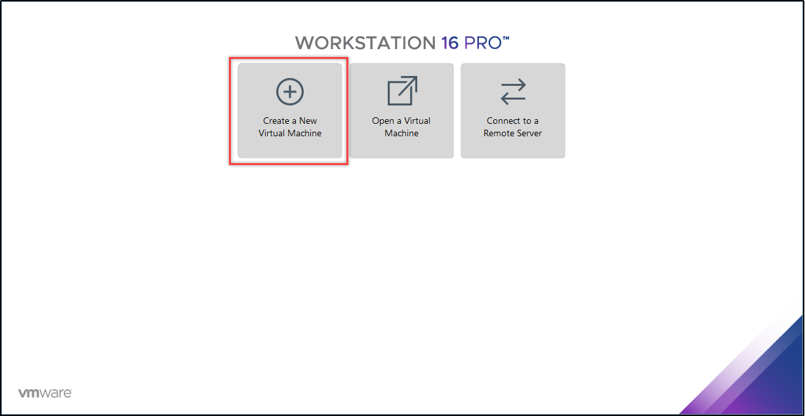

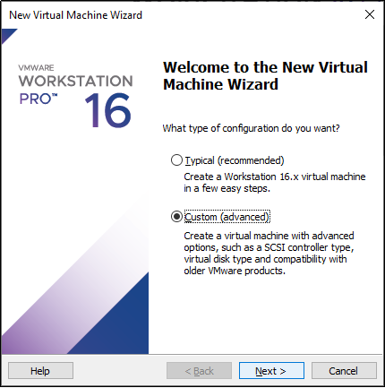

When JetHexa operates in ripple gait, each pair of opposing legs acts alternately. The ripple gait sequence is analyzed below:

As shown in Phase A, legs 2 and 4 lift and swing forward, while legs 1, 3, 5, and 6 support the chassis, ensuring that the center of gravity of the robot stays within the diagonal intersection. At this moment, legs 2 and 4 are in the swing phase, and legs 1, 3, 5, and 6 are in the stance phase.

As shown in Phase B, legs 3 and 6 lift and swing forward, while legs 1, 2, 4, and 5 support the chassis, ensuring that the center of gravity remains centered. At this moment, legs 3 and 6 are in the swing phase, and legs 1, 2, 4, and 5 are in the stance phase.

As shown in Phase C, legs 1 and 5 lift and swing forward, while legs 2, 3, 4, and 6 support the chassis, maintaining balance. At this moment, legs 1 and 5 are in the swing phase, and legs 2, 3, 4, and 6 are in the stance phase.

As shown in Phase D, legs 2 and 6 lift and swing forward, while legs 1, 3, 4, and 5 support the chassis, maintaining stability. At this moment, legs 2 and 6 are in the swing phase, and legs 1, 3, 4, and 5 are in the stance phase.

### 2.3.2 Operating Steps

1. Power on the robot and connect to the remote desktop software **NoMachine**.

2. Click the desktop icon  to open the command-line terminal.

3. Enter the command below and press **Enter** to disable auto-start services:

```bash
~/.stop_ros.sh
```

4. Enter the command below and press **Enter** to navigate to the source code directory:

```bash
cd ros2_ws/src/example/example/body_control/include
```

5. Enter the command below and press **Enter** to open the source file:

```bash
vim tripod_gait.py
```

6. Locate the code segment shown below:

```py
def main(args=None):
    rclpy.init(args=args)
    node = TripodGait()

    node.move(gait=1)   # Move forward
    node.get_logger().info('\033[1;32m%s\033[0m' % 'forward')
    time.sleep(5)  # Wait for 5 seconds
    node.move(gait=0)     # Stop
    node.get_logger().info('\033[1;32m%s\033[0m' % 'stop')

    node.controller.destroy_node()  # Clean up node
    rclpy.shutdown()  # Shut down ROS 2
```

The parameter `gait` specifies the gait mode, where 0 indicates stop, 1 indicates ripple gait, and 2 indicates tripod gait. Ensure that `gait` is set to 1 to operate in ripple gait mode.

7. After editing, press **Esc**, type `:wq`, and press **Enter** to save the changes and exit:

```
:wq
```

8. Enter the command below and press **Enter** to launch the program:

```bash
ros2 launch example tripod_gait.launch.py
```

9. To terminate the program, press **Ctrl+C**.

### 2.3.3 Program Outcome

After launching the program, JetHexa advances forward in ripple gait for 5 s before stopping.

### 2.3.4 Program Analysis

The source code is located at: **/home/ubuntu/ros2_ws/src/example/example/body_control/include/tripod_gait.py**

```py
class TripodGait(Node):
    def __init__(self):
        super().__init__('tripod_gait')
        self.controller = ControllerClient()
        self.client = self.create_client(Trigger, '/controller_manager/init_finish')
        self.client.wait_for_service()

    def move(
        self,
        gait=1,              # Gait type: 0 for stop, 1 for ripple gait, 2 for tripod gait
        stride=40.0,         # Stride length (mm), default is 40 mm, range: 0–65
        height=15.0,         # Step height (mm), default is 15 mm, range: 0–50
        direction=0,         # Movement direction (degrees), range: 0°–360°, 0° for forward, increasing counterclockwise
        rotation=0.0,        # Rotation rate, default is no rotation; positive for counterclockwise, negative for clockwise
        time=1,              # Single step duration (seconds), default is 1 s
        steps=0,             # Number of steps, 0 indicates continuous motion
        interrupt=True,      # Whether interruption by new commands is allowed, default is True
        relative_height=False # Whether height is relative to the ground, default is absolute height
    ):
        """Method to control robot movement

        Args:
            gait (int): Gait type (e.g., 1 = ripple gait)
            stride (float): Stride length (mm)
            height (float): Leg lifting height (mm)
            direction (float): Movement direction (0 = forward, 180 = backward)
            rotation (float): Rotation angle (positive for turn right, negative for turn left)
            time (float): Execution time for a single step (seconds)
            steps (int): Number of movement steps (0 = continuous)
            interrupt (bool): Whether to allow interruption by new commands
            relative_height (bool): Whether height is relative
        """
        self.controller.traveling(
            gait=gait,
            stride=stride,
            height=height,
            direction=direction,
            rotation=rotation,
            time=time,
            steps=steps,
            interrupt=interrupt,
            relative_height=relative_height
        )
```

The program controls robot motion primarily by configuring the parameters of the `move` function:

* `gait`: Specifies the gait mode. A value of `0` stops motion, `1` selects ripple gait, and `2` selects tripod gait.
* `stride`: Sets the stride length in millimeters. The default range is 0–65 mm. Values outside this range may cause the robot to stall or stumble.
* `height`: Sets the step height in millimeters. The default range is 0–50 mm. Values outside this range may cause the robot to stall or stumble.
* `direction`: Sets the movement direction in degrees, with a range of 0°–360°. A value between 0° and 180° moves the robot forward, while a value between 180° and 360° moves the robot backward.
* `rotation`: Sets the turning rate in radians per second. A positive value rotates the robot counterclockwise, and a negative value rotates the robot clockwise.
* `time`: Sets the time interval for each individual step in seconds.
* `steps`: Sets the number of movement steps. A value of `0` indicates continuous movement.
* `interrupt`: Sets whether new commands can interrupt the ongoing execution.
* `relative_height`: Specifies whether the step height parameter `height` is relative to the ground. A value of `False` uses relative height.

## 2.4 Straight Walking and Turning

### 2.4.1 Overview

This section explores forward movement and turning based on the ripple gait. By modifying configuration parameters, JetHexa executes forward movement and turning in ripple gait.

### 2.4.2 Operating Steps

> [!NOTE]
>
> **Terminal commands are strictly case-sensitive. Press Tab to auto-complete keywords.**

1. Power on the robot and connect to the remote desktop software **NoMachine**.

2. Click the desktop icon 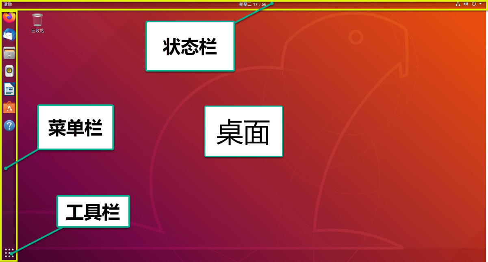 to open the command-line terminal.

3. Enter the command below and press **Enter** to disable auto-start services:

```bash
~/.stop_ros.sh
```

4. Enter the command below and press **Enter** to launch the program:

```bash
ros2 launch example forward_and_rorate.launch.py
```

5. To terminate this program, press **Ctrl+C** in the terminal window. If termination fails, repeat the key combination.

### 2.4.3 Program Outcome

JetHexa operates in ripple gait, moving forward for 5 s, turning counterclockwise at 0.5 rad/s for 5 s, and then stopping.

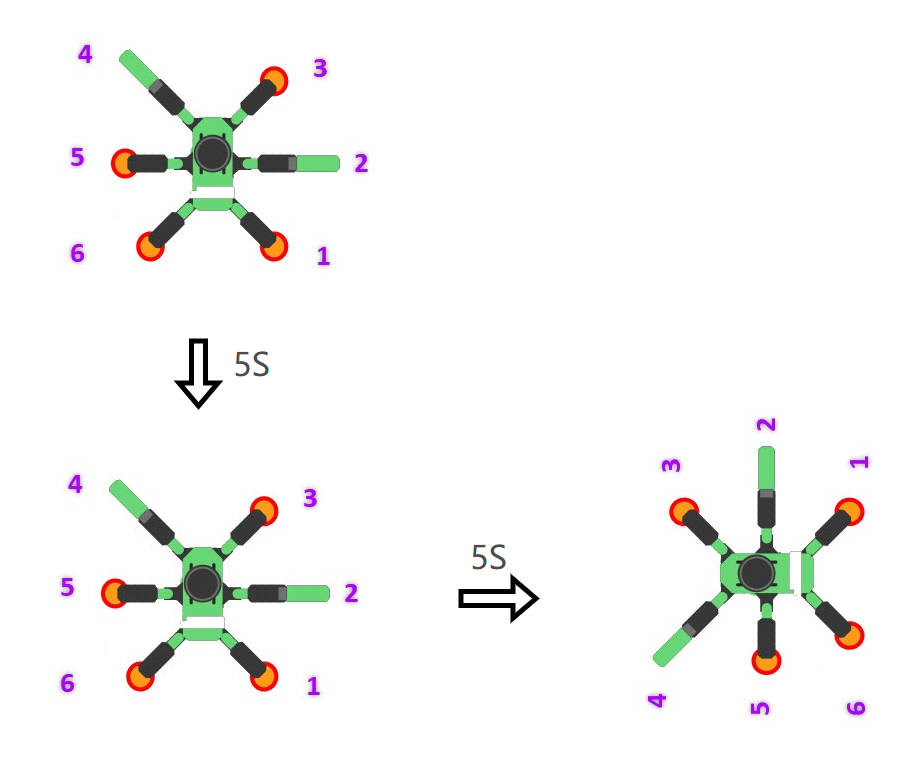

### 2.4.4 Program Analysis

* **Launch File Analysis**

The launch file is located at: **/home/ubuntu/ros2_ws/src/example/example/body_control/forward_and_rorate.launch.py**

1. Import required libraries:

```py
import os
from ament_index_python.packages import get_package_share_directory

from launch_ros.actions import Node
from launch import LaunchDescription, LaunchService
from launch.actions import  OpaqueFunction, IncludeLaunchDescription
from launch.launch_description_sources import PythonLaunchDescriptionSource
```

2. Define the launch elements, retrieve the path to the **controller** package, and launch **controller.launch.py**. Create the ROS 2 node **forward_and_rorate_node**, specify the executable, and return the launch list:

```py
def launch_setup(context):
    compiled = os.environ['need_compile']
    if compiled == 'True':
        controller_package_path = get_package_share_directory('controller')
    else:
        controller_package_path = '/home/ubuntu/ros2_ws/src/driver/controller'

    controller_launch = IncludeLaunchDescription(
        PythonLaunchDescriptionSource(
            os.path.join(controller_package_path, 'launch/controller.launch.py')),
    )
    forward_and_rorate_node = Node(
        package='example',
        executable='forward_and_rorate',
        output='screen',
    )

    return [
            controller_launch,
            forward_and_rorate_node,
            ]
```

3. Declare the entry function of the ROS 2 launch file to define the items to start:

```py
def generate_launch_description():
    return LaunchDescription([
        OpaqueFunction(function = launch_setup)
    ])
```

4. Instantiate `LaunchService` and execute the launch description:

```py
if __name__ == '__main__':
    # Create a LaunchDescription object
    ld = generate_launch_description()

    ls = LaunchService()
    ls.include_launch_description(ld)
    ls.run()
```

* **Python Source Code Analysis**

The source code is located at: **/home/ubuntu/ros2_ws/src/example/example/body_control/include/forward_and_rorate.py**

```py
def main(args=None):
    rclpy.init(args=args)
    node = ForwardAndRorate()

    node.move(gait=1)   # Move forward
    node.get_logger().info('\033[1;32m%s\033[0m' % 'forward')
    time.sleep(5)  # Wait for 5 seconds
    node.move(gait=1, rotation=0.5)  # Turn
    node.get_logger().info('\033[1;32m%s\033[0m' % 'rorate')
    time.sleep(5)  # Wait for 5 seconds
    node.move(gait=0) # Stop
    node.get_logger().info('\033[1;32m%s\033[0m' % 'stop')

    node.controller.destroy_node()  # Clean up node
    rclpy.shutdown()  # Shut down ROS 2
```

1. Motion parameter adjustment:

Configuring parameters allows adjusting attributes such as velocity and direction during forward movement and turning:

```py
def move(
        self,
        gait=1,              # Gait type: 0 for stop, 1 for tripod gait, 2 for ripple gait
        stride=40.0,         # Stride length (mm), default is 40 mm, range: 0–65
        height=15.0,         # Step height (mm), default is 15 mm, range: 0–50
        direction=180,       # Movement direction (degrees), range: 0°–360°, 0° for forward, increasing counterclockwise
        rotation=0.0,        # Rotation rate, default is no rotation; positive for counterclockwise, negative for clockwise
        time=1,              # Single step duration (seconds), default is 1 s
        steps=0,             # Number of steps, 0 indicates continuous motion
        interrupt=True,      # Whether interruption by new commands is allowed, default is True
        relative_height=False # Whether height is relative to the ground, default is absolute height
    )
```

The program controls motion primarily through the `move` function parameters:

* `gait`: Specifies the gait mode. A value of `0` indicates stop, `1` indicates ripple gait, and `2` indicates tripod gait.
* `stride`: Sets the stride length in millimeters. The default range is 0–65 mm. Values exceeding this range may cause the robot to stall or stumble.
* `height`: Sets the step height in millimeters. The default range is 0–50 mm. Values exceeding this range may cause the robot to stall or stumble.
* `direction`: Sets the movement direction in degrees, with a range of 0°–360°. A value between 0° and 180° moves the robot forward, while a value between 180° and 360° moves the robot backward.
* `rotation`: Sets the turning rate in radians per second. A positive value rotates the robot counterclockwise, and a negative value rotates the robot clockwise.
* `time`: Sets the time interval for each individual step in seconds.
* `steps`: Sets the number of movement steps. A value of `0` indicates continuous movement.
* `interrupt`: Sets whether new commands can interrupt execution.
* `relative_height`: Specifies whether the step height parameter `height` is relative to the ground. A value of `False` uses relative height.

2. Basic configuration:

Configuring the parameters adjusts the duration of forward movement and turning:

```py
    node.move(gait=1)   # Move forward
    node.get_logger().info('\033[1;32m%s\033[0m' % 'forward')
    time.sleep(5)  # Wait for 5 seconds
    node.move(gait=1, rotation=0.5)  # Turn
    node.get_logger().info('\033[1;32m%s\033[0m' % 'rorate')
    time.sleep(5)  # Wait for 5 seconds
    node.move(gait=0) # Stop
    node.get_logger().info('\033[1;32m%s\033[0m' % 'stop')
```

The sequence of motion states executes forward movement `forward`, then turning `rotate`, and finally stopping `stop`. The `sleep` function between each state sets the duration of the current state, with the function parameter specified in seconds.

## 2.5 Lateral Translation

### 2.5.1 Overview

This section explores lateral translation based on the ripple gait. By modifying configuration parameters, JetHexa translates left and right in ripple gait.

### 2.5.2 Operating Steps

> [!NOTE]
>
> **Terminal commands are strictly case-sensitive. Press Tab to auto-complete keywords.**

1. Power on the robot and connect to the remote desktop software **NoMachine**.

2. Click the desktop icon 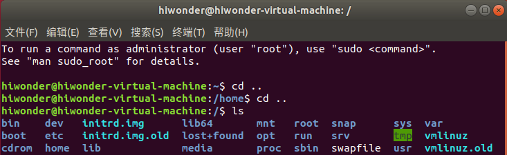 to open the command-line terminal.

3. Enter the command below and press **Enter** to disable auto-start services:

```bash
~/.stop_ros.sh
```

4. Enter the command below and press **Enter** to launch the program:

```bash
ros2 launch example left_and_right.launch.py
```

5. To terminate this program, press **Ctrl+C** in the terminal window. If termination fails, repeat the key combination.

### 2.5.3 Program Outcome

JetHexa operates in ripple gait, translating left for 5 s, translating right for 5 s, and then stopping.

### 2.5.4 Program Analysis

* **Launch File Analysis**

The launch file is located at: **/home/ubuntu/ros2_ws/src/example/example/body_control/left_and_right.launch.py**

1. Import required libraries:

```py
import os
from ament_index_python.packages import get_package_share_directory

from launch_ros.actions import Node
from launch import LaunchDescription, LaunchService
from launch.actions import  OpaqueFunction, IncludeLaunchDescription
from launch.launch_description_sources import PythonLaunchDescriptionSource
```

2. Define the launch elements, retrieve the path to the **controller** package, and launch **controller.launch.py**. Create the ROS 2 node **left_and_right**, specify the executable, and return the launch list:

```py
def launch_setup(context):
    compiled = os.environ['need_compile']
    if compiled == 'True':
        controller_package_path = get_package_share_directory('controller')
    else:
        controller_package_path = '/home/ubuntu/ros2_ws/src/driver/controller'

    controller_launch = IncludeLaunchDescription(
        PythonLaunchDescriptionSource(
            os.path.join(controller_package_path, 'launch/controller.launch.py')),
    )

    left_and_right_node = Node(
        package='example',
        executable='left_and_right',
        output='screen',
    )

    return [
            controller_launch,
            left_and_right_node,
            ]
```

3. Declare the entry function of the ROS 2 launch file to define the items to start:

```py
def generate_launch_description():
    return LaunchDescription([
        OpaqueFunction(function = launch_setup)
    ])
```

4. Instantiate `LaunchService` and execute the launch description:

```py
if __name__ == '__main__':
    # Create a LaunchDescription object
    ld = generate_launch_description()

    ls = LaunchService()
    ls.include_launch_description(ld)
    ls.run()
```

* **Python Source Code Analysis**

The source code is located at: **/home/ubuntu/ros2_ws/src/example/example/body_control/include/left_and_right.py**

```py
def main(args=None):
    rclpy.init(args=args)
    node = LeftAndRight()

    node.move(gait=1, direction=math.radians(90))   # Translate left
    node.get_logger().info('\033[1;32m%s\033[0m' % 'move left')
    time.sleep(5)  # Wait for 5 seconds
    node.move(gait=1, direction=math.radians(270))  # Translate right
    node.get_logger().info('\033[1;32m%s\033[0m' % 'move right')
    time.sleep(5)  # Wait for 5 seconds
    node.move(gait=0) # Stop
    node.get_logger().info('\033[1;32m%s\033[0m' % 'stop')


    node.controller.destroy_node()  # Clean up node
    rclpy.shutdown()  # Shut down ROS 2
```

1. Motion parameter adjustment:

Configuring parameters allows adjusting attributes such as velocity and direction during forward movement and turning:

```py
def move(
        self,
        gait=1,              # Gait type: 0 for stop, 1 for tripod gait, 2 for ripple gait
        stride=40.0,         # Stride length (mm), default is 40 mm, range: 0–65
        height=15.0,         # Step height (mm), default is 15 mm, range: 0–50
        direction=180,       # Movement direction (degrees), range: 0°–360°, 0° for forward, increasing counterclockwise
        rotation=0.0,        # Rotation rate, default is no rotation; positive for counterclockwise, negative for clockwise
        time=1,              # Single step duration (seconds), default is 1 s
        steps=0,             # Number of steps, 0 indicates continuous motion
        interrupt=True,      # Whether interruption by new commands is allowed, default is True
        relative_height=False # Whether height is relative to the ground, default is absolute height
    )
```

The program controls motion primarily through the `move` function parameters:

* `gait`: Specifies the gait mode. A value of `0` indicates stop, `1` indicates ripple gait, and `2` indicates tripod gait.
* `stride`: Sets the stride length in millimeters. The default range is 0–65 mm. Values exceeding this range may cause the robot to stall or stumble.
* `height`: Sets the step height in millimeters. The default range is 0–50 mm. Values exceeding this range may cause the robot to stall or stumble.
* `direction`: Sets the movement direction in degrees, with a range of 0°–360°. A value between 0° and 180° moves the robot forward, while a value between 180° and 360° moves the robot backward.
* `rotation`: Sets the turning rate in radians per second. A positive value rotates the robot counterclockwise, and a negative value rotates the robot clockwise.
* `time`: Sets the time interval for each individual step in seconds.
* `steps`: Sets the number of movement steps. A value of `0` indicates continuous movement.
* `interrupt`: Sets whether new commands can interrupt execution.
* `relative_height`: Specifies whether the step height parameter `height` is relative to the ground. A value of `False` uses relative height.

2. Basic configuration:

Configuring the parameters adjusts the translation directions and durations:

```py
    node.move(gait=1, direction=math.radians(90))   # Translate left
    node.get_logger().info('\033[1;32m%s\033[0m' % 'move left')
    time.sleep(5)  # Wait for 5 seconds
    node.move(gait=1, direction=math.radians(270))  # Translate right
    node.get_logger().info('\033[1;32m%s\033[0m' % 'move right')
    time.sleep(5)  # Wait for 5 seconds
    node.move(gait=0) # Stop
    node.get_logger().info('\033[1;32m%s\033[0m' % 'stop')
```

The function `math.radians()` converts angle values to radians and passes them to `move` to control the movement heading. The `sleep` function controls the duration of each state in seconds.

## 2.6 Diagonal Translation

### 2.6.1 Overview

This section explores diagonal translation based on the ripple gait. By modifying configuration parameters, JetHexa translates diagonally in ripple gait.

### 2.6.2 Operating Steps

> [!NOTE]
>
> **Terminal commands are strictly case-sensitive. Press Tab to auto-complete keywords.**

1. Power on the robot and connect to the remote desktop software **NoMachine**.

2. Click the desktop icon 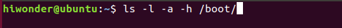 to open the command-line terminal.

3. Enter the command below and press **Enter** to disable auto-start services:

```bash
~/.stop_ros.sh
```

4. Enter the command below and press **Enter** to launch the program:

```bash
ros2 launch example diagonally.launch.py
```

5. To terminate this program, press **Ctrl+C** in the terminal window. If termination fails, repeat the key combination.

### 2.6.3 Program Outcome

JetHexa operates in ripple gait, translating diagonally toward the front-left for 5 s before stopping.

### 2.6.4 Program Analysis

* **Launch File Analysis**

The launch file is located at: **/home/ubuntu/ros2_ws/src/example/example/body_control/diagonally.launch.py**

1. Import required libraries:

```py
import os
from ament_index_python.packages import get_package_share_directory

from launch_ros.actions import Node
from launch import LaunchDescription, LaunchService
from launch.actions import  OpaqueFunction, IncludeLaunchDescription
from launch.launch_description_sources import PythonLaunchDescriptionSource
```

2. Define the launch elements, retrieve the path to the **controller** package, and launch **controller.launch.py**. Create the ROS 2 node **diagonally_node**, specify the executable, and return the launch list:

```py
def launch_setup(context):
    compiled = os.environ['need_compile']
    direction = LaunchConfiguration('direction', default='45')
    direction_arg = DeclareLaunchArgument('direction', default_value=direction)
    if compiled == 'True':
        controller_package_path = get_package_share_directory('controller')
    else:
        controller_package_path = '/home/ubuntu/ros2_ws/src/driver/controller'


    controller_launch = IncludeLaunchDescription(
        PythonLaunchDescriptionSource(
            os.path.join(controller_package_path, 'launch/controller.launch.py')),
    )

    diagonally_node = Node(
        package='example',
        executable='diagonally',
        output='screen',
        parameters=[{'direction': direction}]
    )

    return [
            direction_arg,
            controller_launch,
            diagonally_node,
            ]
```

3. Declare the entry function of the ROS 2 launch file to define the items to start:

```py
def generate_launch_description():
    return LaunchDescription([
        OpaqueFunction(function = launch_setup)
    ])
```

4. Instantiate `LaunchService` and execute the launch description:

```py
if __name__ == '__main__':
    # Create a LaunchDescription object
    ld = generate_launch_description()

    ls = LaunchService()
    ls.include_launch_description(ld)
    ls.run()
```

* **Python Source Code Analysis**

The source code is located at: **/home/ubuntu/ros2_ws/src/example/example/body_control/include/diagonally.py**

```py
def main(args=None):
    rclpy.init(args=args)
    node = Diagonally()

    node.move(gait=1, direction=math.radians(node.direction))
    node.get_logger().info('\033[1;32m%s\033[0m' % f'Movement angle {node.direction} degrees')
    time.sleep(5)  # Wait for 5 seconds
    node.move(gait=0) # Stop
    node.get_logger().info('\033[1;32m%s\033[0m' % 'stop')

    node.controller.destroy_node()  # Clean up node
    rclpy.shutdown()  # Shut down ROS 2
```

1. Motion parameter adjustment:

Configuring parameters allows adjusting attributes such as velocity and direction during forward movement and turning:

```py
def move(
        self,
        gait=1,              # Gait type: 0 for stop, 1 for tripod gait, 2 for ripple gait
        stride=40.0,         # Stride length (mm), default is 40 mm, range: 0–65
        height=15.0,         # Step height (mm), default is 15 mm, range: 0–50
        direction=180,       # Movement direction (degrees), range: 0°–360°, 0° for forward, increasing counterclockwise
        rotation=0.0,        # Rotation rate, default is no rotation; positive for counterclockwise, negative for clockwise
        time=1,              # Single step duration (seconds), default is 1 s
        steps=0,             # Number of steps, 0 indicates continuous motion
        interrupt=True,      # Whether interruption by new commands is allowed, default is True
        relative_height=False # Whether height is relative to the ground, default is absolute height
    )
```

The program controls motion primarily through the `move` function parameters:

* `gait`: Specifies the gait mode. A value of `0` indicates stop, `1` indicates ripple gait, and `2` indicates tripod gait.
* `stride`: Sets the stride length in millimeters. The default range is 0–65 mm. Values exceeding this range may cause the robot to stall or stumble.
* `height`: Sets the step height in millimeters. The default range is 0–50 mm. Values exceeding this range may cause the robot to stall or stumble.
* `direction`: Sets the movement direction in degrees, with a range of 0°–360°. A value between 0° and 180° moves the robot forward, while a value between 180° and 360° moves the robot backward.
* `rotation`: Sets the turning rate in radians per second. A positive value rotates the robot counterclockwise, and a negative value rotates the robot clockwise.
* `time`: Sets the time interval for each individual step in seconds.
* `steps`: Sets the number of movement steps. A value of `0` indicates continuous movement.
* `interrupt`: Sets whether new commands can interrupt execution.
* `relative_height`: Specifies whether the step height parameter `height` is relative to the ground. A value of `False` uses relative height.

2. Basic configuration:

Configuring the parameters adjusts the movement direction and duration:

```py
    node.move(gait=1, direction=math.radians(node.direction))
    node.get_logger().info('\033[1;32m%s\033[0m' % f'Movement angle {node.direction} degrees')
    time.sleep(5)  # Wait for 5 seconds
    node.move(gait=0) # Stop
    node.get_logger().info('\033[1;32m%s\033[0m' % 'stop')
```

The function `math.radians()` converts angle values into radians and passes them to `move`. The parameter `node.direction` defaults to 45°, setting the movement heading. The `sleep` function controls the duration of each state in seconds.

## 2.7 Walking Speed Adjustment

### 2.7.1 Overview

This section covers walking speed adjustment based on the ripple gait. By modifying configuration parameters, JetHexa adjusts its walking velocity in ripple gait.

### 2.7.2 Operating Steps

> [!NOTE]
>
> **Terminal commands are strictly case-sensitive. Press Tab to auto-complete keywords.**

1. Power on the JetHexa robot and connect to the remote desktop software **NoMachine**.

2. Click the desktop icon 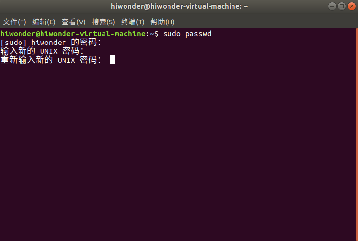 to open the command-line terminal.

3. Enter the command below and press **Enter** to disable auto-start services:

```bash
~/.stop_ros.sh
```

4. Enter the command below and press **Enter** to launch the program:

```bash
ros2 launch example speed_control.launch.py
```

5. To terminate this program, press **Ctrl+C** in the terminal window. If termination fails, repeat the key combination.

### 2.7.3 Program Outcome

JetHexa operates in ripple gait, moving forward with a default stride of 40 mm and a step interval of 1 s.

### 2.7.4 Program Analysis

* **Launch File Analysis**

The launch file is located at: **/home/ubuntu/ros2_ws/src/example/example/body_control/speed_control.launch.py**

1. Import required libraries:

```py
import os
from ament_index_python.packages import get_package_share_directory

from launch_ros.actions import Node
from launch import LaunchDescription, LaunchService
from launch.actions import  OpaqueFunction, IncludeLaunchDescription
from launch.launch_description_sources import PythonLaunchDescriptionSource
```

2. Define the launch elements, retrieve the path to the **controller** package, and launch **controller.launch.py**. Create the ROS 2 node **speed_control_node**, specify the executable, and return the launch list:

```py
def launch_setup(context):
    compiled = os.environ['need_compile']
    period = LaunchConfiguration('period', default='1')
    stride = LaunchConfiguration('stride', default='15')
    stride_arg = DeclareLaunchArgument('stride', default_value=stride)
    period_arg = DeclareLaunchArgument('period', default_value=period)
    if compiled == 'True':
        controller_package_path = get_package_share_directory('controller')
    else:
        controller_package_path = '/home/ubuntu/ros2_ws/src/driver/controller'

    controller_launch = IncludeLaunchDescription(
        PythonLaunchDescriptionSource(
            os.path.join(controller_package_path, 'launch/controller.launch.py')),
    )


    speed_control_node = Node(
        package='example',
        executable='speed_control',
        output='screen',
        parameters=[{'period': period, 'stride': stride}]
    )

    return [
            stride_arg,
            period_arg,
            controller_launch,
            speed_control_node,
            ]
```

3. Declare the entry function of the ROS 2 launch file to define the items to start:

```py
def generate_launch_description():
    return LaunchDescription([
        OpaqueFunction(function = launch_setup)
    ])
```

4. Instantiate `LaunchService` and execute the launch description:

```py
if __name__ == '__main__':
    # Create a LaunchDescription object
    ld = generate_launch_description()

    ls = LaunchService()
    ls.include_launch_description(ld)
    ls.run()
```

* **Python Source Code Analysis**

The source code is located at: **/home/ubuntu/ros2_ws/src/example/example/body_control/include/speed_control.py**

```py
def main(args=None):
    rclpy.init(args=args)
    node = SpeedControl()

    node.move(gait=1, stride=node.stride, time=node.period)
    node.get_logger().info('\033[1;32m%s\033[0m' % f'stride: {node.stride}')
    node.get_logger().info('\033[1;32m%s\033[0m' % f'Interval time between each step {node.period}s')
    time.sleep(5)  # Wait for 5 seconds
    node.move(gait=0) # Stop
    node.get_logger().info('\033[1;32m%s\033[0m' % 'stop')

    node.controller.destroy_node()  # Clean up node
    rclpy.shutdown()  # Shut down ROS 2
```

1. Motion parameter adjustment:

Configuring parameters allows adjusting attributes such as velocity and direction during forward movement and turning:

```py
def move(
        self,
        gait=1,              # Gait type: 0 for stop, 1 for tripod gait, 2 for ripple gait
        stride=40.0,         # Stride length (mm), default is 40 mm, range: 0–65
        height=15.0,         # Step height (mm), default is 15 mm, range: 0–50
        direction=180,       # Movement direction (degrees), range: 0°–360°, 0° for forward, increasing counterclockwise
        rotation=0.0,        # Rotation rate, default is no rotation; positive for counterclockwise, negative for clockwise
        time=1,              # Single step duration (seconds), default is 1 s
        steps=0,             # Number of steps, 0 indicates continuous motion
        interrupt=True,      # Whether interruption by new commands is allowed, default is True
        relative_height=False # Whether height is relative to the ground, default is absolute height
    )
```

The program controls motion primarily through the `move` function parameters:

* `gait`: Specifies the gait mode. A value of `0` indicates stop, `1` indicates ripple gait, and `2` indicates tripod gait.
* `stride`: Sets the stride length in millimeters. The default range is 0–65 mm. Values exceeding this range may cause the robot to stall or stumble.
* `height`: Sets the step height in millimeters. The default range is 0–50 mm. Values exceeding this range may cause the robot to stall or stumble.
* `direction`: Sets the movement direction in degrees, with a range of 0°–360°. A value between 0° and 180° moves the robot forward, while a value between 180° and 360° moves the robot backward.
* `rotation`: Sets the turning rate in radians per second. A positive value rotates the robot counterclockwise, and a negative value rotates the robot clockwise.
* `time`: Sets the time interval for each individual step in seconds.
* `steps`: Sets the number of movement steps. A value of `0` indicates continuous movement.
* `interrupt`: Sets whether new commands can interrupt execution.
* `relative_height`: Specifies whether the step height parameter `height` is relative to the ground. A value of `False` uses relative height.

2. Basic configuration:

Configuring the parameters adjusts walking speed and movement duration by altering the stride length and time interval of each step:

```py
    node.move(gait=1, stride=node.stride, time=node.period)
    node.get_logger().info('\033[1;32m%s\033[0m' % f'stride: {node.stride}')
    node.get_logger().info('\033[1;32m%s\033[0m' % f'Interval time between each step {node.period}s')
    time.sleep(5)  # Wait for 5 seconds
    node.move(gait=0) # Stop
    node.get_logger().info('\033[1;32m%s\033[0m' % 'stop')
```

The parameter `stride` specifies stride length, with a default of 15 mm. The parameter `period` specifies the time interval between steps, with a default of 1 s. The `sleep` function controls the duration of each state in seconds.

## 2.8 Zigzag Translation

### 2.8.1 Overview

This section covers zigzag translation based on the ripple gait. By modifying configuration parameters, JetHexa executes zigzag translation in ripple gait.

### 2.8.2 Operating Steps

> [!NOTE]
>
> **Terminal commands are strictly case-sensitive. Press Tab to auto-complete keywords.**

1. Power on the robot and connect to the remote desktop software **NoMachine**.

2. Click the desktop icon  to open the command-line terminal.

3. Enter the command below and press **Enter** to disable auto-start services:

```bash
~/.stop_ros.sh
```

4. Enter the command below and press **Enter** to launch the program:

```bash
ros2 launch example broken_line_walk.launch.py
```

5. To terminate this program, press **Ctrl+C** in the terminal window. If termination fails, repeat the key combination.

### 2.8.3 Program Outcome

JetHexa operates in ripple gait, moving diagonally to the front-left for 4 s and then diagonally to the front-right for 4 s, repeating cyclically until **Ctrl+C** is pressed.

### 2.8.4 Program Analysis

* **Launch File Analysis**

The launch file is located at: **/home/ubuntu/ros2_ws/src/example/example/body_control/broken_line_walk.launch.py**

1. Import required libraries:

```py
import os
from ament_index_python.packages import get_package_share_directory

from launch_ros.actions import Node
from launch import LaunchDescription, LaunchService
from launch.actions import  OpaqueFunction, IncludeLaunchDescription
from launch.launch_description_sources import PythonLaunchDescriptionSource
```

2. Define the launch elements, retrieve the path to the **controller** package, and launch **controller.launch.py**. Create the ROS 2 node **broken_line_walk_node**, specify the executable, and return the launch list:

```py
def launch_setup(context):
    compiled = os.environ['need_compile']
    if compiled == 'True':
        controller_package_path = get_package_share_directory('controller')
    else:
        controller_package_path = '/home/ubuntu/ros2_ws/src/driver/controller'

    controller_launch = IncludeLaunchDescription(
        PythonLaunchDescriptionSource(
            os.path.join(controller_package_path, 'launch/controller.launch.py')),
    )

    broken_line_walk_node = Node(
        package='example',
        executable='broken_line_walk',
        output='screen',
    )

    return [
            controller_launch,
            broken_line_walk_node,
            ]
```

3. Declare the entry function of the ROS 2 launch file to define the items to start:

```py
def generate_launch_description():
    return LaunchDescription([
        OpaqueFunction(function = launch_setup)
    ])
```

4. Instantiate `LaunchService` and execute the launch description:

```py
if __name__ == '__main__':
    # Create a LaunchDescription object
    ld = generate_launch_description()

    ls = LaunchService()
    ls.include_launch_description(ld)
    ls.run()
```

* **Python Source Code Analysis**

The source code is located at: **/home/ubuntu/ros2_ws/src/example/example/body_control/include/broken_line_walk.py**

```py
def main(args=None):
    rclpy.init(args=args)
    node = BrokenLineWalk()

    # Define custom signal handler to ensure a stop command is sent upon receiving SIGINT
    def signal_handler(sig, frame):
        node.get_logger().info('\033[1;32m%s\033[0m' % 'Received SIGINT, stopping...')
        node.move(gait=0)  # Send stop command
        # Clean up node and shut down ROS 2
        node.destroy_node()
        rclpy.shutdown()
        exit(0)

    signal.signal(signal.SIGINT, signal_handler)
    direction = [45, -45]

    try:
        while True:
            for angle in direction:
                node.move(gait=1, direction=math.radians(angle))
                time.sleep(4)
    except KeyboardInterrupt:
        node.get_logger().info('\033[1;32m%s\033[0m' % 'stop')
        node.move(gait=0) # Stop

    finally:
        node.move(gait=0) # Stop
        node.controller.destroy_node()
        rclpy.shutdown()
```

1. Motion parameter adjustment:

Configuring parameters allows adjusting attributes such as velocity and direction during forward movement and turning:

```py
def move(
        self,
        gait=1,              # Gait type: 0 for stop, 1 for tripod gait, 2 for ripple gait
        stride=40.0,         # Stride length (mm), default is 40 mm, range: 0–65
        height=15.0,         # Step height (mm), default is 15 mm, range: 0–50
        direction=180,       # Movement direction (degrees), range: 0°–360°, 0° for forward, increasing counterclockwise
        rotation=0.0,        # Rotation rate, default is no rotation; positive for counterclockwise, negative for clockwise
        time=1,              # Single step duration (seconds), default is 1 s
        steps=0,             # Number of steps, 0 indicates continuous motion
        interrupt=True,      # Whether interruption by new commands is allowed, default is True
        relative_height=False # Whether height is relative to the ground, default is absolute height
    )
```

The program controls motion primarily through the `move` function parameters:

* `gait`: Specifies the gait mode. A value of `0` indicates stop, `1` indicates ripple gait, and `2` indicates tripod gait.
* `stride`: Sets the stride length in millimeters. The default range is 0–65 mm. Values exceeding this range may cause the robot to stall or stumble.
* `height`: Sets the step height in millimeters. The default range is 0–50 mm. Values exceeding this range may cause the robot to stall or stumble.
* `direction`: Sets the movement direction in degrees, with a range of 0°–360°. A value between 0° and 180° moves the robot forward, while a value between 180° and 360° moves the robot backward.
* `rotation`: Sets the turning rate in radians per second. A positive value rotates the robot counterclockwise, and a negative value rotates the robot clockwise.
* `time`: Sets the time interval for each individual step in seconds.
* `steps`: Sets the number of movement steps. A value of `0` indicates continuous movement.
* `interrupt`: Sets whether new commands can interrupt execution.
* `relative_height`: Specifies whether the step height parameter `height` is relative to the ground. A value of `False` uses relative height.

2. Basic configuration:

Configuring the parameters adjusts movement heading and execution durations:

```py
    try:
        while True:
            for angle in direction:
                node.move(gait=1, direction=math.radians(angle))
                time.sleep(4)
    except KeyboardInterrupt:
        node.get_logger().info('\033[1;32m%s\033[0m' % 'stop')
        node.move(gait=0) # Stop
```

The `while` loop iterates over each angle in the `direction` list, directing the heading of the robot. The `sleep` function controls the duration of each state in seconds.

## 2.9 Rectangular Translation

### 2.9.1 Overview

This section covers rectangular path translation based on the ripple gait. By modifying configuration parameters, JetHexa adjusts the dimensions of rectangular movement in ripple gait.

### 2.9.2 Operating Steps

> [!NOTE]
>
> **Terminal commands are strictly case-sensitive. Press Tab to auto-complete keywords.**

1. Power on the robot and connect to the remote desktop software **NoMachine**.

2. Click the desktop icon  to open the command-line terminal.

3. Enter the command below and press **Enter** to disable auto-start services:

```bash
~/.stop_ros.sh
```

4. Enter the command below and press **Enter** to launch the program:

```bash
ros2 launch example square_walk.launch.py
```

5. To terminate this program, press **Ctrl+C** in the terminal window. If termination fails, repeat the key combination.

### 2.9.3 Program Outcome

JetHexa operates in ripple gait, moving forward, right, backward, and left sequentially for 4 s in each direction before stopping.

### 2.9.4 Program Analysis

* **Launch File Analysis**

The launch file is located at: **/home/ubuntu/ros2_ws/src/example/example/body_control/square_walk.launch.py**

1. Import required libraries:

```py
import os
from ament_index_python.packages import get_package_share_directory

from launch_ros.actions import Node
from launch import LaunchDescription, LaunchService
from launch.actions import  OpaqueFunction, IncludeLaunchDescription
from launch.launch_description_sources import PythonLaunchDescriptionSource
```

2. Define the launch elements, retrieve the path to the **controller** package, and launch **controller.launch.py**. Create the ROS 2 node **square_walk_node**, specify the executable, and return the launch list:

```py
def launch_setup(context):
    compiled = os.environ['need_compile']
    if compiled == 'True':
        controller_package_path = get_package_share_directory('controller')
    else:
        controller_package_path = '/home/ubuntu/ros2_ws/src/driver/controller'

    controller_launch = IncludeLaunchDescription(
        PythonLaunchDescriptionSource(
            os.path.join(controller_package_path, 'launch/controller.launch.py')),
    )

    square_walk_node = Node(
        package='example',
        executable='square_walk',
        output='screen',
    )

    return [
            controller_launch,
            square_walk_node,
            ]
```

3. Declare the entry function of the ROS 2 launch file to define the items to start:

```py
def generate_launch_description():
    return LaunchDescription([
        OpaqueFunction(function = launch_setup)
    ])
```

4. Instantiate `LaunchService` and execute the launch description:

```py
if __name__ == '__main__':
    # Create a LaunchDescription object
    ld = generate_launch_description()

    ls = LaunchService()
    ls.include_launch_description(ld)
    ls.run()
```

* **Python Source Code Analysis**

The source code is located at: **/home/ubuntu/ros2_ws/src/example/example/body_control/include/square_walk.py**

```py
def main():
    # Initialize the ROS 2 client library
    rclpy.init()
    node = SquareWalk()

    # Define custom signal handler to ensure a stop command is sent upon receiving SIGINT
    def signal_handler(sig, frame):
        node.get_logger().info('\033[1;32m%s\033[0m' % 'Received SIGINT, stopping...')
        node.move(gait=0)  # Send stop command
        # Clean up node and shut down ROS 2
        node.destroy_node()
        rclpy.shutdown()
        exit(0)

    signal.signal(signal.SIGINT, signal_handler)

    # Movement directions for square locomotion in degrees
    direction_angles = [0, 90, 180, 270]

    try:
        # Execute movement in each direction sequentially
        for angle in direction_angles:
            node.get_logger().info('\033[1;32m%s\033[0m' % f'Moving in direction: {angle}°')
            # Convert degrees to radians before sending motion command
            node.move(gait=1, direction=math.radians(angle))
            time.sleep(4)  # Wait for a period before switching to next direction

    except KeyboardInterrupt:
        node.get_logger().info('\033[1;32m%s\033[0m' % 'KeyboardInterrupt detected, stopping...')
        node.move(gait=0)

    finally:
        # Ensure robot stops motion at the end
        node.move(gait=0)
        node.destroy_node()
        rclpy.shutdown()
```

1. Motion parameter adjustment:

Configuring parameters allows adjusting attributes such as velocity and direction during forward movement and turning:

```py
def move(
        self,
        gait=1,              # Gait type: 0 for stop, 1 for tripod gait, 2 for ripple gait
        stride=40.0,         # Stride length (mm), default is 40 mm, range: 0–65
        height=15.0,         # Step height (mm), default is 15 mm, range: 0–50
        direction=180,       # Movement direction (degrees), range: 0°–360°, 0° for forward, increasing counterclockwise
        rotation=0.0,        # Rotation rate, default is no rotation; positive for counterclockwise, negative for clockwise
        time=1,              # Single step duration (seconds), default is 1 s
        steps=0,             # Number of steps, 0 indicates continuous motion
        interrupt=True,      # Whether interruption by new commands is allowed, default is True
        relative_height=False # Whether height is relative to the ground, default is absolute height
    )
```

The program controls motion primarily through the `move` function parameters:

* `gait`: Specifies the gait mode. A value of `0` indicates stop, `1` indicates ripple gait, and `2` indicates tripod gait.
* `stride`: Sets the stride length in millimeters. The default range is 0–65 mm. Values exceeding this range may cause the robot to stall or stumble.
* `height`: Sets the step height in millimeters. The default range is 0–50 mm. Values exceeding this range may cause the robot to stall or stumble.
* `direction`: Sets the movement direction in degrees, with a range of 0°–360°. A value between 0° and 180° moves the robot forward, while a value between 180° and 360° moves the robot backward.
* `rotation`: Sets the turning rate in radians per second. A positive value rotates the robot counterclockwise, and a negative value rotates the robot clockwise.
* `time`: Sets the time interval for each individual step in seconds.
* `steps`: Sets the number of movement steps. A value of `0` indicates continuous movement.
* `interrupt`: Sets whether new commands can interrupt execution.
* `relative_height`: Specifies whether the step height parameter `height` is relative to the ground. A value of `False` uses relative height.

2. Basic configuration:

Configuring the parameters adjusts movement directions and execution durations:

```py
  try:
        # Execute movement in each direction sequentially
        for angle in direction_angles:
            node.get_logger().info('\033[1;32m%s\033[0m' % f'Moving in direction: {angle}°')
            # Convert degrees to radians before sending motion command
            node.move(gait=1, direction=math.radians(angle))
            time.sleep(4)  # Wait for a period before switching to next direction

    except KeyboardInterrupt:
        node.get_logger().info('\033[1;32m%s\033[0m' % 'KeyboardInterrupt detected, stopping...')
        node.move(gait=0)
```

The `for` loop iterates over each angle in `direction_angles`, controlling the movement heading. The `sleep` function controls the duration of each state in seconds.

## 2.11 PC Software Functions

In robotics architecture, the host computer coordinates with the lower controller to transmit motion commands and receive real-time feedback data. The PC software runs on a computer to control the lower-level robotic controllers.

This section introduces the interface layout and functional modules of the JetHexa PC software.

### 2.11.1 Launching PC Software

Two methods are available to launch the PC software. Select either method as needed.

* **Launching via Desktop Shortcut**

1. Power on JetHexa and connect to the remote desktop software **NoMachine**. To learn how to establish the remote connection, refer to [1. Tutorials/1. JetHexa User Manual/1.4.2 Remote Connection Setup](https://drive.google.com/drive/folders/1fFo3fA72xG8UAcqcdB7UyhIA6pN2Gjrq?usp=sharing).

2. Double-click the desktop shortcut  to launch the PC software.

* **Launching via Command Line**

1. Power on the robot and connect to the remote desktop software **NoMachine**.

2. Click the desktop icon  to open the command-line terminal.

3. Enter the command below and press **Enter** to open the PC software:

```bash
cd software/actionset_editor && python3 main.py
```

Depth camera version:


Monocular camera version:

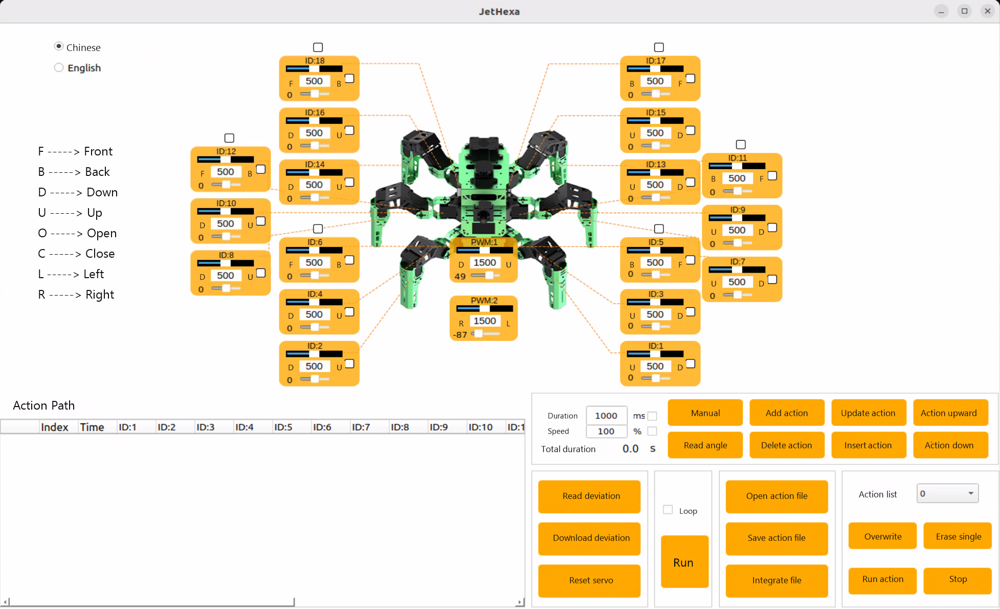

### 2.11.2 PC Software Interface Layout

The interface of the PC software is illustrated below, comprising four functional areas: ① Servo control area, ② Action details list, ③ Action group setting area, and ④ Deviation setting area.

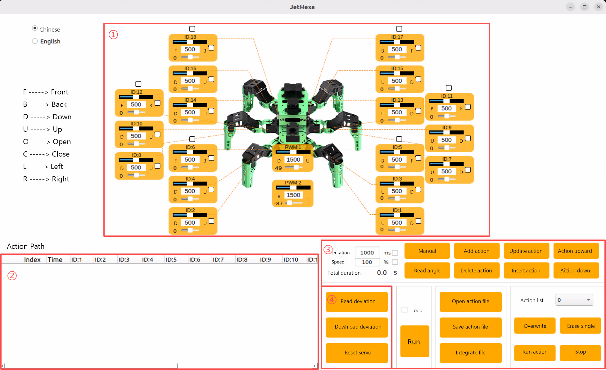

The functions of each area are described in the sections below.

### 2.11.3 Servo Control Area

The servo control area displays icons and sliders for the selected servos. Adjusting the corresponding slider values changes the rotation position of each servo, modifying the posture of the JetHexa robot.

| Icon | Description |
| :---: | :--- |
| 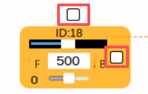 | Lock checkbox. When checked, the servo cannot be controlled by action groups and remains powered during manual programming. |
|  | Servo ID number. |
|  | Adjusts the angular position of the servo, with a range of 0–1000. |
|  | Adjusts the servo deviation, with a range of -125 to 125. To prevent accidental modification, click **Read Deviation** before dragging the slider. |

### 2.11.4 Action Details List

The action details list displays the index number, execution duration, and individual servo position data of the current action.

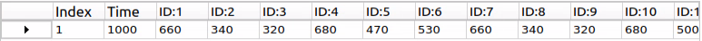

| Icon | Description |
| :---: | :--- |
|  | Action index number. |
|  | Execution time required for the action, measured in ms. |
|  | Angular position of the corresponding servo ID. Double-click the numerical value  below to edit it. |
|  | Runs the currently selected action. |

### 2.11.5 Action Group Setting Area

The action group setting area allows adding, deleting, updating, inserting, running, opening, and chaining actions.

| Icon | Description |
| :---: | :--- |
|  | Execution time required for a single action. Click  to edit the value. Check the box after "ms" to lock the duration. |
| 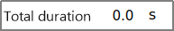 | Total duration required to execute the complete action group. |
|  | Cuts power to the servos, loosening the joints. Adjust the joints manually to design actions. If the joints resist movement, do not force them. Click the button again. |
|  | Reads the position data of manually adjusted servos. Must be used in conjunction with **Manual**. |
|  | Integrates the current servo values in the servo control area into an action and appends it to the last row of the action details list. |
|  | Deletes the action currently selected in the action details list. |
|  | Replaces the values of the selected action in the list. The servo angles update to the current values in the servo control area, and the action duration updates to the value set in **Action Time**. |
|  | Inserts an action row above the selected action. The duration corresponds to the value set in **Action Time**, and the servo angles correspond to the current values in the servo control area. |
|  | Moves the selected action up by one row. |
|  | Moves the selected action down by one row. |
| 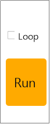 | Runs the actions in the action details list once. If **Loop** is checked, the robot executes the actions repeatedly. |
|  | Opens a file dialog to load an action group into the action details list. |
|  | Saves the actions in the action details list to a specified directory. |
|  | After opening an action group file, click this button to select another action group file, chaining the two into a single new action group. |
|  | Displays saved action groups available in the software. |
|  | Deletes the action group file currently selected in the dropdown menu. |
|  | Caution: this operation is irreversible. Deletes all action groups in the action group selection menu. |
|  | Executes the action group selected in the dropdown menu once. |
|  | Stops the currently running action group. |

> [!NOTE]
>
> **Action group files are uniformly saved to the path: /home/ubuntu/software/actionset_editor/ActionGroups.**

### 2.11.6 Deviation Setting Area

| Icon | Description |
| :---: | :--- |
|  | Reads the current servo deviation values of JetHexa. |
|  | Saves the adjusted servo deviation values to JetHexa. |
|  | Resets all servo parameters in the servo control area to 500. |

> [!NOTE]
>
> **Servo deviations are pre-calibrated at the factory prior to shipment.**

## 2.12 Action Editing Tutorial

This tutorial demonstrates how to create a custom action group containing 15 individual actions to make the robot clap.

### 2.12.1 Action Editing

1. Power on the robot and connect to the remote desktop software **NoMachine**. To learn how to establish the remote connection, refer to [1. Tutorials/1. JetHexa User Manual/1.4.2 Remote Connection Setup](https://drive.google.com/drive/folders/1fFo3fA72xG8UAcqcdB7UyhIA6pN2Gjrq?usp=sharing).

2. Double-click the desktop shortcut 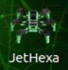 to launch the PC software.

3. To facilitate subsequent explanations, the legs of JetHexa are numbered as shown below:

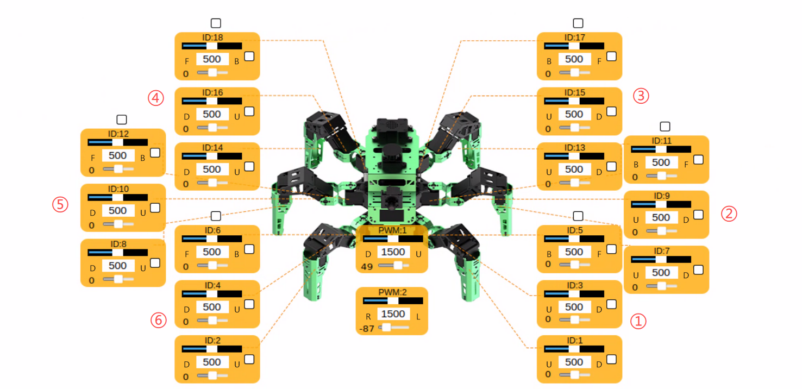

4. Action 1: Click **Reset servo** in the deviation setting area to return JetHexa to its initial posture.

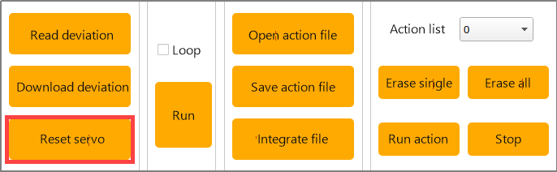

5. Set the action time to 500 ms and click **Add action** in the action editing area to append the initial posture to the action list.

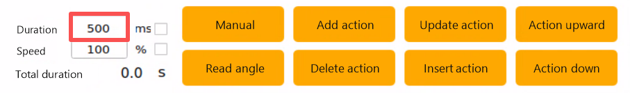

Detailed parameters of the action can be viewed in the action list area.


> [!NOTE]
>
> **After editing each subsequent action, click 'Add action' to append it to the action list.**

6. Drag the slider to adjust the position parameter of the ID 8 servo to 300.

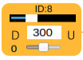

7. Action 2: Refer to the figure below to modify other servo parameters, lifting legs 2 and 5 of JetHexa, and append the action to the action list.

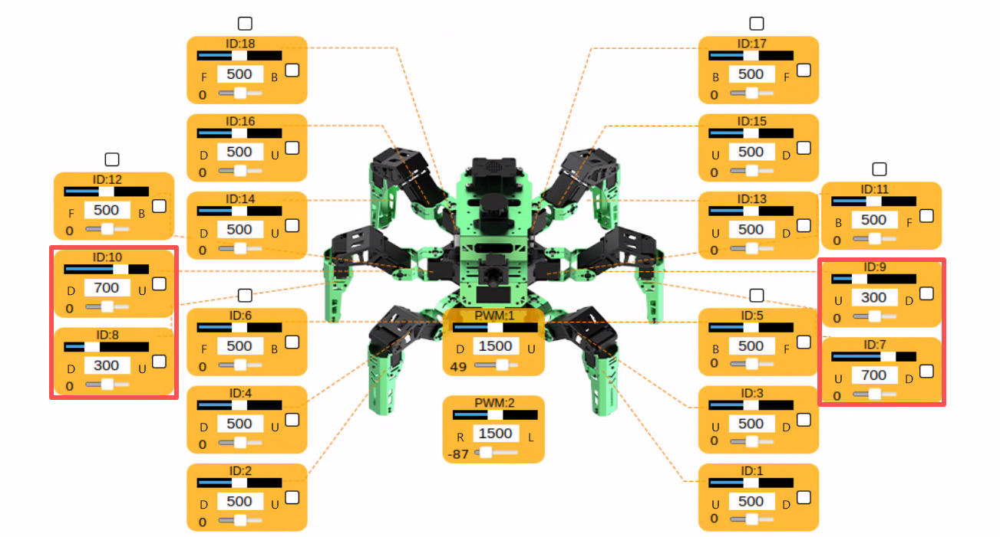

8. Action 3: Make legs 2 and 5 of JetHexa swing forward.


9. Action 4: Lower legs 2 and 5 of JetHexa to contact the ground.


10. Action 5: Repeat Action 4 to ensure smoother transitions between movements. Set the duration to 200 ms and click **Add action** to append the action to the list.

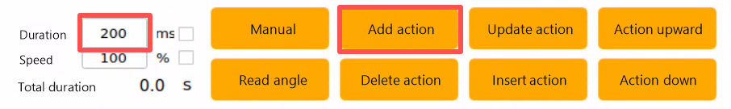

11. Action 6: Lift legs 1 and 6 of JetHexa toward the front of the body. Set the duration to 700 ms and click **Add action** to append the action to the list.

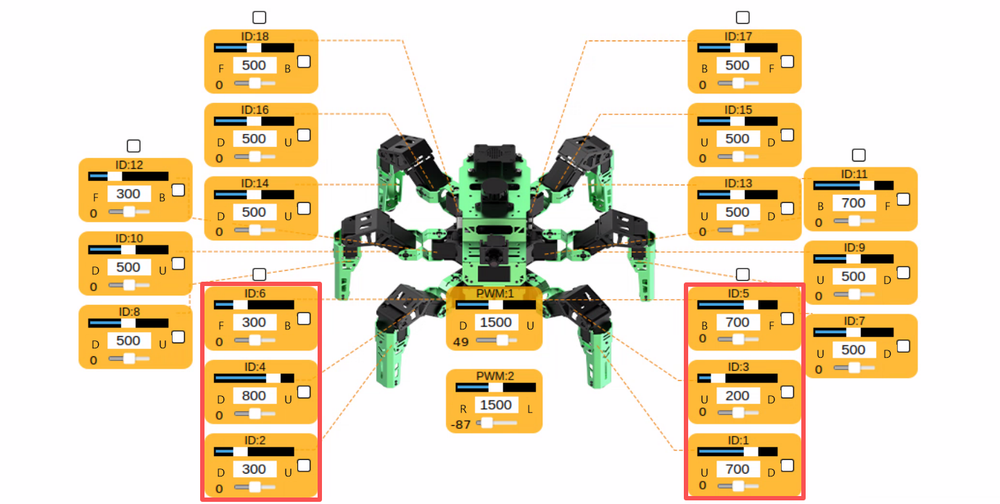

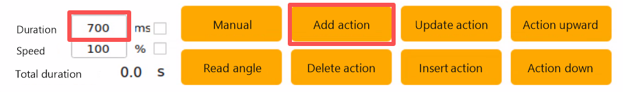

12. Action 7: Close legs 1 and 6 slightly toward each other to perform a clap. Set the duration to 400 ms and click **Add action** to append the action to the list.

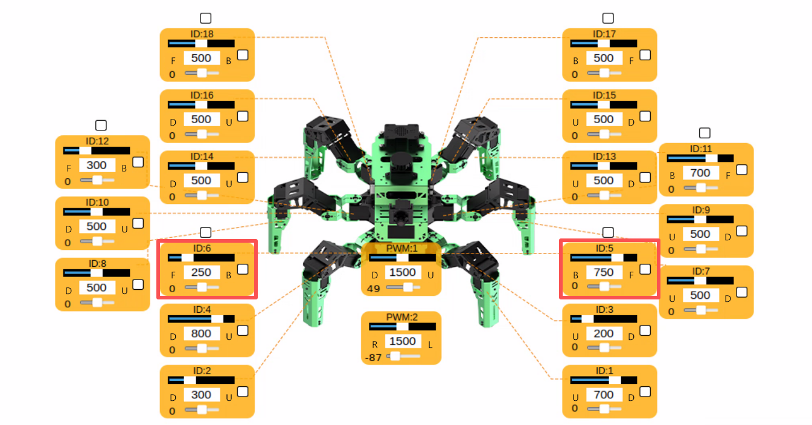

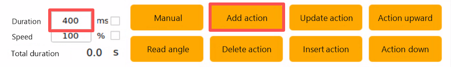

13. Action 8: Separate legs 1 and 6 of JetHexa.

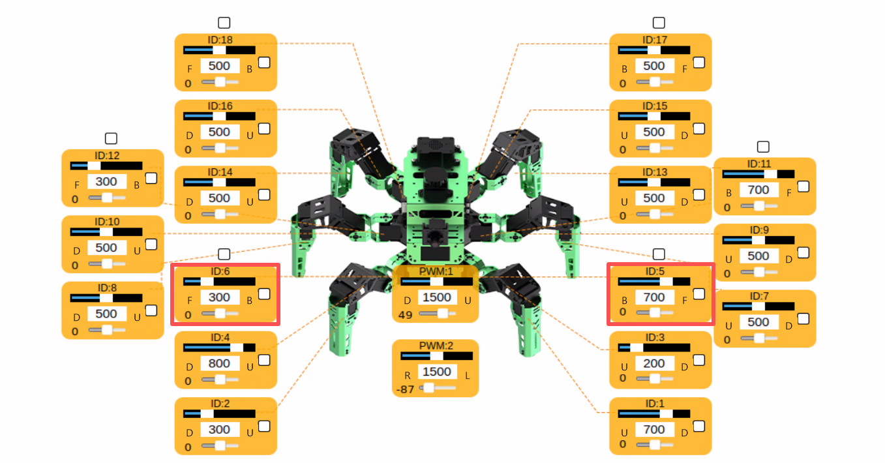

14. Action 9: Close legs 1 and 6 slightly toward each other again to perform a second clap.

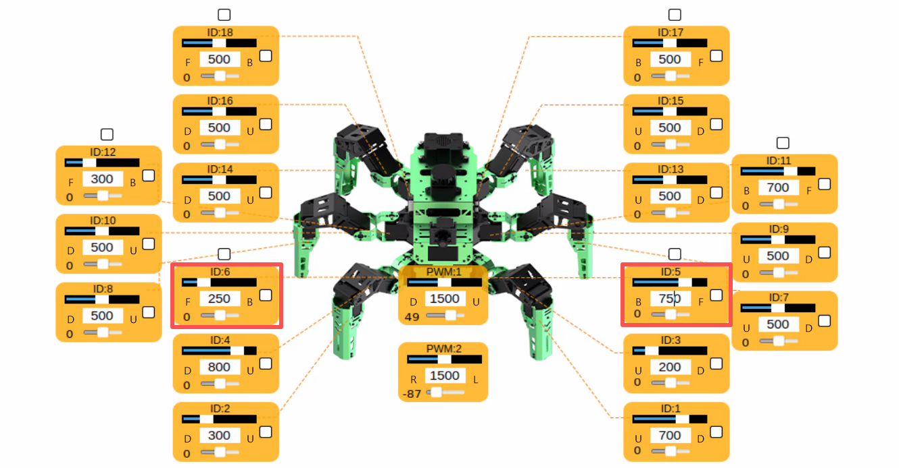

15. Action 10: Separate legs 1 and 6 of JetHexa.


16. Action 11: Repeat Action 10 to ensure smoother transitions between movements. Set the duration to 200 ms and click **Add action** to append the action to the list.

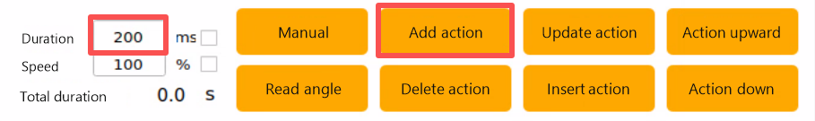

17. Action 12: Reset legs 1 and 6 of JetHexa to their initial positions, centering each servo on legs 1 and 6. Set the duration to 500 ms and click **Add action** to append the action to the list.

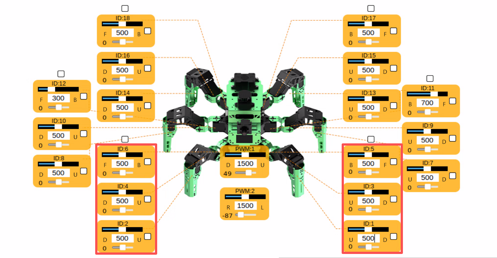

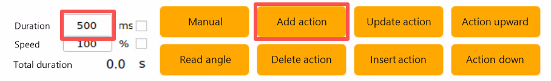

18. Action 13: Lift legs 2 and 5 of JetHexa. Set the duration to 600 ms and click **Add action** to append the action to the list.

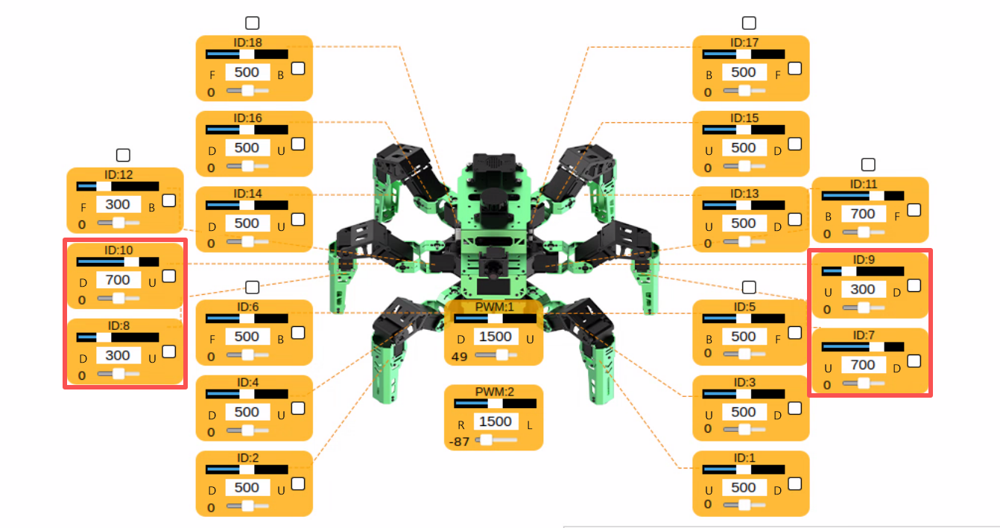

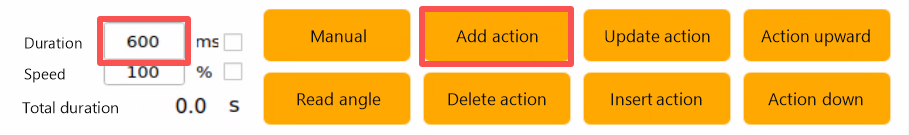

19. Action 14: Swing legs 2 and 5 of JetHexa backward. Set the duration to 500 ms and click **Add action** to append the action to the list.

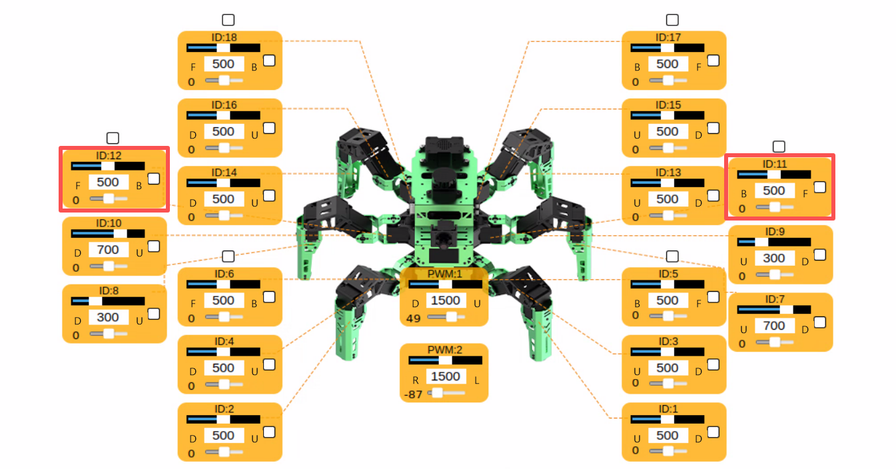

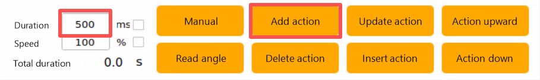

20. Action 15: Click **Reset servo** to return JetHexa to its initial posture, and click **Add action** to append the action to the list.

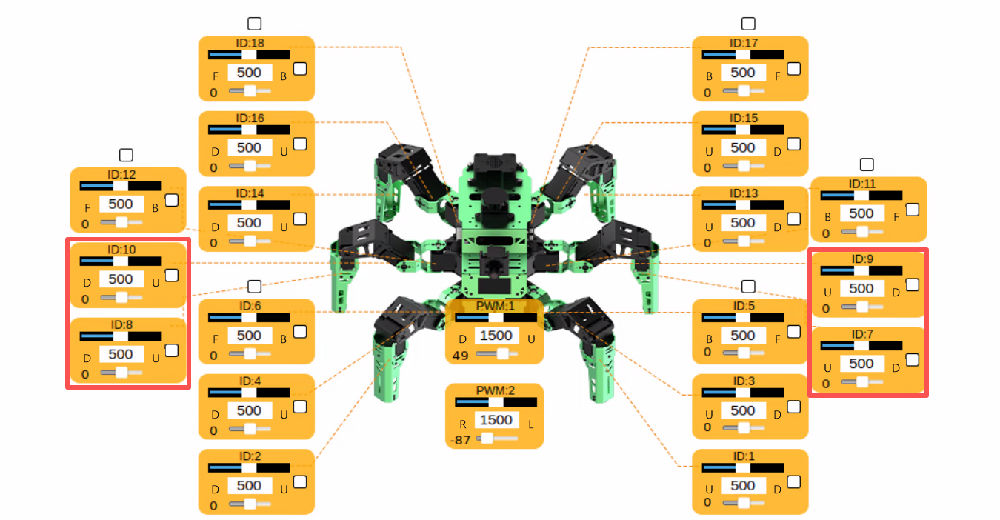

All numerical parameters for this action group are summarized in the image below:

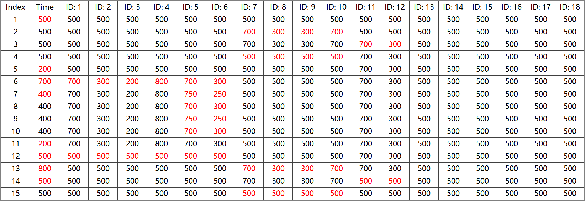

> [!NOTE]
>
> **Values highlighted in red indicate the duration or servo parameters to adjust at each step.**

### 2.12.2 Saving Action Group

1. To facilitate subsequent debugging and management, click **Save action file** to save the action group:

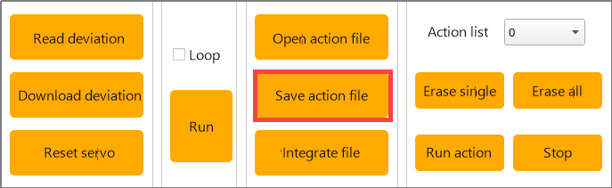

2. Set the destination directory to **/home/ubuntu/software/actionset_editor/ActionGroups**, name the action group **clap**, and click **Save**:

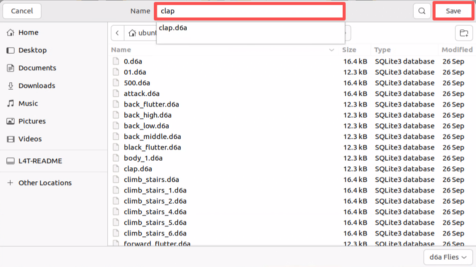

### 2.12.3 Action Group Invocation

1. Launch the PC software and click **Action list**:

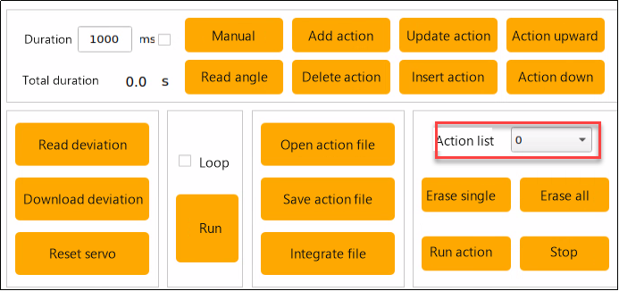

2. Select the name of the action group to invoke:

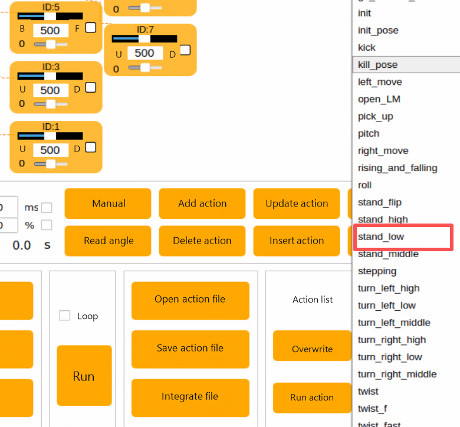

3. After making the selection, click **Run action**:

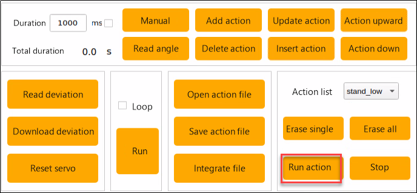

### 2.12.4 Chaining Action Groups

1. After connecting to the robot via remote desktop, launch the PC software:


2. Click **Open action file** in the action group setting area, navigate to **/home/ubuntu/software/actionset_editor/ActionGroups**, select **go_forward_high**, and double-click to open it:

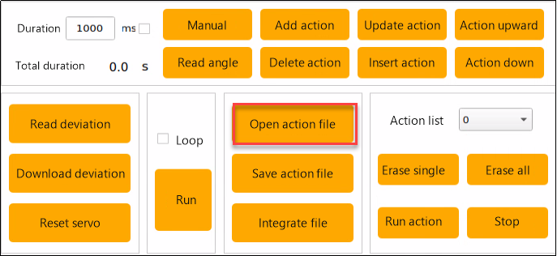


3. Click **Integrate file** in the action group setting area, navigate to **/home/ubuntu/software/actionset_editor/ActionGroups**, select **go_forward_low**, and double-click to open it:

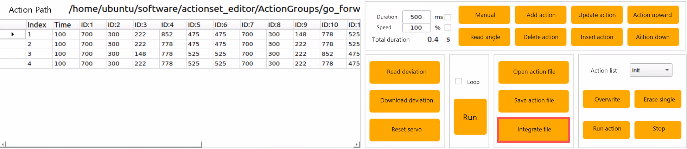


4. The chained actions are now imported into the list. Move the selection cursor to row 1 and click **Run** to test the newly chained action group online:

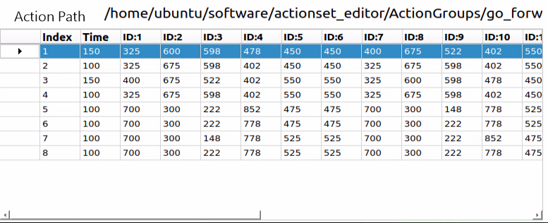

5. Click **Save action file** to save the newly chained action group for future use:

> [!NOTE]
>
> **Files must be named using English characters only, or the action invocation may fail.**

<p id ="p2-13-1"></p>

## 2.13 App Custom Control

Having learned how to create and edit the **clap** action group, this section guides executing this custom action group on JetHexa using the app.

To learn how to connect the app, refer to [1. Tutorials/1. JetHexa User Manual/1.3.3 App Installation and Connection](https://drive.google.com/drive/folders/1fFo3fA72xG8UAcqcdB7UyhIA6pN2Gjrq?usp=sharing).

### 2.13.1 Viewing Built-in Action Groups

1. Power on the robot and connect to the remote desktop software **NoMachine**. To learn how to establish the remote connection, refer to [1. Tutorials/1. JetHexa User Manual/1.4.2 Remote Connection Setup](https://drive.google.com/drive/folders/1fFo3fA72xG8UAcqcdB7UyhIA6pN2Gjrq?usp=sharing).

2. Click the icon  in the system taskbar to open the file manager.

3. Navigate to **/home/ubuntu/software/actionset_editor/ActionGroups** to view the names of all existing action groups:

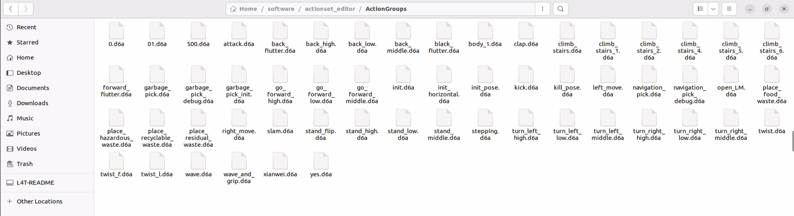

### 2.13.2 Customizing Action Groups via App

1. Launch the app **WonderAi** and connect to JetHexa.

2. Tap **Robot Control** on the mode selection screen to enter the control interface:

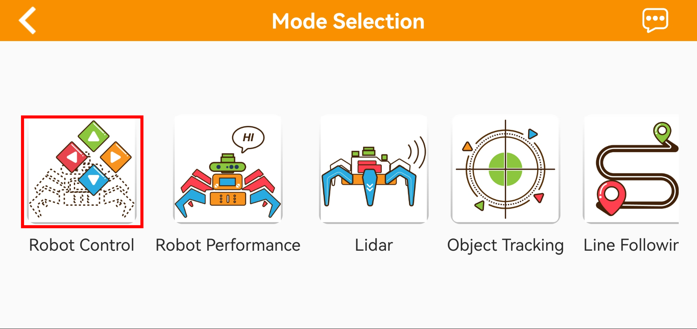

3. Tap the icon in the upper-right corner:

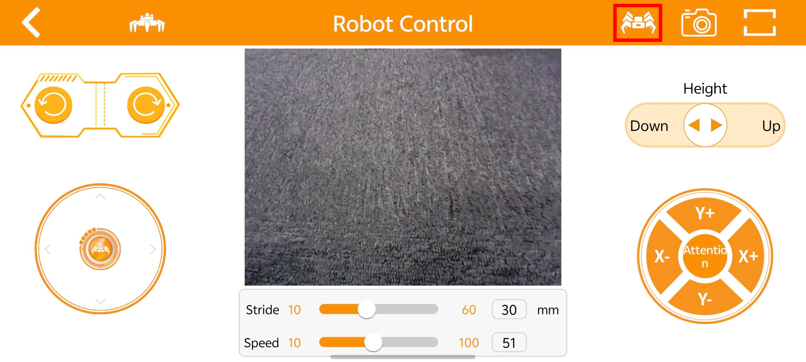

4. Tap **Add** to create a custom action:

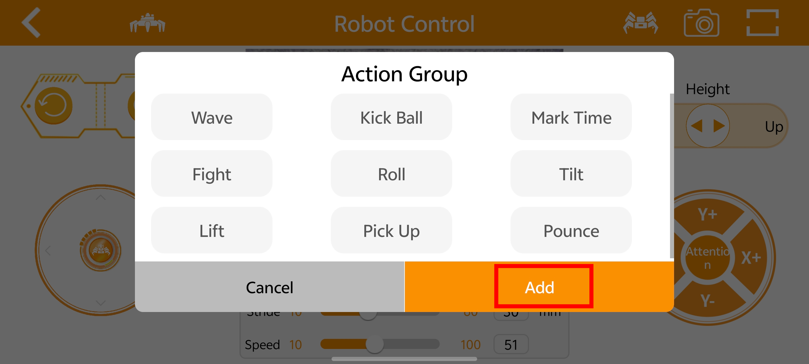

5. Enter the required action details. Type **Clap** in the **Input action name** field and **clap.d6a** in the **Input Action File Name** field. After entering the information, tap **OK** to complete adding the custom action:

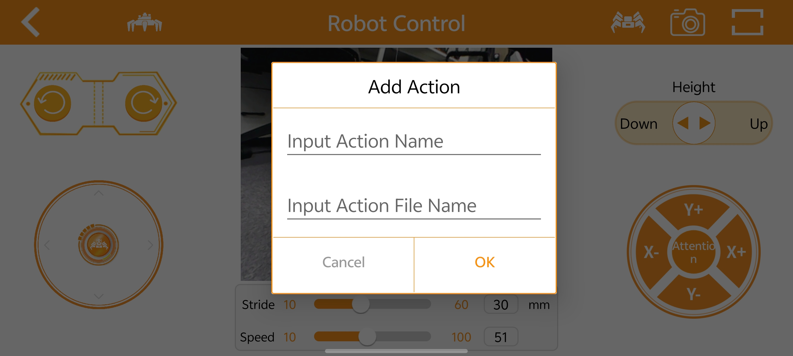

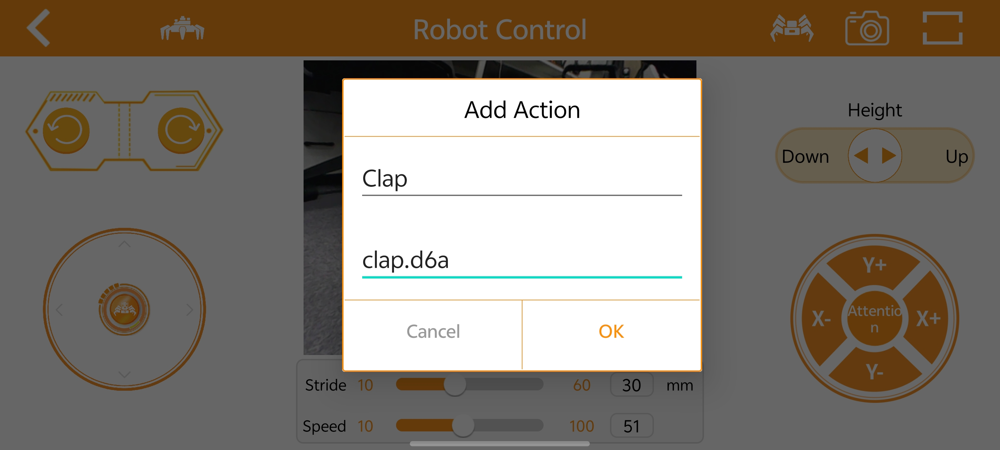

> [!NOTE]
>
> **The Action Name field can be customized freely. The Action File Name field must match the filename of an action group stored on JetHexa. To check specific action group filenames, refer to [2.13.1 Viewing Built-in Action Groups](#p2-13-1).**

6. Tap the upper-right icon, and then tap **Clap** to execute the action:

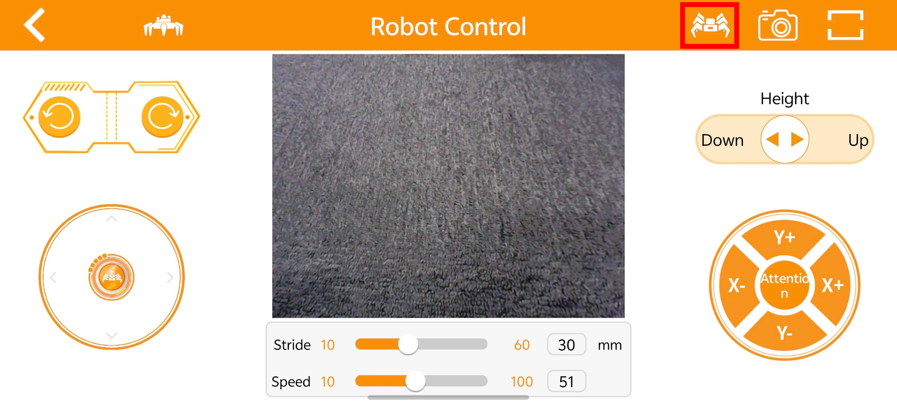

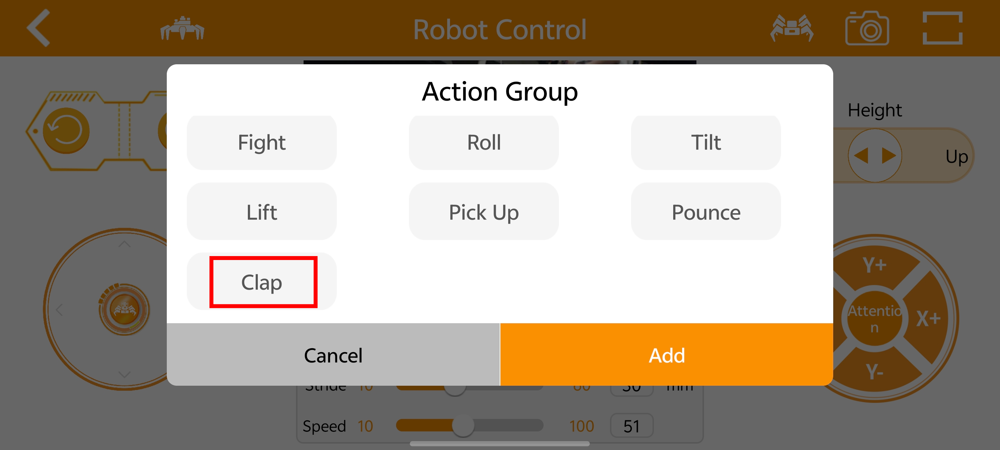

7. To modify the action, long-press **Clap** and follow the pop-up options. Tap **Edit** to modify action settings, or tap **Delete** to remove the selected custom action:

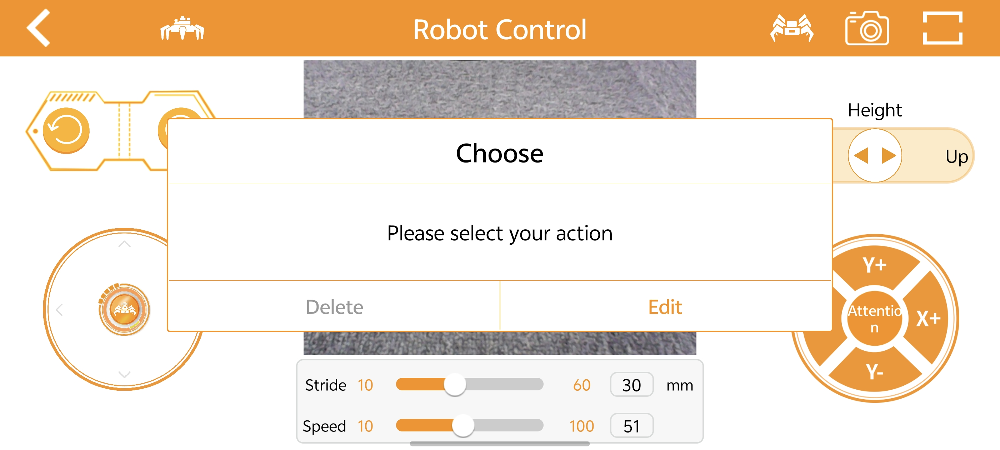

## 2.14 Remote Control via ROS PC Software

> [!NOTE]
>
> **To avoid control conflicts and operational anomalies, do not operate the PC software and the app simultaneously.**

### 2.14.1 Installing PC Software

The installation package for the PC software is located under [2. Software/6. PC Software](https://drive.google.com/drive/folders/1Z08UiZ_qiEyFK95Ah7VCH5FYTr6HLHie?usp=sharing). Double-click **JetHexa Terminal.exe** to launch the software.

### 2.14.2 Connecting PC Software

1. Power on JetHexa.

2. Open the computer network settings. Note that desktop computers require a wireless network adapter. If the robot operates in direct connection mode, connect the computer to the robot Wi-Fi hotspot. If in LAN mode, connect the computer to the same local area network.

3. Double-click the desktop shortcut to launch the PC software:

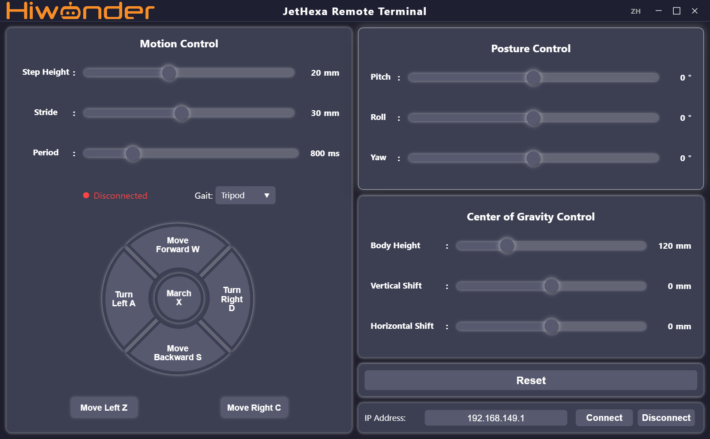

4. Enter the corresponding IP address, where the default IP in direct connection mode is **192.168.149.1**, click **Connect** in the lower-right area of the interface, and wait briefly for the connection to establish:

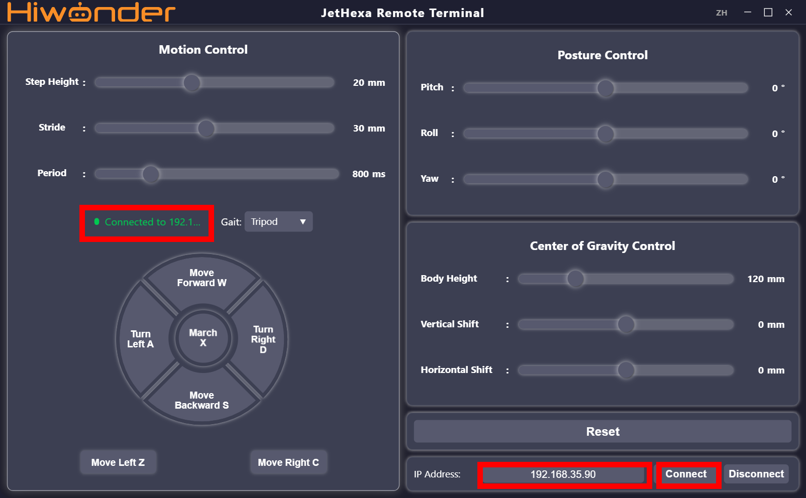

### 2.14.3 Interface Description

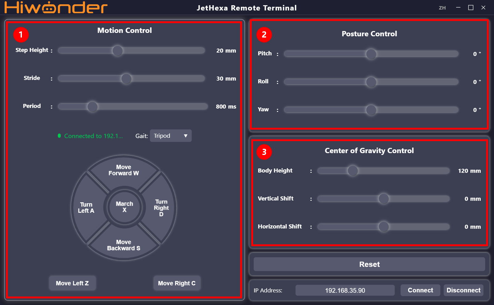

* **Movement Control Area**

| Icon | Description |
| :---: | :--- |
|  | Sets the step height of JetHexa, representing the maximum lift distance of the foot tip, measured in mm. |
|  | Sets the stride length of JetHexa, measured in mm. |
|  | Sets the gait cycle of JetHexa, representing the time required to complete a full gait cycle, measured in ms. |
| 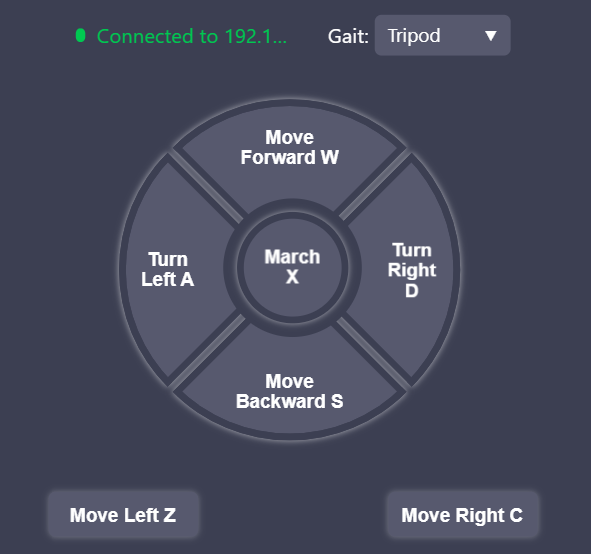 | Configures the gait of JetHexa, selectable between ripple gait and tripod gait. Click a direction button to execute a single motion step, while long-pressing the button to execute continuous motion. |

* **Pose Control Area**

| Icon | Description |
| :---: | :--- |
|  | Sets the pitch angle of JetHexa from the first-person perspective of the robot, controlling upward and downward tilt. Positive values tilt upward, and negative values tilt downward. Greater absolute values produce larger tilt angles. |
|  | Sets the roll angle of JetHexa from the first-person perspective of the robot, controlling left and right body tilt. Negative values tilt to the right, and positive values tilt to the left. Greater absolute values produce larger tilt angles. |
|  | Sets the yaw angle of JetHexa from the first-person perspective of the robot, controlling body twist. Positive values twist left, and negative values twist right. Greater absolute values produce larger twist angles. |

* **Center of Gravity Adjustment Area**

| Icon | Description |
| :---: | :--- |
|  | Sets the chassis height of JetHexa, measured in mm. |
|  | Sets the longitudinal center of gravity offset. Positive values shift the center of gravity forward, and negative values shift it backward. |
|  | Sets the lateral center of gravity offset. Positive values shift the center of gravity to the left, and negative values shift it to the right. |

## 2.15 IMU Calibration

> [!NOTE]
>
> **Calibration minimizes measurement deviations. Since minor hardware deviations inevitably persist, adjust the parameters until they satisfy practical operational requirements.**

An Inertial Measurement Unit, or IMU, measures the 3-axis attitude angles, angular velocities, and accelerations of an object. The gyroscope and accelerometer constitute the primary sensing elements of the IMU, providing 6 degrees of freedom to measure angular velocity and acceleration in 3D space.

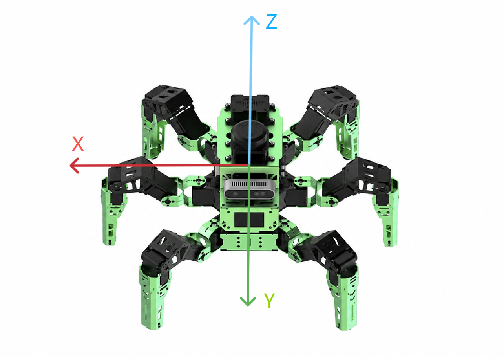

The diagram above illustrates the positive directions of the x, y, and z axes of the IMU. Refer to these coordinate relationships during calibration. When the calibration node receives the first IMU message, it prompts the operator to hold the IMU in a specific orientation, and then press **Enter** to record the measurement. After completing all 6 orientations, the node computes calibration parameters and writes them to the specified YAML file:

1. Power on the robot and connect to the remote desktop software **NoMachine**.

2. Click the desktop icon  to open the command-line terminal.

3. Enter the command below and press **Enter** to disable auto-start services:

```bash
~/.stop_ros.sh
```

4. Enter the command below and press **Enter**:

```bash
ros2 launch ros_robot_controller ros_robot_controller.launch.py
```

5. Open a new terminal window, enter the command below, and press **Enter** to start IMU calibration:

```bash
ros2 run imu_calib do_calib --ros-args -r imu:=/ros_robot_controller/imu_raw --param output_file:=/home/ubuntu/ros2_ws/src/peripherals/config/imu_calib.yaml
```

6. The terminal displays a prompt indicating readiness to calibrate the positive x-axis angular velocity deviation. Place the robot on its side as shown in the diagram below, ensuring that the tilt direction and angle match the illustration, and press **Enter** to execute:

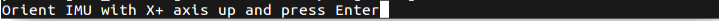

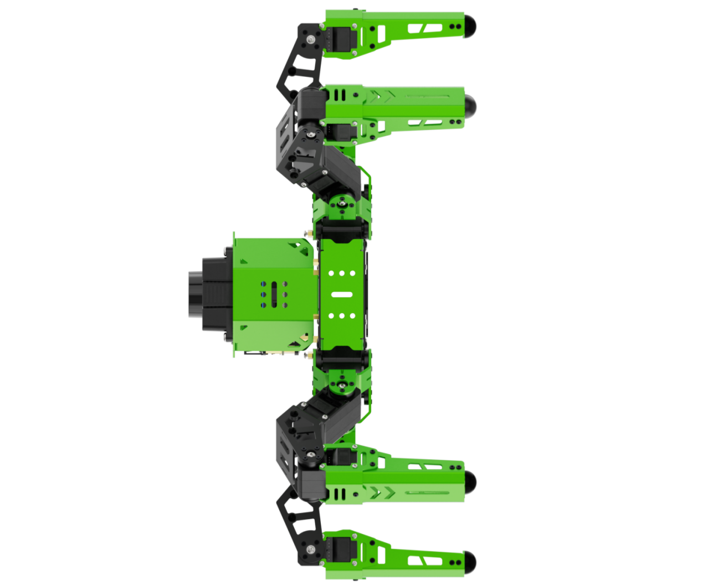

After each orientation is successfully calibrated, the terminal displays the confirmation below:


7. The terminal then prompts readiness to calibrate the negative x-axis angular velocity deviation. Position the robot on its side according to the diagram below, ensuring that the orientation matches the diagram, and press **Enter** to execute:


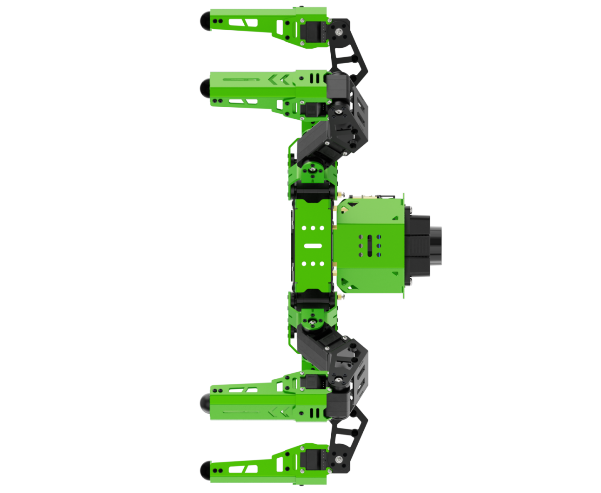

8. The terminal prompts readiness to calibrate the positive y-axis angular velocity deviation. Orient the robot facing upward as shown below, ensuring that the tilt direction matches the diagram, and press **Enter** to execute:


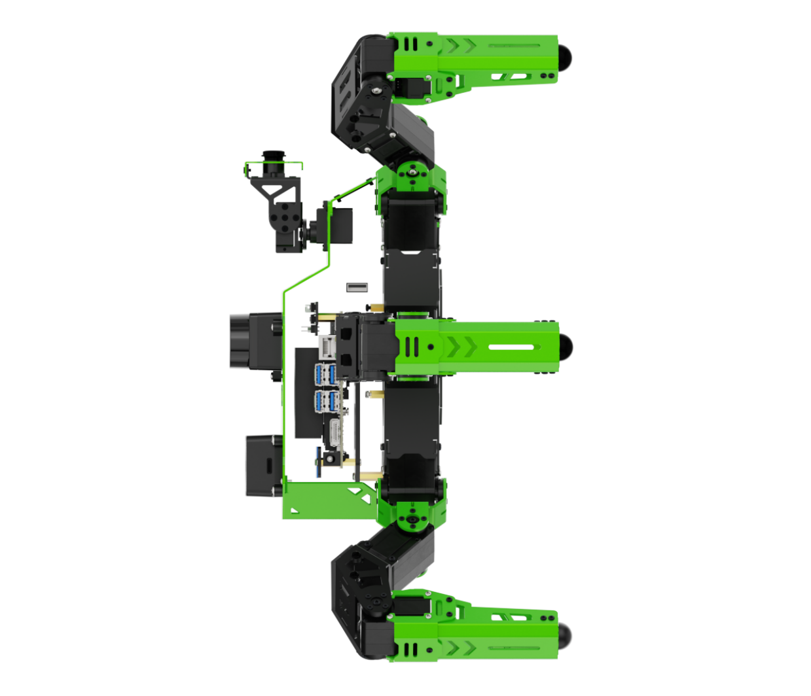

9. The terminal prompts readiness to calibrate the negative y-axis angular velocity deviation. Orient the robot facing downward as shown below, ensuring that the direction and angle match the diagram, and press **Enter** to execute:


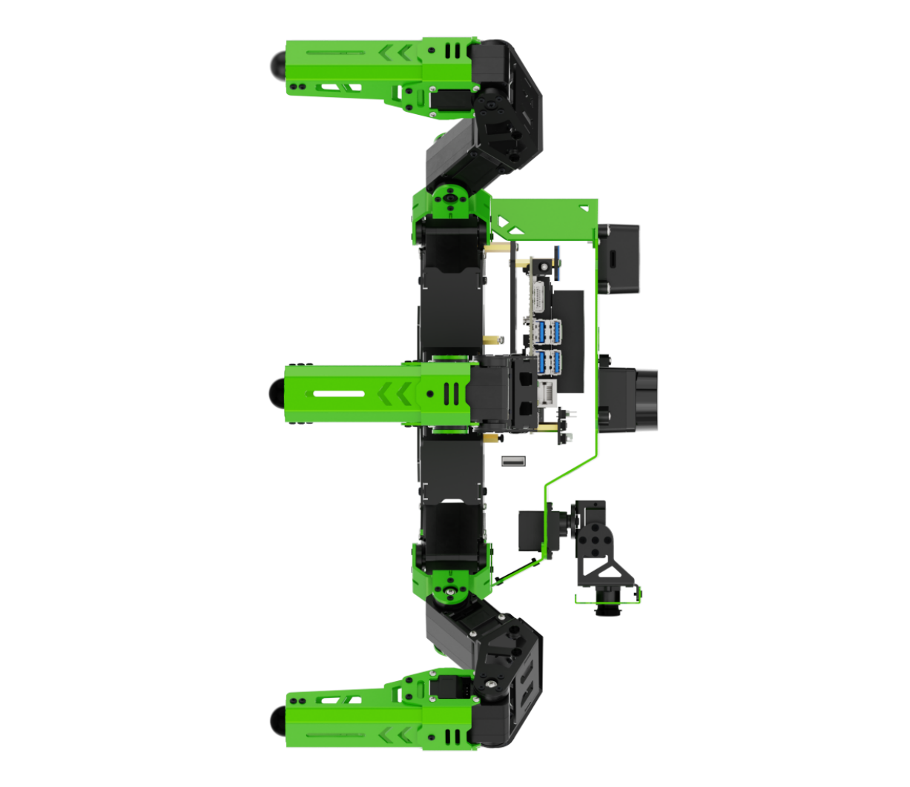

10. The terminal prompts readiness to calibrate the positive z-axis angular velocity deviation. Pick up the robot, place it upright facing upward, hold it steady, and press **Enter**. Position the robot as illustrated below and press **Enter** to execute:


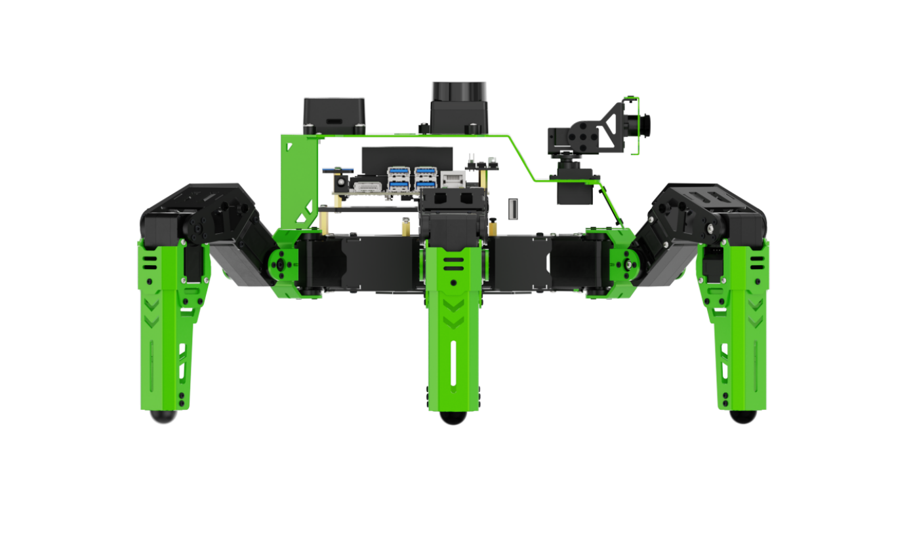

11. The terminal prompts readiness to calibrate the negative z-axis angular velocity deviation. Position the robot as illustrated below, ensuring that the orientation matches the diagram, and press **Enter** to execute:


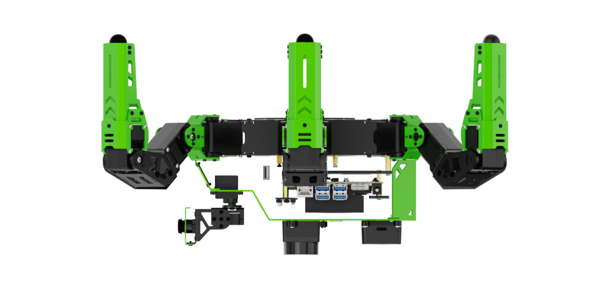

12. The terminal displays the prompt below, confirming that calibration is complete:


13. After calibration completes, enter the command below to verify the calibrated IMU output:

```bash
ros2 launch peripherals imu_view.launch.py
```

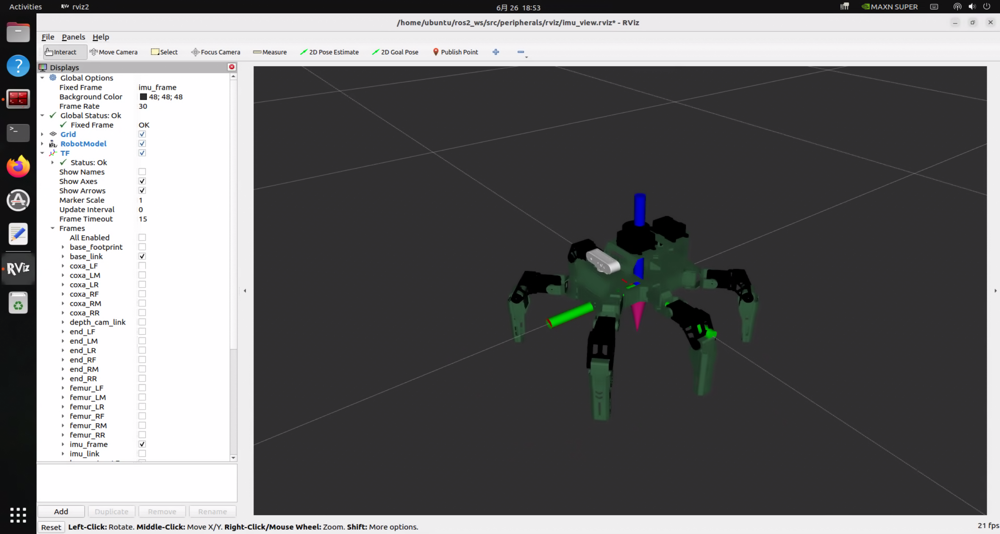

<p id ="p2-16"></p>

## 2.16 Robot Deviation Adjustment

During operation, mechanical angle deviations of on-board servos may increase with cumulative operating time. If joints fail to reach designated target positions when executing actions, manually adjust the servo deviations according to this section.

> [!NOTE]
>
> **Servo deviations are pre-calibrated prior to shipment. Deviation adjustment is unnecessary upon initial use or during short-term operation. Adjust the servo deviations only when significant deviations impair normal robot functionality.**

<p id ="p2-16-1"></p>

### 2.16.1 Adjustment Criteria

Before adjusting servo deviations, review the servo IDs in the PC software:

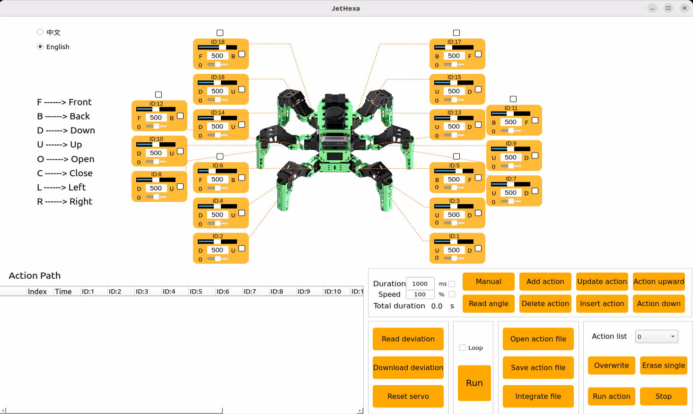

When adjusting servo deviations, refer to the standard alignment diagrams. A robot passes deviation qualification only when both of the following criteria are met simultaneously:

1. The leg segments form a 90° right angle in the centered state:

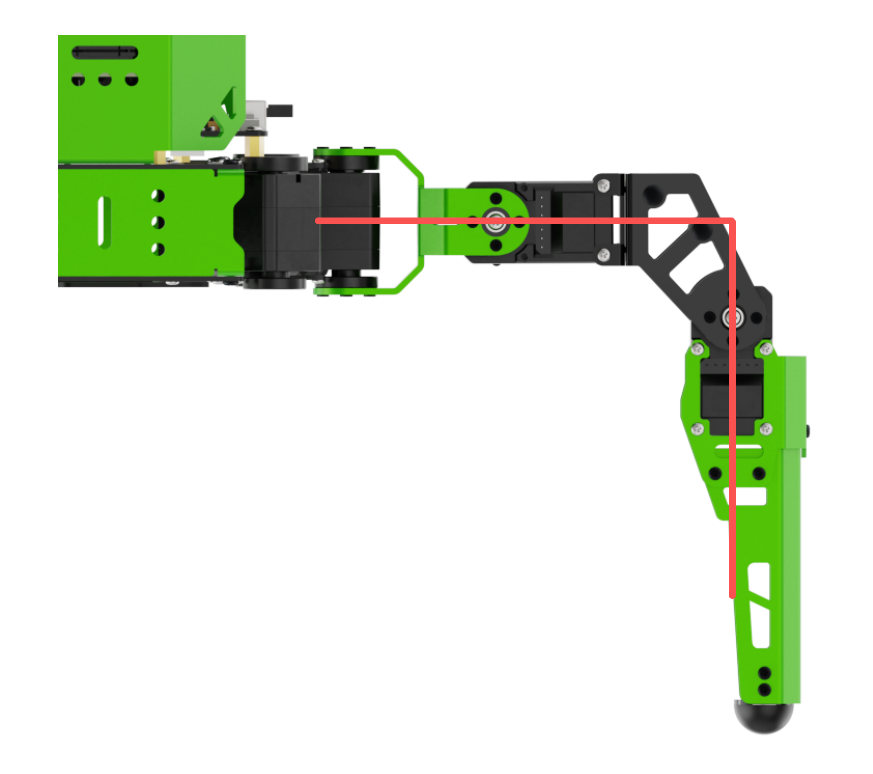

2. The outer edge of the large U-bracket is parallel to the inner edge of the servo bracket:

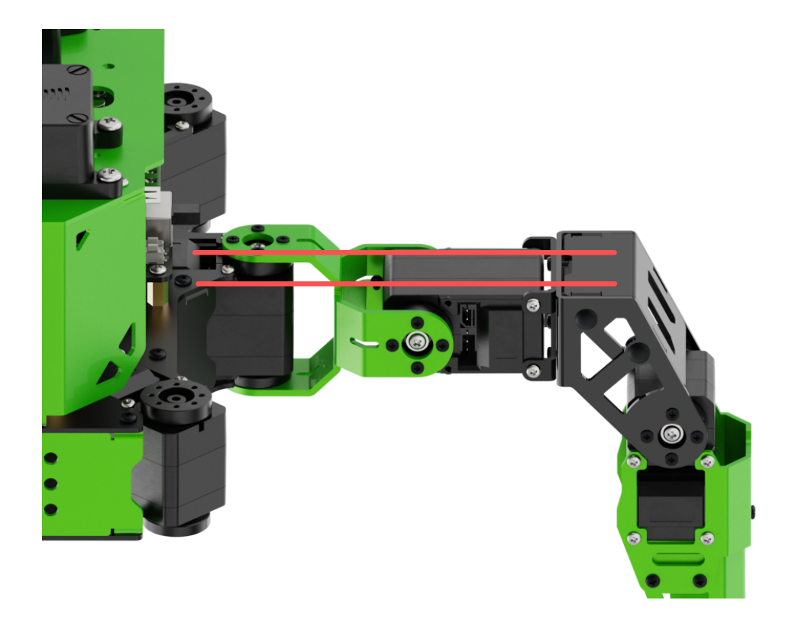

### 2.16.2 Adjustment Procedure

After reviewing the adjustment criteria, adjust the robot deviations according to the steps below:

1. Connect to the robot, and then double-click the JetHexa PC software desktop shortcut 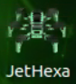 to launch the software.

2. Click **Reset servo** and check whether the ID 2 servo on the leg exhibits deviation:

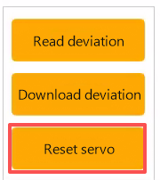

3. Click **Read deviation** to retrieve the current deviation values of the on-board servos:

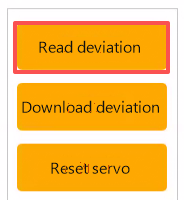

4. When the pop-up dialog displays confirmation of successful deviation retrieval, click **OK**:


5. Check the deviation value of the ID 2 servo as shown below. In the interface, each servo displays its ID number: the upper slider indicates the current position, the middle value displays the position reading, and the lower slider indicates the configured deviation value:

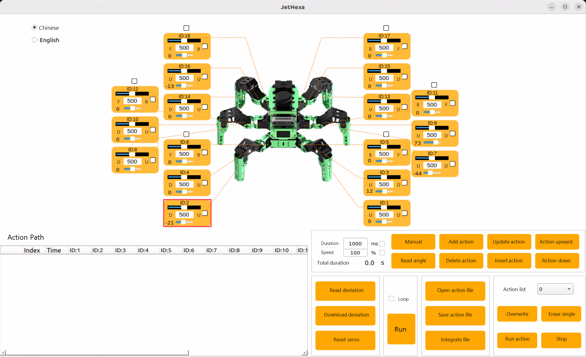

6. The current deviation value of the ID 2 servo is -21. When such a deviation occurs, adjust the slider in the opposite direction until the leg aligns with the first criterion described in [2.16.1 Adjustment Criteria](#p2-16-1):


7. Once the deviation value of the ID 2 servo is adjusted to 6, the deviation setting for the ID 2 servo is complete. Follow the subsequent steps to save this value to the robot system so that the robot loads the saved deviation upon startup. Adjust other servo IDs following the same procedure:


8. Click **Download deviation**:

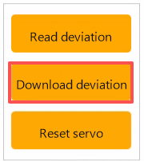

9. When the pop-up dialog displays confirmation of successful deviation download, click **OK** to close the window, completing deviation adjustment for the ID 2 servo:

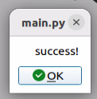

10. To return the robot to its initial state, select **init** from the action group dropdown and click **Run action**:

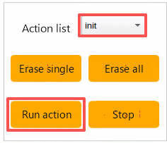

11. If other bus servos exhibit deviations exceeding acceptable standards, repeat the steps above to adjust the deviations using the corresponding sliders in the PC software.

## 2.17 Servo ID Configuration

When replacing a servo, use the servo debugging tool to configure servo parameters such as the ID and center position. Refer to the PC software interface to identify the ID assigned to each servo.

> [!NOTE]
>
> **Connect only one servo to the servo port during debugging. Daisy-chaining multiple servos will configure all connected servos with identical parameters, preventing independent control.**

### 2.17.1 Servo Debugging Interface Overview

> [!NOTE]
>
> **Terminal commands are strictly case-sensitive. Press Tab to auto-complete keywords.**

1. Power on the robot and connect to the remote desktop software **NoMachine**.

2. Click the desktop icon  to open the command-line terminal.

3. Enter the command below and press **Enter** to navigate to the servo debugging tool directory:

```bash
cd software/servo_tool
```

4. Enter the command below and press **Enter** to launch the tool:

```bash
python3 main.py
```

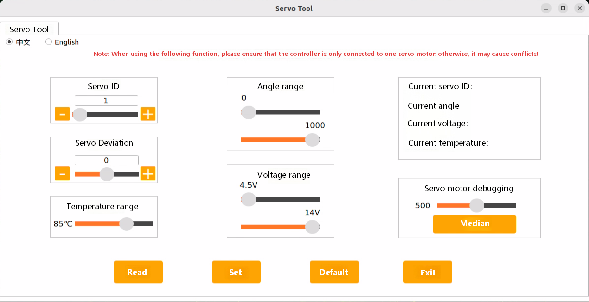

| Icon | Function Description |
| :---: | :--- |
|  | Reads the current parameters of the servo. |
|  | Sets the parameters for the current servo. |
|  | Resets the servo to factory default parameters. |
| 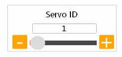 | Configures the servo ID, with an allowable range of 0–253. |
| 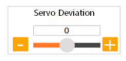 | Adjusts the servo deviation. |
| 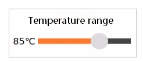 | Adjusts the operating temperature range of the servo, typically maintained at the default 85°C. |
| 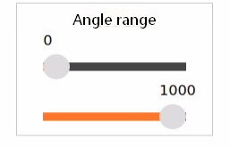 | Adjusts the angular rotation range of the servo as needed, with a range of 0–1000 on the JetHexa chassis. |
| 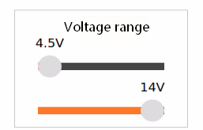 | Adjusts the operating voltage range of the servo to provide voltage protection, with a range of 9–12.6 V on the JetHexa chassis. |
| 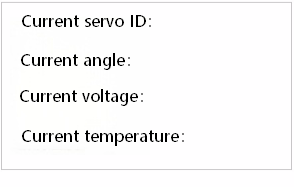 | Displays the current ID, position, voltage, and temperature of the servo. |
|  | Drag the slider and click **Set** to adjust the rotation position. Click **Center** and then **Set** to return the servo to position 500. |

### 2.17.2 Servo Debugging Procedure

1. Connect a single servo to the servo port:

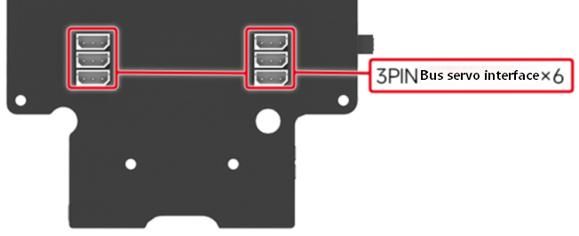

2. Open the servo debugging tool and click **Read**:

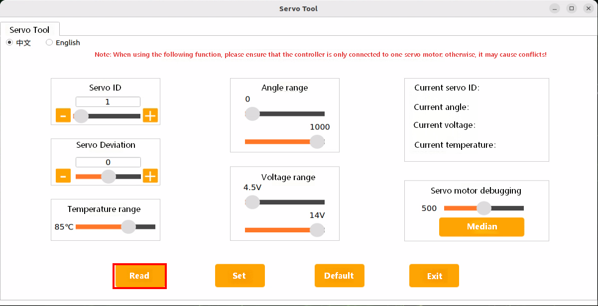

3. Using the ID 3 servo as an example, configure the servo ID while maintaining other parameters at their defaults, or configure them as needed:

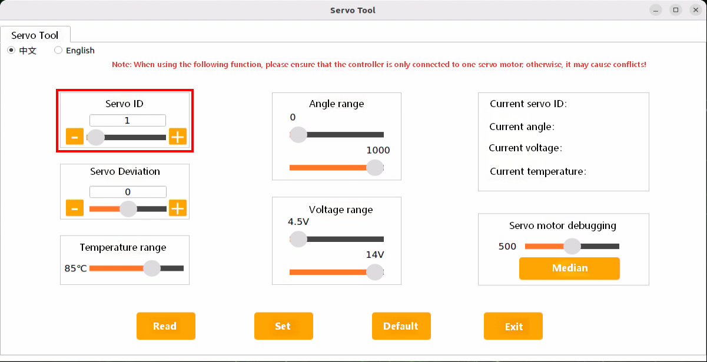

4. After configuration completes, click **Set** and then **Exit**:

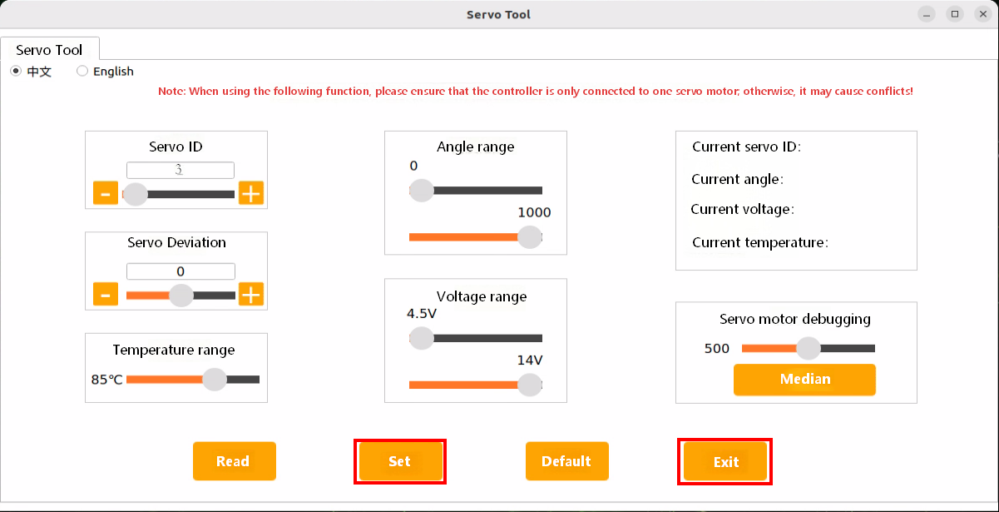

# 2.2 Advanced Kinematics Control

<p id ="p2-16"></p>

## 2.16 Coordinate System Establishment for Hexapod Robot

### 2.16.1 Coordinate System Introduction

In controlling the movement of JetHexa, foothold coordinates for the six robot legs are input to the inverse kinematics algorithm, which calculates and outputs the rotation angles for all servos to achieve coordinated locomotion.

The coordinate system of JetHexa must first be established. When constructing the coordinate system, the center of the JetHexa body serves as the origin coordinate `(0, 0, 0)`. From the first-person perspective of the robot, the positive direction of the X-axis points forward, the positive direction of the Y-axis points to the left, and the positive direction of the Z-axis points upward, as shown in the figure below:


When configuring coordinates, only the X-axis, Y-axis, and Z-axis values of the footholds for the six legs need to be specified.

### 2.16.2 Coordinate Description

For clear illustration, the following explanation uses the initial posture coordinates of JetHexa as an example.
The source code is located at: **/home/ubuntu/ros2_ws/src/driver/controller/controller/bulid_in_pose.py**

The program defines three initial coordinate points and height values:

```python
X1 = 93.60
Y1 = 50.805
X2 = 0.0
Y2 = 73.535

INITIAL_X = 70.0
INITIAL_Y = 110.0
INITIAL_HEIGHT = 70.0
INITIAL_HEIGHT_M = 95
SLAM_HEIGHT = 100.0
```

The positions of servo 11 and servo 5 are shown in the figure below:

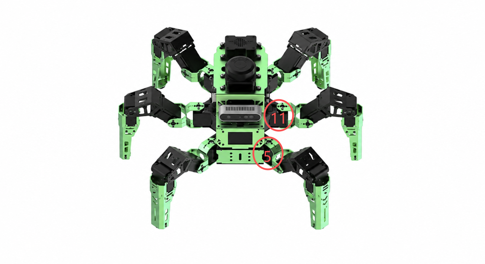

1. `(X1, Y1)` represents the innermost coordinate values of the left front leg, corresponding to servo ID 5, indicating the offset from the servo rotation axis to the robot center.

2. `(X2, Y2)` represents the innermost coordinate values of the left middle leg, corresponding to servo ID 11, indicating the offset from the servo rotation axis to the robot center.

3. `(INITIAL_X, INITIAL_Y)` represents the offset from the tip of each leg to the innermost servo rotation axis.

4. `INITIAL_HEIGHT` represents the vertical height offset from the tip of each leg to the robot center.

5. `INITIAL_HEIGHT_M` represents the vertical height offset from the tip of each leg to the robot center during mapping.

6. `SLAM_HEIGHT` represents the vertical height of the robot center during mapping.

```python
DEFAULT_POSE = ((INITIAL_X + X1, INITIAL_Y + Y1 - 20, -INITIAL_HEIGHT),\
                (0.0, INITIAL_Y + Y2, -INITIAL_HEIGHT),\
                (-INITIAL_X - X1, INITIAL_Y + Y1 - 20, -INITIAL_HEIGHT),\
                (-INITIAL_X - X1, -INITIAL_Y - Y1 + 20, -INITIAL_HEIGHT),\
                (0.0, -INITIAL_Y - Y2, -INITIAL_HEIGHT),\
                (INITIAL_X + X1, -INITIAL_Y - Y1 + 20, -INITIAL_HEIGHT))

DEFAULT_POSE_M = ((INITIAL_X + X1, INITIAL_Y + Y1 - 20, -INITIAL_HEIGHT_M),\
                (0.0, INITIAL_Y + Y2, -INITIAL_HEIGHT_M),\
                (-INITIAL_X - X1, INITIAL_Y + Y1 - 20, -INITIAL_HEIGHT_M),\
                (-INITIAL_X - X1, -INITIAL_Y - Y1 + 20, -INITIAL_HEIGHT_M),\
                (0.0, -INITIAL_Y - Y2, -INITIAL_HEIGHT_M),\
                (INITIAL_X + X1, -INITIAL_Y - Y1 + 20, -INITIAL_HEIGHT_M))
```

In the initial posture, the foothold positions of the six robot legs are calculated based on the three initial coordinate points and height values described above. The first coordinate corresponds to the foothold of leg 1, and the remaining coordinates are arranged counterclockwise in sequential order. The variable `DEFAULT_POSE` defines the default posture during robot operation, while `DEFAULT_POSE_M` defines the posture used during SLAM mapping and navigation. The leg numbering scheme is illustrated in the figure below:

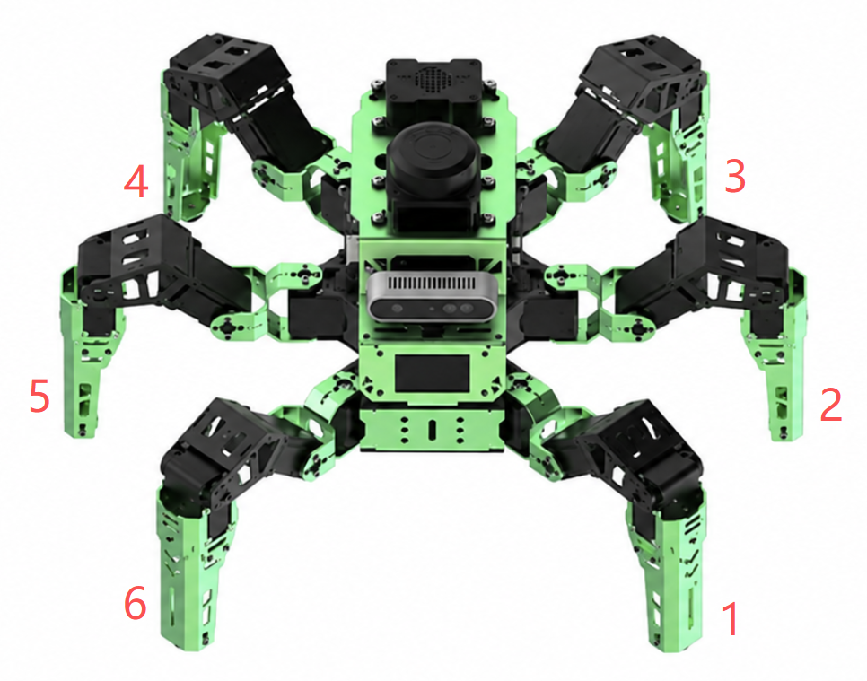

<p id ="p2-17"></p>

## 2.17 Brief Inverse Kinematics Analysis

### 2.17.1 Introduction to Inverse Kinematics

Inverse kinematics, abbreviated as IK, serves as an essential foundation for trajectory planning and motion control in JetHexa. The speed and accuracy of the inverse kinematics calculation directly determine the precision of trajectory planning and control. Designing a fast and accurate inverse kinematics solver is therefore critical.

For JetHexa, inverse kinematics calculates the rotation angles of the three servos on each leg based on the coordinates of each leg tip. The servo positions and leg numbering are illustrated in the figure below:

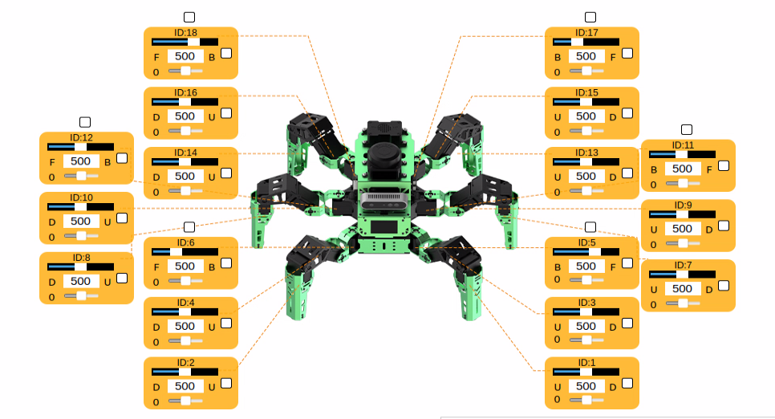

### 2.17.2 Brief Case Analysis of Inverse Kinematics

* **Program Overview**

Based on inverse kinematics analysis, the calculation workflow proceeds as follows:

1. Calculate the movement position of each leg according to the leg tip coordinates to determine the corresponding servo rotation angles.

2. Convert the computed servo rotation angles into control values and drive the servos directly to control the locomotion of JetHexa.

For clearer comprehension, the following section analyzes the inverse kinematics of JetHexa in conjunction with the control program.

* **Operational Steps**

> [!NOTE]
>
> **Command inputs are case-sensitive. Press the Tab key to automatically complete keywords.**

1. Power on JetHexa and connect to it using the remote desktop software **NoMachine**.

2. Click the  icon on the desktop to open the command-line terminal.

3. Enter the following command and press **Enter** to disable auto-start background programs:

```bash
~/.stop_ros.sh
```

4. Enter the following command and press **Enter** to launch the program:

```bash
ros2 launch example body_ik.launch.py
```

5. To terminate the program, press **Ctrl+C** in the terminal window. If the process does not terminate immediately, press the key combination multiple times.

* **Program Outcome**

After launching the program, leg 2 of the hexapod robot retracts and extends according to the configured coordinates, while the terminal outputs the computed servo rotation angles in real time.

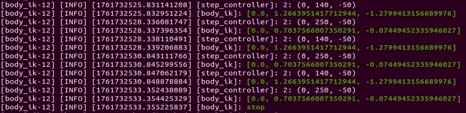

* **Program Analysis**

The source code for this program is located at: **/home/ubuntu/ros2_ws/src/example/example/body_control/include/body_ik.py**

```python
for i in range(3):
	joints = node.controller.set_leg_position(2, (0, 140, -50), 2)
	node.get_logger().info('\033[1;32m%s\033[0m' % str(joints))
	time.sleep(2.5)
	joints = node.controller.set_leg_position(2, (0, 250, -50), 2)
	node.get_logger().info('\033[1;32m%s\033[0m' % str(joints))

node.get_logger().info('\033[1;32m%s\033[0m' % 'stop')
```

The leg servo rotation is primarily controlled via the `set_leg_position` function.

Taking the code line `joints = node.controller.set_leg_position(2, (0, 140, -50), 2)` as an example, the parameters are defined as follows:

* `joints`: Stores the returned servo rotation angles.
* `2`: Specifies the robot leg number, which corresponds to the left middle leg.
* `(0, 140, -50)`: Defines the target coordinate position in the order of X, Y, and Z.
* `2`: Specifies the motion duration, measured in seconds.

* **Coordinate Analysis**

From the first-person perspective of the robot, the robot center serves as the origin. The positive direction of the X-axis points directly forward, the positive direction of the Y-axis points directly leftward, and the positive direction of the Z-axis points directly upward, as shown in the figure below:

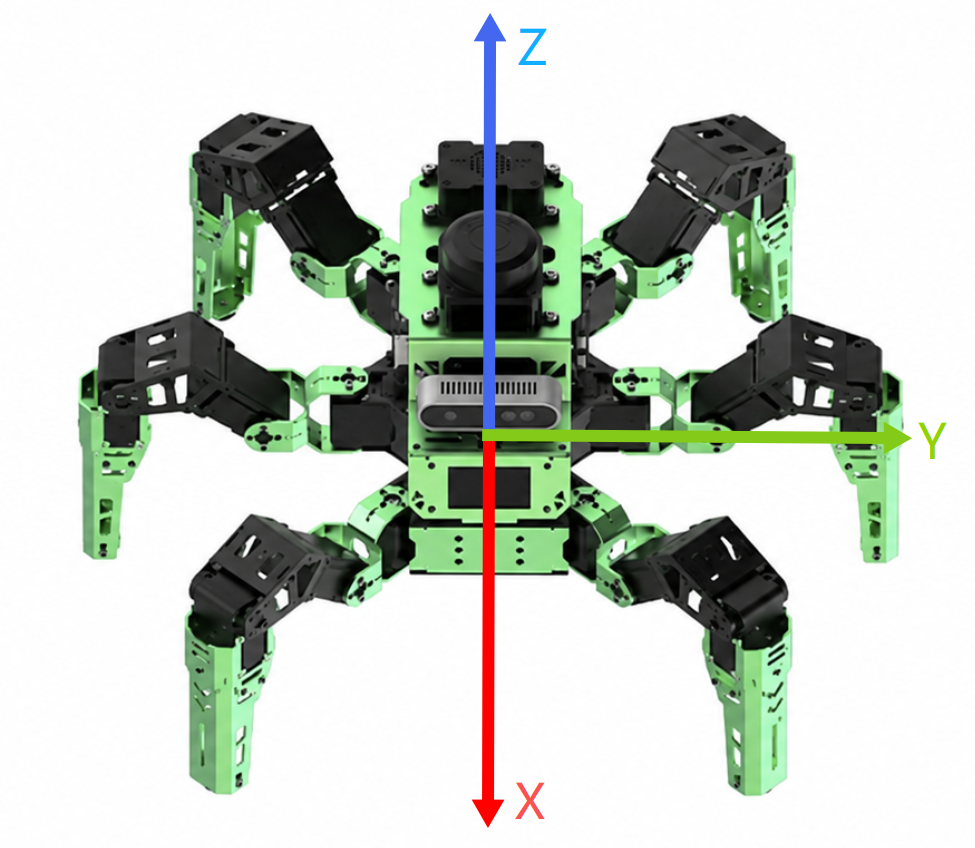

Taking the code line `joints = node.controller.set_leg_position(2, (0, 140, -50), 2)` as an analytical example, `(0, 140, -50)` specifies the target coordinate position of leg 2 relative to the body center, measured in millimeters. Using this coordinate, the `set_leg_position` function calculates the required rotation angles for the three servos with IDs 11, 9, and 7 on leg 2. The calculation results are shown in the figure below:


Because the X-axis coordinate remains unchanged, servo 11 does not rotate.

In the initial posture, the Y-axis coordinate of the tip of leg 2 is approximately 193 mm. Therefore, the Y-axis value decreases in the negative direction to reach the target position of 140 mm.

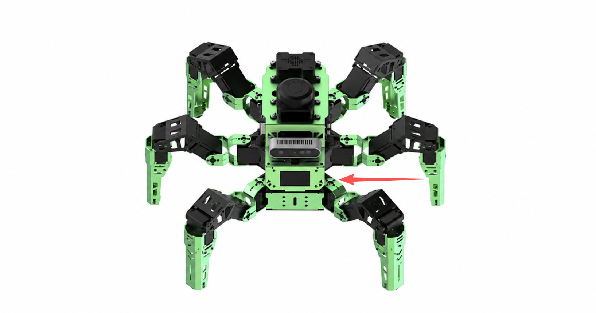

In the initial posture, the Z-axis coordinate of the tip of leg 2 is approximately -60 mm. Therefore, the Z-axis value increases in the positive direction to reach the target position of -50 mm.

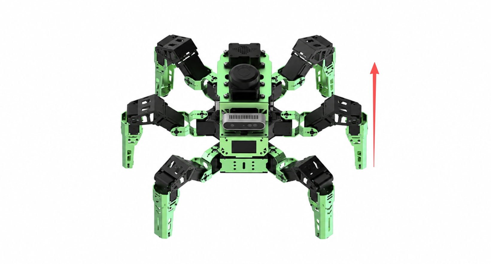

<p id ="p2-18"></p>

## 2.18 Static Posture Parameter Description

### 2.18.1 Program Overview

The posture parameters of JetHexa refer to state parameters when the robot remains stationary, including standing height, pitch angle, and roll angle.

Adjusting the foothold coordinate values of the six legs of JetHexa alters the overall posture of the robot. Posture configuration requires invoking the **step_controller.py** file, which is located at: **/home/ubuntu/ros2_ws/src/driver/controller/controller/step_controller.py**

```python
def transform_pose_euler(self, translate, axis, euler, duration, degrees=True):
        """
        Changes the robot posture using translation transformation and Euler angles.
        :param translate: Translation transformation of body center offset (x, y, z)
        :param axis: Sequence of three Euler angle axes, such as 'xyz' or 'yzx'
        :param euler: Tuple of Euler angles, where the order must match axis
        :param duration: Duration required to complete this transformation
        :param degrees: Specifies whether the Euler angle unit is degrees. True for degrees, False for radians
        """
        rotate = R.from_euler(axis, euler, degrees=degrees)  # Uses Euler angles to create a transformer
        r = rotate.as_euler('xyz', degrees=False)  # Converts into fixed-order Euler angles
        generator = PoseTransformer(PoseTransformerParams(translation=translate, rotation=r, duration=duration))

        if generator:
            with self.lock:
                generator.send(None)
                self.new_pose_transformer = generator
```

### 2.18.2 Parameter Description

Modifying the parameters allows precise adjustment of the static posture of JetHexa. The parameter definition interface is structured as follows:

```python
transform_pose_euler(self, translate, axis, euler, duration, degrees=True)
```

| Parameter   | Description                                                  |
| :---------- | :----------------------------------------------------------- |
| `translate` | Specifies the translation transformation of the body center offset in the format `(x, y, z)`, corresponding to the translation distance along each axis. Positive values indicate the positive direction, negative values indicate the reverse direction, and the values are measured in millimeters. If the specified value exceeds the physical limits of the current posture, the command cannot be executed. |
| `axis`      | Specifies the sequence of the three Euler angle axes. For example, setting 'xyz' executes rotations sequentially around the X, Y, and Z axes. |
| `euler`     | Specifies a tuple of Euler angles representing the rotation angle around each axis. The sequence and length must match the `axis` parameter. Positive values indicate counterclockwise rotation and negative values indicate clockwise rotation. |
| `duration`  | Specifies the duration required to complete the transformation, measured in seconds. |
| `degrees`   | Specifies whether the Euler angle unit is degrees. Setting `True` uses degrees, while `False` uses radians. |

For example, to translate the body forward along the X-axis by 20 mm, rotate clockwise around the X-axis by 15°, rotate counterclockwise around the Y-axis by 15°, and execute the transformation over 2 s, configure the parameters as follows:

```python
transform_pose_euler((20, 0, 0), 'xyz', (-15, 15, 0), 2, degrees=True)
```

<p id ="p2-19"></p>

## 2.19 Walking Height Adjustment

### 2.19.1 Program Overview

This experiment builds upon the ripple gait. By modifying corresponding parameters, JetHexa adjusts its walking height dynamically while advancing in the ripple gait.

### 2.19.2 Operational Steps

> [!NOTE]
>
> **Command inputs are case-sensitive. Press the Tab key to automatically complete keywords.**

1. Power on the robot and connect to it using the remote desktop software **NoMachine**.

2. Click the  icon on the desktop to open the command-line terminal.

3. Enter the following command and press **Enter** to disable auto-start background programs:

```bash
~/.stop_ros.sh
```

4. Enter the following command and press **Enter** to launch the program:

```bash
ros2 launch example height_adjustment.launch.py
```

5. To terminate the program, press **Ctrl+C** in the terminal window. If the process does not terminate immediately, press the key combination multiple times.

### 2.19.3 Program Outcome

While moving forward in the ripple gait, the hexapod robot dynamically raises and lowers its body height.

### 2.19.4 Program Analysis

* **Analysis of Launch File**

The source code is located at: **/home/ubuntu/ros2_ws/src/example/example/body_control/height_adjustment.launch.py**

1. Import required libraries:

```python
import os
from ament_index_python.packages import get_package_share_directory

from launch_ros.actions import Node
from launch import LaunchDescription, LaunchService
from launch.actions import OpaqueFunction, IncludeLaunchDescription
from launch.launch_description_sources import PythonLaunchDescriptionSource
```

2. Define the launch items. Retrieve the path of the **controller** package and include the **controller.launch.py** launch file. Create the ROS 2 node `height_adjustment_node`, specify the executable file, and return the launch list:

```python
def launch_setup(context):
    compiled = os.environ['need_compile']
    if compiled == 'True':
        controller_package_path = get_package_share_directory('controller')
    else:
        controller_package_path = '/home/ubuntu/ros2_ws/src/driver/controller'

    controller_launch = IncludeLaunchDescription(
        PythonLaunchDescriptionSource(
            os.path.join(controller_package_path, 'launch/controller.launch.py')),
    )

    height_adjustment_node = Node(
        package='example',
        executable='height_adjustment',
        output='screen',
    )

    return [
            controller_launch,
            height_adjustment_node,
            ]
```

3. Entry function of the ROS 2 launch file, defining the items to be launched:

```python
def generate_launch_description():
    return LaunchDescription([
        OpaqueFunction(function = launch_setup)
    ])
```

4. Create `LaunchService` and pass the launch description to it for execution:

```python
if __name__ == '__main__':
    # Creates a LaunchDescription object
    ld = generate_launch_description()

    ls = LaunchService()
    ls.include_launch_description(ld)
    ls.run()
```

* **Analysis of Python Source Code**

The source code is located at: **/home/ubuntu/ros2_ws/src/example/example/body_control/include/height_adjustment.py**

1. Instantiate the step controller and initialize the robot default posture and gait parameters:

```python
    def __init__(self):
        super().__init__('height_adjustment')
        self.step_controller = step_controller.StepController()
        self.client = self.create_client(Trigger, '/controller_manager/init_finish')
        self.client.wait_for_service()

        self.step_controller.set_build_in_pose('DEFAULT_POSE', 1)
        time.sleep(1)
        self.step_controller.set_step_mode(1, 40, 15, 0, 0, 0.8, repeat=0) # Moves straight
```

2. Adjust the height primarily by configuring parameters within the `transform_pose_euler` function:

```python
def transform(self):
	for _ in range(10):
		for i in range(20):
			self.step_controller.transform_pose_euler((0, 0, 3), 'xyz', (0,0,0), 0.1) # Raises the body
			time.sleep(0.1)
		for i in range(20):
			self.step_controller.transform_pose_euler((0, 0, -3), 'xyz', (0,0,0), 0.1) # Lowers the body
			time.sleep(0.1)
```

* `(0, 0, 3)`: Specifies the translation transformation of the body center offset in the format `(x, y, z)`, measured in millimeters. This indicates a 3 mm elevation along the Z-axis. The valid range for X and Y is -50 to 50 mm, and the valid range for Z is -30 to 90 mm.
* `'xyz'`: Specifies the sequence of the three Euler angle axes.
* `(0, 0, 0)`: Specifies the tuple of Euler angles corresponding to the order defined by the `axis` parameter. The valid range is -20° to 20°.
* `0.1`: Specifies the time required to complete the transformation, measured in seconds.

3. Reset the robot to the default posture:

```python
def reset(self):
	self.step_controller.set_build_in_pose('DEFAULT_POSE', 1)
	time.sleep(1)
```

### 2.19.5 Modifying Body Height

By default, the program raises or lowers the body by 60 mm per cycle across 20 iterations, corresponding to 3 mm per adjustment. In this example, adjust the increment value of each transformation to 4 mm. From the initial robot posture, the body can descend by up to 30 mm and ascend by up to 90 mm.

> [!NOTE]
>
> **Number of cycles × Adjustment height per cycle < 90 mm. The default number of cycles is 20, and the adjustment height per cycle is 3 mm.**

1. Switch to the source code directory:

```bash
cd /home/ubuntu/ros2_ws/src/example/example/body_control/include
```

2. Enter the following command to edit the code:

```bash
vim height_adjustment.py
```

3. Change the Z-axis transformation values to `4` and `-4`, then press **Esc** and enter `:wq` to save and exit.

```python
for i in range(20):
	self.step_controller.transform_pose_euler((0, 0, 4), 'xyz', (0,0,0), 0.1) # Raises the body
	time.sleep(0.1)
for i in range(20):
	self.step_controller.transform_pose_euler((0, 0, -4), 'xyz', (0,0,0), 0.1) # Lowers the body
	time.sleep(0.1)
```

<p id ="p2-20"></p>

## 2.20 Body Posture Adjustment

### 2.20.1 Program Overview

This experiment modifies corresponding parameters to enable the hexapod robot to adjust its body posture while operating in the ripple gait.

### 2.20.2 Operational Steps

> [!NOTE]
>
> **Command inputs are case-sensitive. Press the Tab key to automatically complete keywords.**

1. Power on the robot and connect to it using the remote desktop software **NoMachine**.

2. Click the  icon on the desktop to open the command-line terminal.

3. Enter the following command and press **Enter** to disable auto-start background programs:

```bash
~/.stop_ros.sh
```

4. Enter the following command and press **Enter** to launch the program:

```bash
ros2 launch example posture_adjustment.launch.py
```

5. To terminate the program, press **Ctrl+C** in the terminal window. If the process does not terminate immediately, press the key combination multiple times.

### 2.20.3 Program Outcome

The body of JetHexa performs two distinct motion sequences:

Part 1: The body rotates 15° clockwise around the X-axis and 15° counterclockwise around the Y-axis to enter a backward-right tilted posture. It then rotates 15° clockwise around the Y-axis and 15° counterclockwise around the X-axis to restore the initial posture.

Part 2: The body translates 40 mm forward and 40 mm to the left to enter a left-shifted posture. It then translates 40 mm backward and 40 mm to the right to return to the initial posture.

### 2.20.4 Program Analysis

* **Analysis of Launch File**

The source code is located at: **/home/ubuntu/ros2_ws/src/example/example/body_control/posture_adjustment.launch.py**

1. Import required libraries:

```python
import os
from ament_index_python.packages import get_package_share_directory

from launch_ros.actions import Node
from launch import LaunchDescription, LaunchService
from launch.actions import OpaqueFunction, IncludeLaunchDescription
from launch.launch_description_sources import PythonLaunchDescriptionSource
```

2. Define the launch items. Retrieve the path of the **controller** package and include the **controller.launch.py** launch file. Create the ROS 2 node `posture_adjustment_node`, specify the executable file, and return the launch list:

```python
def launch_setup(context):
    compiled = os.environ['need_compile']
    if compiled == 'True':
        controller_package_path = get_package_share_directory('controller')
    else:
        controller_package_path = '/home/ubuntu/ros2_ws/src/driver/controller'

    controller_launch = IncludeLaunchDescription(
        PythonLaunchDescriptionSource(
            os.path.join(controller_package_path, 'launch/controller.launch.py')),
    )

    posture_adjustment_node = Node(
        package='example',
        executable='posture_adjustment',
        output='screen',
    )

    return [
            controller_launch,
            posture_adjustment_node,
            ]
```

3. Entry function of the ROS 2 launch file, defining the items to be launched:

```python
def generate_launch_description():
    return LaunchDescription([
        OpaqueFunction(function = launch_setup)
    ])
```

4. Create `LaunchService` and pass the launch description to it for execution:

```python
if __name__ == '__main__':
    # Creates a LaunchDescription object
    ld = generate_launch_description()

    ls = LaunchService()
    ls.include_launch_description(ld)
    ls.run()
```

* **Analysis of Python Source Code**

The source code is located at: **/home/ubuntu/ros2_ws/src/example/example/body_control/include/posture_adjustment.py**

1. Instantiate the step controller and initialize the robot's default posture:

```python
def __init__(self):
	super().__init__('posture_adjustment')
	self.step_controller = step_controller.StepController()
	self.client = self.create_client(Trigger, '/controller_manager/init_finish')
	self.client.wait_for_service()

	self.step_controller.set_build_in_pose('DEFAULT_POSE', 1)
	time.sleep(1)
```

2. Adjust the body posture primarily by setting parameters within the `transform_pose_euler` function:

```python
def transform(self):
	self.step_controller.transform_pose_euler((0, 0, 0), 'xyz', (-15, 0, 0), 1) # Rotates
	time.sleep(1)
	self.step_controller.transform_pose_euler((0, 0, 0), 'xyz', (0, 15, 0), 1) # Rotates
	time.sleep(1)
	self.step_controller.transform_pose_euler((0, 0, 0), 'yxz', (-15, 15, 0), 2) # Note the Euler angle order
	time.sleep(2)
	self.step_controller.transform_pose_euler((40, 0, 0), 'xyz', (0, 0, 0), 1) # Translates, unit: mm
	time.sleep(1)
	self.step_controller.transform_pose_euler((0, 40, 0), 'xyz', (0, 0, 0), 1) # Translates, unit: mm
	time.sleep(1)
	self.step_controller.transform_pose_euler((-40, -40, 0), 'xyz', (0, 0, 0), 2) # Translates, unit: mm
	time.sleep(1)
```

* `(40, 0, 0)`: Specifies the translation transformation of the body center offset in the format `(x, y, z)`, measured in millimeters. This indicates a 40 mm displacement along the positive direction of the X-axis. The valid range for X and Y is -50 to 50 mm, and the valid range for Z is -30 to 90 mm.
* `'xyz'`: Specifies the sequence of the three Euler angle axes.
* `(-15, 0, 0)`: Specifies the tuple of Euler angles corresponding to the order defined by the `axis` parameter. The valid range is -20° to 20°.
* `1`: Specifies the duration required to complete the transformation, measured in seconds.

3. Reset the robot to the default posture:

```python
def reset(self):
	self.step_controller.set_build_in_pose('DEFAULT_POSE', 1)
	time.sleep(1)
```

### 2.20.5 Modifying Body Height

After program execution, the Euler angle sequence of the first motion is 'xyz'. In this step, modify the sequence to 'yxz'.

1. Switch to the source code directory:

```bash
cd /home/ubuntu/ros2_ws/src/example/example/body_control/include
```

2. Enter the following command to edit the code:

```bash
vim posture_adjustment.py
```

3. Modify the Euler angle sequence of the first motion to `'yxz'`, then press **Esc** and enter `:wq` to save and exit.

```python
def transform(self):
	self.step_controller.transform_pose_euler((0, 0, 0), 'yxz', (-15, 0, 0), 1) # Rotates
	time.sleep(1)
```

<p id ="p2-21"></p>

## 2.21 Body Wave

### 2.21.1 Program Overview

This experiment modifies corresponding parameters to command JetHexa to execute body wave motions in the ripple gait.

### 2.21.2 Operational Steps

> [!NOTE]
>
> **Command inputs are case-sensitive. Press the Tab key to automatically complete keywords.**

1. Power on the robot and connect to it using the remote desktop software **NoMachine**.

2. Click the  icon on the desktop to open the command-line terminal.

3. Enter the following command and press **Enter** to disable auto-start background programs:

```bash
~/.stop_ros.sh
```

4. Enter the following command and press **Enter** to launch the program:

```bash
ros2 launch example body_wave.launch.py
```

5. To terminate the program, press **Ctrl+C** in the terminal window. If the process does not terminate immediately, press the key combination multiple times.

### 2.21.3 Program Outcome

The body of the hexapod robot continuously sways front-to-back and side-to-side. Initially, the sway amplitude and frequency gradually increase. After a period of time, the sway amplitude and frequency decrease progressively until the robot returns to its initial posture.

### 2.21.4 Program Analysis

* **Analysis of Launch File**

The source code is located at: **/home/ubuntu/ros2_ws/src/example/example/body_control/body_wave.launch.py**

1. Import required libraries:

```python
import os
from ament_index_python.packages import get_package_share_directory

from launch_ros.actions import Node
from launch import LaunchDescription, LaunchService
from launch.actions import OpaqueFunction, IncludeLaunchDescription
from launch.launch_description_sources import PythonLaunchDescriptionSource
```

2. Define the launch items. Retrieve the path of the **controller** package and include the **controller.launch.py** launch file. Create the ROS 2 node `body_wave_node`, specify the executable file, and return the launch list:

```python
def launch_setup(context):
    compiled = os.environ['need_compile']
    if compiled == 'True':
        controller_package_path = get_package_share_directory('controller')
    else:
        controller_package_path = '/home/ubuntu/ros2_ws/src/driver/controller'

    controller_launch = IncludeLaunchDescription(
        PythonLaunchDescriptionSource(
            os.path.join(controller_package_path, 'launch/controller.launch.py')),
    )

    body_wave_node = Node(
        package='example',
        executable='body_wave',
        output='screen',
    )

    return [
            controller_launch,
            body_wave_node,
            ]
```

3. Entry function of the ROS 2 launch file, defining the items to be launched:

```python
def generate_launch_description():
    return LaunchDescription([
        OpaqueFunction(function = launch_setup)
    ])
```

4. Create `LaunchService` and pass the launch description to it for execution:

```python
if __name__ == '__main__':
    # Creates a LaunchDescription object
    ld = generate_launch_description()

    ls = LaunchService()
    ls.include_launch_description(ld)
    ls.run()
```

* **Analysis of Python Source Code**

The source code is located at: **/home/ubuntu/ros2_ws/src/example/example/body_control/include/body_wave.py**

1. Instantiate the step controller and initialize the robot's default posture:

```python
def __init__(self):
	super().__init__('posture_adjustment')
	self.step_controller = step_controller.StepController()
	self.client = self.create_client(Trigger, '/controller_manager/init_finish')
	self.client.wait_for_service()

	self.step_controller.set_build_in_pose('DEFAULT_POSE', 1)
	time.sleep(1)
```

2. Adjust the posture primarily by configuring parameters within the `transform_euler` function. This function uses translation transformations and Euler angles to transform the posture and returns updated leg tip coordinates:

```python
	def wave(self):
        """
        Body wave motion
        """
        duration = 0.03
        org_pose = tuple(build_in_pose.DEFAULT_POSE_M)
        time.sleep(0.8)
        # Gradually accelerates and increases the swaying amplitude
        for j in range(7, 16, 2):
            i = 90
            j = min(15, j)
            while i <= 360 + 85:
                if i == 90 and j == 7:
                    t = 0.5
                else:
                    t = duration
                i += 4 + j * 0.30
                x = math.sin(math.radians(i)) * (0.018 * (j + ((i - 90) / 360) * 2))
                y = math.cos(math.radians(i)) * (0.018 * (j + ((i - 90) / 360) * 2))
                pose = kinematics_calculate.transform_euler(org_pose, (0, 0, 0), 'xy', (x, y), degrees=False)
                self.step_controller.set_pose_base(pose, t)
                time.sleep(t)

        # Gradually decelerates and reduces the swaying amplitude
        for j in range(15, 4, -3):
            i = 360 + 85
            while i >= 90:
                i += -(4 + j * 0.30)
                k = 360 + 90 - i + 90
                x = math.sin(math.radians(k)) * (0.018 * (j + (1 - (i - 90) / 360) * -3))
                y = math.cos(math.radians(k)) * (0.018 * (j + (1 - (i - 90) / 360) * -3))
                pose = kinematics_calculate.transform_euler(org_pose, (0, 0, 0), 'xy', (x, y), degrees=False)
                self.step_controller.set_pose_base(pose, duration)
                time.sleep(duration)
```

3. Parameters of the `transform_euler` function:

* `pose`: Specifies the target posture to transform.
* `translate`: Specifies the translation transformation of the body center offset, measured in millimeters, with the allowable range determined by the current robot physical posture. The valid range for X and Y is -50 to 50 mm, and the valid range for Z is -30 to 90 mm.
* `axis`: Specifies the sequence of the Euler angle axes.
* `euler`: Specifies a tuple of Euler angles representing the rotation angle around each axis. The sequence and length must match the `axis` parameter. Positive values indicate counterclockwise rotation and negative values indicate clockwise rotation. The valid range is -20° to 20°.
* `degrees`: Specifies whether the Euler angle unit is degrees. Setting `True` uses degrees, while `False` uses radians.

4. Reset the robot to the default posture:

```python
def reset(self):
	self.step_controller.set_build_in_pose('DEFAULT_POSE', 1)
	time.sleep(1)
```

### 2.21.5 Modifying Wave Amplitude

During program execution, the swaying amplitude varies significantly during the initial phase. In this step, modify the growth rate to achieve a gentler amplitude increase.

1. Switch to the source code directory:

```bash
cd /home/ubuntu/ros2_ws/src/example/example/body_control/include
```

2. Enter the following command to edit the code:

```bash
vim body_wave.py
```

3. Modify the increment coefficient of variable `i` from `0.3` to `0.2`, then press **Esc** and enter `:wq` to save and exit.

```python
 	# Gradually accelerates and increases the swaying amplitude
        for j in range(7, 16, 2):
            i = 90
            j = min(15, j)
            while i <= 360 + 85:
                if i == 90 and j == 7:
                    t = 0.5
                else:
                    t = duration
                i += 4 + j * 0.20
```

<p id ="p2-22"></p>

## 2.22 Body Dance - Center of Mass

### 2.22.1 Program Overview

This experiment modifies corresponding parameters to enable the hexapod robot to dance its body in a circular pattern in place.

### 2.22.2 Operational Steps

> [!NOTE]
>
> **Command inputs are case-sensitive. Press the Tab key to automatically complete keywords.**

1. Power on the robot and connect to it using the remote desktop software **NoMachine**.

2. Click the  icon on the desktop to open the command-line terminal.

3. Enter the following command and press **Enter** to disable auto-start background programs:

```bash
~/.stop_ros.sh
```

4. Enter the following command and press **Enter** to launch the program:

```bash
ros2 launch example body_circle.launch.py
```

5. To terminate the program, press **Ctrl+C** in the terminal window. If the process does not terminate immediately, press the key combination multiple times.

### 2.22.3 Program Outcome

The body of JetHexa moves in a circular path around its center of mass, with the radius of the circular dance pattern gradually expanding.

### 2.22.4 Program Analysis

* **Analysis of Launch File**

The source code is located at: **/home/ubuntu/ros2_ws/src/example/example/body_control/body_circle.launch.py**

1. Import required libraries:

```python
import os
from ament_index_python.packages import get_package_share_directory

from launch_ros.actions import Node
from launch import LaunchDescription, LaunchService
from launch.actions import OpaqueFunction, IncludeLaunchDescription
from launch.launch_description_sources import PythonLaunchDescriptionSource
```

2. Define the launch items. Retrieve the path of the **controller** package and include the **controller.launch.py** launch file. Create the ROS 2 node `body_circle_node`, specify the executable file, and return the launch list:

```python
def launch_setup(context):
    compiled = os.environ['need_compile']
    if compiled == 'True':
        controller_package_path = get_package_share_directory('controller')
    else:
        controller_package_path = '/home/ubuntu/ros2_ws/src/driver/controller'

    controller_launch = IncludeLaunchDescription(
        PythonLaunchDescriptionSource(
            os.path.join(controller_package_path, 'launch/controller.launch.py')),
    )

    body_circle_node = Node(
        package='example',
        executable='body_circle',
        output='screen',
    )

    return [
            controller_launch,
            body_circle_node,
            ]
```

3. Entry function of the ROS 2 launch file, defining the items to be launched:

```python
def generate_launch_description():
    return LaunchDescription([
        OpaqueFunction(function = launch_setup)
    ])
```

4. Create `LaunchService` and pass the launch description to it for execution:

```python
if __name__ == '__main__':
    # Creates a LaunchDescription object
    ld = generate_launch_description()

    ls = LaunchService()
    ls.include_launch_description(ld)
    ls.run()
```

* **Analysis of Python Source Code**

The source code is located at: **/home/ubuntu/ros2_ws/src/example/example/body_control/include/body_circle.py**

1. Instantiate the step controller and initialize the robot's default posture:

```python
def __init__(self):
	super().__init__('posture_adjustment')
	self.step_controller = step_controller.StepController()
	self.client = self.create_client(Trigger, '/controller_manager/init_finish')
	self.client.wait_for_service()

	self.step_controller.set_build_in_pose('DEFAULT_POSE', 1)
	time.sleep(1)
```

2. Adjust the posture primarily by configuring parameters within the `transform_euler` function. This function uses translation transformations and Euler angles to transform the posture and returns updated leg tip coordinates:

```python
	def gen_circle(self, r):
        points = []
        for i in range(180, 0, -5):
            x = r * math.cos(math.radians(i))
            y = r * math.sin(math.radians(i))
            points.append((x, y))

        for i in range(360, 180, -5):
            x = r * math.cos(math.radians(i))
            y = r * math.sin(math.radians(i))
            points.append((x, y))
        return points


    def wave(self):
        """
        Body dance motion
        """
        self.step_controller.set_pose_base(build_in_pose.DEFAULT_POSE_M, 0.8)
        org_pose = tuple(build_in_pose.DEFAULT_POSE_M)
        time.sleep(0.8)
        for i in range(10, 40, +3):
            points = self.gen_circle(i)
            for x, y in points:
                pose = kinematics_calculate.transform_euler(org_pose, (x, y, 0), 'xyz', (0, 0, 0), degrees=False)
                self.step_controller.set_pose_base(pose, 0.02)
                time.sleep(0.02)
```

3. Parameters of the `transform_euler` function:

* `pose`: Specifies the target posture to transform.
* `translate`: Specifies the translation transformation of the body center offset, measured in millimeters, with the allowable range determined by the current robot physical posture. The valid range for X and Y is -50 to 50 mm, and the valid range for Z is -30 to 90 mm.
* `axis`: Specifies the sequence of the Euler angle axes.
* `euler`: Specifies a tuple of Euler angles representing the rotation angle around each axis. The sequence and length must match the `axis` parameter. Positive values indicate counterclockwise rotation and negative values indicate clockwise rotation. The valid range is -20° to 20°.
* `degrees`: Specifies whether the Euler angle unit is degrees. Setting `True` uses degrees, while `False` uses radians.

4. Reset the robot to the default posture:

```python
def reset(self):
	self.step_controller.set_build_in_pose('DEFAULT_POSE', 1)
	time.sleep(1)
```

### 2.22.5 Modifying Dance Amplitude

The default circular radius in the program ranges from 10 to 40. In this step, modify the upper limit to 30.

1. Switch to the source code directory:

```bash
cd /home/ubuntu/ros2_ws/src/example/example/body_control/include
```

2. Enter the following command to edit the code:

```bash
vim body_circle.py
```

3. Modify the maximum range of the loop from `40` to `30`, then press **Esc** and enter `:wq` to save and exit.

```python
def wave(self):
        """
        Body dance motion
        """
        self.step_controller.set_pose_base(build_in_pose.DEFAULT_POSE_M, 0.8)
        org_pose = tuple(build_in_pose.DEFAULT_POSE_M)
        time.sleep(0.8)
        for i in range(10, 30, +3):
            points = self.gen_circle(i)
```

<p id ="p2-23"></p>

## 2.23 Robot Posture Auto-Balancing

### 2.23.1 Program Overview

First, the posture parameters of JetHexa are initialized to a neutral mid-height stance to establish the reference posture before sensing.

Next, the system subscribes to the topic published by the QMI8658 IMU sensor node to acquire real-time posture parameters and logs the data.

Finally, based on changes in the posture parameters, the pitch and roll angles of JetHexa are updated dynamically. Inverse kinematics computations then calculate the required servo rotation angles and drive the servos to their target positions, achieving closed-loop self-balancing.

### 2.23.2 Operational Steps

> [!NOTE]
>
> **Command inputs are case-sensitive. Press the Tab key to automatically complete keywords.**

1. Power on the robot and connect to it using the remote desktop software **NoMachine**.

2. Click the  icon on the desktop to open the command-line terminal.

3. Enter the following command and press **Enter** to disable auto-start background programs:

```bash
~/.stop_ros.sh
```

4. Enter the following command and press **Enter** to launch the program:

```bash
ros2 launch app self_balancing_node.launch.py debug:=true
```

5. To terminate the program, press **Ctrl+C** in the terminal window. If the process does not terminate immediately, press the key combination multiple times.

### 2.23.3 Program Outcome

The hexapod robot autonomously adjusts its body posture according to the inclination of the ground plane, maintaining horizontal stability for the robot body.

### 2.23.4 Program Analysis

* **Analysis of Launch File**

The source code is located at: **/home/ubuntu/ros2_ws/src/app/launch/self_balancing_node.launch.py**

1. Import required libraries:

```python
import os
from ament_index_python.packages import get_package_share_directory

from launch_ros.actions import Node
from launch.conditions import IfCondition
from launch import LaunchDescription, LaunchService
from launch.substitutions import LaunchConfiguration
from launch.launch_description_sources import PythonLaunchDescriptionSource
from launch.actions import IncludeLaunchDescription, OpaqueFunction, GroupAction, DeclareLaunchArgument
```

2. Define the launch items. Retrieve the path of the **controller** package and include the **controller.launch.py** launch file. Create the ROS 2 node `self_balancing_node`, specify the executable file, and return the launch list:

```python
def launch_setup(context):
    compiled = os.environ['need_compile']
    debug = LaunchConfiguration('debug', default='false')
    debug_arg = DeclareLaunchArgument('debug', default_value=debug)

    if compiled == 'True':
        controller_package_path = get_package_share_directory('controller')
    else:
        controller_package_path = '/home/ubuntu/ros2_ws/src/driver/controller'

    self_balancing_node = GroupAction([

        IncludeLaunchDescription(
            PythonLaunchDescriptionSource(
                os.path.join(controller_package_path, 'launch/controller.launch.py')),
            condition=IfCondition(debug),
            ),

        Node(
            package='app',
            executable='self_balancing',
            output='screen',
            parameters=[{'debug': debug}],
            ),
    ])

    return [debug_arg,
            self_balancing_node,
            ]
```

3. Entry function of the ROS 2 launch file, defining the items to be launched:

```python
def generate_launch_description():
    return LaunchDescription([
        OpaqueFunction(function = launch_setup)
    ])
```

4. Create `LaunchService` and pass the launch description to it for execution:

```python
if __name__ == '__main__':
    # Creates a LaunchDescription object
    ld = generate_launch_description()

    ls = LaunchService()
    ls.include_launch_description(ld)
    ls.run()
```

* **Analysis of Python Source Code**

The source code is located at: **/home/ubuntu/ros2_ws/src/app/app/self_balancing_node.py**

1. Acquire and process data from the IMU, converting the quaternion orientation into Euler angles:

```python
try:
	imu = self.imu_queue.get(block=True, timeout=1)
	q = imu.orientation
	r = R.from_quat((q.x, q.y, q.z, q.w))
	x, y, z = r.as_euler('xyz')
except queue.Empty:
	if not self.running:
		break
	else:
		continue
```

2. Adjust the posture primarily by configuring parameters within the `transform_euler` function. This function uses translation transformations and Euler angles to transform the posture and returns updated leg tip coordinates:

```python
                try:
                    pitch = self.pid_pitch.output
                    roll =  self.pid_roll.output

                    new_pose = kinematics_calculate.transform_euler(build_in_pose.DEFAULT_POSE, (0, 0, 0), 'xyz', (pitch, roll, 0), degrees=False)
                    self.step_controller.set_pose_base(new_pose, 0.02)
                except Exception as e:
                    self.get_logger().error(str(e))
                    self.pitch = 0
                    self.roll = 0
```

3. Parameters of the `transform_euler` function:

* `pose`: Specifies the target posture to transform.
* `translate`: Specifies the translation transformation of the body center offset, measured in millimeters, with the allowable range determined by the current robot physical posture. The valid range for X and Y is -50 to 50 mm, and the valid range for Z is -30 to 90 mm.
* `axis`: Specifies the sequence of the Euler angle axes.
* `euler`: Specifies a tuple of Euler angles representing the rotation angle around each axis. The sequence and length must match the `axis` parameter. Positive values indicate counterclockwise rotation and negative values indicate clockwise rotation. The valid range is -20° to 20°.
* `degrees`: Specifies whether the Euler angle unit is degrees. Setting `True` uses degrees, while `False` uses radians.
