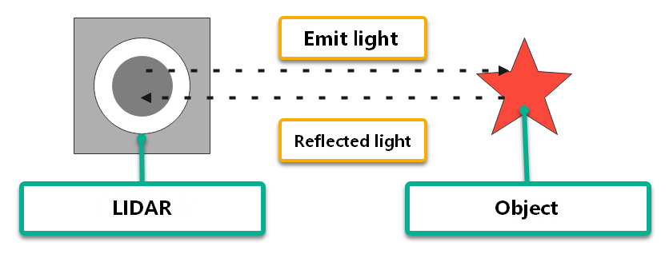
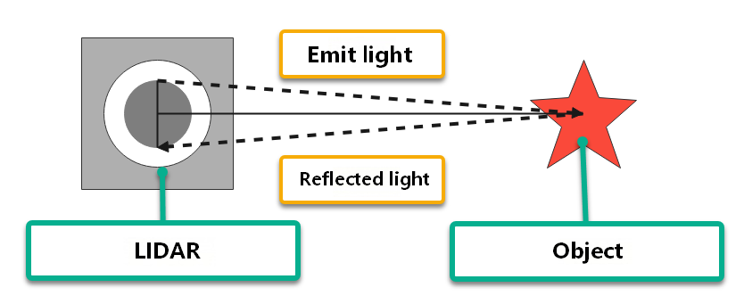
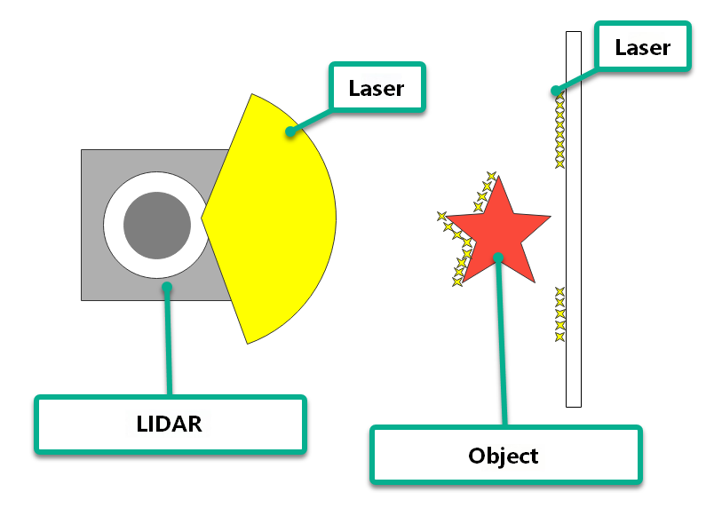
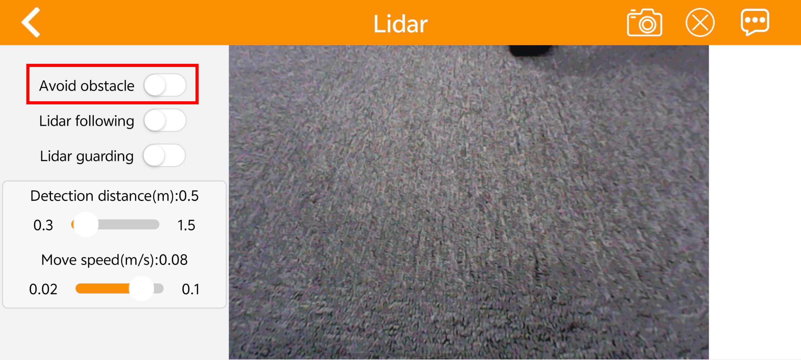
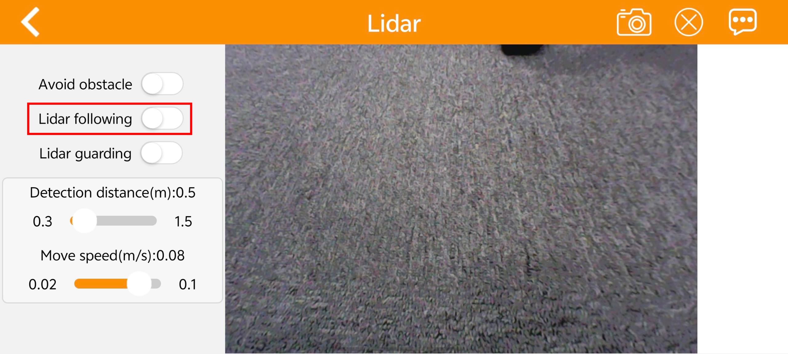
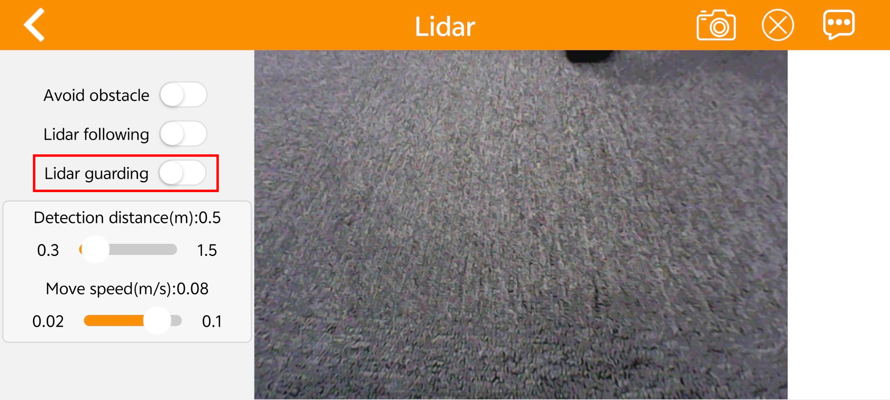

# 3. LiDAR Course

## 3.1 LiDAR Introduction

### 3.1.1 Overview

As a high-precision, high-rate remote sensing technology, LiDAR plays an essential role in mapping, autonomous driving, environmental perception, and robot navigation. This section introduces the principles, components, operating mechanisms, application fields, and advantages of LiDAR, as well as its future development trends.

LiDAR plays a key role in autonomous driving and intelligent transportation, perceiving obstacles, pedestrians, and vehicles on the road in real time while providing precise distance and position information. In robot navigation and environmental perception, LiDAR provides robots with accurate maps and surrounding environmental information. In addition, LiDAR is widely used in 3D modeling and mapping, safety monitoring, remote sensing, and surveying.


### 3.1.2 LiDAR Composition and Classification

LiDAR consists of components such as a laser emitter, a receiver, a photodetector, a scanning mechanism, and an angle resolver. The laser emitter generates laser beams, the receiver and photodetector receive reflected optical signals, the scanning mechanism scans the surrounding environment, and the angle resolver determines the position of target objects.

Based on scanning methods, LiDAR is categorized functionally into the following types:

* **Rotating LiDAR**: Rotating LiDAR conducts an omnidirectional scan of the laser beam in the horizontal direction by rotating the emitter or scanning mechanism. These LiDAR sensors typically feature high scanning speeds and measurement accuracy, and they are widely applied in autonomous driving, 3D environmental modeling, and mapping.

* **Solid-State LiDAR**: Solid-state LiDAR utilizes solid-state laser emitters without requiring rotating components. These units are typically more compact, lighter, and consume less power. Solid-state LiDAR is suitable for application scenarios such as mobile devices, drones, and robots.

* **Mechanical LiDAR**: Mechanical LiDAR uses mechanical components, such as rotating mirrors or rotating prisms, to scan the laser beam. These units generally offer longer measurement ranges and high measurement accuracy, although their scanning speeds are slower. Mechanical LiDAR is widely used in topographic surveying, building scanning, and navigation.

* **Phase-Modulated LiDAR**: Phase-modulated LiDAR measures the distance between the target object and the sensor by modulating the phase of the laser beam. These sensors generally provide high measurement accuracy and wide measurement ranges, and they are broadly utilized in mapping, surveying, and industrial applications.

* **Flash LiDAR**: Flash LiDAR emits a brief, high-power laser pulse to illuminate the entire scene at once, and then captures the reflected optical signals through a detector array. Featuring high speed and high resolution, it is suitable for rapid scene capture and motion tracking applications.

## 3.2 LiDAR Operating Principles and Ranging Methods

### 3.2.1 LiDAR Ranging

Common LiDAR systems determine the distance to a target using two primary ranging methods: triangulation and Time-of-Flight, or TOF, ranging.

The diagram below illustrates the principle of TOF ranging. The LiDAR emits a light pulse toward an object, which reflects the light directly back to the LiDAR receiver. The LiDAR calculates half of the round-trip travel time of the light and multiplies this duration by the speed of light to determine the distance between the object and the LiDAR.



The diagram below illustrates the principle of triangulation ranging. During manufacturing, the LiDAR is calibrated so that the emitted beam is directed toward the object at a specific angle rather than projecting directly along the baseline. This angle is preset and remains constant during operation. The distance between the object and the LiDAR is calculated by substituting this angle and the baseline length into trigonometric functions.



### 3.2.2 LiDAR Scanning Effect

The diagram below illustrates the scanning effect of LiDAR. As the LiDAR emits light beams onto object surfaces and receives the reflected signals, it maps the coordinates of the illuminated points to outline the contours of surrounding objects.



## 3.3 LiDAR Obstacle Avoidance

To learn how to connect the app, refer to [1.3.3 App Installation and Connection](https://drive.google.com/drive/folders/1fFo3fA72xG8UAcqcdB7UyhIA6pN2Gjrq?usp=sharing) under [1. Tutorials/1. JetHexa User Manual](https://drive.google.com/drive/folders/1fFo3fA72xG8UAcqcdB7UyhIA6pN2Gjrq?usp=sharing).

### 3.3.1 Enabling via App

1. Launch the **WonderAi** app and connect to the JetHexa robot.

2. Tap **Lidar** on the mode selection screen to open its interface.


3. Tap the switch next to **Avoid obstacle** to enable the mode.



### 3.3.2 Enabling via Command Line

1. Power on the robot and connect it to the remote desktop software [NoMachine](https://drive.google.com/drive/folders/1fFo3fA72xG8UAcqcdB7UyhIA6pN2Gjrq?usp=sharing). For remote desktop connection details, refer to [1.4 Development Environment Setup](https://drive.google.com/drive/folders/1fFo3fA72xG8UAcqcdB7UyhIA6pN2Gjrq?usp=sharing) under [1. Tutorials/1. JetHexa User Manual](https://drive.google.com/drive/folders/1fFo3fA72xG8UAcqcdB7UyhIA6pN2Gjrq?usp=sharing).

2. Click the  icon on the desktop to open the terminal.

3. Enter the command to stop the auto-start service and press **Enter**:

```bash
~/.stop_ros.sh
```

4. Enter the following command and press **Enter** to launch the LiDAR node:

```bash
ros2 launch app lidar_node.launch.py debug:=true
```

5. Open a new terminal window, enter the following command, and press **Enter** to initialize the LiDAR application:

```bash
ros2 service call /lidar_app/enter std_srvs/srv/Trigger {}
```

6. In the current terminal window, enter the following command and press **Enter** to enable LiDAR obstacle avoidance:

```bash
ros2 service call /lidar_app/set_running interfaces/srv/SetInt64 "{data: 1}"
```

7. To stop the current function, enter the following command in the current terminal window and press **Enter**:

```bash
ros2 service call /lidar_app/set_running interfaces/srv/SetInt64 "{data: 0}"
```

8. To terminate the gameplay, press **Ctrl+C** in the terminal window from step 4.

### 3.3.3 Program Outcome

When using the LiDAR obstacle avoidance function, the target object must be taller than the horizontal scanning plane of the LiDAR so that the onboard sensor can effectively detect its position. The hexapod robot walks forward in a straight line. Upon detecting an obstacle, it automatically turns to bypass it.

## 3.4 LiDAR Following

To learn how to connect the app, refer to [1.3.3 App Installation and Connection](https://drive.google.com/drive/folders/1fFo3fA72xG8UAcqcdB7UyhIA6pN2Gjrq?usp=sharing) under [1. Tutorials/1. JetHexa User Manual](https://drive.google.com/drive/folders/1fFo3fA72xG8UAcqcdB7UyhIA6pN2Gjrq?usp=sharing).

### 3.4.1 Enabling via App

1. Launch the **WonderAi** app and connect to the JetHexa robot.

2. Tap **Lidar** on the mode selection screen to open its interface.


3. Tap the switch next to **Lidar following** to enable the mode.



### 3.4.2 Enabling via Command Line

1. Power on the robot and connect it to the remote desktop software [NoMachine](https://drive.google.com/drive/folders/1fFo3fA72xG8UAcqcdB7UyhIA6pN2Gjrq?usp=sharing). For remote desktop connection details, refer to [1.4 Development Environment Setup](https://drive.google.com/drive/folders/1fFo3fA72xG8UAcqcdB7UyhIA6pN2Gjrq?usp=sharing) under [1. Tutorials/1. JetHexa User Manual](https://drive.google.com/drive/folders/1fFo3fA72xG8UAcqcdB7UyhIA6pN2Gjrq?usp=sharing).

2. Click the  icon on the desktop to open the terminal.

3. Enter the command to stop the auto-start service and press **Enter**:

```bash
~/.stop_ros.sh
```

4. Enter the following command and press **Enter** to launch the LiDAR node:

```bash
ros2 launch app lidar_node.launch.py debug:=true
```

5. Open a new terminal window, enter the following command, and press **Enter** to initialize the LiDAR application:

```bash
ros2 service call /lidar_app/enter std_srvs/srv/Trigger {}
```

6. In the current terminal window, enter the following command and press **Enter** to enable LiDAR following:

```bash
ros2 service call /lidar_app/set_running interfaces/srv/SetInt64 "{data: 2}"
```

7. To stop the current function, enter the following command in the current terminal window and press **Enter**:

```bash
ros2 service call /lidar_app/set_running interfaces/srv/SetInt64 "{data: 0}"
```

8. To terminate the gameplay, press **Ctrl+C** in the terminal window from step 4.

### 3.4.3 Program Outcome

When using the LiDAR following function, the target object must be taller than the horizontal scanning plane of the LiDAR so that the onboard sensor can effectively detect its position. The hexapod robot then adjusts its position to maintain a constant preset distance from the obstacle.

## 3.5 LiDAR Guarding

To learn how to connect the app, refer to [1.3.3 App Installation and Connection](https://drive.google.com/drive/folders/1fFo3fA72xG8UAcqcdB7UyhIA6pN2Gjrq?usp=sharing) under [1. Tutorials/1. JetHexa User Manual](https://drive.google.com/drive/folders/1fFo3fA72xG8UAcqcdB7UyhIA6pN2Gjrq?usp=sharing).

### 3.5.1 Enabling via App

1. Launch the **WonderAi** app and connect to the JetHexa robot.

2. Tap **Lidar** on the mode selection screen to open its interface.


3. Tap the switch next to **Lidar guarding** to enable the mode.



### 3.5.2 Enabling via Command Line

1. Power on the robot and connect it to the remote desktop software [NoMachine](https://drive.google.com/drive/folders/1fFo3fA72xG8UAcqcdB7UyhIA6pN2Gjrq?usp=sharing). For remote desktop connection details, refer to [1.4 Development Environment Setup](https://drive.google.com/drive/folders/1fFo3fA72xG8UAcqcdB7UyhIA6pN2Gjrq?usp=sharing) under [1. Tutorials/1. JetHexa User Manual](https://drive.google.com/drive/folders/1fFo3fA72xG8UAcqcdB7UyhIA6pN2Gjrq?usp=sharing).

2. Click the  icon on the desktop to open the terminal.

3. Enter the command to stop the auto-start service and press **Enter**:

```bash
~/.stop_ros.sh
```

4. Enter the following command and press **Enter** to launch the LiDAR node:

```bash
ros2 launch app lidar_node.launch.py debug:=true
```

5. Open a new terminal window, enter the following command, and press **Enter** to initialize the LiDAR application:

```bash
ros2 service call /lidar_app/enter std_srvs/srv/Trigger {}
```

6. In the current terminal window, enter the following command and press **Enter** to enable LiDAR guarding:

```bash
ros2 service call /lidar_app/set_running interfaces/srv/SetInt64 "{data: 3}"
```

7. To stop the current function, enter the following command in the current terminal window and press **Enter**:

```bash
ros2 service call /lidar_app/set_running interfaces/srv/SetInt64 "{data: 0}"
```

8. To terminate the gameplay, press **Ctrl+C** in the terminal window from step 4.

### 3.5.3 Program Outcome

When using the LiDAR guarding function, the target object must be taller than the horizontal scanning plane of the LiDAR so that the onboard sensor can effectively detect its position. The hexapod robot then adjusts its body orientation to face directly toward the obstacle, aligning the camera with the target.
