# 5. Mapping and Navigation Course

## 5.1 Mapping Tutorial
<p id ="p5-1"></p>

### 5.1.1 SLAM Map Construction Principles

* **SLAM Overview**

Human navigation serves as an intuitive analogy. Prior to heading toward a destination, knowing the current location is essential, whether a map exists or not. While humans perceive spatial orientation using their eyes, robots achieve this awareness through LiDAR sensors. Simultaneous Localization and Mapping, commonly abbreviated as SLAM, refers to real-time localization and environmental map construction.

Localization determines the position and orientation, known as pose, of the robot body within a spatial coordinate system. The origin and orientation of this coordinate system can be derived from the initial keyframe, an existing global map, reference landmarks, or GPS data.

Mapping refers to constructing a digital map of the surrounding environment as perceived by the robot, with spatial points serving as the fundamental geometric elements. The primary objectives of mapping are localization and navigation. Navigation encompasses guidance and motion execution: guidance includes global and local path planning, whereas motion execution controls robot movement following planned trajectories.

* **SLAM Mapping Principles**

SLAM mapping primarily consists of three core processes:

1. Preprocessing: Optimizes raw LiDAR point cloud data by filtering noise and discarding erroneous measurements.

Using laser emissions as the signal source, pulsed laser beams emitted by the laser strike surrounding obstacles, causing scattering.

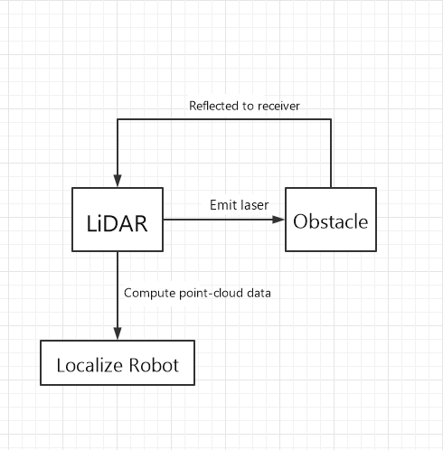

A portion of the light waves reflects back to the LiDAR receiver. Applying laser ranging principles calculates the precise distance from the LiDAR sensor to the target reflection point.

Regarding point clouds: point clouds denote environmental spatial data gathered by the LiDAR sensor. Representing portions of the surroundings detected by the optical sensing components of the robot, this acquired information forms a distributed collection of points defined by accurate angles and distances.

2. Matching: Identifies corresponding positions across the constructed map to match point cloud data from the current local environment.

Typically, laser SLAM systems compare and match two point clouds acquired at different timestamps to calculate the relative displacement and attitude variation of the LiDAR, thereby achieving self-localization for the robot.

3. Map Fusion: Integrates new rounds of LiDAR measurement data into the existing map to complete map updates.

* **Mapping Considerations**

1. When powering on and starting mapping, position the robot facing a flat perpendicular wall or an enclosed cardboard box to allow the LiDAR to scan maximum initial reflection points.

2. Maintain overall map completeness. Across potential navigation paths of the robot, all 360° surrounding zones require thorough LiDAR scanning to maximize map coverage.

3. In larger operational environments, guide the robot to complete a full loop-closure trajectory first, followed by scanning finer environmental details.

* **Evaluating Map Quality**

After completing map construction, evaluate whether the resulting map satisfies navigation requirements using the following criteria:

1. Obstacle boundaries across the map must appear sharp and distinct.
2. The map must not exhibit structural discrepancies relative to the physical environment, such as incomplete loop closures.
3. Unscanned gray regions must not exist within operational movement corridors of the robot.
4. Transient obstacles that will disappear during subsequent navigation, including moving personnel, must not be recorded on the map.
5. Full 360° visibility must be verified across every location in the anticipated operating area of the robot.

### 5.1.2 slam_toolbox Mapping Algorithm

* **Algorithm Overview**

The **slam_toolbox** package processes information from laser rangefinders in the form of LaserScan messages and computes TF coordinate transformations from the odom to base link, constructing a two-dimensional spatial map. This package enables complete serialization and reloading of SLAM map data and pose graphs for continuous mapping, localization, map merging, and related operations. **slam_toolbox** operates in synchronous mode, which processes all valid sensor measurements regardless of processing lag, or asynchronous mode, which processes valid measurements opportunistically.

In ROS 2, **slam_toolbox** supersedes legacy tools such as gmapping, cartographer, karto, and hector by delivering comprehensive SLAM capabilities. Built upon the robust scan matcher of the Karto core, it has undergone extensive optimization and acceleration. The package incorporates a new optimization plugin based on Google Ceres and introduces an elastic pose-graph localization method. This technique employs a sliding window of measurements integrated into the graph for iterative optimization and refinement, tracking local environmental features that have changed rather than treating them as permanent deviations and pruning redundant nodes when departing an area without degrading the long-term map.

**slam_toolbox** is a suite of tools designed for 2D SLAM. Key capabilities include:

1. Constructing maps and saving map .pgm files.
2. Refining existing maps, remapping, or continuing mapping on saved maps.
3. Long-term mapping: loading saved maps to continue exploration while filtering irrelevant data from new laser point clouds.
4. Optimizing localization modes on pre-existing maps, including running localization without prior maps via LiDAR odometry mode.
5. Synchronous and asynchronous mapping modes.
6. Dynamic map merging.
7. Plugin-based optimization solvers with a Google Ceres optimization plugin.
8. Interactive RViz plugins.
9. Graphical RViz tools for manipulating nodes and constraints during mapping sessions.
10. Lossless data storage and map serialization.

* **KARTO**

Karto_SLAM builds upon graph optimization concepts, solving sparse linear systems through highly optimized non-iterative Cholesky decomposition. Graph optimization represents the map using graph mean states, where each node corresponds to a pose on the robot trajectory alongside associated sensor measurements. Every new node addition triggers computational updates.

The ROS implementation of Karto_SLAM adopts Sparse Pose Adjustment, or SPA, associated with scan matching and loop closure detection. While increasing landmarks demands higher memory, graph optimization delivers distinct advantages in expansive environments because it constructs a graph containing robot poses, deriving the map after solving trajectory poses.

The algorithm framework of Karto SLAM appears in the following diagram:

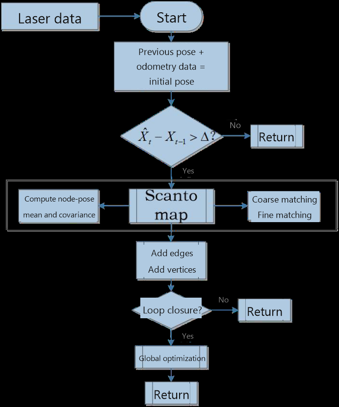

As illustrated, the workflow remains straightforward. Following traditional soft real-time SLAM operational mechanisms, each incoming data frame is processed sequentially and returned.

* **KartoSLAM Source Code and Wiki Resources**

1. KartoSLAM ROS Wiki: [http://wiki.ros.org/slam_karto](http://wiki.ros.org/slam_karto)
2. slam_karto package repository: [https://github.com/ros-perception/slam_karto](https://github.com/ros-perception/slam_karto)
3. open_karto open-source repository: [https://github.com/ros-perception/open_karto](https://github.com/ros-perception/open_karto)

* **SLAM Mapping Steps**

1. Click the desktop icon  to open a ROS 2 command-line terminal.

2. Enter the command to stop the auto-start service:

```bash
~/.stop_ros.sh
```

3. Enter the command to start mapping:

```bash
ros2 launch slam slam.launch.py
```

4. Open a new command-line terminal and enter the command to launch RViz to display mapping results:

```bash
ros2 launch slam rviz_slam.launch.py
```

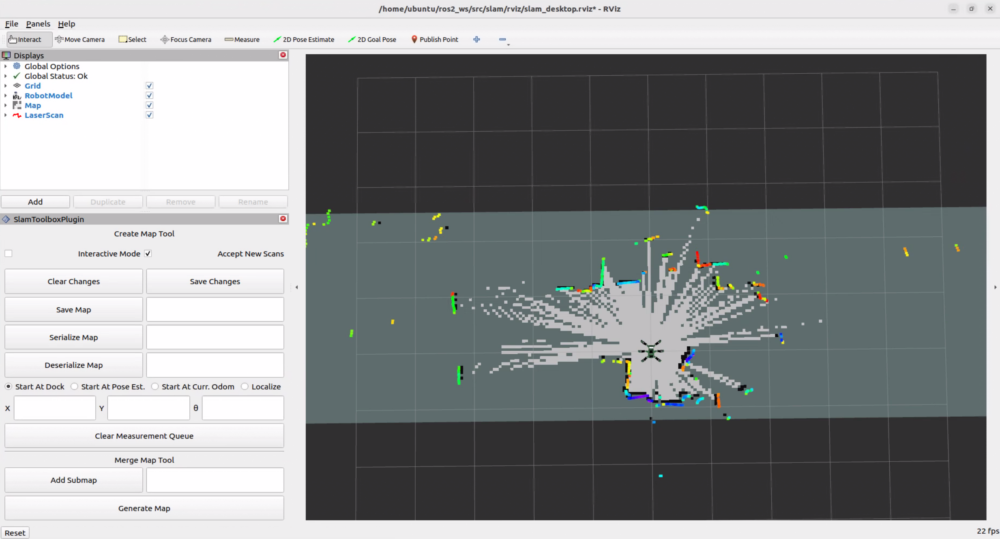

5. Control robot locomotion using either a wireless controller or the keyboard. When choosing keyboard control, open a new command-line terminal, enter the command to start the keyboard teleoperation node, and press **Enter**:

```bash
ros2 launch peripherals teleop_key_control.launch.py
```

The prompt shown in the figure below confirms that the keyboard teleoperation service started successfully.


6. Drive the robot across the operating area to construct a comprehensive map. The table below outlines the keyboard keys and their corresponding control functions:

| Key | Robot Action |
| :---: | :--- |
| **W** | Short press to switch to forward motion. |
| **S** | Short press to switch to backward motion. |
| **A** | Short press to turn left. |
| **D** | Short press to turn right. |

During keyboard-controlled mapping, reducing the movement speed of the robot yields superior results. Slower robot speeds minimize relative odometry error and enhance mapping accuracy. As the robot traverses the environment, the map displayed in RViz expands progressively until mapping of the physical space is complete.

* **Saving the Map**

Open a new command-line terminal, enter the following command, and press **Enter** to save the map:

```bash
cd ~/ros2_ws/src/slam/maps && ros2 run nav2_map_server map_saver_cli -f "map_01" --ros-args -p map_subscribe_transient_local:=true
```

* **Performance Optimization**

Optimizing odometry accuracy improves mapping precision. Robot mapping relies on odometry data, which in turn depends on the IMU sensor.

The robot comes loaded with factory-calibrated IMU data that fully supports standard mapping and navigation. Performing additional IMU calibration further elevates sensor precision.

* **Parameter Descriptions**

The configuration file is located at **~/ros2_ws/src/slam/config/slam.yaml**.

For comprehensive descriptions of all parameters, refer to the official documentation at [https://wiki.ros.org/slam_toolbox](https://wiki.ros.org/slam_toolbox).

* **Launch File Analysis**

The launch file is located at **/home/ubuntu/ros2_ws/src/slam/launch/slam.launch.py**.

1. Library Imports

```py
import os
from ament_index_python.packages import get_package_share_directory

from launch_ros.actions import PushRosNamespace
from launch import LaunchDescription, LaunchService
from launch.substitutions import LaunchConfiguration
from launch.launch_description_sources import PythonLaunchDescriptionSource
from launch.actions import DeclareLaunchArgument, IncludeLaunchDescription, GroupAction, OpaqueFunction, TimerAction
```

Detailed descriptions of the launch libraries are available in the official ROS documentation at [https://docs.ros.org/en/humble/How-To-Guides/Launching-composable-nodes.html](https://docs.ros.org/en/humble/How-To-Guides/Launching-composable-nodes.html).

2. Path Configuration

```py
if compiled == 'True':
    slam_package_path = get_package_share_directory('slam')
else:
    slam_package_path = '/home/ubuntu/ros2_ws/src/slam'
```

The `get_package_share_directory` function retrieves the installation path of the **slam** package.

3. Launching Subordinate Launch Files

```py
base_launch = IncludeLaunchDescription(
    PythonLaunchDescriptionSource(
        os.path.join(slam_package_path, 'launch/include/robot.launch.py')),
    launch_arguments={
        'sim': sim,
        'master_name': master_name,
        'robot_name': robot_name,
    }.items(),
)

slam_launch = IncludeLaunchDescription(
    PythonLaunchDescriptionSource(
        os.path.join(slam_package_path, 'launch/include/slam_base.launch.py')),
    launch_arguments={
        'use_sim_time': use_sim_time,
        'map_frame': map_frame,
        'odom_frame': odom_frame,
        'base_frame': base_frame,
        'scan_topic': '{}/scan'.format(frame_prefix),
        'enable_save': enable_save
    }.items(),
)

if slam_method == 'slam_toolbox':
    bringup_launch = GroupAction(
     actions=[
         PushRosNamespace(robot_name),
         base_launch,
         TimerAction(
             period=5.0,  # Delay to enable other nodes
             actions=[slam_launch],
         ),
      ]
    )
```

The `base_launch` object launches hardware drivers required by the application, `slam_launch` initiates the mapping algorithms, and `bringup_launch` establishes the initial robot posture.

<p id ="p5-1-3"></p>

### 5.1.3 RTAB-VSLAM 3D Mapping

* **RTAB-VSLAM Overview**

RTAB-VSLAM is an appearance-based real-time 3D mapping approach provided by an open-source library that implements loop closure detection through memory management mechanisms. By constraining map size so that loop closure detection consistently processes within fixed time limits, the system satisfies long-term and large-scale online mapping requirements.

* **RTAB-VSLAM Principles**

RTAB-VSLAM 3D mapping utilizes feature-based mapping. This approach offers the advantage of extracting abundant feature points in common scenes, providing strong environmental adaptability and facilitating feature-based relocalization. The drawbacks include computational overhead from feature extraction, loss of image texture details outside extracted points, degradation in low-texture environments, and vulnerability to false positive feature matches that affect mapping quality.

Once image features are extracted, matching features across distinct timestamps forms a loop closure. Following feature matching, data separates into long-term memory data and short-term memory data. Long-term memory data serves to match future sensor readings, whereas short-term memory data matches temporally continuous measurements.

During runtime, the RTAB-VSLAM algorithm updates localization poses and maps using short-term memory data first. When sensor data acquired at a future timestamp matches entries in long-term memory, corresponding long-term memory records transfer into short-term memory to refine localization poses and update the map.

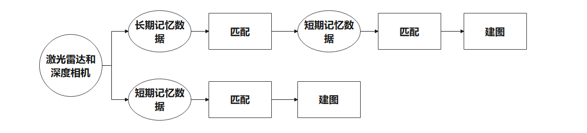

RTAB-VSLAM package repository link: [https://github.com/introlab/rtabmap](https://github.com/introlab/rtabmap)

* **RTAB-VSLAM 3D Mapping Steps**

1. Click the desktop icon  to open a ROS 2 command-line terminal. Enter the command to stop the auto-start service:

```bash
~/.stop_ros.sh
```

2. Enter the command to start mapping:

```bash
ros2 launch slam rtabmap_slam.launch.py
```

3. Open a new command-line terminal and enter the command to launch RViz to display mapping results:

```bash
ros2 launch slam rviz_rtabmap.launch.py
```

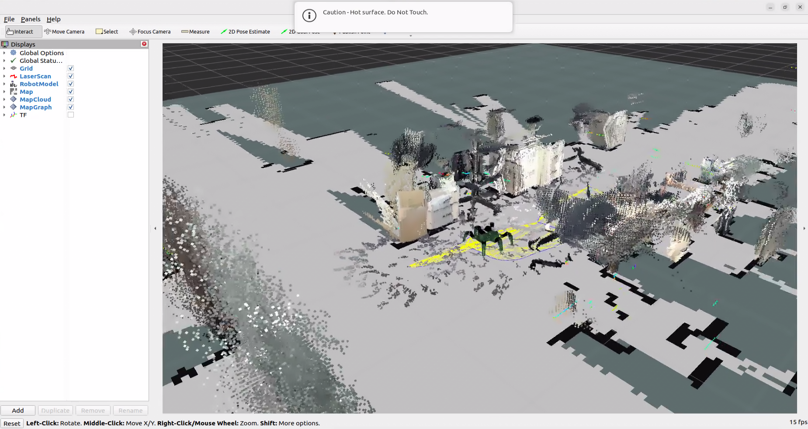

4. Control robot locomotion using either a wireless controller or the keyboard. When choosing keyboard control, open a new command-line terminal, enter the command to start the keyboard teleoperation node, and press **Enter**:

```bash
ros2 launch peripherals teleop_key_control.launch.py
```

The prompt shown in the figure below confirms that the keyboard teleoperation service started successfully.

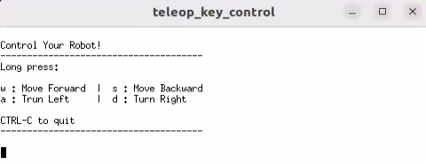

5. Drive the robot across the operating area to construct a comprehensive map. The table below outlines the keyboard keys and their corresponding control functions:

| Key | Robot Action |
| :---: | :--- |
| **W** | Short press to switch to forward motion. |
| **S** | Short press to switch to backward motion. |
| **A** | Short press to turn left. |
| **D** | Short press to turn right. |

During keyboard-controlled mapping, reducing the movement speed of the robot yields superior results. Slower robot speeds minimize relative odometry error and enhance mapping accuracy. As the robot traverses the environment, the map displayed in RViz expands progressively until mapping of the physical space is complete.

* **Saving the Map**

After mapping is complete, press **Ctrl+C** in each active command-line terminal window to terminate currently running processes.

> [!NOTE]
>
> **3D mapping does not require manual map saving. Terminating the mapping command with Ctrl+C triggers automatic map saving.**

* **Launch File Analysis**

The launch file is located at **/home/ubuntu/ros2_ws/src/slam/launch/rtabmap_slam.launch.py**.

1. Library Imports

```py
import os
from ament_index_python.packages import get_package_share_directory

from launch_ros.actions import PushRosNamespace
from launch import LaunchDescription, LaunchService
from launch.substitutions import LaunchConfiguration
from launch.launch_description_sources import PythonLaunchDescriptionSource
from launch.actions import DeclareLaunchArgument, IncludeLaunchDescription, GroupAction, OpaqueFunction, TimerAction
```

Detailed descriptions of the launch libraries are available in the official ROS documentation at [https://docs.ros.org/en/humble/How-To-Guides/Launching-composable-nodes.html](https://docs.ros.org/en/humble/How-To-Guides/Launching-composable-nodes.html).

2. Path Configuration

```py
if compiled == 'True':
    slam_package_path = get_package_share_directory('slam')
else:
    slam_package_path = '/home/ubuntu/ros2_ws/src/slam'
```

The `get_package_share_directory` function retrieves the installation path of the **slam** package.

3. Launching Subordinate Launch Files

```py
base_launch = IncludeLaunchDescription(
    PythonLaunchDescriptionSource(
        os.path.join(slam_package_path, 'launch/include/robot.launch.py')),
    launch_arguments={
        'sim': sim,
        'master_name': master_name,
        'robot_name': robot_name,
        'rtabmap_name': rtabmap_name,
        'action_name': 'init_horizontal',

    }.items(),
)

rtabmap_launch = IncludeLaunchDescription(
    PythonLaunchDescriptionSource(
        os.path.join(slam_package_path, 'launch/include/rtabmap.launch.py')),
    launch_arguments={
        'use_sim_time': use_sim_time,
    }.items(),
)

bringup_launch = GroupAction(
 actions=[
     PushRosNamespace(robot_name),
     base_launch,
     TimerAction(
         period=10.0,  # Delay to enable other nodes
         actions=[rtabmap_launch],
     ),
  ]
)
```

The `base_launch` object launches hardware drivers required by the application, `rtabmap_launch` initiates RTAB-Map 3D mapping algorithms, and `bringup_launch` establishes the initial robot posture.

## 5.2 Navigation Tutorial

### 5.2.1 Autonomous Robot Navigation in ROS

* **Overview**

Autonomous navigation refers to guiding a device to travel from one designated point to another along a specified route. Primary application scenarios include:

Terrestrial applications: autonomous vehicle navigation, vehicle tracking and monitoring, intelligent vehicle information systems, Internet of Vehicles deployments, and railway operational monitoring.

Maritime applications: ocean freight transportation, inland water navigation, and vessel docking.

Aviation applications: en-route navigation, airport surface monitoring, and precision approaches.

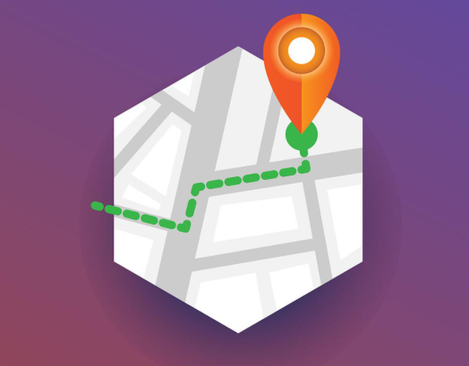

Adhering to the principle of avoiding reinventing the wheel, navigation packages in ROS provide a standardized implementation framework for mobile robots. Developers no longer need to focus on low-level intricacies such as navigation algorithms and direct hardware communication, as these components are maintained and iteratively improved by dedicated research teams. Developers can focus on high-level features while configuring modular parameter files tailored to specific robot hardware. Furthermore, secondary development based on existing packages enables customized functions, boosting engineering efficiency and accelerating product deployment.

In summary, utilizing the ROS navigation stack delivers notable advantages for developers, including stable functionality maintained by dedicated teams, comprehensive features, and streamlined high-level development.

* **Detailed Package Analysis**

This section provides a detailed analysis of navigation packages, architectural frameworks, and parameter usage.

1. Architectural Framework Description

The Nav2 project inherits and expands upon the ROS navigation stack, striving to guide mobile robots safely from Point A to Point B. Nav2 also extends to dynamic point tracking, which incorporates dynamic path planning, motor velocity computation, obstacle avoidance, and recovery behaviors.

Nav2 utilizes behavior trees to dispatch modular action servers. Actions encompass path computation, force control, recovery behaviors, or navigation-related routines. These servers run as independent nodes communicating with the Behavior Tree, or BT, through ROS Action servers. The figure below illustrates the Nav2 architecture:

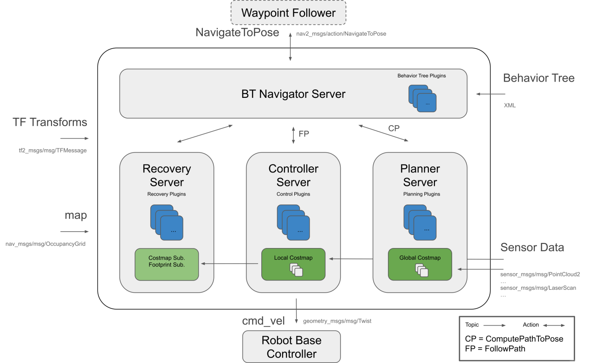

The architecture decomposes into one primary coordinator and three subordinate functional servers.

Primary coordinator:

BT Navigator Server: The navigation behavior tree server orchestrates and invokes the three subordinate servers described below.

Three subordinate functional servers:

Planner Server: Computes routes that satisfy specified objective functions, finding traversable paths across the map.

Controller Server: Known as the local planner in ROS 1, this server tracks globally planned routes or fulfills local navigation tasks, controlling robot motion along computed paths.

Recovery Server: Serves as the backbone of fault tolerance by managing unexpected conditions and system failures, enabling the robot to recover autonomously from stalls or entrapment.

Continuous switching between path planning, path tracking, and autonomous recovery enables reliable autonomous navigation. Relying solely on a static map generated via SLAM is insufficient during navigation, because new obstacles can appear while prior obstacles may vanish. Consequently, navigation maintains a dynamic costmap updated periodically, categorized into two layers:

Global Costmap:

The global costmap supports the global path planner and resides within the Planner Server. Typical layers include:

Static Map Layer: Contains the baseline static map generated during SLAM.

Obstacle Map Layer: Dynamically logs obstacle information detected by onboard sensors.

Inflation Layer: Expands obstacles outward across preceding layers to prevent collisions with the robot chassis.

Local Costmap:

The local costmap supports the local path planner and resides within the Controller Server. Typical layers include:

Obstacle Map Layer: Dynamically logs obstacle information detected by onboard sensors.

Inflation Layer: Expands obstacles outward across the obstacle map layer to prevent collisions with the robot chassis.

2. Package Installation

> [!NOTE]
>
> **The navigation packages are pre-installed at the factory, eliminating the need for manual re-installation.**

The navigation system takes navigation targets, localization data, and map data as inputs, outputting control commands that drive the robot. The system must determine the current robot position and the target destination.

Navigation packages can be installed via apt-get using the following commands:

```bash
sudo apt install ros-*-navigation2
```

```bash
sudo apt install ros-*-nav2-bringup
```

To verify the active ROS 2 distribution, enter the following command in the terminal:

```bash
echo $ROS_DISTRO
```

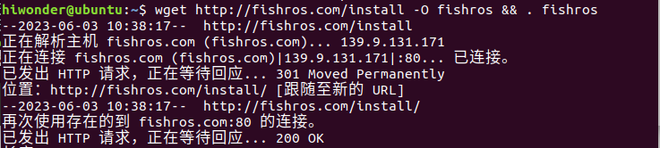

> [!NOTE]
>
> **The asterisk * represents the specific active ROS 2 distribution.**

Alternatively, compile and install the packages manually from source code. Binary installation suffices for basic learning and standard usage, whereas source installation is required when modifying source code to refine algorithms. For specific source installation procedures, refer to video tutorials.

Nav2 documentation link: [https://wiki.ros.org/Robots/Nav2](https://wiki.ros.org/Robots/Nav2)

### 5.2.2 AMCL Adaptive Monte Carlo Localization

* **AMCL Localization**

Localization estimates the position and orientation of the robot within a global map. Although SLAM incorporates localization algorithms, SLAM localization functions primarily to construct the global map prior to navigation. In contrast, navigation localization tracks the actual trajectory of the robot against anticipated routes during transit. The **ros-navigation** package collection provides the **amcl** localization system for tracking robots during navigation.

Adaptive Monte Carlo Localization, or AMCL, operates as a probabilistic localization system for 2D mobile robots. It implements adaptive Monte Carlo localization algorithms that track robot poses on existing maps using particle filters.

Localization establishes the spatial relationship between the robot and surrounding obstacles, given that path planning essentially makes navigational decisions based on proximal obstacles. In theory, knowing the global robot pose and scanning real-time obstacles with LiDAR sensors suffices for navigation. However, global localization alone often lacks high update rates and precision. Integrating local localization from odometry and IMU sensors guarantees responsiveness and accuracy along the motion trajectory. Within the navigation stack, the **amcl** node provides global localization by publishing the map to odom coordinate transformation. **amcl** global localization is not mandatory. Alternative systems providing the map to odom transform can replace it, such as SLAM, Ultra-Wideband, or AprilTag localization.

Global and local localization jointly establish a dynamic TF coordinate tree connecting map, odom, and base_footprint. Static TF transforms between individual sensors are supplied via the robot URDF model. This transform structure resolves spatial relations between obstacles and the chassis: when a LiDAR detects an obstacle 3 m ahead, transforming from base_link to laser_link computes the exact relative position of the obstacle with respect to the robot chassis.

* **Particle Filtering**

The Monte Carlo localization process simulates particle updates for a one-dimensional robot. Initially, the algorithm generates a distribution of random particles, where each particle embodies position, orientation, or relevant state variables alongside an assigned weight indicating its similarity to the actual system state. The algorithm predicts future states for each particle based on anticipated physical system behavior. Particle weights are subsequently updated against real-world sensor measurements, assigning higher weights to particles matching measurements more closely. Resampling then discards improbable particles and replicates probable ones. Finally, computing the weighted average and covariance of the particle ensemble produces the state estimate.

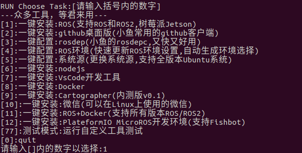

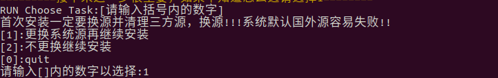

While Monte Carlo implementations vary, they generally follow a defined workflow:

1. Define the domain of potential inputs.
2. Generate random inputs from a probability distribution over that domain.
3. Perform deterministic computations on the inputs.
4. Aggregate computation results.

Two critical factors require consideration:

1. If points fail to distribute uniformly, approximation accuracy deteriorates significantly.
2. The process requires a substantial quantity of points. Randomly placing only a few points across the domain yields poor approximations. On average, accuracy improves as more points populate the domain.

Monte Carlo particle filtering algorithms find broad application across physical sciences, engineering, climatology, and computational biology.

* **Adaptive Monte Carlo Localization**

AMCL serves as an enhanced variation of Monte Carlo localization that reduces execution latency and improves real-time performance by adjusting sample quantities dynamically. It implements KLD-sampling Monte Carlo localization to track robot poses across known maps using particle filters.

The AMCL node primarily consumes laser scans and LiDAR maps, exchanging messages to compute pose estimates. The process initializes particle filters using configuration parameters provided by ROS. If no initial pose is defined, AMCL assumes the robot begins at the coordinate origin, increasing computational complexity.

Consequently, setting the initial pose manually in RViz using the **2D Pose Estimate** button is strongly recommended.

Additional documentation on AMCL is available at [https://github.com/ros-planning/navigation](https://github.com/ros-planning/navigation).

* **Costmaps**

Neither 2D nor 3D SLAM maps generated by LiDAR or depth cameras can be applied directly to navigation. Maps must be converted into costmaps, which in ROS typically adopt grid formats. Each grid cell occupies 1 byte, representing values from 0 to 255 across three primary states: Occupied for obstacles, Free for traversable zones, and Unknown Space for unmapped areas.

Prior to discussing **costmap_2d**, the Bresenham line algorithm warrants introduction. The Bresenham algorithm renders straight lines between two points by computing the closest pixels along an n-dimensional raster grid. Relying exclusively on fast integer addition, subtraction, and bit shifting, it is widely utilized for line drawing in computer graphics.

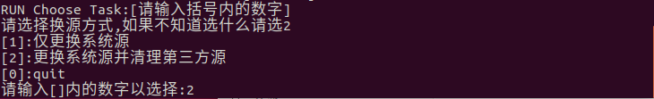

Constructing virtual grid lines through pixel centers, as depicted above, enables calculating intersections between the line segment and vertical grid boundaries. Evaluating the sign of error terms determines which pixel in the column lies nearest the intersection.

Core mathematical principles: Let k = dy / dx. Because the line origin coincides with a pixel center, initial error d0 = 0. Incrementing X by 1 increases d by slope k, yielding d = d + k. Once d ≥ 1, subtracting 1 keeps d bounded within [0, 1]. When d ≥ 0.5, the pixel at (x + 1, y + 1) lies closest to the current pixel. When d < 0.5, the pixel at (x + 1, y) is closer. For computational efficiency, defining e = d - 0.5 sets the initial error to -0.5 with increment k. When e ≥ 0, select (x + 1, y + 1). When e < 0, select (x + 1, y). Integer arithmetic replaces division through substitution: e1 = 2 * e * dx.

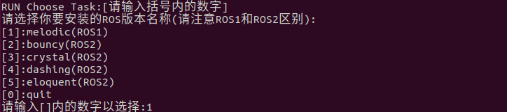

The `Costmap2D` class maintains cost values for individual grid cells. The `Layer` abstract base class standardizes interfaces across costmap plugin layers. Key interface methods include:

The `initialize` function invokes `onInitialize` to configure each costmap layer.

The `matchSize` function in `StaticLayer` and `ObstacleLayer` calls `matchSize` within `CostmapLayer`, synchronizing size, resolution, origin, and default costs with the layered costmap. In `InflationLayer`, it generates distance-dependent cost tables from the inflation radius for querying cell costs and defines the `seen_` array to track visited cells. In `VoxelLayer`, it configures 3D voxel grid dimensions.

The `updateBounds` function adjusts bounding box dimensions updated by the current costmap layer. In `StaticLayer`, the boundary matches the static map footprint. Static layers are typically applied exclusively to global costmaps. In `ObstacleLayer`, traversing sensor data in `clearing_observations` establishes obstacle boundaries.

The `initialize` and `matchSize` functions execute only once, whereas `updateBounds` and `updateCosts` execute periodically at a rate determined by `map_update_frequency`.

The `CostmapLayer` class inherits from both `Layer` and `Costmap2D`, offering update methods for cost values. `StaticLayer` and `ObstacleLayer` inherit from `CostmapLayer` to store instantiated layer costs: `StaticLayer` updates costs from static occupancy grid maps, while `ObstacleLayer` updates costs from real-time sensor measurements. `VoxelLayer` incorporates Z-axis vertical data beyond `ObstacleLayer`, distinguishing obstacle clearing in 3D volume versus 2D planes.

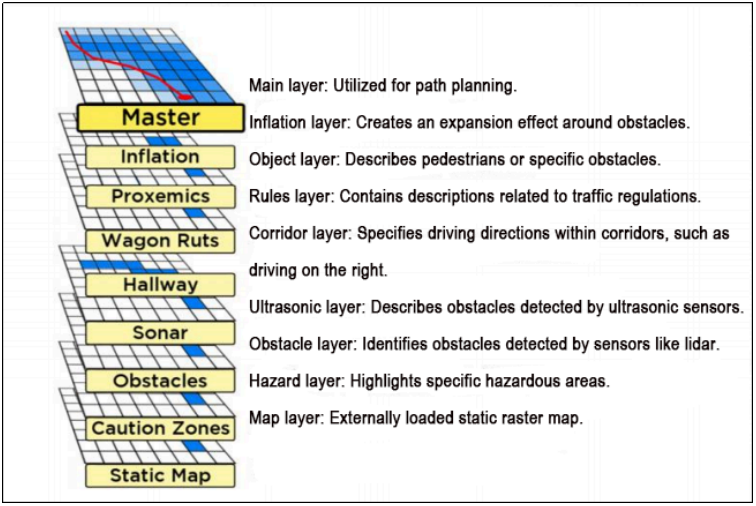

Costmaps evaluate obstacles with high modularity, allowing dedicated layers to track specific obstacle types. Robots equipped solely with LiDAR instantiate an Obstacles layer for laser-detected obstacles. Adding ultrasonic rangefinders instantiates a Sonar layer for acoustic readings. Each layer defines custom update rules, such as adding, removing, or updating obstacle confidence values, substantially elevating system extensibility.

### 5.2.3 Global Path Planning

Based on environmental awareness, spatial characteristics, and algorithm mechanics, path planning categorizes into environment-based planning, map knowledge-based planning, and completeness-based planning.

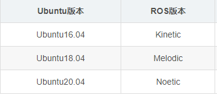

Commonly employed path planning algorithms in autonomous robotics include Dijkstra, A\*, D\*, PRM, RRT, genetic algorithms, ant colony optimization, and fuzzy logic algorithms.

The Dijkstra and A\* algorithms utilized in mobile robotics represent graph-based path search techniques. The navigation package collection integrates global planning plugins including **navfn**, **global_planner**, and **carrot_planner**. Developers can load one of these plugins into **move_base**, employ third-party plugins such as **SBPL_Lattice_Planner** or **srl_global_planner**, or implement custom global path planning plugins conforming to **nav_core** interfaces.

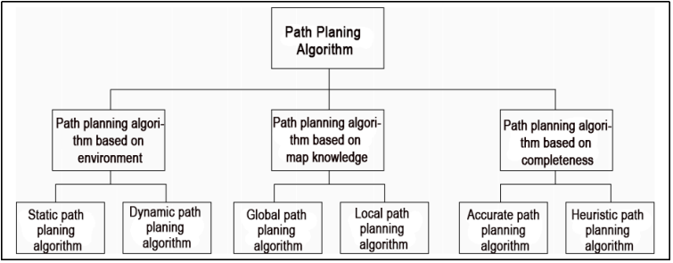

Through path planning, mobile robot navigation enables the robot to reach designated target destinations. The navigation planning architecture can be divided into a global path planning layer, a local path planning layer, and a behavioral execution layer:

1. Global Path Planning Layer: Based on specified targets, this layer receives weighted map information to generate a global weighted map, planning an end-to-end global path from the starting point to the target position to serve as a reference for local path planning.
2. Local Path Planning Layer: Serving as the local planning component of the navigation system, this layer receives local weighted map information generated from the weighted map, planning local paths based on obstacle data in the immediate vicinity.
3. Behavioral Execution Layer: Combining high-level supervisory commands with path planning trajectories, this layer determines the current behavior of the mobile robot.

As a core domain of mobile robotics research, path planning algorithm quality largely dictates overall robot operational efficiency.

* **Dijkstra Algorithm**

The Dijkstra algorithm is a classic shortest path algorithm and a single-source shortest path algorithm. Its primary feature is expanding outward layer by layer centered on the starting point using breadth-first search principles until reaching the destination. Incorporating edge weight considerations, this breadth-first algorithm remains one of the most commonly used methods for global path planning.

The following diagrams illustrate the Dijkstra algorithm:

1. Initially, initialize `dis[start]` to 0, setting all other nodes to `inf`.

   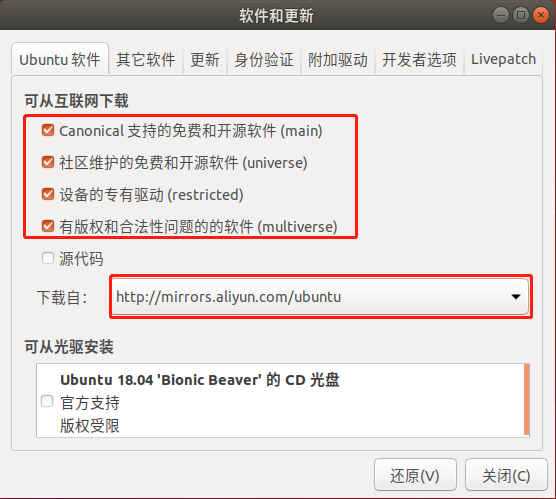

2. In the first iteration, find Node 1 with the minimum `dis` value, turn Node 1 into a white node, and update the `dis` values of all connected blue nodes such that `dis[2] = 2`, `dis[3] = 4`, and `dis[4] = 7`.

   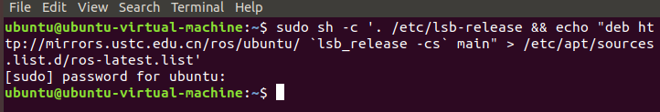

3. In the second iteration, find Node 2 with the minimum `dis` value, turn Node 2 into a white node, and update the `dis` values of all connected blue nodes such that `dis[3] = 3` and `dis[5] = 4`.

   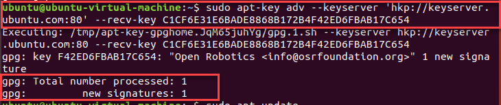

4. In the third iteration, find Node 3 with the minimum `dis` value, turn Node 3 into a white node, and update the `dis` values of all connected blue nodes such that `dis[4] = 4`.

   

5. The subsequent two iterations set Nodes 4 and 5 as white nodes respectively, concluding the algorithm and resolving the shortest paths to all nodes.

For additional details and usage guidelines on the Dijkstra algorithm, refer to [http://wiki.ros.org/navfn](http://wiki.ros.org/navfn).

* **A\* Algorithm**

A\* represents a modification of Dijkstra optimized for single-destination targets. While Dijkstra discovers paths to all accessible nodes, A\* finds paths toward specific target destinations, prioritizing paths evaluated closer to the goal.

The evaluation formula for A\* is: F = G + H, where G represents the movement cost from the starting grid to a given cell, and H represents the estimated heuristic cost from that cell to the goal. H is computed using two primary methods:

1. Calculating horizontal and vertical distances without diagonal movement, known as Manhattan distance.


2. Calculating horizontal, vertical, and diagonal distances, known as diagonal distance.

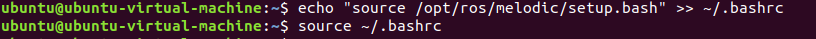

For additional details on the A* algorithm, refer to video tutorials or visit [http://wiki.ros.org/global_planner](http://wiki.ros.org/global_planner).

Interactive pathfinding resource: [https://www.redblobgames.com/pathfinding/a-star/introduction.html#graphs](https://www.redblobgames.com/pathfinding/a-star/introduction.html#graphs)

### 5.2.4 Local Path Planning

Global path planning accepts start and goal points as inputs, leveraging obstacle data from global maps to construct paths formed by discrete waypoints. Because global planning considers only static obstacle data, global paths cannot drive low-level actuators directly, serving instead as macroscopic navigational references.

* **DWA Algorithm**

1. Overview

The Dynamic Window Approach, or DWA, represents a classic algorithm for mobile robot path planning and motion control. DWA searches velocity and angular velocity state spaces for optimal command pairs, achieving safe navigation across known maps. The fundamental principles and formulas are detailed below.

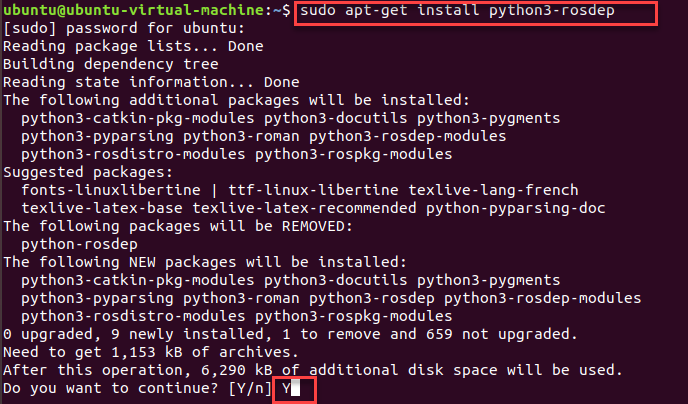

At each time step, DWA evaluates current robot states and sensor readings, generating a set of candidate trajectories, termed the dynamic window, within linear and angular velocity spaces. Evaluating these trajectories against criteria including obstacle avoidance, forward velocity maximization, and angular velocity minimization identifies the optimal trajectory. Repeating this process cyclically enables real-time trajectory adaptation to dynamic obstacles.

2. Formulas

(1) Robot state: Position (x, y) and heading angle θ.

(2) Motion control parameters: Linear velocity V and angular velocity ω.

(3) Velocity and angular velocity sampling range: V<sub>min</sub>, V<sub>max</sub> and ω<sub>min</sub>, ω<sub>max</sub>.

(4) Time step: Δt.

The formulas are as follows:

1. Velocity Sampling: The DWA algorithm first samples within the state space of velocity and angular velocity, generating a set of candidate velocity-angular velocity pairs termed the dynamic window:

V<sub>samples</sub> = [v<sub>min</sub>, v<sub>max</sub>]

ω<sub>samples</sub> = [-ω<sub>max</sub>, ω<sub>max</sub>]

Where V<sub>samples</sub> represents the velocity sampling range, and ω<sub>samples</sub> represents the angular velocity sampling range.

2. Motion Simulation: For each velocity-angular velocity pair, the DWA algorithm performs motion simulation to calculate the trajectory of the robot when adopting these velocity combinations under the current state:

x(t+1) = x(t) + v \* cos(θ(t)) \* Δt

y(t+1) = y(t) + v \* sin(θ(t)) \* Δt

θ(t+1) = θ(t) + ω \* Δt

Where x(t) and y(t) represent the robot position, θ(t) represents the robot heading, v represents the linear velocity, ω represents the angular velocity, and Δt represents the time step.

3. Trajectory Evaluation: Generated trajectories are scored using an objective evaluation function assessing obstacle clearance, maximum linear velocity, and minimal angular deviation:

(1) Obstacle avoidance evaluation: Verifies whether candidate trajectories intersect surrounding obstacles.

(2) Maximum speed evaluation: Assesses whether trajectory linear speeds remain within acceptable bounds.

(3) Minimal angular velocity evaluation: Ensures angular velocities satisfy operational stability requirements. Evaluation metrics can be adjusted according to mission objectives.

4. Optimal Trajectory Selection: DWA executes the trajectory with the highest composite score for the subsequent motion command.


* Extended Research

As a foundational robotics algorithm, DWA has produced multiple variants, such as e-DWA and DP-DWA, designed to improve planning efficiency.

Reference resources for DWA include:

1. DWA algorithm extension: [https://arxiv.org/abs/1703.08862](https://arxiv.org/abs/1703.08862)
2. Enhanced DWA algorithm: [https://arxiv.org/abs/1612.07470](https://arxiv.org/abs/1612.07470)
3. DP-DWA algorithm: [https://arxiv.org/abs/1909.05305](https://arxiv.org/abs/1909.05305)
4. ROS DWA Local Planner Wiki: [http://wiki.ros.org/dwa_local_planner](http://wiki.ros.org/dwa_local_planner)

* **TEB Algorithm**

1. Overview

The Timed Elastic Band, or TEB, algorithm addresses local path planning and trajectory optimization in robotics and autonomous systems. TEB formulates trajectory generation as an optimization problem, computing optimal trajectories over specified time horizons while satisfying kinematic constraints and obstacle avoidance requirements. Key characteristics include:

(1) Temporal Discretization: TEB introduces temporal horizons, dividing trajectories into discrete time steps corresponding to intermediate robot poses, establishing explicit temporal constraints for collision avoidance.

(2) Trajectory Parameterization: Trajectories are parameterized into sequences of displacements and velocities at each time step, facilitating numerical optimization.

(3) Constraint Optimization: TEB incorporates robot kinematic limits, obstacle clearance margins, and path smoothness criteria into objective cost functions.

(4) Optimal Solution: Optimization solvers such as Quadratic Programming, or QP, or Non-Linear Programming, or NLP, resolve optimal trajectory parameters.

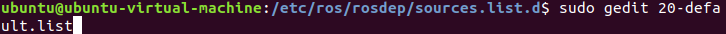

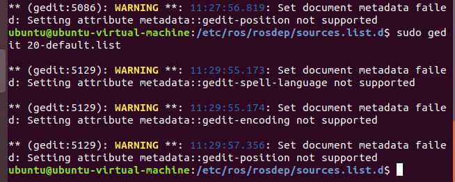

2. Mathematical Formulation

The objective function optimized in TEB is depicted below:

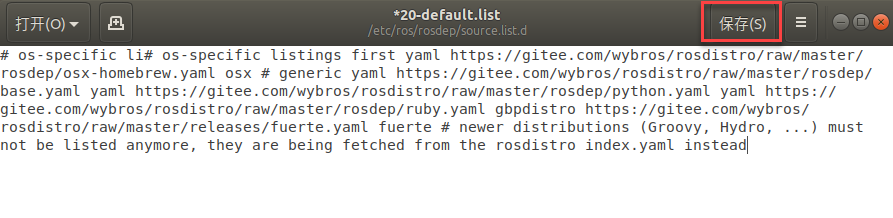

Where:

J(x) is the objective function, and x denotes trajectory parameters.

w<sub>smooth</sub> and w<sub>obstacle</sub> are weighting coefficients for smoothness and obstacle avoidance.

H is the smoothness penalty matrix.

f(x<sub>i</sub>, o<sub>j</sub>) represents the obstacle penalty cost between trajectory point x<sub>i</sub> and obstacle o<sub>j</sub>.

(1) State Definition:

First, define the state of the robot or vehicle in the path planning problem:

Position: P = [X, Y], denoting 2D coordinates.

Velocity: V = [Vx, Vy], denoting velocity vectors along X and Y axes.

Time: t, representing elapsed time.

Control input: u = [ux, uy], representing velocity or acceleration control commands.

Robot trajectory: x(t) = [p(t), v(t)], representing poses and velocities over time.

(2) Objective Function:

The core of the TEB algorithm is an optimization problem whose objective is to minimize an objective function composed of multiple components:

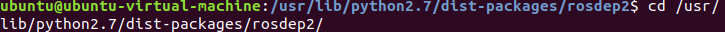

Where:

J<sub>smooth</sub>(x): Smoothness objective function ensuring a smooth generated trajectory.

J<sub>obstacle</sub>(x): Obstacle avoidance objective function preventing collisions with obstacles.

J<sub>dynamic</sub>(x): Dynamic objective function enforcing the kinematic constraints of the robot.

(3) Smoothness Objective Function J<sub>smooth</sub>(x):

The smoothness objective function typically involves trajectory curvature to ensure a smooth generated trajectory. It can be expressed as:

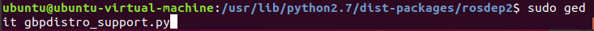

Where k(t) denotes path curvature.

(4) Obstacle Avoidance Objective Function J<sub>obstacle</sub>(x):

Calculates distances between trajectory waypoints and obstacles, penalizing proximal points according to configurable cost function f(x, o):

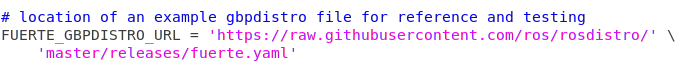

(5) Dynamic Objective Function J<sub>dynamic</sub>(x):

Enforces kinematic and dynamic constraints defined by the robot motion model, constraining velocities and accelerations.

(6) Optimization:

TEB solves the composite objective function as a constrained non-linear optimization problem over trajectory parameters, temporal allocations, and control inputs.

* Extended Research

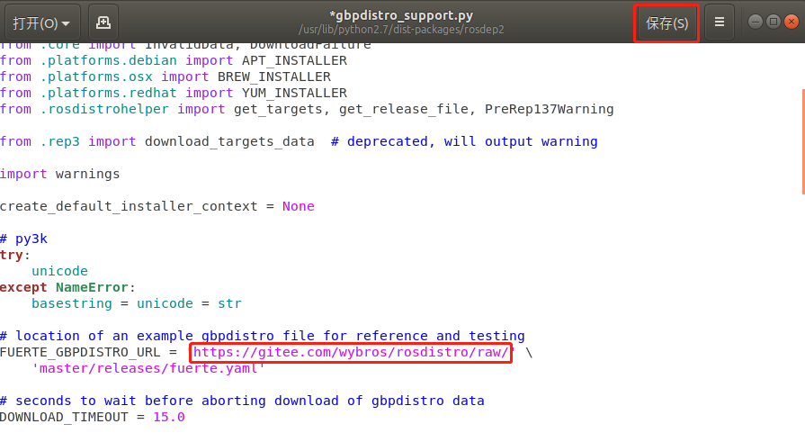

TEB represents an essential trajectory optimization technology with multiple variations. Foundational resources include:

1. Original TEB Paper: "Trajectory modification considering dynamic constraints of autonomous robots" by M. Rösmann et al.
2. ROS TEB Local Planner package repository: [https://github.com/rst-tu-dortmund/teb_local_planner](https://github.com/rst-tu-dortmund/teb_local_planner)
3. ROS TEB Local Planner Wiki: [http://wiki.ros.org/teb_local_planner](http://wiki.ros.org/teb_local_planner)

### 5.2.5 LiDAR Single-Point and Multi-Point Navigation with Obstacle Avoidance

1. Click the desktop icon 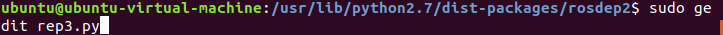 to open a command-line terminal. Enter the command to stop the auto-start service:

```bash
~/.stop_ros.sh
```

2. Enter the command to start the navigation service and press **Enter**:

```bash
ros2 launch navigation navigation.launch.py map:=map_01
```

The `map_01` parameter at the end of the command specifies the map name, which can be modified as required. The map storage path is **/home/ubuntu/ros2_ws/src/slam/maps**.

3. Open a new command-line terminal and enter the command to launch RViz for navigation visualization:

```bash
ros2 launch navigation rviz_navigation.launch.py
```

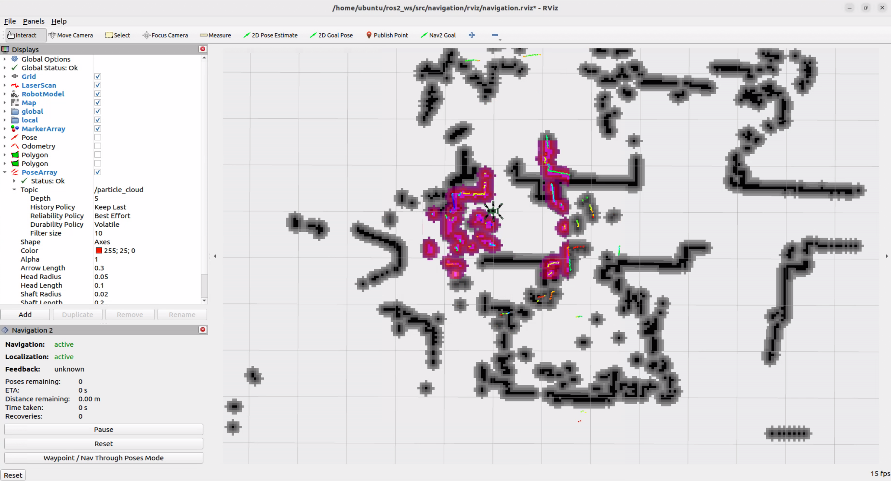

* **Single-Point Navigation**

In the RViz toolbar, **2D Pose Estimate** sets the initial robot position, **2D Goal Pose** sets a single target destination, and **Publish Point** marks multiple target waypoints.

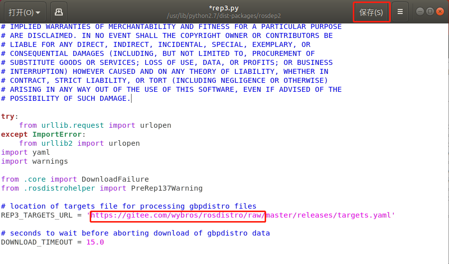

1. Click the  icon to set the initial robot pose. Click and drag the cursor on the map to define the initial location and heading angle.

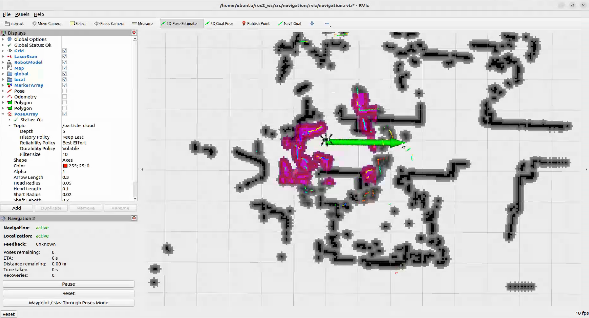

2. The initial robot pose configuration appears as shown below:

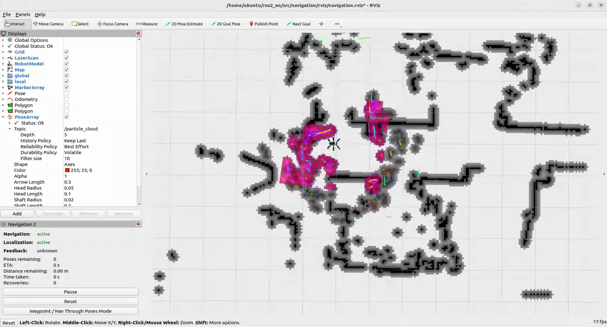

3. Click the  icon and click once on the desired destination in the map interface. The robot automatically generates a navigational route and travels to the target.

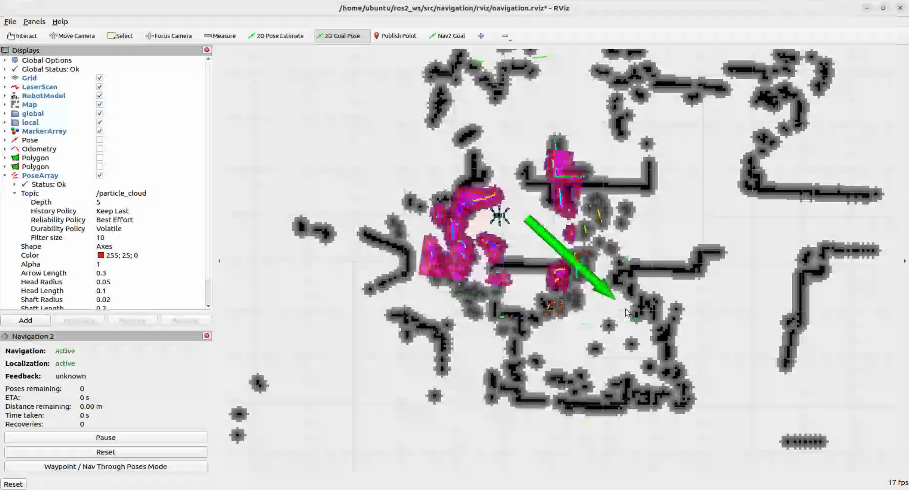

4. Once the goal is confirmed, RViz displays two trajectories: the green line represents the straight-line path to the goal, while the dark blue line represents the globally planned path.

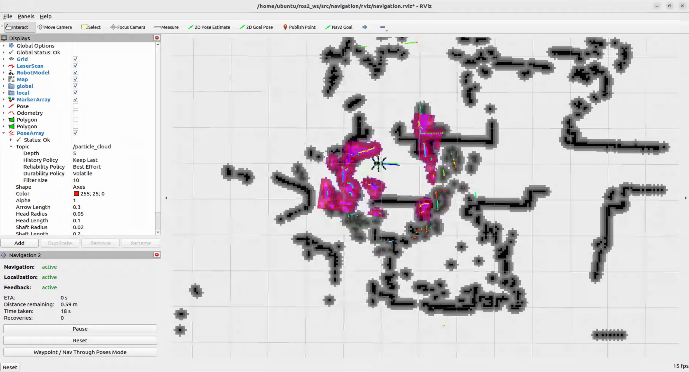

5. Upon encountering obstacles, the robot maneuvers around them while continuously adjusting body posture and tracking trajectory.

* **Multi-Point Navigation**

1. Click **Waypoint** to begin multi-point navigation:

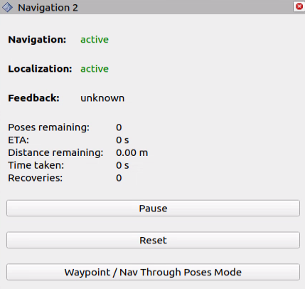

2. Click the  icon to set successive navigation waypoints on the map, as shown below:

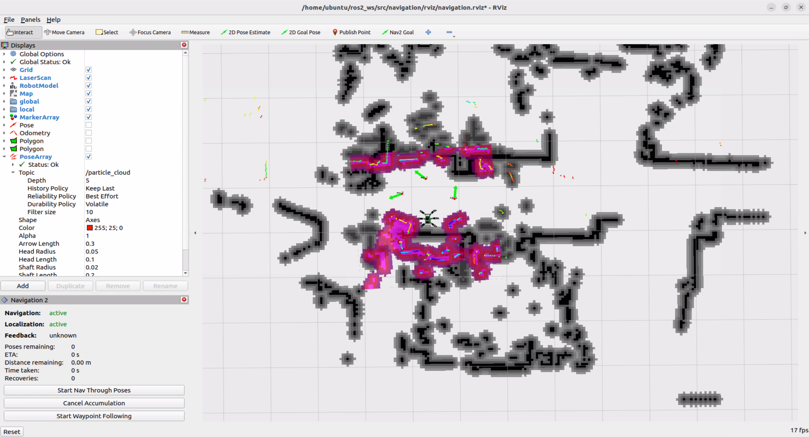

3. Click **Start Nav Through Poses** or **Start Waypoint Following** to initiate navigation. **Start Nav Through Poses** navigates through waypoints without enforcing precise arrival heading angles at each waypoint, whereas **Start Waypoint Following** aligns robot orientation to match each specified waypoint heading.

4. During multi-point navigation, the robot sequentially reaches designated waypoints, as shown below:

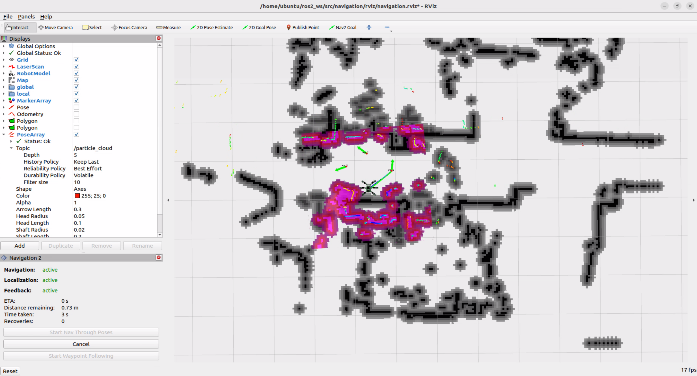

* **Launch File Analysis**

The launch file is located at **/home/ubuntu/ros2_ws/src/navigation/launch/navigation.launch.py**.

1. Library Imports

```py
import os
from ament_index_python.packages import get_package_share_directory

from launch_ros.actions import PushRosNamespace
from launch import LaunchDescription, LaunchService
from launch.substitutions import LaunchConfiguration
from launch.launch_description_sources import PythonLaunchDescriptionSource
from launch.actions import DeclareLaunchArgument, IncludeLaunchDescription, GroupAction, OpaqueFunction, TimerAction
```

2. Path Configuration

```py
if compiled == 'True':
    slam_package_path = get_package_share_directory('slam')
    navigation_package_path = get_package_share_directory('navigation')
else:
    slam_package_path = '/home/ubuntu/ros2_ws/src/slam'
    navigation_package_path = '/home/ubuntu/ros2_ws/src/navigation'
```

The `get_package_share_directory` function retrieves installation paths for the **slam** and **navigation** packages.

3. Launching Subordinate Launch Files

```py
base_launch = IncludeLaunchDescription(
    PythonLaunchDescriptionSource(os.path.join(slam_package_path, 'launch/include/robot.launch.py')),
    launch_arguments={
        'sim': sim,
        'master_name': master_name,
        'robot_name': robot_name
    }.items(),
)

navigation_launch = IncludeLaunchDescription(
    PythonLaunchDescriptionSource(os.path.join(navigation_package_path, 'launch/include/bringup.launch.py')),
    launch_arguments={
        'use_sim_time': use_sim_time,
        'map': os.path.join(slam_package_path, 'maps', map_name + '.yaml'),
        'params_file': os.path.join(navigation_package_path, 'config', 'nav2_params.yaml'),
        'namespace': robot_name,
        'use_namespace': use_namespace,
        'autostart': 'true',
        'use_teb': use_teb,
    }.items(),
)

bringup_launch = GroupAction(
 actions=[
     PushRosNamespace(robot_name),
     base_launch,
     TimerAction(
         period=10.0,  # Delay to enable other nodes
         actions=[navigation_launch],
     ),
  ]
)
```

The `base_launch` object launches hardware drivers, `navigation_launch` initializes 2D navigation algorithms, and `bringup_launch` establishes the initial posture.

### 5.2.6 RTAB-VSLAM 3D Navigation

* **Algorithm Introduction and Operating Principles**

For the introduction and operating principles of the RTAB-VSLAM algorithm, refer to [5.1.3 RTAB-VSLAM 3D Mapping](#p5-1-3).

* **Operating Steps**

1. Power on the robot and connect it to the remote desktop software [NoMachine](https://drive.google.com/drive/folders/1fFo3fA72xG8UAcqcdB7UyhIA6pN2Gjrq?usp=sharing). For remote desktop connection details, refer to [1. Tutorials/1. JetHexa User Manual/1.4 Development Environment Setup](https://drive.google.com/drive/folders/1fFo3fA72xG8UAcqcdB7UyhIA6pN2Gjrq?usp=sharing).

2. Click the desktop icon  to open a command-line terminal. Enter the command to stop the auto-start service:

```bash
~/.stop_ros.sh
```

3. Enter the command to start the navigation service and press **Enter**:

```bash
ros2 launch navigation rtabmap_navigation.launch.py
```

4. Open a new command-line terminal and enter the command to launch RViz for navigation visualization:

```bash
ros2 launch navigation rviz_rtabmap_navigation.launch.py
```

In the RViz toolbar, **2D Goal Pose** sets a single target destination, and **Publish Point** queries coordinate positions on the map.


5. Click the 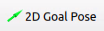 icon and click once on the desired destination in the map interface. The robot automatically generates a trajectory and navigates toward the target.

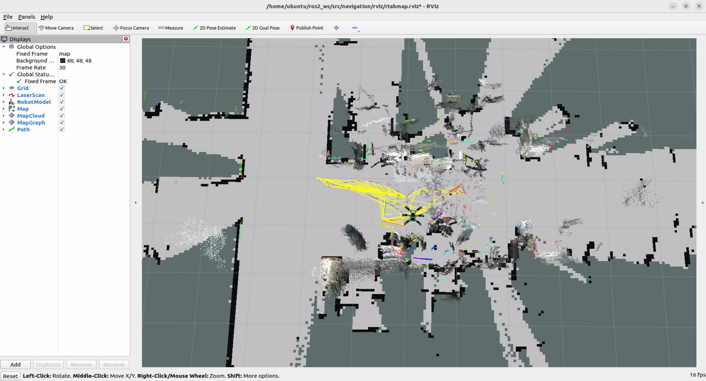

6. Once the target destination is confirmed, the map displays the planned trajectory between the robot and the goal.

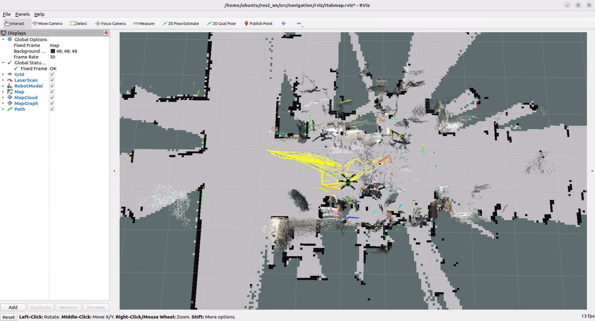

7. Upon encountering obstacles, the robot detours around them while continuously adjusting posture and tracking the planned trajectory.

* **Launch File Analysis**

The launch file is located at **/home/ubuntu/ros2_ws/src/navigation/launch/rtabmap_navigation.launch.py**.

1. Library Imports

```py
import os
from ament_index_python.packages import get_package_share_directory

from launch_ros.actions import PushRosNamespace
from launch import LaunchDescription, LaunchService
from launch.substitutions import LaunchConfiguration
from launch.launch_description_sources import PythonLaunchDescriptionSource
from launch.actions import DeclareLaunchArgument, IncludeLaunchDescription, GroupAction, OpaqueFunction, TimerAction
```

2. Path Configuration

```py
if compiled == 'True':
    slam_package_path = get_package_share_directory('slam')
    navigation_package_path = get_package_share_directory('navigation')
else:
    slam_package_path = '/home/ubuntu/ros2_ws/src/slam'
    navigation_package_path = '/home/ubuntu/ros2_ws/src/navigation'
```

The `get_package_share_directory` function retrieves installation paths for the **slam** and **navigation** packages.

3. Launching Subordinate Launch Files

```py
base_launch = IncludeLaunchDescription(
    PythonLaunchDescriptionSource(os.path.join(slam_package_path, 'launch/include/robot.launch.py')),
    launch_arguments={
        'sim': sim,
        'master_name': master_name,
        'robot_name': robot_name,
        'action_name': 'init_horizontal',
    }.items(),
)

navigation_launch = IncludeLaunchDescription(
    PythonLaunchDescriptionSource(os.path.join(navigation_package_path, 'launch/include/bringup.launch.py')),
    launch_arguments={
        'use_sim_time': use_sim_time,
        'map': os.path.join(slam_package_path, 'maps', map_name + '.yaml'),
        'params_file': os.path.join(navigation_package_path, 'config', 'nav2_params.yaml'),
        'namespace': robot_name,
        'use_namespace': use_namespace,
        'autostart': 'true',
        'rtabmap': 'true',
    }.items(),
)

rtabmap_launch = IncludeLaunchDescription(
    PythonLaunchDescriptionSource(
        os.path.join(navigation_package_path, 'launch/include/rtabmap.launch.py')),
    launch_arguments={
        'use_sim_time': use_sim_time,
    }.items(),
)

bringup_launch = GroupAction(
 actions=[
     PushRosNamespace(robot_name),
     base_launch,
     TimerAction(
         period=10.0,  # Delay to enable other nodes
         actions=[navigation_launch],
     ),
     rtabmap_launch
  ]
)
```

The `base_launch` object launches hardware drivers, `navigation_launch` initializes 2D navigation algorithms, `rtabmap_launch` launches 3D navigation algorithms, and `bringup_launch` establishes the initial posture.

### 5.2.7 Route Network Planning

#### 5.2.7.1 Algorithm Introduction and Operating Principles

* **Route Network Planning Overview**

Route network planning provides a real-time path planning and navigation system based on graph theory, offering an open-source framework that conducts efficient path searches through predefined network nodes and adjacency relationships. By constraining the search space to a predefined graph structure, path planning executes within fixed time bounds, satisfying online navigation requirements in long-term and large-scale environments. The system incorporates visual perception modules to recognize traffic lights and execute smart stop controls, featuring a breakpoint resumption mechanism to pause and resume path tracking when encountering obstacles or traffic signals.

* **Operating Principles**

Route network planning employs graph theory-based path planning. This methodology provides distinct path nodes in typical environments, delivers robust environmental adaptability, and leverages predefined network structures for rapid path computation.

Once predefined waypoints and adjacency connections are established, matching relationships between nodes constructs a searchable graph structure. After matching, data separates into long-term memory data and short-term memory data: long-term memory data stores the complete network graph structure, encompassing all nodes and adjacency relationships, while short-term memory data stores the active path sequence and currently executing waypoint coordinates.

During operation, the algorithm uses breadth-first search, or BFS, across long-term memory data to find the shortest route between start and destination nodes, producing a node sequence. Linear interpolation subsequently converts this node sequence into dense waypoints that form short-term memory data for execution. When encountering obstacles or traffic lights, the system pauses path tracking and stores the current execution state. Once obstacles clear or traffic lights signal permission to proceed, the system locates the nearest waypoint in short-term historical data from the current position, extracting the remaining path segment to resume execution seamlessly. This mechanism ensures robust autonomous navigation in complex operational environments.

#### 5.2.7.2 Preparation

Map Creation: Before enabling this feature, create a map by referring to [5.1 Mapping Tutorial](#p5-1).

* **Modifying the Waypoint Network**

1. Click the desktop icon  to open a command-line terminal. Enter the command to stop the auto-start service:

```bash
~/.stop_ros.sh
```

2. Enter the following commands to launch the graphical waypoint network editor:

```bash
cd /home/ubuntu/ros2_ws/src/road_network/road_network
```

```bash
python3 road_network_builder.py
```

3. Operational instructions appear in the terminal window:

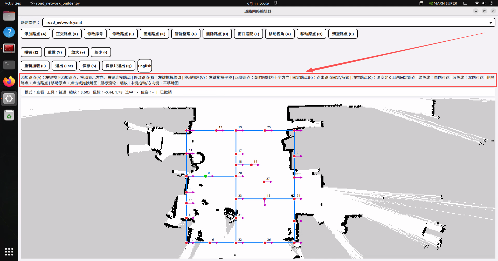

4. Left-click **A** and click on the map to add a waypoint, dragging the mouse to specify the orientation. Press **D** to delete a selected waypoint.

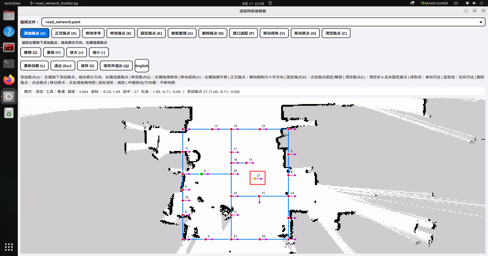

5. Right-click to connect two waypoints. For additional operations, refer to the terminal command instructions.

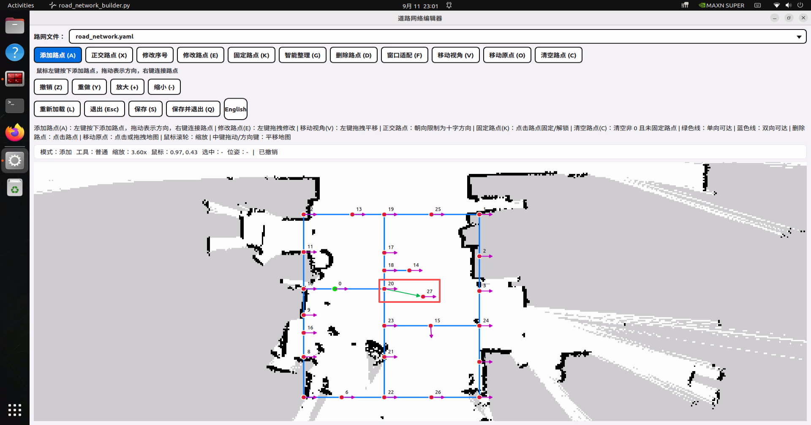

6. Press **q** to save the network configuration and exit. To exit without saving changes, press **Esc**.

Default storage path: **/home/ubuntu/ros2_ws/src/road_network/config/road_network.yaml**

#### 5.2.7.3 Operating Steps

1. Click the desktop icon  to open a command-line terminal. Enter the command to stop the auto-start service:

```bash
~/.stop_ros.sh
```

2. Enter the command to run the route network planning application:

```bash
ros2 launch road_network road_network.launch.py
```

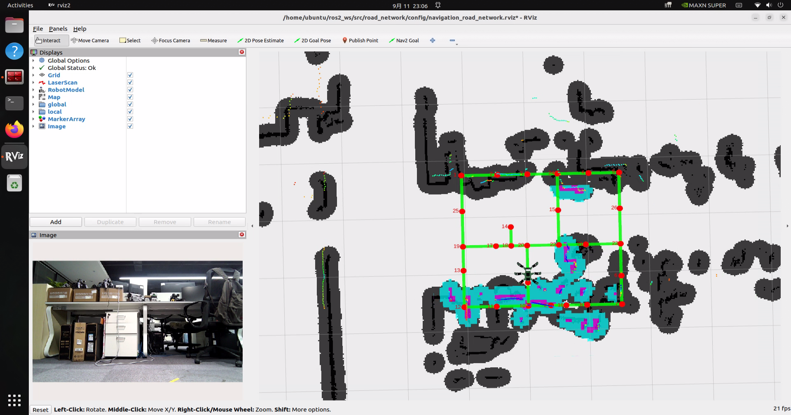

3. Open another command-line terminal and enter the command to dispatch the robot to waypoint 20, where `data` designates the target waypoint index:

Publish target waypoints to the robot via the **/request_waypoint** topic.

> [!NOTE]
>
> **Navigation target waypoints must be pairwise connected in a forward direction either directly or indirectly. For example, to navigate to waypoint 19, establish sequential connections: 0 → 20 → 18 → 17 → 19.**

```bash
ros2 topic pub /request_waypoint std_msgs/msg/Int32 "data: 20" --once
```

4. The robot navigates to waypoint 20:


5. To terminate this application, press **Ctrl+C** in the terminal window. If termination fails, press **Ctrl+C** repeatedly. If the process does not exit, open a new command-line terminal and enter the command to terminate ROS nodes:

```bash
~/.stop_ros.sh
```
