# 6. ROS + OpenCV Vision Course

## 6.1 Color Threshold Adjustment
<p id ="p6-1"></p>

Under different lighting conditions, the visual appearance of object colors varies, which directly impacts color recognition algorithms. This section covers how to use the **LAB_TOOL** utility to calibrate and adjust color thresholds.

### 6.1.1 Starting LAB_TOOL

> [!NOTE]
>
> **Command-line instructions are case-sensitive. Press Tab to autocomplete commands.**

1. Power on the JetHexa robot and connect to the remote desktop software NoMachine. For remote desktop connection details, refer to [1. Tutorials/1. JetHexa User Manual/1.4 Development Environment Setup](https://drive.google.com/drive/folders/1fFo3fA72xG8UAcqcdB7UyhIA6pN2Gjrq?usp=sharing).

2. Click the desktop icon  to open a command-line terminal.

3. Enter the command to terminate background auto-start services:

```bash
~/.stop_ros.sh
```

4. Enter the command to start the depth camera node:

```bash
ros2 launch peripherals depth_camera.launch.py
```

5. Open a new terminal and enter the command to launch the **LAB_TOOL** utility:

```bash
python3 ~/software/lab_tool/main.py
```

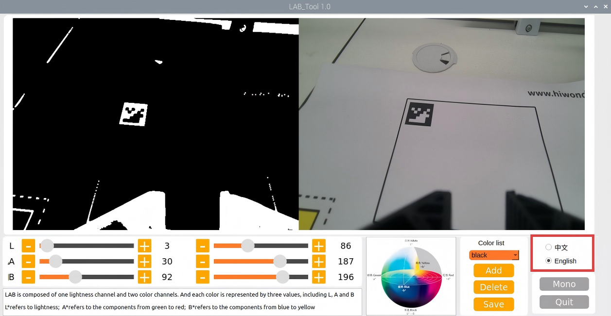

6. Refer to the subsequent sections of this document for detailed explanations and usage of the interface controls. To exit, click the **Close Software** button in the lower-right corner.


7. After closing the **LAB_TOOL** utility, restart the app auto-start service to restore mobile app control. Once started, the robotic arm returns to its home position:

```bash
sudo systemctl restart start_app_node.service
```

> [!NOTE]
>
> * **Failure to restart the app auto-start service prevents related app features from functioning properly.**
>
> * **Rebooting the robot automatically restarts the app auto-start service without requiring manual command input.**

### 6.1.2 LAB_TOOL Interface Description

The **LAB_TOOL** interface contains two primary functional sections, namely the image display area and the detection adjustment area.

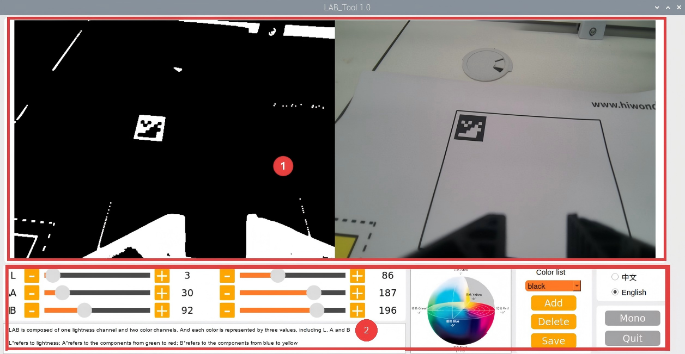

1. Image display area: The left view displays the processed camera feed, while the right view displays the raw camera image.

> [!NOTE]
>
> **If the returned video stream fails to display, indicating a camera connection failure, verify that the camera cable is securely connected to the designated port, or disconnect and reconnect it.**

2. Detection adjustment area: Allows calibration of color thresholds. The functions of the respective controls are detailed in the table below:

| Icon | Function Description |
| :---: | :--- |
|  | Sliders L, A, and B adjust the numerical values of the L, A, and B components of the camera feed. The left sliders define the min value for each component, while the right sliders define the max value. |
| 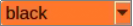 | Select the target color for threshold adjustment. |
|  | Delete the currently selected color. |
|  | Add a new target color for recognition. |
|  | Save the calibrated color threshold parameters. |
|  | Switch between the depth camera and monocular camera. |
|  | Close and exit the LAB_TOOL utility. |

### 6.1.3 Adjusting Color Thresholds

1. Open the **LAB_TOOL** utility. In the color dropdown list of the detection adjustment area, select the target color requiring calibration, using red as an example.

2. Set the **min** values of the L, A, and B components to 0 and the **max** values to 255.


3. Place the colored object within the field of view of the camera. Referring to the LAB color space distribution diagram, adjust the L, A, and B components toward the range of the target recognition color.


Because red is positioned toward the positive a axis, labeled +a, increase the A component by keeping its max value unchanged while increasing its min value until the target object appears white and the background turns black in the left processed image display.

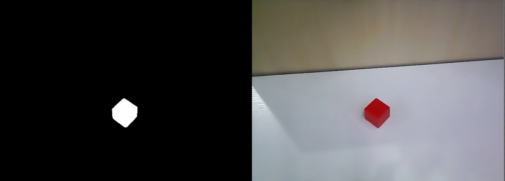

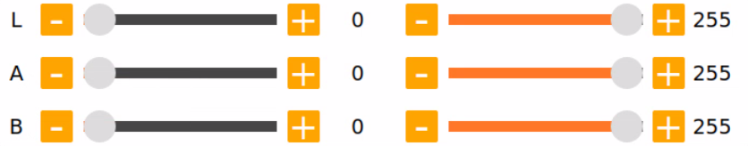

4. Fine-tune the remaining L and B components according to ambient lighting. If the red color appears light, increase the min value of the L component. If it appears dark, decrease the max value of the L component. If the red hue leans warm, increase the min value of the B component. If it leans cool, decrease the max value of the B component.


The table below summarizes the LAB threshold adjustment parameters:

| Color Component | Value Range | Corresponding Color Spectrum |
| :---: | :---: | :--- |
| L | 0–255 | Black to white, -L to +L |
| A | 0–255 | Green to red, -a to +a |
| B | 0–255 | Blue to yellow, -b to +b |

5. Click **Save** in the detection adjustment area to save the calibrated color threshold parameters.

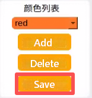

### 6.1.4 Adding New Target Colors

Beyond the built-in preset colors, additional custom detectable colors can be added, using yellow as an example:

1. Open the **LAB_TOOL** utility and click **Add**.

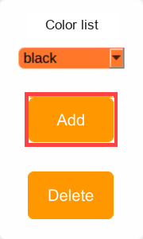

2. Enter the color name in the **Name** input field and click **OK**.

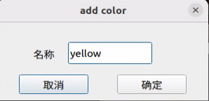

3. Select the newly added color from the color dropdown list.


4. Place the colored object within the camera field of view, then drag the L, A, and B sliders to calibrate the threshold until the target object turns white and all other regions turn black in the left display view.


5. Click **Save** in the detection adjustment area to save the calibrated color parameters.

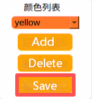

After completing color threshold adjustment, press **Ctrl+C** in the terminal to terminate the camera node, then click **Close** to exit the graphical interface.

## 6.2 Color Recognition
<p id ="p6-2"></p>

This section uses OpenCV to detect red, green, and blue objects, displaying detection results directly on the camera feed. Prepare one object each in red, green, and blue before beginning this experiment.

### 6.2.1 Overview

This experiment begins by acquiring RGB images from the camera, followed by scaling and Gaussian blur processing to convert the color space from RGB to Lab. For detailed information regarding the Lab color space, refer to [1. Tutorials/Development Basics Course/3. OpenCV Basics Course](https://drive.google.com/drive/folders/1fFo3fA72xG8UAcqcdB7UyhIA6pN2Gjrq?usp=sharing).

Next, the algorithm detects object colors inside the designated circle using color thresholds, followed by image masking. A mask selectively blocks global or local regions of an image using designated shapes, graphics, or objects. After applying morphological opening and closing operations to the object image, a circular bounding overlay marks the largest detected contour.

Opening operation: Erodes the image first and then dilates it. This process eliminates small background objects and smooths contour boundaries without altering the total area, effectively removing granular noise and disconnecting adjacent objects.

Erosion: Strips boundary pixels to shrink contours inward, discarding objects smaller than the structuring element.

Dilation: Expands boundary pixels by merging adjacent background pixels into the object, broadening outer boundaries.

Finally, the recognition results appear overlaid on the returned camera feed.

### 6.2.2 Operating Steps

> [!NOTE]
>
> **Command-line instructions are case-sensitive. Press Tab to autocomplete commands.**

1. Power on the JetHexa robot and connect to the remote desktop software NoMachine. For remote desktop connection details, refer to [1. Tutorials/1. JetHexa User Manual/1.4 Development Environment Setup](https://drive.google.com/drive/folders/1fFo3fA72xG8UAcqcdB7UyhIA6pN2Gjrq?usp=sharing).

2. Click the desktop icon  to open a command terminal.

3. Enter the command to terminate background auto-start services:

```bash
~/.stop_ros.sh
```

4. Enter the command to start the color recognition application:

```bash
ros2 launch example color_recognition_node.launch.py
```

5. To terminate the application, press **Ctrl+C** in the command terminal. If termination fails, repeat the key combination.

### 6.2.3 Program Outcome

> [!NOTE]
>
> **Ensure that no extraneous objects matching the target colors enter the field of view of the camera after launching the application, preventing interference with detection.**

Once the node starts, place the target object within the field of view of the camera. When a target object is detected, the on-board buzzer sounds a short beep, the camera feed outlines the target object with a circle in the matching color, and the terminal prints the detected color name. Detecting red triggers PWM servo 1 to rotate once, detecting blue triggers PWM servo 2 to rotate once, and detecting green triggers PWM servo 2 to rotate once. The program identifies red, blue, and green objects.

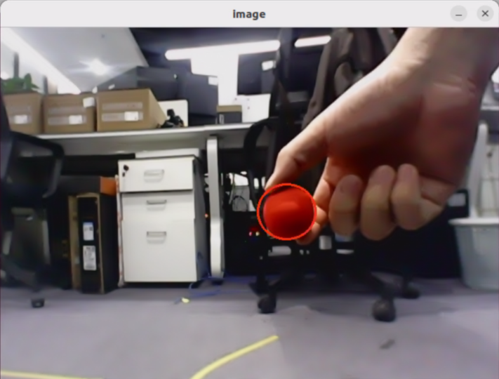

### 6.2.4 Program Analysis

#### 6.2.4.1 Launch File Analysis

The source code is located at:

**/home/ubuntu/ros2_ws/src/example/example/opencv_example/color_recognition_node.launch.py**

* Defines startup components, obtains the path to the **controller** package, launches **color_detect_node.launch.py** and **controller.launch.py**, instantiates the ROS 2 node `color_recognition_node`, defines the executable, and returns the launch action list.

```python
def launch_setup(context):
    compiled = os.environ['need_compile']

    if compiled == 'True':
        controller_package_path = get_package_share_directory('controller')
        example_package_path = get_package_share_directory('example')
    else:
        controller_package_path = '/home/ubuntu/ros2_ws/src/driver/controller'
        example_package_path = '/home/ubuntu/ros2_ws/src/example'
    color_detect_launch = IncludeLaunchDescription(
        PythonLaunchDescriptionSource(
            os.path.join(example_package_path, 'example/opencv_example/color_detect_node.launch.py')),
    )
    controller_launch = IncludeLaunchDescription(
        PythonLaunchDescriptionSource(
            os.path.join(controller_package_path, 'launch/controller.launch.py')),
    )

    color_recognition_node = Node(
        package='example',
        executable='color_recognition',
        output='screen',
    )

    return [
            controller_launch,
            color_detect_launch,
            color_recognition_node,
            ]
```

* Acts as the entry function of the ROS 2 launch file, defining the items to start.

```python
def generate_launch_description():
    return LaunchDescription([
        OpaqueFunction(function = launch_setup)
    ])
```

* Creates a `LaunchService` instance and passes the launch description to execute it.

```python
if __name__ == '__main__':
    # Create a LaunchDescription object
    ld = generate_launch_description()

    ls = LaunchService()
    ls.include_launch_description(ld)
    ls.run()
```

#### 6.2.4.2 Python Source Code Analysis

The source code is located at:

**/home/ubuntu/ros2_ws/src/example/example/opencv_example/include/color_recognition_node.py**

* Creates subscribers for the `/color_detect/color_info` and `/color_detect/image_result` topics, creates the `~/start` service, builds a service client to request `/controller_manager/init_finish`, creates `buzzer_pub` and `pwm_pub` publishers, configures color detection and ROI clients, and initializes a timer.

```python
        self.create_subscription(ColorsInfo, '/color_detect/color_info', self.get_color_callback, 1)
        self.create_subscription(Image, '/color_detect/image_result', self.image_callback, 1)
        timer_cb_group = ReentrantCallbackGroup()
        self.create_service(Trigger, '~/start', self.start_srv_callback, callback_group=timer_cb_group) # Enter application

        self.client = self.create_client(Trigger, '/controller_manager/init_finish')
        self.client.wait_for_service()
        self.buzzer_pub = self.create_publisher(BuzzerState, 'ros_robot_controller/set_buzzer', 1)
        self.pwm_pub = self.create_publisher(SetPWMServoState, 'pwm_servo_controller', 1)
        self.set_color_client = self.create_client(SetColorDetectParam, '/color_detect/set_param', callback_group=timer_cb_group)
        self.set_roi_client = self.create_client(SetCircleROI, '/color_detect/set_circle_roi', callback_group=timer_cb_group)
        self.set_color_client.wait_for_service()
        self.set_roi_client.wait_for_service()

        self.timer = self.create_timer(0.0, self.init_process, callback_group=timer_cb_group)
```

* Initialization function: Cancels the timer, calls the `start_srv_callback` service callback, initializes robot posture and pan-tilt servo positions, and launches two threads to execute target functions.

```python
    def init_process(self):
        self.timer.cancel()

        self.start_srv_callback(Trigger.Request(), Trigger.Response())
        self.controller.set_build_in_pose('DEFAULT_POSE', 1)
        if self.is_mono_camera:
            self.set_pwm_servo_position(0.5, ((1, 1500), (2, 1500)))

        threading.Thread(target=self.action, daemon=True).start()
        threading.Thread(target=self.main, daemon=True).start()
        self.create_service(Trigger, '~/init_finish', self.get_node_state)
        self.get_logger().info('\033[1;32mcamera mode: %s\033[0m' % ('mono' if self.is_mono_camera else 'depth'))
        self.get_logger().info('\033[1;32m%s\033[0m' % 'start')
```

* Service callback function: Starts the color recognition feature and returns a response.

```python
    def start_srv_callback(self, request, response):
        self.get_logger().info('\033[1;32m%s\033[0m' % "start color recognition")

        msg = SetColorDetectParam.Request()
        msg_red = ColorDetect()
        msg_red.color_name = 'red'
        msg_red.detect_type = 'circle'
        msg_green = ColorDetect()
        msg_green.color_name = 'green'
        msg_green.detect_type = 'circle'
        msg_blue = ColorDetect()
        msg_blue.color_name = 'blue'
        msg_blue.detect_type = 'circle'
        msg.data = [msg_red, msg_green, msg_blue]
        res = self.send_request(self.set_color_client, msg)
        if res.success:
            self.get_logger().info('\033[1;32m%s\033[0m' % 'set color success')
        else:
            self.get_logger().info('\033[1;32m%s\033[0m' % 'set color fail')

        response.success = True
        response.message = "start"
        return response
```

* Action function: Executes corresponding functions when colors are detected.

```python
    def action(self):
        while self.running:
            if self.start_action:
                self.get_logger().info('\033[1;32mcolor: %s\033[0m' % self.target_color)
                msg = BuzzerState()
                msg.freq = 2500
                msg.on_time = 0.1
                msg.off_time = 0.5
                msg.repeat = 1
                self.buzzer_pub.publish(msg)
                if self.is_mono_camera:
                    if self.target_color == 'red':
                        self.nod_pwm_servo_1()
                    elif self.target_color in ('green', 'blue'):
                        self.shake_pwm_servo_2()
                self.start_action = False
            else:
                time.sleep(0.01)
```

* Acquires images, triggers actions based on identified colors, and displays the image stream.

```python
    def main(self):
        count = 0
        while self.running:
            try:
                image = self.image_queue.get(block=True, timeout=1)
            except queue.Empty:
                if not self.running:
                    break
                else:
                    continue
            if self.color in ['red', 'green', 'blue']:
                if not self.start_action :
                    self.count += 1
                    if self.count > 30:
                        self.count = 0
                        self.target_color = self.color
                        self.start_action = True
                else:
                    count = 0
            if image is not None:
                cv2.imshow('image', image)
                key = cv2.waitKey(1)
                if key == ord('q') or key == 27:  # Press q or Esc to exit
                    self.running = False
        self.controller.run_action('init')
        rclpy.shutdown()
```

* Image callback function: Handles incoming camera images.

```python
    def image_callback(self, ros_image):
        rgb_image = np.ndarray(shape=(ros_image.height, ros_image.width, 3), dtype=np.uint8,
                                buffer=ros_image.data)  # Raw RGB image

        if self.image_queue.full():
            # If the queue is full, discard the oldest image
            self.image_queue.get()
            # Push the image into the queue
        self.image_queue.put(rgb_image)
```

## 6.3 AprilTag Recognition
<p id ="p6-3"></p>

### 6.3.1 Overview

This experiment begins by subscribing to image messages published by the camera node to acquire RGB frames, followed by grayscale conversion and scaling.

Next, the algorithm extracts tag parameters including the tag ID, center coordinates, and corner coordinates.

Finally, camera calibration is applied to render the tag recognition results directly onto the returned camera feed.

### 6.3.2 Operating Steps

> [!NOTE]
>
> **Command-line instructions are case-sensitive. Press Tab to autocomplete commands.**

1. Power on the JetHexa robot and connect to the remote desktop software NoMachine. For remote desktop connection details, refer to [1. Tutorials/1. JetHexa User Manual/1.4 Development Environment Setup](https://drive.google.com/drive/folders/1fFo3fA72xG8UAcqcdB7UyhIA6pN2Gjrq?usp=sharing).

2. Click the desktop icon  to open a command terminal.

3. Enter the command to terminate background auto-start services:

```bash
~/.stop_ros.sh
```

4. Enter the command to start the tag recognition application:

```bash
ros2 launch example apriltag_recognition.launch.py
```

5. To terminate the application, press **Ctrl+C** in the command terminal. If termination fails, repeat the key combination.

### 6.3.3 Program Outcome

Place the tag card within the field of view of the camera after starting the application. Once detected, the camera feed renders coordinate axes at the tag center, marks the four corners with blue dots, and displays the tag ID.

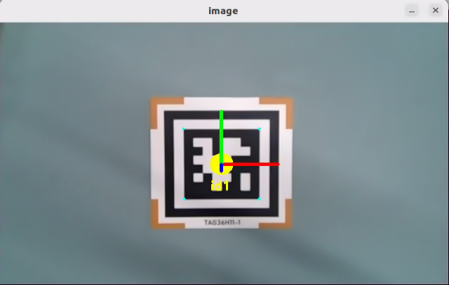

### 6.3.4 Program Analysis

#### 6.3.4.1 Launch File Analysis

The source code is located at:

**/home/ubuntu/ros2_ws/src/example/example/opencv_example/apriltag_recognition.launch.py**

* Defines startup components, obtains the path to the **peripherals** package, includes **depth_camera.launch.py**, instantiates the ROS 2 node `apriltag_recognition_node`, defines the executable, and returns the launch action list.

```python
def launch_setup(context):
    compiled = os.environ['need_compile']
    enable_display = LaunchConfiguration('enable_display', default='True')
    enable_display_arg = DeclareLaunchArgument('enable_display', default_value=enable_display)


    if compiled == 'True':
        peripherals_package_path = get_package_share_directory('peripherals')
    else:
        peripherals_package_path = '/home/ubuntu/ros2_ws/src/peripherals'

    depth_camera_launch = IncludeLaunchDescription(
        PythonLaunchDescriptionSource(
            os.path.join(peripherals_package_path, 'launch/depth_camera.launch.py')),
    )


    apriltag_recognition_node = Node(
        package='example',
        executable='apriltag_recognition',
        output='screen',
        parameters=[{'enable_display': enable_display,}]

    )

    return [
            enable_display_arg,
            depth_camera_launch,
            apriltag_recognition_node,
            ]
```

* Acts as the entry function of the ROS 2 launch file, defining the items to start.

```python
def generate_launch_description():
    return LaunchDescription([
        OpaqueFunction(function = launch_setup)
    ])
```

* Creates a `LaunchService` instance and passes the launch description to execute it.

```python
if __name__ == '__main__':
    # Create a LaunchDescription object
    ld = generate_launch_description()

    ls = LaunchService()
    ls.include_launch_description(ld)
    ls.run()
```

#### 6.3.4.2 Python Source Code Analysis

The source code is located at:

**/home/ubuntu/ros2_ws/src/example/example/opencv_example/include/apriltag_recognition.py**

* Parameter `OBJP` defines world coordinates of feature points, `AXIS` defines 3D coordinates in the world coordinate frame, and `CIRCLE` represents an array of points forming a circle.

```python
OBJP = np.array([[-1, -1,  0],
                 [ 1, -1,  0],
                 [-1,  1,  0],
                 [ 1,  1,  0],
                 [ 0,  0,  0]], dtype=np.float32)

AXIS = np.float32([[0, 0, 0],
                   [1.5, 0, 0],
                   [0, 1.5, 0],
                   [0, 0, 1.5]])
CIRCLE = np.float32([[0.3 * math.cos(math.radians(i)), 0.3 * math.sin(math.radians(i)), 0] for i in range(360)])
AXIS = np.append(AXIS, CIRCLE, axis=0)
```

* The `draw` function renders the four corner points along with the three coordinate axes.

```python
def draw(img, corners, imgpts):
    imgpts = np.int32(imgpts).reshape(-1,2)
    cv2.drawContours(img, [imgpts[4:]], -1, (255, 255, 0), -1)
    cv2.line(img, tuple(imgpts[0]), tuple(imgpts[1]), (255, 0, 0), 3)
    cv2.line(img, tuple(imgpts[0]), tuple(imgpts[2]), (0, 255, 0), 3)
    cv2.line(img, tuple(imgpts[0]), tuple(imgpts[3]), (0, 0, 255), 3)
    return img
```

* Configures the camera intrinsic matrix and distortion coefficients, subscribes to image and camera info topics, and publishes tag information along with processed image results.

```python
        self.camera_intrinsic = np.array([[619.063979, 0, 302.560920],
                                          [0, 613.745352, 237.714934],
                                          [0, 0, 1]], dtype=np.float32)
        self.dist_coeffs = np.array([0.103085, -0.175586, -0.001190, -0.007046, 0.000000])
        self.tag_detector = apriltag("tag36h11")

        self.image_sub = self.create_subscription(Image, '/depth_cam/rgb/image_raw' , self.image_callback, 1)  # Camera feed subscriber
        self.camera_info_sub = self.create_subscription(CameraInfo, '/depth_cam/rgb/camera_info' , self.camera_info_callback, 1)  # Camera info subscriber
        self.apriltag_info_pub = self.create_publisher(ApriltagsInfo, '~/apriltag_info', 1) # Tag info publisher
        self.result_publisher = self.create_publisher(Image, '~/image_result', 1)  # Processed image publisher
        # self.declare_parameter('enable_display', False)
        self.display = self.get_parameter('enable_display').value
```

* `camera_info_callback`: Handles messages from the camera info subscriber, updating the intrinsic matrix and distortion coefficients.

```python
    def camera_info_callback(self, msg):
        with self.lock:
            self.camera_intrinsic = np.array(msg.k).reshape(3, 3)
            self.dist_coeffs = np.array(msg.d)
```

* `image_callback`: Handles incoming image messages from the subscriber, performing image conversion, processing, visual display, and publishing the processed frame to the designated topic.

```python
    def image_callback(self, msg):
        rgb_image = self.bridge.imgmsg_to_cv2(msg, 'rgb8')
        result_image = np.copy(rgb_image)

        try:
            with self.lock:
                result_image = self.image_proc(rgb_image, result_image)
        except Exception as e:
            self.get_logger().error(str(e))
        if self.display:
            cv2.imshow('image', cv2.cvtColor(result_image, cv2.COLOR_RGB2BGR))
            cv2.waitKey(1)
        self.result_publisher.publish(self.bridge.cv2_to_imgmsg(result_image, "rgb8"))
```

* Renders tag corners and center points, performing pose estimation. Parameter `corners` defines pixel coordinates of feature points in the image, `rvecs` defines the rotation vector transforming the world coordinate frame to the camera frame, and `tvecs` defines the translation vector transforming the world coordinate frame to the camera frame.

```python
    tag_center = common.point_remapped(tag_center, (int(w/2), int(h/2)), (w, h))
    corners = np.array([lb, rb, lt, rt, tag_center], dtype=np.float32).reshape(5, -1)
    ret, rvecs, tvecs = cv2.solvePnP(OBJP, corners, self.camera_intrinsic, self.dist_coeffs)
    imgpts, _ = cv2.projectPoints(AXIS, rvecs, tvecs, self.camera_intrinsic, self.dist_coeffs)
```

## 6.4 AR Vision
<p id ="p6-4"></p>

### 6.4.1 Overview

This experiment begins by subscribing to image messages published by the camera node to acquire RGB frames, followed by grayscale conversion and scaling.

Next, the node detects AprilTags and retrieves tag attributes such as the tag ID, center point, and corner coordinates.

Finally, 3D model projection and polygon filling operations render three-dimensional virtual graphics onto designated locations within the camera video feed.

### 6.4.2 Operating Steps

> [!NOTE]
>
> **Command-line instructions are case-sensitive. Press Tab to autocomplete commands.**

1. Power on the JetHexa robot and connect to the remote desktop software NoMachine. For remote desktop connection details, refer to [1. Tutorials/1. JetHexa User Manual/1.4 Development Environment Setup](https://drive.google.com/drive/folders/1fFo3fA72xG8UAcqcdB7UyhIA6pN2Gjrq?usp=sharing).

2. Click the desktop icon  to open a command terminal.

3. Enter the command to terminate background auto-start services:

```bash
~/.stop_ros.sh
```

4. Enter the command to start the AR vision application:

```bash
ros2 launch example ar.launch.py
```

5. To terminate the application, press **Ctrl+C** in the command terminal. If termination fails, repeat the key combination.

### 6.4.3 Program Outcome

Place the tag card within the field of view of the camera after starting the application. Once the tag is recognized, the camera feed renders coordinate axes at the tag center, marks the four corners with blue dots, and displays the tag ID alongside the projected 3D model.

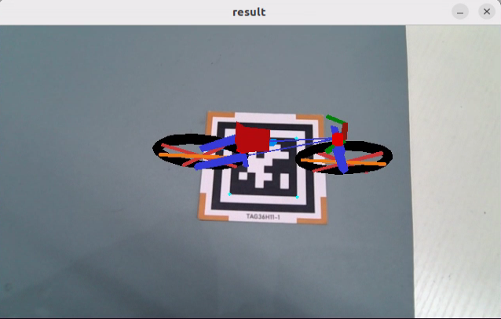

### 6.4.4 Program Analysis

#### 6.4.4.1 Launch File Analysis

The source code is located at:

**/home/ubuntu/ros2_ws/src/example/example/opencv_example/ar.launch.py**

* Defines startup components, obtains the path to the **peripherals** package, includes **depth_camera.launch.py**, instantiates the ROS 2 node `ar_node`, defines the executable, and returns the launch action list.

```python
def launch_setup(context):

    compiled = os.environ['need_compile']
    model = LaunchConfiguration('model', default='bicycle')
    model_arg = DeclareLaunchArgument('model', default_value=model)

    if compiled == 'True':
        peripherals_package_path = get_package_share_directory('peripherals')
    else:
        peripherals_package_path = '/home/ubuntu/ros2_ws/src/peripherals'

    depth_camera_launch = IncludeLaunchDescription(
        PythonLaunchDescriptionSource(
            os.path.join(peripherals_package_path, 'launch/depth_camera.launch.py')),
    )

    ar_node = Node(
        package='example',
        executable='ar',
        output='screen',
        parameters=[{"model": model}],
    )

    return [
            model_arg,
            depth_camera_launch,
            ar_node,
            ]
```

* Acts as the entry function of the ROS 2 launch file, defining the items to start.

```python
def generate_launch_description():
    return LaunchDescription([
        OpaqueFunction(function = launch_setup)
    ])
```

* Creates a `LaunchService` instance and passes the launch description to execute it.

```python
if __name__ == '__main__':
    # Create a LaunchDescription object
    ld = generate_launch_description()

    ls = LaunchService()
    ls.include_launch_description(ld)
    ls.run()
```

#### 6.4.4.2 Python Source Code Analysis

The source code is located at:

**/home/ubuntu/ros2_ws/src/example/example/opencv_example/include/ar.py**

* Retrieves the default storage path for 3D models.

```python
MODEL_PATH = os.path.join(os.path.abspath(os.path.join(os.path.split(os.path.realpath(__file__))[0])), '3d_model')
```

* The `draw_rectangle` function draws a 3D bounding cube. Parameter `img` represents the target canvas, while `imgpts` defines the cube corner points. The function returns the updated image.

```python
def draw_rectangle(img, imgpts):
    imgpts = np.int32(imgpts).reshape(-1, 2)
    cv2.drawContours(img, [imgpts[:4]], -1, (0, 255, 0), -3)  # Draw filled contour points
    for i, j in zip(range(4), range(4, 8)):
        cv2.line(img, tuple(imgpts[i]), tuple(imgpts[j]), (255), 3)  # Draw connected contour edges
    cv2.drawContours(img, [imgpts[4:]], -1, (0, 0, 255), 3)  # Draw unfilled contour points

    return img
```

* Extracts 3D model properties such as vertex positions and color data.

```python
	if self.target_model != 'rectangle':  # If not rendering a primitive cube
		# Load 3D model file
		obj = obj_load(os.path.join(MODEL_PATH, self.target_model + '.obj'), swapyz=True)
		obj.faces = obj.faces[::-1]
		new_faces = []
		# Parse model vertices and coordinates
		for face in obj.faces:
			face_vertices = face[0]
			points = []
			colors = []
			for vertex in face_vertices:
				data = obj.vertices[vertex - 1]
				points.append(data[:3])
				if self.target_model != 'cow' and self.target_model != 'wolf':
					colors.append(data[3:])
			scale_matrix = np.array([[1, 0, 0], [0, 1, 0], [0, 0, 1]]) * MODELS_SCALE[self.target_model]  # Scale
			points = np.dot(np.array(points), scale_matrix)
```

* Converts Euler angles to a rotation matrix to adjust the 3D model display orientation. Parameter `'xyz'` specifies the rotation axes, `(0, 0, 180)` specifies the Euler rotation angles, and `degrees=True` specifies that the angle unit is degrees.

```python
if self.target_model == 'bicycle':
	points = np.array([[p[0] - 670, p[1] - 350, p[2]] for p in points])
	points = R.from_euler('xyz', (0, 0, 180), degrees=True).apply(points)
elif self.target_model == 'fox':
	points = np.array([[p[0], p[1], p[2]] for p in points])
	points = R.from_euler('xyz', (0, 0, -90), degrees=True).apply(points)
elif self.target_model == 'chair':
	points = np.array([[p[0], p[1], p[2]] for p in points])
	points = R.from_euler('xyz', (0, 0, -90), degrees=True).apply(points)
else:
	points = np.array([[p[0], p[1], p[2]] for p in points])
```

* `image_callback`: Processes incoming camera frames, performs format conversion, renders virtual elements, and publishes the augmented image.

```python
    def image_callback(self, ros_image):
        # Image callback
        # Convert ROS image message to NumPy format
        cv_image = self.bridge.imgmsg_to_cv2(ros_image, "rgb8")
        rgb_image = np.array(cv_image, dtype=np.uint8)
        result_image = np.copy(rgb_image)
        with self.lock:
            try:
                # Process image
                result_image = self.image_proc(rgb_image, result_image)
            except Exception as e:
                self.get_logger().info(str(e))
            cv2.imshow("result", cv2.cvtColor(result_image, cv2.COLOR_RGB2BGR))
            cv2.waitKey(1)
        # Convert OpenCV format to ROS message format
        self.result_publisher.publish(self.bridge.cv2_to_imgmsg(result_image, "rgb8"))
```

* Constructs and reshapes coordinate arrays for tag corners and the center point. Parameter `corners` defines pixel coordinates of feature points, `rvecs` defines the rotation vector transforming the world coordinate frame to the camera frame, and `tvecs` defines the translation vector transforming the world coordinate frame to the camera frame.

```python
		corners = np.array([lb, rb, lt, rt, tag_center], dtype=np.float32).reshape(5, -1)
		ret, rvecs, tvecs = cv2.solvePnP(OBJP, corners, self.camera_intrinsic, self.dist_coeffs)
	if self.target_model == 'rectangle':
		imgpts, jac = cv2.projectPoints(AXIS, rvecs, tvecs, self.camera_intrinsic, self.dist_coeffs)
```

## 6.5 Color Block Coordinate Positioning
<p id ="p6-5"></p>

### 6.5.1 Overview

This experiment begins by subscribing to image messages published by the camera node to acquire RGB frames, followed by scaling and Gaussian blur processing to convert the color space from RGB to LAB.

Next, image binarization, erosion, and dilation extract the largest contour of the target color in the frame.

Finally, the detection results and centroid coordinates appear on both the camera feed and the command terminal.

### 6.5.2 Operating Steps

> [!NOTE]
>
> * **Command-line instructions are case-sensitive. Press Tab to autocomplete commands.**
>
> * **This application supports target detection for red, green, and blue colors.**

1. Power on the JetHexa robot and connect to the remote desktop software NoMachine. For remote desktop connection details, refer to [1. Tutorials/1. JetHexa User Manual/1.4 Development Environment Setup](https://drive.google.com/drive/folders/1fFo3fA72xG8UAcqcdB7UyhIA6pN2Gjrq?usp=sharing).

2. Click the desktop icon  to open a command terminal.

3. Enter the command to terminate background auto-start services:

```bash
~/.stop_ros.sh
```

4. Enter the command to start color block positioning. To track a different color, replace `red` with the desired color name:

```bash
ros2 launch example color_position.launch.py color:=red
```

5. To terminate the application, press **Ctrl+C** in the command terminal. If termination fails, repeat the key combination.

### 6.5.3 Program Outcome

> [!NOTE]
>
> **Ensure that no extraneous objects matching the target colors enter the field of view of the camera after launching the application, preventing interference with detection.**

Place the target object within the field of view of the camera after starting the application. When the red object is detected, the camera feed renders the center coordinates of the object.


### 6.5.4 Program Analysis

#### 6.5.4.1 Launch File Analysis

The source code is located at:

**/home/ubuntu/ros2_ws/src/example/example/opencv_example/color_position.launch.py**

* Defines startup components, obtains paths to the **controller** and **example** packages, launches **color_detect_node.launch.py** and **controller.launch.py**, instantiates the ROS 2 node `color_position_node`, defines the executable, and returns the launch action list.

```python
def launch_setup(context):
    compiled = os.environ['need_compile']
    color = LaunchConfiguration('color', default='red')
    color_arg = DeclareLaunchArgument('color', default_value=color)
    if compiled == 'True':
        controller_package_path = get_package_share_directory('controller')
        example_package_path = get_package_share_directory('example')
    else:
        controller_package_path = '/home/ubuntu/ros2_ws/src/driver/controller'
        example_package_path = '/home/ubuntu/ros2_ws/src/example'
    color_detect_launch = IncludeLaunchDescription(
        PythonLaunchDescriptionSource(
            os.path.join(example_package_path, 'example/opencv_example/color_detect_node.launch.py')),
    )
    controller_launch = IncludeLaunchDescription(
        PythonLaunchDescriptionSource(
            os.path.join(controller_package_path, 'launch/controller.launch.py')),
    )

    color_position_node = Node(
        package='example',
        executable='color_position',
        output='screen',
        parameters=[{'color': color}]
    )

    return [color_arg,
            controller_launch,
            color_detect_launch,
            color_position_node,
            ]
```

* Acts as the entry function of the ROS 2 launch file, defining the items to start.

```python
def generate_launch_description():
    return LaunchDescription([
        OpaqueFunction(function = launch_setup)
    ])
```

* Creates a `LaunchService` instance and passes the launch description to execute it.

```python
if __name__ == '__main__':
    # Create a LaunchDescription object
    ld = generate_launch_description()

    ls = LaunchService()
    ls.include_launch_description(ld)
    ls.run()
```

#### 6.5.4.2 Python Source Code Analysis

The source code is located at:

**/home/ubuntu/ros2_ws/src/example/example/opencv_example/include/color_position.py**

* Creates subscribers for `/color_detect/color_info` and `/color_detect/image_result`, creates the `~/start` service, builds a service client to request `/controller_manager/init_finish`, creates the `buzzer_pub` publisher, sets up color detection and ROI clients, and initializes a timer.

```python
        self.create_subscription(ColorsInfo, '/color_detect/color_info', self.get_color_callback, 1)
        self.create_subscription(Image, '/color_detect/image_result', self.image_callback, 1)
        timer_cb_group = ReentrantCallbackGroup()
        self.create_service(Trigger, '~/start', self.start_srv_callback, callback_group=timer_cb_group) # Enter application

        self.client = self.create_client(Trigger, '/controller_manager/init_finish')
        self.client.wait_for_service()
        self.controller = step_controller.StepController()
        self.buzzer_pub = self.create_publisher(BuzzerState, 'ros_robot_controller/set_buzzer', 1)
        self.set_color_client = self.create_client(SetColorDetectParam, '/color_detect/set_param', callback_group=timer_cb_group)
        self.set_roi_client = self.create_client(SetCircleROI, '/color_detect/set_circle_roi', callback_group=timer_cb_group)
        self.set_color_client.wait_for_service()
        self.set_roi_client.wait_for_service()

        self.timer = self.create_timer(0.0, self.init_process, callback_group=timer_cb_group)
```

* Initialization function: Cancels the timer, calls the `start_srv_callback` service callback, initializes robot posture, and launches a background worker thread.

```python
    def init_process(self):
        self.timer.cancel()

        self.start_srv_callback(Trigger.Request(), Trigger.Response())
        self.controller.set_build_in_pose('DEFAULT_POSE', 1)

        threading.Thread(target=self.main, daemon=True).start()
        self.create_service(Trigger, '~/init_finish', self.get_node_state)
        self.get_logger().info('\033[1;32m%s\033[0m' % 'start')
```

* Service callback function: Starts color recognition and returns a response.

```python
    def start_srv_callback(self, request, response):
        self.get_logger().info('\033[1;32m%s\033[0m' % "start color position")

        msg = SetColorDetectParam.Request()
        color_msg = ColorDetect()
        color_msg.color_name = self.target_color
        color_msg.detect_type = 'circle'

        msg.data = [color_msg]
        res = self.send_request(self.set_color_client, msg)
        if res.success:
            self.get_logger().info('\033[1;32m%s\033[0m' % 'set color success')
        else:
            self.get_logger().info('\033[1;32m%s\033[0m' % 'set color fail')

        response.success = True
        response.message = "start"
        return response
```

* Main execution loop: Fetches images, detects the colored object, marks the center point, and displays the image stream.

```python
    def main(self):
        while self.running:
            try:
                image = self.image_queue.get(block=True, timeout=1)
            except queue.Empty:
                if not self.running:
                    break
                else:
                    continue
            if self.color in ['red', 'green', 'blue'] :
                self.count += 1
                if self.count > 30:
                    self.count = 0
                    self.target_color = self.color
            else:
                self.count = 0
            if image is not None:
                if self.center is not None:
                    cv2.circle(image, (int(self.center[0]), int(self.center[1])), 5, (0, 255, 255), -1)
                    string = "({:0.1f}, {:0.1f})".format(self.center[0], self.center[1])
                    cv2.putText(image, string, (int(self.center[0]), int(self.center[1] + 16)), cv2.FONT_HERSHEY_SIMPLEX, 0.6, (0, 255, 255), 2)
                cv2.imshow('image', image)
                key = cv2.waitKey(1)
                if key == ord('q') or key == 27:  # Press q or Esc to exit
                    self.running = False
        rclpy.shutdown()
```

* Image callback function: Handles incoming camera frames.

```python
    def image_callback(self, ros_image):
        rgb_image = np.ndarray(shape=(ros_image.height, ros_image.width, 3), dtype=np.uint8,
                                buffer=ros_image.data)  # Raw RGB image

        if self.image_queue.full():
            # If the queue is full, discard the oldest image
            self.image_queue.get()
            # Push the image into the queue
        self.image_queue.put(rgb_image)
```

## 6.6 Color Tracking
<p id ="p6-6"></p>

### 6.6.1 Overview

This experiment begins by subscribing to image messages published by the camera node to acquire RGB frames, followed by scaling and Gaussian blur processing to convert the color space from RGB to LAB.

Next, image binarization, erosion, and dilation extract the largest contour of the target color in the frame.

Finally, the camera feed outlines the target contour, and the JetHexa robot adjusts its body position based on the relative displacement between the contour center and the image center to achieve closed-loop tracking.

### 6.6.2 Operating Steps

> [!NOTE]
>
> **Command-line instructions are case-sensitive. Press Tab to autocomplete commands.**

1. Power on the JetHexa robot and connect to the remote desktop software NoMachine. For remote desktop connection details, refer to [1. Tutorials/1. JetHexa User Manual/1.4 Development Environment Setup](https://drive.google.com/drive/folders/1fFo3fA72xG8UAcqcdB7UyhIA6pN2Gjrq?usp=sharing).

2. Click the desktop icon  to open a command terminal.

3. Enter the command to terminate background auto-start services:

```bash
~/.stop_ros.sh
```

4. Enter the command to launch the color tracking node:

```bash
ros2 launch app object_tracking_node.launch.py debug:=true
```

5. Open another command terminal, enter the service call command, and press **Enter** to enter the application:

```bash
ros2 service call /object_tracking/enter std_srvs/srv/Trigger {}
```

6. In the camera window, click the left mouse button to select the target object for tracking.


7. In the second terminal, enter the command and press **Enter** to activate tracking motion:

```bash
ros2 service call /object_tracking/set_running std_srvs/srv/SetBool "{data: True}"
```

8. To terminate the application, press **Ctrl+C** in the first command terminal. If termination fails, repeat the key combination.

### 6.6.3 Program Outcome

> [!NOTE]
>
> **Ensure that no extraneous objects matching the target colors enter the field of view of the camera after launching the application, preventing interference with detection.**

Place the target object within the field of view of the camera after starting the application. When the target object is detected, the robot performs chassis tracking on the depth camera version or 2DOF pan-tilt tracking on the monocular camera version to follow the target object.

### 6.6.4 Program Analysis

#### 6.6.4.1 Launch File Analysis

The source code is located at:

**/home/ubuntu/ros2_ws/src/app/launch/object_tracking_node.launch.py**

* Defines startup components, obtains paths to the **controller** and **peripherals** packages, includes **depth_camera.launch.py** and **controller.launch.py**, defines the `object_tracking` executable, and returns the launch action list.

```python
def launch_setup(context):
    compiled = os.environ['need_compile']
    debug = LaunchConfiguration('debug', default='false')
    debug_arg = DeclareLaunchArgument('debug', default_value=debug)
    if compiled == 'True':
        controller_package_path = get_package_share_directory('controller')
        peripherals_package_path = get_package_share_directory('peripherals')
    else:
        controller_package_path = '/home/ubuntu/ros2_ws/src/driver/controller'
        peripherals_package_path = '/home/ubuntu/ros2_ws/src/peripherals'


    object_tracking_node = GroupAction([
        IncludeLaunchDescription(
            PythonLaunchDescriptionSource(
                os.path.join(peripherals_package_path, 'launch/depth_camera.launch.py')),
            condition=IfCondition(debug),
            ),

        IncludeLaunchDescription(
            PythonLaunchDescriptionSource(
                os.path.join(controller_package_path, 'launch/controller.launch.py')),
            condition=IfCondition(debug),
            ),

        Node(
            package='app',
            executable='object_tracking',
            output='screen',
            parameters=[{'debug': debug}],
            ),
    ])

    return [debug_arg,
            object_tracking_node,
            ]
```

* Acts as the entry function of the ROS 2 launch file, defining the items to start.

```python
def generate_launch_description():
    return LaunchDescription([
        OpaqueFunction(function = launch_setup)
    ])
```

* Creates a `LaunchService` instance and passes the launch description to execute it.

```python
if __name__ == '__main__':
    # Create a LaunchDescription object
    ld = generate_launch_description()

    ls = LaunchService()
    ls.include_launch_description(ld)
    ls.run()
```

#### 6.6.4.2 Python Source Code Analysis

The source code is located at:

**/home/ubuntu/ros2_ws/src/app/app/object_tracking.py**

* Image processing routine: Converts the color space, applies binarization, performs erosion and dilation, and filters contours matching the minimum area threshold.

```python
        mask = cv2.inRange(lab_image, lowerb, upperb)
        eroded = cv2.erode(mask, cv2.getStructuringElement(cv2.MORPH_RECT, (3, 3)))
        dilated = cv2.dilate(eroded, cv2.getStructuringElement(cv2.MORPH_RECT, (3, 3)))
        contours = cv2.findContours(dilated, cv2.RETR_EXTERNAL, cv2.CHAIN_APPROX_NONE)[-2]

        contour_area = []
        for contour in contours:
            area = math.fabs(cv2.contourArea(contour))
            if area > self.min_color_area:
                contour_area.append((contour, area))

```

* ROS 2 node initialization: Loads configuration files, initializes PWM servos, and creates message queues, service clients, servers, and publishers.

```python
        self.lab_data = common.get_yaml_data("/home/ubuntu/software/lab_tool/lab_config.yaml")
        self.tracker = ObjectTracker(self)

        self.pwm_servo_1 = 1500  # y axis
        self.pwm_servo_2 = 1500  # x axis
        self.pwm_servo_1_range = (1300, 1700)
        self.pwm_servo_2_range = (1000, 2000)
        self.pid_params = {
            "x_pid": [0.5, 0.0, 0.0],
            "y_pid": [0.5, 0.0, 0.0],
            "chassis_yaw_pid": [0.009, 0.0, 0.001],
            "chassis_dist_pid": [0.002, 0.0, 0.0],
        }
        for param_name, default_value in self.pid_params.items():
            self.declare_parameter(param_name, default_value)
            self.pid_params[param_name] = self._coerce_pid_triplet(
                param_name,
                self.get_parameter(param_name).value
            )
        self.pid_x = pid.PID()
        self.pid_y = pid.PID()
        self.chassis_pid_yaw = pid.PID()
        self.chassis_pid_dist = pid.PID()
        self._apply_pid_params()
        self.add_on_set_parameters_callback(self.on_parameter_update)

        self.pwm_pub = None
        self.cmd_vel_pub = None
        self.cmd_param_pub = None
        self.controller = None
        if self.camera_type == "usb_cam":
            self.pwm_pub = self.create_publisher(SetPWMServoState, "pwm_servo_controller", 1)
            self.init_pwm_servo()
        else:
            self.cmd_vel_pub = self.create_publisher(Twist, "/controller/cmd_vel", 1)
            self.cmd_param_pub = self.create_publisher(CmdParam, "/step_controller/cmd_param", 1)
            self.controller = controller_client.ControllerClient()

        self.result_publisher = self.create_publisher(Image, "~/image_result", 1)
        self.enter_srv = self.create_service(Trigger, "~/enter", self.enter_srv_callback)
        self.exit_srv = self.create_service(Trigger, "~/exit", self.exit_srv_callback)
        self.set_running_srv = self.create_service(SetBool, "~/set_running", self.set_running_srv_callback)
        self.set_target_srv = self.create_service(SetString, "~/set_target", self.set_target_srv_callback)
        self.set_color_srv = self.create_service(SetString, "~/set_color", self.set_color_srv_callback)
        self.get_target_srv = self.create_service(Trigger, "~/get_target", self.get_target_srv_callback)
        self.set_target_color_srv = self.create_service(SetPoint, "~/set_target_color", self.set_target_color_srv_callback)
        self.get_target_color_srv = self.create_service(Trigger, "~/get_target_color", self.get_target_color_srv_callback)
        self.set_threshold_srv = self.create_service(SetFloat64, "~/set_threshold", self.set_threshold_srv_callback)

```

* Main execution loop: Converts images from RGB to BGR using OpenCV, manages the display window, and attaches the mouse click callback.

```python
    def main(self):
        while self.running:
            try:
                image = self.image_queue.get(block=True, timeout=1)
            except queue.Empty:
                continue

            result = cv2.cvtColor(image, cv2.COLOR_RGB2BGR)
            cv2.imshow("image", result)
            if self.debug and not self.set_callback:
                self.set_callback = True
                cv2.setMouseCallback("image", self.mouse_callback)
            if cv2.waitKey(1) != -1:
                break

        self.running = False
        self.stop_tracking_motion(reset_servo=True, stop_body=True)
        rclpy.shutdown()
```

* Mouse click callback: Captures mouse click positions x and y, normalizing them relative to display width and height.

```python
    def mouse_callback(self, event, x, y, flags, param):
        if event == cv2.EVENT_LBUTTONDOWN:
            self.get_logger().info("x:{} y{}".format(x, y))
            msg = SetPoint.Request()
            if self.image_height is not None and self.image_width is not None:
                msg.data.x = x / display_size[0]
                msg.data.y = y / display_size[1]
                self.set_target_color_srv_callback(msg, SetPoint.Response())
```

* Service callback `enter_srv_callback`: Executes upon receiving service requests, resetting variables, initializing postures, and launching camera subscriptions.

```python
    def enter_srv_callback(self, request, response):
        self.get_logger().info("\033[1;32m%s\033[0m" % "enter object tracking")
        with self.lock:
            self.enter = True
            self.is_running = False
            self.target = ""
            self.custom_target_color = None
            self.color_picker = None
            self.threshold = 0.5
            self.tracker.reset()
            if self.camera_type == "usb_cam":
                self.init_pwm_servo()
            else:
                self.publish_chassis_pose()
                self.clear_lost_target_motion()
            if self.image_sub is None:
                self.image_sub = self.create_subscription(Image, "/depth_cam/rgb/image_raw", self.image_callback, 1)

        response.success = True
        response.message = "enter"
        return response
```

* Processes camera feed data, executes color picking and target tracking, and publishes motion control commands based on tracking results.

```python
    def image_callback(self, ros_image):
        rgb_image = self.bridge.imgmsg_to_cv2(ros_image, "rgb8")
        rgb_image = np.array(rgb_image, dtype=np.uint8)
        self.image_height, self.image_width = rgb_image.shape[:2]

        result_image = rgb_image.copy()
        selected = None

        with self.lock:
            target = self.target
            custom_target_color = self.custom_target_color
            threshold = self.threshold
            is_running = self.is_running

            if self.color_picker is not None:
                try:
                    target_color, result_image = self.color_picker(rgb_image, result_image)
                    if target_color is not None:
                        self.color_picker = None
                        self.custom_target_color = target_color
                        self.target = ""
                        self.tracker.reset()
                        self.get_logger().info("target color: {}".format(target_color))
                except Exception as e:
                    self.get_logger().error(str(e))
            elif custom_target_color is not None:
                try:
                    result_image, selected = self.tracker.detect(
                        rgb_image,
                        threshold,
                        target_color=custom_target_color,
                    )
                except Exception as e:
                    self.get_logger().error(str(e))
            elif target:
                try:
                    result_image, selected = self.tracker.detect(
                        rgb_image,
                        threshold,
                        color_config=self.get_color_config(target),
                        draw_color=common.range_rgb[target],
                    )
                except Exception as e:
                    self.get_logger().error(str(e))

        if selected is not None and is_running:
            center_x, center_y = selected["center"]
            if self.camera_type == "usb_cam":
                self.track_with_pwm_servo(center_x, center_y, self.image_width, self.image_height)
            else:
                cv2.circle(
                    result_image,
                    (int(self.image_width / 2), int(self.image_height * 0.6)),
                    15,
                    (255, 255, 0),
                    -1,
                )
                self.track_with_chassis(center_x, center_y, self.image_width, self.image_height)
        elif is_running:
            self.clear_lost_target_motion()

        if self.debug:
            if self.image_queue.full():
                self.image_queue.get()
            self.image_queue.put(result_image)
        else:
            self.result_publisher.publish(self.bridge.cv2_to_imgmsg(result_image, "rgb8"))
```

## 6.7 AprilTag Localization
<p id ="p6-7"></p>

### 6.7.1 Overview

This experiment uses the `cvtColor` function to convert RGB frames into grayscale images, applies `tag_detector.detect` to identify tags, and extracts the tag ID, center coordinates, and four corner locations. Finally, it outlines the four corners, renders 3D coordinate axes, and outputs the tag ID and spatial coordinates.

### 6.7.2 Operating Steps

> [!NOTE]
>
> **Command-line instructions are case-sensitive. Press Tab to autocomplete commands.**

1. Power on the JetHexa robot and connect to the remote desktop software NoMachine. For remote desktop connection details, refer to [1. Tutorials/1. JetHexa User Manual/1.4 Development Environment Setup](https://drive.google.com/drive/folders/1fFo3fA72xG8UAcqcdB7UyhIA6pN2Gjrq?usp=sharing).

2. Click the desktop icon  to open a command terminal.

3. Enter the command to terminate background auto-start services:

```bash
~/.stop_ros.sh
```

4. Enter the command to start the tag localization application:

```bash
ros2 launch example apriltag_position.launch.py
```

5. To terminate the application, press **Ctrl+C** in the command terminal. If termination fails, repeat the key combination.

### 6.7.3 Program Outcome

Upon launch, the program identifies AprilTags in the view, renders 3D coordinate axes and corner points at the tag center, and prints the recognized tag ID and coordinate data in the terminal.


### 6.7.4 Program Analysis

#### 6.7.4.1 Launch File Analysis

The source code is located at:

**/home/ubuntu/ros2_ws/src/example/example/opencv_example/apriltag_position.launch.py**

* Defines startup components, obtains paths to the **controller** and **example** packages, includes **apriltag_recognition.launch.py** and **controller.launch.py**, instantiates the ROS 2 node `apriltag_position_node`, defines the executable, and returns the launch action list.

```python
def launch_setup(context):
    compiled = os.environ['need_compile']
    enable_display = LaunchConfiguration('enable_display', default='false')
    enable_display_arg = DeclareLaunchArgument('enable_display', default_value=enable_display)

    if compiled == 'True':
        controller_package_path = get_package_share_directory('controller')
        example_package_path = get_package_share_directory('example')
    else:
        controller_package_path = '/home/ubuntu/ros2_ws/src/driver/controller'
        example_package_path = '/home/ubuntu/ros2_ws/src/example'

    controller_launch = IncludeLaunchDescription(
        PythonLaunchDescriptionSource(
            os.path.join(controller_package_path, 'launch/controller.launch.py')),
    )

    apriltag_recognition_launch = IncludeLaunchDescription(
        PythonLaunchDescriptionSource(
            os.path.join(example_package_path, 'example/opencv_example/apriltag_recognition.launch.py')),
            launch_arguments={
                'enable_display': enable_display,
            }.items()
    )

    apriltag_position_node = Node(
        package='example',
        executable='apriltag_position',
        output='screen',
    )

    return [
            enable_display_arg,
            controller_launch,
            apriltag_recognition_launch,
            apriltag_position_node,
            ]
```

* Acts as the entry function of the ROS 2 launch file, defining the items to start.

```python
def generate_launch_description():
    return LaunchDescription([
        OpaqueFunction(function = launch_setup)
    ])
```

* Creates a `LaunchService` instance and passes the launch description to execute it.

```python
if __name__ == '__main__':
    # Create a LaunchDescription object
    ld = generate_launch_description()

    ls = LaunchService()
    ls.include_launch_description(ld)
    ls.run()
```

#### 6.7.4.2 Python Source Code Analysis

The source code is located at:

**/home/ubuntu/ros2_ws/src/example/example/opencv_example/include/apriltag_position.py**

* Subscribes to `/apriltag_detect/image_result` and `/apriltag_detect/apriltag_info`, then initializes a timer.

```python
        self.image_sub = self.create_subscription(Image, '/apriltag_detect/image_result' , self.image_callback, 1)  # Image feed subscriber
        self.apriltag_info_sub = self.create_subscription(ApriltagsInfo, '/apriltag_detect/apriltag_info',  self.apriltag_info_callback, 1) # Tag info subscriber

        self.timer = self.create_timer(0.0, self.init_process, callback_group=timer_cb_group)
```

* Initialization function: Cancels the timer and configures the default robot posture.

```python
    def init_process(self):
        self.timer.cancel()

        self.controller.set_build_in_pose('DEFAULT_POSE', 1)
```

* Callback function `apriltag_info_callback`: Extracts the center position, width, and ID of the detected tag.

```python
    def apriltag_info_callback(self, msg):
        data = msg.data
        if data != []:
            self.center = (data[0].x, data[0].y)
            self.width = data[0].w
            self.id = data[0].id
        else:
            self.id = ''
```

* Image callback function: Converts image formats, prints detection details, and renders the visual display.

```python
    def image_callback(self, msg):
        rgb_image = self.bridge.imgmsg_to_cv2(msg, 'rgb8')
        result_image = np.copy(rgb_image)

        if self.id :
            self.get_logger().info(f"ID: {str(self.id)}, X: {self.center[0]:.2f}, Y: {self.center[1]:.2f}, W: {self.width:.2f}")

        cv2.imshow('image', cv2.cvtColor(result_image, cv2.COLOR_RGB2BGR))
        cv2.waitKey(1)
```

## 6.8 AprilTag Tracking
<p id ="p6-8"></p>

### 6.8.1 Overview

AprilTag is a visual fiducial localization system operating similarly to QR codes or barcodes, enabling fast landmark detection and relative 3D pose estimation. Primary applications include AR systems, robotics, and camera calibration.

The tag tracking experiment follows these operational phases:

First, the camera node detects tags using grayscale conversion and feature point localization.

Next, tag decoding retrieves tag center coordinates and ID information, publishing results to the returned feed and terminal.

Finally, the JetHexa robot tracks the tag based on the distance and angular offset between the camera and the marker.

### 6.8.2 Operating Steps

> [!NOTE]
>
> **Command-line instructions are case-sensitive. Press Tab to autocomplete commands.**

1. Power on the JetHexa robot and connect to the remote desktop software NoMachine. For remote desktop connection details, refer to [1. Tutorials/1. JetHexa User Manual/1.4 Development Environment Setup](https://drive.google.com/drive/folders/1fFo3fA72xG8UAcqcdB7UyhIA6pN2Gjrq?usp=sharing).

2. Click the desktop icon  to open a command terminal.

3. Enter the command to terminate background auto-start services:

```bash
~/.stop_ros.sh
```

4. Enter the command to start the tag tracking node:

```bash
ros2 launch example apriltag_track.launch.py
```

5. To terminate the application, press **Ctrl+C** in the command terminal. If termination fails, repeat the key combination.

### 6.8.3 Program Outcome

Upon launch, the robot steps in place using a tripod gait. When Tag 1 appears in the field of view, the system recognizes the marker, renders 3D coordinate axes and corner points, and steers the robot to follow the tag.

### 6.8.4 Program Analysis

#### 6.8.4.1 Launch File Analysis

The source code is located at:

**/home/ubuntu/ros2_ws/src/example/example/opencv_example/apriltag_track.launch.py**

* Defines startup components, obtains paths to the **controller** and **example** packages, includes **apriltag_recognition.launch.py** and **controller.launch.py**, instantiates the ROS 2 node `apriltag_track_node`, defines the executable, and returns the launch action list.

```python
def launch_setup(context):
    compiled = os.environ['need_compile']
    enable_display = LaunchConfiguration('enable_display', default='false')
    enable_display_arg = DeclareLaunchArgument('enable_display', default_value=enable_display)
    target_tag = LaunchConfiguration('target_tag', default='1')
    target_tag_arg = DeclareLaunchArgument('target_tag', default_value=target_tag)

    if compiled == 'True':
        controller_package_path = get_package_share_directory('controller')
        example_package_path = get_package_share_directory('example')
    else:
        controller_package_path = '/home/ubuntu/ros2_ws/src/driver/controller'
        example_package_path = '/home/ubuntu/ros2_ws/src/example'

    controller_launch = IncludeLaunchDescription(
        PythonLaunchDescriptionSource(
            os.path.join(controller_package_path, 'launch/controller.launch.py')),
    )

    apriltag_recognition_launch = IncludeLaunchDescription(
        PythonLaunchDescriptionSource(
            os.path.join(example_package_path, 'example/opencv_example/apriltag_recognition.launch.py')),
            launch_arguments={
                'enable_display': enable_display,
            }.items()
    )

    apriltag_track_node = Node(
        package='example',
        executable='apriltag_track',
        output='screen',
        parameters=[ {'target_tag': target_tag}]

    )

    return [
            enable_display_arg,
            target_tag_arg,
            controller_launch,
            apriltag_recognition_launch,
            apriltag_track_node,
            ]
```

* Acts as the entry function of the ROS 2 launch file, defining the items to start.

```python
def generate_launch_description():
    return LaunchDescription([
        OpaqueFunction(function = launch_setup)
    ])
```

* Creates a `LaunchService` instance and passes the launch description to execute it.

```python
if __name__ == '__main__':
    # Create a LaunchDescription object
    ld = generate_launch_description()

    ls = LaunchService()
    ls.include_launch_description(ld)
    ls.run()
```

#### 6.8.4.2 Python Source Code Analysis

The source code is located at:

**/home/ubuntu/ros2_ws/src/example/example/opencv_example/include/apriltag_track.py**

* ROS 2 node initialization: Configures node communications, message queues, subscriptions, publishers, services, and timers.

```python
        self.image_queue = queue.Queue(2)
        self.cmd_vel_pub = self.create_publisher(Twist, '/controller/cmd_vel', 1)
        self.image_sub = self.create_subscription(Image, '/apriltag_detect/image_result' , self.image_callback, 1)  # Image subscriber
        self.apriltag_info_sub = self.create_subscription(ApriltagsInfo, '/apriltag_detect/apriltag_info',  self.apriltag_info_callback, 1) # Tag info subscriber

        self.set_target_tag_srv = self.create_service(SetPoint, '~/set_target_tag', self.set_target_tag_srv_callback)
        self.timer_cb_group = ReentrantCallbackGroup()
        self.client = self.create_client(Trigger, '/controller_manager/init_finish',  callback_group=self.timer_cb_group)
        self.client.wait_for_service()
        self.timer = self.create_timer(0.0, self.init_process, callback_group=self.timer_cb_group)

        self.create_service(Trigger, '~/init_finish', self.get_node_state)
```

* Initialization function: Cancels the timer, sets default posture, and starts the main processing thread.

```python
    def init_process(self):
        self.timer.cancel()
        self.controller.set_build_in_pose('DEFAULT_POSE', 1)
        threading.Thread(target=self.main, daemon=True).start()
```

* Callback function `apriltag_info_callback`: Extracts tag center offset, distance, and ID.

```python
    def apriltag_info_callback(self, msg):
        data = msg.data
        if data != []:
            self.x = data[0].x
            self.distance = data[0].d
            self.tag_id = data[0].id

        else:
            self.x = 0
            self.distance = 0
            self.tag_id = ''
```

* Service callback `set_target_tag_srv_callback`: Receives request parameters from clients, updates the designated target tag, and returns a success response.

```python
    def set_target_tag_srv_callback(self, request, response):
        with self.lock:
            self.target_tag = request
            self.get_logger().info('\033[1;32mset_target_color %s\033[0m' % self.target_tag)

        response.success = True
        response.message = "set_target_color"
        return response
```

* Main execution loop: Processes frames from the image queue, applying dual PID closed-loop controllers to regulate linear velocity for distance control and angular velocity for heading alignment.

```python
    def main(self):
        while True:
            try:
                image = self.image_queue.get(block=True, timeout=1)
            except queue.Empty:
                continue

            result = cv2.cvtColor(image, cv2.COLOR_RGB2BGR)
            twist = Twist()
            if self.tag_id == self.target_tag and self.distance !=0 and self.x !=0:
                if abs(self.distance - self.d_stop) > 1:
                    self.pid_dist.update(self.distance - self.d_stop)
                    twist.linear.x = common.set_range(self.pid_dist.output, -0.01, 0.01) * -3
                else:
                    twist.linear.x = 0.0
                    self.pid_dist.clear()

                if abs(self.x - self.x_stop) > 20:
                    self.pid_yaw.update(self.x - self.x_stop)
                    twist.angular.z = common.set_range(self.pid_yaw.output, -1, 1) * 0.2
                else:
                    twist.angular.z = 0.0
                    self.pid_yaw.clear()
                self.cmd_vel_pub.publish(twist)

            else:
                self.cmd_vel_pub.publish(Twist())
                self.pid_dist.clear()
                self.pid_yaw.clear()
            cv2.imshow("image", result)
            k = cv2.waitKey(1)
            if k != -1:
                break

        self.cmd_vel_pub.publish(Twist())
        rclpy.shutdown()
```

## 6.9 Autonomous Line Following
<p id ="p6-9"></p>

### 6.9.1 Overview

This experiment begins by loading target color threshold parameters from the parameter server and subscribing to the camera image topic to acquire RGB frames.

Next, Gaussian blur, binarization, erosion, and dilation isolate the largest contour of the target color in the frame.

Subsequently, the algorithm calculates the lateral deviation between the detected line contour and the center axis of the robot.

Finally, a PID controller updates motion commands, guiding the JetHexa robot along the line trajectory.

### 6.9.2 Operating Steps

> [!NOTE]
>
> * **Command-line instructions are case-sensitive. Press Tab to autocomplete commands.**
>
> * **Ensure that no extraneous objects matching the target colors enter the field of view of the camera after launching the application, preventing interference with detection.**

1. Power on the JetHexa robot and connect to the remote desktop software NoMachine. For remote desktop connection details, refer to [1. Tutorials/1. JetHexa User Manual/1.4 Development Environment Setup](https://drive.google.com/drive/folders/1fFo3fA72xG8UAcqcdB7UyhIA6pN2Gjrq?usp=sharing).

2. Click the desktop icon  to open a command terminal.

3. Enter the command to terminate background auto-start services:

```bash
~/.stop_ros.sh
```

4. Enter the command to launch the line following node:

```bash
ros2 launch app line_following_node.launch.py debug:=true
```

5. Open another command terminal, enter the service call command, and press **Enter** to enter the application:

```bash
ros2 service call /line_following/enter std_srvs/srv/Trigger {}
```

6. In the camera window, click the left mouse button to select the target line color to follow.

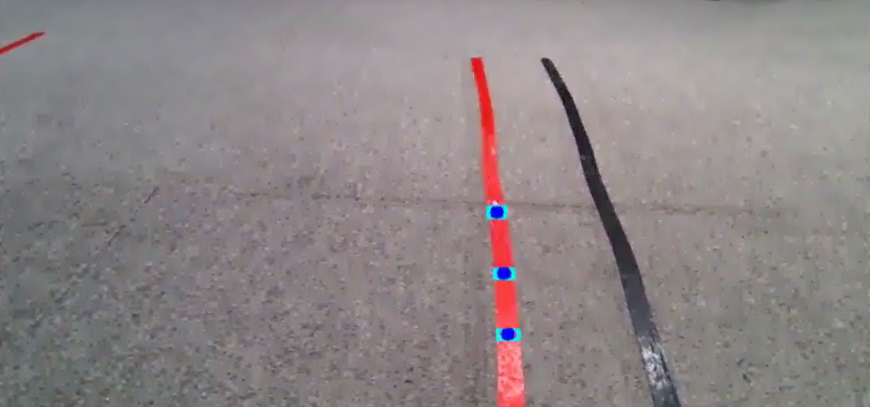

7. In the second terminal, enter the command and press **Enter** to activate line following motion:

```bash
ros2 service call /line_following/set_running std_srvs/srv/SetBool "{data: True}"
```

8. To terminate the application, press **Ctrl+C** in the first command terminal. If termination fails, repeat the key combination.

### 6.9.3 Program Outcome

> [!NOTE]
>
> **Ensure that no extraneous objects matching the target colors enter the field of view of the camera after launching the application, preventing interference with detection.**

Place the robot onto the designated floor track. Once the application starts and the line of the target color is identified, the robot advances along the line.

### 6.9.4 Program Analysis

#### 6.9.4.1 Launch File Analysis

The source code is located at:

**/home/ubuntu/ros2_ws/src/app/launch/line_following_node.launch.py**

* Defines startup components, obtains paths to the **controller** and **peripherals** packages, includes **lidar.launch.py**, **depth_camera.launch.py**, and **controller.launch.py**, defines the `line_following` executable, and returns the launch action list.

```python
def launch_setup(context):
    compiled = os.environ['need_compile']
    debug = LaunchConfiguration('debug', default='false')
    debug_arg = DeclareLaunchArgument('debug', default_value=debug)
    if compiled == 'True':
        controller_package_path = get_package_share_directory('controller')
        peripherals_package_path = get_package_share_directory('peripherals')
    else:
        controller_package_path = '/home/ubuntu/ros2_ws/src/driver/controller'
        peripherals_package_path = '/home/ubuntu/ros2_ws/src/peripherals'
    line_following_node = GroupAction([
        IncludeLaunchDescription(
            PythonLaunchDescriptionSource(
                os.path.join(peripherals_package_path, 'launch/lidar.launch.py')),
            condition=IfCondition(debug),
            ),

        IncludeLaunchDescription(
            PythonLaunchDescriptionSource(
                os.path.join(peripherals_package_path, 'launch/depth_camera.launch.py')),
            condition=IfCondition(debug),
            ),

        IncludeLaunchDescription(
            PythonLaunchDescriptionSource(
                os.path.join(controller_package_path, 'launch/controller.launch.py')),
            condition=IfCondition(debug),
            ),

        Node(
            package='app',
            executable='line_following',
            output='screen',
            parameters=[{'debug': debug}],
            ),
    ])

    return [debug_arg,
            line_following_node,
            ]
```

* Acts as the entry function of the ROS 2 launch file, defining the items to start.

```python
def generate_launch_description():
    return LaunchDescription([
        OpaqueFunction(function = launch_setup)
    ])
```

* Creates a `LaunchService` instance and passes the launch description to execute it.

```python
if __name__ == '__main__':
    # Create a LaunchDescription object
    ld = generate_launch_description()

    ls = LaunchService()
    ls.include_launch_description(ld)
    ls.run()
```

#### 6.9.4.2 Python Source Code Analysis

The source code is located at:

**/home/ubuntu/ros2_ws/src/app/app/line_following.py**

* `get_area_max_contour` locates and returns the contour with the largest area above a specified threshold. Parameter `contours` provides a list of detected contours, and `threshold` defines the minimum valid contour area.

```python
    def get_area_max_contour(contours, threshold=100):
        '''
        Get the contour of the largest area
        :param contours:
        :param threshold:
        :return:
        '''
        contour_area = zip(contours, tuple(map(lambda c: math.fabs(cv2.contourArea(c)), contours)))
        contour_area = tuple(filter(lambda c_a: c_a[1] > threshold, contour_area))
        if len(contour_area) > 0:
            max_c_a = max(contour_area, key=lambda c_a: c_a[1])
            return max_c_a
        return None
```

* Image processing routine: Crops region of interest, or ROI, windows, converts color spaces to LAB, filters noise using Gaussian blur, applies binarization, dilates and erodes contours, and extracts valid lines.

```python
        for roi in self.rois:
            blob = image[int(roi[0]*h):int(roi[1]*h), int(roi[2]*w):int(roi[3]*w)]  # Crop ROI
            img_lab = cv2.cvtColor(blob, cv2.COLOR_RGB2LAB)  # Convert RGB to LAB
            img_blur = cv2.GaussianBlur(img_lab, (3, 3), 3)  # Perform Gaussian filtering to reduce noise
            mask = cv2.inRange(img_blur, lowerb, upperb)  # Binarization
            eroded = cv2.erode(mask, cv2.getStructuringElement(cv2.MORPH_RECT, (3, 3)))  # Erode
            dilated = cv2.dilate(eroded, cv2.getStructuringElement(cv2.MORPH_RECT, (3, 3)))  # Dilate
            contours = cv2.findContours(dilated, cv2.RETR_EXTERNAL, cv2.CHAIN_APPROX_TC89_L1)[-2]  # Find contours
            max_contour_area = self.get_area_max_contour(contours, 30)  # Get largest valid contour
```

* ROS 2 node initialization: Configures publishers for chassis locomotion and servo control, as well as service servers.

```python
        self.cmd_vel_pub = self.create_publisher(Twist, '/controller/cmd_vel', 1)  # Chassis control
        self.pwm_pub = None
        self.pwm_pub = self.create_publisher(SetPWMServoState, 'pwm_servo_controller', 1)
        self.result_publisher = self.create_publisher(Image, '~/image_result', 1)  # Publish processed image
        self.create_service(Trigger, '~/enter', self.enter_srv_callback)  # Enter application
        self.create_service(Trigger, '~/exit', self.exit_srv_callback)  # Exit application
        self.create_service(SetBool, '~/set_running', self.set_running_srv_callback)  # Start application
        self.set_color_srv = self.create_service(SetString, '~/set_color', self.set_color_srv_callback)
        self.create_service(SetPoint, '~/set_target_color', self.set_target_color_srv_callback)  # Set target color
        self.create_service(Trigger, '~/get_target_color', self.get_target_color_srv_callback)   # Get target color
        self.create_service(SetFloat64, '~/set_threshold', self.set_threshold_srv_callback)  # Set threshold
```

* Main execution loop: Displays camera frames and registers the mouse click callback.

```python
    def main(self):
        while True:
            try:
                image = self.image_queue.get(block=True, timeout=1)
            except queue.Empty:
                continue

            result = cv2.cvtColor(image, cv2.COLOR_RGB2BGR)
            cv2.imshow("image", result)
            if self.debug and not self.set_callback:
                self.set_callback = True
                # Set callback function for mouse clicking event
                cv2.setMouseCallback("image", self.mouse_callback)
            k = cv2.waitKey(1)
            if k != -1:
                break
        rclpy.shutdown()
```

* Mouse click callback: Records click coordinates x and y, mapping them relative to display dimensions.

```python
    def mouse_callback(self, event, x, y, flags, param):
        if event == cv2.EVENT_LBUTTONDOWN:
            self.get_logger().info("x:{} y{}".format(x, y))
            msg = SetPoint.Request()
            if self.image_height is not None and self.image_width is not None:
                msg.data.x = x / display_size[0]
                msg.data.y = y / display_size[1]
                self.set_target_color_srv_callback(msg, SetPoint.Response())
```

* Service callback `enter_srv_callback`: Resets parameters, initializes joint positions, and subscribes to LiDAR and camera streams.

```python
    def enter_srv_callback(self, request, response):
        self.get_logger().info('\033[1;32m%s\033[0m' % "line following enter")
        with self.lock:
            self.color = ''
            self.stop = False
            self.is_running = False
            self.color_picker = None
            self.pid = pid.PID(1.1, 0.0, 0.0)
            self.follower = None
            self.threshold = 0.5
            self.empty = 0
            if self.image_sub is None:
                self.image_sub = self.create_subscription(Image, '/depth_cam/rgb/image_raw', self.image_callback, 1)  # Subscribe to camera

            if self.lidar_sub is None:
                qos = QoSProfile(depth=1, reliability=QoSReliabilityPolicy.BEST_EFFORT)
                self.lidar_sub = self.create_subscription(LaserScan, '/scan', self.lidar_callback, qos)  # Subscribe to LiDAR data
            set_servo_position(self.joints_pub, 1, ((24, 500), (23, 500), (22, 150), (21, 130), (20, 720), (19, 500)))

        response.success = True
        response.message = "enter"
        return response
```

* Service callback `set_target_color_srv_callback`: Retrieves target color coordinates from client requests. If coordinate values equal -1, the color picker is cleared.

```python
    def set_target_color_srv_callback(self, request, response):
        self.get_logger().info('\033[1;32m%s\033[0m' % "set_target_color")
        with self.lock:
            self.use_color_picker = True
            x, y = request.data.x, request.data.y
            self.follower = None
            if x == -1 and y == -1:
                self.color_picker = None
            else:
                self.color_picker = ColorPicker(request.data, 5)
        response.success = True
        response.message = "set_target_color"
        return response
```

* Callback `lidar_callback`: Evaluates LiDAR scan data on left and right sectors, halting locomotion if obstacle distances fall below the safety threshold. Locomotion resumes after 5 consecutive unobstructed scans.

```python
    def lidar_callback(self, lidar_data):
        # Data points = scanning angle / angle increment per beam
        if self.lidar_type == 'SCLIDAR':
            num_points = len(lidar_data.ranges)
            shifted_ranges = list(lidar_data.ranges[num_points//2:]) + list(lidar_data.ranges[:num_points//2])
            max_index = int(math.radians(MAX_SCAN_ANGLE / 2.0) / lidar_data.angle_increment)
            left_ranges = shifted_ranges[:max_index]
            right_ranges = shifted_ranges[::-1][:max_index]
        else:
            min_index = int(math.radians(MAX_SCAN_ANGLE / 2.0) / lidar_data.angle_increment)
            max_index = int(math.radians(MAX_SCAN_ANGLE / 2.0) / lidar_data.angle_increment)
            left_ranges = lidar_data.ranges[:max_index]  # Left sector data
            right_ranges = lidar_data.ranges[::-1][:max_index]  # Right sector data

        # Sample ranges according to configuration
        angle = self.scan_angle / 2
        angle_index = int(angle / lidar_data.angle_increment + 0.50)
        left_range, right_range = np.array(left_ranges[:angle_index]), np.array(right_ranges[:angle_index])

        left_nonzero = left_range.nonzero()
        right_nonzero = right_range.nonzero()
        left_nonan = np.isfinite(left_range[left_nonzero])
        right_nonan = np.isfinite(right_range[right_nonzero])
        # Determine minimum distance on left and right
        min_dist_left_ = left_range[left_nonzero][left_nonan]
        min_dist_right_ = right_range[right_nonzero][right_nonan]
        if len(min_dist_left_) > 0 and len(min_dist_right_) > 0:
            min_dist_left = min_dist_left_.min()
            min_dist_right = min_dist_right_.min()
            if min_dist_left < self.stop_threshold or min_dist_right < self.stop_threshold:
                self.stop = True
            else:
                self.count += 1
                if self.count > 5:
                    self.count = 0
                    self.stop = False
```

## 6.10 KCF Target Tracking
<p id ="p6-10"></p>

### 6.10.1 Introduction to KCF

Kernel Correlation Filter, commonly abbreviated as KCF, is a tracking algorithm proposed by Joao F. Henriques, Rui Caseiro, Pedro Martins, and Jorge Batista in 2014.

KCF operates as a discriminative tracking method. Its primary mechanism leverages circulant matrices formed by regions surrounding the target to collect positive and negative samples, training a ridge regression target detector. The detector then assesses whether candidate regions in subsequent frames represent the target, updating the sample set and the model weights in real time.

### 6.10.2 Overview

The implementation workflow of this experiment proceeds as follows:

First, the program instantiates a KCF tracker and subscribes to the camera node topic to acquire real-time video frames.

Next, incoming camera images undergo format conversion, scaling, and copying.

Subsequently, the `selectROI` function allows manual selection of the target bounding box on the screen. Using these rectangular coordinates and image data, the KCF tracker initializes and starts tracking.

Finally, the detection model evaluates subsequent frames to update the target bounding box. The `rectangle` function draws the bounding box, rendering the visual feedback directly on the camera feed.

### 6.10.3 Operating Steps

> [!NOTE]
>
> **Command-line instructions are case-sensitive. Press Tab to autocomplete commands.**

1. Power on the JetHexa robot and connect to the remote desktop software NoMachine. For remote desktop connection details, refer to [1. Tutorials/1. JetHexa User Manual/1.4 Development Environment Setup](https://drive.google.com/drive/folders/1fFo3fA72xG8UAcqcdB7UyhIA6pN2Gjrq?usp=sharing).

2. Click the desktop icon  to open a command terminal.

3. Enter the command to terminate background auto-start services:

```bash
~/.stop_ros.sh
```

4. Enter the command to launch KCF target tracking:

```bash
ros2 launch example kcf.launch.py
```

5. To terminate the application, press **Ctrl+C** in the command terminal. If termination fails, repeat the key combination.

### 6.10.4 Program Outcome

After launching the node, press **s** to freeze the frame, then click and drag the left mouse button to define the target bounding box. To reselect, press **c** and press **s** again.

Once selected, press **Space** or **Enter** to start tracking. A blue bounding box marks the tracking target on the camera feed, and the robot rotates left or right to track the target.

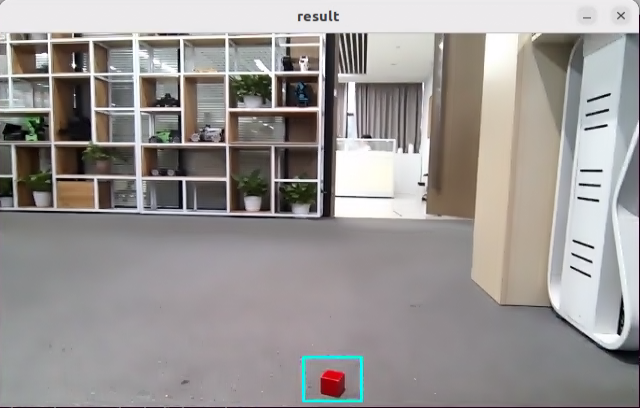

### 6.10.5 Program Analysis

#### 6.10.5.1 Launch File Analysis

The source code is located at:

**/home/ubuntu/ros2_ws/src/example/example/opencv_example/kcf.launch.py**

* Defines startup components, obtains paths to the **controller** and **peripherals** packages, includes **depth_camera.launch.py** and **controller.launch.py**, instantiates the ROS 2 node `kcf_node`, defines the executable, and returns the launch action list.

```python
def launch_setup(context):
    compiled = os.environ['need_compile']

    if compiled == 'True':
        controller_package_path = get_package_share_directory('controller')
        peripherals_package_path = get_package_share_directory('peripherals')
    else:
        controller_package_path = '/home/ubuntu/ros2_ws/src/driver/controller'
        peripherals_package_path = '/home/ubuntu/ros2_ws/src/peripherals'

    depth_camera_launch = IncludeLaunchDescription(
        PythonLaunchDescriptionSource(
            os.path.join(peripherals_package_path, 'launch/depth_camera.launch.py')),
    )

    controller_launch = IncludeLaunchDescription(
        PythonLaunchDescriptionSource(
            os.path.join(controller_package_path, 'launch/controller.launch.py')),
    )

    kcf_node = Node(
        package='example',
        executable='kcf',
        output='screen',
    )

    return [
            controller_launch,
            depth_camera_launch,
            kcf_node,
            ]
```

* Acts as the entry function of the ROS 2 launch file, defining the items to start.

```python
def generate_launch_description():
    return LaunchDescription([
        OpaqueFunction(function = launch_setup)
    ])
```

* Creates a `LaunchService` instance and passes the launch description to execute it.

```python
if __name__ == '__main__':
    # Create a LaunchDescription object
    ld = generate_launch_description()

    ls = LaunchService()
    ls.include_launch_description(ld)
    ls.run()
```

#### 6.10.5.2 Python Source Code Analysis

The source code is located at:

**/home/ubuntu/ros2_ws/src/example/example/opencv_example/include/kcf.py**

* ROS 2 node initialization: Configures publishers, subscribers, service clients, and timers.

```python
        if self.camera == 'usb_cam':
            self.pwm_pub = self.create_publisher(SetPWMServoState, 'pwm_servo_controller', 1)
        else:
            self.cmd_vel_pub = self.create_publisher(Twist, '/controller/cmd_vel', 1)  # Chassis control

        self.image_sub = self.create_subscription(Image, '/depth_cam/rgb/image_raw', self.image_callback, 1)  # Camera subscriber

        timer_cb_group = ReentrantCallbackGroup()
        self.client = self.create_client(Trigger, '/controller_manager/init_finish')
        self.client.wait_for_service()

        self.timer = self.create_timer(0.0, self.init_process, callback_group=timer_cb_group)
```

* Initialization function: Cancels the timer, initializes pan-tilt servos or hexapod gait locomotion, and launches the worker thread.

```python
    def init_process(self):
        self.timer.cancel()

        if self.camera == 'usb_cam':
            self.init_pwm_servo()
        else:
            self.controller.traveling(gait=-2, time=1, steps=0)

        threading.Thread(target=self.main, daemon=True).start()
        self.create_service(Trigger, '~/init_finish', self.get_node_state)
```

* Image callback function: Converts ROS image messages to OpenCV format and buffers them in the processing queue.

```python
    def image_callback(self, ros_image):
        # Convert image to OpenCV format
        cv_image = self.bridge.imgmsg_to_cv2(ros_image, "bgr8")
        bgr_image = np.array(cv_image, dtype=np.uint8)

        if self.image_queue.full():
            # If the queue is full, discard the oldest image
            self.image_queue.get()
        # Push image into the queue
        self.image_queue.put(bgr_image)
```

* Main execution loop: Processes buffered images, initializes the KCF tracker upon user ROI selection, updates tracking state, and calculates motion commands.

```python
    def main(self):
        while self.running:
            rgb_image = self.image_queue.get()
            result_image = np.copy(rgb_image)
            factor = 1
            rgb_image = cv2.resize(rgb_image, (int(result_image.shape[1]/ factor), int(result_image.shape[0]/ factor)))

            if self.tracker is None:
                if self.enable_select:
                    roi = cv2.selectROI("result", result_image, False)
                    roi =  tuple(int(i / factor)for i in roi)

                    if roi[2] > 0 and roi[3] > 0:
                        param = cv2.TrackerKCF.Params()
                        param.detect_thresh = 0.2
                        self.tracker = cv2.TrackerKCF_create(param)
                        self.tracker.init(rgb_image, roi)

            else:
                status, box = self.tracker.update(rgb_image)
                if status:
                    p1 = int(box[0] * factor), int(box[1] * factor)
                    p2 = p1[0] + int(box[2] * factor), p1[1] + int(box[3] * factor)
                    cv2.rectangle(result_image, p1, p2, (255, 255, 0), 2)
                    center_x, center_y = (p1[0] + p2[0]) / 2, (p1[1] + p2[1]) / 2

                    if self.camera == 'usb_cam':
                        self.track_with_pwm_servo(center_x, center_y, result_image.shape[1], result_image.shape[0])
                    else:
                        self.track_with_chassis(center_x, result_image.shape[1])

                else:
                    if self.camera == 'usb_cam':
                        self.pid_x.clear()
                        if self.pid_y is not None:
                            self.pid_y.clear()
                    else:
                        self.cmd_vel_pub.publish(Twist())

            cv2.imshow("result", result_image)

            key = cv2.waitKey(1)
            if key == ord('s'): # Press s to start selecting the tracking target
                if self.camera == 'aurora':
                    self.controller.traveling(gait=-2, time=1, steps=0)
                self.tracker = None
                self.enable_select = True
```
