# 7. ROS + Machine Learning Course

<p id="p7-course"></p>

## 7.1 Machine Learning Basics

<p id="p7-1"></p>

### 7.1.1 Introduction to Machine Learning

<p id="p7-1-1"></p>

#### 7.1.1.1 Preface

Artificial intelligence, commonly abbreviated as AI, is a technological science that researches and develops theories, methods, technologies, and application systems to simulate, extend, and expand human intelligence.

AI encompasses machine learning, computer vision, natural language processing, and deep learning. Machine learning is a foundational subfield of artificial intelligence, whereas deep learning is a specialized category of machine learning.

Since its inception, artificial intelligence has matured significantly in theoretical foundations and technological implementations, expanding its application fields and evolving into an independent engineering discipline.

#### 7.1.1.2 What Is Machine Learning

Machine learning constitutes the core of artificial intelligence and serves as the fundamental pathway for granting machines intelligent capabilities. It represents an interdisciplinary field integrating probability theory, statistics, approximation theory, convex analysis, and algorithm complexity theory.

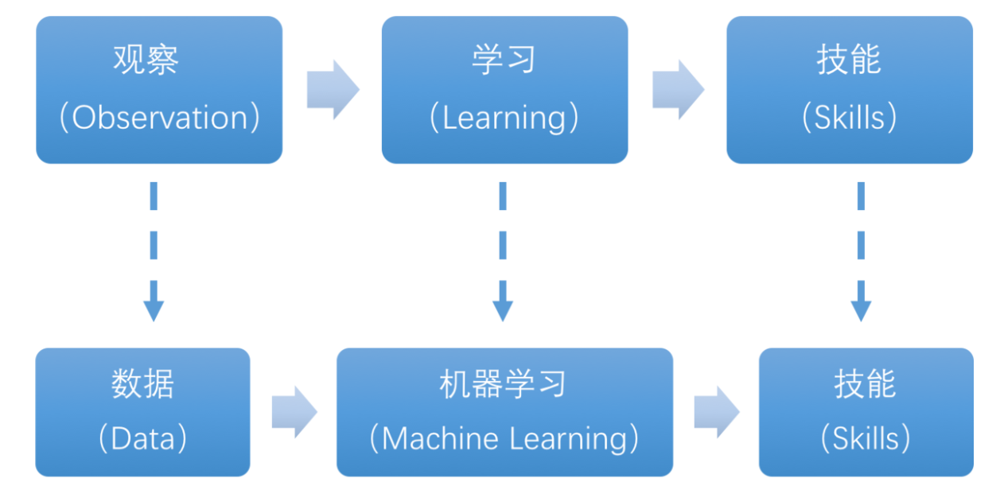

Machine learning investigates how computers acquire new knowledge or skills by simulating or executing human learning behaviors, reorganizing existing knowledge structures to continuously improve performance. From a practical engineering perspective, machine learning uses data to train models and employs those trained models to make predictions.

AlphaGo serves as a prime example, being the first artificial intelligence system to defeat a professional human Go player and a world champion. The primary operational principle of AlphaGo is deep learning, which extracts predictive insights by learning the intrinsic patterns and hierarchical representations of sample data.

#### 7.1.1.3 Classification of Machine Learning

Machine learning is broadly divided into supervised learning and unsupervised learning. The primary distinction lies in whether the classifications or underlying patterns of the dataset are known beforehand.

* **Supervised Learning**

Supervised learning provides an algorithm with a dataset along with corresponding correct answers, allowing the machine to learn computational mapping functions directly from the dataset. Supervised learning represents the most common machine learning category.

Labeled data: Training data used in supervised learning typically contains input features and corresponding labels or ground truth outputs. Input features describe data attributes, while labels represent target variables for prediction or classification. In image recognition, providing a large dataset of dog images labeled as "dog" supplies the correct answers, enabling the machine to recognize dogs in unseen images through iterative training.


Model selection: Supervised learning requires selecting a suitable model to represent relationships within the data. Common supervised learning models include linear regression, logistic regression, decision trees, support vector machines, or SVMs, and deep neural networks. Model selection depends on data characteristics and problem objectives.

Feature engineering: Feature engineering refers to preprocessing and transforming raw data to extract informative features. This workflow includes data cleaning, missing value imputation, data normalization or standardization, feature selection, and feature transformation. Well-designed feature engineering improves model performance and generalization capability.

Training and optimization: Using labeled training data, models are trained to fit relationships within the data. The training process involves defining a loss function, choosing an appropriate optimization algorithm, and iteratively adjusting model parameters to minimize the loss function. Common optimization algorithms include gradient descent and stochastic gradient descent.

Model evaluation: Following training completion, evaluating the model reveals its performance on unseen data. Standard evaluation metrics include accuracy, precision, recall, F1 score, and ROC curves. Evaluating model performance helps determine operational feasibility for practical applications.

In summary, supervised learning utilizes labeled training data to train models and employs those models to predict or classify new unlabeled data. Key phases comprise selecting appropriate models, performing feature engineering, training and optimizing models, and assessing performance metrics.

* **Unsupervised Learning**

Unsupervised learning supplies an algorithm with an unlabeled dataset without pre-assigned ground truth answers. The machine uncovers latent structural relationships directly from the dataset.

In image clustering, supplying an unlabeled collection of cat and dog images allows the machine to categorize the dataset into two separate groups, distinguishing cat images from dog images through pattern extraction.


### 7.1.2 Introduction to Machine Learning Libraries

<p id="p7-1-2"></p>

#### 7.1.2.1 Common Machine Learning Frameworks

Numerous machine learning frameworks exist throughout the robotics and data science ecosystems, with popular frameworks including PyTorch, TensorFlow, PaddlePaddle, and MXNet.

* **PyTorch**

Torch is an open-source machine learning framework released under the BSD License, widely applied across machine learning domains for multidimensional array computations. PyTorch is built upon Torch. Compared with Torch, PyTorch offers enhanced flexibility, dynamic computational graphs, and native Python interfaces.

Unlike the static computation graphs of TensorFlow, PyTorch employs dynamic computation graphs that adjust in real time according to computational requirements. This architecture allows developers to accelerate tensor operations via GPUs, construct dynamic computation graphs, and calculate gradients automatically.


* **TensorFlow**

TensorFlow is an open-source machine learning framework that facilitates rapid construction, training, evaluation, and serialization of neural networks. It implements machine learning and deep learning concepts in a streamlined manner, integrating computational algebra and optimization techniques to evaluate complex mathematical expressions efficiently.

TensorFlow runs across diverse hardware platforms and form factors, operating effectively on supercomputers, embedded devices, and standard workstations. TensorFlow leverages CPUs, GPUs, or combined heterogeneous computing architectures. Compared to other frameworks, TensorFlow remains well-suited for industrial deployment and production environments.

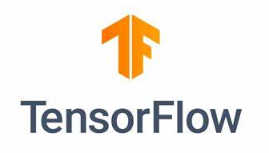

* **PaddlePaddle**

PaddlePaddle is a deep learning platform developed by Baidu. Based on extensive research and industrial applications, it integrates deep learning training, inference frameworks, foundational model repositories, end-to-end development suites, and rich toolkits. It represents an open-source, industrial-grade deep learning platform with comprehensive functionality.

Deep learning has achieved outstanding performance across machine learning applications in recent years, including image recognition, speech recognition, natural language processing, robotics, online advertising, automated medical diagnostics, and finance.


* **MXNet**

MXNet is a flexible and efficient deep learning framework supporting multiple programming language interfaces, such as Python, C++, Scala, and R. It provides dataflow graphs similar to Theano and TensorFlow, robust multi-GPU configurations, and high-level model construction blocks comparable to Lasagne and Blocks. It operates across various hardware platforms, including mobile devices.


MXNet focuses on operational efficiency and architectural flexibility. Acceleration libraries like MXNet provide powerful tools to help developers exploit the capabilities of GPUs and cloud computing. MXNet distributes computational tasks across dynamic cloud architectures through distributed parameter servers, achieving near-linear scaling across multiple GPUs and CPUs.

## 7.2 Machine Learning Applications

<p id="p7-2"></p>

### 7.2.1 GPU Acceleration

<p id="p7-2-1"></p>

#### 7.2.1.1 Introduction to GPU Accelerated Computing

A GPU, or Graphics Processing Unit, also termed a visual processor or display chip, is a dedicated microprocessor designed to perform graphics-related operations and parallel computations across personal computers, workstations, game consoles, and mobile devices such as tablets and smartphones.

GPU-accelerated computing combines GPUs with CPUs to accelerate the execution speed of scientific, analytical, engineering, consumer, and enterprise applications. GPUs accelerate application workloads across platforms including automobiles, mobile phones, tablets, drones, and robots.

#### 7.2.1.2 Performance Comparison Between GPU and CPU

As a Central Processing Unit, the CPU primarily handles multi-task management and process scheduling, possessing limited parallel compute throughput. Conversely, as a specialized graphics processor, the GPU handles extensive repetitive parallel computations while being less suited for intricate sequential logical branching.

CPUs and GPUs possess fundamentally distinct hardware architectures. The CPU utilizes a serial architecture with fewer cores, where each core provides powerful single-thread processing capabilities optimized for rapid individual task execution. The GPU utilizes a massively parallel architecture containing numerous smaller cores optimized for processing multiple concurrent tasks simultaneously.

Contrasting hardware structures reveals that the CPU incorporates multiple functional modules capable of handling diverse computing environments. The GPU architecture is streamlined, with streaming processors and memory controllers occupying the majority of its transistors.

Within a CPU, most transistors are allocated to control circuitry and cache memory, while only a small fraction performs arithmetic calculations. This configuration enhances CPU versatility, supporting diverse data types and complex branching logic, while constraining raw arithmetic throughput.

Within a GPU, the vast majority of transistors are dedicated to specialized computing units and parallel execution pipelines. This configuration significantly increases computation speed and maximizes floating-point operational capacity.

#### 7.2.1.3 Advantages of GPU

With massive core counts optimized for large-scale parallel data processing, GPUs exhibit decisive advantages in multimedia workloads and repetitive processing tasks.

In deep learning, neural network architectures analyze massive datasets at high speeds, a workload specifically suited to GPU parallel processing capabilities.

Furthermore, modern GPU architectures are not confined solely to graphics rendering algorithms. Beyond image processing, GPUs are widely applied in scientific computing, cryptography, numerical analysis, big data processing, and quantitative financial analytics where parallel matrix operations are essential.

### 7.2.2 TensorRT Acceleration

<p id="p7-2-2"></p>

#### 7.2.2.1 Introduction to TensorRT

TensorRT is a high-performance deep learning inference SDK developed by NVIDIA. It includes a deep learning inference optimizer and runtime environment, providing low latency and high throughput for production deep learning inference applications.

TensorRT supports major deep learning frameworks such as TensorFlow, Caffe, MXNet, and PyTorch. Combining TensorRT with NVIDIA GPUs enables rapid, high-efficiency inference deployment across diverse frameworks.

Deep learning models can be optimized through various techniques, including model weight quantization, weight sparsification, and channel pruning. These methods typically occur during the model training phase. In contrast, TensorRT optimizes trained models by restructuring and streamlining the network computation graph to boost inference efficiency.

#### 7.2.2.2 Optimization Methods


TensorRT incorporates several core optimization strategies:

1. Precision calibration for weights and activations
2. Layer and tensor fusion
3. Kernel auto-tuning
4. Dynamic tensor memory
5. Multi-stream execution

* **Precision Calibration for Weights and Activations**

Most deep learning frameworks train neural networks using 32-bit floating-point precision, known as FP32. Once training completes, backpropagation is no longer required during inference deployment. Consequently, numerical precision can be reduced to FP16 or INT8 without substantial accuracy degradation. Lowering numerical precision reduces memory footprint, minimizes latency, and decreases model file size.

The following table outlines the dynamic range across different numerical precisions:

| Precision |        Dynamic Range        |
| :-------- | :-------------------------: |
| FP32      | −3.4 × 10^38 ~ +3.4 × 10^38 |
| FP16      |       -65504 ~ +65504       |
| INT8      |         -128 ~ +127         |

INT8 representation encompasses only 256 distinct values. Directly quantizing FP32 values into INT8 risks significant information loss and performance degradation. TensorRT mitigates this issue by providing an automated calibration workflow, mapping FP32 tensors to INT8 precision while maintaining optimal dynamic range matching to minimize accuracy loss.

* **Layer and Tensor Fusion**

Although CUDA cores compute tensor operations rapidly, significant overhead arises from launching CUDA kernels and reading or writing input and output tensors for each layer, creating GPU resource underutilization and memory bandwidth bottlenecks.

TensorRT optimizes network structures by merging adjacent layers horizontally or vertically to reduce total layer count and minimize CUDA kernel calls.

Horizontal fusion merges convolution, bias, and activation layers into a unified CBR block executed by a single CUDA kernel. Vertical fusion combines layers with identical structures but different weights into a single broader layer, also executed by a single CUDA kernel.

For multi-branch architectures, TensorRT eliminates concatenation layers by directing layer outputs straight to designated memory addresses in a non-copying manner, reducing memory access overhead.

* **Kernel Auto-Tuning**

During inference calculations, the network calls GPU CUDA kernels. TensorRT tunes CUDA kernels dynamically across different algorithms, network architectures, and GPU platforms, ensuring the deployed model runs at optimal performance on the target hardware.

* **Dynamic Tensor Memory**

TensorRT allocates dedicated memory dynamically during the active lifecycle of each tensor, preventing redundant memory allocations, minimizing total VRAM footprint, and enhancing memory reuse efficiency.

* **Multi-Stream Execution**

Utilizing CUDA streams, TensorRT evaluates multiple execution paths of an identical input concurrently, maximizing GPU parallel execution capacity.

### 7.2.3 YOLO26 Model

<p id="p7-2-3"></p>

#### 7.2.3.1 Introduction to the YOLO Model Series

* **YOLO Series**

The YOLO, or You Only Look Once, series represents a single-stage regression-based object detection framework powered by deep learning.

Prior to the release of YOLOv1, the two-stage R-CNN family dominated object detection research. Although two-stage models achieved high accuracy, their sequential proposals and classification architecture hindered real-time execution speeds.

YOLO addresses this latency challenge by redefining object detection as a single unified regression problem. Taking an entire image as input, the network predicts bounding box coordinates and class probabilities directly at the output layer. Compared to traditional detection frameworks, YOLO delivers high inference speed and robust mean average precision.

* **YOLO26**

YOLO26 is an advanced real-time object detection model introduced by Ultralytics, building upon previous YOLO iterations with enhanced detection speed and precision.

Core highlights of YOLO26:

1. Architectural simplification: Eliminates distribution focal loss, or DFL, streamlining bounding box regression and enhancing model export compatibility.
2. End-to-end inference: Employs an NMS-free architecture that outputs detection results directly, reducing latency and deployment complexity.
3. Training enhancements: Introduces progressive loss balancing, known as ProgLoss, along with small-target-aware label assignment, known as STAL, improving detection stability for small objects.
4. Optimizer innovation: Utilizes the MuSGD optimizer, combining the advantages of SGD and Muon to accelerate model convergence.
5. Multi-task versatility: Provides a unified framework supporting object detection, instance segmentation, pose estimation, oriented bounding box detection, and image classification.
6. Edge optimization: Supports FP16 and INT8 quantization, enabling low-latency real-time inference on edge computing devices such as NVIDIA Jetson.
7. Benchmark performance: Achieves high accuracy across benchmarks such as COCO, increasing CPU inference speed by up to 43% compared to previous generations.

#### 7.2.3.2 YOLO26 Model Architecture

* **Constituent Elements**

1. Convolutional layer: Extracts visual features from input images.

Convolution describes how an event occurring repeatedly across multiple previous time steps influences the current state. Convolution divides conceptually into two components: folding and accumulation.

Folding corresponds to inverting or shifting data, while accumulation represents the accumulated impact of historical inputs upon the present state. Inverting the data establishes relationships across points, providing a reference framework for evaluating cumulative effects.


In YOLO26, the processed inputs are images. Because images in computer vision are two-dimensional, the corresponding operation is 2D convolution. The purpose of 2D convolution is feature extraction, which relies on convolution kernels.

A convolution kernel represents the basic unit area over which convolution operations are calculated. Kernel dimensions are defined in pixels, integrating pixel values across the target area during calculation. Convolution is performed by sliding the kernel across the image, with kernel dimensions specified during network design.

During convolution, the outer image boundary remains unchanged or expands by designated pixels through padding, and computed results are populated into corresponding positions. For instance, a 6 × 6 resolution image can be padded to 7 × 7, passed through the convolution kernel, and mapped back into a 6 × 6 blank image canvas.


2. Pooling layer: Amplifies prominent image features.

The pooling layer, also termed a downsampling layer, operates in conjunction with convolutional layers. Once convolution finishes, the pooling layer conducts subsampling operations upon the extracted feature maps. Pooling methods include global pooling, average pooling, and max pooling, each producing distinct feature abstractions.

Max pooling serves as a representative example. Similar to convolution kernels, max pooling relies on filters defined by preset window dimensions. The filter slides across the image, filtering pixels within each receptive field.


Max pooling preserves the most prominent features while discarding minor background details. For a 6 × 6 resolution image, calculating over the input with a 2 × 2 filter generates a downsampled output representation.


3. Upsampling layer: Restores image resolution.

Upsampling functions conceptually as inverse pooling. Downsampled images shrink in resolution, whereas upsampling expands them back to their original dimensions. Although resolution is restored, the feature maps reflect transformations acquired during prior processing.

For a 6 × 6 resolution image, evaluating the input through a 3 × 3 filter generates the reconstructed output image.


4. Batch normalization layer: Organizes data distribution.

Batch normalization realigns data distributions across batches, reducing optimization difficulty and enabling better mapping into activation functions.

Batch normalization mitigates feature loss across calculation steps, ensuring informative features persist into subsequent layers. Across iterative training cycles, this process improves model sensitivity and convergence speed.

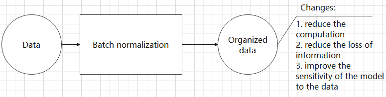

5. ReLU layer: Activation function.

Incorporating activation functions introduces non-linearity into neural network models. Without activation functions, each layer performs basic matrix multiplications where outputs remain linear combinations of inputs, preventing models from learning complex non-linear representations.

Common activation functions include ReLU, Tanh, and Sigmoid. The Rectified Linear Unit, or ReLU, is a piecewise activation function that replaces negative values with 0 while keeping positive values unchanged.


6. Add layer: Tensor addition.

Features consist of prominent and subtle visual characteristics. The Add layer performs element-wise tensor addition to reinforce salient feature activations.


7. Concat layer: Tensor concatenation.

The Concat layer concatenates tensors along feature dimensions, merging representations extracted through different pathways to preserve diverse contextual details.


* **Composite Architectural Units**

Building models strictly from standalone layers produces verbose code and ambiguous modular structures. Combining elementary layers into standardized composite blocks enhances model design efficiency and maintainability.

1) Convolutional Unit

A convolutional unit comprises a convolutional layer, a batch normalization layer, and an activation function. Processing proceeds sequentially through convolution, batch normalization, and activation.


2) Alternate-Column Slicing and Concatenation Unit, or Focus

The Focus unit divides an input image into multiple larger macro-regions and stitches together sub-patches residing at identical relative coordinates across these macro-regions. This decomposes the original image into downsampled multi-channel slices, which are then passed to a convolutional unit for feature extraction.

As illustrated below, taking an image with a resolution of 6 × 6 as an example, setting a macro-region size of 2 × 2 divides the image into 9 macro-regions, with each containing 4 sub-patches.

Concatenating sub-patches located at position 1 yields a 3 × 3 slice. Applying the same slicing method across remaining positions decomposes the original 6 × 6 image into four distinct 3 × 3 feature slices.


3) Residual Unit

Residual units facilitate learning subtle feature variations across image patterns. The architecture utilizes two parallel data paths combined through additive superposition.

The first path routes data through two consecutive convolutional units for feature extraction. The second shortcut path bypasses convolution, preserving the original input directly. The outputs of both paths are then summed element-wise.

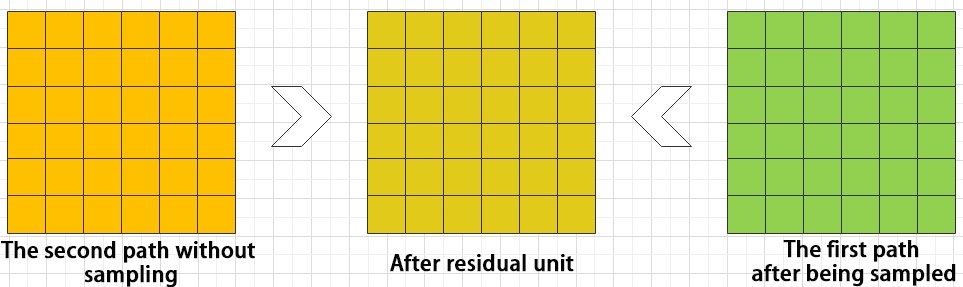

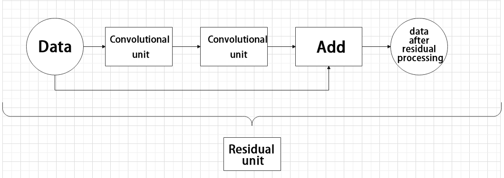

4) Composite Convolutional Unit

In YOLO26, the composite convolutional unit supports modular customization according to architectural requirements. It also combines data streams from two distinct processing branches.

The first branch routes through a single convolutional layer. The second branch processes through 2x + 1 convolutional units followed by a convolutional layer. Following concatenation, the merged representations pass through batch normalization, an activation function, and a final convolutional unit.


5) Composite Residual Convolutional Unit

This block modifies the composite convolutional unit by substituting 2x convolutional units with x residual units. In YOLO26, composite residual units provide flexible customization tailored to network depth.


6) Composite Pooling Unit

The output of a convolutional unit feeds into three parallel max pooling layers alongside one unperturbed passthrough branch. Merging outputs across these four paths yields a concatenated tensor routed into a final convolutional unit. This structure amplifies prominent features across diverse receptive scales.


### 7.2.4 YOLO26 Execution Workflow

<p id="p7-2-4"></p>

This section details the model execution workflow using prior bounding boxes, predicted bounding boxes, and anchor bounding boxes in YOLO26.

#### 7.2.4.1 Prior Bounding Box

When feeding images into the network, defining target identification zones is necessary. Prior bounding boxes serve to delineate target recognition regions on the input image beforehand.

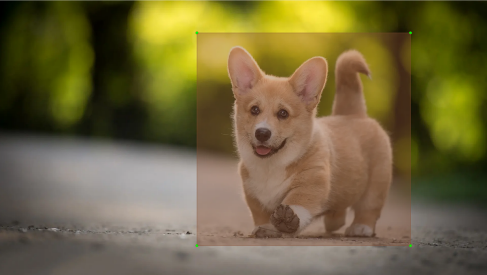

#### 7.2.4.2 Predicted Bounding Box

Predicted bounding boxes require no manual definition, emerging as direct model inference outputs. When the initial batch of training data passes through the network, predicted bounding boxes generate automatically. Positions with high occurrence frequencies of target classes are assigned as prediction box centers.


#### 7.2.4.3 Anchor Bounding Box

Once predicted bounding boxes generate, variations in spatial location and scale may occur. Anchor bounding boxes calibrate predicted boxes to correct size and position offsets.

The generation coordinates of anchor boxes depend on predicted box placements. To guide subsequent predicted bounding box locations, anchor boxes establish relative center coordinates based on current predicted box distributions.


#### 7.2.4.4 Implementation Workflow

Following calibration, prior bounding boxes appear on the image. Upon ingesting image data, the model generates predicted bounding boxes relative to prior box locations. Anchor boxes then generate accordingly, after which model weights update based on the current training loss.

Each newly generated prediction box is influenced by preceding anchor box adjustments. Iterating this cycle progressively eliminates position and dimension offsets until predicted bounding boxes align with prior bounding boxes.


### 7.2.5 Image Collection and Annotation

<p id="p7-2-5"></p>

Training YOLO26 models requires substantial data, necessitating prior data collection and annotation.

#### 7.2.5.1 Image Collection

1. Start the robot and establish a remote connection to the system desktop via **NoMachine**.

2. Click the desktop icon 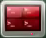 to open a command-line terminal.

3. Enter the command to disable the auto-start service:

```bash
~/.stop_ros.sh
```

4. Enter the command to launch the depth camera service:

```bash
ros2 launch peripherals depth_camera.launch.py
```

5. Open a new command-line terminal, enter the command, and press **Enter** to create a dataset storage directory, using **my_data** as an example:

```bash
mkdir -p ~/my_data
```

6. Enter the command to launch the image collection tool:

```bash
cd ~/software/collect_picture && python3 main.py
```

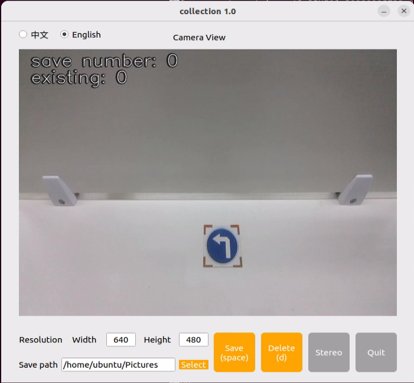

In the upper-left corner of the window, **save number** indicates the image index, and **existing** indicates the total quantity of saved images.

7. Click **Select** to adjust the save path to the created **/home/ubuntu/my_data** directory.

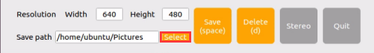

8. Once the corresponding directory is selected, click **Choose**.

9. Position the target object within the camera field of view. Click the save button or press the spacebar to save the current camera frame.


Upon saving the frame, a folder named **JPEGImages** generates automatically under `/home/ubuntu/my_data` to store captured images.

> [!NOTE]
>
> * **Capture target objects across diverse distances, rotation angles, and tilt perspectives to improve model generalization.**
>
> * **To ensure reliable identification performance, maintain an adequate volume of training images, with approximately 100 images recommended for each category.**

10. After concluding image collection, click **Quit** to close the tool.


11. Press **Ctrl + C** across all opened terminal windows to terminate active background tasks.

#### 7.2.5.2 Image Annotation

Following image collection, annotating the dataset is essential. Annotations inform the model which regions correspond to specific target classes, enabling recognition across unseen test imagery.

> [!NOTE]
>
> **Commands are case-sensitive. Press the Tab key to autocomplete directory paths and command strings.**

1. Click the desktop icon  to open a command terminal, and enter the command to launch the annotation software:

```bash
python3 ~/software/roLabelImg/roLabelImg.py
```

2. Click **File** in the upper-left menu, choose **Open Dir**, navigate to the directory containing collected images, and click **Open**.

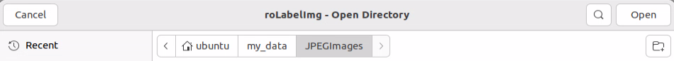

3. Click **File**, select **Change default saved Annotation dir**, designate the **Annotations** directory inside the **my_data** folder, and click **Open**.

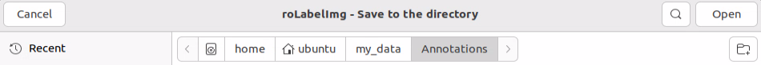

4. Click **View** in the menu bar and select **Advanced Mode** to enable oriented bounding box annotation.

5. Press **e** to annotate an oriented bounding box. Press **d** for the next image and **a** for the previous image. Press **c** for fine clockwise rotation and **x** for fine counterclockwise rotation. Press **v** for coarse clockwise rotation and **z** for coarse counterclockwise rotation. After annotating each frame, press **Ctrl + S** or click the **Save** icon on the toolbar to save annotations.

> [!NOTE]
>
> **Rotate bounding boxes using the C and X keys to align the rectangular envelope precisely with object contours, preventing accuracy degradation during subsequent inference.**

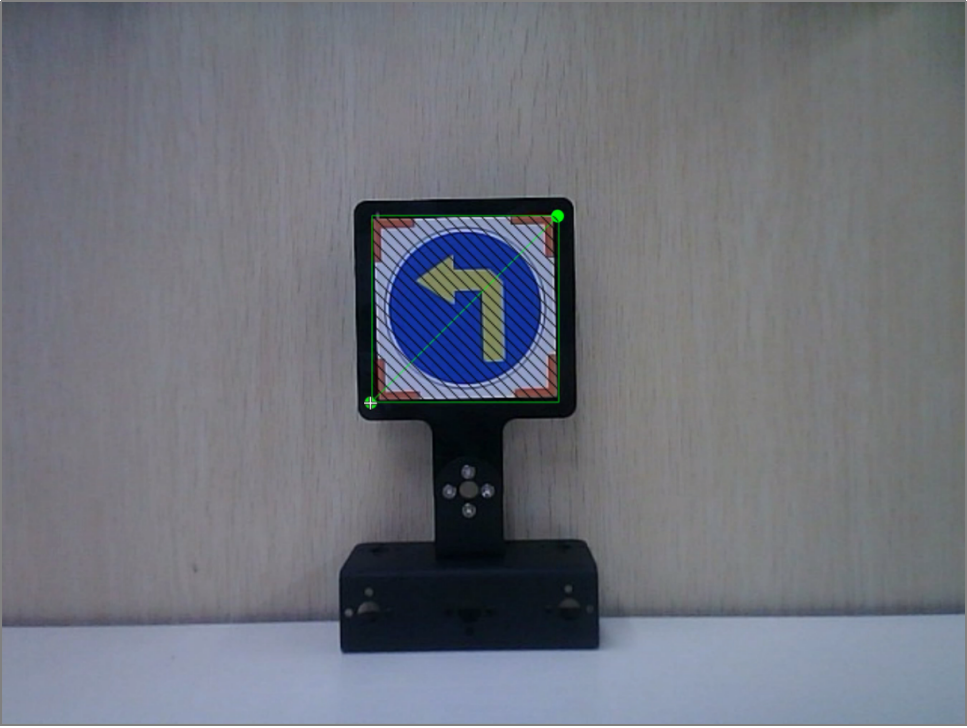

6. In the prompt window, enter the target class name, specifying **left** for this exercise. Click **OK** or press **Enter** to confirm the label.

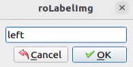

7. Press **Ctrl + S** to save the annotation metadata for the current image.

8. Press **d** to proceed to the next image. Repeat steps 5 through 7 until all frames are annotated, and then click the close button in the top-right corner to exit.

### 7.2.6 Data Format Conversion

<p id="p7-2-6"></p>

1. Click the desktop icon  to open a command-line terminal, and enter the command:

```bash
vim ~/my_data/classes.names
```

2. Press **i** to enter Insert mode, and type the annotated class name **left** into the document, using newlines to separate multiple categories if necessary.

3. Press **Esc**, enter the command, and press **Enter** to save changes and exit:

```bash
:wq
```

> [!NOTE]
>
> **Class labels added here must match the nomenclature defined in the image annotation software exactly.**

4. Return to the terminal, enter the conversion command, and press **Enter**:

```bash
python3 ~/third_party/yolo/xml2yolo_obb.py --data ~/my_data --yaml ~/my_data/data.yaml
```

### 7.2.7 Model Training

<p id="p7-2-7"></p>

> [!NOTE]
>
> **Commands are case-sensitive. Press the Tab key to autocomplete directory paths and command strings.**

1. Enter the training execution command and press **Enter**:

```bash
python3 ~/third_party/yolo/train.py --img 640 --weights yolo26n.pt --data /home/ubuntu/my_data/data.yaml --batch 16 --epochs 300
```

In this command, `img` specifies the image resolution, `batch` determines the batch size per iteration, and `epochs` defines the total training cycles. Adjust these parameters according to training requirements. Increasing the epoch count enhances model robustness, although overall training duration increases accordingly.

2. The terminal output shown below indicates that model training is underway:

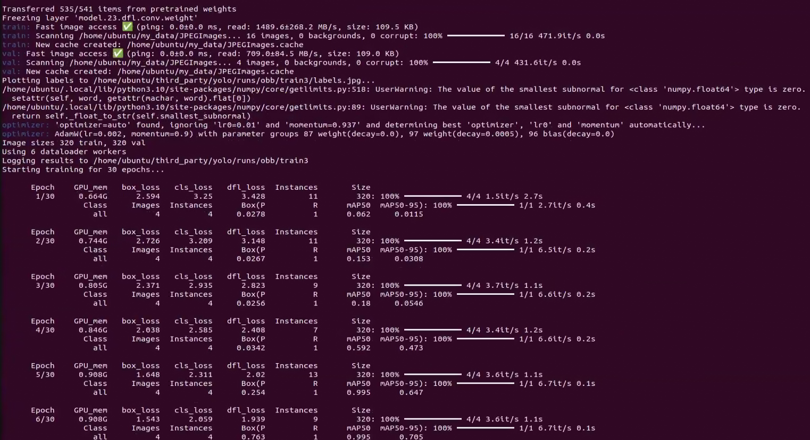

3. Upon training completion, the terminal displays the path of generated artifact files, confirming that training weights are saved within this target folder:

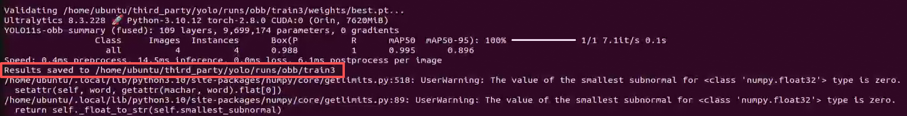

### 7.2.8 Exporting and Utilizing Engine Model

<p id="p7-2-8"></p>

1. Taking the generated training output directory as a reference, enter the folder using the following command:

```bash
cd ~/third_party/yolo/runs/obb/train3/weights
```

2. Enter the command to relocate the trained weight file into the target directory:

```bash
cp best.pt ~/third_party/yolo
```

3. Enter the command to initiate TensorRT engine export, and allow the compilation process to finish:

```bash
cd ~/third_party/yolo && python3 export.py --weights best.pt --include engine --imgsz 640 --device 0
```

4. Once conversion concludes, the serialized **.engine** file generates successfully:

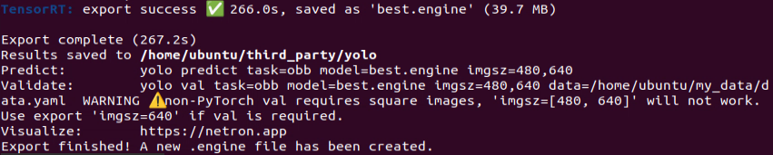

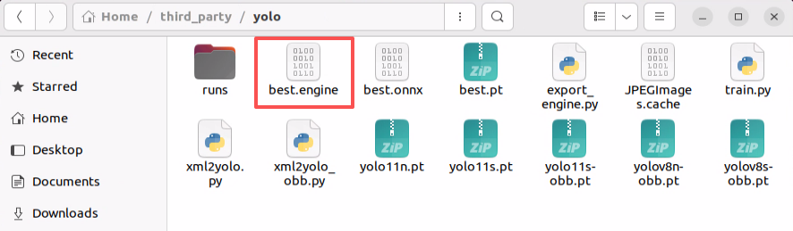

5. Copy the generated engine model into the **/ros2_ws/src/example/example/yolo_detect/models** directory, updating the path to match workspace specifics:

```bash
cp ~/third_party/yolo/best.engine ~/ros2_ws/src/example/example/yolo_detect/models
```

6. Open the launch script for editing:

```bash
gedit ~/ros2_ws/src/example/example/yolo_detect/yolo_detect.launch.py
```

Add the trained category **left** as the initial element of `yolo_names`, update `model_engine= 'yolo26n.engine'` to `model_engine= 'best.engine'`, and save and exit.

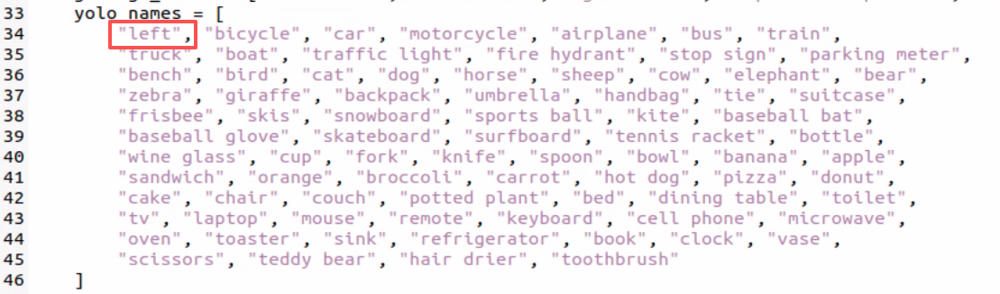

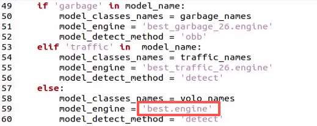

7. Enter the command and press **Enter** to verify real-time model detection performance:

```bash
ros2 launch example yolo_detect.launch.py model_name:=best
```

### 7.2.9 Waste Sorting

<p id="p7-2-9"></p>

#### 7.2.9.1 Principle of Experiment

The system subscribes to real-time image topics published by the camera node and converts image messages into NumPy arrays. The image feeds into the YOLO network for scaling, transposition, and batch expansion to derive detection predictions.

Next, bounding box coordinates of recognized waste cards transform into camera frame coordinates. Cards are classified into predefined categories according to detection labels, with bounding boxes, class names, and confidence scores overlaid on the video feed.

#### 7.2.9.2 Operation Steps

> [!NOTE]
>
> **Commands are case-sensitive. Press the Tab key to autocomplete directory paths and command strings.**

1. Start the robot and establish a remote connection to the desktop via **NoMachine**.

2. Click the desktop icon  to open a command-line terminal.

3. Enter the command and press **Enter** to disable the auto-start service:

```bash
~/.stop_ros.sh
```

4. Enter the command and press **Enter** to start the waste sorting application:

```bash
ros2 launch example garbage_classification.launch.py yolo:="yolo26"
```

5. To terminate the application, press **Ctrl + C** in the terminal window.

#### 7.2.9.3 Program Outcome

Position a waste card within the camera field of view. When detected, the card name displays on screen, and the robot picks up the card block and places it at the designated location according to its category.

| Waste Category   | Item Cards                                  |
| :--------------- | :------------------------------------------ |
| hazardous_waste  | Storage Battery, Marker, Oral Liquid Bottle |
| recyclable_waste | Plastic Bottle, Umbrella, Toothbrush        |
| food_waste       | Banana Peel, Ketchup, Broken Bones          |
| residual_waste   | Cigarette End, Plate, Disposable Chopsticks |

## 7.3 MediaPipe Human-Robot Interaction

<p id="p7-3"></p>

### 7.3.1 Introduction and Getting Started with MediaPipe

<p id="p7-3-1"></p>

#### 7.3.1.1 Overview of MediaPipe

MediaPipe is an open-source framework for building multimodal applied machine learning pipelines. It operates cross-platform on mobile devices, workstations, and servers, offering support for mobile GPU acceleration. MediaPipe supports TensorFlow and TensorFlow Lite inference engines, allowing deployment of TensorFlow and TF Lite models directly within its pipeline. It provides hardware-level GPU acceleration across embedded and mobile platforms.


#### 7.3.1.2 Advantages and Disadvantages of MediaPipe

* **Advantages of MediaPipe**

1) Cross-platform and multi-language support across iOS, Android, C++, Python, JavaScript, and Coral.

2) Fast execution speeds, supporting real-time inference on edge devices.

3) High reusability across pipeline components and source code modules.

* **Disadvantages of MediaPipe**

1) High storage footprint on constrained mobile systems, requiring over 10 MB of space.

2) Deep architectural dependency on TensorFlow, necessitating code refactoring when migrating to other machine learning frameworks.

3) Static computational graph architecture, which delivers computational efficiency but complicates runtime debugging.

#### 7.3.1.3 MediaPipe Workflow

The diagram below details the operational pipeline of MediaPipe. Solid paths denote custom application logic, while dashed segments represent built-in framework modules. MediaPipe integrates pre-trained AI models, enabling rapid pipeline construction for computer vision tasks.


* **Dependencies**

MediaPipe relies on OpenCV for video processing and FFmpeg for audio streaming. Other dependencies include OpenGL or Metal, TensorFlow, and Eigen. Acquire a foundational understanding of OpenCV before using MediaPipe by referring to [4. OpenCV Basics Course](https://drive.google.com/drive/folders/1eHhmAJRcb94_1GBQaXEGwdOpNiXOuiPL?usp=sharing).

* **MediaPipe Solutions**

Solutions are pre-built open-source modular examples built upon specialized TensorFlow or TFLite models. Currently, MediaPipe provides 16 solutions, including Face Detection, Face Mesh, Iris, Hands, Pose, and Holistic tracking.

#### 7.3.1.4 MediaPipe Learning Resources

* MediaPipe official website: [https://developers.google.com/mediapipe](https://developers.google.com/mediapipe)

* MediaPipe GitHub repository: [https://github.com/google/mediapipe](https://github.com/google/mediapipe)

* dlib official website: [http://dlib.net/](http://dlib.net/)

* dlib GitHub repository: [https://github.com/davisking/dlib](https://github.com/davisking/dlib)

### 7.3.2 Fingertip Trajectory Recognition

<p id="p7-3-2"></p>

This section utilizes the MediaPipe hand detection model to track palm joints. When a specific gesture is identified, the robot locks onto the fingertip, tracking its movement and rendering the trajectory path.

#### 7.3.2.1 Experiment Overview

First, instantiate a hand landmarker to extract hand joint positions and connect key landmarks.

Second, normalize landmark coordinates to calculate joint angles and classify the gesture.

Third, upon identifying a specific trigger gesture, record fingertip trajectory coordinates and render the resulting trajectory map.

This experiment combines OpenCV and MediaPipe. OpenCV acquires camera frames, handles color space conversions, and renders detected hand keypoint models. MediaPipe, an open-source cross-platform machine learning framework created by Google, provides trained computer vision models for real-time mobile, desktop, and server inference, displaying detected hand gestures on the display window.

#### 7.3.2.2 Operation Steps

> [!NOTE]
>
> **Commands are case-sensitive. Press the Tab key to autocomplete directory paths and command strings.**

1. Start the JetHexa robot and connect to the system desktop remotely via **NoMachine**. For connection instructions, refer to [1. Tutorials/1. JetHexa User Manual/1.4.2 Remote Connection Setup](https://drive.google.com/drive/folders/1fFo3fA72xG8UAcqcdB7UyhIA6pN2Gjrq?usp=sharing).

2. Click the desktop icon  to open a command-line terminal.

3. Enter the command and press **Enter** to disable the auto-start service:

```bash
~/.stop_ros.sh
```

4. Enter the command and press **Enter** to launch the trajectory recognition application:

```bash
ros2 launch example finger_trajectory.launch.py
```

5. To terminate the application, press **Ctrl + C** in the terminal window.

#### 7.3.2.3 Program Outcome

Position a hand within the camera's field of view. When detected, the robot connects the hand landmarks. Extending only the index finger triggers an audible beep from the buzzer, activating fingertip trajectory tracking mode and drawing the motion path on screen.

Spreading all five fingers halts trajectory recording and opens a secondary window displaying the completed trajectory graphic.

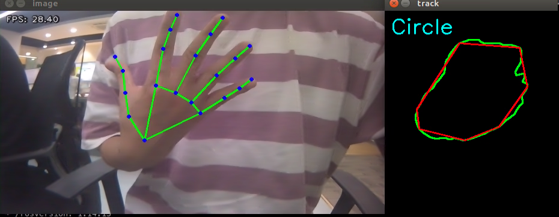

#### 7.3.2.4 Program Analysis

* **Launch File Analysis**

The launch file is located under: **/home/ubuntu/ros2_ws/src/example/example/mediapipe_example/finger_trajectory.launch.py**

1. Launching peripheral nodes:

```python
depth_camera_launch = IncludeLaunchDescription(
    PythonLaunchDescriptionSource(
        os.path.join(peripherals_package_path, 'launch/depth_camera.launch.py')),
)
```

Launches the depth camera node.

2. Launching application node:

```python
finger_trajectory_node = Node(
    package='example',
    executable='finger_trajectory',
    output='screen',
)
```

Launches the node responsible for fingertip trajectory recognition.

* **Python File Analysis**

The source program is located under: **/home/ubuntu/ros2_ws/src/example/example/mediapipe_example/include/finger_trajectory.py**

1. Finger classification:

```python
def hand_angle(landmarks):
    angle_list = []
    # Thumb
    angle_ = vector_2d_angle(landmarks[3] - landmarks[4], landmarks[0] - landmarks[2])
    angle_list.append(angle_)
    # Index finger
    angle_ = vector_2d_angle(landmarks[0] - landmarks[6], landmarks[7] - landmarks[8])
    angle_list.append(angle_)
    # Middle finger
    angle_ = vector_2d_angle(landmarks[0] - landmarks[10], landmarks[11] - landmarks[12])
    angle_list.append(angle_)
    # Ring finger
    angle_ = vector_2d_angle(landmarks[0] - landmarks[14], landmarks[15] - landmarks[16])
    angle_list.append(angle_)
    # Pinky finger
    angle_ = vector_2d_angle(landmarks[0] - landmarks[18], landmarks[19] - landmarks[20])
    angle_list.append(angle_)
    angle_list = [abs(a) for a in angle_list]
    return angle_list
```

Following landmark extraction, evaluating geometric angular relationships between landmarks identifies specific finger states. The function ingests the landmark collection `landmarks(results)` and computes relative joint angles between corresponding landmarks using `vector_2d_angle`.

2. Gesture feature detection:

```python
def h_gesture(angle_list):
    thr_angle, thr_angle_thumb, thr_angle_s = 65.0, 53.0, 49.0
    if (angle_list[0] < thr_angle_s) and (angle_list[1] < thr_angle_s) and (angle_list[2] < thr_angle_s) and (
            angle_list[3] < thr_angle_s) and (angle_list[4] < thr_angle_s):
        gesture_str = "five"
    elif (angle_list[0] > 5) and (angle_list[1] < thr_angle_s) and (angle_list[2] > thr_angle) and (
            angle_list[3] > thr_angle) and (angle_list[4] > thr_angle):
        gesture_str = "one"
    else:
        gesture_str = "none"
    return gesture_str
```

Evaluates finger bending angles to determine the active gesture.

3. `draw_points` function:

```python
def draw_points(img, points, tickness=4, color=(255, 0, 0)):
    points = np.array(points).astype(dtype=np.int32)
    if len(points) > 2:
        for i, p in enumerate(points):
            if i + 1 >= len(points):
                break
            cv2.line(img, p, points[i + 1], color, tickness)
```

Draws continuous lines between recorded trajectory coordinates on the image canvas.

4. `get_track_img` function:

```python
def get_track_img(points):
    points = np.array(points).astype(dtype=np.int32)
    x_min, y_min = np.min(points, axis=0).tolist()
    x_max, y_max = np.max(points, axis=0).tolist()
    track_img = np.full([y_max - y_min + 100, x_max - x_min + 100, 1], 0, dtype=np.uint8)
    points = points - [x_min, y_min]
    points = points + [50, 50]
    draw_points(track_img, points, 1, (255, 255, 255))
    return track_img
```

Generates a binary image canvas with a black background and white trajectory line from recorded points.

5. Class initialization:

```python
    def __init__(self, name):
        rclpy.init()
        super().__init__(name, allow_undeclared_parameters=True, automatically_declare_parameters_from_overrides=True)
        self.drawing = mp.solutions.drawing_utils
        self.timer = time.time()

        self.hand_detector = mp.solutions.hands.Hands(
            static_image_mode=False,
            max_num_hands=1,
            min_tracking_confidence=0.05,
            min_detection_confidence=0.6
        )

        self.bridge = CvBridge()  # Converts between ROS Image messages and OpenCV images
        self.image_queue = queue.Queue(maxsize=2)
        self.state = State.NULL
        self.running = True
        self.points = []
        self.start_count = 0
        self.no_finger_timestamp = time.time()

        timer_cb_group = ReentrantCallbackGroup()
        self.image_sub = self.create_subscription(Image, '/depth_cam/rgb/image_raw', self.image_callback, 1)  # Camera subscription
        self.joints_pub = self.create_publisher(ServosPosition, '/servo_controller', 1) # Servo control

        threading.Thread(target=self.main, daemon=True).start()
        self.get_logger().info('\033[1;32m%s\033[0m' % 'Press space to clear recorded trajectory')
```

Initializes the node, creates the image topic subscription, and configures the servo control publisher.

6. Image callback:

```python
def image_callback(self, ros_image):
    # Convert image to OpenCV format
    cv_image = self.bridge.imgmsg_to_cv2(ros_image, "bgr8")
    bgr_image = np.array(cv_image, dtype=np.uint8)

    if self.image_queue.full():
        # Discard oldest image if queue is full
        self.image_queue.get()
    # Place image into queue
    self.image_queue.put(bgr_image)
```

Converts incoming ROS Image messages into OpenCV format and pushes them into an image buffer queue.

7. Main execution loop:

```python
def main(self):
    while self.running:

        bgr_image = self.image_queue.get()
        bgr_image = cv2.flip(bgr_image, 1) # Mirror image
        result_image = np.copy(bgr_image) # Copy for display to prevent modification during processing
        if self.timer <= time.time() and self.state == State.RUNNING:
            self.state = State.NULL
        try:
            results = self.hand_detector.process(bgr_image) if self.state != State.RUNNING else None
            if results is not None and results.multi_hand_landmarks:
                gesture = "none"
                index_finger_tip = [0, 0]
                self.no_finger_timestamp = time.time()  # Record timestamp for timeout handling
                for hand_landmarks in results.multi_hand_landmarks:
                    self.drawing.draw_landmarks(
                        result_image,
                        hand_landmarks,
                        mp.solutions.hands.HAND_CONNECTIONS)
                    landmarks = get_hand_landmarks(bgr_image, hand_landmarks.landmark)
                    angle_list = (hand_angle(landmarks))
                    gesture = (h_gesture(angle_list))
                    index_finger_tip = landmarks[8].tolist()

                if self.state == State.NULL:
                    if gesture == "one":  # Detected index finger extended while other fingers remain clenched
                        self.start_count += 1
                        if self.start_count > 20:
                            self.state = State.TRACKING
                            self.points = []
                    else:
                        self.start_count = 0

                elif self.state == State.TRACKING:
                    if gesture == "five": # Spread all five fingers to conclude drawing
                        self.state = State.NULL

                        # Generate binary trajectory image
                        track_img = get_track_img(self.points)
                        contours = cv2.findContours(track_img, cv2.RETR_EXTERNAL, cv2.CHAIN_APPROX_NONE)[-2]
                        contour, area = get_area_max_contour(contours, 300)

                        # Identify shape from trajectory image
                        track_img = cv2.fillPoly(track_img, [contour, ], (255, 255, 255))
                        for _ in range(3):
                            track_img = cv2.erode(track_img, cv2.getStructuringElement(cv2.MORPH_RECT, (5, 5)))
                            track_img = cv2.dilate(track_img, cv2.getStructuringElement(cv2.MORPH_RECT, (5, 5)))
                        contours = cv2.findContours(track_img, cv2.RETR_EXTERNAL, cv2.CHAIN_APPROX_NONE)[-2]
                        contour, area = get_area_max_contour(contours, 300)
                        h, w = track_img.shape[:2]

                        track_img = np.full([h, w, 3], 0, dtype=np.uint8)
                        track_img = cv2.drawContours(track_img, [contour, ], -1, (0, 255, 0), 2)
                        approx = cv2.approxPolyDP(contour, 0.026 * cv2.arcLength(contour, True), True)
                        track_img = cv2.drawContours(track_img, [approx, ], -1, (0, 0, 255), 2)

                        print(len(approx))
                        # Determine geometric shape based on vertex count of contour envelope
                        if len(approx) == 3:
                            cv2.putText(track_img, 'Triangle', (10, 40),cv2.FONT_HERSHEY_SIMPLEX, 1.2, (255, 255, 0), 2)
                        if len(approx) == 4 or len(approx) == 5:
                            cv2.putText(track_img, 'Square', (10, 40),cv2.FONT_HERSHEY_SIMPLEX, 1.2, (255, 255, 0), 2)
                        if 5 < len(approx) < 10:
                            cv2.putText(track_img, 'Circle', (10, 40),cv2.FONT_HERSHEY_SIMPLEX, 1.2, (255, 255, 0), 2)
                        if len(approx) == 10:
                            cv2.putText(track_img, 'Star', (10, 40),cv2.FONT_HERSHEY_SIMPLEX, 1.2, (255, 255, 0), 2)

                        cv2.imshow('track', track_img)

                    else:
                        if len(self.points) > 0:
                            if distance(self.points[-1], index_finger_tip) > 5:
                                self.points.append(index_finger_tip)
                        else:
                            self.points.append(index_finger_tip)

                    draw_points(result_image, self.points)
                else:
                    pass
            else:
                if self.state == State.TRACKING:
                    if time.time() - self.no_finger_timestamp > 2:
                        self.state = State.NULL
                        self.points = []

        except Exception as e:
            self.get_logger().error(str(e))

        cv2.imshow('image', result_image)
        key = cv2.waitKey(1)

        if key == ord(' '): # Press space to clear recorded trajectory
            self.points = []
```

Detects hand landmarks via MediaPipe, draws landmark connections, switches between tracking and evaluation states based on "one" and "five" gestures, and listens for spacebar presses to reset the trajectory buffer.

### 7.3.3 Gesture Recognition

<p id="p7-3-3"></p>

This section executes hand gesture recognition, displaying recognized gesture information on the image stream and terminal output.

#### 7.3.3.1 Experiment Overview

First, construct a MediaPipe hand detection pipeline and subscribe to camera topics to receive RGB frames.

Second, apply image transformations to detect hand landmarks within the camera view.

Third, output detection results to the command terminal and graphical display window.

#### 7.3.3.2 Operation Steps

> [!NOTE]
>
> **Commands are case-sensitive. Press the Tab key to autocomplete directory paths and command strings.**

1. Start the JetHexa robot and connect to the system desktop remotely via **NoMachine**. For connection instructions, refer to [1. Tutorials/1. JetHexa User Manual/1.4.2 Remote Connection Setup](https://drive.google.com/drive/folders/1fFo3fA72xG8UAcqcdB7UyhIA6pN2Gjrq?usp=sharing).

2. Click the desktop icon  to open a command-line terminal.

3. Enter the command and press **Enter** to disable the auto-start service:

```bash
~/.stop_ros.sh
```

4. Enter the command and press **Enter** to launch the gesture recognition application:

```bash
ros2 launch example hand_detect.launch.py
```

5. To terminate the application, press **Ctrl + C** in the terminal window.

#### 7.3.3.3 Program Outcome

Present gestures with the right hand inside the camera field of view. Hand landmarks and bounding skeletons render over the video feed upon detection.

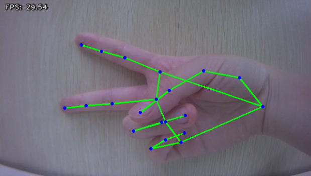

#### 7.3.3.4 Program Analysis

* **Launch File Analysis**

The launch file is located under: **/home/ubuntu/ros2_ws/src/example/example/mediapipe_example/hand_detect.launch.py**

1. Launching peripheral nodes:

```python
depth_camera_launch = IncludeLaunchDescription(
    PythonLaunchDescriptionSource(
        os.path.join(peripherals_package_path, 'launch/depth_camera.launch.py')),
)
```

Launches the depth camera node.

2. Launching application node:

```python
hand_detect_node = Node(
    package='example',
    executable='hand_detect',
    output='screen',
)
```

Launches the node responsible for gesture recognition.

* **Python File Analysis**

The source program is located under: **/home/ubuntu/ros2_ws/src/example/example/mediapipe_example/include/hand_detect.py**

1. Class initialization:

```python
    def __init__(self, name):
        rclpy.init()
        super().__init__(name)
        self.running = True
        self.bridge = CvBridge()
        model_path = os.path.join(os.path.abspath(os.path.split(os.path.realpath(__file__))[0]), 'model/hand_landmarker.task')
        base_options = python.BaseOptions(model_asset_path=model_path)
        options = vision.HandLandmarkerOptions(base_options=base_options, num_hands=2)
        self.detector = vision.HandLandmarker.create_from_options(options)
        self.image_queue = queue.Queue(maxsize=2)
        self.image_sub = self.create_subscription(Image, '/depth_cam/rgb/image_raw', self.image_callback, 1)
        self.get_logger().info('\033[1;32m%s\033[0m' % 'start')
        threading.Thread(target=self.main, daemon=True).start()
```

Initializes node parameters, configures the hand landmarker detector, creates the image subscription, and starts the processing thread.

2. Image callback:

```python
def image_callback(self, ros_image):
    cv_image = self.bridge.imgmsg_to_cv2(ros_image, "rgb8")
    rgb_image = np.array(cv_image, dtype=np.uint8)
    if self.image_queue.full():
        # Discard oldest image if queue is full
        self.image_queue.get()
    # Place image into queue
    self.image_queue.put(rgb_image)
```

Receives incoming ROS Image messages, transforms color channels, and buffers frames in the queue.

3. Main execution loop:

```python
def main(self):
    while self.running:
        try:
            image = self.image_queue.get(block=True, timeout=1)
        except queue.Empty:
            if not self.running:
                break
            else:
                continue
        image = cv2.flip(image, 1)
        mp_image = mp.Image(image_format=mp.ImageFormat.SRGB, data=image)
        detection_result = self.detector.detect(mp_image)
        annotated_image = draw_hand_landmarks_on_image(image, detection_result)
        result_image = cv2.cvtColor(annotated_image, cv2.COLOR_RGB2BGR)
        cv2.imshow('hand_detect', result_image)
        key = cv2.waitKey(1)
        if key == ord('q') or key == 27:  # Press q or Esc to exit
            break
    cv2.destroyAllWindows()
    rclpy.shutdown()
```

Pulls frames from the buffer queue, executes hand landmark detection, visualizes skeletal connections, and handles keyboard termination events.

### 7.3.4 Gesture Control

<p id="p7-3-4"></p>

This section employs the MediaPipe hand detection model to perform logical calculations on extracted landmarks, driving the robot to execute specific motions upon recognizing designated gestures like heart or fist.

#### 7.3.4.1 Experiment Overview

First, construct a MediaPipe hand detection model and subscribe to camera topics to receive video frames.

Second, apply image transformations to detect hand landmarks within the camera view.

Third, calculate finger angles from landmark connections to classify gestures.

Fourth, trigger corresponding robot action sequences, displaying gesture labels and landmark skeletons on the feed.

This experiment combines OpenCV and MediaPipe. OpenCV acquires camera frames, handles color space conversions, and renders detected hand keypoint models. MediaPipe, an open-source cross-platform machine learning framework created by Google, provides trained computer vision models for real-time mobile, desktop, and server inference, displaying detected hand gestures on the display window.

#### 7.3.4.2 Operation Steps

> [!NOTE]
>
> **Commands are case-sensitive. Press the Tab key to autocomplete directory paths and command strings.**

1. Start the JetHexa robot and connect to the system desktop remotely via **NoMachine**. For connection instructions, refer to [1. Tutorials/1. JetHexa User Manual/1.4.2 Remote Connection Setup](https://drive.google.com/drive/folders/1fFo3fA72xG8UAcqcdB7UyhIA6pN2Gjrq?usp=sharing).

2. Click the desktop icon  to open a command-line terminal.

3. Enter the command and press **Enter** to disable the auto-start service:

```bash
~/.stop_ros.sh
```

4. Enter the command and press **Enter** to start the gesture control application:

```bash
ros2 launch example hand_gesture.launch.py
```

5. To terminate the application, press **Ctrl + C** in the terminal window.

#### 7.3.4.3 Program Outcome

Present designated hand gestures within the camera field of view. When detected, the robot performs the corresponding physical motion, while the video window displays the gesture name and landmarks.

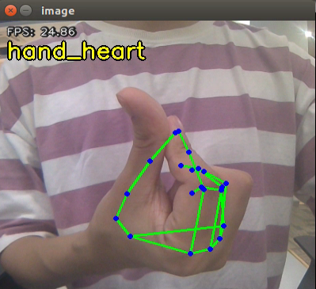

The following table details the recognizable gestures and feedback actions:

| Gesture Name | Description          |                           Example                            | Feedback Action                 |
| :----------- | :------------------- | :----------------------------------------------------------: | :------------------------------ |
| gun          | Handgun gesture      | 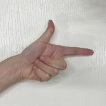 | Attack action, attack           |
| hand_heart   | Finger heart gesture | 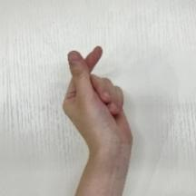 | Twist body, twist_l             |
| OK           | OK gesture           |  | Wave arm to greet, wave         |
| fist         | Fist gesture         |  | Forward pounce, forward_flutter |

#### 7.3.4.4 Program Analysis

* **Launch File Analysis**

The launch file is located under: **/home/ubuntu/ros2_ws/src/example/example/mediapipe_example/hand_gesture.launch.py**

1. Launching peripheral nodes:

```python
depth_camera_launch = IncludeLaunchDescription(
    PythonLaunchDescriptionSource(
        os.path.join(peripherals_package_path, 'launch/depth_camera.launch.py')),
)

controller_launch = IncludeLaunchDescription(
    PythonLaunchDescriptionSource(
        os.path.join(controller_package_path, 'launch/controller.launch.py')),
)
```

Launches the depth camera and servo controller nodes.

2. Launching application node:

```python
hand_gesture_node = Node(
    package='example',
    executable='hand_gesture',
    output='screen',
)
```

Launches the node responsible for gesture control.

* **Python File Analysis**

The source program is located under: **/home/ubuntu/ros2_ws/src/example/example/mediapipe_example/include/hand_gesture.py**

1. Finger classification:

```python
def hand_angle(landmarks):
    angle_list = []
    # Thumb
    angle_ = vector_2d_angle(landmarks[3] - landmarks[4], landmarks[0] - landmarks[2])
    angle_list.append(angle_)
    # Index finger
    angle_ = vector_2d_angle(landmarks[0] - landmarks[6], landmarks[7] - landmarks[8])
    angle_list.append(angle_)
    # Middle finger
    angle_ = vector_2d_angle(landmarks[0] - landmarks[10], landmarks[11] - landmarks[12])
    angle_list.append(angle_)
    # Ring finger
    angle_ = vector_2d_angle(landmarks[0] - landmarks[14], landmarks[15] - landmarks[16])
    angle_list.append(angle_)
    # Pinky finger
    angle_ = vector_2d_angle(landmarks[0] - landmarks[18], landmarks[19] - landmarks[20])
    angle_list.append(angle_)
    angle_list = [abs(a) for a in angle_list]
    return angle_list
```

Following landmark extraction, evaluating geometric angular relationships between landmarks identifies specific finger states. The function ingests the landmark collection `landmarks(results)` and computes relative joint angles between corresponding landmarks using `vector_2d_angle`.

2. Gesture feature detection:

```python
def h_gesture(angle_list):
    thr_angle, thr_angle_thumb, thr_angle_s = 65.0, 53.0, 49.0
    if (angle_list[0] > thr_angle_thumb) and (angle_list[1] > thr_angle) and (angle_list[2] > thr_angle) and (
            angle_list[3] > thr_angle) and (angle_list[4] > thr_angle):
        gesture_str = "fist"
    elif (angle_list[0] < thr_angle_s) and (angle_list[1] < thr_angle_s) and (angle_list[2] > thr_angle) and (
            angle_list[3] > thr_angle) and (angle_list[4] > thr_angle):
        gesture_str = "gun"
    elif (angle_list[0] < thr_angle_s) and (angle_list[1] > thr_angle) and (angle_list[2] > thr_angle) and (
            angle_list[3] > thr_angle) and (angle_list[4] > thr_angle):
        gesture_str = "hand_heart"
    elif (angle_list[0] > 5) and (angle_list[1] < thr_angle_s) and (angle_list[2] > thr_angle) and (
            angle_list[3] > thr_angle) and (angle_list[4] > thr_angle):
        gesture_str = "one"
    elif (angle_list[0] > thr_angle_thumb) and (angle_list[1] < thr_angle_s) and (angle_list[2] < thr_angle_s) and (
            angle_list[3] > thr_angle) and (angle_list[4] > thr_angle):
        gesture_str = "two"
    elif (angle_list[0] > thr_angle_thumb) and (angle_list[1] < thr_angle_s) and (angle_list[2] < thr_angle_s) and (
            angle_list[3] < thr_angle_s) and (angle_list[4] > thr_angle):
        gesture_str = "three"
    elif (angle_list[0] > thr_angle_thumb) and (angle_list[1] > thr_angle) and (angle_list[2] < thr_angle_s) and (
            angle_list[3] < thr_angle_s) and (angle_list[4] < thr_angle_s):
        gesture_str = "OK"
    elif (angle_list[0] > thr_angle_thumb) and (angle_list[1] < thr_angle_s) and (angle_list[2] < thr_angle_s) and (
            angle_list[3] < thr_angle_s) and (angle_list[4] < thr_angle_s):
        gesture_str = "four"
    elif (angle_list[0] < thr_angle_s) and (angle_list[1] < thr_angle_s) and (angle_list[2] < thr_angle_s) and (
            angle_list[3] < thr_angle_s) and (angle_list[4] < thr_angle_s):
        gesture_str = "five"
    elif (angle_list[0] < thr_angle_s) and (angle_list[1] > thr_angle) and (angle_list[2] > thr_angle) and (
            angle_list[3] > thr_angle) and (angle_list[4] < thr_angle_s):
        gesture_str = "six"
    else:
        gesture_str = "none"

    return gesture_str
```

Evaluates finger bending angles to determine the active gesture.

3. Class initialization:

```python
def __init__(self, name):
    rclpy.init()
    super().__init__(name, allow_undeclared_parameters=True, automatically_declare_parameters_from_overrides=True)
    self.drawing = mp.solutions.drawing_utils
    self.hand_detector = mp.solutions.hands.Hands(
        static_image_mode=False,
        max_num_hands=1,
        min_tracking_confidence=0.4,
        min_detection_confidence=0.4
    )

    self.lock = threading.RLock()
    self.fps = fps.FPS()  # FPS calculator
    self.bridge = CvBridge()  # Converts between ROS Image messages and OpenCV images
    self.image_queue = queue.Queue(maxsize=2)
    self.running = True
    self.draw = True
    self.state = State.NULL
    self.points = [[0, 0], ]
    self.no_finger_timestamp = time.time()
    self.one_count = 0
    self.count = 0
    self.direction = ""
    self.last_gesture = "none"
    self.gesture = None
    self.debug = self.get_parameter('debug').value
    self.controller = step_controller.StepController()
    self.gesture_list = ('gun', 'hand_heart', 'OK', 'fist')

    self.timer_cb_group = ReentrantCallbackGroup()
    self.joints_pub = self.create_publisher(ServosPosition, '/servo_controller', 1) # Servo control
    self.buzzer_pub = self.create_publisher(BuzzerState, '/ros_robot_controller/set_buzzer', 1) # Buzzer control

    self.agc_controller = ActionGroupController(self.create_publisher(ServosPosition, 'servo_controller', 1), '/home/ubuntu/software/actionset_editor/ActionGroups')
    self.client = self.create_client(Trigger, '/controller_manager/init_finish')
    self.client.wait_for_service()

    self.image_sub = self.create_subscription(Image, '/depth_cam/rgb/image_raw', self.image_callback, 1)  # Camera subscription
    self.timer = self.create_timer(0.0, self.init_process, callback_group=self.timer_cb_group)
```

Initializes the node, creates the image topic subscription, and configures servo and buzzer publishers.

4. `init_process` method:

```python
def init_process(self):
    self.timer.cancel()
    self.init_action()

    threading.Thread(target=self.main, daemon=True).start()
    threading.Thread(target=self.do_act, daemon=True).start()
    self.create_service(Trigger, '~/init_finish', self.get_node_state)
    self.get_logger().info('\033[1;32m%s\033[0m' % 'start')
```

Manages initialization sequencing, starting background threads and publishing node state services.

5. `init_action` method:

```python
def init_action(self):
    self.controller.set_build_in_pose('DEFAULT_POSE', 1)
    time.sleep(1)
    joint_angle = [500, 750, 200, 150, 500, 600]
    set_servo_position(self.joints_pub, 1, ((19, joint_angle[0]), (20, joint_angle[1]), (21, joint_angle[2]), (22, joint_angle[3]), (23, joint_angle[4]), (24, joint_angle[5])))
    time.sleep(1)
```

Resets robot posture to the default initial pose upon node startup.

6. `do_act` method:

```python
def do_act(self):
    ACTION = {  'gun' : 'attack',
                'hand_heart' : 'twist_l',
                'OK' : 'wave',
                'fist' : 'forward_flutter'}

    LOCK_SERVOS={'19':500, '20':750, '21':200, '22':150,  '23':500,  '24':600}

    while self.running:
        with self.lock:
            if self.gesture is not None and self.gesture in ACTION:
                self.set_buzzer(0.2, 0.01, 1)
                self.agc_controller.run_action(ACTION[self.gesture],lock_servos=LOCK_SERVOS)
                self.count = 0
                self.last_gesture = "none"
                self.state = State.NULL
                self.draw = True
                self.gesture = None
        time.sleep(0.01)
```

Executes mapped action sequences corresponding to recognized gestures in a dedicated background thread.

7. Buzzer control:

```python
def set_buzzer(self, on_time, off_time, repeat):
    # Set buzzer parameters
    msg = BuzzerState()
    msg.freq = 1900
    msg.on_time = on_time
    msg.off_time = off_time
    msg.repeat = repeat
    self.buzzer_pub.publish(msg)
```

Controls buzzer activation to provide auditory feedback upon successful gesture detection.

8. Image callback:

```python
def image_callback(self, ros_image):
    # Convert frame to OpenCV format
    cv_image = self.bridge.imgmsg_to_cv2(ros_image, "bgr8")
    bgr_image = np.array(cv_image, dtype=np.uint8)

    if self.image_queue.full():
        # Discard oldest image if queue is full
        self.image_queue.get()
    # Place image into queue
    self.image_queue.put(bgr_image)
```

Converts incoming ROS Image messages into OpenCV format and pushes them into an image buffer queue.

9. Main execution loop:

```python
def main(self):
    while self.running:
        bgr_image = self.image_queue.get()
        bgr_image = cv2.flip(bgr_image, 1) # Mirror image
        result_image = np.copy(bgr_image) # Copy for display to prevent modification during processing

        if time.time() - self.no_finger_timestamp > 2:
            self.direction = ""
        else:
            if self.direction != "":
                cv2.putText(result_image, self.direction, (10, 100), cv2.FONT_HERSHEY_SIMPLEX, 1, (255, 0, 0), 2)
        try:
            results = self.hand_detector.process(bgr_image) # Hand and landmark recognition
            if results.multi_hand_landmarks and self.draw :
                gesture = "none"
                index_finger_tip = [0, 0]
                for hand_landmarks in results.multi_hand_landmarks:
                    self.drawing.draw_landmarks(
                        result_image,
                        hand_landmarks,
                        mp.solutions.hands.HAND_CONNECTIONS)
                    h, w = bgr_image.shape[:2]
                    landmarks = get_hand_landmarks((w, h), hand_landmarks.landmark)
                    angle_list = hand_angle(landmarks)
                    gesture = h_gesture(angle_list) # Determine gesture based on landmark positions
                    index_finger_tip = landmarks[8].tolist()

                cv2.putText(result_image, gesture.upper(), (10, 100), cv2.FONT_HERSHEY_SIMPLEX, 1.2, (0, 0, 0), 5)
                cv2.putText(result_image, gesture.upper(), (10, 100), cv2.FONT_HERSHEY_SIMPLEX, 1.2, (255, 255, 0), 2)
                draw_points(result_image, self.points[1:])
                if self.state != State.RUNNING :
                    if gesture in self.gesture_list :
                        if gesture == self.last_gesture :
                            self.count += 1
                        else:
                            self.count = 0
                        if self.count > 20:
                            self.count = 0
                            self.state = State.RUNNING
                            self.draw = False
                            self.gesture = gesture
                else:
                    self.count = 0
                self.last_gesture = gesture

            else:
                if self.state != State.NULL:
                    if time.time() - self.no_finger_timestamp > 2:
                        self.one_count = 0
                        self.points = [[0, 0],]
                        self.state = State.NULL

        except Exception as e:
            self.get_logger().error(str(e))

        if result_image is not None :
            cv2.imshow('result_image', result_image)
            key = cv2.waitKey(1)
    self.init_action()
    rclpy.shutdown()
```

Pulls frames from the buffer queue, performs hand landmark detection via MediaPipe, calculates joint angles to identify gestures, renders gesture labels on the frame, and displays the processed image via `cv2.imshow`.

### 7.3.5 Face Detection and Tracking

<p id="p7-3-5"></p>

This section utilizes the MediaPipe face detection model to adjust the rotation angles of the pan-tilt servos or robot chassis according to target face positions, achieving real-time face tracking.

#### 7.3.5.1 Experiment Overview

First, construct the face detection pipeline and subscribe to camera image topics to acquire RGB video.

Second, detect and locate face bounding boxes within the incoming camera frames.

Third, calculate offsets between the target face center and screen center, adjusting the robot pan-tilt or chassis to track the face in real time.

#### 7.3.5.2 Operation Steps

> [!NOTE]
>
> **Commands are case-sensitive. Press the Tab key to autocomplete directory paths and command strings.**

1. Start the JetHexa robot and connect to the system desktop remotely via **NoMachine**. For connection instructions, refer to [1. Tutorials/1. JetHexa User Manual/1.4.2 Remote Connection Setup](https://drive.google.com/drive/folders/1fFo3fA72xG8UAcqcdB7UyhIA6pN2Gjrq?usp=sharing).

2. Click the desktop icon  to open a command-line terminal.

3. Enter the command and press **Enter** to disable the auto-start service:

```bash
~/.stop_ros.sh
```

4. Enter the command and press **Enter** to launch the face tracking application:

```bash
ros2 launch example face_track.launch.py
```

5. To terminate the application, press **Ctrl + C** in the terminal window.

#### 7.3.5.3 Program Outcome

Position a face within the camera field of view. When detected, the robot tracks the target face by driving the chassis for depth camera models or rotating the 2DOF camera pan-tilt servos for monocular camera models. Detected faces and facial landmarks render on screen.

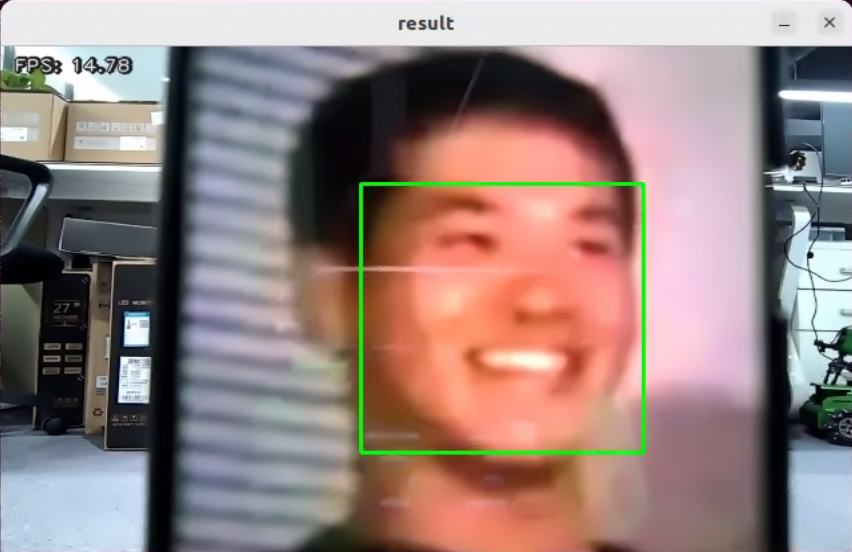

#### 7.3.5.4 Program Analysis

* **Launch File Analysis**

The launch file is located under: **/home/ubuntu/ros2_ws/src/example/example/mediapipe_example/face_track.launch.py**

1. Launching peripheral nodes:

```python
depth_camera_launch = IncludeLaunchDescription(
    PythonLaunchDescriptionSource(
        os.path.join(peripherals_package_path, 'launch/depth_camera.launch.py')),
)

controller_launch = IncludeLaunchDescription(
    PythonLaunchDescriptionSource(
        os.path.join(controller_package_path, 'launch/controller.launch.py')),
)
```

Launches the depth camera and servo controller nodes.

2. Launching application node:

```python
face_track_node = Node(
    package='example',
    executable='face_track',
    output='screen',
)
```

Launches the node responsible for face tracking.

* **Python File Analysis**

The source program is located under: **/home/ubuntu/ros2_ws/src/example/example/mediapipe_example/include/face_track.py**

1. Class initialization:

```python
    def __init__(self, name):
        rclpy.init()
        super().__init__(name, allow_undeclared_parameters=True, automatically_declare_parameters_from_overrides=True)
        self.face_detector = mp.solutions.face_detection.FaceDetection(
            min_detection_confidence=0.3,
        )
        self.running = True
        self.bridge = CvBridge()
        self.fps = fps.FPS()
        self.controller = step_controller.StepController()
        self.image_queue = queue.Queue(maxsize=2)
        self.start = False

        self.pwm_servo_1 = 1500  # y axis
        self.pwm_servo_2 = 1500  # x axis
        self.pwm_servo_1_range = (1300, 1700)
        self.pwm_servo_2_range = (1000, 2000)
        self.pid_params = {
            'x_pid': [0.22, 0.0, 0.0],
            'y_pid': [0.22, 0.0, 0.0],
        }
        for param_name, default_value in self.pid_params.items():
            self.declare_parameter(param_name, default_value)
            self.pid_params[param_name] = self._coerce_pid_triplet(
                param_name,
                self.get_parameter(param_name).value
            )
        self.pid_y = pid.PID()
        self.pid_x = pid.PID()
        self._apply_pid_params()
        self.add_on_set_parameters_callback(self.on_parameter_update)
        self.detected_face = 0
        self.pwm_pub = self.create_publisher(SetPWMServoState, 'pwm_servo_controller', 1)

        self.image_sub = self.create_subscription(Image, '/depth_cam/rgb/image_raw', self.image_callback, 1)  # Camera subscription

        self.result_publisher = self.create_publisher(Image, '~/image_result', 1)  # Image processing result publisher
        timer_cb_group = ReentrantCallbackGroup()
        self.create_service(Trigger, '~/start', self.start_srv_callback) # Start feature
        self.create_service(Trigger, '~/stop', self.stop_srv_callback, callback_group=timer_cb_group) # Stop feature
        self.client = self.create_client(Trigger, '/controller_manager/init_finish')
        self.client.wait_for_service()

        self.timer = self.create_timer(0.0, self.init_process, callback_group=timer_cb_group)
```

Initializes node parameters, configures the face detector, sets up dual-axis PID controllers, and creates image subscriptions, publishers, and service interfaces.

2. `init_process` method:

```python
    def init_process(self):
        self.timer.cancel()

        self.init_action()
        self.start_srv_callback(Trigger.Request(), Trigger.Response())

        threading.Thread(target=self.main, daemon=True).start()
        self.create_service(Trigger, '~/init_finish', self.get_node_state)
        self.get_logger().info('\033[1;32m%s\033[0m' % 'start')
```

Manages initialization sequencing, moving the pan-tilt to initial angles and starting the main processing thread.

3. `init_action` method:

```python
    def init_action(self):
        self.controller.set_build_in_pose('DEFAULT_POSE', 1)
        self.pwm_servo_1 = 1500
        self.pwm_servo_2 = 1500
        self.set_pwm_servo_position(0.5, ((1, self.pwm_servo_1), (2, self.pwm_servo_2)))
        time.sleep(0.6)
```

Resets the pan-tilt PWM servos to central positions, establishing the baseline starting posture.

4. Main execution loop:

```python
    def main(self):

        while self.running:
            bgr_image = self.image_queue.get()

            result_image = np.copy(bgr_image)
            boxes = []
            keypoints = []
            if self.start:
                results = self.face_detector.process(bgr_image)
                boxes, keypoints = mp_face_location(results, bgr_image)
                o_h, o_w = bgr_image.shape[:2]
                if len(boxes) > 0:
                    self.detected_face += 1
                    self.detected_face = min(self.detected_face, 20) # Keep count below 20

                    # Start tracking if face is detected across 5 consecutive frames to avoid false positives
                    if self.detected_face >= 5:
                        center = [box_center(box) for box in boxes] # Calculate center coordinates of detected faces
                        dist = [distance(c, (o_w / 2, o_h / 2)) for c in center] # Calculate distance from face center to screen center
                        face = min(zip(boxes, center, dist), key=lambda k: k[2]) # Identify face closest to screen center

                        center_x, center_y = face[1]

                        # x axis corresponds to PWM servo 2
                        self.pid_x.SetPoint = result_image.shape[1] / 2
                        self.pid_x.update(center_x)
                        self.pwm_servo_2 += int(self.pid_x.output)
                        self.pwm_servo_2 = max(self.pwm_servo_2_range[0], min(self.pwm_servo_2_range[1], self.pwm_servo_2))

                        # y axis corresponds to PWM servo 1
                        self.pid_y.SetPoint = result_image.shape[0] / 2
                        self.pid_y.update(center_y)
                        self.pwm_servo_1 += int(self.pid_y.output)
                        self.pwm_servo_1 = max(self.pwm_servo_1_range[0], min(self.pwm_servo_1_range[1], self.pwm_servo_1))

                        self.set_pwm_servo_position(0.02, ((1, self.pwm_servo_1), (2, self.pwm_servo_2)))

                    result_image = show_faces(result_image, bgr_image, boxes, keypoints) # Render detected faces and landmarks on screen
                else: # Handle scenarios where no face is detected
                    if self.detected_face > 0:
                        self.detected_face -= 1
                    else:
                        self.pid_x.clear()
                        self.pid_y.clear()

            self.result_publisher.publish(self.bridge.cv2_to_imgmsg(result_image, "bgr8"))
            self.fps.update()
            self.fps.show_fps(result_image)
            cv2.imshow("result", result_image)
            cv2.waitKey(1)

        self.init_action()
        rclpy.shutdown()
```

Fetches frames from the buffer queue, calls MediaPipe to process images, extracts face bounding boxes and landmarks, calculates the distance from all face centers to the frame center, selects the closest face as the tracking target, renders bounding boxes and landmarks, publishes the processed frame, and displays it via `cv2.imshow`.

### 7.3.6 Body Motion Sensing Control

<p id="p7-3-6"></p>

This section employs MediaPipe Pose estimation to extract human body landmarks, analyzing joint geometry to control the front limbs of the robot to mirror upper body movements.

This experiment combines OpenCV and MediaPipe. OpenCV acquires camera frames, handles color space conversions, and renders detected hand keypoint models. MediaPipe, an open-source cross-platform machine learning framework created by Google, provides trained computer vision models for real-time mobile, desktop, and server inference, displaying detected hand gestures on the display window.

#### 7.3.6.1 Experiment Overview

First, instantiate a human pose estimator to capture body joint landmarks.

Second, process landmarks and evaluate arm gestures using 2D geometric features.

Third, when arms are raised horizontally, the buzzer beeps and the robot enters imitation mode, moving its front limbs to mirror human arm motions.

#### 7.3.6.2 Operation Steps

> [!NOTE]
>
> **Commands are case-sensitive. Press the Tab key to autocomplete directory paths and command strings.**

1. Start the JetHexa robot and connect to the system desktop remotely via **NoMachine**. For connection instructions, refer to [1. Tutorials/1. JetHexa User Manual/1.4.2 Remote Connection Setup](https://drive.google.com/drive/folders/1fFo3fA72xG8UAcqcdB7UyhIA6pN2Gjrq?usp=sharing).

2. Click the desktop icon  to open a command-line terminal.

3. Enter the command and press **Enter** to disable the auto-start service:

```bash
~/.stop_ros.sh
```

4. Enter the command and press **Enter** to launch the somatosensory control application:

```bash
ros2 launch example pose_control.launch.py
```

5. To terminate the application, press **Ctrl + C** in the terminal window.

#### 7.3.6.3 Program Outcome

Upon starting, the robot enters preparation posture. Stand in front of the camera to allow pose landmark detection and skeleton rendering.

Raising both arms horizontally triggers a buzzer beep, initiating imitation mode where the robot front limbs mirror human arm movements.

Crossing both arms above the head exits imitation mode.

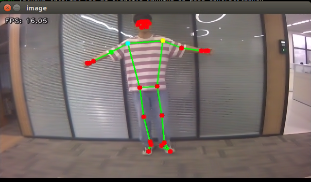

#### 7.3.6.4 Program Analysis

* **Launch File Analysis**

The launch file is located under: **/home/ubuntu/ros2_ws/src/example/example/mediapipe_example/pose_control.launch.py**

1. Launching peripheral nodes:

```python
depth_camera_launch = IncludeLaunchDescription(
    PythonLaunchDescriptionSource(
        os.path.join(peripherals_package_path, 'launch/depth_camera.launch.py')),
)

controller_launch = IncludeLaunchDescription(
    PythonLaunchDescriptionSource(
        os.path.join(controller_package_path, 'launch/controller.launch.py')),
)
```

Launches the depth camera and servo controller nodes.

2. Launching application node:

```python
pose_control_node = Node(
    package='example',
    executable='pose_control',
    output='screen',
)
```

Launches the node responsible for somatosensory control.

* **Python File Analysis**

The source program is located under: **/home/ubuntu/ros2_ws/src/example/example/mediapipe_example/include/pose_control.py**

1. `get_angle` function:

```python
def get_angle(p1, p2, p3):
    """
    Calculate the angle formed by three points
    :param p1: First point
    :param p2: Second point, vertex
    :param p3: Third point
    :return: Angle in degrees
    """
    angle = vector_2d_angle(p2 - p1, p3 - p2)
    return angle
```

Computes the angle formed by three points using `p2` as the vertex.

2. `is_pentagon` function:

```python
def is_pentagon(landmarks):
    """
    Determine via manual 2D geometric features whether both hands are raised above the head and arms form a pentagon with shoulders
    :param landmarks: Body landmark coordinates
    :return: True if criteria are met, otherwise False
    """
    shoulder_width = distance(landmarks[12], landmarks[11])  # Shoulder width
    hand_dist = distance(landmarks[16], landmarks[15])  # Distance between wrists
    if hand_dist > shoulder_width:  # Hand distance must be smaller than shoulder width
        return False
    for p in landmarks[:7]:  # Wrists must be above the head, higher than eyes and nose
        if landmarks[15][1] > p[1] or landmarks[16][1] > p[1]:
            return False
    if get_angle(landmarks[11], landmarks[12], landmarks[14]) < 40:
        return False  # Left upper arm must be raised more than 40 degrees above shoulder
    if get_angle(landmarks[13], landmarks[11], landmarks[12]) < 40:
        return False  # Right upper arm must be raised more than 40 degrees above shoulder
    return True
```

Identifies the trigger posture where hands are raised above the head and arms form a pentagonal profile with shoulders.

3. `is_level` function:

```python
def is_level(landmarks, angle_threshold=15):
    p0 = landmarks[12].copy()
    p0[0] = 0
    if abs(get_angle(p0, landmarks[12], landmarks[11])) > angle_threshold:
        return False
    return True
```

Evaluates whether the shoulder line remains horizontal relative to the camera frame.

4. `is_flat` function:

```python
def is_flat(landmarks, angle_threshold):
    arm_marks = [15, 13, 11, 12, 14, 16]
    for i in range(3):
        angle = get_angle(landmarks[arm_marks[i]], landmarks[arm_marks[i + 1]], landmarks[arm_marks[i + 2]])
        if abs(angle) > angle_threshold:
            return False
    return is_level(landmarks, angle_threshold)
```

Evaluates whether both arms are fully extended horizontally.

5. `is_cross` function:

```python
def is_cross(landmarks):
    if landmarks[16][0] <= landmarks[15][0]:
        return False
    return is_pentagon(landmarks)
```

Evaluates whether both arms are raised and crossed overhead, serving as the exit condition for imitation mode.

6. `mp_pose_landmarks` function:

```python
def mp_pose_landmarks(results, img_rgb, draw=True):
    lm_list = []
    if results and results.pose_landmarks:
        h, w, = img_rgb.shape[:2]
        for idx, lm in enumerate(results.pose_landmarks.landmark):
            cx, cy = int(lm.x * w), int(lm.y * h)
            lm_list.append([cx, cy])
            if draw:
                cv2.circle(img_rgb, (cx, cy), 5, (255, 0, 0), cv2.FILLED)

        cv2.circle(img_rgb, lm_list[11], 5, (255, 255, 0), cv2.FILLED)
        cv2.circle(img_rgb, lm_list[12], 5, (0, 255, 255), cv2.FILLED)
        cv2.circle(img_rgb, lm_list[14], 5, (0, 255, 0), cv2.FILLED)

    if len(lm_list) > 0:
        return np.array(lm_list)
    else:
        return None
```

Extracts pixel coordinates of pose landmarks and visualizes key joint locations on the image feed.

7. Class initialization:

```python
    def __init__(self):
        super().__init__('pose_control_node')

        # Initialize MediaPipe Pose
        self.pose = mp.solutions.pose.Pose(
            static_image_mode=False,
            model_complexity=1,
            min_detection_confidence=0.6,
            min_tracking_confidence=0.7
        )
        self.drawing = mp.solutions.drawing_utils
        self.bridge = CvBridge()
        self.timer_cb_group = ReentrantCallbackGroup()

        self.image_sub = self.create_subscription(Image, '/depth_cam/rgb/image_raw', self.image_callback, 1)  # Camera subscription
        self.joints_pub = self.create_publisher(ServosPosition, '/servo_controller', 1) # Servo control
        self.buzzer_pub = self.create_publisher(BuzzerState, '/ros_robot_controller/set_buzzer', 1) # Buzzer control

        self.agc_controller = ActionGroupController(
            self.create_publisher(ServosPosition, 'servo_controller', 1),
            '/home/ubuntu/software/actionset_editor/ActionGroups',
            pwm_servo_pub=self.create_publisher(SetPWMServoState, 'pwm_servo_controller', 1),
        )
        self.client = self.create_client(Trigger, '/controller_manager/init_finish')
        self.client.wait_for_service()

        # State initialization
        self.state = State.NULL
        self.timestamp = 0
        self.r_x_dist = 0
        self.l_x_dist = 0
        self.count = 0

        self.timer = self.create_timer(0.0, self.init_process, callback_group=self.timer_cb_group)
```

Initializes node parameters, configures MediaPipe Pose, and creates topic publishers and subscribers.

8. `reset_servos` method:

```python
def reset_servos(self):
    self.get_logger().info("Resetting servos...")
    set_servo_position(self.joints_pub, 1, ((5, RIGHT_SERVO_I_DEFAULT), (3, RIGHT_SERVO_M_DEFAULT), (1, RIGHT_SERVO_O_DEFAULT), (6, LEFT_SERVO_I_DEFAULT), (4, LEFT_SERVO_M_DEFAULT), (2, LEFT_SERVO_O_DEFAULT)))
    time.sleep(1.2)
```

Resets the six servos of the front limbs to default positions.

9. `stop_imitation` method:

```python
def stop_imitation(self):
    self.state = State.NULL
    self.reset_servos()
    self.set_buzzer(0.2, 0.01, 1)
    self.get_logger().info("Imitation mode exited")
```

Terminates imitation mode, emits an auditory signal via the buzzer, and restores baseline postures.

10. `process_landmarks` method:

```python
def process_landmarks(self, landmarks):
    if self.state == State.NULL:
        if time.time() - self.timestamp > 5:
            if is_pentagon(landmarks):
                self.enter_imitation_mode()
    elif self.state == State.INTO_IMITATION_1:
        self.handle_imitation_transition(landmarks)
    else:
        self.handle_imitation(landmarks)
```

Evaluates current node states against incoming landmarks to manage posture transitions.

11. `handle_imitation` method:

```python
def handle_imitation(self, landmarks):
    self.timestamp = time.time()
    if not is_cross(landmarks):
        self.adjust_servos(landmarks)
    else:
        self.stop_imitation()
```

Processes real-time joint angles during imitation mode, checking for overhead cross postures to exit.

12. `adjust_servos` method:

```python
def adjust_servos(self, landmarks):

    left_angle_2 = get_angle(landmarks[11], landmarks[12], landmarks[14])
    left_angle_3 = get_angle(landmarks[12], landmarks[14], landmarks[16])
    right_angle_2 = get_angle(landmarks[12], landmarks[11], landmarks[13])
    right_angle_3 = get_angle(landmarks[11], landmarks[13], landmarks[15])

    raw_right_servo_2 = int(RIGHT_SERVO_M_DEFAULT + PULSE_PER_DEGREE * right_angle_2)
    raw_right_servo_3 = int(RIGHT_SERVO_O_DEFAULT + PULSE_PER_DEGREE * right_angle_3)
    raw_left_servo_2 = int(LEFT_SERVO_M_DEFAULT + PULSE_PER_DEGREE * left_angle_2)
    raw_left_servo_3 = int(LEFT_SERVO_O_DEFAULT + PULSE_PER_DEGREE * left_angle_3)

    r_x_dist = distance(landmarks[13], landmarks[11])
    l_x_dist = distance(landmarks[12], landmarks[14])

    left_angle_1 = self.clamp(90.0 - l_x_dist / self.l_x_dist * 90.0, 0, 120)
    right_angle_1 = self.clamp(90.0 - r_x_dist / self.r_x_dist * 90.0, 0, 120)

    raw_left_servo_1 = int(LEFT_SERVO_I_DEFAULT - PULSE_PER_DEGREE * left_angle_1)
    raw_right_servo_1 = int(RIGHT_SERVO_I_DEFAULT + PULSE_PER_DEGREE * right_angle_1)

    current_servo_values = {
        "right_servo_1": raw_right_servo_1,
        "right_servo_2": raw_right_servo_2,
        "right_servo_3": raw_right_servo_3,
        "left_servo_1": raw_left_servo_1,
        "left_servo_2": raw_left_servo_2,
        "left_servo_3": raw_left_servo_3,
    }

    servo_positions_list = []
    for servo_name, limits in SERVO_LIMITS.items():
        current_value = current_servo_values.get(servo_name)
        servo_id = SERVO_IDS.get(servo_name)

        if current_value is not None and servo_id is not None:
            min_val, max_val = limits
            clamped_value = self.clamp(current_value, min_val, max_val)
            servo_positions_list.append((servo_id, clamped_value))
        else:
            print(f"Warning: Missing value or ID for servo '{servo_name}'")

    servo_positions = tuple(servo_positions_list)

    set_servo_position(self.joints_pub, 0.02, servo_positions)
    time.sleep(0.02)
```

Translates human upper-limb joint angles into pulse width values to actuate the front servos.

13. `update_display` method:

```python
def update_display(self, image):

    cv2.imshow("image", cv2.resize(image, (display_size[0], display_size[1])))
    cv2.waitKey(1)
```

Resizes the video frame according to `display_size` and displays the window via `cv2.imshow`.
