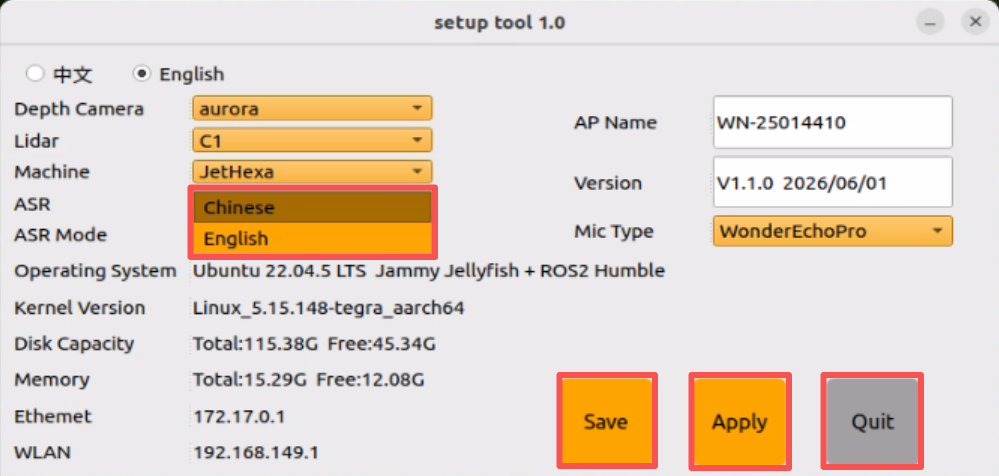

# 8. Voice Control Course

<p id="p8-course"></p>

## 8.1 Switching Wake-Up Words

<p id="p8-1"></p>

The factory default wake-up phrase is the English phrase **Hello Hiwonder**. To switch to custom commands, proceed with the following procedure:

1. The robot utilizes the **WonderEcho Pro AI voice interaction box**, which requires flashing the corresponding language firmware beforehand. For detailed flashing procedures, refer to [WonderEcho Pro Basic Course/02 Firmware Flashing](https://drive.google.com/drive/folders/1L8XxJFilaz6x9CBGTqNQ36_Q5asaUH4I?usp=sharing) under the same directory as this document.

2. In the setup tool interface, set **ASR** to **English**, and then click **Save** > **Apply** > **Quit**.



3. Once the robot broadcasts the confirmation prompt, the wake-up word is switched successfully.

## 8.2 Voice-Controlled Movement

<p id="p8-2"></p>

### 8.2.1 Overview

<p id="p8-2-1"></p>

This section utilizes the on-board voice recognition feature of the robot to control chassis movement via voice commands, such as moving forward or backward.

In software architecture, the node subscribes to the voice recognition service published by the microphone array node. Following sound source localization, noise reduction, and speech recognition, the system obtains recognized phrases and the sound source angle. Once the robot is awakened and receives a designated command phrase, it broadcasts an auditory response while issuing motion commands to the chassis to execute actions including forward movement, backward movement, left turns, and right turns.

Complete the preparatory tasks outlined in the [8.2.2 Preparation](#p8-2-2) section before proceeding to the [8.2.3 Operation Steps](#p8-2-3).

### 8.2.2 Preparation

<p id="p8-2-2"></p>

1. Prior to starting this lesson, mount the voice module onto the robot if not already installed, and connect it to a USB port on the hub.

2. The default factory wake-up phrase is **Hello Hiwonder**. To flash application command phrases for the WonderEcho Pro AI voice interaction box, refer to [8.1 Switching Wake-Up Words](#p8-1) under the same directory as this document.

### 8.2.3 Operation Steps

<p id="p8-2-3"></p>

> [!NOTE]
>
> **Commands are case-sensitive. Press the Tab key to autocomplete directory paths and command strings.**

1. Start the robot and connect to the system desktop remotely via **NoMachine**. For connection instructions, refer to [1. Tutorials/1. JetHexa User Manual/1.4.2 Remote Connection Setup](https://drive.google.com/drive/folders/1fFo3fA72xG8UAcqcdB7UyhIA6pN2Gjrq?usp=sharing).

2. Click the desktop icon  to open a command-line terminal.

3. Enter the command and press **Enter** to disable the app auto-start service:

```bash
~/.stop_ros.sh
```

4. Enter the command and press **Enter** to launch the voice control function:

```bash
ros2 launch xf_mic_asr_offline voice_control_move.launch.py
```

5. To terminate the function, press **Ctrl + C** in the terminal window. If termination fails, repeat the key combination.

### 8.2.4 Program Outcome

<p id="p8-2-4"></p>

Once the program loads, pronounce the wake-up phrase **Hello Hiwonder**. Wait for the voice module to reply with **I'm here.** before issuing a command phrase. For instance, pronounce **go forward**. Upon recognizing the command, the robot broadcasts **OK, moving forward**, and then moves forward accordingly.

The command phrases and their corresponding actions are listed in the table below:

| Command Phrase | Corresponding Action |
| :--- | :--- |
| Go forward | Move forward |
| Go backward | Move backward |
| Turn left | Turn left |
| Turn right | Turn right |
| Move left | Shift left |
| Move right | Shift right |
| Dance | Dance |

> [!NOTE]
>
> * **Conduct the experiment in a quiet environment to ensure optimal recognition accuracy.**
>
> * **Pronounce the wake-up phrase before issuing each command.**
>
> * **Speak voice commands clearly and at an adequate volume.**
>
> * **Issue commands sequentially, waiting for the robot to complete physical execution and auditory feedback before delivering subsequent commands.**

### 8.2.5 Program Analysis

<p id="p8-2-5"></p>

Voice-controlled movement establishes communication between the voice control node and the underlying chassis driver node, using vocal commands to actuate the corresponding mechanical motions.

* **Launch File Analysis**

The launch file is located under: **/home/ubuntu/ros2_ws/src/xf_mic_asr_offline/launch/voice_control_move.launch.py**

1. Launching sub-launch files:

```python
controller_launch = IncludeLaunchDescription(
    PythonLaunchDescriptionSource(
        os.path.join(controller_package_path, 'launch/controller.launch.py')),
)

lidar_launch = IncludeLaunchDescription(
    PythonLaunchDescriptionSource(
        os.path.join(peripherals_package_path, 'launch/lidar.launch.py')),
)

mic_launch = IncludeLaunchDescription(
    PythonLaunchDescriptionSource(
        os.path.join(xf_mic_asr_offline_package_path, 'launch/mic_init.launch.py')),
)
```

`controller_launch` initializes chassis control to drive the servos.

`lidar_launch` initializes the LiDAR and publishes scan topics.

`mic_launch` initializes the microphone array hardware.

2. Launching application node:

```python
voice_control_move_node = Node(
    package='xf_mic_asr_offline',
    executable='voice_control_move.py',
    output='screen',
    parameters=[{'move': move}],
)
```

`voice_control_move_node` executes the voice-controlled movement application logic.

* **Python File Analysis**

The source program is located under: **/home/ubuntu/ros2_ws/src/xf_mic_asr_offline/scripts/voice_control_move.py**

1. Class initialization:

```python
    def __init__(self, name):
        rclpy.init()
        super().__init__(name)

        self.angle = None
        self.words = None
        self.running = True
        self.haved_stop = False
        self.lidar_follow = False
        self.start_follow = False
        self.last_status = Twist()
        self.threshold = 3
        self.speed = 0.3
        self.stop_dist = 0.4
        self.count = 0
        self.scan_angle = math.radians(90)
        self.declare_parameter('move', False)
        self.move = self.get_parameter('move').value

        self.pid_yaw = pid.PID(1.6, 0, 0.16)
        self.pid_dist = pid.PID(1.7, 0, 0.16)

        self.language = os.environ['ASR_LANGUAGE']
        self.controller = controller_client.ControllerClient()
        self.agc_controller = ActionGroupController(
            self.create_publisher(ServosPosition, 'servo_controller', 1),
            '/home/ubuntu/software/actionset_editor/ActionGroups',
            pwm_servo_pub=self.create_publisher(SetPWMServoState, 'pwm_servo_controller', 1),
        )
        self.cmd_vel_pub = self.create_publisher(Twist, '/controller/cmd_vel', 1)
        self.buzzer_pub = self.create_publisher(BuzzerState, '/ros_robot_controller/set_buzzer', 1)
        qos = QoSProfile(depth=1, reliability=QoSReliabilityPolicy.BEST_EFFORT)
        self.create_subscription(String, '/asr_node/voice_words', self.words_callback, 1)
        self.create_subscription(Int32, '/awake_node/angle', self.angle_callback, 1)

        self.client = self.create_client(Trigger, '/asr_node/init_finish')
        self.client.wait_for_service()  # Blocking wait
        self.declare_parameter('delay', 0)
        time.sleep(self.get_parameter('delay').value)

        self.get_logger().info('唤醒口令: 小幻小幻(Wake up word: hello hiwonder)')
        self.get_logger().info('唤醒后15秒内可以不用再唤醒(No need to wake up within 15 seconds after waking up)')
        self.get_logger().info('控制指令: 左转 右转 前进 后退 跳个舞吧(Voice command: turn left/turn right/go forward/go backward/dance)')
        self.time_stamp = time.time()
        self.current_time_stamp = time.time()
        threading.Thread(target=self.main, daemon=True).start()
        self.create_service(Trigger, '~/init_finish', self.get_node_state)
        self.play('running')

        if self.language == 'Chinese':
            self.get_logger().info('\033[1;32m%s\033[0m' % '准备就绪')
        else:
            self.get_logger().info('\033[1;32m%s\033[0m' % 'I am ready')
```

Initializes node parameters, configures topic subscriptions and publishers, and creates service clients.

2. `get_node_state` method:

```python
def get_node_state(self, request, response):
    response.success = True
    return response
```

Provides a service callback returning the operational readiness state of the node.

3. `play` method:

```python
def play(self, name):
    voice_play.play(name, language=self.language)
```

Broadcasts localized audio files.

4. `words_callback` method:

```python
def words_callback(self, msg):
    self.words = json.dumps(msg.data, ensure_ascii=False)[1:-1]
    if self.language == 'Chinese':
        self.words = self.words.replace(' ', '')
    self.get_logger().info('words:%s' % self.words)
    if self.words is not None and self.words not in ['唤醒成功(wake-up-success)', '休眠(Sleep)', '失败5次(Fail-5-times)',
                                                     '失败10次(Fail-10-times']:
        pass
    elif self.words == '唤醒成功(wake-up-success)':
        self.play('awake')
    elif self.words == '休眠(Sleep)':
        msg = BuzzerState()
        msg.freq = 1000
        msg.on_time = 0.1

        msg.off_time = 0.01
        msg.repeat = 1
        self.buzzer_pub.publish(msg)
```

Processes incoming voice recognition topic data.

5. `angle_callback` method:

```python
def angle_callback(self, msg):
    self.angle = msg.data
    self.get_logger().info('angle:%s' % self.angle)
    self.start_follow = False
    self.start_follow = False
```

Retrieves the incoming direction of the voice from sound source localization data published by the microphone array.

6. `main` method:

```python
def main(self):
    while True:
        if self.words is not None:
            self.move = True
            twist = Twist()
            if self.words == '前进' or self.words == 'go forward':
                self.play('go')
                self.time_stamp = time.time() + 4
                twist.linear.x = 0.05
            elif self.words == '后退' or self.words == 'go backward':
                self.play('back')
                self.time_stamp = time.time() + 4
                twist.linear.x = -0.05
            elif self.words == '左转' or self.words == 'turn left':
                self.play('turn_left')
                self.time_stamp = time.time() + 4
                twist.angular.z = 0.3
            elif self.words == '右转' or self.words == 'turn right':
                self.play('turn_right')
                self.time_stamp = time.time() + 4
                twist.angular.z = -0.3
            elif self.words == '左平移' or self.words == 'move left':
                self.play('move_left')
                self.time_stamp = time.time() + 4
                twist.linear.y = 0.05
            elif self.words == '右平移' or self.words == 'move right':
                self.play('move_right')
                self.time_stamp = time.time() + 4
                twist.linear.y = -0.05
            elif self.words == '跳个舞吧' or self.words == 'dance':
                self.play('dance')
                self.agc_controller.run_action('twist')

            elif self.words == '过来' or self.words == 'come here':
                self.play('come')
                self.get_logger().info('\033[1;32m%s\033[0m' % self.angle)

                if 270 > self.angle > 90:
                    twist.angular.z = -0.3
                    self.time_stamp = time.time() + abs(math.radians(self.angle - 90) / twist.angular.z)
                else:
                    twist.angular.z = 0.3
                    if self.angle <= 90:
                        self.angle = 90 - self.angle
                    else:
                        self.angle = 450 - self.angle
                    self.time_stamp = time.time() + abs(math.radians(self.angle) / twist.angular.z)
                self.lidar_follow = True
            elif self.words == '休眠(Sleep)':
                time.sleep(0.01)
            self.words = None
            self.haved_stop = False
            if self.move:
                self.cmd_vel_pub.publish(twist)

        else:
            time.sleep(0.01)
        self.current_time_stamp = time.time()
        if self.time_stamp < self.current_time_stamp and not self.haved_stop and self.move:
            self.controller.traveling(gait=-2, time=1, steps=0)
            self.haved_stop = True
            if self.lidar_follow:
                self.lidar_follow = False
                self.start_follow = True
```

Executes motion control logic according to recognized vocal commands, publishing linear and angular velocity commands to drive chassis movement.
