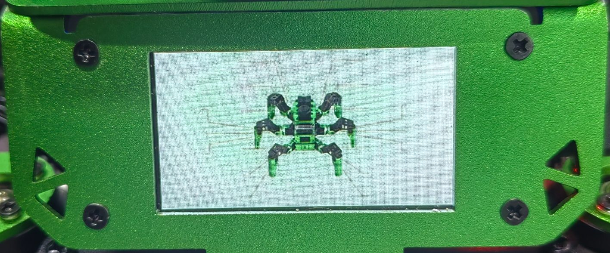
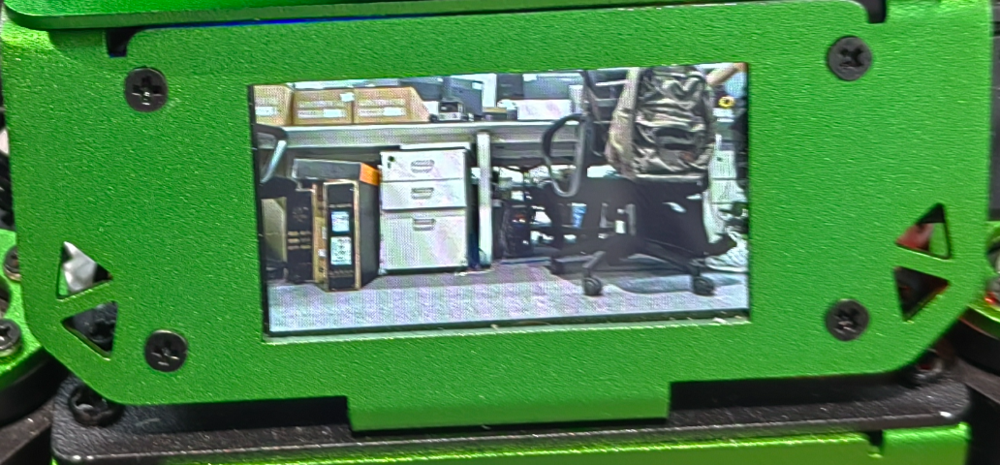
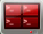
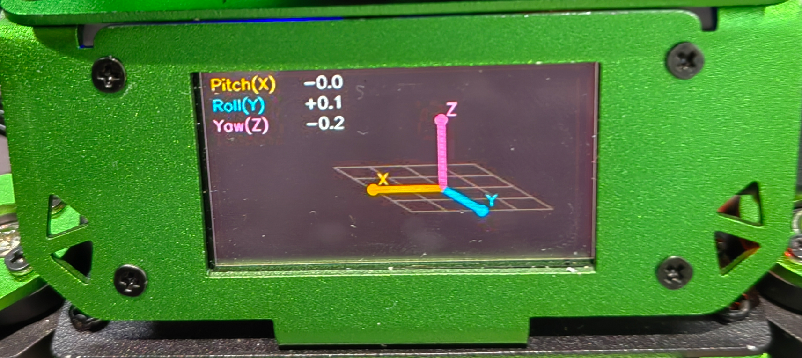
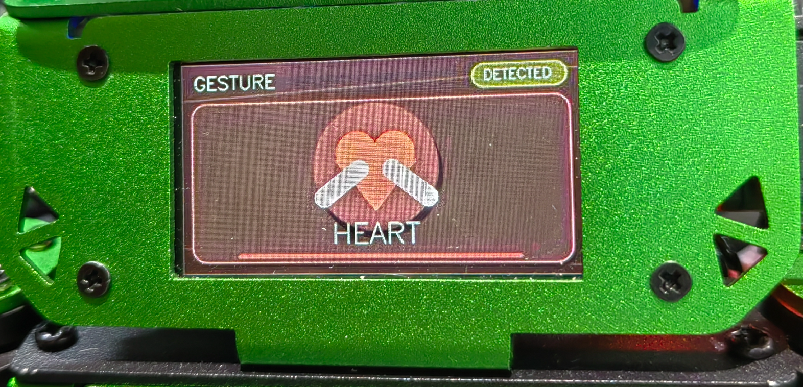

# 9. LCD Display Applications

## 9.1 LCD Image Display

### 9.1.1 Overview

This application provides a persistent chest screen display, camera stream, and dialogue interface. The application transmits fully rendered frames to a display device with `VID=0x303A, PID=0x4001` via the USB Bulk protocol, presenting target images on the LCD screen.

### 9.1.2 Operating Steps

> [!NOTE]
>
> **Commands are case-sensitive. Press the Tab key to auto-complete keywords.**

1. Power on the JetHexa hexapod robot and connect it to the remote control software **NoMachine**. For remote desktop connection details, refer to [1. Tutorials/1. JetHexa User Manual/1.4 Development Environment Setup](https://drive.google.com/drive/folders/1fFo3fA72xG8UAcqcdB7UyhIA6pN2Gjrq?usp=sharing).

2. Click the desktop icon  to open the terminal.

3. Enter the command to stop the auto-start service:

```bash
~/.stop_ros.sh
```

4. Enter the command to start the LCD image display application:

```bash
ros2 launch example lcd_display_image.launch.py
```

5. To terminate the application, press **Ctrl+C** in the terminal window. If it fails to exit, repeat the command.

### 9.1.3 Program Outcome

After starting the application, the chest-mounted LCD screen of the robot displays the target image.



### 9.1.4 Program Analysis

#### 9.1.4.1 Launch File Analysis

The source code is located at: **/home/ubuntu/ros2_ws/src/example/example/lcd_example/lcd_display_image.launch.py**

* The entry function of the ROS 2 launch file defines the nodes and configurations to be launched:

```python
def generate_launch_description():
    image_path = LaunchConfiguration("image_path")

    lcd_display_image_node = Node(
        package="example",
        executable="lcd_display_image",
        output="screen",
        parameters=[{
            "image_path": image_path,
        }],
    )

    return LaunchDescription([
        DeclareLaunchArgument("image_path", default_value="/home/ubuntu/software/lcd_display/previews/jethexa.jpg"),
        lcd_display_image_node,
    ])
```

* Creates a `LaunchService` instance and passes the launch description to it for execution:

```python
if __name__ == "__main__":
    ld = generate_launch_description()

    ls = LaunchService()
    ls.include_launch_description(ld)
    ls.run()
```

#### 9.1.4.2 Python Source Code Analysis

The source code is located at: **/home/ubuntu/ros2_ws/src/example/example/lcd_example/display_image.py**

* `load_image_bytes`: Reads an image file or generates a demonstration image, compresses and encodes it as a JPEG, and returns the raw JPEG binary byte data.

```python
    def load_image_bytes(self) -> bytes:
        if self.image_path:
            path = Path(self.image_path).expanduser()
            if not path.is_file():
                raise FileNotFoundError(f"image file not found: {path}")
            image = cv2.imread(str(path), cv2.IMREAD_COLOR)
            if image is None:
                raise RuntimeError(f"failed to read image file: {path}")
        else:
            image = self.create_demo_image()

        params = [int(cv2.IMWRITE_JPEG_QUALITY), self.jpeg_quality]
        ok, encoded = cv2.imencode(".jpg", image, params)
        if not ok:
            raise RuntimeError("failed to encode image as JPEG")
        return encoded.tobytes()
```

* `create_demo_image`: Generates an OpenCV demonstration image and returns the image data in `numpy.ndarray` format.

```python
    def create_demo_image(self) -> np.ndarray:
        height, width = 170, 320
        image = np.zeros((height, width, 3), dtype=np.uint8)
        for y in range(height):
            image[y, :, 0] = 35 + int(70 * y / height)
            image[y, :, 1] = 45 + int(95 * y / height)
            image[y, :, 2] = 80 + int(90 * y / height)

        cv2.rectangle(image, (14, 14), (width - 14, height - 14), (235, 235, 235), 2)
        cv2.circle(image, (62, 66), 28, (0, 190, 255), -1)
        cv2.circle(image, (62, 66), 14, (255, 255, 255), 2)
        cv2.putText(image, "LCD IMAGE", (108, 70), cv2.FONT_HERSHEY_SIMPLEX, 0.75, (255, 255, 255), 2)
        cv2.putText(image, "DISPLAY DEMO", (72, 126), cv2.FONT_HERSHEY_SIMPLEX, 0.58, (245, 245, 245), 1)
        cv2.putText(image, "image_path:=/path/to/picture.jpg", (24, 194), cv2.FONT_HERSHEY_SIMPLEX, 0.38, (245, 245, 245), 1)
        return image
```

* `send_image`: Loads the image and transmits it to the LCD display service via the client, returning a boolean indicating whether the transmission succeeded.

```python
    def send_image(self) -> bool:
        try:
            image_bytes = self.load_image_bytes()
        except Exception as exc:
            self.warn_throttled(f"load image failed: {exc}")
            return False

        response = self.client.send_camera_image(image_bytes, title=self.title)
        if response is None:
            self.warn_throttled("lcd_display service is not reachable")
            return False
        if not response.get("ok"):
            self.warn_throttled(f"lcd_display returned error: {response}")
            return False

        return True
```

## 9.2 LCD Camera Feed Display

### 9.2.1 Overview

This application provides a persistent chest screen display, camera stream, and dialogue interface. The application transmits fully rendered frames to a display device with `VID=0x303A, PID=0x4001` via the USB Bulk protocol, displaying real-time images captured by the camera on the LCD screen.

### 9.2.2 Operating Steps

> [!NOTE]
>
> **Commands are case-sensitive. Press the Tab key to auto-complete keywords.**

1. Power on the JetHexa hexapod robot and connect it to the remote control software **NoMachine**. For remote desktop connection details, refer to [1. Tutorials/1. JetHexa User Manual/1.4 Development Environment Setup](https://drive.google.com/drive/folders/1fFo3fA72xG8UAcqcdB7UyhIA6pN2Gjrq?usp=sharing).

2. Click the desktop icon  to open the terminal.

3. Enter the command to stop the auto-start service:

```bash
~/.stop_ros.sh
```

4. Enter the command to start the LCD camera feed display application:

```bash
ros2 launch example camera_to_lcd.launch.py
```

5. To terminate the application, press **Ctrl+C** in the terminal window. If it fails to exit, repeat the command.

### 9.2.3 Program Outcome

After starting the application, the chest-mounted LCD screen of the robot displays the real-time camera feed from the JetHexa robot.



### 9.2.4 Program Analysis

#### 9.2.4.1 Launch File Analysis

The source code is located at: **/home/ubuntu/ros2_ws/src/example/example/lcd_example/camera_to_lcd.launch.py**

* The entry function of the ROS 2 launch file defines the nodes and configurations to be launched:

```python
def generate_launch_description():
    compiled = os.environ['need_compile']

    image_topic = LaunchConfiguration('image_topic', default='/depth_cam/rgb/image_raw')

    image_topic_arg = DeclareLaunchArgument('image_topic', default_value='/depth_cam/rgb/image_raw')

    if compiled == "True":
        peripherals_package_path = get_package_share_directory("peripherals")
    else:
        peripherals_package_path = "/home/ubuntu/ros2_ws/src/peripherals"

    depth_camera_launch = IncludeLaunchDescription(
        PythonLaunchDescriptionSource(
            os.path.join(peripherals_package_path, "launch/depth_camera.launch.py")
        ),
    )

    image_node = Node(
        package='example',
        executable='camera_to_lcd',
        output='screen',
        name='camera_to_lcd',
        parameters=[{
            'topic': image_topic,
        }],
    )

    return LaunchDescription([
        image_topic_arg,
        depth_camera_launch,
        image_node,
    ])
```

* Creates a `LaunchService` instance and passes the launch description to it for execution:

```python
if __name__ == "__main__":
    ld = generate_launch_description()

    ls = LaunchService()
    ls.include_launch_description(ld)
    ls.run()
```

#### 9.2.4.2 Python Source Code Analysis

The source code is located at: **/home/ubuntu/ros2_ws/src/example/example/lcd_example/camera_to_lcd.py**

* `_should_send`: Throttles transmission frequency to ensure that the elapsed time between consecutive transmissions is at least `self.min_interval` seconds.

```python
   def _should_send(self) -> bool:
        now = time.monotonic()
        if now - self.last_sent_at < self.min_interval:
            return False
        self.last_sent_at = now
        return True
```

* `_on_raw`: ROS 2 image subscription callback function that receives raw image messages, converts them into OpenCV format, encodes them as JPEG, and transmits them.

```python
    def _on_raw(self, msg: Image):
        if not self._should_send():
            return
        try:
            import cv2
            cv_img = self.cv_bridge.imgmsg_to_cv2(msg, desired_encoding="bgr8")
            params = [int(cv2.IMWRITE_JPEG_QUALITY), max(1, min(100, self.jpeg_quality))]
            ok, buf = cv2.imencode(".jpg", cv_img, params)
            if ok:
                self._send(buf.tobytes())
        except Exception as e:
            self.get_logger().warn(f"JPEG encode failed: {e}")
```

* `_send`: Transmits encoded JPEG image bytes to the LCD display service via the client and logs error warnings if transmission fails.

```python
    def _send(self, jpeg_bytes: bytes):
        resp = self.client.send_camera_image(jpeg_bytes)
        if resp is None:
            self.get_logger().warn("LCD service connection failed", throttle_duration_sec=5)
        elif not resp.get("ok"):
            self.get_logger().warn(f"LCD service error: {resp}", throttle_duration_sec=5)
```

## 9.3 LCD Attitude Detection Display

### 9.3.1 Overview

This application provides a persistent chest screen display, camera stream, and dialogue interface. The application transmits fully rendered frames to a display device with `VID=0x303A, PID=0x4001` via the USB Bulk protocol, displaying the spatial attitude of the JetHexa robot on the LCD screen.

### 9.3.2 Operating Steps

> [!NOTE]
>
> **Commands are case-sensitive. Press the Tab key to auto-complete keywords.**

1. Power on the JetHexa hexapod robot and connect it to the remote control software **NoMachine**. For remote desktop connection details, refer to [1. Tutorials/1. JetHexa User Manual/1.4 Development Environment Setup](https://drive.google.com/drive/folders/1fFo3fA72xG8UAcqcdB7UyhIA6pN2Gjrq?usp=sharing).

2. Click the desktop icon  to open the terminal.

3. Enter the command to stop the auto-start service:

```bash
~/.stop_ros.sh
```

4. Enter the command to start the LCD attitude detection display application:

```bash
ros2 launch example imu_attitude_lcd.launch.py
```

5. To terminate the application, press **Ctrl+C** in the terminal window. If it fails to exit, repeat the command.

### 9.3.3 Program Outcome

After starting the application, the chest-mounted LCD screen of the robot displays the 3-axis IMU attitude of the JetHexa robot.



### 9.3.4 Program Analysis

#### 9.3.4.1 Launch File Analysis

The source code is located at: **/home/ubuntu/ros2_ws/src/example/example/lcd_example/imu_attitude_lcd.launch.py**

* The entry function of the ROS 2 launch file defines the nodes and configurations to be launched:

```python
def launch_setup(context):
    compiled = os.environ.get("need_compile", "False")
    start_controller = LaunchConfiguration("start_controller")
    imu_topic = LaunchConfiguration("imu_topic")
    os.environ.setdefault("need_compile", compiled)

    if compiled == "True":
        controller_package_path = get_package_share_directory("controller")
    else:
        controller_package_path = "/home/ubuntu/ros2_ws/src/driver/controller"

    controller_launch = IncludeLaunchDescription(
        PythonLaunchDescriptionSource(
            os.path.join(controller_package_path, "launch/controller.launch.py")
        ),
        condition=IfCondition(start_controller),
    )

    imu_attitude_lcd_node = Node(
        package="example",
        executable="imu_attitude_lcd",
        output="screen",
        parameters=[{
            "imu_topic": imu_topic,
        }],
    )

    return [
        controller_launch,
        imu_attitude_lcd_node,
    ]
```

* Creates a `LaunchService` instance and passes the launch description to it for execution:

```python
if __name__ == "__main__":
    ld = generate_launch_description()

    ls = LaunchService()
    ls.include_launch_description(ld)
    ls.run()
```

#### 9.3.4.2 Python Source Code Analysis

The source code is located at: **/home/ubuntu/ros2_ws/src/example/example/lcd_example/imu_attitude_lcd.py**

* `imu_callback`: ROS 2 IMU message callback function that updates the real-time attitude information of the device.

```python
    def load_image_bytes(self) -> bytes:
        if self.image_path:
            path = Path(self.image_path).expanduser()
            if not path.is_file():
                raise FileNotFoundError(f"image file not found: {path}")
            image = cv2.imread(str(path), cv2.IMREAD_COLOR)
            if image is None:
                raise RuntimeError(f"failed to read image file: {path}")
        else:
            image = self.create_demo_image()

        params = [int(cv2.IMWRITE_JPEG_QUALITY), self.jpeg_quality]
        ok, encoded = cv2.imencode(".jpg", image, params)
        if not ok:
            raise RuntimeError("failed to encode image as JPEG")
        return encoded.tobytes()
```

* `display_timer_callback`: Periodic timer callback function that renders different display images depending on whether IMU attitude data is currently available and sends them to the display device.

```python
    def display_timer_callback(self) -> None:
        if self.current_attitude is not None:
            self.history.append(self.current_attitude)
            image = self.render_attitude_image()
        else:
            now = time.monotonic()
            if now - self.last_waiting_sent_at < 1.0:
                return
            self.last_waiting_sent_at = now
            image = self.render_waiting_image()
        self.send_image(image)
```

* `send_image`: Encodes the rendered attitude image into JPEG format and transmits it to the LCD display service.

```python
    def send_image(self, image: np.ndarray) -> None:
        encode_params = [int(cv2.IMWRITE_JPEG_QUALITY), self.jpeg_quality]
        ok, encoded = cv2.imencode(".jpg", image, encode_params)
        if not ok:
            self.warn_throttled("failed to encode attitude image")
            return

        response = self.client.send_camera_image(encoded.tobytes(), title="IMU attitude")
        if response is None:
            self.warn_throttled("lcd_display service is not reachable")
        elif not response.get("ok"):
            self.warn_throttled("lcd_display returned error: %s" % response)
```

* `render_waiting_image`: Generates a "Waiting for IMU" prompt image and returns the image as an OpenCV format NumPy array.

```python
    def render_waiting_image(self) -> np.ndarray:
        image = np.full((self.height, self.width, 3), (26, 29, 42), dtype=np.uint8)
        cv2.putText(
            image,
            "Waiting for IMU",
            (12, self.height // 2 - 8),
            cv2.FONT_HERSHEY_SIMPLEX,
            0.62,
            (242, 246, 255),
            1,
            cv2.LINE_AA,
        )
        cv2.putText(
            image,
            self.imu_topic,
            (12, self.height // 2 + 18),
            cv2.FONT_HERSHEY_SIMPLEX,
            0.43,
            (160, 168, 190),
            1,
            cv2.LINE_AA,
        )
        return image
```

* `render_attitude_image`: Generates a visualization displaying the current IMU attitude and historical motion trail, returning an OpenCV format NumPy array.

```python
    def render_attitude_image(self) -> np.ndarray:
        image = np.full((self.height, self.width, 3), (18, 21, 31), dtype=np.uint8)
        cv2.rectangle(image, (0, 0), (self.width - 1, self.height - 1), (52, 58, 78), 1)
        self.draw_attitude_text(image)
        self.draw_reference_grid(image)

        history = list(self.history)
        if len(history) > 1:
            trail_count = max(2, min(len(history) - 1, int(self.trail_seconds * self.display_fps)))
            trail_history = history[-trail_count - 1:-1]
            step = max(1, len(trail_history) // 8)
            ghost_frames = trail_history[::step][-8:]
            for index, sample in enumerate(ghost_frames):
                ratio = (index + 1) / max(1, len(ghost_frames))
                self.draw_attitude_axes(image, sample, dim_ratio=0.10 + 0.24 * ratio, thickness=1)

        if self.current_attitude is not None:
            self.draw_attitude_axes(image, self.current_attitude, dim_ratio=1.0, thickness=3)
        return image
```

* `draw_attitude_text`: Renders pitch, roll, and yaw attitude angles of the current IMU state onto the image.

```python
    def draw_attitude_text(self, image: np.ndarray) -> None:
        attitude = self.current_attitude or Attitude(0.0, 0.0, 0.0)
        rows = [
            ("Pitch(X)", attitude.pitch, (0, 178, 255)),
            ("Roll(Y)", attitude.roll, (255, 190, 0)),
            ("Yaw(Z)", attitude.yaw, (178, 105, 255)),
        ]
        for index, (label, value, color) in enumerate(rows):
            y = 17 + index * 17
            cv2.putText(
                image,
                label,
                (8, y),
                cv2.FONT_HERSHEY_SIMPLEX,
                0.42,
                color,
                1,
                cv2.LINE_AA,
            )
            cv2.putText(
                image,
                "%+6.1f" % value,
                (70, y),
                cv2.FONT_HERSHEY_SIMPLEX,
                0.42,
                (237, 241, 250),
                1,
                cv2.LINE_AA,
            )
```

* `draw_reference_grid`: Draws a 3D perspective reference grid and center point on the canvas to aid in observing attitude changes.

```python
    def draw_reference_grid(self, image: np.ndarray) -> None:
        center = self.scene_center()
        scale = self.scene_scale()
        grid_color = (42, 48, 66)
        for value in np.linspace(-1.0, 1.0, 5):
            p1 = self.project_point(np.array([-1.0, value, 0.0]), center, scale)
            p2 = self.project_point(np.array([1.0, value, 0.0]), center, scale)
            p3 = self.project_point(np.array([value, -1.0, 0.0]), center, scale)
            p4 = self.project_point(np.array([value, 1.0, 0.0]), center, scale)
            cv2.line(image, p1, p2, grid_color, 1, cv2.LINE_AA)
            cv2.line(image, p3, p4, grid_color, 1, cv2.LINE_AA)
        cv2.circle(image, center, 3, (95, 102, 124), -1, cv2.LINE_AA)
```

* `draw_attitude_axes`: Projects and draws 3D coordinate axes corresponding to the designated IMU attitude onto the 2D display image.

```python
    def draw_attitude_axes(
        self,
        image: np.ndarray,
        attitude: Attitude,
        dim_ratio: float,
        thickness: int,
    ) -> None:
        center = self.scene_center()
        scale = self.scene_scale()
        rotation = self.rotation_from_attitude(attitude)
        origin = np.zeros(3)
        axes = [
            ("X", np.array([-1.0, 0.0, 0.0]), (0, 178, 255)),
            ("Y", np.array([0.0, -1.0, 0.0]), (255, 190, 0)),
            ("Z", np.array([0.0, 0.0, 1.0]), (178, 105, 255)),
        ]
        line_specs = []
        for label, axis, color in axes:
            end = rotation @ axis
            line_specs.append((end[2], label, end, self.dim_color(color, dim_ratio)))
        for _depth, label, end, color in sorted(line_specs, key=lambda item: item[0]):
            p0 = self.project_point(origin, center, scale)
            p1 = self.project_point(end, center, scale)
            cv2.line(image, p0, p1, color, thickness, cv2.LINE_AA)
            cv2.circle(image, p1, max(2, thickness + 1), color, -1, cv2.LINE_AA)
            if dim_ratio >= 0.9:
                cv2.putText(
                    image,
                    label,
                    (p1[0] + 4, p1[1] - 4),
                    cv2.FONT_HERSHEY_SIMPLEX,
                    0.45,
                    color,
                    1,
                    cv2.LINE_AA,
                )
```

## 9.4 Facial Expression Recognition LCD Display

### 9.4.1 Overview

This application provides a persistent chest screen display, camera stream, and dialogue interface. The application transmits fully rendered frames to a display device with `VID=0x303A, PID=0x4001` via the USB Bulk protocol, displaying facial expressions recognized by the camera on the LCD screen.

### 9.4.2 Operating Steps

> [!NOTE]
>
> **Commands are case-sensitive. Press the Tab key to auto-complete keywords.**

1. Power on the JetHexa hexapod robot and connect it to the remote control software **NoMachine**. For remote desktop connection details, refer to [1. Tutorials/1. JetHexa User Manual/1.4 Development Environment Setup](https://drive.google.com/drive/folders/1fFo3fA72xG8UAcqcdB7UyhIA6pN2Gjrq?usp=sharing).

2. Click the desktop icon  to open the terminal.

3. Enter the command to stop the auto-start service:

```bash
~/.stop_ros.sh
```

4. Enter the command to start the facial expression recognition LCD display application:

```bash
ros2 launch example facial_expression_lcd.launch.py
```

5. To terminate the application, press **Ctrl+C** in the terminal window. If it fails to exit, repeat the command.

### 9.4.3 Program Outcome

After starting the application, the chest-mounted LCD screen of the robot displays the facial expression recognized by the camera.

> [!NOTE]
>
> **Sample images for this feature are not provided with the documentation resources. Refer to the actual display on the physical hardware.**

### 9.4.4 Program Analysis

#### 9.4.4.1 Launch File Analysis

The source code is located at: **/home/ubuntu/ros2_ws/src/example/example/lcd_example/facial_expression_lcd.launch.py**

* The entry function of the ROS 2 launch file defines the nodes and configurations to be launched:

```python
def launch_setup(context):
    compiled = os.environ.get("need_compile", "False")
    os.environ.setdefault("need_compile", compiled)

    if compiled == "True":
        peripherals_package_path = get_package_share_directory("peripherals")
    else:
        peripherals_package_path = "/home/ubuntu/ros2_ws/src/peripherals"

    depth_camera_launch = IncludeLaunchDescription(
        PythonLaunchDescriptionSource(
            os.path.join(peripherals_package_path, "launch/depth_camera.launch.py")
        ),
    )

    facial_expression_lcd_node = Node(
        package="example",
        executable="facial_expression_lcd",
        output="screen",
    )

    return [
        depth_camera_launch,
        facial_expression_lcd_node,
    ]


def generate_launch_description():
    return LaunchDescription([
        OpaqueFunction(function=launch_setup),
    ])
```

* Creates a `LaunchService` instance and passes the launch description to it for execution:

```python
if __name__ == "__main__":
    ld = generate_launch_description()

    ls = LaunchService()
    ls.include_launch_description(ld)
    ls.run()
```

#### 9.4.4.2 Python Source Code Analysis

The source code is located at: **/home/ubuntu/ros2_ws/src/example/example/lcd_example/facial_expression_lcd.py**

* `image_callback`: ROS 2 camera image subscription callback function that receives image messages and caches the latest video frame.

```python
    def image_callback(self, msg: Image) -> None:
        try:
            self.latest_frame = self.bridge.imgmsg_to_cv2(msg, desired_encoding="bgr8")
            self.latest_stamp = time.monotonic()
        except Exception as exc:
            self.warn_throttled("camera image conversion failed: %s" % exc)
```

* `display_timer_callback`: Periodic timer callback that retrieves the latest camera frame and performs facial expression recognition. It renders the corresponding interface based on three states, including waiting for camera, no face detected, and expression recognized, then sends the image to the LCD screen.

```python
    def display_timer_callback(self) -> None:
        if self.latest_frame is None:
            now = time.monotonic()
            if now - self.last_waiting_sent_at < 1.0:
                return
            self.last_waiting_sent_at = now
            image = self.render_status_image("waiting", "WAITING", "camera")
            self.send_image(image, "Expression")
            return

        frame = self.latest_frame.copy()
        result = self.detect_expression(frame)
        if result is None:
            self.expression_history.clear()
            image = self.render_status_image("no_face", "NO FACE", "look at camera")
        else:
            smoothed = self.smooth_expression(result)
            image = self.render_expression_image(smoothed)
        self.send_image(image, "Expression")
```

* `detect_expression`: Converts the input image to the format required by the Face Mesh model, extracts keypoints from the primary face detected, and classifies the current facial expression based on these geometric landmarks.

```python
    def detect_expression(self, frame: np.ndarray) -> ExpressionResult | None:
        rgb_image = cv2.cvtColor(frame, cv2.COLOR_BGR2RGB)
        rgb_image.flags.writeable = False
        results = self.face_mesh.process(rgb_image)
        if not results.multi_face_landmarks:
            return None
        return self.classify_expression(results.multi_face_landmarks[0])
```

* `classify_expression`: Constructs geometric features for the mouth, eyes, and eyebrows from facial landmarks, computes confidence scores for happy, angry, surprised, and sad expressions using weighted rules, and determines the best-matching expression.

```python
    def classify_expression(self, face_landmarks) -> ExpressionResult:
        points = face_landmarks.landmark
        xs = [point.x for point in points]
        ys = [point.y for point in points]
        face_width = max(max(xs) - min(xs), 1e-6)
        face_height = max(max(ys) - min(ys), 1e-6)

        mouth_width = self.distance(points[61], points[291]) / face_width
        mouth_open = abs(points[14].y - points[13].y) / face_height
        mouth_center_y = (points[13].y + points[14].y) * 0.5
        corner_y = (points[61].y + points[291].y) * 0.5
        corner_lift = (mouth_center_y - corner_y) / face_height
        corner_drop = (corner_y - mouth_center_y) / face_height

        left_eye_open = abs(points[159].y - points[145].y) / max(self.distance(points[33], points[133]), 1e-6)
        right_eye_open = abs(points[386].y - points[374].y) / max(self.distance(points[362], points[263]), 1e-6)
        eye_open = (left_eye_open + right_eye_open) * 0.5

        left_brow_gap = (points[159].y - points[105].y) / face_height
        right_brow_gap = (points[386].y - points[334].y) / face_height
        brow_gap = (left_brow_gap + right_brow_gap) * 0.5
        left_inner_brow_gap = (points[159].y - points[107].y) / face_height
        right_inner_brow_gap = (points[386].y - points[336].y) / face_height
        inner_brow_gap = (left_inner_brow_gap + right_inner_brow_gap) * 0.5

        features = {
            "mouth_width": mouth_width,
            "mouth_open": mouth_open,
            "corner_lift": corner_lift,
            "corner_drop": corner_drop,
            "eye_open": eye_open,
            "brow_gap": brow_gap,
            "inner_brow_gap": inner_brow_gap,
        }

        smile_width = self.score(mouth_width, 0.34, 0.48)
        smile_lift = self.score(corner_lift, -0.004, 0.030)
        smile_open = self.score(mouth_open, 0.018, 0.080)
        happy_score = smile_width * 0.45 + smile_lift * 0.45 + smile_open * 0.10
        happy_score = min(1.0, happy_score * getattr(self, "happy_sensitivity", 1.0))

        brow_low = max(
            self.score(0.180 - brow_gap, 0.0, 0.095),
            self.score(0.170 - inner_brow_gap, 0.0, 0.090),
        )
        eye_squint = self.score(0.280 - eye_open, 0.0, 0.140)
        mouth_press = max(
            self.score(0.040 - mouth_open, 0.0, 0.040),
            self.score(0.370 - mouth_width, 0.0, 0.085),
        )
        no_smile = self.score(0.016 - corner_lift, 0.0, 0.045)
        angry_score = brow_low * 0.52 + eye_squint * 0.22 + mouth_press * 0.14 + no_smile * 0.12
        sad_mouth = self.score(corner_drop, 0.006, 0.028)
        angry_score *= 1.0 - 0.30 * sad_mouth
        angry_score = min(1.0, angry_score * getattr(self, "angry_sensitivity", 1.0))

        surprise_score = (
            self.score(mouth_open, 0.085, 0.170) * 0.68
            + self.score(eye_open, 0.320, 0.480) * 0.32
        ) * (1.0 - 0.45 * smile_lift)
        sad_score = (
            self.score(corner_drop, 0.003, 0.035) * 0.70
            + self.score(0.420 - mouth_width, 0.0, 0.130) * 0.20
            + self.score(0.010 - corner_lift, 0.0, 0.035) * 0.10
        ) * (1.0 - 0.15 * brow_low)
        sad_score = min(1.0, sad_score * getattr(self, "sad_sensitivity", 1.0))

        features.update({
            "happy_score": happy_score,
            "angry_score": angry_score,
            "surprised_score": surprise_score,
            "sad_score": sad_score,
            "sad_mouth": sad_mouth,
        })

        scores = {
            "surprised": surprise_score,
            "happy": happy_score,
            "sad": sad_score,
            "angry": angry_score,
        }
        label, confidence = max(scores.items(), key=lambda item: item[1])
        minimum_confidence = {
            "happy": 0.34,
            "angry": 0.48,
            "surprised": 0.44,
            "sad": 0.32,
        }
        if confidence < minimum_confidence[label]:
            label = "neutral"
            confidence = max(0.50, 1.0 - confidence * 0.8)
        return ExpressionResult(label, min(1.0, max(0.0, confidence)), features)
```

* `smooth_expression`: Evaluates historical expression samples, confidence levels, and sample recency to output a stable expression label, preventing rapid flickering between detected expressions.

```python
    def smooth_expression(self, result: ExpressionResult) -> ExpressionResult:
        self.expression_history.append(result)
        weighted_scores: Counter[str] = Counter()
        history_size = len(self.expression_history)
        for index, sample in enumerate(self.expression_history):
            recency_weight = 0.75 + 0.5 * (index + 1) / max(1, history_size)
            label_weight = sample.confidence * recency_weight
            if sample.label == "neutral":
                label_weight *= 0.65
            weighted_scores[sample.label] += label_weight

        label = max(weighted_scores, key=weighted_scores.get)
        confidence_values = [
            sample.confidence for sample in self.expression_history
            if sample.label == label
        ]
        confidence = sum(confidence_values) / max(1, len(confidence_values))
        return ExpressionResult(label, confidence, result.features)
```

* `render_status_image`: Generates a status screen featuring a circular question mark icon, a title, and a subtitle to indicate the current system operational status.

```python
    def render_status_image(self, label: str, title: str, subtitle: str) -> np.ndarray:
        image = self.create_canvas()
        center = (self.width // 2, self.height // 2 - 6)
        radius = min(self.width, self.height) // 4
        color = self.LABEL_COLORS.get(label, (220, 220, 220))
        cv2.circle(image, center, radius, (38, 44, 58), -1, cv2.LINE_AA)
        cv2.circle(image, center, radius, color, 3, cv2.LINE_AA)
        cv2.putText(
            image,
            "?",
            (center[0] - 14, center[1] + 18),
            cv2.FONT_HERSHEY_SIMPLEX,
            1.8,
            color,
            3,
            cv2.LINE_AA,
        )
        self.draw_header(image, title, color)
        self.draw_centered_text(image, subtitle, self.height - 18, 0.52, (180, 188, 202), 1)
        return image
```

* `render_expression_image`: Renders corresponding facial expression icons, titles, and confidence ratings based on classification results to generate the final display image sent to the LCD screen.

```python
    def render_expression_image(self, expression: ExpressionResult) -> np.ndarray:
        image = self.create_canvas()
        color = self.LABEL_COLORS.get(expression.label, (235, 235, 235))
        center = (self.width // 2, self.height // 2 + 6)
        radius = min(self.width, self.height) // 3

        self.draw_header(image, expression.label.upper(), color)
        cv2.circle(image, center, radius, (62, 78, 96), -1, cv2.LINE_AA)
        cv2.circle(image, center, radius, color, 3, cv2.LINE_AA)

        if expression.label == "happy":
            self.draw_happy_face(image, center, radius, color)
        elif expression.label == "surprised":
            self.draw_surprised_face(image, center, radius, color)
        elif expression.label == "sad":
            self.draw_sad_face(image, center, radius, color)
        elif expression.label == "angry":
            self.draw_angry_face(image, center, radius, color)
        else:
            self.draw_neutral_face(image, center, radius, color)

        self.draw_centered_text(
            image,
            "confidence %d%%" % int(expression.confidence * 100.0),
            self.height - 15,
            0.45,
            (185, 193, 206),
            1,
        )
        return image
```

* `create_canvas`: Generates a dark background canvas with a subtle vertical gradient and a thin border, serving as the base layer for rendering status messages or expression graphics.

```python
    def create_canvas(self) -> np.ndarray:
        image = np.full((self.height, self.width, 3), (19, 23, 32), dtype=np.uint8)
        cv2.rectangle(image, (0, 0), (self.width - 1, self.height - 1), (50, 58, 74), 1)
        for y in range(self.height):
            image[y, :, 0] = np.clip(image[y, :, 0] + int(18 * y / self.height), 0, 255)
            image[y, :, 1] = np.clip(image[y, :, 1] + int(12 * y / self.height), 0, 255)
        return image
```

## 9.5 Hand Gesture Recognition LCD Display

### 9.5.1 Overview

This application provides a persistent chest screen display, camera stream, and dialogue interface. The application transmits fully rendered frames to a display device with `VID=0x303A, PID=0x4001` via the USB Bulk protocol, displaying predefined hand gestures recognized by the camera on the LCD screen.

### 9.5.2 Operating Steps

> [!NOTE]
>
> **Commands are case-sensitive. Press the Tab key to auto-complete keywords.**

1. Power on the JetHexa hexapod robot and connect it to the remote control software **NoMachine**. For remote desktop connection details, refer to [1. Tutorials/1. JetHexa User Manual/1.4 Development Environment Setup](https://drive.google.com/drive/folders/1fFo3fA72xG8UAcqcdB7UyhIA6pN2Gjrq?usp=sharing).

2. Click the desktop icon  to open the terminal.

3. Enter the command to stop the auto-start service:

```bash
~/.stop_ros.sh
```

4. Enter the command to start the hand gesture recognition LCD display application:

```bash
ros2 launch example hand_gesture_lcd.launch.py
```

5. To terminate the application, press **Ctrl+C** in the terminal window. If it fails to exit, repeat the command.

### 9.5.3 Program Outcome

After starting the application, the chest-mounted LCD screen of the robot displays the predefined hand gestures recognized by the camera.



### 9.5.4 Program Analysis

#### 9.5.4.1 Launch File Analysis

The source code is located at: **/home/ubuntu/ros2_ws/src/example/example/lcd_example/hand_gesture_lcd.launch.py**

* The entry function of the ROS 2 launch file defines the nodes and configurations to be launched:

```python
def launch_setup(context):
    compiled = os.environ.get("need_compile", "False")
    os.environ.setdefault("need_compile", compiled)

    if compiled == "True":
        peripherals_package_path = get_package_share_directory("peripherals")
    else:
        peripherals_package_path = "/home/ubuntu/ros2_ws/src/peripherals"

    depth_camera_launch = IncludeLaunchDescription(
        PythonLaunchDescriptionSource(
            os.path.join(peripherals_package_path, "launch/depth_camera.launch.py")
        ),
    )

    gesture_lcd_node = Node(
        package="example",
        executable="gesture_lcd",
        output="screen",
    )

    return [
        depth_camera_launch,
        gesture_lcd_node,
    ]


def generate_launch_description():
    return LaunchDescription([
        OpaqueFunction(function=launch_setup),
    ])
```

* Creates a `LaunchService` instance and passes the launch description to it for execution:

```python
if __name__ == "__main__":
    ld = generate_launch_description()

    ls = LaunchService()
    ls.include_launch_description(ld)
    ls.run()
```

#### 9.5.4.2 Python Source Code Analysis

The source code is located at: **/home/ubuntu/ros2_ws/src/example/example/lcd_example/gesture_lcd.py**

* `image_callback`: ROS 2 image subscription callback function that receives and caches the latest camera frame.

```python
    def image_callback(self, ros_image: Image) -> None:
        try:
            frame = self.bridge.imgmsg_to_cv2(ros_image, desired_encoding="bgr8")
        except Exception as exc:
            self.warn_throttled(f"image conversion failed: {exc}")
            return

        self.latest_frame = np.array(frame, dtype=np.uint8)
        self.last_frame_at = time.monotonic()
```

* `display_timer_callback`: Periodic callback function that processes and displays gesture recognition results. It acquires the latest camera frame, detects gestures, and sends the visualization to the LCD screen.

```python
    def display_timer_callback(self) -> None:
        now = time.monotonic()
        if self.latest_frame is None:
            if now - self.last_waiting_sent_at < 1.0:
                return
            self.last_waiting_sent_at = now
            self.send_image(self.render_status_image("WAITING FOR CAMERA", "No image received"))
            return

        frame = self.latest_frame.copy()
        if self.mirror_image:
            frame = cv2.flip(frame, 1)

        if now - self.last_frame_at > self.stale_timeout:
            image = self.render_dashboard("none", None, stale=True)
            self.send_image(image)
            return

        try:
            gesture, landmarks = self.detect_gesture(frame)
        except Exception as exc:
            self.warn_throttled(f"gesture detection failed: {exc}")
            self.send_image(self.render_status_image("GESTURE ERROR", str(exc)[:32]))
            return

        if landmarks is None:
            self.gesture_state = GestureState(name="none", seen=False, detected_at=now)
        else:
            self.gesture_state = GestureState(name=gesture, seen=gesture != "none", detected_at=now)

        image = self.render_dashboard(self.gesture_state.name, landmarks, stale=False)
        self.send_image(image)
```

* `detect_gesture`: Detects hands within the camera frame and classifies the gesture type.

```python
    def detect_gesture(self, bgr_frame: np.ndarray) -> tuple[str, np.ndarray | None]:
        rgb_frame = cv2.cvtColor(bgr_frame, cv2.COLOR_BGR2RGB)
        rgb_frame.flags.writeable = False
        results = self.hand_detector.process(rgb_frame)
        if not results.multi_hand_landmarks:
            return "none", None

        hand_landmarks = results.multi_hand_landmarks[0]
        height, width = bgr_frame.shape[:2]
        landmarks = get_hand_landmarks((width, height), hand_landmarks.landmark)
        gesture = classify_gesture(hand_angle(landmarks))
        return gesture, landmarks
```

* `render_dashboard`: Combines the gesture name, hand detection status, and corresponding icon into a color-themed visual dashboard for display on the LCD screen.

```python
    def render_dashboard(
        self,
        gesture: str,
        landmarks: np.ndarray | None,
        stale: bool,
    ) -> np.ndarray:
        image = self.create_canvas()
        color = GESTURE_COLORS.get(gesture, GESTURE_COLORS["none"])
        status = "STALE" if stale else ("DETECTED" if landmarks is not None else "NO HAND")
        status_color = (82, 218, 156) if landmarks is not None and not stale else (124, 134, 156)

        cv2.putText(image, "GESTURE", (10, 20), cv2.FONT_HERSHEY_SIMPLEX, 0.50, (238, 242, 252), 1, cv2.LINE_AA)
        self.draw_pill(image, (self.width - 82, 7), (self.width - 10, 25), status, status_color)

        panel_left = 8
        panel_top = 32
        panel_right = self.width - 8
        panel_bottom = self.height - 10
        self.draw_rounded_rect(image, (panel_left + 2, panel_top + 3), (panel_right + 2, panel_bottom + 3), 12, (7, 10, 16), -1)
        self.draw_rounded_rect(image, (panel_left, panel_top), (panel_right, panel_bottom), 12, (27, 32, 45), -1)
        self.draw_rounded_rect(image, (panel_left, panel_top), (panel_right, panel_bottom), 12, self.mix_color(color, (55, 62, 82), 0.45), 1)

        icon_center = ((panel_left + panel_right) // 2, panel_top + 53)
        self.draw_gesture_icon(image, gesture, icon_center, color)

        label = GESTURE_LABELS.get(gesture, gesture.upper())
        scale = 0.74 if len(label) <= 6 else 0.58
        if gesture != "OK":
            text_size = cv2.getTextSize(label, cv2.FONT_HERSHEY_SIMPLEX, scale, 1)[0]
            text_x = panel_left + max(2, (panel_right - panel_left - text_size[0]) // 2)
            cv2.putText(image, label, (text_x, panel_bottom - 15), cv2.FONT_HERSHEY_SIMPLEX, scale, (246, 248, 255), 1, cv2.LINE_AA)

        accent_left = panel_left + 40
        accent_right = panel_right - 40
        cv2.line(image, (accent_left, panel_bottom - 5), (accent_right, panel_bottom - 5), self.mix_color(color, (35, 42, 56), 0.65), 2, cv2.LINE_AA)
        return image
```
